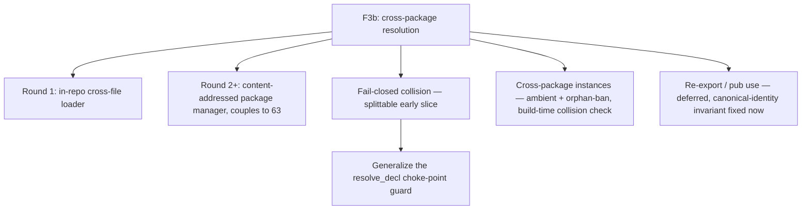

# ADR 0014 — Cross-package module resolution (F3b) and fail-closed single-namespace collision

- **Status:** Proposed — design-framing pass; the register below is for the
  operator's fork review **before** any spec-normative elaboration or build.
- **Date:** 2026-07-12
- **Deciders:** the operator (pending); framed by the Architect.
- **Relates to:** ADR 0008 (typeclass/instance coherence), ADR 0011
  (platform-dependent code / manifest ABI), spec `30-surface/33 §3`–`§5`,
  `docs/program/wp/catalog-taxonomy-paths-imports.md` (the addressing WP).

## Context

The operator greenlit **F3b (cross-package module resolution)** plus a
**fail-closed single-namespace collision** policy, and chose the
design-framing-first path: this ADR maps the space and enumerates the open
forks; the operator reviews them (especially cross-package instance
visibility); then round one is scoped. **Nothing here is spec-normative yet.**

### What is already built (grounded on `origin/main`, not this worktree)

> Branch note: `architect/work` is behind `main`; every anchor below was read
> from `origin/main`'s object store. Re-verify against the build base before
> implementing.

- **Intra-unit name resolution is mature and normative** (spec §3.3). Qualified
  / aliased / selective references are unambiguous by construction;
  local-over-imported **shadows lexically, never an error**; two `use`-opens of
  the **same unqualified name to different declarations** is an **ambiguity
  error** (`AmbiguousReference`) — order-independent, but raised **at the
  reference site**, not at import (`modules.rs` `bind_import` records
  `Binding::Ambiguous`; `resolve_ref` fires the error only on use). This honors
  a fail-closed *open* path already. **Keep it.**
- **F3b's addressing half is pinned and forward-compatible.** The catalog
  taxonomy WP designed a **total, role-blind path↔file bijection**
  (`import A.B.C` ⇔ `catalog/…/A/B/C.ken`; N dotted components → N−1 dirs + a
  leaf), and the parser already accepts dotted `import`/`use`/`module`. It
  **explicitly carves out the disk loader** as a distinct follow-on.
- **Instance coherence is decided (ADR 0008 + spec §5.3/§5.5).** One canonical
  instance per `(class, head-type)`; **orphans are a hard error** (an instance
  must name its class or its head-type's constructor in the declaring module);
  no overlap; ambiguity is a compile error. The orphan check is *purely
  syntactic and per-module* — "the canonical instance for a `(class, head-type)`
  pair is discoverable from those two modules alone" (§5.3).

### What is deferred, with zero design

- **The loader.** Two *different* deferral scopes exist in the tree and must be
  reconciled: spec §3.2 defers the **cross-package package manager** (F3b —
  content-addressed manifest/lockfile/registry, couples to supply-chain `63`);
  the catalog WP defers an **in-repo cross-*file* disk loader** (catalog-root
  anchor, file discovery, cycle detection, caching) even within one repo. The
  spec does not separately name the in-repo loader. Today a cross-file `import`
  that is not an earlier in-run `module { }` block yields **`UnboundName`**, and
  cross-*package* is strictly impossible (each package build is a fresh
  `ElabEnv`). Packages inline helpers (the "DS-1 inline-don't-import" pattern).
- **Fail-closed collision.** The global name table is a **single flat
  `HashMap<String, GlobalId>`** (`lib.rs:96`). Every top-level insert is a bare
  `HashMap::insert` — **duplicate key = silent last-writer-wins**, at ~17 sites
  (value decls in `elab.rs`, ctors/types in `data.rs`, classes at
  `elab.rs:4041`, instances at `elab.rs:4431/4530`). The **only** general
  uniqueness check is `elab.rs:5409`, and it fires **only** for checked-proof
  decls ("duplicate proof name"). The confirmed smoking gun: `data … = Eq`
  (`data.rs:102`) and `class Eq` (`elab.rs:4041`) both insert key `"Eq"` into
  the same flat map — whichever elaborates later **silently wins**.
- **The existing fail-closed guard is real but tiny.**
  `check_no_reserved_sugar_collision` (`resolve.rs:677`) *is* called at the
  `resolve_decl` choke-point (`resolve.rs:713`) — but it only tests membership
  in a **3-element** reserved list (`Refl`/`Axiom`/`absurd`); it does **not**
  consult live globals. Its own comments explain the narrowness: a blanket
  declaration-time reject would over-reject the legitimate **arity-gated**
  coexistence of a lower-arity `Eq`/`J` with the reserved sugar (`resolve.rs`
  `:653-664`). So the choke-point exists and is the right home; it is simply
  scoped to three names today.
- **No re-export.** There is no `pub use` / facade form; only a name's own
  module publishes it (`apply_import` has no re-export path).

### The three real gaps (my analysis — the survey is input, not law)

The Librarian namespacing survey (`local/research/namespacing-survey.md`) is a
**non-prescriptive** research report; it makes **no** per-principle "Ken honors
/ has a gap" finding. The gap assessment below is **mine**, derived against the
spec; I use the survey's numbered principles only as a vocabulary.

1. **P9 — fail-closed silent shadow.** Ken already honors P9 on the *open*
   path (ambiguity is a hard error). The gap is the **definition** path: a
   duplicate top-level *definition* is silent last-writer-wins, not an error.
2. **P4 — cross-package instances.** Instances are **ambient/global**:
   `instance_search` (`classes.rs:131`) is a bare `(class, head)` key lookup
   with **no** scope, import, `pub`, or exports table consulted. This is the
   surface shape the survey warns about (Haskell implicit-instance transport) —
   *but* Ken bans orphans, which is a materially different guarantee (see D4).
3. **P5 — re-export.** Absent. Needed once packages have public topologies.

## Recommended design shape

Four load-bearing recommendations, each expanded in the register:

- **Split the loader from the package manager.** Round one is the **in-repo
  cross-file loader** (the catalog WP's carved-out follow-on: path→file
  anchoring, discovery, cycle detection, caching), decoupled from the
  content-addressed manifest/registry (F3b-proper, which couples to `63`). This
  is a bounded capability with an already-pinned addressing convention.
- **Fail-closed is the splittable early slice.** It is near-shovel-ready:
  **generalize the existing `resolve_decl` choke-point guard** to reject a
  duplicate top-level *definition* over the unit's globals (a `seen`-set),
  preserving the arity-gated-sugar exclusion. It lands **ahead of** the loader
  and needs no loader.
- **Cross-package instances stay ambient — coherence comes from the orphan
  ban, not from an import channel.** Recommend **not** import-gating instances
  (see D4 for the soundness argument); adopt the survey's *provenance
  diagnostics* without its *import-gating*. **Flagged for the operator.**
- **Re-export is deferred**, but fix the invariant now: every declaration has
  **one canonical identity** even under multiple public paths.

## Open-decisions register

Format per entry: **Fork** · **Options** · **Recommendation** · **Disposition**
(decide-now / defer) · **Operator-flag**. Stable tags `MRES-n`.

### MRES-1 — Loader scope: in-repo loader vs package manager
- **Fork.** Is round one an **in-repo cross-file loader** only, or coupled from
  the start to the content-addressed manifest/lockfile/registry?
- **Options.** (a) In-repo loader first, package manager as a later round;
  (b) build the manifest/registry-anchored loader in one pass.
- **Recommendation.** (a). The catalog WP already carved the in-repo loader as a
  standalone follow-on; the content-addressed layer couples to supply-chain `63`
  and should not gate the far simpler in-repo capability.
- **Disposition.** Decide now (scopes round one).

### MRES-2 — Loader mechanism
- **Fork.** Path→file anchoring, discovery, cycle detection, caching for the
  in-repo loader.
- **Options.** Adopt the catalog WP's total path↔file bijection as the
  addressing; add a catalog-root anchor, eager vs lazy discovery, cycle
  detection (error vs SCC-tolerant), and a per-run module cache.
- **Recommendation.** Reuse the pinned bijection; **cycle = hard error**
  (simplest, matches the surface-diagnostic posture); lazy discovery from import
  edges; cache on `ElabEnv`. No kernel/`trusted_base()` delta (surface layer).
- **Disposition.** Decide the posture now; mechanics are round-one build detail.

### MRES-3 — File-topology bijection strictness *(genuine tension)*
- **Fork.** Keep the catalog WP's **strict** path↔import identity, or relax
  toward "build-unit discoverable, declarations may nest logically without a
  forced 1:1 file layout"?
- **Options.** (a) Strict leaf-file bijection (catalog WP); (b) relaxed —
  importing a build unit does **not** implicitly open its nested namespaces.
- **Recommendation.** Keep **(a)** for round one — auditability and a total,
  role-blind rule are worth more than layout flexibility while the surface is
  small. Record (b) as a possible later relaxation once nested-namespace
  ergonomics bite.
- **Disposition.** Decide now (the loader is built against one or the other).
- **Operator-flag.** A real design tension between two in-tree artifacts;
  worth a conscious call.

### MRES-4 — Cross-package instance visibility *(THE deep question)*
- **Fork.** How do class/instance dictionaries cross package boundaries?
- **Options.**
  - **(A) Ambient-with-coherence** — instances stay globally visible (as
    today); the **orphan ban** (ADR 0008, §5.3) is extended to a **build-time
    cross-package canonical-instance collision check**; add **provenance
    diagnostics** (report which package an instance came from). Instances are
    **not** on the `import`/`pub` channel.
  - **(B) Separate contextual-import channel** — instances ride a distinct,
    visible import channel (Scala 3 `given` imports / Lean `open scoped`);
    an instance is in scope only if its channel is imported.
- **Recommendation.** **(A).** ADR 0008 makes the resolved dictionary
  *semantically load-bearing* and resolution "a function of the type, stable
  program-wide." Import-gating (B) would let the **same** `Monoid A` resolve in
  a module that imported the instance and **fail or differ** in one that did
  not — breaking the program-wide stability the coherence *soundness* argument
  depends on. The Haskell anti-pattern the survey warns about is *unrestricted
  orphans* making ambient transport incoherent; **Ken bans orphans**, so ambient
  visibility is coherent by construction, and §5.3 already guarantees the
  canonical instance is discoverable from two modules alone — so a cross-package
  collision check is decidable without whole-program information. Adopt the
  survey's *provenance/visibility* half (diagnostics) **without** its
  *import-gating* half. ADR 0008's own "Revisit if" pre-authorizes the
  registry-level ownership check as a supply-chain concern, not a language
  change.
- **Disposition.** Decide now — it shapes every later round.
- **Operator-flag. THE flagged decision.** (A) is a real position, not a
  default; it deliberately declines the survey's separate-channel
  recommendation on a soundness-of-coherence argument. Confirm or override.

### MRES-5 — Fail-closed: is a duplicate top-level name an error?
- **Fork.** Is a second top-level *definition* of the same single-namespace
  name a hard error, or does last-writer-win stand?
- **Options.** (a) Hard error (fail-closed); (b) keep silent last-writer-wins;
  (c) warn-only.
- **Recommendation.** **(a).** Silent last-writer-wins is a footgun with no
  redeeming use; fail-closed matches the surface-diagnostic posture and the
  already-fail-closed *open* path. This is the **minimal early slice** — bounded
  and near-shovel-ready.
- **Disposition.** Decide now; buildable ahead of the loader.

### MRES-6 — Fail-closed scope: definition-vs-definition vs shadowing
- **Fork.** Does fail-closed also forbid a definition **shadowing** an
  imported/prelude name, or only two definitions of the same name in one unit?
- **Options.** (a) Error only on **duplicate definition** in one unit; keep
  §3.3's documented local-over-imported shadowing; (b) also error on
  shadowing an import/prelude.
- **Recommendation.** **(a).** §3.3 already makes local-over-imported a
  *feature* ("never an error"); a blanket shadow-reject contradicts it and (per
  the guard's own caveat) over-rejects legitimate arity-gated `Eq`/`J`
  coexistence. Distinguish sharply: **two definitions of one name = error**; **a
  definition shadowing an import = allowed** (§3.3). Optionally warn on
  prelude-shadow (see MRES-10).
- **Disposition.** Decide now (pairs with MRES-5).

### MRES-7 — class/ctor cross-namespace collision (`class Eq` vs ctor `Eq`)
- **Fork.** Under Ken's single-flat-namespace (types-are-terms, the D8-③
  ruling), `class Eq` and constructor `Eq` genuinely collide. Does fail-closed
  reject it, and how is it resolved?
- **Options.** (a) Fail-closed **rejects**; resolve by qualifying the
  constructor (the survey's #8 "Fork-B", `OrdResult.Eq`) or renaming;
  (b) partition type-vs-term namespaces so they coexist (survey P6); (c) leave
  silent last-writer-wins.
- **Recommendation.** **(a).** Single-flat-namespace is settled (D8-③), so this
  *is* a real duplicate and fail-closed should reject it. **Fail-closed
  complements, does not subsume, Fork-B**: fail-closed turns the collision into
  an *error*; qualified constructors are the *escape* that resolves it. Whether
  to build qualified-constructor disambiguation *now* or let users rename is a
  separable investment.
- **Disposition.** Decide the rejection now; the qualified-ctor escape is a
  scope call.
- **Operator-flag.** Interaction with the prior #8 disambiguation forks —
  confirm fail-closed as the 4th option (hard error) that complements them.

### MRES-8 — Fail-closed mechanism: generalize the choke-point guard
- **Fork.** Where does the duplicate-definition check live?
- **Options.** (a) Extend `check_no_reserved_sugar_collision` at the existing
  `resolve_decl` choke-point (`resolve.rs:713`) to consult a `seen`-set of the
  unit's globals; (b) guard each of the ~17 `globals.insert` sites; (c) a new
  post-pass.
- **Recommendation.** **(a).** The choke-point already exists and was
  deliberately chosen over the "~17 downstream insert sites" (the guard's own
  comment). Extend it to a duplicate-definition check, **preserving** the
  arity-gated-sugar exclusion. Bounded, single-funnel, near-shovel-ready — the
  concrete early-slice mechanism.
- **Disposition.** Decide now (round-one build shape for MRES-5).

### MRES-9 — Re-export / facade (`pub use`)
- **Fork.** Add an explicit re-export form for public package topologies?
- **Options.** (a) Defer to a post-loader round; (b) build now.
- **Recommendation.** **(a) defer** — it is not needed until packages have
  public topologies (post-loader). But **fix the invariant now**: every
  declaration has **one canonical identity** even under multiple public paths,
  and re-export must be collision-checked with "defined at" vs "re-exported as"
  diagnostics (survey P5). Designing the invariant now keeps the later form
  cheap and prevents API-drift.
- **Disposition.** Defer the form; record the invariant now.

### MRES-10 — Cross-package + prelude shadowing precedence
- **Fork.** §3.3 specs intra-unit local-over-imported; cross-package + prelude
  precedence is unspecified. What is the total order, and may a user shadow the
  prelude?
- **Options.** Precedence **local > selective/qualified import > open import >
  prelude**; user-shadows-prelude either (a) allowed with a warning or
  (b) allowed silently or (c) error.
- **Recommendation.** Adopt that total precedence (extends §3.3's innermost-wins
  monotonically); **(a) allow prelude-shadow with a warning** — consistent with
  local-over-imported being a feature, but the prelude is special enough to
  surface. Cross-package duplicate *definitions* remain an error (MRES-5); this
  entry is only about *resolution precedence* when spellings legitimately layer.
- **Disposition.** Decide the precedence now; warn-vs-silent is a small call.

## Consequences

- **Splittability.** MRES-5/6/7/8 (fail-closed) form a **self-contained early
  round** with no loader dependency — the operator's requested splittable slice.
  MRES-1/2/3 (loader) are round two; MRES-4 (instances) is decided early but
  built with the loader; MRES-9 (re-export) is latest.
- **No kernel/TCB delta.** Every mechanism here is a **surface/elaboration**
  concern — the module system elaborates away to the flat `Σ` with zero
  `trusted_base()` delta (§3 status). Fail-closed is an *elaborator* check;
  instance collision is an *elaborator*/build check; the loader is I/O + surface
  resolution.
- **Honesty about the boundary.** Fail-closed converts a silent footgun into a
  checked diagnostic; ambient-coherent instances make "the `C T` instance" a
  program-wide-stable denotation the prover can rely on across packages — the
  same legibility dividend ADR 0008 bought intra-package.

## Revisit if

- A real workflow needs *import-scoped* instances that ambient-with-coherence
  cannot serve (MRES-4 (B)) — weigh against program-wide stability.
- Nested-namespace ergonomics make the strict bijection (MRES-3 (a)) painful.
- The content-addressed package manager (MRES-1) forces addressing changes that
  the in-repo loader did not anticipate.
