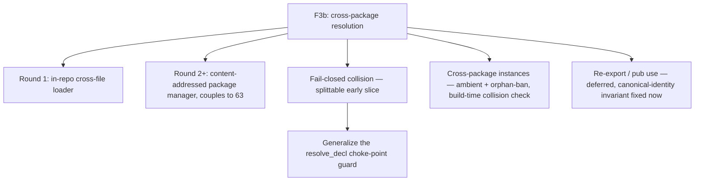

# ADR 0014 — Cross-package module resolution (F3b) and fail-closed single-namespace collision

- **Status:** Accepted (design) — operator fork review complete 2026-07-12,
  incl. the MRES-4a/b/c sub-round and the surface keyword (`admits`). The design
  and open-decisions register are settled; spec-normative elaboration and build
  scoping follow (round 1 = MRES-5/7/8; see Consequences).
- **Date:** 2026-07-12 (framed); 2026-07-12 (operator review folded).
- **Deciders:** the operator (fork review 2026-07-12); framed by the Architect.
- **Relates to:** ADR 0008 (typeclass/instance coherence), ADR 0011
  (platform-dependent code / manifest ABI), spec `30-surface/33 §3`–`§5`,
  `docs/program/wp/catalog-taxonomy-paths-imports.md` (the addressing WP).

## Operator fork review — disposition (2026-07-12)

| Fork | Disposition |
|---|---|
| MRES-1, MRES-2 | **Accepted** + multi-catalog forward-compat added (plural-ready roots) |
| MRES-3 | **Accepted (a) strict** |
| MRES-4 | **Accepted (A) ambient-with-coherence**, refined into the **program abstraction** — keyword **`admits`** (operator-chosen); admitted-package boundary; scaling validated (O(instances), not O(pkg²)); provenance **required**. Sub-forks **all Accepted**: 4a separable-but-co-locatable, 4b only-multi-package, 4c direct-explicit + transitive-auto with a compiled-package instance-manifest invariant (source==compiled) |
| MRES-5, MRES-7, MRES-8 | **Accepted** — the fail-closed duplicate-definition slice (round-1 candidate) |
| MRES-6 | **Operator OVERRODE** the recommendation — local/import name clash is now an **error**, with **explicit import-exclusion language**; reverses §3.3's local-over-imported shadowing |
| MRES-9 | **Accepted** — defer the form, fix the canonical-identity invariant now |
| MRES-10 | **Accepted (precedence order)**; the prelude-shadow warn-and-allow softening is **overridden** — folds under MRES-6's explicit-not-implicit discipline |

Cross-cutting: **multi-catalog** (standard + org + vendor roots) is not built
now but the loader/addressing must not preclude it (MRES-1/2). Below, each
entry is updated to its post-review state; superseded recommendation prose is
retained only where it still grounds the accepted decision.

## Context

The operator greenlit **F3b (cross-package module resolution)** plus a
**fail-closed single-namespace collision** policy, and chose the
design-framing-first path: this ADR maps the space and enumerates the open
forks; the operator reviews them (especially cross-package instance
visibility); then round one is scoped. **Nothing here is spec-normative yet.**

### What is already built (grounded on `origin/main`, not this worktree)

> Branch note: `architect/work` is behind `main`; every anchor below was read
> from `origin/main`'s object store. Re-verify against the build base before
> implementing.

- **Intra-unit name resolution is mature and normative** (spec §3.3). Qualified
  / aliased / selective references are unambiguous by construction;
  local-over-imported **shadows lexically, never an error**; two `use`-opens of
  the **same unqualified name to different declarations** is an **ambiguity
  error** (`AmbiguousReference`) — order-independent, but raised **at the
  reference site**, not at import (`modules.rs` `bind_import` records
  `Binding::Ambiguous`; `resolve_ref` fires the error only on use). This honors
  a fail-closed *open* path already. **Keep it.**
- **F3b's addressing half is pinned and forward-compatible.** The catalog
  taxonomy WP designed a **total, role-blind path↔file bijection**
  (`import A.B.C` ⇔ `catalog/…/A/B/C.ken`; N dotted components → N−1 dirs + a
  leaf), and the parser already accepts dotted `import`/`use`/`module`. It
  **explicitly carves out the disk loader** as a distinct follow-on.
- **Instance coherence is decided (ADR 0008 + spec §5.3/§5.5).** One canonical
  instance per `(class, head-type)`; **orphans are a hard error** (an instance
  must name its class or its head-type's constructor in the declaring module);
  no overlap; ambiguity is a compile error. The orphan check is *purely
  syntactic and per-module* — "the canonical instance for a `(class, head-type)`
  pair is discoverable from those two modules alone" (§5.3).

### What is deferred, with zero design

- **The loader.** Two *different* deferral scopes exist in the tree and must be
  reconciled: spec §3.2 defers the **cross-package package manager** (F3b —
  content-addressed manifest/lockfile/registry, couples to supply-chain `63`);
  the catalog WP defers an **in-repo cross-*file* disk loader** (catalog-root
  anchor, file discovery, cycle detection, caching) even within one repo. The
  spec does not separately name the in-repo loader. Today a cross-file `import`
  that is not an earlier in-run `module { }` block yields **`UnboundName`**, and
  cross-*package* is strictly impossible (each package build is a fresh
  `ElabEnv`). Packages inline helpers (the "DS-1 inline-don't-import" pattern).
- **Fail-closed collision.** The global name table is a **single flat
  `HashMap<String, GlobalId>`** (`lib.rs:96`). Every top-level insert is a bare
  `HashMap::insert` — **duplicate key = silent last-writer-wins**, at ~17 sites
  (value decls in `elab.rs`, ctors/types in `data.rs`, classes at
  `elab.rs:4041`, instances at `elab.rs:4431/4530`). The **only** general
  uniqueness check is `elab.rs:5409`, and it fires **only** for checked-proof
  decls ("duplicate proof name"). The confirmed smoking gun: `data … = Eq`
  (`data.rs:102`) and `class Eq` (`elab.rs:4041`) both insert key `"Eq"` into
  the same flat map — whichever elaborates later **silently wins**.
- **The existing fail-closed guard is real but tiny.**
  `check_no_reserved_sugar_collision` (`resolve.rs:677`) *is* called at the
  `resolve_decl` choke-point (`resolve.rs:713`) — but it only tests membership
  in a **3-element** reserved list (`Refl`/`Axiom`/`absurd`); it does **not**
  consult live globals. Its own comments explain the narrowness: a blanket
  declaration-time reject would over-reject the legitimate **arity-gated**
  coexistence of a lower-arity `Eq`/`J` with the reserved sugar (`resolve.rs`
  `:653-664`). So the choke-point exists and is the right home; it is simply
  scoped to three names today.
- **No re-export.** There is no `pub use` / facade form; only a name's own
  module publishes it (`apply_import` has no re-export path).

### The three real gaps (my analysis — the survey is input, not law)

The Librarian namespacing survey (`local/research/namespacing-survey.md`) is a
**non-prescriptive** research report; it makes **no** per-principle "Ken honors
/ has a gap" finding. The gap assessment below is **mine**, derived against the
spec; I use the survey's numbered principles only as a vocabulary.

1. **P9 — fail-closed silent shadow.** Ken already honors P9 on the *open*
   path (ambiguity is a hard error). The gap is the **definition** path: a
   duplicate top-level *definition* is silent last-writer-wins, not an error.
2. **P4 — cross-package instances.** Instances are **ambient/global**:
   `instance_search` (`classes.rs:131`) is a bare `(class, head)` key lookup
   with **no** scope, import, `pub`, or exports table consulted. This is the
   surface shape the survey warns about (Haskell implicit-instance transport) —
   *but* Ken bans orphans, which is a materially different guarantee (see D4).
3. **P5 — re-export.** Absent. Needed once packages have public topologies.

## Recommended design shape

Four load-bearing recommendations, each expanded in the register:

- **Split the loader from the package manager.** Round one is the **in-repo
  cross-file loader** (the catalog WP's carved-out follow-on: path→file
  anchoring, discovery, cycle detection, caching), decoupled from the
  content-addressed manifest/registry (F3b-proper, which couples to `63`). This
  is a bounded capability with an already-pinned addressing convention.
- **Fail-closed is the splittable early slice.** It is near-shovel-ready:
  **generalize the existing `resolve_decl` choke-point guard** to reject a
  duplicate top-level *definition* over the unit's globals (a `seen`-set),
  preserving the arity-gated-sugar exclusion. It lands **ahead of** the loader
  and needs no loader.
- **Cross-package instances stay ambient — coherence comes from the orphan
  ban, not from an import channel.** Recommend **not** import-gating instances
  (see D4 for the soundness argument); adopt the survey's *provenance
  diagnostics* without its *import-gating*. **Flagged for the operator.**
- **Re-export is deferred**, but fix the invariant now: every declaration has
  **one canonical identity** even under multiple public paths.

## Open-decisions register

Format per entry: **Fork** · **Options** · **Recommendation** · **Status**
(post-operator-review). Stable tags `MRES-n`; sub-forks `MRES-na/b/c`.

### MRES-1 — Loader scope: in-repo loader vs package manager
- **Fork.** Is round one an **in-repo cross-file loader** only, or coupled from
  the start to the content-addressed manifest/lockfile/registry?
- **Options.** (a) In-repo loader first, package manager as a later round;
  (b) build the manifest/registry-anchored loader in one pass.
- **Recommendation.** (a). The catalog WP already carved the in-repo loader as a
  standalone follow-on; the content-addressed layer couples to supply-chain `63`
  and should not gate the far simpler in-repo capability.
- **Status: ACCEPTED (a)** — in-repo loader first, package manager later.
- **Multi-catalog forward-compat (operator, cross-cutting).** Not built now, but
  the addressing must **not preclude** multiple catalog roots (standard + org +
  vendor). The package-manager round carries multi-root resolution/precedence;
  the in-repo loader must be written so a single root is one entry of a
  plural-ready root list, never a hard-coded singleton.

### MRES-2 — Loader mechanism
- **Fork.** Path→file anchoring, discovery, cycle detection, caching for the
  in-repo loader.
- **Options.** Adopt the catalog WP's total path↔file bijection as the
  addressing; add a catalog-root anchor, eager vs lazy discovery, cycle
  detection (error vs SCC-tolerant), and a per-run module cache.
- **Recommendation.** Reuse the pinned bijection; **cycle = hard error**
  (simplest, matches the surface-diagnostic posture); lazy discovery from import
  edges; cache on `ElabEnv`. No kernel/`trusted_base()` delta (surface layer).
- **Status: ACCEPTED** — posture as above. **Multi-catalog:** the catalog-root
  anchor is a **root list** (a resolver walks roots in a to-be-defined
  precedence), not a single path; round one populates it with one root but the
  resolution API takes the plural form so multi-root is a data change, not a
  rewrite.

### MRES-3 — File-topology bijection strictness *(genuine tension)*
- **Fork.** Keep the catalog WP's **strict** path↔import identity, or relax
  toward "build-unit discoverable, declarations may nest logically without a
  forced 1:1 file layout"?
- **Options.** (a) Strict leaf-file bijection (catalog WP); (b) relaxed —
  importing a build unit does **not** implicitly open its nested namespaces.
- **Recommendation.** Keep **(a)** for round one — auditability and a total,
  role-blind rule are worth more than layout flexibility while the surface is
  small. Record (b) as a possible later relaxation once nested-namespace
  ergonomics bite.
- **Status: ACCEPTED (a) strict** — keep the total, role-blind bijection;
  relaxation (b) recorded for a later round if nested-namespace ergonomics bite.

### MRES-4 — Cross-package instance visibility *(THE deep question)*
- **Fork.** How do class/instance dictionaries cross package boundaries?
- **Options.**
  - **(A) Ambient-with-coherence** — instances stay globally visible (as
    today); the **orphan ban** (ADR 0008, §5.3) is extended to a **build-time
    cross-package canonical-instance collision check**; add **provenance
    diagnostics** (report which package an instance came from). Instances are
    **not** on the `import`/`pub` channel.
  - **(B) Separate contextual-import channel** — instances ride a distinct,
    visible import channel (Scala 3 `given` imports / Lean `open scoped`);
    an instance is in scope only if its channel is imported.
- **Recommendation.** **(A).** ADR 0008 makes the resolved dictionary
  *semantically load-bearing* and resolution "a function of the type, stable
  program-wide." Import-gating (B) would let the **same** `Monoid A` resolve in
  a module that imported the instance and **fail or differ** in one that did
  not — breaking the program-wide stability the coherence *soundness* argument
  depends on. The Haskell anti-pattern the survey warns about is *unrestricted
  orphans* making ambient transport incoherent; **Ken bans orphans**, so ambient
  visibility is coherent by construction, and §5.3 already guarantees the
  canonical instance is discoverable from two modules alone — so a cross-package
  collision check is decidable without whole-program information. Adopt the
  survey's *provenance/visibility* half (diagnostics) **without** its
  *import-gating* half. ADR 0008's own "Revisit if" pre-authorizes the
  registry-level ownership check as a supply-chain concern, not a language
  change.
- **Status: ACCEPTED (A) — refined into the program abstraction (below).**

#### MRES-4 refinement — the `program` abstraction (operator, 2026-07-12)

The operator's sharpening: **"program-wide stable" presupposes a "program"**,
which Ken has not defined — it has compilation units and packages, no closed
boundary over which "program-wide" is meaningful. Define one, and use it to
dissolve the ambient-vs-explicit tension.

- **The `program` file.** A distinguished source file declares a `program` and
  **explicitly lists the packages whose instances are admitted** for use across
  the program's other compilation units. Within the admitted set, instance
  resolution is **ambient** (canonical, program-wide-stable per ADR 0008 — now
  "program" is a defined boundary). Using or importing an instance from a
  package **not** admitted at the program level is a **hard error**.
- **Why this is the honest resolution.** Ambient *resolution* (the soundness
  property — one canonical dict per `(class, head)`) operates **inside** an
  **explicitly declared** boundary. Explicit-over-implicit is honored where it
  matters — at the *boundary* (you declare which packages' instances are in
  play, the load-bearing implicit channel) — while resolution stays canonical
  *inside*, preserving ADR 0008's soundness. It is neither Haskell's
  unrestricted ambient transport nor Scala's per-use import-gating.
- **Shape (keyword `admits` — operator-chosen 2026-07-12; grammar to the
  enclave).** A `program` header plus an `admits` list of package paths (reusing
  the MRES-2 dotted addressing): `program App` / `admits Core.LawfulClasses,
  Data.Collections.Map, …`. The **admission check** is a new elaborator gate:
  when `instance_search` resolves an instance, verify its defining package ∈ the
  program's admitted set; unadmitted ⇒ `UnadmittedInstance` error. It composes
  with (does not replace) the existing orphan + overlap checks.
- **Relation to the rest.** (a) *Loader/dependency:* declaring a dependency
  makes a package's `pub` names importable; **admission is a separate, explicit
  opt-in** that additionally admits its instances into ambient resolution — the
  ordinary-name channel stays the normal import system, the load-bearing
  instance channel is explicit. (b) *Package manager:* the manager
  resolves/content-addresses the dependency graph; the admitted set is the
  language-level projection "which of those provide ambient instances", and the
  manager can generate or validate the list. (c) *Multi-catalog:* admitted
  packages are addressed by path, so an org- or vendor-catalog package is
  admitted identically — multi-catalog is accommodated for free.

**Scaling — validated against the code (the operator's decision-blocker).**
Confirmed, not asserted:
- **Ambient resolution is O(1).** `instance_search` (`classes.rs:131`) is a
  single `HashMap` `.get()` on key `(class_name, head_type_name)`
  (`classes.rs:98`).
- **The cross-package coherence check is orphan-ban-bounded — linear in
  instances, NOT quadratic in packages.** The orphan check (§5.3) guarantees the
  canonical instance for a `(class, head)` pair is co-located with its class- or
  head-module — "discoverable from those two modules alone." Detecting a
  competing instance is an **O(1) key-collision test per instance**
  (`instances.contains_key(&instance_key)`, the overlap check `elab.rs:4266`),
  so across the admitted set the coherence pass is **O(total instances
  declared)**, never a pairwise O(packages²) comparison. The admission check
  adds one O(1) set-membership test per resolved instance. This directly retires
  the quadratic-scaling fear.
- **Provenance diagnostics are a REQUIRED deliverable** (not optional): on
  resolution, report the admitted package an instance came from; on an
  `UnadmittedInstance` error, name the unadmitted package + the instance; on a
  coherence collision, name both defining packages.

**Sub-forks the program abstraction opened — all resolved in the operator's
2026-07-12 sub-round:**

##### MRES-4a — Is the `program` file also the entry point? — **ACCEPTED**
- **Fork.** Does `program App` also designate the runtime entry (`main`), or is
  entry a separate declaration?
- **Status: ACCEPTED (operator, 2026-07-12) — separable but co-locatable.**
  Admission is an *elaboration-time instance-boundary* concern; an entry point
  is a *runtime* concern. They are distinct declarations that a `program` file
  may both host.

##### MRES-4b — Program file required only for multi-package? — **ACCEPTED**
- **Fork.** Must every build have a program file, or only builds spanning ≥2
  instance-providing packages?
- **Status: ACCEPTED (operator, 2026-07-12) — only multi-package.** A single
  package implicitly **self-admits** (its own instances are always in play), so
  single-package / catalog-dev stays zero-ceremony; the `program` file becomes
  required exactly when ≥2 packages contribute instances across unit boundaries
  — precisely when "whose instances are admitted" is a real question.

##### MRES-4c — Transitive admission & source==compiled — **ACCEPTED**
- **Fork.** Admitting package `P` — does the program also get `P`'s *own*
  instance dependencies (deps-of-deps), or must every instance-providing package
  be listed explicitly?
- **The governing constraint (operator).** A **source** import of `P` puts `P`'s
  units in the program's compilation graph, so `P`'s internal use of `Q.Bar`
  must resolve → `Q`'s instances must be in the program's ambient environment. A
  **compiled** import of `P` adds nothing to the graph — `P`'s use of `Q` is
  already resolved and baked into `P`'s artifact. **Least-surprise requires both
  to yield the same instance environment.** So `Q`'s instances (the ones `P`
  uses) must be present **either way, without the author listing `Q`** — which
  means **transitive instance-flow is semantically forced**; requiring an
  explicit list of every transitive provider would break the source==compiled
  equivalence (compiled `P` never required listing `Q`).
- **Status: ACCEPTED (operator) — direct-explicit + transitive-auto.**
  This reverses my original framing's lean (I had leaned explicit-only for the
  transitive set; the least-surprise argument defeats it — recorded honestly).
  The resolved model:
  1. **The program explicitly names its DIRECT instance dependencies** (the
     packages whose instances its *own* units resolve against) — explicit where
     the program itself reaches for an instance.
  2. **Transitive instances flow automatically** — a direct dependency's own
     committed instance-uses are part of the program's coherent environment,
     identical whether that dependency is imported as source or compiled. The
     author does **not** list them.
  3. **The coherence check spans the full transitive closure** — one canonical
     instance per `(class, head)` across the program's own admits *and* every
     transitive use; a conflict is a hard error. Still **O(total instances)**,
     orphan-ban-bounded — the closure does not reintroduce quadratic cost.
  4. **The source==compiled invariant forces a compiled-package instance
     manifest** — a compiled artifact must record the canonical instances it
     commits to, so a compiled import feeds the coherence check *identically* to
     a source import's compilation. Today everything is source (the in-repo
     loader, MRES-1, is source-based); the manifest is a **forward-compat
     requirement on the package-manager round** (the compiled-vs-source import
     seam the operator flagged), same pattern as the multi-catalog constraint.
     Recorded now; built with the package manager.

### MRES-5 — Fail-closed: is a duplicate top-level name an error?
- **Fork.** Is a second top-level *definition* of the same single-namespace
  name a hard error, or does last-writer-win stand?
- **Options.** (a) Hard error (fail-closed); (b) keep silent last-writer-wins;
  (c) warn-only.
- **Recommendation.** **(a).** Silent last-writer-wins is a footgun with no
  redeeming use; fail-closed matches the surface-diagnostic posture and the
  already-fail-closed *open* path. This is the **minimal early slice** — bounded
  and near-shovel-ready.
- **Status: ACCEPTED (a)** — duplicate top-level definition in one unit is a
  hard error. Round-1 candidate (with MRES-7/8).

### MRES-6 — Local/import name clash: error + explicit import-exclusion
- **Fork.** When a top-level **local definition** and an **imported** name
  collide, is it silent local-wins (my original rec (a)) or an error?
- **Status: OPERATOR OVERRODE (a) — it is an ERROR.** The operator ruled that
  implicit shadowing is unacceptable for agents and humans alike: a local
  definition and an imported definition with the same name is a **clash error**,
  and Ken must provide **explicit import-specification language to
  exclude/block** a conflicting name so that any surviving name is intentional.
  **This reverses §3.3's "Local over imported … never an error."**
- **Design (mine, to hand the enclave).**
  - **Error-on-clash rule.** A name bound both by a top-level local definition
    **and** by an import is an `AmbiguousReference`/clash error **unless** the
    import explicitly drops (or renames) that name, leaving a single binding.
    Order-independent; raised whether or not the name is used (a latent clash is
    still a clash — it is fail-closed, like MRES-5).
  - **Scope the reversal precisely.** This governs **top-level definition vs
    import** clashes only. **Ordinary lexical shadowing is untouched** — a
    function parameter, `let`, or `λ` binder in a narrower scope still shadows
    an outer/imported name (innermost wins); that is the term language, not a
    module-name clash. §3.3's "narrower scope, innermost wins" survives for
    lexical binders; only its *module-level local-over-import* clause reverses.
  - **Import-exclusion grammar** (the Haskell-`hiding` / Agda-`using`/`hiding`
    family; extends §3.2's forms — spelling deferred to the enclave):
    - `import M hiding (foo, Bar)` — all of `M` except `foo`, `Bar` (negative).
    - `import M (foo, Bar)` — positive selection already exists (§3.2).
    - Per-name rename `import M (foo as myFoo)` — resolves a clash by renaming
      (new form; `import M as N` today aliases the *module*, not a name).
  - **Reconcile §3.3.** The "Local over imported" bullet changes to: *a name
    bound both locally and by an import is a **clash error**; resolve it by
    positively selecting, `hiding`, or renaming — silent local-win is not
    permitted.* (Normative §3.3 edit — the enclave elaborates it; I flag the
    clause change.)
- **Round placement.** MRES-6 **couples to the import system** (the clash
  detection lives in the import-binding path — today `bind_import` silently
  refuses to touch a `locals` name, `modules.rs:75-77` — and the `hiding`/rename
  grammar is new). It is therefore **heavier than the minimal MRES-5/7/8 slice**
  and rides the loader/import round, **not** round one (see Consequences).

### MRES-7 — class/ctor cross-namespace collision (`class Eq` vs ctor `Eq`)
- **Fork.** Under Ken's single-flat-namespace (types-are-terms, the D8-③
  ruling), `class Eq` and constructor `Eq` genuinely collide. Does fail-closed
  reject it, and how is it resolved?
- **Options.** (a) Fail-closed **rejects**; resolve by qualifying the
  constructor (the survey's #8 "Fork-B", `OrdResult.Eq`) or renaming;
  (b) partition type-vs-term namespaces so they coexist (survey P6); (c) leave
  silent last-writer-wins.
- **Recommendation.** **(a).** Single-flat-namespace is settled (D8-③), so this
  *is* a real duplicate and fail-closed should reject it. **Fail-closed
  complements, does not subsume, Fork-B**: fail-closed turns the collision into
  an *error*; qualified constructors are the *escape* that resolves it. Whether
  to build qualified-constructor disambiguation *now* or let users rename is a
  separable investment.
- **Status: ACCEPTED (a)** — fail-closed rejects the collision (the 4th option,
  complementing the #8 disambiguation forks); qualified-ctor escape is a
  separable scope call. Round-1 candidate (with MRES-5/8).

### MRES-8 — Fail-closed mechanism: generalize the choke-point guard
- **Fork.** Where does the duplicate-definition check live?
- **Options.** (a) Extend `check_no_reserved_sugar_collision` at the existing
  `resolve_decl` choke-point (`resolve.rs:713`) to consult a `seen`-set of the
  unit's globals; (b) guard each of the ~17 `globals.insert` sites; (c) a new
  post-pass.
- **Recommendation.** **(a).** The choke-point already exists and was
  deliberately chosen over the "~17 downstream insert sites" (the guard's own
  comment). Extend it to a duplicate-definition check, **preserving** the
  arity-gated-sugar exclusion. Bounded, single-funnel, near-shovel-ready — the
  concrete early-slice mechanism.
- **Status: ACCEPTED (a)** — round-1 build mechanism for MRES-5/7.

### MRES-9 — Re-export / facade (`pub use`)
- **Fork.** Add an explicit re-export form for public package topologies?
- **Options.** (a) Defer to a post-loader round; (b) build now.
- **Recommendation.** **(a) defer** — it is not needed until packages have
  public topologies (post-loader). But **fix the invariant now**: every
  declaration has **one canonical identity** even under multiple public paths,
  and re-export must be collision-checked with "defined at" vs "re-exported as"
  diagnostics (survey P5). Designing the invariant now keeps the later form
  cheap and prevents API-drift.
- **Status: ACCEPTED** — defer the `pub use` form to a post-loader round; the
  canonical-identity invariant is recorded now.

### MRES-10 — Cross-package + prelude shadowing precedence
- **Fork.** §3.3 specs intra-unit local-over-imported; cross-package + prelude
  precedence is unspecified. What is the total order, and may a user shadow the
  prelude?
- **Options.** Precedence **local > selective/qualified import > open import >
  prelude**; user-shadows-prelude either (a) allowed with a warning or
  (b) allowed silently or (c) error.
- **Status: ACCEPTED (precedence order); warn-and-allow OVERRIDDEN.** The total
  precedence **local > selective/qualified import > open import > prelude** is
  accepted for *resolution of legitimately-distinct layered names*. But the
  operator overrode the "allow prelude-shadow with a warning" softening:
  **prelude-shadow is governed by the same explicit-not-implicit discipline as
  MRES-6** — a genuine *clash* (same name, different declaration) against the
  prelude is an **error**, resolved by explicit exclusion (`hiding` the prelude
  name), never warn-and-allow. Note the coupling this creates: error-on-prelude-
  clash is ergonomic **only if the prelude is deliberately small** (the clash
  surface is bounded) — which reinforces the small-prelude / small-auditable
  direction. Recorded as a design constraint on the prelude.

## Consequences

- **Splittability / round plan (post-review).**
  - **Round 1 — fail-closed duplicate-definition slice: MRES-5 + MRES-7 +
    MRES-8.** "Two top-level definitions of one name in a single unit = error"
    (incl. the `class Eq`/ctor `Eq` case), implemented by generalizing the
    `resolve_decl` choke-point guard. **No loader and no import-system
    dependency** — it acts on one unit's own globals. Cleanly separable and
    near-shovel-ready, exactly the operator's requested early slice.
  - **MRES-6 (local/import clash + import-exclusion) is a FAST-FOLLOW, not round
    1.** It couples to the import system (clash detection in the import-binding
    path + new `hiding`/rename grammar), heavier than the minimal slice, and it
    *matters* most once cross-file imports exist — so it rides the loader round
    (MRES-1/2/3), naturally alongside where imports become load-bearing.
  - **Round 2 — loader** (MRES-1/2/3, plural-ready roots) **+ MRES-6**.
  - **The program abstraction (MRES-4)** is built with the loader round (it
    needs the multi-package boundary); MRES-4a/b/c must be settled first (quick
    operator round). **MRES-9 (re-export)** is latest.
- **No kernel/TCB delta.** Every mechanism here is a **surface/elaboration**
  concern — the module system elaborates away to the flat `Σ` with zero
  `trusted_base()` delta (§3 status). Fail-closed is an *elaborator* check;
  instance collision is an *elaborator*/build check; the loader is I/O + surface
  resolution.
- **Honesty about the boundary.** Fail-closed converts a silent footgun into a
  checked diagnostic; ambient-coherent instances make "the `C T` instance" a
  program-wide-stable denotation the prover can rely on across packages — the
  same legibility dividend ADR 0008 bought intra-package.

## Revisit if

- A real workflow needs *import-scoped* instances that ambient-with-coherence
  cannot serve (MRES-4 (B)) — weigh against program-wide stability.
- Nested-namespace ergonomics make the strict bijection (MRES-3 (a)) painful.
- The content-addressed package manager (MRES-1) forces addressing changes that
  the in-repo loader did not anticipate.
