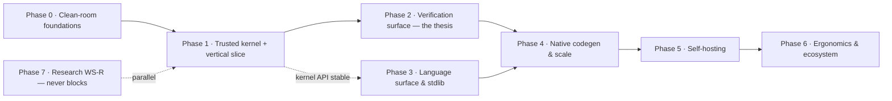

# Roadmap

Phased sequence for **Ken** — a new, MIT-licensed, Rust-hosted,
interpreter-first verified topos language. Phases are ordered by dependency and
risk, not calendar. Each has an **entry state**, an objective **exit gate**, and
the **work packages** (see `03-program-of-work.md`) it contains.

Governing principle: every step is additive and verified against the conformance
suite before the next; one clean change at a time; design (and spec) on paper
before foundational code; no claim a test has not confirmed; and AGPL source
never enters the implementation context.

---

## Phase 0 — Clean-room foundations

**Why first.** A new MIT language needs its legal, structural, and specification
groundwork before any kernel code is written — especially the spec that lets Ken
be implemented *from behavior* rather than from AGPL source.

**Entry:** decision to proceed (made).

**Work packages:** F1 (name + MIT + repo/Rust workspace + IP hygiene process),
F2 (**spec extraction**: language spec + conformance test corpus from the
prototype), F3 (ADRs — record the locked decisions + the open ones: content
store, syntax, effect model, Space model), F4 (math-core decision: reuse
`mmgroup` BSD vs. reimplement; content-addressing design).

**Exit gate G0:**
- Repo exists: MIT `LICENSE`, Rust workspace skeleton, clean-room process doc,
  contribution rules that keep AGPL source out of the implementation path.
- A written language spec v0 covers the core (types, terms, evaluation, the
  kernel's type theory) with a conformance test corpus derived from prototype
  *behavior* (not code).
- ADRs record every architecture decision with rationale.

---

## Phase 1 — Trusted kernel + vertical slice

**Why.** The kernel is the trust root and the hardest thing to get right; the
vertical slice proves the whole pipeline shape early.

**Entry:** G0.

**Work packages:** K1 (core type theory in Rust: Pi, dependent Sigma, Id, J,
universes **with checking**), K2 (proof checker + decidable conversion with
size-change termination), K3 (content-addressed value model), X1 (interpreter),
V0 (minimal elaborator: surface → kernel).

**Exit gate G1 (= criterion G1):**
- `parse → elaborate → kernel-check → interpret` runs a trivial program and
  checks a trivial closed proof, end-to-end.
- Universe checking active (no `Type:Type`); dependent `Sigma` type-checks; `J`
  reduces over a non-`refl` path — all covered by kernel tests.
- The kernel is small, documented, and isolated behind a stable API; the
  conformance suite (core subset) is green.

---

## Phase 2 — Verification surface (the thesis)

**Why.** This is the differentiator: a programmer (or agent) states a
correctness property and gets a legible verdict.

**Entry:** G1.

**Work packages:** V1 (surface spec syntax: `ensures`, refinements, goals), V2
(obligation generation + body-as-motive plumbing), V3 (automated prover backend:
classifier + Z3-for-decidable + Kripke embedding + kernel certificate checking),
V4 (proof-failure diagnostics), T1 (machine-readable diagnostic protocol).

**Exit gate G2+G3+G4 (= criteria G2–G4):**
- A correct proof of a real function's postcondition is accepted and a wrong one
  rejected (G2).
- The classifier routes obligations; decidable ones discharge directly,
  first-order-intuitionistic ones via the Kripke embedding with kernel-checked
  certificates; a documented test shows Z3 cannot make an Ken proof unsound
  (G3).
- Every failed obligation emits a schema-valid diagnostic with a countermodel or
  typed hole plus suggested actions; a partially-verified program still runs,
  propagating `unknown` (G4).

---

## Phase 3 — Language surface & stdlib

**Why.** Real components — and self-hosting — need real types and I/O. In a
greenfield these are core design, not retrofits, so the phase can begin as soon
as the kernel API is stable (overlapping Phase 2).

**Entry:** G1 (kernel API stable).

**Work packages:** L1 (`Int`/`Decimal`), L2 (sum types + `match` + `Result`/
`Option`), L3 (strings + collections), L4 (modules + package manager), L5
(effect tracking), L6 (`Bytes` + binary I/O), L7 (FFI), L8 (curated stdlib). X2
(content-addressed runtime hardening) supports this.

**Exit gate G6 (= criterion G6):**
- One realistic component (e.g. a verified config/format parser, or a small
  request/response service) built end-to-end with `Int`, sum types, `Bytes`, and
  ≥1 FFI call, with ≥1 correctness property **proved**.
- The language is expressive enough to plausibly host a compiler (prerequisite
  checklist for self-hosting met).

---

## Phase 4 — Native codegen & scale

**Why.** The interpreter proves semantics and the thesis; production needs
native performance. The interpreter remains the reference oracle.

**Entry:** G2+G3+G4 (loop working) and enough of Phase 3 to be worth compiling.

**Work packages:** X3 (native backend — Cranelift or LLVM — behind the
interpreter, differential-tested against it), X4 (scale & limits validation of
the content-addressed runtime and any process/Space model).

**Exit gate G5-perf:**
- Native and interpreter agree on a differential test corpus.
- Scale characteristics documented; any capacity boundaries are deliberate and
  loud, not silent.

---

## Phase 5 — Self-hosting

**Why.** Credibility and dogfooding, once the language can host a compiler.

**Entry:** G6 (feature-complete enough) + G5-perf desirable.

**Work packages:** S1 (Stage1 Ken-subset compiler atop the Rust kernel), S2
(grow to full self-hosted elaborator/codegen; the Rust kernel stays).

**Exit gate G8 (= criterion G8):**
- Ken's elaborator/compiler is written in Ken, built by the previous stage, and
  reproduces the conformance suite; the trusted kernel remains the small Rust
  core.

---

## Phase 6 — Ergonomics & ecosystem

**Why.** Adoption (human and agent) needs an interactive loop, a test culture,
docs, and a seeded ecosystem.

**Entry:** G2+G3+G4 (the REPL needs diagnostics).

**Work packages:** T2 (REPL — the *Little Prover* loop), T3 (test/property
framework), T4 (pedagogy + reference docs), T5 (package-ecosystem seeding:
publish a test library + a verified utility).

**Exit gate G5+G7 (= criteria G5, G7):**
- The kernel-soundness story is documented for external consumers (G5).
- The agent-team software drives an unattended write→spec→verify→repair loop on
  a non-trivial task via the T1 protocol and the REPL/diagnostics, landing a
  verified result (G7).

---

## Phase 7 — Research (parallel, WS-R)

Runs alongside Phases 1–6 with spare capacity; **never a gate**. Coalgebraic
layer, linear/affine types, real delimited continuations. Deliverables are
design notes and prototypes; harvest pragmatic results back via normal work
packages.

---

## Dependency summary (work-package level)

> **Refreshed for the settled design in `05-implementation-dag.md`.** The table
> below is the original spine; `05` updates it for the OTT kernel and adds the
> tier-1 security (WS-Sec) and behavioral-seam (WS-B) work packages. Use `05`
> for WP sequencing; the phase narrative above still holds.

| WP | Depends on | Parallel with |
|---|---|---|
| F1 repo/license | — | F2, F3, F4 |
| F2 spec extraction | F1 | F3, F4 |
| F3 ADRs | F1 | F2, F4 |
| F4 math core | F1 | F2, F3 |
| K1 type theory | F2, F3 | — |
| K2 checker/conversion | K1 | K3 |
| K3 value model | F4 | K1 |
| X1 interpreter | K1 | V0 |
| V0 minimal elaborator | K1 | X1 |
| V1 spec syntax | V0 | L1 |
| V2 obligation gen | K2, V1 | — |
| V3 prover backend | V2 | V4, L-stream |
| V4 diagnostics | V2, T1 | V3 |
| T1 protocol | V2 (schema earlier in F) | — |
| L1 Int/Decimal | K1 | V-stream |
| L2 sum types/match | L1 | L3 |
| L3 strings/collections | K1 | L2 |
| L4 modules/pkg | K1 | L-stream |
| L5 effects | K1 | L-stream |
| L6 Bytes/IO | K1 | L2 |
| L7 FFI | L6 | L2 |
| L8 stdlib | L1–L3 | — |
| X2 runtime hardening | K3 | L-stream |
| X3 native backend | X1, L-core | X4 |
| X4 scale | X2 | X3 |
| S1 self-host subset | L-complete | — |
| S2 full self-host | S1 | — |
| T2 REPL | V4, X1 | T3, T4 |
| T3 test fw | L2 | T2, T4 |
| T4 pedagogy | G2 | T2, T3 |
| T5 ecosystem | L4, T3 | — |
