# Implementation DAG (post-design-freeze)

> **For the Steward.** The open-decisions register is fully resolved
> (`spec/90-open-decisions.md`, ADRs 0005–0008), so the implementation sequence
> can now be pinned to the *settled* design. This is the work-package dependency
> graph to decompose into the catalog (`03-program-of-work.md`). It
> **refreshes** the WP-level dependency summary in `02-roadmap.md §dependency`
> for the settled design; `02`'s phase narrative and the gates G0–G8 still hold.
> Read `../PRINCIPLES.md` first — the small-TCB and reflect-don't-extend
> invariants shape the critical path.

## What changed vs. the old roadmap (the deltas to absorb)

1. **The kernel is observational (OTT), not cubical/`Id`** (ADR 0005). The K-WPs
   are Π/Σ/inductives/checked-universes **plus** `Eq`-by-type, `cast`,
   strict-prop **Ω**, set-quotients, truncation — and conversion computes those.
2. **Security is a tier-1 workstream (WS-Sec), not absent.** IFC, capabilities,
   supply-chain, trust-model, policy-as-code (`spec/60-security/`) become WPs
   that ride the effect system and the de Bruijn re-check.
3. **The behavioral seam is Ken's half of a two-engine system (WS-B).** Ken
   emits the assumption-boundary export, `Temporal`-as-data, and the trace
   contract (`spec/70-behavioral/`). **Ward** — the consuming engine — is a
   *sibling project* with its own roadmap, not a Ken WP.
4. **Decided disciplines land in existing WPs:** strict CBV-with-sharing (X1),
   obligation-generating overflow (L1), typeclasses-as-subobjects with canonical
   coherence (L-classes), read-optimized notation + a mandated formatter +
   confusable-resistant lexer (L-fmt), the reflective SMT certificate route
   (V3).

## Workstreams

The build spine **K → V → L → X** is unchanged; **F** is the always-on
foundation; **T** is tooling; **S** is deferred self-hosting; **R** is
never-a-gate research (all per `01-strategy §4`). Two workstreams are added:

- **WS-Sec — security (tier-1).** Rides the effect system + kernel;
  `60-security/`.
- **WS-B — behavioral seam (Ken's half).** Feeds the sibling **Ward**;
  `70-behavioral/`.

## The DAG, in dependency layers (waves)

Each wave may start once its predecessors' *interfaces* are stable, not their
completion — overlap aggressively where the table permits.

```mermaid
flowchart TD
  subgraph WSF["WS-F · Foundations"]
    F2["F2 spec — written"]
    F3["F3 ADRs 0001-0008"]
    F4["F4 content-addr design"]
  end
  subgraph WSK["WS-K · Kernel trust root"]
    K1["K1 Pi/Sigma/inductive/universes"]
    K2["K2 observational Eq/cast/Omega/quotient"]
    K2c["K2c conversion NbE + SCT"]
    Kapi["K-api judgment + kernel API"]
    K3["K3 value model"]
  end
  subgraph WSV["WS-V · Verification thesis"]
    V0["V0 minimal elaborator"]
    V1["V1 spec syntax + 4-way status"]
    V2["V2 obligation gen"]
    V3["V3 prover Kripke + reflective cert"]
    V4["V4 diagnostics"]
    T1["T1 protocol"]
  end
  subgraph WSL["WS-L · Surface & stdlib"]
    L1["L1 Int/Decimal/overflow"]
    L2["L2 sum/match"]
    L3["L3 strings/collections"]
    L4["L4 modules/pkg"]
    L5["L5 effects — interaction-tree HUB"]
    L6["L6 Bytes/IO"]
    L7["L7 FFI"]
    L8["L8 stdlib"]
    Lc["L-classes coherence"]
    Lf["L-fmt formatter + TR39 lexer"]
  end
  subgraph WSSec["WS-Sec · Security tier-1"]
    Se1["Sec1 IFC by-typing"]
    Sct["Sec1ct @ct constant-time"]
    Se2["Sec2 capabilities"]
    Se3["Sec3 supply-chain re-check"]
    Se4["Sec4 trust-model + audit"]
    Se5["Sec5 policy-as-code"]
  end
  subgraph WSB["WS-B · Behavioral seam, Ken half"]
    B1["B1 export emitter"]
    B2["B2 Temporal-as-data"]
    B3["B3 trace contract"]
    B4["B4 agentic boundary"]
  end
  subgraph WSX["WS-X · Runtime & scale"]
    X1["X1 interpreter strict-CBV"]
    X2["X2 runtime hardening"]
    X3["X3 native backend"]
    X4["X4 scale/limits"]
  end
  subgraph WSS["WS-S · Self-hosting"]
    SH1["S1 subset compiler"]
    SH2["S2 full self-host"]
  end
  Ward(["Ward — sibling project"])

  F2 & F3 --> K1
  F4 --> K3
  K1 --> K2 --> K2c --> Kapi
  K1 --> K3 --> X1
  K1 --> X1 & V0
  X1 & V0 --> G1{{G1 vertical slice}}
  V0 --> V1 --> V2 --> V3 --> V4
  Kapi --> V2
  V2 --> T1 --> V4
  V3 & V4 --> G24{{G2+G3+G4 thesis}}
  K1 --> L1 --> L2
  K1 --> L3 & L4 & L5 & L6 & Lc
  L6 --> L7
  L1 & Lc --> L8
  V0 --> Lf
  K3 --> X2
  L5 --> Se1 --> Sct
  L5 --> Se2
  L4 & Kapi --> Se3
  Kapi --> Se4
  Se1 & L4 --> Se5
  Se1 & Se2 & Se3 & Se5 --> GSec{{G-Sec}}
  V1 & L5 --> B1 --> B2
  B1 & X1 --> B3
  Se1 & B3 --> B4
  B3 --> GWard{{G-Ward-seam}} --> Ward
  L8 & X1 --> X3 --> X4
  X2 --> X4
  X4 --> Gperf{{G5-perf}}
  L8 --> SH1 --> SH2 --> G8{{G8 self-host}}

  classDef hub fill:#d6f0ff,stroke:#0a78c8,stroke-width:2px;
  classDef gate fill:#ffe6e6,stroke:#cc3333,stroke-width:2px;
  class L5 hub
  class G1,G24,GSec,GWard,Gperf,G8 gate
```

*(WS-T ergonomics — T2 REPL, T3 test framework, T4 docs, T5 ecosystem — and WS-R
research are omitted from the graph for clarity; see the table. T-stream hangs
off V4/X1/L; WS-R never gates.)*

## Work packages & dependencies (the table the Steward decomposes)

| WP | Deliverable (spec source) | Depends on | Notes |
|---|---|---|---|
| **F1** | repo / MIT / Rust workspace / IP hygiene | — | done/ongoing |
| **F2** | spec + conformance corpus (`spec/`) | F1 | **spec written**; corpus grows with WPs |
| **F3** | ADRs (`docs/adr/`) | F1 | 0001–0008 **landed** |
| **F4** | content-addressing + value-model design (`41`,`44`) | F1 | feeds K3 |
| **K1** | Π, dependent Σ, inductives, **checked non-cumulative universes** (`11–14`) | F2, F3 | OTT-ready core |
| **K2** | **observational layer**: `Eq`-by-type, `cast`, strict-prop **Ω**, set-quotients, truncation (`15–16`) | K1 | the ADR-0005 headline |
| **K2c** | conversion: lazy-WHNF NbE computing the obs ops + Ω proof-irrelevance + **SCT** (`17`) | K2 | decidable conversion |
| **K-api** | typing judgment + stable kernel API (`18`) | K2c | the TCB boundary |
| **K3** | content-addressed value model, O(1) eq, FNV+memcmp (`41`) | F4, K1 | no Leech on the hot path |
| **X1** | reference interpreter — **strict CBV + sharing** (`42`) | K1, K3 | the oracle |
| **V0** | minimal elaborator surface→kernel (`39`) | K1 | ► **G1** with X1 |
| **V1** | spec syntax: `requires`/`ensures`/refinements + **four-way status** (`21`) | V0 | `old` scoped to space ops |
| **V2** | obligation generation / VC (`22`) | K-api, V1 | |
| **V3** | prover: classifier + Z3 + **Kripke embedding + reflective certificate** (`23`) | V2 | route (a) target; recon hedge |
| **V4** | proof-failure diagnostics (`24`) | V2, T1 | countermodels, holes, `unknown` |
| **T1** | machine-readable diagnostic protocol (`25`) | V2 | schema early in F |
| **L1** | `Int`(arb-prec)/`Decimal`/fixed-width + **obligation-overflow** (`35`) | K1 | `OQ-1a` |
| **L2** | sum types, `match`, exhaustiveness, `Result`/`Option` (`34`) | L1 | |
| **L3** | strings, collections, generators/`Lazy` streams (`37`) | K1 | no coinduction |
| **L4** | modules + package manager, content-addressed lockfiles (`33`) | K1 | feeds Sec3 |
| **L5** | **effects**: static rows + interaction-tree denotation + capabilities + tail-resumptive handlers + `space`/message-passing (`36`) | K1 | the hub for WS-Sec/WS-B |
| **L6** | `Bytes` + binary I/O (`38`) | K1 | |
| **L7** | FFI (`38 §3`) | L6 | listed postulates |
| **L8** | curated lawful stdlib (`50`) | L1–L3, L-classes | |
| **L-classes** | typeclasses-as-subobjects, **canonical coherence**, orphan = error (`33 §5`,`39`) | K1, V0 | ADR 0008 |
| **L-fmt** | **mandated formatter** (ASCII↔Unicode canonical) + **confusable-resistant lexer** (TR39) (`31 §1a/§1b`) | V0 | read-optimized syntax |
| **X2** | content-addressed runtime hardening; engineering capacity; manual+region reclaim (`44`) | K3 | GC later, no language fork |
| **Sec1** | IFC: lattice-parametric non-interference **by typing**, labels on interaction-tree nodes (`61`) | L5 | DLM standard lattice |
| **Sec1ct** | `@ct` constant-time discipline (IFC to leakage sinks) (`61 §5a`) | Sec1 | timing guarantee → Ward |
| **Sec2** | capabilities: authority, attenuation, revocation, audit (`62`) | L5 | first-class tokens |
| **Sec3** | supply-chain: package/`.keni`, **re-check on consume**, provenance (sigstore/SLSA) (`63`) | L4, K-api | de Bruijn dividend |
| **Sec4** | trust-model doc + **published kernel audit** (`64`) | K-api | G5 input |
| **Sec5** | policy-as-code: separately-authored, compiler-enforced, non-weakenable (`65`) | Sec1, L4 | ADR 0007 |
| **B1** | assumption-boundary **export emitter** (generated `Q`/`P`/`Σ`/`T`/`G`, ITF) (`71`) | V1, L5 | broadcast contract |
| **B2** | `Temporal` datatype + surface notation (data, not modalities) (`72`) | L2, B1 | |
| **B3** | trace/instrumentation contract: `Σ`-events, correlation, runtime `Q`/`P`/`T` (`73`) | B1, X1 | feeds Ward monitor |
| **B4** | agentic boundary (envelope = Sec1/Sec2; metamorphic; RV) — mostly doc/conformance (`74`) | Sec1, Sec2, B3 | no new mechanism |
| **X3** | native backend (Cranelift/LLVM) behind the interpreter, differential-tested | X1, L-core | |
| **X4** | scale & limits validation; `space` runtime realization | X2 | loud at limits |
| **S1** | Stage-1 Ken-subset compiler atop the Rust kernel | L-complete | kernel stays Rust |
| **S2** | full self-hosted elaborator/codegen | S1 | |
| **T2** | REPL (the *Little Prover* loop) | V4, X1 | |
| **T3** | test/property framework | L2 | |
| **T4** | pedagogy + reference docs | G2 | |
| **T5** | package-ecosystem seeding | L4, T3 | |

## Critical path

**F2/F3 (done) → K1 → K2 → K2c → K-api → V1 → V2 → V3** is the spine to the
thesis (G2–G4): the kernel's observational core and conversion gate everything,
and the prover is the differentiator. **L5 (effects)** is the second pivot — it
is the hub that **WS-Sec and WS-B both hang off**, so sequence it early in Wave
3 (it only needs K1). Everything in WS-Sec and WS-B is blocked until L5's
interaction-tree denotation is stable.

## Gates (extending G0–G8)

The existing gates hold; security and the seam thread into them rather than
bolting on at the end (security is tier-1, not a finishing pass):

- **G-Sec** (new, lands within/just after G6): IFC **by-typing**
  non-interference is demonstrable on a real flow; a capability is
  attenuated+revoked; a dependency is **re-checked** on consume with its
  `trusted_base_delta` surfaced; one policy is compiler-enforced. *Acceptance
  ties to ADR 0004.*
- **G-Ward-seam** (new): Ken emits a reproducible export + trace contract a
  *stub* consumer can read; no `Ward` result is ever recorded as `proved`.
- **G5** (soundness) gains **Sec4** (the published kernel audit) as a named
  input.

## Ken vs. Ward (the project boundary)

Ken WPs stop at the **export and the trace contract** (B1–B3). **Ward** — the
model-checker / test-generator / runtime-monitor family that consumes them, plus
the deferred `OQ-sampling-policy` and `OQ-discharge-attestation` schemas — is a
**separate project** the Steward tracks as a sibling, brought up after the seam
(B1–B3) is stable. Design the two as one system (ADR 0006); build them as two.

## Sequencing guidance for the Steward

1. **Front-load the kernel observational core (K2/K2c).** It is the
   highest-risk, highest-rigor work and gates the whole spine; it is also where
   a feasibility doubt (if any) would surface — retire it early.
2. **Pull L5 forward.** As the WS-Sec/WS-B hub, a stable interaction-tree
   denotation unblocks two workstreams; treat it as a pivot, not a mid-Wave-3
   WP.
3. **Keep security in-band.** Sequence Sec1/Sec2 *with* the surface, not after —
   the IFC-as-effect-indexing design means they are nearly free riders on L5,
   and tier-1 status forbids deferring them to a finishing phase.
4. **Hold the Ken/Ward line.** Do not let WS-B grow Ward-side WPs into the Ken
   catalog; the seam (B1–B3) is the contract, Ward is the sibling.
5. **WS-R never gates.** Harvest research back through normal WPs only.
