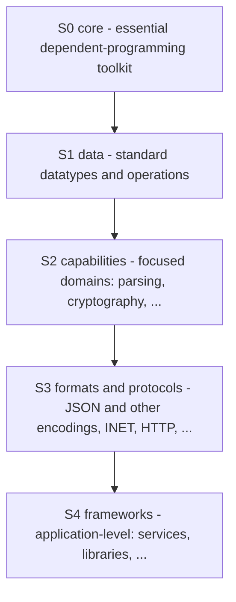
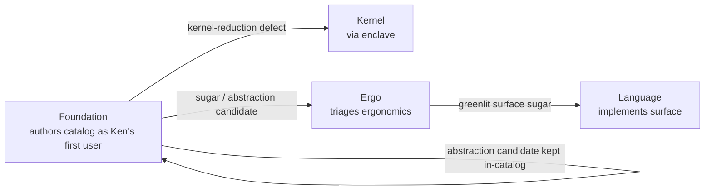

# Catalog campaign — charter and roadmap

**Owned by the Steward.** Records what the first-party catalog *is*, who owns
it, how each entry is shaped, and the sequenced roadmap that builds it. Reads
against the operator reports in `local/` (Pat-directed, not `local/refs/`):
`core-catalog-and-agent-model-report.md`,
`native-compiler-fidelity-and-implementation-report.md`, and the Ward seam
contract (`local/ward-discharge-attestation-handoff.md`, ratified Sec6).

The first pass (roadmap in the *Roadmap* section) established the core
proof-carrying components and smoke-tested the kernel, elaborator, and language
surface — the pass that caught the early kernel-reduction defects. This charter
reframes the catalog for the phase now beginning: the same components, but
authored deliberately for the audiences and uses below, in a literate format,
under a clear home.

## What the catalog is — four purposes at once

The catalog is not only where reusable Ken code lives. It serves four purposes
simultaneously, and the charter's job is to make one artifact serve all four
rather than fracturing into four corpora.

**1. The standard components** — the verified substrate from which software in
Ken is built. *Personas:* agents building with Ken (which will **not** have Ken
in their training data in the near term) and people learning Ken by building
with it. Both read the *types and laws as the contract* — in a dependently- and
refinement-typed language, a `def` with named preconditions and a lawful
`class` instance with its proof are self-describing. This is what a
Ken-untrained agent leans on.

**2. Training data** for future models to understand Ken. *Persona:* AI labs
(their exact needs are not yet legible to us). Our working thesis: the scarcest,
highest-value form of code training data is **verified-correct,
intent-annotated, proof-carrying code that is not already on the internet** —
and the catalog is all four by construction (machine-checked, literate,
proof-carrying, novel). So we do **not** chase a spec we cannot get from labs;
we make correct, literate, proven components, and premium training data is the
byproduct.

**3. A teaching tool** for understanding Ken and programming in Ken. *Personas
(the widest set):* type-theory researchers, users of other dependently-typed or
functional languages, the type-theory-curious, experienced programmers, math or
CS students, entry-level programmers. One entry serves this whole range through
**progressive disclosure** — the same document read to different depths.

**4. (inward) The fleet's dogfooding instrument.** Writing real Ken is the only
way to surface what synthetic tests cannot: **kernel-reduction defects** (the
first pass already caught several) and **elaborator ergonomics** — recurring
implementation shapes that should be *sugared* into surface syntax, or that
should become *general-purpose `def`s, `lemma`s, or `prop`s*. These **Findings**
are a first-class output of every entry, not a side effect (routing below).

### Why one artifact serves all four

The four purposes are colinear, not competing, when the entry is a **literate
`.ken.md` document**:

- Purpose 1 needs self-describing components — the literate entry's code +
  laws + proofs.
- Purpose 3 needs progressive disclosure — the literate entry's layered
  sections and named reading paths.
- Purpose 2 is what purposes 1+3 *produce* when done well: verified + literate
  + proof-carrying + novel.
- Purpose 4 (Findings) falls out of the act of authoring, captured in a
  standing section.

The per-entry standard format that carries these layers is the subject of
`07-catalog-style-guide.md`. This charter fixes the *purpose, home, and layout*;
the style guide fixes the *shape of each entry*.

## The catalog's strata — subject-matter architecture

The catalog is organized as **dependency strata**: each stratum is built from
the ones beneath it, and the essential toolkit at the base is the most
depended-upon. This is the *subject-matter* spine — orthogonal to the trust
"rings" (kernel TCB vs. outer ring) and to the per-entry format. The set of
strata, and which package sits in which, will see **rearrangement, inclusions,
and exclusions** as the catalog grows; what is stable is the shape: a small
essential core, widening as it moves outward toward applications.



- **S0 · core — the essential dependent/functional-programming toolkit.** The
  vocabulary of proof and abstraction: propositional equality and its lemmas
  (refl/sym/trans/cong/subst), decidability (`Dec`), dependent pairs and
  functions, sum/product/`Unit`/`Void`, and the lawful type-class scaffolding
  (`Eq`, `Ord`, `Semigroup`, `Monoid`, `Functor`/`Applicative`/`Monad`). This is
  what a Ken-untrained agent leans on first, and what everything above reuses.
- **S1 · data — standard datatypes and their operations.** `Nat`, `Int`, `Bool`,
  `Char`, `String`, `List`, `Vector`, `Option`, `Result`/`Either`, tuples,
  `Map`, `Set` — each with its operations **and its laws proved**.
- **S2 · capabilities — focused capability domains.** Parsing, cryptography, and
  the individual competence areas that build on solid data structures.
- **S3 · formats and protocols — tooling components.** JSON and other encodings,
  wire/attestation transport, and network protocols (INET, HTTP). Today's
  `transport` package is the seed of this stratum.
- **S4 · frameworks — application level.** Service and library frameworks
  assembled from everything below.

**Demand-pull layering (the operator's design principle).** The deeper strata
are *clarified by building the things that ought to sit on them*. Rather than
speculate an exhaustive `S0`/`S1` in the abstract, we let a concrete
upper-stratum target (a real parser, a real protocol) surface the exact core
lemma or data operation it needs, then land that below. Build-order is therefore
**top-informed, bottom-proven**: uppermost targets specify the requirements; the
strata are proven from the base up. This charter's near-term work program
(`Roadmap` → *Data-structures enrichment*) drives the catalog through `S0`+`S1`
under exactly this discipline.

The `core-catalog` report's finer Layers 0–14 (`ken.base` → `ken.verify`) slot
*within* these strata — the strata are the coarse spine, the report's layers the
fine sequencing inside `S2`–`S4`.

## Layout: the `catalog/` tree

The catalog gets a top-level home. Whole-catalog matter lives at the `catalog/`
root; the package tree is a light container beneath it.

```text
catalog/
  README.md            catalog index + the four purposes, one screen
  REFERENCES.md        catalog-wide reference conventions (per-entry refs live
                       in each entry — see the style guide)
  guide/               the authoring guide — "writing Ken" (see below)
  packages/            light container: a README + one subdirectory per package
    README.md          package index / navigation
    <package>/
      <package>.ken.md  the literate entry (primary artifact; tangles to .ken)
      ...
```

- `catalog/` root holds any *whole-catalog* detail (index, cross-package
  conventions, the pointer to this charter and to the style guide).
- `catalog/packages/` is **just a container** — a README and the package
  subdirectories, nothing heavier. Packages are physically **flat today**; the
  subject-matter strata below are the *conceptual* spine and build order, and a
  later rearrangement WP may group them into stratum subdirectories once the set
  is large enough to warrant it.
- Each package is a **literate `.ken.md` entry** whose `ken` code blocks tangle
  to a compilable module; the tangled `.ken` is a build artifact, not the
  source of truth.

The migration that moved today's `packages/` to `catalog/packages/` has landed
(it touched build/tooling references — elaborator package resolution,
`crates/**` test fixtures, ~70 docs, conformance seeds — so it went through CI,
not by hand).

## Home and Findings routing (teaming)

The reframed campaign's core artifact is *proven `catalog/packages/`
components in `.ken.md`* — **Foundation's** standing mandate (Foundation
already builds the `catalog/packages/` stdlib; the first pass used Language
because it was a *surface* smoke-test, a Language concern). So the catalog is
homed in **Foundation**, and
the Findings loop is honest by construction because the *author* and the
*fixers* are different teams — the surface builder cannot grade its own
ergonomics homework.



- **Foundation** authors entries and files Findings.
- **Kernel** (via the enclave) takes kernel-reduction defects — the
  highest-value Finding a catalog entry can produce.
- **Ergo** triages ergonomics: sugar candidates and abstraction candidates.
- **Language** implements the surface sugar Ergo greenlights.
- **Enclave** (Architect/CV) pins each abstraction boundary and gates merges,
  per the standard §2c pipeline.

The one skill no team has yet — literate-`.ken.md` pedagogy plus Findings-filing
discipline — is a **catalog-authoring overlay** attached to Foundation
(`agent/teams/foundation/` or a shared skill), not a new team. A new team would
be archetype-identical and need the same overlay anyway; minting one is
proliferation against `subsume-don't-proliferate`.

The **staffing cadence** stays demand-driven: run Foundation's cell on catalog
batches; if observed throughput later justifies a standing catalog cell,
graduate it then, informed.

## The authoring guide — "writing Ken" (parallel workstream)

There is **no in-model support for Ken** — no model has Ken in its training
data, and won't for some time. The catalog shows *proven components*; it does
not, by itself, teach the **act of writing** them. So the campaign carries a
second,
parallel deliverable: an **authoring guide** — reference material that helps an
agent (ours, and hopefully others') or a person actually write Ken. It lives at
`catalog/guide/` and is developed **alongside** the packages, not after them.

It is not a fifth *purpose* — it is a deliverable that serves purposes 1
(builders lean on it), 3 (it teaches), and 2 (how-to-write-Ken reasoning is
itself premium, not-on-the-internet training data). It complements the normative
spec: **`spec/30-surface` is the contract; the guide is the practice.**

Three strands, synthesized from what we already have — the landed language
surface plus what is generally known about writing dependently-typed code —
never by copying reference source (clean-room boundary below):

- **Surface reference** — the practical shape of the language: the
  `const`/`fn`/`proc` purity split, `data`/`match`, `class`/`instance`,
  refinement types, effect rows, and the literate `.ken.md` format. Task-first
  ("how do I write X"), distinct from the spec's exhaustive contract.
- **Proof techniques** — how to actually discharge laws in Ken: `refl` vs. `tt`
  endpoints, induction and motive construction, using `Dec`, funext as a
  definitional pointwise equality, and the non-termination hazards to avoid.
- **Decomposition & abstraction hints** — when to reach for a `class` vs. an
  explicit dictionary, `subsume-don't-proliferate`, coexist-when-trust-differs,
  structural self-evidence, and the other reusable moves.

**A high-value, honest synthesis source is the fleet's own hard-won memory.**
`agent/memory/` and the Steward's operating memory already encode much of the
proof-technique and decomposition strand as lessons paid for in real build
failures — distilling those *outward* into public guide prose is both the
cheapest first draft and the most authentic. General dependently-typed practice
(Lean/Agda/Idris tactics and patterns, all widely documented in public) may be
consulted to *sharpen* the guide, but it is written in Ken's own terms and
**never copies reference source** — the same clean-room rule the catalog code
obeys (`CLEAN-ROOM.md`): permissive references inform *approach*, copyleft
references are enclave-only, and neither is transcribed. The guide is a
companion to the catalog, so its Findings and refinement cadence mirror the
packages'.

Our own agents consume the guide through a thin role skill that points at it;
the canonical artifact is the repo-visible `catalog/guide/` so it serves
external readers and the training-data purpose equally.

## Cadence (fleet fit)

Unchanged spine: the **T1 enclave pins each abstraction's boundary** (its laws,
assumptions, exported obligations — the hard part), then **T2 implementers fan
out** once the contract, derivation path, `trusted_base()` delta, law
propositions, and discriminating conformance cases are precise. Every catalog WP
runs the §2c pipeline: **Steward frame → enclave elaboration (abstraction
boundary) → merge → build team → gate**. The **first instance of each new
pattern** gets T1 design + review; siblings are mechanical.

Package discipline is the existing `catalog/packages/` contract (manifest, Ken
source, derivation path, declared trust delta; law fields **proved**, not
postulated, except an audited primitive-carrier delta) — now carried inside the
literate entry per the style guide. The catalog is a *verified computational
substrate*, not a convenience stdlib.

### Two-phase quality cadence

Catalog work has two legitimate, named phases, because hard proof engineering
often discovers the proof before the clearest presentation of it.

1. **Functional discovery/build.** Get the component to exist, run, and prove
   the required laws. A rough-but-correct source may merge here: local helper
   names, sparse comments, discovery-shaped organization are acceptable **if**
   the proofs are real, the derivation path is stated, the trusted-base delta is
   honest, and the WP's acceptance criteria are met.
2. **Catalog refinement.** A follow-on WP raises the landed component to the
   standard entry format: literate narrative, reading paths, examples, laws,
   References, Findings, naming, and behavior-preserving refactor. This is a
   planned step, not optional cleanup, and it does not weaken proof obligations.

The durable standard is `07-catalog-style-guide.md`. The Steward records a
refinement follow-on for any component whose entry is not yet guide-quality.

## Roadmap

Sequenced along the strata above (the `core-catalog` report's Layers 0–14,
`ken.base` → `ken.verify`, slot within them). The **core-establishing tranche is
largely complete** — the constructor-class pattern, collections,
maps/sets/relations, parsing, lawful classes, the purity-keyword surface split,
and named-proof claims. The reframe above changes the catalog's *purpose,
format, home, and layout* for the phase now beginning.

**Near-term: the data-structures enrichment program.** The first program of the
reframed phase drives the catalog deliberately through `S0` (essential toolkit)
and `S1` (standard datatypes + operations) under the demand-pull discipline —
detailed in its own program doc
(`docs/program/wp/catalog-data-structures-program.md`). Beyond `S1`, the
remaining strata/layers sequence as ready:

parse/syntax/diagnostics · automata/formal-languages · graphs/dependency
structures · statistics/probability (exact/empirical/approximate tiers) · linear
algebra (dimension-safe) · symbolic algebra · geometry (exact-before-float) ·
numerical computing (error-bound refinements) · time/events/traces ·
**protocols/serialization/supply-chain (coordinates with Lane B)** ·
optimization/search · **verification/model-checker interop (coordinates with
Lane B)**. The two Ward-adjacent layers are scheduled *with* Lane B so the
catalog's protocol/attestation/obligation structures and Ward's seam stay one
design.

### Deferred Z3 evaluation gate

Z3 remains an optional proof-search accelerator, not a trusted checker and not a
dependency for current builds. Defer until the catalog contains enough large,
proof-heavy packages that an enabled/disabled comparison is meaningful, then run
the two-step program in `03-program-of-work.md` under V3 (integrate an
off-by-default Z3-backed search whose results the kernel still re-checks; then
characterize throughput). Output is a keep/opt-in/remove decision report. Do not
default Z3 unless catalog-scale measurement shows a clear benefit.

### Lanes B and C (unchanged)

- **Lane B — Ward's ready half (parallel).** Ken's side of the ratified
  discharge-attestation seam (Sec6; tokens pinned Ward `ffe32f2`): the
  three-check deployment gate on the provenance verifier, the `64`/`65`
  governance policy (Ken owns the *requirement*, Ward the *check*), honoring the
  I4 one-way gate with a discriminating conformance case. Owner: **Foundation**
  (Sec3) + **Verify** (B-series). First step is a readiness check of what
  B1–B4/Sec3/Sec6 already landed before framing the gate WP.
- **Lane C — native compiler (deferred, pre-scaffolded).** Held until the
  catalog gives it programs and semantics are settled. A pragmatic F1/F2 first
  campaign (executable IR → Rust LLVM backend for a small total subset →
  layout/ABI → interp/native differential harness → trust-report), architected
  as if F4/F5 is coming (Ken owns semantics/IR/certificates; Rust owns
  LLVM/ABI/runtime). Scaffold in `local/compiler/`. Ward's CT-preserving codegen
  obligation folds in here.

## Sequenced next actions

The reframe itself has **landed**: charter (`06`) + standard entry format
(`07`), the `packages/` → `catalog/packages/` migration, and the checked
literate fence roles (`ken reject`/`ken example`) are all on `main`. The phase
now beginning:

1. **Data-structures enrichment program** — the near-term program of WPs driving
   the catalog through `S0`+`S1` under demand-pull; sequence and rationale in
   `docs/program/wp/catalog-data-structures-program.md`. Its first WP (`DS-1`,
   `Empty`+`Dec`) doubles as the **`.ken.md` format pilot** — no literate entry
   exists yet.
2. **Foundation catalog-authoring overlay** — the literate-`.ken.md` pedagogy +
   Findings-filing skill attached to Foundation; the precondition for authoring
   the first batch to guide quality.
3. **Authoring guide (`catalog/guide/`)** — the parallel "writing Ken"
   workstream (surface reference · proof techniques · decomposition/abstraction
   hints), first-drafted from the fleet's own memory corpus and general DT
   practice; runs alongside the packages, not after them.
