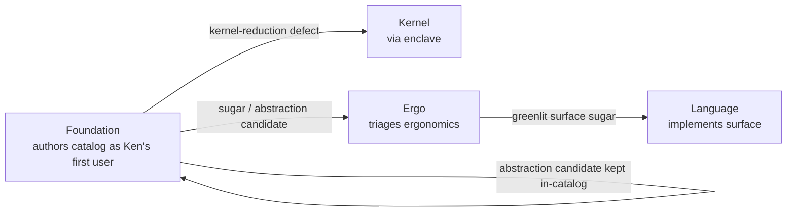

# Catalog campaign — charter and roadmap

**Owned by the Steward.** Records what the first-party catalog *is*, who owns
it, how each entry is shaped, and the sequenced roadmap that builds it. Reads
against the operator reports in `local/` (Pat-directed, not `local/refs/`):
`core-catalog-and-agent-model-report.md`,
`native-compiler-fidelity-and-implementation-report.md`, and the Ward seam
contract (`local/ward-discharge-attestation-handoff.md`, ratified Sec6).

The first pass (roadmap in the *Roadmap* section) established the core
proof-carrying components and smoke-tested the kernel, elaborator, and language
surface — the pass that caught the early kernel-reduction defects. This charter
reframes the catalog for the phase now beginning: the same components, but
authored deliberately for the audiences and uses below, in a literate format,
under a clear home.

## What the catalog is — four purposes at once

The catalog is not only where reusable Ken code lives. It serves four purposes
simultaneously, and the charter's job is to make one artifact serve all four
rather than fracturing into four corpora.

**1. The standard components** — the verified substrate from which software in
Ken is built. *Personas:* agents building with Ken (which will **not** have Ken
in their training data in the near term) and people learning Ken by building
with it. Both read the *types and laws as the contract* — in a dependently- and
refinement-typed language, a `def` with named preconditions and a lawful
`class` instance with its proof are self-describing. This is what a
Ken-untrained agent leans on.

**2. Training data** for future models to understand Ken. *Persona:* AI labs
(their exact needs are not yet legible to us). Our working thesis: the scarcest,
highest-value form of code training data is **verified-correct,
intent-annotated, proof-carrying code that is not already on the internet** —
and the catalog is all four by construction (machine-checked, literate,
proof-carrying, novel). So we do **not** chase a spec we cannot get from labs;
we make correct, literate, proven components, and premium training data is the
byproduct.

**3. A teaching tool** for understanding Ken and programming in Ken. *Personas
(the widest set):* type-theory researchers, users of other dependently-typed or
functional languages, the type-theory-curious, experienced programmers, math or
CS students, entry-level programmers. One entry serves this whole range through
**progressive disclosure** — the same document read to different depths.

**4. (inward) The fleet's dogfooding instrument.** Writing real Ken is the only
way to surface what synthetic tests cannot: **kernel-reduction defects** (the
first pass already caught several) and **elaborator ergonomics** — recurring
implementation shapes that should be *sugared* into surface syntax, or that
should become *general-purpose `def`s, `lemma`s, or `prop`s*. These **Findings**
are a first-class output of every entry, not a side effect (routing below).

### Why one artifact serves all four

The four purposes are colinear, not competing, when the entry is a **literate
`.ken.md` document**:

- Purpose 1 needs self-describing components — the literate entry's code +
  laws + proofs.
- Purpose 3 needs progressive disclosure — the literate entry's layered
  sections and named reading paths.
- Purpose 2 is what purposes 1+3 *produce* when done well: verified + literate
  + proof-carrying + novel.
- Purpose 4 (Findings) falls out of the act of authoring, captured in a
  standing section.

The per-entry standard format that carries these layers is the subject of
`07-catalog-style-guide.md`. This charter fixes the *purpose, home, and layout*;
the style guide fixes the *shape of each entry*.

## Layout: the `catalog/` tree

The catalog gets a top-level home. Whole-catalog matter lives at the `catalog/`
root; the package tree is a light container beneath it.

```text
catalog/
  README.md            catalog index + the four purposes, one screen
  REFERENCES.md        catalog-wide reference conventions (per-entry refs live
                       in each entry — see the style guide)
  packages/            light container: a README + one subdirectory per package
    README.md          package index / navigation
    <package>/
      <package>.ken.md  the literate entry (primary artifact; tangles to .ken)
      ...
```

- `catalog/` root holds any *whole-catalog* detail (index, cross-package
  conventions, the pointer to this charter and to the style guide).
- `catalog/packages/` is **just a container** — a README and the package
  subdirectories, nothing heavier.
- Each package is a **literate `.ken.md` entry** whose `ken` code blocks tangle
  to a compilable module; the tangled `.ken` is a build artifact, not the
  source of truth.

Moving today's `packages/` to `catalog/packages/` touches build/tooling
references (elaborator package resolution, `crates/**` test fixtures, ~70 docs,
conformance seeds). That is a scoped **migration WP** (below), not a doc edit —
it must land green through CI, not by hand.

## Home and Findings routing (teaming)

The reframed campaign's core artifact is *proven `packages/` components in
`.ken.md`* — **Foundation's** standing mandate (Foundation already builds the
`packages/` stdlib; the first pass used Language because it was a *surface*
smoke-test, a Language concern). So the catalog is homed in **Foundation**, and
the Findings loop is honest by construction because the *author* and the
*fixers* are different teams — the surface builder cannot grade its own
ergonomics homework.



- **Foundation** authors entries and files Findings.
- **Kernel** (via the enclave) takes kernel-reduction defects — the highest-value
  Finding a catalog entry can produce.
- **Ergo** triages ergonomics: sugar candidates and abstraction candidates.
- **Language** implements the surface sugar Ergo greenlights.
- **Enclave** (Architect/CV) pins each abstraction boundary and gates merges,
  per the standard §2c pipeline.

The one skill no team has yet — literate-`.ken.md` pedagogy plus Findings-filing
discipline — is a **catalog-authoring overlay** attached to Foundation
(`agent/teams/foundation/` or a shared skill), not a new team. A new team would
be archetype-identical and need the same overlay anyway; minting one is
proliferation against `subsume-don't-proliferate`.

The **staffing cadence** stays demand-driven: run Foundation's cell on catalog
batches; if observed throughput later justifies a standing catalog cell,
graduate it then, informed.

## Cadence (fleet fit)

Unchanged spine: the **T1 enclave pins each abstraction's boundary** (its laws,
assumptions, exported obligations — the hard part), then **T2 implementers fan
out** once the contract, derivation path, `trusted_base()` delta, law
propositions, and discriminating conformance cases are precise. Every catalog WP
runs the §2c pipeline: **Steward frame → enclave elaboration (abstraction
boundary) → merge → build team → gate**. The **first instance of each new
pattern** gets T1 design + review; siblings are mechanical.

Package discipline is the existing `packages/` contract (manifest, Ken source,
derivation path, declared trust delta; law fields **proved**, not postulated,
except an audited primitive-carrier delta) — now carried inside the literate
entry per the style guide. The catalog is a *verified computational substrate*,
not a convenience stdlib.

### Two-phase quality cadence

Catalog work has two legitimate, named phases, because hard proof engineering
often discovers the proof before the clearest presentation of it.

1. **Functional discovery/build.** Get the component to exist, run, and prove
   the required laws. A rough-but-correct source may merge here: local helper
   names, sparse comments, discovery-shaped organization are acceptable **if**
   the proofs are real, the derivation path is stated, the trusted-base delta is
   honest, and the WP's acceptance criteria are met.
2. **Catalog refinement.** A follow-on WP raises the landed component to the
   standard entry format: literate narrative, reading paths, examples, laws,
   References, Findings, naming, and behavior-preserving refactor. This is a
   planned step, not optional cleanup, and it does not weaken proof obligations.

The durable standard is `07-catalog-style-guide.md`. The Steward records a
refinement follow-on for any component whose entry is not yet guide-quality.

## Roadmap

Sequenced against the `core-catalog` report's Layers 0–14 (`ken.base` →
`ken.verify`). The **core-establishing tranche is largely complete** — the
constructor-class pattern, collections, maps/sets/relations, parsing, lawful
classes, the purity-keyword surface split, and named-proof claims. The reframe
above changes the catalog's *purpose, format, home, and layout* for the phase
now beginning; the remaining layers sequence as ready:

parse/syntax/diagnostics · automata/formal-languages · graphs/dependency
structures · statistics/probability (exact/empirical/approximate tiers) · linear
algebra (dimension-safe) · symbolic algebra · geometry (exact-before-float) ·
numerical computing (error-bound refinements) · time/events/traces ·
**protocols/serialization/supply-chain (coordinates with Lane B)** ·
optimization/search · **verification/model-checker interop (coordinates with
Lane B)**. The two Ward-adjacent layers are scheduled *with* Lane B so the
catalog's protocol/attestation/obligation structures and Ward's seam stay one
design.

### Deferred Z3 evaluation gate

Z3 remains an optional proof-search accelerator, not a trusted checker and not a
dependency for current builds. Defer until the catalog contains enough large,
proof-heavy packages that an enabled/disabled comparison is meaningful, then run
the two-step program in `03-program-of-work.md` under V3 (integrate an
off-by-default Z3-backed search whose results the kernel still re-checks; then
characterize throughput). Output is a keep/opt-in/remove decision report. Do not
default Z3 unless catalog-scale measurement shows a clear benefit.

### Lanes B and C (unchanged)

- **Lane B — Ward's ready half (parallel).** Ken's side of the ratified
  discharge-attestation seam (Sec6; tokens pinned Ward `ffe32f2`): the
  three-check deployment gate on the provenance verifier, the `64`/`65`
  governance policy (Ken owns the *requirement*, Ward the *check*), honoring the
  I4 one-way gate with a discriminating conformance case. Owner: **Foundation**
  (Sec3) + **Verify** (B-series). First step is a readiness check of what
  B1–B4/Sec3/Sec6 already landed before framing the gate WP.
- **Lane C — native compiler (deferred, pre-scaffolded).** Held until the
  catalog gives it programs and semantics are settled. A pragmatic F1/F2 first
  campaign (executable IR → Rust LLVM backend for a small total subset →
  layout/ABI → interp/native differential harness → trust-report), architected
  as if F4/F5 is coming (Ken owns semantics/IR/certificates; Rust owns
  LLVM/ABI/runtime). Scaffold in `local/compiler/`. Ward's CT-preserving codegen
  obligation folds in here.

## Sequenced next actions

1. **This rework lands** — charter (`06`) + standard entry format (`07`), the
   next Steward corpus merge.
2. **Migration WP** — `packages/` → `catalog/packages/` with all
   build/tooling/doc/conformance references updated; Foundation executes (with
   Language for elaborator package-root resolution); green through CI.
3. **Language WP** — the literate block-role taxonomy (`ken reject` checked to
   fail, `ken example` checked-not-shipped) in `crates/ken-elaborator/src/
   literate.rs` + the check path; small, per the style guide §2.
4. **Foundation catalog-authoring overlay** — the literate-`.ken.md` pedagogy +
   Findings-filing skill.
5. **First reframed catalog batch** — authored as `.ken.md` entries under
   `catalog/packages/`, exercising the full standard format end to end (it
   doubles as the format's pilot).
