# POSIX / Linux ABI — campaign charter and work program

**Owner:** Steward · **Status:** framed, **not released** · **Sequenced after:**
LET-4 → LET-2b → LET-3 → CC9 (the CLI + `let` work) · **Source:**
`local/ken-posix-linux-interface-gap-report.md` (research report, 2026-07-12),
**regrounded against `origin/main @ 26d5255e` on 2026-07-14.**

This is the campaign charter. It is **not** a release order. Each `PX` work
package gets a shovel-ready frame (`docs/program/wp/px<N>-<slug>.md`) authored
at release time, per `agent/playbooks/federation/steward.md §2c`.

---

## 0. Read this first — the report is STALE, and its headline RISK came true

The report was written against `3a5cd323`. **Seventy-five commits have landed
since**, including the entire `I-*` (interface) and `CC*` (catalog) arc. Two of
its three load-bearing "current state" claims are **now false**:

| Report claim | Verdict | Proof |
|---|---|---|
| "Ken has **one** real host operation: capability-gated whole-file read" | **STALE** | **16 driven host ops**: 10 FS (`eval.rs:2179-2189`), 4 Console (`eval.rs:1847-1857`), 2 Clock (`eval.rs:2045-2048`) |
| "`Cap` = authority level + effect name; no rights bitset, no resource identity, no scope" | **STALE** | `Cap { authority, effect, scope: FsScope }` — `capabilities.rs:199-203`; `RightSet` `:58-86`; `FsHandle(OwnedFd)` `:97-100`; `FsIdentity{device,inode}` `:129-132`; `lineage` `:136-142` (ADR-0017) |
| "No realized packages in `catalog/packages/`" | **STALE** | `System/Path/Posix.ken.md` (1758 lines), `System/Exit`, `Process/{Arguments,Environment,WorkingDirectory}`, `Time/Clock`, `Capability/{FS,Console}` |
| "`write_bytes`/`append`/`send`/`recv` are undriven placeholders" | **STALE** | Retired at `6088e0b8`; FS write/append are **driven**. Net + Rand are not merely undriven — they are **not declared at all** |
| FFI marshalling is `BytesPtr` + debug-formatted scalar; no foreign call executed | **VERIFIED** | `foreign.rs:36-40`, `:54-58`; zero `dlopen`/`dlsym`/`libloading` hits repo-wide |
| Native: `ClosedNullary` only; `HostEffectExecution` unavailable; Cranelift rejects `RuntimeExpr::Effect` | **VERIFIED** | `executable_entrypoint_packaging.rs:85-93`, `platform_runtime_support.rs:327-331`, `cranelift_backend.rs:1438-1441` |
| No `USize`/`ISize`/`CInt`/`Ptr` | **VERIFIED** | zero hits across `crates/`, `spec/`, `catalog/` |

**The report's own anchors have moved. Do not pin them.** Every anchor in *this*
document was re-verified against `26d5255e`; treat even these as **perishable**
and re-ground at frame time.

### ★★ The finding that reorders the report's own phasing

The report's §16 lists *"ABI facts drift silently"* as a **risk**. It is not a
risk. **It has already happened, in the security-enforcement path, and it is on
`main` right now.**

`crates/ken-interp/src/eval.rs:2371-2394`:

```rust
#[cfg(unix)]
const O_NOFOLLOW_KEN: i32 = 0o400000;
#[cfg(unix)]
const O_CLOEXEC_KEN: i32 = 0o2000000;
#[cfg(unix)]
const AT_REMOVEDIR_KEN: i32 = 0x200;

#[cfg(unix)]
unsafe extern "C" {
    fn openat(dirfd: i32, pathname: *const c_char, flags: i32, mode: u32) -> i32;
    fn mkdirat(...);  fn unlinkat(...);  fn renameat(...);  fn readlinkat(...);
}
```

Read what that actually says:

1. **Five raw syscalls are hand-declared `unsafe extern "C"` INLINE in the
   4,600-line pure evaluator.** There is no boundary crate. **Only `ken-kernel`
   forbids `unsafe`** (`ken-kernel/src/lib.rs:42` — the sole hit in the
   repository). `ken-interp` does not.
2. **Three target-ABI constants are asserted from memory.** No probe, no
   manifest, no target binding. Nothing in the tree can check them.
3. **The `cfg` gate is `unix`. The values are `linux`.** `#[cfg(unix)]` compiles
   on macOS and every BSD. These three numbers are not the same on those
   targets. The code compiles, links, and passes those bits to real syscalls.
4. **`O_NOFOLLOW` is the enforcement mechanism for `SymlinkPolicy::NoFollow`**
   (`capabilities.rs:89-92`) — an **ADR-0017 security property**. If that bit is
   wrong on a target, the symlink-escape defense **silently does not apply**, and
   every gate stays green, because the gates test *behavior on this box*.

> **⇒ A capability-confinement guarantee rests on a magic number that nobody
> probed, gated by a `cfg` broader than the fact it encodes.** Whether the values
> happen to be correct on today's target is **not the point** — the point is that
> **the artifact cannot tell you, and has nowhere to state the obligation.**

This is the **contract-expressibility failure** (`PRINCIPLES #14`) in its purest
form, and we have seen its exact shape twice this month: CC6b's segment
invariant living in a `--` comment, and LET-1's *readability* having no gate.
**Same disease: an obligation the artifact has no way to carry, invisible in a
green diff.** The difference is that those two were caught because someone tried
to *write the guarantee down* and found the pen had nowhere to land.

**Nobody has tried here yet. PX1 and PX2 are that attempt.**

---

## 1. What this campaign IS and IS NOT

**IS:** hosted user-space Linux programs — CLI tools, file utilities, services,
protocol implementations — built on a **small, audited, manifest-bound host
boundary**, with the OS surface above it as **ordinary kernel-checked Ken**.

**IS NOT:** bare-metal, drivers, MMIO, interrupt context, or a general
imperative core. **ADR-0012 already ruled this out and it is not reopened.** The
report agrees (§1). Pursuing it would replace Ken's model with a second,
Rust-like one.

**IS NOT:** an untyped `syscall6` escape hatch. If a raw tier ever exists it is
explicitly audited and **never** the standard interface (report §16).

**The kernel does not grow.** OS operations, ABI manifests, handles, and
capabilities are **data, ordinary package types, and audited runtime
primitives**. They justify **no new trusted typing rules**. Any WP that reaches
for one is a **scope fork → escalate to the Architect**, not a judgment call.

---

## 2. Fixed inputs — SETTLED, do not reopen

- **ADR-0012** — verified total leaf components are a Ken target; general
  mutation-heavy driver code is not.
- **ADR-0011** — programs depend on lawful platform interfaces; POSIX handlers
  install at the edge; no preprocessor as the platform abstraction.
- **ADR-0017** — the scoped capability model: `openat`-relative,
  **handle-not-path**, inode-keyed. **The resolve/operate split is correct and
  stays.** `HostHandler` has *no byte-path bypass that can re-resolve after
  authorization* (`eval.rs:2245-2248`). **Do not reintroduce string prechecking.**
- **PRINCIPLES #14** — never pin a shape that cannot state its own contract.
- **PRINCIPLES #15** — prefer a **fixed, audited trusted-base extension** over
  unbounded consumer `Axiom`s.
- **Successful OS execution is never promoted to kernel proof.** The status of
  every host guarantee is `tested` / `validated` / `delegated` — **never
  `proved`** — and that disclosure lives **in the source**, not only in the frame.

---

## 3. The three forks that need a decision before release

These are genuine and I will not pre-empt them by sequencing.

### FORK 1 — how far does this campaign commit? *(operator)*

The report describes Phases A–G. **That is a program that could swallow the
project.** My recommendation:

- **COMMITTED: PX-A → PX-C.** Audited boundary → native effect execution →
  descriptor streaming and resources.
- **BOOKED, not committed: PX-D (processes/sockets), PX-E (event loop).**
- **OUT OF SCOPE: Linux control APIs (netlink, seccomp, io_uring, cgroups), the
  public C ABI, threads, affine types.** Named here so nobody builds them.

**Exit criterion I propose — the direct extension of the one Pat already set:**

> Pat's CLI exit criterion was *"a real, if simple, CLI tool built in Ken."*
> **This campaign's exit criterion is that the same tool is a NATIVE EXECUTABLE**
> — compiled, running under scoped capabilities, observationally identical to
> the interpreter run, over files larger than memory, with its exact target-ABI
> manifest hash bound into the artifact.

### FORK 2 — whose `unsafe`? *(Architect + operator; ADR-worthy; Sec3 dimension)*

We currently hand-declare POSIX symbols ourselves (§0). Three options:

| | Approach | Cost |
|---|---|---|
| **(a)** | **Keep hand-declared**, but move to `ken-host`, probe every constant, bind to a manifest | Max control, max audit surface. **Our** `unsafe`, our TCB. |
| **(b)** | Take **`rustix`** | No `unsafe` in *our* code, well-audited upstream — but a **third-party crate inside the runtime trust boundary**, and a supply-chain surface (**Sec3**). |
| **(c)** | **`libc` for constants only**, our own `unsafe` for the calls | Splits the difference; still a dependency, but a much smaller claim. |

**I lean (a).** The campaign's entire thesis is that **ABI facts must be ours,
probed, and checkable** — and (a) is the only option where the manifest is the
source of truth rather than a second opinion. But this puts real `unsafe` in our
runtime permanently, and that is the Architect's call and Pat's risk tolerance,
not mine.

### FORK 3 — does native go early or late? *(operator)*

**The interpreter/native gap is WIDENING and gets more expensive every WP.**
Since `3a5cd323` the interpreter gained **16 host ops**; native gained **zero**.
Every OS capability we add interpreter-first increases the size of the eventual
native port.

- **Native early (PX-B before PX-C)** — *my recommendation.* "A real tool" means
  a **binary**. Porting 16 ops is cheap; porting 60 is not.
- **Native late** — acceptable only if the interpreter is the accepted delivery
  vehicle for the foreseeable future. **If so, say it out loud**, because it
  changes what "a real CLI tool" means.

---

## 4. The work packages

`PX` = POSIX/Linux. **Kernel team: nothing in this campaign.** By design (§1).

### Phase PX-A — make the boundary that ALREADY EXISTS honest · **P0**

*Pure debt. No new surface. This is the enabler for everything downstream, and
it is the cheapest thing in the campaign.*

| ID | Objective | Owner | Size |
|---|---|---|---|
| **PX1** | **`ken-host`: extract the unsafe POSIX boundary into an audited crate.** Move the five `unsafe extern "C"` decls + all call sites (`eval.rs:2378-2394`, `:2414/:2426/:2435/:2924/:2942/:2972/:2997`, `:3720-3726`) out of the evaluator. Deny-by-default API: **no raw fd escapes** — every entry point takes and returns owned handles. Per-syscall tests. **Then `#![forbid(unsafe_code)]` on `ken-interp`.** | Runtime | **M** |
| **PX2** | **Target ABI identity + a generated, probed ABI manifest.** A `TargetAbi` record (arch/os/env/endian/pointer-width/data-model/calling-convention) + content hash. A **build probe** emits a canonical manifest of every constant the boundary uses — **starting with the three that are currently asserted from memory.** `ken-host` binds the manifest hash and **fails closed on mismatch, before any syscall.** **`O_NOFOLLOW_KEN` / `O_CLOEXEC_KEN` / `AT_REMOVEDIR_KEN` are DELETED.** | Runtime | **M** |
| **PX3** | **Machine/ABI scalar types in Ken** — `USize`/`ISize` and the `CInt` family, **bound to the manifest**, with **explicit, partial** conversions to/from arbitrary-precision `Int`. A narrowing conversion is a `Result`, never a silent truncation. | Language | **S** |

**★ PX2 carries a clean-room gate.** A build probe that `#include`s the system
headers and **prints values** learns a *fact from a build*; it does **not copy
GPL'd source into the tree**. That distinction is load-bearing and it is
**not mine to assert** — **PX2's frame routes through the Spec enclave's leakage
recheck before a line is written.** Report §4.2 agrees; `CLEAN-ROOM.md` decides.

**Phase A exit:** *No `unsafe` outside `ken-host`. Every ABI constant Ken uses is
probed and manifest-bound. The artifact reports its exact target identity and
manifest hash. A wrong-target manifest fails closed **before** any syscall runs.*

### Phase PX-B — native effect execution · **P0**

| ID | Objective | Owner | Size |
|---|---|---|---|
| **PX4** | **Native entrypoint ABI beyond `ClosedNullary`** (`executable_entrypoint_packaging.rs:85-93`): raw argv, environment, process exit status, runtime init/teardown, stdout/stderr/trap reporting. | Runtime | **M** |
| **PX5** | **Lower `RuntimeExpr::Effect` natively** (`cranelift_backend.rs:1438-1441`) to a call into a **versioned `ken-host` shim**: validate op support → check the carried capability → marshal per the manifest → call → map the response → resume exactly once. **Unsupported ops stay stable *unavailable lanes*. NEVER a no-op, never a generic scalar call.** | Runtime | **L** |
| **PX6** | **Interpreter/native differential harness for effects.** Compares **external deltas**, not return values: stdout/stderr, file and directory deltas, error identity, effect trace, exit status. | **Verify** | **M** |

**★ PX6 is Verify's lane, and it is deliberate.** Verify has been idle by design
since Z3/FO/Kripke were deferred. **This needs none of them** — it is
differential-observation discipline, which is exactly their competence. It also
guards the report's §16 risk *"native effects disappear or reorder silently."*

**Phase B exit:** ★ **The Ken CLI tool from Milestone C runs as a native
executable**, under scoped capabilities, observationally identical to its
interpreter run.

### Phase PX-C — descriptor streaming, resources, structured errors · **P1**

**★ Today every FS op is whole-file.** `fs_read_at` is `read_to_end`
(`eval.rs:2765-2767`); `fs_write_at` is `set_len(0)` + `write_all` + `sync_all`
(`eval.rs:2789-2795`). **`cp` on a 4 GB file interns 4 GB into the content
store.** There is no `open`, no `close`, no seek, no partial IO — and therefore,
usefully, **no use-after-close bug is currently possible.** PX7 is the WP that
*introduces* that hazard, and it must pay for it.

| ID | Objective | Owner | Size |
|---|---|---|---|
| **PX7** | **Ken-visible resource handles + `System.Resource` bracket.** Opaque, **generation-checked** handle table; `open`/`close`; **double-close and use-after-close FAIL VISIBLE** (stale generation ⇒ `Closed`, never a recycled fd); scoped `withResource` closes on success, error, **and trap**. | Runtime + Foundation | **L** |
| **PX8** | **Partial/positioned IO + `System.Buffer`.** `read`/`write` return **progress**, not all-or-nothing — a short write is **success with progress**, not an error. `writeAll` is a **derived Ken loop, proved**. Bounded mutable buffer floor. | Runtime + Foundation | **L** |
| **PX9** | **`System.Error` — structured errno.** Every error kind retains **operation + handle/path context**. (Today: 10 `io::ErrorKind` mappings, `eval.rs:3933-3942`.) | Foundation | **M** |

> ### ★★ PX7 is a CONTRACT-EXPRESSIBILITY WP and its frame must say so
>
> **"Exactly-once release" has nowhere in Ken to live.** Ken has no affine or
> linear types. The runtime can *enforce* the invariant with generation checks;
> the **language cannot state it**, and no test will ever show you the gap —
> because tests exercise **values**, and the hole is in the **type surface**.
>
> **The (b‴) audit is MANDATORY on PX7's frame**, and the honesty statement —
> ***"exactly-once release is `tested`, enforced by the runtime handle table; it
> is NOT `proved`, and Ken cannot currently express it"*** — goes **in the
> `System/Resource` SOURCE**, not only in the frame. *(CC6b: the disclosure that
> `path_normalize` is lexical-not-canonical had to live in the source. A frame is
> read once; the source is read forever.)*
>
> Affine/unique resources are the permanent fix. **They are research, they are
> out of scope, and PX7 must not smuggle them in.**

**Phase C exit:** *`cat`, `cp`, and `wc` run natively over a file larger than
memory, under scoped capabilities, matching the interpreter's external deltas.*

### Phase PX-D — processes and sockets · **BOOKED, not committed**

- **PX10** — spawn/exec/wait, pipes, **deny-by-default fd inheritance**, `pidfd`
  where available. **Prefer `posix_spawn` semantics; raw `fork` is a restricted
  raw tier if it exists at all.**
- **PX11** — sockets + typed address families; **an injected resolver
  capability** (DNS is **not** a syscall — its trust source must be visible).

### Phase PX-E — nonblocking and the event loop · **BOOKED, not committed**

- **PX12** — nonblocking descriptors, `epoll`/`eventfd`/`timerfd`/`signalfd`,
  cancellation and timeout contracts in the **operation type**, not in prose.

### Explicitly OUT OF SCOPE

netlink · seccomp/Landlock/namespaces · `io_uring` · cgroups · typed `ioctl`
families · the public C ABI and generated headers · a thread-safe runtime ·
affine/unique types · raw pointers/atomics/MMIO.

**Named so that nobody builds them.** Each is a separate campaign, and each needs
a fork resolved before it is one.

---

## 5. The capability gaps that survive the regrounding

ADR-0017 landed most of what the report asked for. **Two gaps are real:**

- **Runtime revocation membrane.** `RevocationHandle { revoked: bool }`
  (`capabilities.rs:468-471`) is a **static contract**; its own doc comment says
  so (`:464-467`). Real OS resources need shared delegation identity, transitive
  child invalidation, close-on-revoke policy, and defined in-flight semantics.
  **Fold into PX7** (it is the same handle-lifetime machinery) **or split out if
  PX7 grows.**
- **IFC at the OS boundary** — authority and information-flow are independent
  axes; holding permission to *write* a socket must not imply permission to
  *send secrets through it*. **This is `Sec1`, an existing workstream. Note the
  dependency; do NOT duplicate it here.**

---

## 6. Sequencing

```mermaid
flowchart LR
    LET4[LET-4 multi-binding let] --> LET2b[LET-2b refresh guides]
    LET2b --> LET3[LET-3 catalog let pilot]
    LET3 --> CC9[CC9 Resource/Bracket + Test.Property]
    CC9 --> PX1[PX1 ken-host boundary crate]
    PX1 --> PX2[PX2 target ABI + probed manifest]
    PX2 --> PX3[PX3 USize/ISize/CInt]
    PX2 --> PX4[PX4 native entrypoint ABI]
    PX4 --> PX5[PX5 native effect lowering]
    PX5 --> PX6[PX6 interp/native differential]
    PX6 --> PX7[PX7 resource handles + bracket]
    PX7 --> PX8[PX8 partial IO + buffers]
    PX8 --> PX9[PX9 structured errno]
    PX9 --> PXD[PX-D processes + sockets - booked]
    PXD --> PXE[PX-E event loop - booked]
```



**★ CC9 is a real dependency, not a courtesy.** CC9 is already framed as
`Resource`/`Bracket` + `Test.Property`. **PX7 is its consumer** — if CC9 lands a
`Bracket` shape that PX7 cannot use for OS handles, we will build it twice.
**CC9's frame must be re-read against PX7 before CC9 is released**, and that is
on me.

**PX1 and PX2 are the only ones that could start early.** They are pure debt,
they touch no surface, and the defect they close is **on `main` in the security
path today**. If Pat wants them pulled ahead of CC9, they are ready to frame.

---

## 7. Do-not-reopen guardrails (binding on every PX frame)

- **⛔ The kernel does not grow.** No new trusted typing rule. A WP that needs
  one is a **scope fork → Architect**, not an implementer's judgment call.
- **⛔ No untyped `syscall6` escape hatch** as the standard interface.
- **⛔ Do not reintroduce string-precheck path authorization.** ADR-0017's
  handle-pinned, `openat`-relative resolve/operate split is **settled**.
- **⛔ No ABI fact without a probe.** After PX2, a hand-written constant in the
  boundary is a **defect**, not a shortcut. *This rule exists because we already
  did it three times.*
- **⛔ Never promote successful OS execution to kernel proof.** `tested` /
  `validated` / `delegated` — and **the disclosure lives in the source.**
- **⛔ A conditional law ships with its REACHING LEMMA, proved.** (CC6b. A
  vacuous law has **zero trust delta** — the gate's trigger never fires on the
  hollow WP.)
- **⛔ `catalog/` · `examples/` · `conformance/` ⇒ FULL CI**, whatever the file
  extension. Never `--doc-only`.
- **⛔ Build/test TARGETED ONLY** — `scripts/ken-cargo -p <crate>`. **Never
  `--workspace`** (`COORDINATION.md §12`, operator hard rule). CI owns
  workspace-green.
