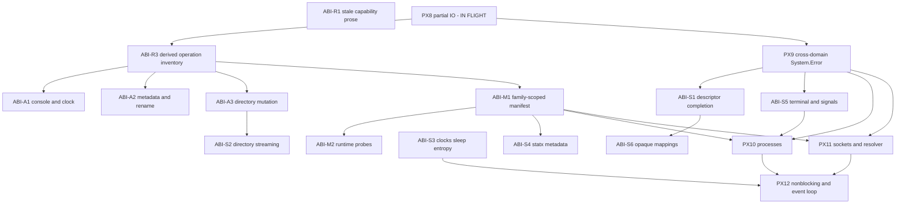

# Linux ABI completion — the work Linux ABI II presumes

**Status:** planning document. Nothing here is released, framed, or kicked.
**Supersedes:** nothing. It sits between
[`09-posix-linux-abi-campaign.md`][charter] (the first campaign) and
`research/linux-abi-ii-work-program-proposal.md` (the L2 advisory).

## 1. What this document is for

The L2 advisory proposes eight tracks. Its own tracks L2-0 through L2-3 are
not new facilities — they are **the first campaign's committed scope, not yet
delivered**. Only L2-4 through L2-8 (`io_uring`, netlink/cgroup, confinement,
typed `ioctl`, MMIO) are genuinely new.

So the useful split is: **finish what the first campaign scoped, then start
Linux ABI II.** This document is the first half. It exists so that L2 can be
planned against a real baseline rather than an assumed one.

This is planning, not a commitment. Nobody outside the project depends on
these intentions, and no status language needs correcting for an audience.
The gap matters only because **work in it is work that L2 would otherwise
silently assume was done** — and building on an assumed baseline is how the
enumeration defects of the last two weeks happened.

**Sequencing, sizing for schedule, and budget are the operator's domain and
are deliberately absent.** Sizes below are scope hints for decomposition, not
estimates. The Steward's concern is §7: tokens spent per unit of delivered
work.

## 2. The gap, verified against `origin/main`

Checked directly, not taken from the advisory:

- `HostOpV1` is a closed catalog of **22 operations**
  (`crates/ken-host/src/effect_v1.rs`).
- **13 `NativeTested`**, **9 `RepresentedUnavailable`**.
- The nine unavailable: `ConsoleRead`, `ClockWallNow`, `FsAppendFile`,
  `FsMetadata`, `FsReadDirectory`, `FsCreateDirectory`, `FsRemoveFile`,
  `FsRemoveDirectory`, `FsRename`.
- **No** process, socket, resolver, polling, signal, timer, entropy, terminal
  control, or memory-mapping operation exists in any state.
- `Capability/System/Resource.ken.md` exists — **PX7 landed**.
- `Capability/Filesystem/Errors.ken.md` is a filesystem error floor. There is
  **no cross-domain `System.Error`** — **PX9 is chartered but undelivered**.

Against the charter's own phase definitions:

| Charter phase | Committed | State |
|---|---|---|
| PX-A boundary honesty | yes | landed |
| PX-B native effect execution | yes | landed |
| PX-C PX7 resources | yes | landed |
| PX-C PX8 partial/positioned IO | yes | **in flight** (BUDGET-EFF, SEAL-2, RT-ESCAPE, RT-SPLIT) |
| PX-C PX9 `System.Error` | yes | **not delivered** — filesystem floor only |
| PX-D PX10 processes | ✅ COMMITTED | **not delivered** |
| PX-D PX11 sockets + resolver | ✅ COMMITTED | **not delivered** |
| PX-E PX12 nonblocking + event loop | ✅ COMMITTED | **not delivered** |

The charter's Phase D/E exit is *"a Ken network service and a process
supervisor run as native binaries, single-threaded and event-driven, with no
unsafe pointers in application Ken."* That exit is unmet.

## 3. Operator rulings folded in

- **No cross-compilation.** Manifest work stays native-target only. The
  advisory's signed/content-addressed cross-target manifest generation is
  **deferred behind a long line of other work** — it is a very late feature.
  Manifest v2 here means *family-scoped and generated*, not *cross-target*.
- **Nothing in the reconciliation track is deferred.** All nine
  `RepresentedUnavailable` operations are **promoted**, not selectively
  deferred with named destinations.
- Timelines, budgets, and priority ordering are the operator's.

## 4. The program

Four tracks. IDs reuse the charter's where the work *is* the charter's —
subsume, don't proliferate.

### Track R — reconcile the landed tranche

Cheap, unblocking, and it removes documentation that is now actively
misleading.

| ID | Objective | Owner | Size |
|---|---|---|---|
| **ABI-R1** | Correct stale capability prose: `Capability/Filesystem/Errors.ken.md` still says filesystem authority is coarse and not path-confined, though scoped roots, rights, symlink policy, and no-follow resolution have landed. | Foundation | S |
| ~~**ABI-R2**~~ | ⛔ **WITHDRAWN 2026-07-22 — the premise was false.** See §4.1. | — | — |
| **ABI-R3** | Generated inventory of operation identity, availability, rights, request/reply schema, and differential fixture per operation. Derived from the catalog's own structure so a new operation is a build break. Tests assert **named** memberships and properties, never total counts. | Runtime | M |

**ABI-R3 is the load-bearing one.** It is the same mechanism SEAL-2 builds for
carrier producers, applied to the operation catalog: an enumeration derived
from structure rather than restated by hand. Every later track adds
operations, and each one is a chance for a hand-maintained list to drift.

### Track A — availability promotion

| ID | Objective | Owner | Size |
|---|---|---|---|
| **ABI-A1** | Promote `ConsoleRead` and `ClockWallNow` to `NativeTested` with differential evidence. | Runtime | M |
| **ABI-A2** | Promote `FsAppendFile`, `FsMetadata`, `FsRename`. | Runtime | M |
| **ABI-A3** | Promote `FsReadDirectory`, `FsCreateDirectory`, `FsRemoveFile`, `FsRemoveDirectory`. | Runtime | M |

Split by evidence shape rather than by count: ABI-A1 is
console/clock (nondeterministic observation, needs normalized comparison), ABI-A2
is metadata/rename (path-policy interaction), ABI-A3 is directory mutation
(ordering and partial-failure semantics). **ABI-A3 depends on ABI-R3** so the
promotions land against a derived inventory rather than a hand-edited one.

### Track M — manifest v2, native-target only

| ID | Objective | Owner | Size |
|---|---|---|---|
| **ABI-M1** | Family-scoped, versioned manifest generated from family schemas rather than one growing handwritten list: target identity (arch, pointer width, endianness, C scalar widths/alignments), constants and record layouts per enabled family, facility ABI versions, canonical hashes per family projection. | Runtime + Foundation | L |
| **ABI-M2** | Runtime facility/operation **probes**, distinct from build-time facts. A minimum kernel version is release metadata, not an availability contract — backports and configuration mean support is per-operation. Unavailability is a stable named result, never a silent fallback. | Runtime | M |

**Explicitly out:** cross-target generation, signed or content-addressed
manifests, CI native-builder matrices. Deferred per §3.

### Track S — the synchronous floor

| ID | Objective | Owner | Size |
|---|---|---|---|
| **PX9** | **Cross-domain `System.Error`** — the charter's own undelivered WP. Semantic identity, raw errno where present, operation, resource, and safe context; retry/interruption/transience classification that does **not** promise retry is always safe. Must reach beyond filesystem: process, socket, and later completion contexts. | Foundation | L |
| **ABI-S1** | Descriptor completion: seek, truncate, sync/data-sync, flags, duplication under explicit inheritance policy, descriptor metadata. | Runtime | M |
| **ABI-S2** | Directory streaming (supersedes ABI-A3's whole-directory read where streaming is the honest shape). | Runtime | M |
| **ABI-S3** | Monotonic clocks, sleep/deadlines, secure kernel entropy. | Runtime | M |
| **ABI-S4** | `statx`-shaped metadata with field-availability bits. | Runtime | M |
| **ABI-S5** | Terminal basics and process signal disposition needed at the executable edge. | Runtime | M |
| **ABI-S6** | Ordinary anonymous and file-backed mappings as **opaque runtime-owned regions and bounded byte views** — never Ken pointers. Supplies the mapping/lifetime/bounded-access substrate that L2-8 MMIO later builds on. | Runtime + Foundation | L |

**PX9 gates most of Track T.** Sockets and processes need error context that
the filesystem floor cannot express, and retrofitting it afterwards means
re-touching every operation added in between.

### Track T — the committed exit

| ID | Objective | Owner | Size |
|---|---|---|---|
| **PX10** | Processes: spawn/exec/wait with explicit argv and environment bytes, pipe and descriptor-map construction, close-on-exec and **deny-by-default inheritance**, `pidfd` identity and signalling where available, typed child-exit and signal observation. Surface is a **declarative spawn plan** — a raw post-`fork` Ken callback is not acceptable, because it exposes a restricted process state in which runtime invariants are unstateable. Plan must be extensible to later attach namespaces, credentials, cgroups, and sandbox policy before the Ken runtime starts. | Runtime + Foundation | L |
| **PX11** | Sockets: typed IPv4/IPv6/Unix addresses, stream and datagram kinds, bounded send/receive, accept/connect/listen/shutdown, socket-error context, explicit socket **option families** rather than integer pairs, and an **injected resolver capability** whose trust source and policy are visible. DNS is a service boundary, not a syscall. | Runtime + Foundation | L |
| **PX12** | Readiness: nonblocking-mode transitions, `epoll`/`eventfd`/`timerfd`/`signalfd` resources, explicit one-shot/level/edge registration, **cancellation and timeout in the operation type rather than in prose**, normalized event observations for differential tests. | Runtime + Foundation | L |

## 4.1 ⛔ ABI-R2 WITHDRAWN — the rename premise was false

**Operator, 2026-07-22, on being shown the item:** *"Aren't linux paths posix
compliant? Calling it linux would be over-specific."* Correct, and it kills the
WP. Verified against the file before withdrawing:

`catalog/packages/Capability/Filesystem/Path/Posix.ken.md` is **1793 lines with
ZERO** occurrences of `linux`, `syscall`, `errno`, `cfg(`, or any syscall name.
It declares **no imports, no effects, no FFI**, and its own closing line states
its **`trusted_base()` delta is zero**. It is pure total lexical parsing of byte
sequences around `/`.

**So `Posix` names the PATH GRAMMAR, and names it accurately.** Linux paths
*are* POSIX paths. Nothing in the file is Linux-specific, and renaming it
`Linux` would make the tree **less** accurate — over-specific, exactly as the
operator said.

**Where the error came from.** The charter (`09:149-151`) reasoned: *"the `cfg`
gate must be `linux` and the ABI facts are Linux facts … *Consequence to
sweep:* the existing `…/Posix.ken.md` name is now a misnomer."* The premise is
**true** — the syscall/ABI layer is Linux-specific. The conclusion is **false**,
because **there is no ABI in this file at all.** A true statement about the ABI
layer was allowed to stand in for a claim about a pure-lexical package that
happens to sit in the same directory tree.

**This is the same defect class as the DOC-W0 family** (`issues/DOC-W0.md`,
eight findings): *a true statement standing in for the property that mattered.*
Recorded here rather than merely deleted so the rename is not "rediscovered"
and re-proposed from `09` later. **If a future reader thinks this package is
misnamed, the burden is to show Linux-specific content in it — there is none
today.**

## 5. Dependency graph

ABI-R1 is documentation-only and depends on nothing. (ABI-R2 was withdrawn — §4.1.)

## 6. Exit

This program exits at the charter's own unmet Phase D/E exit:

> a Ken **network service** and a **process supervisor** run as native
> binaries, single-threaded and event-driven, with **no unsafe pointers in
> application Ken** — and their **protocol state machines and path policy are
> proved**.

Plus, from the reconciliation and floor work:

- every operation in the catalog is either `NativeTested` or carries a
  runtime probe explaining its unavailability — no operation is unavailable
  merely because nobody promoted it;
- the operation inventory is **derived**, so adding an operation without its
  evidence is a build break rather than a silent omission;
- interpreter and native semantic observations agree for every operation
  claiming both lanes;
- `System.Error` carries context across filesystem, process, and socket
  domains; and
- lifetime claims say `runtime-enforced` and `tested`, never `proved`, per
  the charter's PX7 honesty rule.

Linux ABI II (L2-4 … L2-8) starts from there.

## 7. Token efficiency — the Steward's concern

The operator owns schedule and budget. What this document owes is **delivered
work per token**, and the graph above is shaped for it:

- **ABI-R3 before ABI-A1–ABI-A3 and ABI-M1.** Every one of those adds
  operations. Landing the
  derived inventory first means each later WP extends a generated structure
  instead of re-litigating a hand-maintained list — and it converts the
  drift class into a build break. Doing it after would mean re-touching every
  operation added in between.
- **PX9 before PX10/PX11.** Same argument, stronger: error context retrofitted
  after sockets and processes exist means re-opening both.
- **ABI-A1/ABI-A2/ABI-A3 split by evidence shape, not by count.** Operations
  sharing an
  evidence shape share elaboration; a ring that has just reasoned about
  normalized nondeterministic observation should spend that context on all of
  it, not half.
- **ABI-R1 is unblocked doc-only work.** It is the right filler for a
  window where the enclave or a build ring is otherwise blocked, and they cost
  a T2 seat rather than a T1 one.
- **Frames must state the mechanism, not name one.** The last two weeks cost
  four review rounds to acceptance criteria that named an API instead of
  stating a property — the blind spots transfer invisibly. Every AC here
  should state the property, its closure axes, and a loud failure on the
  unhandled case.

## 8. Explicitly out of scope

Carried from the advisory and the charter, restated so no frame smuggles them
in:

- cross-compilation and cross-target manifest generation (deferred, §3);
- a thread-safe Ken runtime;
- affine or unique types;
- Ken-visible raw addresses, dereference, or pointer arithmetic;
- general Ken atomic cells over arbitrary shared state;
- a generic syscall or generic `ioctl` escape hatch;
- the public C ABI (a separate companion program, not started); and
- everything in L2-4 … L2-8 — `io_uring`, netlink, cgroups, confinement,
  typed `ioctl`, MMIO.

## 9. Decomposition status — verified 2026-07-21

Operator asked whether WPs exist (framed or not) for the work in this gap.
Checked file-by-file against `docs/program/issues/` and `docs/program/wp/`,
not from memory:

| Track | Items | Issues existing |
|---|---|---|
| R — reconcile | ABI-R1, ABI-R3 (ABI-R2 withdrawn) | **0 of 2** |
| A — availability | ABI-A1, ABI-A2, ABI-A3 | **0 of 3** |
| M — manifest | ABI-M1, ABI-M2 | **0 of 2** |
| S — synchronous floor | PX9, ABI-S1–ABI-S6 | **0 of 7** |
| T — committed exit | PX10, PX11, PX12 | **0 of 3** |

**0 of 18.** The only node of §5's graph with live work is **PX8**, its
root, in flight as `BUDGET-EFF` / `SEAL-2` / `RT-ESCAPE` / `RT-SPLIT`
(+ merged `SPAN-SEAL`, `RT-PARITY`). Everything downstream of `PX8 --> ABI-R3`
and `PX8 --> PX9` is unframed. This document is the whole record of it.

### 9.1 ⚠ Gap in this document — the runtime revocation membrane

**The charter names a surviving capability gap that §4 above omits
entirely.** `09` §5 lists the **runtime revocation membrane** as one of two
gaps that survive the ADR-0017 regrounding, to be *"folded into PX7 (it is
the same handle-lifetime machinery) or split out if PX7 grows."*

**PX7 landed; the membrane did not.** Verified:

- `RevocationHandle { revoked: bool }`
  (`crates/ken-elaborator/src/capabilities.rs:256`) is still the static
  contract, and **its own doc comment says so**: *"The runtime membrane
  (forwarder / validity-cell flip) is DEFERRED to `40-runtime`/`OQ-Space`."*
- **Zero** revocation code in `ken-host`, `ken-runtime`, `ken-interp`, or
  `catalog/`.
- PX7's generation-checked handle table (`ken-host/src/effect_v1.rs:448`) is
  a **different property** — it closes use-after-close and double-close, not
  delegation revocation with transitive child invalidation.

It belongs in the gap because **L2 assumes it**: §8.1 cross-cutting gate 9
requires every operation family to *"test stale, wrong-kind, double-release,
and **revocation** behavior."* Three of the four are landed; revocation is
not expressible to test.

**Not slotted as a numbered WP — flagged for the operator.** The charter's
own disposition (fold vs. split) was never exercised, and Track T is a
resource explosion that would inherit the hole.

### 9.2 ID collisions — RESOLVED by rename (operator, 2026-07-21)

Tracks R/A/M/S were bare letter-number IDs that collided with live work:

- **`A3`** collided with `docs/program/issues/A3.md` (*catalog-coverage
  walker*, blocks `F4`) — two meanings, one ID.
- **`R1`–`R3`** collided with the adversary's finding labels `R1`–`R4`
  already in circulation (`Q-CLAIM-CLOSURE`; `BUDGET-EFF`'s origin line
  cites *"adversary R1"*).
- **`S1`–`S6`**, **`M1`–`M2`**, **`A1`–`A2`** were unclaimed but equally
  unqualified, and every later citation would inherit the ambiguity.

**All four tracks now carry the `ABI-` prefix** — `ABI-R1`…`ABI-S6`. The
prefix is free repo-wide (checked) and states what the work is. **`L`** was
rejected: `L1`–`L7` are existing work packages in `docs/program/wp/`, and
`L2-*` is the advisory's own track namespace.

**`PX9`–`PX12` keep their charter IDs unchanged.** They are not new IDs —
they are the first campaign's own undelivered work packages, and renaming
them would break the charter's citations for no gain. Subsume, don't
proliferate.

Renaming now was the cheap moment: nothing here is framed, so no branch,
brief, or issue file cites the old form. After framing it would have meant
re-touching every citation — the exact drift class `ABI-R3` exists to
convert into a build break.

[charter]: 09-posix-linux-abi-campaign.md
