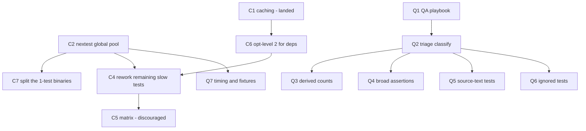

# Test-suite conformance and CI throughput

**Status:** planning document. Nothing framed or kicked.
**Grounding:** `origin/main @ bc10baff`. CI timings measured from
`actions/runs/{29828797671,29829654027}` job logs, 2026-07-21.
**Derives from:** `research/qa-conformance-to-rust-test-guidelines.md`
(QA advisory) and the observed CI wall-clock regression.

Preparatory to `10-linux-abi-completion.md`. Both programs add many
operations and many tests; doing this first means that work extends a
disciplined suite and a fast gate rather than compounding a slow one.

## 1. ★ Measured: it is the tests, and it is nine of them

> **This section previously asserted the opposite** — that a cold dependency
> build dominated the wall clock and the tests were unlikely to be expensive.
> **That was an inference from the absence of caching, not a measurement, and
> it was wrong.** The operator measured the build step; it is 47s. The
> correction is recorded rather than silently overwritten, because the error
> is instructive: *"there is no cache"* explains why a build **could** be
> slow, and I promoted that to a claim about where the time **went** without
> ever opening a run log. The timings below come from
> `actions/runs/<id>/jobs` and the job log, which were available the whole
> time.

Per-step timing, runs `29828797671` and `29829654027`:

| Step | Duration | Share |
|---|---:|---:|
| `cargo build --workspace --locked` | 44–47s | 1.6% |
| `cargo test` — compile + link test targets | 85s | 3.0% |
| `cargo test` — **test execution** | **44m14s** | **95.4%** |

Compilation in total is ~2m10s of a 47-minute run. **Execution is 95% of it.**

### The distribution is extremely concentrated

`cargo test` runs each test binary **to completion before starting the next**
— 200 binaries strictly in series, verified from the log's `Running`
timestamps. Deriving each binary's duration from the gap to its successor:

| Rank | Binary | Duration | Tests | Share of execution |
|---:|---|---:|---:|---:|
| 1 | `ken-cli/tests/rt_parity_native.rs` | **14m41s** | 7 | 33.2% |
| 2 | `ken-cli/tests/px8f_buffer_native.rs` | **5m10s** | **1** | 11.7% |
| 3 | `ken-verify/tests/px8f_write_partition.rs` | **5m09s** | **1** | 11.6% |
| 4 | `ken-elaborator/tests/b2_acceptance.rs` | 1m26s | — | 3.3% |
| … | | | | |
| — | **bottom 150 binaries combined** | **48s** | — | 1.8% |

- **Three binaries — nine tests — are 56.5% of the entire CI run.**
- Top 10 binaries: 75.9% of execution. Top 25: 93.4%.
- The other 150 binaries are collectively under a minute. **They are free.**

### The cost driver is native lowering per test

All three dominant binaries compile and link a real native artifact **per
test case**: `rt_parity_native` calls `ken_cli::build_native_program` in its
`differential()` helper once per case (7 cases ≈ 126s each), and both
`px8f_*` binaries do a full lower-plus-`cc`-link inside a **single** test.

Two consequences that shape the fix:

- **These are not accidentally slow tests; they are doing real codegen.** The
  target is the *cost per lowering* and the *serialization*, not the coverage.
- **A 1-test binary cannot be parallelized internally.** `px8f_buffer_native`
  and `px8f_write_partition` are ~310s each in a single `#[test]`, so they
  become the critical path the moment cross-binary parallelism exists.

### ⚠ What C1 (caching) actually bought — and why it is being removed

**Nothing measurable, and it could not have.** The build step is 47s, so
even a perfect cache saves under a minute of a 47-minute run.

> **Operator ruling, 2026-07-21: remove `Swatinem/rust-cache` as part of C6.**
> No measurable benefit, and it is an **extra third-party dependency with
> access to the build — a supply-chain attack surface** taken on for nothing.
> A dependency has to earn its place; this one does not. Tracked as **C8**.

I had argued C1 was worth keeping because it would absorb C6's one-time
dependency rebuild. That argument is weak: it defends a dependency on the
strength of a *hypothesis* (C6) that has not been tested, and it weighs only
time, never the trust surface. **A cache that saves under a minute is not
worth an action that runs inside our build.**

> ★ **A second reason not to judge C1 yet: GitHub scopes caches by ref.**
> After #804, `repos/{owner}/{repo}/actions/caches` held exactly one entry,
> keyed to `refs/pull/804/merge` (144 MB). **A cache written by a PR run is
> visible only to that PR** — `main` cannot read it and neither can any
> other PR. Only a run on the **default branch** writes a cache that later
> PRs can restore.
>
> So the observed sequence — PR run 39s (wrote a PR-scoped cache), then the
> post-merge `main` run 47s (restored nothing, 4s cache step) — is **exactly
> what a correctly-configured cache looks like on its first two runs**, not
> a broken one. The first genuinely warm restore is the first PR opened
> *after* a `main` run has finished saving.
>
> This generalizes past caching: **any "did it help?" comparison across a
> PR/main boundary is confounded by cache scoping.** Compare PR-to-PR.

### ⚠ Why a per-crate matrix is still not the first move

Not for the reason previously given. Compilation is cheap, so a matrix would
not multiply a dominant cost. It fails for a simpler reason: **the work is
concentrated in one crate.** `ken-cli` holds ranks 1 and 2; splitting by
crate leaves a ~20-minute `ken-cli` job as the new floor. Matrix-by-crate
cannot beat the slowest crate, and the slowest crate is where the problem is.

## 1a. ★★ Second measurement: the runner is saturated

Run `29838398785` (nextest, three binaries skipped) settles what is left to
win. **This supersedes the expectations in §3.**

| | |
|---|---|
| Tests run | 1891 (+3 `#[ignore]`d) |
| Wall clock, execution | **984s** |
| **Sum of per-test CPU time** | **3893s — 64.9 CPU-minutes** |
| **Effective parallelism** | **3.96x** on a 4-vCPU runner |
| Longest single test | **106s** |

**3.96 out of a theoretical 4.00. nextest is saturating the machine, so no
further scheduling change can help anything.**

### What C2 actually bought: ~11%

The same test set took 18m26s under `cargo test` and 16m24s under nextest.
**The 44m -> 17.6m improvement is almost entirely the skip, not the runner
swap.**

> ★ **The framing error.** §1 called it "a serial 200-binary walk," which
> reads as *fully* serial. It was not: `cargo test` already runs tests
> **in parallel within each binary** (libtest defaults to one thread per
> CPU). Only the 200 binaries were serial. So the available win was never
> 4x — it was just the inter-binary waste, and ~11% is about right for that.
> **A measurement described in words acquires whatever the words imply.**
> C2 remains worth keeping: it partitions (C9) and it reports per-test
> timing. But it is not a throughput win.

### The distribution is flat, which retires C4

At *binary* granularity three files were 56.5% of the run. At **test**
granularity there is no such concentration:

| Slice | Share of CPU |
|---|---:|
| top 1 (106s) | 2.7% |
| top 4 | 9.4% |
| top 20 | 32.2% |
| top 50 | 56.9% |

Reworking individual tests would mean fixing **dozens** for a few percent
each. **C4 is downgraded to "not worth doing"** on this evidence — the
concentration that justified it exists only at binary granularity, and the
binary-level fix was the skip, which is done.

### Therefore exactly two levers remain

The suite is **65 CPU-minutes of genuine work**. On 4 cores the floor is
16.4 minutes, and we are at 16.4.

1. **More cores — C9 sharding.** `nextest --partition count:N/M` splits by
   test across N jobs, each with its own 4-vCPU runner. 4 shards = 16
   effective cores.
2. **Less work — C6.** Attacks the 65 CPU-minutes rather than dividing it.

They multiply. They are also the *only* two: everything else is noise
against a saturated CPU.

## 1b. ★★ Outcome: 47 min -> ~8 min. Landed at `8b09fb95`.

Run `29841111547` (C9 shard x4 + C6 `opt-level` + C8 cache removal):

| Shard | Tests | CPU-s | Wall-s | Parallelism |
|---:|---:|---:|---:|---:|
| 1 | 543 | 976 | 375 | 2.60x |
| 2 | 498 | 1079 | **406** | 2.66x |
| 3 | 448 | 791 | 313 | 2.53x |
| 4 | 402 | 719 | 309 | 2.33x |

Critical path ~8 min (65s build + 406s worst shard + setup), from 47.

### Scorecard, per item

- **C8 was free.** Build went 40s -> 65s and *all* of that is C6. The cache
  was never warm once in its entire life, so removing it cost nothing. The
  supply-chain objection carried no throughput price at all.
- **C6 is real but small: 3893 -> 3566 CPU-s, −8.4%**, for +25s of build.
  Net positive. But this was written up as *the* per-test cost driver, and
  8% is not that. **Cranelift codegen was not dominating.** §3a's insistence
  on measuring rather than merging on plausibility is the reason this is a
  known 8% instead of an assumed 50%.
- **C9 gave 2.3x wall clock from 4x the cores**, not 4x — see below.

### ★ The finding: sharding degrades its own parallelism

Per-shard parallelism fell from **3.96x to ~2.5x**. With ~470 tests per
shard instead of 1891, there is less work to overlap: each shard's tail
cannot fill 4 cores, and the 106s longest test is now **26% of shard 2's
entire runtime**.

**This caps sharding as a strategy.** Doubling to 8 shards halves
tests-per-shard again and pushes efficiency below 2x — an estimated ~90s
gain for double the compute. **Do not shard further.**

Two smaller residuals, neither obviously worth taking:

- **36% shard imbalance** (1079 vs 719 CPU-s). `--partition count` is
  round-robin by test *index*, not duration, so heavy tests cluster by luck.
  Perfect balance saves ~55s off the critical shard.
- **The 106s floor.** No scheduling change crosses it.

### Compute cost, honestly accounted

Billed runner-time went ~1024s -> ~1660s, about **1.6x** — not the 4x
warned about, because C6's savings partly offset four repeated builds.

### 1c. Restoring the skipped binaries — the headroom argument

The critical shard is ~471s (65s build + 406s tests). Any job that finishes
under that adds **zero wall clock**, because it runs in parallel and never
sets the pace. That is the budget for buying coverage back.

| Binary | Tests | Measured | Fits? |
|---|---:|---:|---|
| `px8f_write_partition` | 1 | 309s | ✅ **restored** — ~374s with build |
| `px8f_buffer_native` | 1 | 310s | ✅ fits identically — restore next |
| `rt_parity_native` | 7 | 881s | ❌ ~2x the critical path |

Each goes in **its own job**, not back into a shard. A single 5-minute
`#[test]` cannot be subdivided, so inside a shard it just becomes that
shard's critical path and pushes the whole gate out.

> ★ **These are the tests C6 should help most.** C6 gave 8.4% suite-wide,
> but that average is dominated by ~1880 tests that barely touch cranelift.
> These three do a full native codegen-and-link per case. **The 309s figure
> is a PRE-C6 measurement** — if C6's effect is concentrated where the
> cranelift work is, this job should come in well under it. That comparison
> is the cleanest read we will get on what C6 actually bought, and it is
> free: the number falls out of the next run.

> ⚠ **The filter is stated in two places and they must stay complementary.**
> The binary is *excluded* from the shard lane and *included* in its own job.
> Change one without the other and the test is silently duplicated, or
> silently dropped — **and a dropped test still shows a green gate.** Likewise
> every test-running job must appear in the aggregator's `needs` *and* be
> checked in its script; a job missing there reports green however it failed.

### 1d. Experiment: does `rt_parity_native` parallelize? (PR #808, closed)

**It parallelizes fine. One test is the floor.** nextest ran all 7 in
**266.7s** against **470.6s** of CPU:

| Test | Duration |
|---|---:|
| `buffer_freeze_malformed_span_...` | 1.2s |
| `fs_write_at_malformed_offset_without_write_right_...` | 42.2s |
| `buffer_allocate_malformed_capacity_...` | 45.3s |
| `fs_read_at_malformed_offset_...` | 53.0s |
| `fs_read_at_malformed_window_...` | 53.7s |
| `fs_read_at_malformed_offset_without_read_right_...` | 53.9s |
| **`fs_write_at_malformed_offset_narrows_to_invalid_offset`** | **221.4s** |

> ★ **Both pre-registered predictions were wrong** (~170-250s "parallelizes"
> / ~680s "serial"). The binary framing was the error: I assumed uniform
> tests that either parallelize or don't. Six parallelize well; **one
> outlier sets the wall clock**, and no scheduler can subdivide a single
> test. Pre-registering the readings was still right — it is what made the
> miss obvious instead of something to narrate around.

**Not restored.** Job total ~470s against a ~471s critical shard fits by
about a second — noise, not headroom, and it would make `rt_parity`
co-critical with zero margin.

**The target is narrow and specific.** Compare two tests with near-identical
names and nominally the same shape of work:

- `fs_write_at_malformed_offset_without_write_right_...` — **42s**
- `fs_write_at_malformed_offset_narrows_to_invalid_offset` — **221s**

**5x**, where the three read-side counterparts are all ~53s. That asymmetry
looks pathological rather than inherent. Bring that one test into sibling
range and the binary lands near 90s and fits trivially — restoring 7 tests
of coverage for one test's worth of investigation.

### 1e. ✅ TAKEN and CONFIRMED: the dedicated jobs no longer over-compile

**Landed in PR #810 (`fd065d07`). Confirmed by isolation**, not by the job
total: `px8f_write_partition` is the same binary in both runs below, and
scoping is the only variable between them.

| run | Test step | Build step |
|---|---:|---:|
| 29850405231 (`--workspace`) | 241s | 67s |
| 29850680007 (`-p ken-verify --test …`) | **129s** | 65s |

**−112s per job per run**, against the ~124s estimated below — the estimate
held. `px8f_buffer_native` scoped measures 149s Test / 224s job.

> ⚠ **Do not read `native-buffer`'s 224s as confirming the C6 projection.**
> §1c projected ~240s for that job, and 224s looks like a hit — but the
> projection was of an **unscoped** job, and scoping (−112s) rode in the
> **same PR**. Unscoped it would have been ~336s: the projection was ~40%
> high and only looked right because a second change was bundled with it.
> **C6's −22.7% on `px8f_write_partition` remains the only clean C6
> measurement on cranelift-heavy code — one data point, not a scaling law.**

The original argument, kept for the reasoning:

### ⚠ (as written before the change landed)

`native-slow`'s Test step measured 390s while nextest itself ran for only
266s. **The other ~124s is compiling all 200 test binaries in order to run
one**, because the job says `cargo nextest run --workspace`.

Scoping it — `-p ken-cli --test rt_parity_native`, and likewise
`-p ken-verify --test px8f_write_partition` — compiles only what that job
runs. **This was being paid on every run** by the merged `native-slow`
job. It does not change the critical path (that is still a shard), but it is
~2 minutes of wasted compute per run and it widens the headroom that decides
which binaries can come back.

⚠ Check before assuming it is free: the shard lane must keep `--workspace`,
and a scoped job no longer proves the rest of the workspace still compiles —
which is fine only because the shards already do.

### ⛔ Stop here

The per-test distribution is flat (§1a), so there is no fat left to cut. The
remaining levers are each worth 1-2 minutes for real complexity. **The next
genuine reduction has to come from the three skipped binaries
(`CI-SKIPPED-NATIVE-TESTS`) getting faster, not from scheduling.**

## 2. The suite, measured

At `62643287`, against the advisory's 2026-07-18 baseline:

| Crate | `#[test]` | Advisory (07-18) |
|---|---:|---:|
| `ken-elaborator` | 1052 | 1037 |
| `ken-runtime` | 286 | 222 |
| `ken-kernel` | 202 | 202 |
| `ken-interp` | 166 | 155 |
| `ken-cli` | 111 | 93 |
| `ken-host` | 46 | 45 |
| `ken-verify` | 24 | 23 |
| `ken-foundation` | 22 | 22 |
| **Total** | **1905** ⚠ | 1799 |

> ⚠ **This total read 1909 until 2026-07-21, and the correction is instructive.**
> `grep -c '#\[test\]'` counts the attribute **mentioned in prose** — e.g.
> `rt_parity_native.rs:3`, a doc comment reading ``//! Each case is its own
> `#[test]` ...``. Four such mentions across two files inflated the count.
> The real figure is **1905**.
>
> ★ **I had cited the agreement between two counts as validation, and that
> was worthless.** `scripts/qa-risk-scan.py` independently "reproduced 1909",
> which I reported as a cross-check confirming the scanner was not dropping
> tests. **Both methods used the same naive `#[test]` match, so both made the
> same mistake and agreed.** A differential oracle is blind to a premise its
> two sides share — agreement between two instances of one method is not
> corroboration, it is an echo. The scanner's real defect (a phantom test
> named `output_dir` carrying 430 lines of unrelated matches) was found by
> **Team Foundation reading the source**, not by any count.

**+110 tests in three days.** The suite is growing fast, which is why the
discipline matters now rather than later — every week of delay is more tests
written without the guidance.

`#[ignore]` is down to **1** (advisory found 3), so two were already
resolved.

> **Measurement caveat.** Raw greps for `include_str!` and `.is_err()` count
> *occurrences*, while the advisory counted *assertions in tests*. The two
> are not comparable and a larger raw number is not a regression. The sweep
> must classify, not count — which is the advisory's own central point.

## 3. Program

### Track C — CI throughput

| ID | Objective | Size |
|---|---|---|
| **C1** | ✅ **Landed (PR #804).** Dependency/target caching. Worth ~5s; keep it for the `opt-level` rebuild it makes affordable, but it is **not** a throughput item. | S |
| **C2** | **Adopt `cargo-nextest`.** The reason is no longer instrumentation (§1 already has per-binary timing) — it is that nextest schedules **every test across every binary against one global thread pool**, replacing today's strictly-serial 200-binary walk. This is the largest single win available and it is a config change. | S |
| **C6** | **`[profile.dev.package."*"] opt-level = 2`.** Cranelift at `opt-level = 0` is pathologically slow *at runtime*, and §1's cost driver is cranelift codegen executed 9 times. A 3-line `Cargo.toml` change; costs a one-time dependency rebuild that C1's cache absorbs. **Hypothesis, not a measurement** — see §3a. | S |
| **C7** | **Split the two 1-test binaries.** `px8f_buffer_native` and `px8f_write_partition` are ~310s in a single `#[test]` each, so no scheduler can subdivide them; after C2 they *are* the critical path. Split each into independent cases, preserving what each asserts. | S |
| **C9** | **Shard with `nextest --partition count:N/4`** across a 4-job matrix — 16 effective cores against a saturated 4. Splits by *test*, so it does not floor at the slowest crate the way a per-crate matrix would. ⚠ Keep a job literally named `build + test`: it is a **required status check**, and a matrix publishes `test shard N/4` instead. | S |
| **C4** | ~~Rework the remaining slow tests.~~ **Retired** — §1a shows the per-*test* distribution is flat (top 20 = 32% of CPU). The concentration existed only at binary granularity, and the skip already addressed that. | — |
| **C3** | Evaluate dropping the separate `build` step — it is 47s of duplicated work. Cosmetic at this scale. | S |
| **C8** | **Remove `Swatinem/rust-cache`** (operator ruling, §1). Do it **with** C6, so one run measures both the optimization and the cache removal against the same baseline. | S |
| **C5** | Per-crate matrix. **Discouraged** — §1 shows the load is concentrated in `ken-cli`, so a matrix floors at the slowest crate. Revisit only if C2+C6+C7 disappoint. | M |

**Order: C2 → C6 → C7, then re-measure.** These are three independent
multipliers on the same 44 minutes, and all three are small:

- **C2** attacks the *serialization* (200 binaries in series → one pool).
- **C6** attacks the *per-lowering cost* (cranelift compiled unoptimized).
- **C7** attacks the *residual critical path* C2 exposes.

**Re-measure between each.** Landing all three and reporting one number
would leave us unable to say which worked — and C6 in particular is a
hypothesis that deserves its own before/after.

### 3a. ⚠ C6 is a hypothesis; here is how it fails

The claim is that cranelift built at `opt-level = 0` executes its codegen
slowly enough to explain ~126s per native lowering. That is a *well-known*
pattern for compiler-shaped dependencies, and it is consistent with §1's
evidence — but nothing here measures it. It fails if the time is actually in
the `cc` link, in I/O, or in Ken's own elaboration rather than in cranelift.

**Do not merge C6 on plausibility.** The test is one CI run with the three
lines added and nothing else changed, compared against §1's per-binary table.
CI is the correct place to run it — it is the offloaded compute, and a
local dependency rebuild at `opt-level = 2` is exactly the kind of full-graph
build that OOMs the box (CLAUDE.md / COORDINATION §12).

### 3b. ★ C6 and C8 interact — measure the BUILD step, not just the tests

C6 raises optimization on **every dependency**, cranelift included. That
cuts codegen time at *run* time, which is the point — but it can only
*increase* dependency **compile** time. C8 removes the cache in the same
change, so **every run pays that increase in full**.

Today the build is 47s, so there is nothing to protect. If C6 pushes it to
several minutes, C8's removal stops being free and the two items are in
genuine tension.

**So the C6 run must report the Build step's duration, not only the test
numbers.** Three outcomes, decided in advance so the result is not
rationalized after the fact:

| Build after C6 | Reading |
|---|---|
| still under ~1 min | C6 and C8 are both clean wins. Land both. |
| 1–3 min | Acceptable; C8 still right — a minute is not worth a third-party action inside the build. |
| much larger | Real tension. **Return it to the operator** with the number; do not silently reinstate the cache to protect C6. |

If the third case arrives, note that `actions/cache` is **first-party
GitHub**, so the supply-chain objection that retires `Swatinem/rust-cache`
does not automatically apply to it. That is an option to *offer*, not a
decision to take.

### 3c. ⚠ C2 introduced a dependency of exactly the same class

The operator's objection to `Swatinem/rust-cache` is about third-party code
running inside our build. **C2 added `taiki-e/install-action@nextest`,
unpinned, which is the same class of exposure** — and `cargo-nextest` itself
is a new build-time dependency.

The difference is that nextest **earns it**: it is the mechanism that
replaces the serial 200-binary walk, which is the actual problem. `rust-cache`
bought under a minute. That is the test a dependency has to pass.

Two cheap hardenings worth taking regardless, neither blocking:

- **Pin the action to a commit SHA**, not a floating tag. An unpinned tag is
  mutable by whoever controls the repository.
- Consider installing nextest from a **pinned, checksum-verified release
  archive** instead of via a third-party action, removing the action from
  the trust base while keeping the tool.

### Track Q — test-suite conformance to the guidelines

1905 tests cannot be hand-reviewed, and most are fine. The advisory is
explicit that its scans are **review queues, not defect counts**. So the
sweep triages, then reworks only what fails classification.

| ID | Objective | Size |
|---|---|---|
| **Q1** | ✅ **DONE — and mostly already was.** See the correction below. | S |
| **Q2** | ✅ **DONE 2026-07-21.** 428 triaged, 100% classified, six rings in parallel. 91.6% durable-invariant. Result: [`qa-triage/FINDINGS.md`](qa-triage/FINDINGS.md). | M |
| **Q-RESIDUE** | ✅ **DONE 2026-07-21 — merged `origin/main @ 64337192` (PR #818).** Q3–Q7 folded into one item (operator) against the post-triage residue: **10 tests**, not the ~110 the scan hit counts implied. Q4 and Q7 produced **zero** defects. Inventory, acceptance criteria and the cross-team routing note: [`issues/Q-RESIDUE.md`](issues/Q-RESIDUE.md). | S |

> ## ✅ TRACK Q IS COMPLETE (2026-07-21).
>
> Q1, Q2 and Q-RESIDUE all merged. **The track's most durable output is not
> the ten reworked tests — it is the evidence that the suite was already
> largely sound (91.6%) and that AC-2's mutation proof works.**
>
> ★ **AC-2 paid for itself on its first application.** Mutation-proofing
> caught a *first draft* of the settlement-ordering rework that only
> hand-sequenced two helper functions instead of invoking the real
> `unsafe extern "C"` entrypoint — a test exercising a **proxy** rather than
> the **mechanism**, which would have sat green through a real regression.
> That is exactly the defect class Q-RESIDUE existed to remove, caught
> *before* it shipped, by the gate rather than by review. **Carry this into
> every future test-rework item: a green rewrite proves nothing on its own.**
>
> ⚠ **One caution on the receipts.** The highest-risk rework has *three*
> independent mutation runs agreeing on the same panic. That is three
> confirmations of **one** discriminator, not three discriminators — if the
> chosen seam is the wrong one, all three agree and are all wrong together.
> Flagged to the adversary at merge (`evt_4g7qasxqdy5s8`).

> ## ✅ Q2 IS DONE. Q3–Q7 ARE ~10 TESTS, AND TWO TRACKS ARE EMPTY.
>
> **428 tests triaged, 100% classified, six rings in parallel (2026-07-21).**
> Full result: [`qa-triage/FINDINGS.md`](qa-triage/FINDINGS.md).
>
> | class | count | share |
> |---|---:|---:|
> | durable-invariant | 392 | **91.6%** |
> | compat-vector | 19 | 4.4% |
> | transition-sentinel | 7 | 1.6% |
> | UNCLASSIFIABLE | 10 | 2.3% |
>
> **Q4 (broad outcome assertions) and Q7 (timing/fixtures) are EMPTY.** All
> 147 R2 hits and all 27 R5 hits classified as sound durable invariants.
> Q3 ≈ 3 tests, Q5 ≈ 6, Q6 = 1 unlabelled sentinel.
>
> ★ **Those two tracks were sized from HIT COUNTS, and hit counts carried
> almost no signal about defects.** Authorizing Q3–Q7 off the scan totals
> would have committed the fleet to reworking ~300 correct tests. This is
> the advisory's own framing vindicated: **review queues, not defect
> counts.** ✅ **The operator folded Q3–Q7 into one S against the
> residue: `issues/Q-RESIDUE.md`.**

**Q1 before Q2–Q7 — both now done.** The playbook is what makes the rework
durable; doing the edits first and writing the guidance later means the next
110 tests repeat the pattern. Kept because the ordering rule still binds
Q-RESIDUE: the playbook is landed, so the rework has guidance to conform to.

> ### ⚠ Q1 was written stale — I described work that was already done
>
> | | |
> |---|---|
> | advisory written (`35d24ebb`) | 2026-07-18 03:40 |
> | QA playbook encoded it (`2ae8cb25`) | 2026-07-18 03:45 — **five minutes later** |
> | Q1 authored, as if neither existed | **2026-07-21** |
>
> `agent/playbooks/build/qa.md` §"Test design" already carried all three
> promise classes, the "cannot classify → Block" rule, and ten hard review
> gates. **I wrote the Q1 row from a plausible story — "an advisory exists,
> so it must need encoding" — without opening the artifact.** Same shape as
> the §1 CI misdiagnosis: an explanation for why something *could* need
> doing is not evidence that it does.
>
> **The real gap was routing, and it was invisible until the artifact was
> read.** The advisory splits into a **review** checklist (§9) and an
> **authoring** workflow (§6). The playbook had encoded §9 into the QA
> role — but QA *reviews* tests and implementers *write* them, and
> `implementer.md` carried **no reference to the advisory at all**. So the
> guidance reached reviewers and never reached authors, which is the wrong
> end: a class declared at authoring time is free, and one discovered at
> review costs a round trip.
>
> **What actually shipped for Q1:** the promise-class obligation, the
> discriminating question ("which extensions keep this green, which turn it
> red?"), the never-freeze-a-derived-count rule, and a **pointer** to §6/§7
> added to `agent/playbooks/build/implementer.md` step 4. Deliberately a
> pointer and not a copy — a second copy of the advisory is precisely the
> preserved-but-stale defect this program keeps hitting.

> **★ The Q7/nextest interaction — RESOLVED EMPIRICALLY, kept as a record.**
> The concern was that adopting nextest (C2) raises parallelism and can turn
> a latent shared-fixture assumption into a flake, so that "nextest broke the
> suite" would be misdiagnosed when nextest had merely *revealed* it.
>
> **C2 has now landed and the suite is green across four shards plus two
> dedicated native jobs, and Q2 triaged all 27 wall-clock/environment flags
> as sound.** The predicted coupling did not materialise. The reasoning was
> right and the risk was real; it simply did not obtain here. Recorded rather
> than deleted, because the *next* parallelism increase reopens exactly this
> question.

## 4. Sequencing and token efficiency

- **C2, C6, and C7 are the program.** Three small changes against a 44-minute
  execution phase, each attacking a different multiplier. Everything else in
  Track C is cleanup by comparison.
- **The tail is not worth touching.** 150 of 200 binaries total 48 seconds.
  Any effort spent there is effort not spent on nine tests that own 56.5% of
  the run — that is the token-efficiency call, and it is not close.
- **Q2 is mechanical and parallelizable.** Classification per crate is
  exactly the shape to delegate cheaply — it reads and lists, it does not
  design. The rework WPs that follow are where judgment is spent.
- **Q1 before the rework** is the token argument: the suite grew by 110 tests
  in three days. Guidance that lands after the sweep pays to fix the same
  class twice.
- **C7 and Q7 are the same edit seen from two sides.** C7 splits the 1-test
  native binaries for parallelism; Q7 gives temp dirs per-test ownership so
  that parallelism is safe. Doing either alone invites a flake that reads as
  "nextest broke the suite." Sequence them together.

## 5. Publishing note

The `workflows` permission blocker (`CI-TRACKER-GATE`) is **resolved** — the
operator granted it 2026-07-21 and C1 published through the normal path.

Of the remaining items, only **C2** and **C3** touch
`.github/workflows/ci.yml`. **C6 and C7 do not** — C6 is a root `Cargo.toml`
edit and C7 is a test-file split, so both publish through the ordinary path
with no special permission.

## 6. Out of scope

- Rewriting tests that already classify cleanly. Most of the suite is fine
  and the advisory says so; volume is not the target.
- Reducing test count as a goal in itself. Coverage at the wrong seam is the
  hazard, not coverage.
- Any change to what the gate *means*. This program makes the gate faster and
  the tests honest; it does not weaken the merge criterion.
