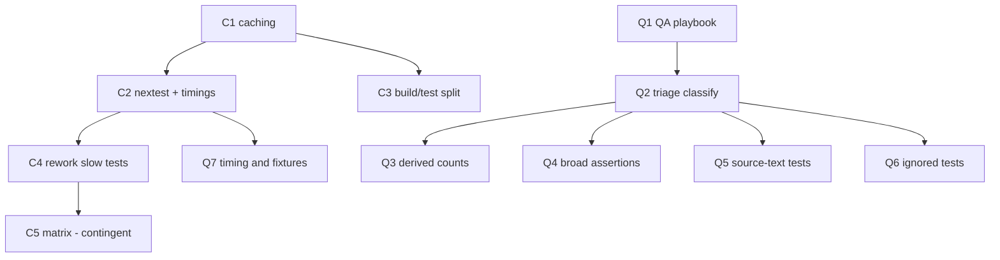

# Test-suite conformance and CI throughput

**Status:** planning document. Nothing framed or kicked.
**Grounding:** `origin/main @ 62643287`, measured directly.
**Derives from:** `research/qa-conformance-to-rust-test-guidelines.md`
(QA advisory) and the observed CI wall-clock regression.

Preparatory to `10-linux-abi-completion.md`. Both programs add many
operations and many tests; doing this first means that work extends a
disciplined suite and a fast gate rather than compounding a slow one.

## 1. ★ The CI problem is almost certainly not the tests

The workflow has four jobs. **Three are placeholders** (`conformance`,
`clean-room`, `path-guard` all `echo`). All real work is one job:

```yaml
build-test:
  runs-on: ubuntu-latest
  steps:
    - uses: actions/checkout@v4
    - run: cargo build --workspace --locked
    - run: cargo test --workspace --locked
```

**There is no caching of any kind** — no `Swatinem/rust-cache`, no
`actions/cache`, no target-directory or registry reuse. Every run compiles
the entire dependency graph from scratch, including `cranelift-codegen`,
`cranelift-frontend`, `cranelift-jit`, and `cranelift-module` (0.113.1) in
`ken-runtime`. That is a large, slow-to-compile tree.

So the 36–48 minute wall clock is **dominated by a cold build**, not by test
execution. The tests are the visible thing, but they are unlikely to be the
expensive thing.

### ⚠ Parallelizing first would make it worse

The intuitive fix — a per-crate matrix — is actively harmful **before**
caching exists. Each matrix job checks out cleanly and compiles the shared
dependency graph *again*. Splitting into N jobs multiplies the dominant cost
by N. It would reduce wall-clock somewhat through concurrency while
substantially increasing total compute, and it would make every job's cold
build the new floor.

**Cache first. Measure second. Parallelize only if the numbers still ask for
it.**

### ⚠ We cannot currently identify slow tests

`cargo test` reports no per-test timing. Nothing in the pipeline records
duration. "Identify and rework long-running individual tests" is therefore
**not actionable today** — the data does not exist. Instrumentation precedes
surgery, or we will optimize by guess.

## 2. The suite, measured

At `62643287`, against the advisory's 2026-07-18 baseline:

| Crate | `#[test]` | Advisory (07-18) |
|---|---:|---:|
| `ken-elaborator` | 1052 | 1037 |
| `ken-runtime` | 286 | 222 |
| `ken-kernel` | 202 | 202 |
| `ken-interp` | 166 | 155 |
| `ken-cli` | 111 | 93 |
| `ken-host` | 46 | 45 |
| `ken-verify` | 24 | 23 |
| `ken-foundation` | 22 | 22 |
| **Total** | **1909** | 1799 |

**+110 tests in three days.** The suite is growing fast, which is why the
discipline matters now rather than later — every week of delay is more tests
written without the guidance.

`#[ignore]` is down to **1** (advisory found 3), so two were already
resolved.

> **Measurement caveat.** Raw greps for `include_str!` and `.is_err()` count
> *occurrences*, while the advisory counted *assertions in tests*. The two
> are not comparable and a larger raw number is not a regression. The sweep
> must classify, not count — which is the advisory's own central point.

## 3. Program

### Track C — CI throughput

| ID | Objective | Size |
|---|---|---|
| **C1** | Add dependency/target caching (`Swatinem/rust-cache` or equivalent) to the real job. Single highest-value change; near-zero risk. Record before/after wall clock. | S |
| **C2** | Adopt `cargo-nextest` for the test step. Faster execution, better parallelism, and — the point — **per-test timing output**. This is the instrumentation that makes C4 possible. Verify it runs the same test set as `cargo test` before switching the gate. | S |
| **C3** | Split `build` from `test` and stop double-compiling: `cargo build --workspace` then `cargo test --workspace` partially rebuilds. Evaluate whether the separate build step earns its time once caching exists. | S |
| **C4** | **Using C2's timings**, identify the slowest tests and rework them. Only now is this grounded. Expect a small number of dominant offenders rather than uniform slowness. | M |
| **C5** | Reconsider a per-crate matrix **only if** C1–C4 leave the gate unacceptably slow. Explicitly gated on evidence. | M |

**Strict order: C1 → C2 → C4.** C1 removes the dominant cost, C2 makes the
remainder visible, C4 acts on what C2 shows. C3 and C5 are contingent.

### Track Q — test-suite conformance to the guidelines

1909 tests cannot be hand-reviewed, and most are fine. The advisory is
explicit that its scans are **review queues, not defect counts**. So the
sweep triages, then reworks only what fails classification.

| ID | Objective | Size |
|---|---|---|
| **Q1** | Encode the advisory as a QA playbook the fleet actually loads: the three promise classes (durable invariant / normative compatibility vector / transition sentinel), and the ten-step conformance-to-test workflow. **A test that cannot be classified is not ready.** Without this, the sweep's lessons decay. | M |
| **Q2** | Triage pass: classify every test into a promise class, producing a queue of unclassifiable or misclassified ones. Mechanical and parallelizable per crate. **Output is a list, not edits.** | M |
| **Q3** | Rework the derived-count and stateful-name findings — counts derivable from an authoritative set in another crate, and names freezing a transient census. This is the class that caused the original incident. | M |
| **Q4** | Rework broad outcome assertions: a negative conformance case asserting only "some error" must assert the exact variant and the fields identifying the rule. Includes the `Err(_)` alternative that subsumes its own named alternative. | M |
| **Q5** | Rework source-text tests toward mechanism checks — compiler visibility, type-level construction failure, AST/token inspection, or a lint. Where raw source inspection is the only available net, scan the mechanism rather than a bare name, state the limitation, and add a mutation proving the scan bites. | M |
| **Q6** | Resolve the remaining `#[ignore]` and any placeholder: either omit and track as conformance debt, or keep a marker with a concrete reification trigger that QA blocks on. **An ignored test is never coverage.** | S |
| **Q7** | Move wall-clock assertions into a performance lane with wide good/bad separation; ensure timing is never the sole correctness oracle. Give temp dirs unique per-test ownership so parallel runs cannot couple — **this interacts with C2**, since nextest raises parallelism and will expose shared-fixture coupling. | S |

**Q1 before Q2–Q7.** The playbook is what makes the rework durable; doing
the edits first and writing the guidance later means the next 110 tests
repeat the pattern.

**★ Q7 has a dependency people will miss:** adopting nextest (C2) increases
test parallelism, which can turn a latent shared-fixture assumption into a
flake. Sequence C2 and Q7 together, or expect to debug "nextest broke the
suite" when in fact nextest revealed it.

## 4. Sequencing and token efficiency



- **C1 is the cheapest large win in either program.** It is a workflow edit
  and it plausibly removes most of the wall clock. Do it first regardless of
  everything else.
- **Q2 is mechanical and parallelizable.** Classification per crate is
  exactly the shape to delegate cheaply — it reads and lists, it does not
  design. The rework WPs that follow are where judgment is spent.
- **Q1 before the rework** is the token argument: the suite grew by 110 tests
  in three days. Guidance that lands after the sweep pays to fix the same
  class twice.
- **C4 must not start before C2.** Reworking tests for speed without timing
  data is optimizing by guess, and guesses here cost a T1 seat.

## 5. Blocked on the operator

**C1, C2, C3, and C5 all edit `.github/workflows/ci.yml`, which the scripted
publisher cannot push** — its GitHub App token lacks `workflows` permission
(issue `CI-TRACKER-GATE`). **The entire CI track is blocked on that
permission**, or on the operator applying those changes by hand.

This is now blocking real throughput work, not just a bookkeeping gate.

## 6. Out of scope

- Rewriting tests that already classify cleanly. Most of the suite is fine
  and the advisory says so; volume is not the target.
- Reducing test count as a goal in itself. Coverage at the wrong seam is the
  hazard, not coverage.
- Any change to what the gate *means*. This program makes the gate faster and
  the tests honest; it does not weaken the merge criterion.
