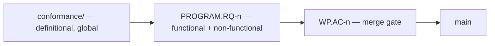

# Requirements and acceptance criteria — the three tiers and the one direction

> **Owner:** Steward · **Origin:** operator design decisions 2026-07-26, in two
> messages. This doc is **law for how work is framed**, not advice. ⛔ It binds
> every frame authored after it lands.

## 1. The three tiers

| tier | what it is | scope | who reads it |
|---|---|---|---|
| **`conformance/`** | **strategic, definitional, global.** The guidance the fleet uses to know we are achieving what we set out to achieve. | the whole system, permanently | everyone |
| **`RQ` — requirement** | **program-level.** Functional and non-functional properties the component WPs must satisfy **collectively**. | one work program | the program's ring(s), the Steward, the Architect |
| **`AC` — acceptance criterion** | **operational, tactical.** What gates a candidate to `main`. | one WP | that WP's ring |

**An AC is an application of a requirement to a specific operational goal. A
requirement is an application of the conformance specs to a program.**

⇒ **One direction, three tiers.** An AC refers **up** to a requirement; a
requirement refers **up** to conformance. ⛔ Nothing refers down, and nothing
skips a tier silently — see §4 for the two permitted "none" cases.

## 2. Naming — mandatory

| object | spelling | example |
|---|---|---|
| acceptance criterion | **`<WP-id>.AC-<n>`** | `RT-FNSPLIT-B2V.AC-6` |
| requirement | **`<PROGRAM-id>.RQ-<n>`** | `RT-NATIVE-FNSPLIT.RQ-3` |

⭐ **Why the qualifier is not cosmetic.** Before this rule, five WPs shipped five
different schemes — `AC-11` (`B2F`), `AC-E1`–`AC-E8` (`B2E`), `AC-S4`
(`SPEC-CLOSURE-BOUNDARY`), `AC-M1` (`SPEC-MISSION-GROUNDING`), `AC-A1`
(`SPEC-ALIGN-A1`) — each a one-letter mnemonic chosen at authoring time by the
same author. **The convention already existed in spirit and failed because the
prefix was a choice.** Deriving it from the WP id removes the choice.

Short forms (`AC-6`) are fine **inside** the WP's own frame, where the WP is
unambiguous. ⛔ **Any cross-WP reference — a channel post, a ruling, another
frame, a retro — uses the qualified form.** That is where the ambiguity bites.

### ⛔ Do NOT renumber an in-flight WP's ACs

`RT-FNSPLIT-B2E` is live and its `AC-E5` is cited by an Architect ruling
(`dec_6r447gawdp6hy`) and by channel traffic that **cannot be edited**.
Renumbering mid-WP is a rebind hazard with no upside. ⇒ **In-flight and merged
WPs keep their spellings**; read `B2E.AC-E5` as the qualified form of the
existing `AC-E5`. New frames use §2 from the start.

## 3. Requirements: functional and non-functional

**Functional** — what the program must make true. *"Boundary values transferred
across a cross-owner call are eliminated through the `B2V` interface in
production traffic."*

**Non-functional** — bounds and qualities. *"Cross-owner call overhead does not
regress against the pre-split baseline."* *"Equality on canonical values is
O(1)."*

⭐ **NFRs are where a performance commitment relaxed out of the spec LANDS.** The
mission-alignment campaign's recommendation on the content store is to *"express
O(1) equality, if Ken deliberately promises it, as a performance profile or
complexity contract rather than as a mandated hash table."* A complexity contract
is not a conformance row and not a WP AC — **it is a program NFR.** ⇒ Without
this tier, relaxing a mandated mechanism would silently delete the promise the
mechanism was there to keep. With it, the mechanism becomes free and the promise
stays stated. **That is the difference between relaxing a mechanism and dropping
a guarantee.**

## 4. The two link rules — each with a cell for the honest answer

**Rule 1 — every AC names the requirement it applies, or `none` with a reason.**

**Rule 2 — every RQ names the conformance rows it applies, or `none` with a
reason.**

⛔ **The `none` cell is load-bearing, not a loophole.** Both legitimate cases are
common:

| case | example |
|---|---|
| an AC with no RQ — a **process or inertness control** | `SPEC-ALIGN-A1.AC-6`: "zero `crates/` change, verified with a positive control." It applies nothing definitional. |
| an RQ with no conformance row — a **program-level NFR** | "no CI regression"; a complexity contract that no seed case asserts |

⚠ **Without the `none` cell, a mandatory-citation rule manufactures plausible
wrong links — and a wrong citation is worse than an absent one, because it reads
as verified.** Measured, twice on 2026-07-26: `SPEC-ALIGN-A1`'s frame cited
`seed-canonical-format.md:10` for a formatter width that line does not state, and
its stop-class domain omitted the cell its own expected answer needed. Both were
found by the receiving seat, not by review.

⇒ ⭐ **A citation is checked at its LINES, not at its file.** A locator has two
coordinates, and re-deriving the file is not evidence about the lines.

## 5. ⭐⭐ The payoff: a residual becomes computable

**A residual is not a new object. It is an RQ that no AC references yet.**

That single identity is why this scheme is worth its overhead. The measured
failure it fixes, from `RT-NATIVE-FNSPLIT`:

| WP | its ACs | what stayed false |
|---|---|---|
| `B2O` | all discharged | shipped a partition, could not check one-for-one consumption |
| `B2R` | all discharged | declared ownership modes, could not check obedience |
| `B2V` | all discharged | landed a representation, cannot check consumption |

**Three consecutive WPs, every AC satisfied, and the property the program exists
to deliver was not yet true.** Each residual was found by the node *downstream*,
at the cost of hard stops `#9`, `#10`, `#11` — three Architect rulings and two
re-slices. ⛔ **The union of per-WP ACs is not closed under composition**, and it
cannot be: an inert increment cannot have an AC for the thing its inertness makes
unverifiable.

⇒ Under §1–§4 that program has an RQ — *"boundary values are eliminated in
production traffic"* — which is **unreferenced by any AC** through `B2O`, `B2R`,
and `B2V`. Three green WPs with a visibly open requirement, continuously, instead
of a surprise one node later.

**And it is a check, not a discipline:** walk a program's RQs, walk its component
WPs' ACs, report every RQ with no inbound reference. `scripts/check-rq-ac-links.sh`.

⭐ **This subsumes two objects the Steward had proposed** — a separate residual
id (`.R-n`) and program exit criteria (`.EX-n`). Both are withdrawn. A residual
is a derived notion, and exit criteria are just the program's RQs. **One object,
not three.**

## 6. Scope — who must have RQs (operator, 2026-07-26)

| work | RQs required? |
|---|---|
| **completed** — every node `merged` or `closed` | ⛔ **no.** Do not retrofit. |
| **in progress** | ✅ **yes, retroactively** |
| **all future work** | ✅ **yes, at authoring time** |

**"In progress" is defined mechanically, so it is not a judgement call:** a work
program is in progress if it has at least one node whose `status` is `ready`,
`active`, or `in-review`. ⚠ Re-derive from `docs/program/issues/*.md`; do not
trust a list in a doc.

⛔ **A completed program's RQs are not written retroactively even when they would
be easy.** The point of an RQ is to be open while work is outstanding; one
written after everything landed can only be a description, and a description that
looks like a check is worse than nothing.

⭐ **One exception, and it is evidence rather than bookkeeping:** the
`RT-NATIVE-FNSPLIT` retrofit covers its **merged** nodes too, because that
program's residual chain was discovered by hand and is therefore **gradeable** —
it is the one place we can ask whether the §5 check would have surfaced `#11`
before `B2F` was kicked. ⇒ That answer is reported in the program's RQ block. If
the check would *not* have caught it, this doc is wrong about its main claim and
should be reduced to the naming convention alone.

## 7. Where RQs live

In the work program's **governing artifact**, in one `## Requirements` section —
its program doc (`docs/program/NN-*.md`), or its **umbrella issue node** where the
program is represented by one (`RT-NATIVE-FNSPLIT`, `SPEC-MISSION-GROUNDING`).
⛔ **Not scattered across its member nodes**, because the entire point is that an
RQ is *not* any node's.

A node names the RQs it serves in its frame's acceptance-criteria section. The
program doc is the authority for the RQ text; a node quoting it is a convenience
copy. ⚠ **If a node's quotation and the program doc disagree, the program doc
wins** — same rule as a frame blob beating channel prose.

## 8. What this does NOT change

- ⛔ **`conformance/` is untouched.** It remains definitional and global. This doc
  adds a tier *above* the AC, not a competitor to conformance.
- ⛔ **ACs still gate merge.** A candidate lands on its ACs, not on its RQs. An RQ
  is satisfied by the *program*, over many PRs.
- ⛔ **The §2c handoff gate, blob-identity verification, and the axis-list rule
  are unaffected.**
