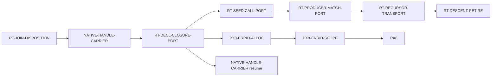

# Recursive-descent retirement — the B2F migration, finished

**Operator directive, 2026-07-29:** *"Prioritize replacement of RecursiveDescent.
Create WPs to migrate the remaining residual classes and schedule them. Again,
this is a crucial efficiency issue we should close and we should not let it
linger in a half-migrated state. That just carries tech debt for no benefit."*

⭐ **This campaign closes a migration the code itself calls temporary.**
`select_body_emission_authority` is documented as *"The one **temporary** B2F
migration selector"* (`lowering/core.rs:174`). It has been temporary long enough
to grow a per-function code-size wall on the lane it was supposed to be
retiring.

> ### ⭐⭐ INDEPENDENTLY CORROBORATED — the Architect reached the same conclusion from a different direction
>
> The §5a **12th-entry predicate check** (`evt_6vw2j1c5sqzka`, 2026-07-29)
> partitioned twelve hard stops and found **no single shared predicate** — but it
> named, as one of five subfamilies covering **entries 4–6 and the port aspect of
> entry 11**:
>
> > *"executable-boundary closure is incomplete. A static identity or semantic
> > seat exists, but the `FunctionizedUnits` selector, carrier, consumer, join, or
> > callable-declaration port cannot transport it through complete emission."*
>
> ⇒ **That is this campaign's subject, arrived at by partitioning the failure
> history rather than from the directive.** The campaign's grounding is therefore
> two independent sources — the operator's directive and the Architect's
> partition — not one. ⛔ It does **not** authorize a representation recut; the
> predicate answer was `independent/mixed` and every proved subfamily keeps its
> own routed repair.

---

## 1. What the selector actually does

```rust
if recursive_descent_residual(expr)
    .or_else(|| declarations.values().find_map(declaration_recursive_descent_residual))
    .is_some()
{ BodyEmissionAuthority::RecursiveDescent } else { BodyEmissionAuthority::FunctionizedUnits }
```

**Whole-program and all-or-nothing.** *Any* retained residual anywhere in an
object routes the **entire object** to the monolithic `RecursiveDescent` root,
where declaration bodies are recursively lowered *into* one generated function
rather than reached as separately owned callable units.

⇒ That root is what exceeds Cranelift's per-function ceiling
(`Compilation error: Code for function is too large`), and it is the efficiency
cost this campaign exists to remove.

## 2. The five residual classes and who owns each

| class (`core.rs:41-57`) | what it is | node |
|---|---|---|
| `TransparentDeclarationClosure` | a transparent declaration whose body is a closure seed | [`RT-DECL-CLOSURE-PORT`](issues/RT-DECL-CLOSURE-PORT.md) |
| `SeedClosureCall` | a `Call` whose **callee** is the retained non-lexical closure form | [`RT-SEED-CALL-PORT`](issues/RT-SEED-CALL-PORT.md) |
| `ProducerMatchCall` | an ordinary producer `Match` whose scrutinee is directly a `Call` | [`RT-PRODUCER-MATCH-PORT`](issues/RT-PRODUCER-MATCH-PORT.md) |
| `MatchScrutineeRecursor` | an ordinary `Match` consuming an **active computational recursor** | [`RT-RECURSOR-TRANSPORT`](issues/RT-RECURSOR-TRANSPORT.md) |
| `LexicalCallArgumentRecursor` | a lexical unit call whose **argument** is an active computational recursor | ← *same node* |
| — | delete the selector, the enum, the authority, and the lane | [`RT-DESCENT-RETIRE`](issues/RT-DESCENT-RETIRE.md) |

### ⭐ Why two classes share one node, and one does not

**`MatchScrutineeRecursor` and `LexicalCallArgumentRecursor` are one mechanism in
two syntactic positions.** The code says so itself, in
`LexicalCallArgumentRecursor`'s own doc comment:

> *"The recursive result still carries invocation-local scope/return-hole state.
> Passing it through a separately declared lexical unit is not one of the
> completed functionized ports."*

Both classes fire on an **active computational recursor** — a
`ComputationalMatch` with a case carrying non-empty `recursive_positions` — whose
result carries invocation-local scope/return-hole state across a boundary. One
occupies a match scrutinee, the other a lexical call argument. ⇒ **Retiring one
without the other would build the transport twice.** They are folded, per
`docs/PRINCIPLES.md` *subsume-don't-proliferate*.

⚠ **`SeedClosureCall` is deliberately NOT folded into
[`RT-DECL-CLOSURE-PORT`](issues/RT-DECL-CLOSURE-PORT.md), even though it is
close.** Both concern closure seeds becoming callable units, and
`RT-DECL-CLOSURE-PORT`'s `D2`/`D3`/`D4` build exactly that machinery — so
`SeedClosureCall` may turn out to be **largely or wholly subsumed**. ⭐ That is a
*prediction, not a measurement*, and folding on an unmeasured prediction is the
error that held a ring for a day on 2026-07-28. `RT-SEED-CALL-PORT` therefore
exists as its own node whose **`D1` may legitimately return "already retired"**,
at which point it closes for free. ⛔ A node that closes cheaply on evidence is
correct; a fold that was wrong is expensive.

## 3. ⛔⛔ THE THREE TRAPS THAT BIND EVERY NODE IN THIS CAMPAIGN

The first two follow from one fact: **the selector short-circuits at the first
residual it finds**, consulting the expression walk before the declaration walk.

### Trap 1 — you cannot measure your own class while an earlier class fires

`recursive_descent_residual` returns `Option<_>` and every combinator is
`.or_else(...)`. So a program that fires *your* class and also an earlier one
reports only the earlier one. ⇒ ⛔ **You cannot enumerate your class's real
population by reading what the selector reports.**

⭐ **Consequence, and it is a hard requirement:** every node's `D1` must
enumerate **every** residual firing on the measured programs, not the
short-circuited first. This is the same `D1` obligation
`RT-DECL-CLOSURE-PORT` already carries; the enumeration should be built **once**
by whichever node runs first and reused, not rebuilt per node.

### Trap 2 — ⭐ the later nodes are riskier than they look

As classes retire, program shapes that **never reached `FunctionizedUnits`
before** begin to. Those shapes have never been emitted on that lane, never been
scale-measured on it, and never exercised its invariants.

⚠ **This is not hypothetical — it already happened once.** Hard stop #21
(`NATIVE-HANDLE-CARRIER`, 2026-07-29) was the *first program shape* to violate a
fail-closed join-accounting invariant that `RT-FNSPLIT-RECUR-PORT` had landed
green, producing [`RT-JOIN-DISPOSITION`](issues/RT-JOIN-DISPOSITION.md). ⇒
**Expect one such stop per class retired, and do not price the later nodes as if
the earlier ones de-risked them.** They enlarge the exposed population instead.

⛔ **Do not treat a hard stop in this campaign as a defect in the node that
found it.** It is the fail-closed machinery doing its job on a newly reachable
population. Route it; do not work around it.

#### ⭐⭐ AND THE OBVIOUS `AC-1` CANNOT SEE IT

⛔ **Every node's `AC-1` quantifies over the programs that FIRE its class. This
trap's population is the COMPLEMENT of that set.** The rows that break never
fired your class at all — they were already green, and your port newly routes
them onto `FunctionizedUnits`. ⇒ An `AC-1` of the form *"every program `D1`
named as firing this class compiles and passes"* is **structurally blind to the
hazard described above**, and reads green while the port regresses `main`.

**Measured 2026-07-29 on [`RT-DECL-CLOSURE-PORT`](wp/RT-DECL-CLOSURE-PORT.md).**
It discharged its selector gate on both governed deltas
(`authority=FunctionizedUnits`, `residuals=none`) — the size wall was genuinely
gone. A **delta-free** baseline then returned **1/7**: five rows green on `main`
hit a carried-scrutinee producer-`Match` refusal, and a sixth hit a distinct
closure-capture refusal. ⭐ **The port was not additive — it regressed `main`.**
Every prior measurement had carried a delta, so the regression set was invisible
to all of them.

⇒ **Two obligations on every remaining port node in this campaign:**

- ⭐ **`D0` — run the target suite on the base with NO delta applied**, before
  building, and record which rows are green. That set is the regression
  baseline. ⛔ A measurement carrying your own delta structurally cannot produce
  it.
- ⭐ **Factor `AC-1` in two**, because one criterion cannot carry both claims:
  - **`AC-1a` — the ceiling moved.** The selector reports
    `authority=FunctionizedUnits` / `residuals=none` on the governed programs.
  - **`AC-1b` — the objects still build.** Every row green in `D0` is still
    green. ⛔ This is the criterion that catches the regression, and ⛔ it is
    **not** discharged by `AC-1a`.

⚠ **CI does catch this** — `rt_parity_native` has run as its own job since
2026-07-22. But it catches it *after* a QA cycle and a full CI run, on a
candidate already cut. `D0` costs one suite run before any code is written.

### Trap 3 — ⭐⭐ a proof over a recorded population is vacuous for anything never recorded

**Measured 2026-07-29, and it rejected a candidate that was otherwise sound.**
`RT-JOIN-DISPOSITION`'s `27f9dca2` built a completed-CFG *materialized-but-dead*
proof — entry reachability, live predecessor input, reachable block-param use —
quantified over `materialized_join_blocks`. One production site
(`lower_dynamic_host_result_match`) created a **real** planned CLIF merge and
appended its parameters **directly**, bypassing `append_planned_join_params`.

⇒ That block was never recorded, so for the whole HostResult class the proof ran
over an **empty list and passed**. A real merge would have been classified
"metadata-only materialization," and all three CFG obligations were **vacuous**.
Architect ruling `evt_24esnraje522r`.

⭐ **The shape generalizes past that node, and this campaign is full of
population-quantified proofs** — residual enumerations, reached-case unions,
materialized-block sets, and [`RT-DESCENT-RETIRE`](issues/RT-DESCENT-RETIRE.md)'s
"no residual fires anywhere."

⛔ **So whenever a node adds a proof over a population, the paired obligation is
a control that REDS WHEN A MEMBER IS OMITTED FROM THE POPULATION** — not merely
one that passes when the proof holds. ⚠ The sound-proof-over-incomplete-population
failure is silent by construction: **every control over it passes**, which is
exactly why it survives review.

## 4. Schedule

Runtime is single-threaded, and **every node here edits `lowering/core.rs`**, so
this is a strict sequence, not a fan-out.

> ### ⛔⛔ CORRECTED 2026-07-29 — `PX8` IS **NOT** RELEASED AT #3
>
> **#3 absorbs a consumer-matrix deliverable instead.**
>
> This section previously claimed *"`PX8` is released at #3… Foundation resumes
> in parallel from #4 onward and this campaign does not hold it."* **That was
> measured false on 2026-07-29** and the corrected schedule is below.
>
> `RT-DECL-CLOSURE-PORT` did exactly what it promised — **both** governed deltas
> now report `authority=FunctionizedUnits`, `residuals=none`
> (`evt_69ebt7hwg8508`). But the rows `PX8-ERRID-ALLOC` and
> `NATIVE-HANDLE-CARRIER` must *compile* then hit a **newly reachable**
> `FunctionizedUnits` refusal — `ComputationalMatch: tree-producing match
> scrutinee is not Bool or a constructor` — which the Architect filed under
> **`RT-PRODUCER-MATCH-PORT`** (`evt_5catd48dv8db6`, hard stop #22).
> ⇒ **The ABI release gate moved from #3 to `RT-PRODUCER-MATCH-PORT`.**
>
> ⭐⭐ **THE MATRIX RULING (`evt_6h6vzqw7ydra8`) SUPERSEDED PER-CELL OWNERSHIP.**
> The repair is **one closed `Carried`-consumer matrix**, added to **#3** as
> `D7`, and it **lands atomically with `483ef7ab`**. ⛔ **The two observed
> refusals are NOT separate nodes**, and #4/#5 are **not** reordered — they keep
> their syntactic residual retirements and gain nothing here.
>
> ⚠ **Why no node could be split off:** #3 alone regresses existing green rows; a
> consumer node cannot merge first with a reaching production witness; and #3
> cannot merge first. ⇒ ⭐ **A nominal node with no independent safe merge
> boundary is a label, not a node.** ⛔ So the ABI release is **#3's own merge**,
> now carrying `D7`.
>
> ⚠ **The lesson, since this is the second time it bit in two days:** the false
> claim was not a measurement error — it was a **scope inference** ("the ABI
> campaign needs `TransparentDeclarationClosure` retired **and nothing more**")
> written as if measured. The identical shape held Foundation for a day on
> 2026-07-28. ⛔ A release edge asserted from scope reasoning is not a release
> edge until a row compiles.



| # | node | size | why here |
|---|---|---|---|
| 1 | `RT-JOIN-DISPOSITION` | M | ✅ merged; repaired the phase invariant the whole campaign kept hitting |
| 2 | `NATIVE-HANDLE-CARRIER` | M | ⛔ **held at `85dcee25`** — reached #3's ceiling; resumes on #3's merge |
| 3 | `RT-DECL-CLOSURE-PORT` | **L+** | **builds the closure-seed → callable-unit machinery** #4/#5 reuse. ✅ mechanism gate discharged on **both** deltas. ⭐ **Now also carries `D7`, the closed `Carried`-consumer matrix, and holds the ABI release** |
| 4 | `RT-SEED-CALL-PORT` | S–M | cheapest; reuses #3 directly and may close on its own `D1` |
| 5 | `RT-PRODUCER-MATCH-PORT` | M | its **syntactic** `ProducerMatchCall` retirement only — ⛔ **not** the carried-`Match` transport, which is #3's `D7` |
| 6 | `RT-RECURSOR-TRANSPORT` | L | **the hard one** — invocation-local scope/return-hole state across a unit boundary |
| 7 | `RT-DESCENT-RETIRE` | M | delete the selector, enum, authority and lane; bank the win |

> ### ⛔⛔ THE RELEASE POINT IS A **CONDITION**, NOT A NODE NUMBER
>
> ⚠ **A draft of this block twice asserted a node id as the release point** —
> first #3, then #4. **Both were the same unmeasured scope inference.** The
> release is #3's merge only because `D7` was *added to* #3; ⛔ it is not a
> property of the number.
>
> **Measured 2026-07-29 (`evt_1b1v2qjy82epm`):** targeted `rt_parity_native` on
> clean `483ef7ab` with **neither** delta is **1/7** — five existing-`main` rows
> hit the producer-`Match` population, and a sixth,
> `buffer_allocate_malformed_capacity_narrows_to_invalid_bounds`, hits a
> **distinct carried closure-capture refusal** that the prior ruling does not
> cover. ⇒ **Two different consumers, not one.**
>
> ⭐ **So the release condition is: every consumer that can receive a `Carried`
> operand eliminates it.** Which node numbers that spans is open until the
> Architect classifies the second refusal. ⛔ Do not write a release edge against
> a node id until a row compiles.

⭐⭐ **THE UNDERLYING SHAPE — one incomplete matrix, not N bugs.**
`RT-DECL-CLOSURE-PORT` introduced a **new representation**: a declaration result
crossing the callable-unit boundary as `LoweringOperand::Carried`. **It did not
enumerate the consumers that must eliminate that representation.** Both refusals
are the same cell type — *a `Carried` value reaching a consumer built only for
specialized shapes* — found in two different consumers, and found only because
seven parity rows happened to reach them.

⇒ ⛔ **Fixing the two known cells does not bound the population.** That is
precisely the failure §3 of this document already names: *a proof over an
incomplete population, where every control passes.* **The paired obligation
here is an enumeration of `Carried`-receiving consumers with a control that reds
when a member is omitted** — the same discipline the residual enumerator gave
the *producer* side, now owed on the *consumer* side.

### ⚠ The one scheduling risk worth stating plainly

**The hardest node is sixth.** If `RT-RECURSOR-TRANSPORT` proves infeasible as
scoped, we learn it after five nodes of investment — and "half-migrated" is
exactly the state the operator directed us out of.

⭐ **The mitigation is cheap and it is a deliverable, not a hope:**
`RT-RECURSOR-TRANSPORT`'s `D1` is a **feasibility probe that can be pulled
forward and run at any time**, independently of its position in the queue. If
the ring or the Architect wants the risk retired early, run that `D1` during #3
or #4 and re-cut the schedule on the result. ⛔ Do not reorder the *build* work
to chase it — the transport machinery from #3 is real preparation.

## 5. What "done" means

⛔ **Retiring all five residual classes is NOT the finish line.** With every
class retired, the selector still exists, still evaluates, and the
`RecursiveDescent` lane is still compiled in — dead. **That residue is precisely
the tech debt the directive names**, so `RT-DESCENT-RETIRE` is a required node,
not a tidy-up.

Done is: the selector, `RecursiveDescentResidual`,
`BodyEmissionAuthority::RecursiveDescent`, and the recursive-descent emission
lane are **deleted**, and every program compiles through `FunctionizedUnits`.

⭐ **And the efficiency claim is measured, not asserted.**
[`RT-SCALE-B`](wp/RT-SCALE-B-emission-scaling-verdict.md) returned verdict (a) —
linear, no exponent — but it was **bounded to the governed recursive
resource-bracket populations and excluded the mutually exclusive
`RecursiveDescent` root** (Architect, `evt_3t7t27e3rv8cx`). ⇒ **The monolithic
root has never been scale-measured.** `RT-DECL-CLOSURE-PORT.AC-6` takes the
first such measurement; `RT-DESCENT-RETIRE` takes the last. ⛔ Neither pins a
threshold — a pinned size number rots at the next merge. The obligation is that
the numbers exist and are routed.
