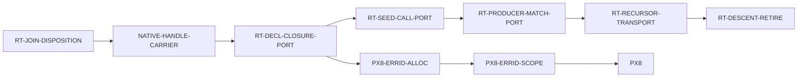

# Recursive-descent retirement — the B2F migration, finished

**Operator directive, 2026-07-29:** *"Prioritize replacement of RecursiveDescent.
Create WPs to migrate the remaining residual classes and schedule them. Again,
this is a crucial efficiency issue we should close and we should not let it
linger in a half-migrated state. That just carries tech debt for no benefit."*

⭐ **This campaign closes a migration the code itself calls temporary.**
`select_body_emission_authority` is documented as *"The one **temporary** B2F
migration selector"* (`lowering/core.rs:174`). It has been temporary long enough
to grow a per-function code-size wall on the lane it was supposed to be
retiring.

---

## 1. What the selector actually does

```rust
if recursive_descent_residual(expr)
    .or_else(|| declarations.values().find_map(declaration_recursive_descent_residual))
    .is_some()
{ BodyEmissionAuthority::RecursiveDescent } else { BodyEmissionAuthority::FunctionizedUnits }
```

**Whole-program and all-or-nothing.** *Any* retained residual anywhere in an
object routes the **entire object** to the monolithic `RecursiveDescent` root,
where declaration bodies are recursively lowered *into* one generated function
rather than reached as separately owned callable units.

⇒ That root is what exceeds Cranelift's per-function ceiling
(`Compilation error: Code for function is too large`), and it is the efficiency
cost this campaign exists to remove.

## 2. The five residual classes and who owns each

| class (`core.rs:41-57`) | what it is | node |
|---|---|---|
| `TransparentDeclarationClosure` | a transparent declaration whose body is a closure seed | [`RT-DECL-CLOSURE-PORT`](issues/RT-DECL-CLOSURE-PORT.md) |
| `SeedClosureCall` | a `Call` whose **callee** is the retained non-lexical closure form | [`RT-SEED-CALL-PORT`](issues/RT-SEED-CALL-PORT.md) |
| `ProducerMatchCall` | an ordinary producer `Match` whose scrutinee is directly a `Call` | [`RT-PRODUCER-MATCH-PORT`](issues/RT-PRODUCER-MATCH-PORT.md) |
| `MatchScrutineeRecursor` | an ordinary `Match` consuming an **active computational recursor** | [`RT-RECURSOR-TRANSPORT`](issues/RT-RECURSOR-TRANSPORT.md) |
| `LexicalCallArgumentRecursor` | a lexical unit call whose **argument** is an active computational recursor | ← *same node* |
| — | delete the selector, the enum, the authority, and the lane | [`RT-DESCENT-RETIRE`](issues/RT-DESCENT-RETIRE.md) |

### ⭐ Why two classes share one node, and one does not

**`MatchScrutineeRecursor` and `LexicalCallArgumentRecursor` are one mechanism in
two syntactic positions.** The code says so itself, in
`LexicalCallArgumentRecursor`'s own doc comment:

> *"The recursive result still carries invocation-local scope/return-hole state.
> Passing it through a separately declared lexical unit is not one of the
> completed functionized ports."*

Both classes fire on an **active computational recursor** — a
`ComputationalMatch` with a case carrying non-empty `recursive_positions` — whose
result carries invocation-local scope/return-hole state across a boundary. One
occupies a match scrutinee, the other a lexical call argument. ⇒ **Retiring one
without the other would build the transport twice.** They are folded, per
`docs/PRINCIPLES.md` *subsume-don't-proliferate*.

⚠ **`SeedClosureCall` is deliberately NOT folded into
[`RT-DECL-CLOSURE-PORT`](issues/RT-DECL-CLOSURE-PORT.md), even though it is
close.** Both concern closure seeds becoming callable units, and
`RT-DECL-CLOSURE-PORT`'s `D2`/`D3`/`D4` build exactly that machinery — so
`SeedClosureCall` may turn out to be **largely or wholly subsumed**. ⭐ That is a
*prediction, not a measurement*, and folding on an unmeasured prediction is the
error that held a ring for a day on 2026-07-28. `RT-SEED-CALL-PORT` therefore
exists as its own node whose **`D1` may legitimately return "already retired"**,
at which point it closes for free. ⛔ A node that closes cheaply on evidence is
correct; a fold that was wrong is expensive.

## 3. ⛔⛔ THE TWO TRAPS THAT BIND EVERY NODE IN THIS CAMPAIGN

Both follow from one fact: **the selector short-circuits at the first residual it
finds**, consulting the expression walk before the declaration walk.

### Trap 1 — you cannot measure your own class while an earlier class fires

`recursive_descent_residual` returns `Option<_>` and every combinator is
`.or_else(...)`. So a program that fires *your* class and also an earlier one
reports only the earlier one. ⇒ ⛔ **You cannot enumerate your class's real
population by reading what the selector reports.**

⭐ **Consequence, and it is a hard requirement:** every node's `D1` must
enumerate **every** residual firing on the measured programs, not the
short-circuited first. This is the same `D1` obligation
`RT-DECL-CLOSURE-PORT` already carries; the enumeration should be built **once**
by whichever node runs first and reused, not rebuilt per node.

### Trap 2 — ⭐ the later nodes are riskier than they look

As classes retire, program shapes that **never reached `FunctionizedUnits`
before** begin to. Those shapes have never been emitted on that lane, never been
scale-measured on it, and never exercised its invariants.

⚠ **This is not hypothetical — it already happened once.** Hard stop #21
(`NATIVE-HANDLE-CARRIER`, 2026-07-29) was the *first program shape* to violate a
fail-closed join-accounting invariant that `RT-FNSPLIT-RECUR-PORT` had landed
green, producing [`RT-JOIN-DISPOSITION`](issues/RT-JOIN-DISPOSITION.md). ⇒
**Expect one such stop per class retired, and do not price the later nodes as if
the earlier ones de-risked them.** They enlarge the exposed population instead.

⛔ **Do not treat a hard stop in this campaign as a defect in the node that
found it.** It is the fail-closed machinery doing its job on a newly reachable
population. Route it; do not work around it.

## 4. Schedule

Runtime is single-threaded, and **every node here edits `lowering/core.rs`**, so
this is a strict sequence, not a fan-out.



| # | node | size | why here |
|---|---|---|---|
| 1 | `RT-JOIN-DISPOSITION` | M | in flight; repairs the phase invariant the whole campaign will keep hitting |
| 2 | `NATIVE-HANDLE-CARRIER` | M | resume from preserved WIP `8bc7556a` |
| 3 | `RT-DECL-CLOSURE-PORT` | L | **builds the closure-seed → callable-unit machinery** the next two reuse; also releases `PX8` |
| 4 | `RT-SEED-CALL-PORT` | S–M | cheapest; reuses #3 directly and may close on its own `D1` |
| 5 | `RT-PRODUCER-MATCH-PORT` | M | producer call in scrutinee position |
| 6 | `RT-RECURSOR-TRANSPORT` | L | **the hard one** — invocation-local scope/return-hole state across a unit boundary |
| 7 | `RT-DESCENT-RETIRE` | M | delete the selector, enum, authority and lane; bank the win |

⭐ **`PX8` is released at #3, not at the end.** The ABI campaign needs
`TransparentDeclarationClosure` retired and nothing more, so Foundation resumes
in parallel from #4 onward and this campaign does not hold it.

### ⚠ The one scheduling risk worth stating plainly

**The hardest node is sixth.** If `RT-RECURSOR-TRANSPORT` proves infeasible as
scoped, we learn it after five nodes of investment — and "half-migrated" is
exactly the state the operator directed us out of.

⭐ **The mitigation is cheap and it is a deliverable, not a hope:**
`RT-RECURSOR-TRANSPORT`'s `D1` is a **feasibility probe that can be pulled
forward and run at any time**, independently of its position in the queue. If
the ring or the Architect wants the risk retired early, run that `D1` during #3
or #4 and re-cut the schedule on the result. ⛔ Do not reorder the *build* work
to chase it — the transport machinery from #3 is real preparation.

## 5. What "done" means

⛔ **Retiring all five residual classes is NOT the finish line.** With every
class retired, the selector still exists, still evaluates, and the
`RecursiveDescent` lane is still compiled in — dead. **That residue is precisely
the tech debt the directive names**, so `RT-DESCENT-RETIRE` is a required node,
not a tidy-up.

Done is: the selector, `RecursiveDescentResidual`,
`BodyEmissionAuthority::RecursiveDescent`, and the recursive-descent emission
lane are **deleted**, and every program compiles through `FunctionizedUnits`.

⭐ **And the efficiency claim is measured, not asserted.**
[`RT-SCALE-B`](wp/RT-SCALE-B-emission-scaling-verdict.md) returned verdict (a) —
linear, no exponent — but it was **bounded to the governed recursive
resource-bracket populations and excluded the mutually exclusive
`RecursiveDescent` root** (Architect, `evt_3t7t27e3rv8cx`). ⇒ **The monolithic
root has never been scale-measured.** `RT-DECL-CLOSURE-PORT.AC-6` takes the
first such measurement; `RT-DESCENT-RETIRE` takes the last. ⛔ Neither pins a
threshold — a pinned size number rots at the next merge. The obligation is that
the numbers exist and are routed.
