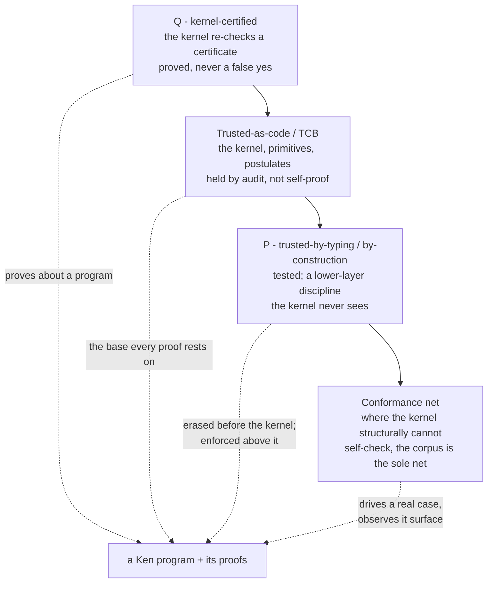

# Ken's soundness story (G5)

> Status: **Program capstone (synthesis).** This document is the G5 gate's
> soundness argument, in prose, for a human reviewer. It is **synthesis over
> landed material** — it introduces no mechanism and makes no claim not already
> carried by the spec (`spec/60-security/64-trust-model.md`, `spec/10-kernel/`,
> `spec/20-verification/`) and the landed `ken-kernel` crate. Where it
> characterizes what conformance nets, the characterization is subject to the
> spec-enclave Fidelity gate. Companion: the first-pass internal kernel audit,
> `docs/security/internal-kernel-audit.md`, which checks the landed kernel's
> real trusted surface against the §64 contracts this story rests on.
>
> Strategy target G5 (`docs/program/01-strategy.md`): *"A documented
> kernel-soundness story holds: universe checking from day one (no `Type:Type`),
> decidable certified conversion, meaning-preserving evaluation. The kernel is
> small enough to audit."* The Sec4 kernel-audit **posture** is landed (`64
> §1`–`§3`); this document is the **other half** — the honest articulation of
> what that posture buys and, just as importantly, what it does not.

## 0. The one thing to take away

Ken's soundness rests on **exactly three trusted things** — a small permanent
Rust kernel, its primitive reductions, and its postulates — and on **one
structural property**: the kernel's verdict depends on the term and its type,
**never on who wrote them**. Everything else in the system — the elaborator, the
prover, the SMT solvers, the surface compiler, the runtime, the information-flow
labels, the typeclass machinery, the policy engine, the package tooling —
produces artifacts the kernel **re-checks from scratch**. A bug or active malice
anywhere in that outer ring can cause a **failure to prove** or a **rejected
certificate**; it can **never** manufacture a false `proved`.

That last sentence is the whole security argument. The rest of this document is
about being **honest about its edges**: precisely which guarantees the kernel
*proves* (call them `Q`, kernel-certified), which are *trusted-as-code* or
*trusted-by-typing* and merely *tested* (`P`), and where the kernel
**structurally cannot check itself** so that a conformance corpus — not the
kernel — is the sole net. A verified language that blurs these lines is itself a
security risk; naming them is the point.

## 1. What the kernel PROVES — the `Q` tier

The kernel is a checker, not a prover: it does not search for proofs, it
**re-checks** certificates other components produce, and admits a term into the
trusted context only on its own terms. Four properties make that admission
meaningful. Each is a real, landed behavior of `crates/ken-kernel`.

### 1.1 Universe checking from day one — no `Type:Type`

The kernel is predicative-by-construction: there is no rule making a universe
inhabit itself, so the Girard/Hurkens paradox (a closed proof of `Empty` from
`Type : Type`) has no foothold. The formation sorts are computed, not assumed:
`sort_pi` and `sort_sigma` (`crates/ken-kernel/src/check.rs`) take the level to
`max(s1, s2)` and never collapse a level into itself. The regression
`universe_no_type_type` pins that `Type 0 : Type 1` while `Type 0` is **not** a
`Type 0`. This is the day-one property G5 names.

### 1.2 Decidable, certified conversion — with proof-irrelevance done right

Definitional equality (`convert`, `crates/ken-kernel/src/conv.rs`) is a total,
terminating decision procedure: de Bruijn syntactic identity, then type-directed
η for Pi/Sigma, then structural congruence under weak-head normalization. It is
**certified** in the sense that the checker's "yes" is what admits a term —
there is no separate unchecked oracle for equality.

The subtle part is **proof-irrelevance**. Propositions live in the universe
`Omega`; any two proofs of the same proposition are definitionally equal (`16
§8.2`). `convert` implements this as a constant-time shortcut: if the type
infers to `Omega`, return `true` without inspecting the two terms. This is what
makes `Eq : Omega` and the whole logic proof-irrelevant. It is also a **place
where soundness is delicate**, and the kernel gets two adjacent traps right:

- **The Sigma-sort trap (both components keyed).** `sort_sigma` returns `Omega`
  **only when both components are propositions** — the conjunction case — and
  `Type` otherwise. A subset `{x : A | phi}` with a *relevant* (`Type`-sorted)
  carrier is **not** a proposition; classifying it `Omega` would let Ω-PI erase
  the carrier and, via a transport motive, close to a proof of `Empty`. The
  landed `sort_sigma` keys on **both** components, so the relevant-carrier
  subset stays in `Type`. (This is a confirmed-reachable trap; the fix is the
  both-keyed match, `check.rs`.)
- **The irrelevance guard is a *type* test, not a *value* test.** The Ω-PI
  shortcut fires on the **type** inferring to `Omega`; it consults **no**
  instance identity, canonicity fact, or provenance of the two proofs. That is
  what makes it sound *and* coherence-free (see §3.3): the kernel never needs to
  know "which instance" produced a proof, because at `Omega` all proofs are
  already equal.

### 1.3 Meaning-preserving evaluation

Reduction (whnf / normalization) preserves typing: a well-typed term stays
well-typed and inhabits the same type under reduction (subject reduction), and
the primitive reductions on literals (`14 §5`) compute the values the types
promise. Evaluation cannot turn a proof of `A` into a proof of something else.
This is the "meaning-preserving evaluation" clause of G5.

### 1.4 The de Bruijn criterion — soundness read as a *security* property

The standard reading of "the kernel re-checks every certificate" is soundness.
The **security** reading (`64 §2`) is **authorship-independence**:

> A property holds in *your* kernel or it does not — independent of who or what
> produced the code and its proof.

The mechanism is a one-line contract about the check judgment's **signature**:

> **AI-Indep (`64 §2.1`).** The kernel check is `check(env, ctx, t, ty)`
> (`crates/ken-kernel/src/check.rs`) — environment, context, term, type, and
> **nothing else**. There is no provenance, author, or trust-level parameter, so
> no "this came from a trusted source" framing can change the verdict.

Because there is no provenance channel, "never a false `proved`" holds
**uniformly** across every generator — a careful human, a flaky prover, an
adversarial SMT solver, or an unreliable AI model. You may let an untrusted
model *generate* code and proofs at scale and admit the result **only on the
kernel's terms**. The model is the generator; the kernel is the adversary that
filters it. This is the property the AI era actually requires, and it is
**structural**: it holds because the channel to exploit does not exist, not
because a test passed.

**Trust level of §1.** Universe checking, conversion, and subject reduction are
kernel behaviors the kernel *runs* on every input; AI-Indep is a structural
property of the check path's signature. Together they are the `Q` tier: what the
kernel proves *about a program*. They are **trusted-as-code** as properties of
*the kernel itself* (the kernel is the trust root; it does not self-certify —
§4), but for any *program* they check, the guarantee is kernel-certified.

## 2. What is TRUSTED — the TCB, precisely and enumerably

Soundness — and therefore every security guarantee resting on a proof — depends
on **exactly three things** (`64 §1`, `18 §5`):

1. **The kernel** — the small permanent Rust core (type theory + conversion +
   proof checker), including the admission gates (positivity, W-style, SCT,
   quotient respect). The gates are trusted-as-code but **re-run on every
   input** — nothing is admitted without passing — so they add **no per-program
   assumption**. They are part of item 1, never a per-program trusted axiom.
2. **The primitive reductions** — audited operations on literals, each
   registered via `declare_primitive` as a `Decl::Primitive`.
3. **The postulates** — every assumed axiom and `foreign`/FFI signature, each
   admitted via `declare_postulate` as a `Decl::Opaque`.

**Nothing else is trusted.** Not the elaborator, the prover, Z3/cvc5, the
surface compiler, the runtime, the IFC label discipline, or the package tooling.
Definitions and inductives are **re-checked, not trusted**, so they are excluded
from the base.

### 2.1 The base is enumerable, and the enumeration is complete

Two contracts make the TCB *legible to a consumer*, not just small:

- **TB-Sound (`64 §1.1`, landed producer).** `GlobalEnv::trusted_base()`
  (`crates/ken-kernel/src/env.rs`) returns **exactly** the `Decl::Opaque` and
  `Decl::Primitive` declarations in the environment, excluding the prelude
  `Top`/`Bottom` constants. For any admitted program it is **empty iff the
  artifact rests on no unchecked assumption** — fully verified and confined. It
  is a filter over the real environment, so it cannot report a phantom
  assumption the program does not carry.
- **TB-Complete (`64 §1.2`, by construction).** The **only** ways to introduce
  an unchecked assumption are `declare_postulate` and `declare_primitive`; a
  `foreign`/FFI signature *desugars to* `declare_postulate` and carries no
  separate privilege. Each records an `Opaque`/`Primitive` — **exactly** the set
  `trusted_base()` enumerates. The choke-point through which assumptions enter
  *coincides with* the filter that lists them, so **no assumption can hide**.

The force of TB-Complete is that a conformance corpus can drive a **real**
`foreign`/hole admission and observe it surface in the delta — the omission net
— rather than trusting a hand-inserted claim. This is the first place the
pattern of §4 appears: the kernel cannot prove *about itself* that its admission
surface has no back door; that a property is checked by **construction +
conformance**, not by kernel self-certification.

## 3. ★ The trust-level through-line

This is the spine of the whole program, and the part a security reviewer must
read most carefully. Ken's guarantees fall into **three tiers**, and the
discipline that kept the security spine (Sec1ct → B1 → Sec4 → Sec5) honest was
**never letting a lower tier be described as a higher one**.

### 3.1 Tier `Q` — kernel-certified

A guarantee is `Q` iff the kernel re-checks a **certificate** for it and the
goal is **not** itself a trusted assumption. Operationally (B1 `71 §2.1`): a
claim projects to the guarantees channel `Q` iff its certificate `check`s
**and** its goal is `∉ trusted_base()`. These are the functional-correctness
proofs — the `ensures`/refinement obligations discharged and kernel-re-checked.
This is the strongest thing Ken says, and it is the **only** thing that earns
the word "proved."

### 3.2 Tier `P` — trusted-by-typing / by-construction (`tested`, never `Q`)

A large and load-bearing class of Ken's *security* guarantees are **not**
kernel-proved. They are enforced by **typing rules the elaborator applies before
the kernel ever runs**, on data that is **erased before the kernel**. The honest
two-part statement for every one of them is:

> **trusted-by-typing → `P`/`tested`, never `Q`/kernel-backed.**

Naming only the tier ("trusted, not kernel-proved") drops the projection a
consumer reads off the status field; naming only the projection ("`P`/`tested`")
drops the *why*. State both.

- **Information flow, `@ct`, and policy (Sec1 / Sec1ct / Sec5).** IFC labels
  (confidentiality, integrity, the `@ct` constant-time axis) and policy
  decisions are an elaborator-level discipline: `flows_to` / `check_declassify`
  (`crates/ken-elaborator/src/ifc.rs`) decide admission, and the **labels are
  erased before the kernel** (`61 §3`) — no kernel primitive is introduced for
  them (confirmed: the kernel `Term` enum carries no label, modality, or policy
  former). So a `@ct`-in-parameter promise, a flow admission, or a policy
  verdict is **proved-by-trusted-typing** — the flow rule is trusted, the
  property real but not kernel-certified. It projects to `P`/`tested`. **Filing
  any of these under `Q` over-claims kernel certification** to a downstream that
  reads `Q` as kernel-proved; that is the exact no-over-claim failure the
  export's honesty discriminator exists to prevent (the live erratum this
  caught: Sec1ct's "emits onto Q" reconciled to `P`; B1 is the authority).
  Under-claiming as `P` is the safe direction.
- **The constant-time guarantee is layered, and Ken owns only the top layer (`64
  §4.2`, `61 §5a`).** Ken **statically** guarantees the *source-level
  precondition* — a `@ct`-labeled value never steers a leakage-relevant
  operation — by typing. The **timing guarantee itself** is hardware/codegen
  relative and lives **below Ken**, delegated to `Ward` + the toolchain under an
  explicit leakage model on a platform. Ken's static part is a *necessary
  precondition*, honestly not the whole guarantee.

### 3.3 Coherence conventions — soundness-*adjacent*, not kernel-enforced

Typeclass coherence (canonicity / no-orphans / no-overlap, ADR 0008) is a third,
subtler category. In Ken's **dependently-typed** setting it is **not a
kernel-soundness requirement**: dictionaries are reified as **typed,
law-carrying values** (Sigma-records), so an incoherent instance pick surfaces
as a **type mismatch the kernel catches**, or resolves a *different but still
lawful* instance — **never a false proof**. (The contrast with Haskell's
*erased* dictionaries is load-bearing: there, incoherence can silently change
runtime meaning; here it cannot silently produce a wrong proof.)

Yet coherence **is** soundness-*adjacent* for **client reasoning** (ADR 0008,
not merely an ergonomic preference): a client lemma "about *the* `Monoid A`"
relies on canonicity. The kernel backstops type-correctness and the law proofs;
it does **not** enforce the *convention* (canonicity / orphan / overlap) — that
is elaborator-level, and **conformance is the sole net** for it. Describing
coherence as "just ergonomics / predictability" **under-weights** the
client-reasoning layer; describing it as kernel-enforced **over-weights** it.
The honest statement is the ADR's: soundness-adjacent, elaborator-enforced,
conformance-netted.

### 3.4 The completeness / omission nets — where the kernel cannot self-check

Some of Ken's most important security properties are **negative** — "no
assumption can hide," "no modality escapes erasure," "the second checker stays
independent." The kernel **structurally cannot prove these about itself**: they
are properties of *the kernel's own admission surface and build*, and a checker
that certified its own completeness would be assuming what it set out to prove.
For each, the net is **construction + conformance**, never kernel self-proof:

- **TB-Complete (no hidden assumption).** Netted by the closed choke-point
  (§2.1) **plus** a conformance case that drives a real `foreign`/hole and
  observes it surface. Both filter arms — `Opaque` **and** `Primitive` — must be
  exercised; a corpus that drives only postulates is green-vs-green against a
  bug that drops registered primitives from the audited delta (the arm-coverage
  lesson folded into Sec4 B4).
- **AI-Indep (no provenance channel).** Netted by the signature having no
  provenance parameter (§1.4) — a structural fact a reviewer audits, not a
  theorem the kernel emits.
- **Invariant TT (kernel dependency independence, `64 §3.1`).** The `ken-kernel`
  crate's dependency closure must contain **no Ken-generated artifact**, so the
  permanent Rust kernel stays a genuinely *independent* second checker after
  self-host (Thompson's trusting-trust defense = diverse double-compilation
  built into the architecture). Netted by a mechanical check on the crate's
  dependency graph — confirmed empty today (§ audit) — not by kernel self-proof.
- **Faithful reification.** When the elaborator reifies something for the kernel
  to bound (e.g. instance resolution reified as an SCT group, Lc), the kernel
  bounds **only the group it is handed**. That the reified structure *faithfully
  encodes the real sub-goals* (edges = the real calls, the descent metric = the
  real order) is a **trusted step** — a real kernel check run on an unfaithful,
  zero-edge group is theater. Netted by conformance verifying the reified
  *content*, not merely that the kernel API was called.

The unifying tell: whenever a guarantee is about the kernel's own structure
rather than about a program, the kernel is not the net — the closed construction
plus the conformance corpus is, and the corpus must drive a **real** case that
would *fail loudly* if the property broke.

### 3.5 The through-line as a table

| Guarantee | Tier | What nets it |
|---|---|---|
| Functional correctness (`ensures`, refinements) | `Q` kernel-certified | kernel re-checks the certificate, goal ∉ `trusted_base()` |
| No `Type:Type` / universe consistency | `Q` (kernel behavior) | `sort_pi`/`sort_sigma`, run on every input |
| Proof-irrelevance at `Omega`, Sigma-sort discipline | `Q` (kernel behavior) | both-keyed `sort_sigma`, type-directed Ω-PI |
| Subject reduction / meaning-preserving eval | `Q` (kernel behavior) | kernel reduction + typing, every input |
| Never a false `proved`, any author | structural | `check` has no provenance channel (AI-Indep) |
| The TCB (kernel + primitives + postulates) | trusted-as-code | audit (§64 §3) + this document's companion audit |
| IFC / `@ct` / policy admission | `P` trusted-by-typing | elaborator flow rules; labels erased before kernel; conformance |
| Constant-time *timing* | delegated | `Ward` + toolchain under a leakage model (below Ken) |
| Typeclass coherence (canonicity) | `P` soundness-adjacent | elaborator convention; conformance is the sole net |
| TB-Complete / AI-Indep / TT / faithful reification | by construction | closed construction + conformance; kernel cannot self-check |

Read down the "Tier" column: the word "proved" appears only where the kernel
re-checks a certificate about a *program*. Everything protecting the *system* —
flows, timing, coherence, the admission surface, the second checker — is
trusted, tested, delegated, or conformance-netted, and is labeled as such. That
labeling *is* the soundness story's honesty.

## 4. The kernel is the trust root — so it is *audited*, not self-certified

Because the kernel is the trust root, none of §1–§3 is a claim the kernel
*proves about itself*. Its own properties are **trusted-as-code, held by audit**
(`64 §3`). Two obligations follow, both already chosen architecturally:

- **Keep it small and audit it.** The kernel is deliberately minimal (ADR 0001)
  so one team can review it. The **machine-checkable substrate** of that posture
  is landed — the enumerable TCB (§2), authorship-independence (§1.4), the named
  Invariant TT (§3.4). The companion first-pass **internal** audit
  (`docs/security/internal-kernel-audit.md`) checks the landed kernel against
  these contracts. The **external, published, independent** audit report — and
  the external-vs-internal governance choice — is the G5 **governance** capstone
  that stays the operator's call (`64 §6`); it is **not** claimed here.
- **Defend against trusting-trust.** The small Rust kernel stays **permanent**
  even after the elaborator/compiler self-host (ADR 0001). The self-hosted
  toolchain therefore *always* has an independent second checker — the original
  Rust kernel re-checks what the self-hosted stack produces. A backdoor would
  have to compromise **two independent checkers identically**. Invariant TT
  (§3.4) is what keeps that independence real, and it is stated **now** so the
  self-host epoch cannot silently break it.

## 5. The no-new-kernel / small-TCB record

The strongest *evidence* for the small-TCB claim is the **program's own build
history**: every capability shipped this program composed over the **existing**
trust root and added **zero** new kernel features. The concrete, checkable fact:
as of `0a06625`, the last commit to touch `crates/ken-kernel/src/` was the
K-series Sigma-sort soundness fix (`badc78d`), and **85 commits landed after it
— none touching the kernel source**. That tail is the *entire* security spine
(Sec1 IFC, Sec2 capabilities, Sec4 trust-model, Sec5 policy), the behavioral
work (B2 temporal, B3 trace, B4 agentic boundary), the verification tooling, and
the language surface (L2–L7, Lc typeclasses). The kernel `Term` enum landed its
formers in K1–K2c and has **not grown** a label, modality, policy, temporal,
class, or dictionary former since (verified structurally — see the companion
audit). Concretely, by workstream:

- **Typeclasses / instances (K, Lc).** Reified as **Sigma-records**
  (dictionaries as typed law-carrying values), coherence as an **elaborator
  convention**, termination of instance resolution via the **existing SCT**
  admission gate — no new kernel rule. (The soundness-critical part was
  *faithful reification* into the SCT group, §3.4, an elaborator obligation the
  kernel bounds.)
- **Security / IFC / `@ct` / authority / policy (Sec1, Sec1ct, Sec2, Sec4,
  Sec5).** Labels are **erased before the kernel**; `flows_to` /
  declassification / attenuation / policy verdicts are **elaborator-level**
  trusted-by-typing checks (§3.2). The security spine added **no kernel
  primitive** — Sec4 is a *reading* of the existing kernel (the enumerable TCB),
  not an extension of it.
- **Behavioral / temporal assurance (B, V).** Temporal formulas and behavioral
  export entries are **inert data** carried alongside the `Q` channel, not new
  kernel judgments; the export gate builds a `Q` entry **only** in the `Proved`
  arm (B2), keeping the one-way `Q`/`P` boundary.
- **Verification tooling (V).** The prover, SMT integration, and VC extraction
  all **produce certificates the kernel re-checks** — the oracle-not-authority
  discipline (G3). Nothing the prover concludes is trusted until re-checked.

Every one of these is an outer-ring component producing artifacts the kernel
re-checks or a discipline enforced above the kernel and netted by conformance.
The TCB at the end of the program is the **same three things** it was at K1.
That invariance, sustained across the whole feature set, is the small-TCB claim
made good.

## 6. The honest limits (what a language cannot fix)

A soundness story that omitted its boundaries would itself over-claim. The
**normative** honest limits are `64 §4` and are reproduced here by pointer, not
softened — a conforming presentation MUST surface each:

- **§4.1 Spec ≠ intent — the dominant residual risk.** The kernel proves *code
  matches its specification*; it says **nothing** about whether the spec
  captures your **intent**. Verification *relocates* trust from "is the code
  right?" to "is the spec right?" — a human judgment no checker makes. Ken makes
  the spec a first-class reviewable artifact and can route attention to it (spec
  coverage, spec mutation testing); it cannot decide a spec is the *right* spec.
- **§4.2 Side channels and resource bounds.** Functional + flow proofs cover
  *what* is computed and *where data flows*, not *how long* or *how much*.
  Constant-time timing is delegated (§3.2); worst-case time/space bounds are a
  complexity discipline the totality checker does not provide.
- **§4.3 Kernel, FFI, runtime stay trusted.** Proof covers the pure core. The
  kernel itself, `foreign` C (a listed postulate — it surfaces in
  `trusted_base()`), and the native runtime remain trust assumptions, minimized
  and *listed* but not *proven*. A `pure` annotation on a `foreign` is a
  **claim**, not a check.
- **§4.4 The social / registry layer.** Namespace squatting, dependency
  confusion, key compromise, registry governance live **above** the language.
  Ken makes that layer *effective* (real attestations to police) but does not
  replace ecosystem policy.
- **§4.5 Regulated industries.** Formal verification is a powerful *input* to
  certification (DO-178C, ISO 26262, IEC 62443, medical-device), and Ken can
  *emit* the assurance artifacts those processes consume — but it does **not
  eliminate process**.

## 7. What a consumer checks (four points)

Consuming a Ken artifact safely (`64 §5`):

1. **Content hash** matches the lock — *identity*.
2. **Kernel re-check** of the proof bundle passes, on **your** kernel — the
   authorship-independent admission of §1.4 (AI-Indep).
3. **`trusted_base_delta` audit** against policy — *assumptions*: **empty =
   fully verified + confined**; non-empty = exactly what you inherit (incl. FFI
   and declassifications), complete by TB-Complete.
4. **Provenance signature + SLSA** verify — *origin and build*.

Point 2 is the `Q` tier; point 3 is the enumerable TCB; points 1 and 4 are the
supply-chain surround. A consumer who runs all four has checked *correctness on
their own kernel*, *the complete assumption set*, and *the artifact's identity
and origin* — which is exactly, and only, what Ken claims.

---

*This document is synthesis for the G5 gate; it introduces no mechanism. Every
mechanism it describes is landed in `crates/ken-kernel` (or the elaborator, for
the trusted-by-typing tier) and specified in `spec/`. Its companion,
`docs/security/internal-kernel-audit.md`, checks the landed kernel against the
§64 contracts the story rests on.*
