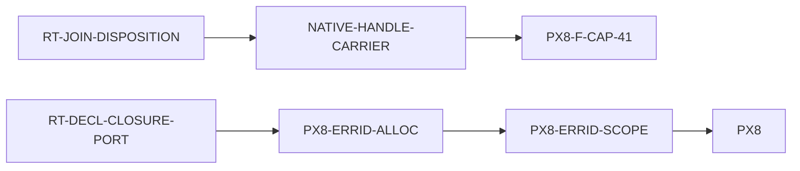

> ## ⭐ §5a RESEARCH-CONSULT TRIGGER — THE COUNT OF RECORD LIVES HERE NOW
>
> Carried forward from [[NATIVE-HANDLE-CARRIER]] when it was bound behind this
> node on 2026-07-29. ⛔ **Do not read the count from any other node.** That
> node's block now points here and claims nothing.
>
> | | |
> |---|---|
> | **COUNT OF RECORD** | **21** |
> | ENTRIES | 12 |
> | NEXT PREDICATE CHECK | ⏳ **OWED NOW at the 12th entry** — asked of @architect 2026-07-29, transport-and-framing only |
> | NEXT RESEARCH PULL | **#24** — #21 fired and is spent (`evt_165w63xtakbpb` → advisory `evt_6nrz0cgqm1hkd`) |
>
> **Hard stop #21 (2026-07-29)** is the stop that produced this node. Its
> advisory is landed durably at
> `docs/program/rt-join-disposition-research-advisory-21.md` — ⛔ do not cite the
> `/workspaces/ken/local/` path, which is untracked.

## Why this node exists

[[NATIVE-HANDLE-CARRIER]]'s fixture tripped a fail-closed invariant introduced by
`RT-FNSPLIT-RECUR-PORT` (`6a451b45`):

```text
emitted source join StaticOriginId(1000) was later dispositioned as statically unselected
```

`rt_span_prov_native` went 5 passed / 1 failed on
`sp_a_foreign_span_freeze_rejects_own_span_succeeds_on_both_engines`, at
Packaging/ObjectEmission. ⭐ **`main` is green on that row** — CI's shard filter
excludes only `rt_parity_native`, `px8f_buffer_native` and
`px8f_write_partition` — so the candidate is the **first program shape to violate
the invariant**, not an inheritor of a red row.

The Architect ruled the invariant **phase-overstrict** and the candidate **not
the inconsistent party**.

## The measurement (Architect, `evt_2w62qa82fxyv`)

Bound the preserved WIP `8bc7556af024886a6db01679f35a2bb063166876` / tree
`9bbce2f64b32c4948e389e8c3953e762bbc8a6dc`, reproduced in a **detached
diagnostic-only worktree**. ⭐ No candidate or production edit survives it.

```text
consume join=StaticOriginId(1000)
  emission_reachable_match_cases has no entry for match 1055
select match=StaticOriginId(1055) case=Some(0) prior=None
select match=StaticOriginId(1055) case=Some(0) prior={0}
close match 1055; case 1 is dead; its subtree contains join 1000
```

`1055` is the enclosing `Result` match (`0 = Err`, `1 = Ok`); `1048` the nested
`ReadProgress` match under `Ok`; `1000` the `BufferSpan` projection join in the
`ReadSome` body. ⇒ `consume_join_plan(1000)` runs **before the enclosing source
match has selected any case**, and the only two later observations both select
`Err`.

⭐ **This settles the three-way discriminator.** `consumed_join_origins` records
**structural materialization / token consumption**, not same-context semantic
reachability — and it is **not** a fact from a different recursive or
specialization visit being collapsed into a global one. The later dead-case fact
does not contradict it. **The `consumed XOR statically-unselected` assertion
conflates two phases.**

A diagnostic-only differential that reclassified the already-materialized join as
dead made the exact fixture pass (`1 passed; 0 failed; 5 filtered out`).
⛔ **That does not authorize a bare set flip as the production repair.**

## The binding mechanism (Architect)

Separate three facts:

1. **Materialization** — a planned join token is consumed/emitted at most once.
   Keep this **owner-bound** and fail closed on duplicate or wrong-owner
   consumption.
2. **Final semantic disposition** — after the generated function's reached-case
   union closes, every planned join is classified **exactly once** as reachable
   or statically unselected, in the same function/owner context.
3. **Materialized-but-dead proof** — overlap between materialized and statically
   unselected is permitted **only** when the emitted join/block is unreachable
   from the generated-function entry and retains no live predecessor input or
   reachable use. Otherwise fail closed. Validate the completed Cranelift
   CFG/SSA at the appropriate pre-seal or whole-IR boundary. ⛔ **Do not treat a
   disposition bit as CFG repair.**

⛔ **Do not** weaken owner validation. ⛔ **Do not** key a path-sensitive
selection globally across generated functions. ⛔ **Do not** delete the existing
reached-case union discipline.

## ▶ THE FRAME IS WRITTEN

`docs/program/wp/RT-JOIN-DISPOSITION.md` — read it, not this file, for scope and
acceptance. ⭐ Its `§3` and `§4` carry the two things the ruling does not say and
that decide the node: the conflation is enforced at **four** sites, not one, and
a **landed durable-invariant control** currently pins the overstrict property in
its own `CLAIMED` block.

## Sequencing

Runtime-owned and **first** in Runtime's queue.



⚠ **Runtime is single-threaded, so this node and [[RT-DECL-CLOSURE-PORT]]
compete, and the order is a real call with a real cost.** Taking this one first
delays `PX8` — which gates 15 of the ABI program's 19 nodes — by this node plus
the [[NATIVE-HANDLE-CARRIER]] resume, and keeps Foundation idle that much longer.

⭐ **Taken first anyway, on one grounded reason:** `RT-DECL-CLOSURE-PORT` moves
whole objects off the monolithic `RecursiveDescent` root and onto
`FunctionizedUnits`, which is precisely the route whose per-generated-function
join accounting is now known to be phase-overstrict. Landing that port on top of
an unrepaired phase invariant invites the same hard stop at greater scale, after
more work is sunk. This node is bounded, has a **measured** repair direction and
a proven differential, and unblocks a WIP that is already 5/6 green.

⚠ **That is a Steward sequencing call, and the last one I made by inference cost
Foundation a day.** This one rests on the Architect's measurement rather than on
a scope guess, and it is stated here so the operator can reverse it cheaply:
reversing it means releasing `RT-DECL-CLOSURE-PORT` first and leaving
`8bc7556a` to age against a large `lowering/core.rs` rewrite.
