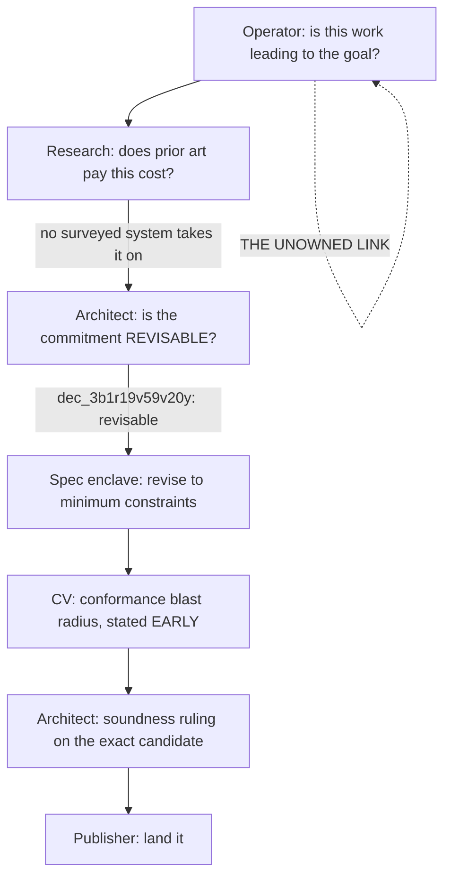

> ## ⛔ THIS NODE IS `draft` AND BLOCKED ON AN OPERATOR INPUT, NOT ON A SEAT
>
> The operator is drafting **the mission** (stated 2026-07-26, ~03:50Z, to be
> drafted at ~11:30Z). ⛔ **Do not start the audit before it exists** — and do
> not substitute a seat's reading of `docs/PRINCIPLES.md §I` for it. The
> measurement in §3 below is the reason: the citable mission today is ~25 lines
> and does not contain either half of the goal the operator states out loud.

## 1. What actually produced the result on one node

The closure-boundary win is worth reconstructing precisely, because **it was not
one agent's analysis** — and the generalization has to reproduce the *sequence*,
not hire the seat that happened to be loudest.

Five seats, each doing its own job well. **The link with no owner is the first
one**: asking, of a constraint that is already in the spec, *which mission
property fails without it?* No seat's mandate contains that question. It fired
here because the operator asked it in person.

⭐ **That is the whole content of this node.** Everything below is about giving
that question an owner, a method, and a standard of evidence.

## 2. The routing — who runs it, and why not the others

**⭐ Owner: `conformance-validator`.** Not by elimination — because the CV
already performs this exact *shape* of pass. Its playbook
(`agent/playbooks/spec/conformance-validator.md`, "What you produce and guard"):

> **Spec testability:** every normative claim in `/spec` should have at least one
> conformance case. **A claim with no test is a claim no one can rely on — flag
> it back to the author.**

That is a claim-by-claim walk of the spec, applying one predicate, reporting
failures upward to the author. This node adds a **second predicate** to the same
walk: *which mission property fails without this claim?* The CV also already owns
the half that makes a relaxation actionable instead of academic — the conformance
blast radius (`SPEC-CLOSURE-BOUNDARY` `AC-S4`). And it is consistent with the
operator's separate ruling that the CV should be the high-level owner of the
acceptance-criteria tier (tracker task #55).

**⭐ Second seat: `adversary`, as a refutation pass — not as owner.** Right
stance, wrong object. Its lane is *code does not match intent* (as-broken); this
audit is *intent does not match mission*, one level up. Two of its own standing
disciplines would reject the work outright:

- `agent/playbooks/federation/adversary.md` bars **whole-repo sweeps** under
  resource discipline (`COORDINATION §12`).
- Its grounding rule requires **a concrete repro with exact `file:line`** and
  says an ungrounded finding is *worse than silence*. ⛔ **An over-strong spec
  constraint has no repro** — the adversary would be obliged to drop every
  finding of this class.

What it *should* do is attack the CV's justifications. The failure mode here is
reading the spec to justify the spec, and a grounding claim authored by the seat
that owns spec conformance needs an independent attempt to refute it. Otherwise
this node produces **agreement without corroboration** — two seats concurring
because one inherited the other's premise.

**Not the `architect`.** It authored the constraints. Six consecutive correct
rulings on an unexamined premise is the measurement of what happens when the
author audits the premise. It stays the **terminal** seat that rules, not the
seat that asks.

**Not `research`.** It supplied the decisive external evidence — that no surveyed
system takes on the cost Ken had committed to — and that evidence is what made
the Architect willing to reopen. But research cannot say what *Ken's* mission
requires. It is an input to the audit, not the audit.

**Not `spec-author` / `spec-leader`.** They perform the revision. Same authorship
problem as the Architect, one layer down.

## 3. ⛔ THE PRECONDITION — measured, and it is the real blocker

`SPEC-CLOSURE-BOUNDARY` `AC-S2` already requires: for each retained requirement,
state **which mission property fails without it, citing `docs/PRINCIPLES.md`**.
Scaled to the whole spec, that citation target does not carry the weight:

| what | measured 2026-07-26 |
|---|---|
| `docs/PRINCIPLES.md` §I "What Ken is — the mission" | **one** principle, ~25 lines |
| the other 14 principles | a decision *calculus* and design *invariants*, not mission properties |
| occurrences of "resource handle" in `PRINCIPLES.md` | **0** (the only `handle` hit is the idiom "just handle it here") |
| occurrences of fast / efficient / performance | **2**, both incidental — a "fast unproved algorithm" as an untrusted-component example, and `Float` equality being fast |
| spec being audited against it | **27,856 lines**, 63 files, 8 areas |

⇒ **Neither half of the goal the operator states — *a fast and efficient compiler
that correctly handles resource handles* — is in the mission section of the
charter.** The question worked on one node because a human asked it directly.
Scaled out, each auditor grounds against their own reading of those ~25 lines,
and two auditors either disagree or agree by both having inherited the spec.

⛔ **So the mission properties must be written down first, and they are the
operator's to write** — no seat can supply them without becoming the author of
the standard it is measuring against. That is the one input this node blocks on.

## 4. Method — why this cannot be one sweep

| what | measured |
|---|---|
| uppercase `MUST` / `MUST NOT` / `SHALL` in `spec/` | **~88** |
| statements in prose modality (`must`, `cannot`, `may not`, `is required`) | **~660** |

⇒ **The audit cannot mechanically enumerate its own worklist.** The spec's
constraints are overwhelmingly prose, not flagged keywords, so "grep the
normative claims" does not produce the population. Any plan that assumes a
mechanical enumeration is wrong before it starts.

⇒ **One area at a time, and pilot before generalizing.** Start with
`spec/40-runtime/` — it is where the closure inconsistency lived, so it is the
one area where the cost of an over-strong constraint has already been *measured*
rather than assumed. If the pilot holds, generalize. If the mission properties
turn out not to be writable at the granularity a constraint needs, we learn that
on one area instead of eight.

## 5. Acceptance criteria

**`AC-M1` — the mission properties exist as a citable artifact** before any audit
row is written, with a stable identity an audit row can name. ⛔ A row citing
"§I generally" does not discharge this; that is the ambiguity the node exists to
remove.

**`AC-M2` — every audited constraint gets a verdict from a taxonomy that has a
cell for the honest answer.** At minimum: `grounded` (names the failing mission
property), `ungrounded` (nothing fails — candidate for relaxation),
`inherited` (⚠ in the spec because it was already in the spec — no derivation
found), and `cannot-determine`. ⛔ **A taxonomy with no cell for "I could not
tell" reads as complete when it is not**, and `inherited` must be its own cell
rather than being folded into `ungrounded` — they call for opposite repairs.

**`AC-M3` — the refutation pass is independent, and its independence is
evidenced.** The adversary must not be handed the CV's justification as its
premise. ⛔ Agreement between a claim and a check that inherited the claim is not
corroboration.

**`AC-M4` — relaxations are stated as what the spec STOPPED requiring**, per
`SPEC-CLOSURE-BOUNDARY` `AC-S3`, so the change is auditable rather than implicit.

**`AC-M5` — the conformance blast radius is stated BEFORE the wording settles**,
per `AC-S4`. ⛔ Not a post-hoc re-derivation.

**`AC-M6` — the pilot reports its own method failures.** If `40-runtime` shows
the enumeration is unreliable or the mission properties underdetermine a
verdict, that is the node's most valuable output and must not be smoothed into a
clean table. ⭐ A silent cap reads as complete coverage.

**`AC-M7` — a constraint the Architect previously ruled may be challenged**, per
`AC-S7`. Not saying so is the failure mode that cost six blocks.

## 6. Standing

- ⛔ **Do not conflate this with tracker task #55** (the work-program umbrella
  tier that owns ACs). They share an owner and nothing else: #55 is about where
  acceptance criteria live across WPs; this is about whether the spec's
  constraints are necessary. **Two operator decisions on #55 are still open and
  must not be re-asked as fresh.**
- ⛔ **`docs/PRINCIPLES.md` is a reasoning charter, not a mission spec.** It says
  so itself: *"When the spec dictates an answer, follow it. When it does not,
  reason from these."* It is priors for judgment. Using it as the audit's
  measuring stick without §3's repair inverts its stated purpose.
- ⚠ Report an unpushed ref and keep going; the Steward pushes. Wrap markdown at
  80 columns. Targeted builds only — the full gate runs in CI.
