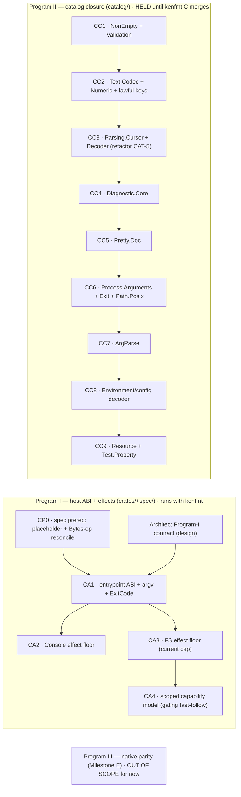

# Ken CLI application tooling — work program

Owner: Steward. Design source of truth: `local/ken-cli-tooling-gap-report.md`
(the CLI gap report, 2026-07-12 — clean-room-clean; it did **not** consult
`local/refs/`) + the Architect's Program-I contract design (in progress). This
document decomposes the effort into sequenced, shovel-ready work packages and
records their state. It is the CLI analog of `kenfmt-work-program.md` and
`adr0014-work-program.md`: **a set of work programs, not one WP.**

The goal is to make Ken a real platform for writing command-line applications
*in Ken* on POSIX/Linux — argv in, exit codes out, stdin/stdout/stderr, a real
filesystem floor, scoped capabilities, cross-file imports, and a checked
`ArgParse` — **interpreter-first**, reusing the existing `ITree`/`Coproduct`/
capability spine, **adding no kernel rules.**

## Fixed inputs — SETTLED (operator, 2026-07-13), do not reopen

- **Scope = interpreter slice A–C** (entrypoint ABI + Console/FS effect floor +
  reusable packages incl. `ArgParse`). The process toolkit (Milestone D:
  env/clocks/subprocess/signals/temp/terminal) and **native parity (Milestone E)
  are OUT OF SCOPE** until A–C land. Design the contract so native can adopt it
  later without redefining it, but do **not** build D/E now. Reject drift toward
  them.
- **FS capability = STAGED.** The FS effect floor lands on the **current
  authority-level** capability; a dedicated Architect+security design (scoped
  operation rights + directory/file scope + symlink policy + attenuation +
  `openat`-style TOCTOU-safe enforcement) is a **gating fast-follow** that must
  land before write/delete is called "least-privilege" or shipped to untrusted
  use. Coarse-cap FS **may** ship for the first milestone's read/whole-file
  surface; mutating operations behind the scoped model.
- **No kernel rules, no TCB growth.** Host operations live in **untrusted
  drivers**; argument parsing, path manipulation, help/error rendering, codecs,
  and all convenience live in ordinary **kernel-checked Ken packages**. The
  trusted surface owns only irreducible OS interaction + capability enforcement.
  (Principles: reflect-don't-extend the TCB, subsume under the existing effect
  machinery, report interpreter/native evidence honestly.)
- **Interpreter-first; native adopts the SAME contract later.** Interpreter
  success is never relabeled native support; native codegen stays unavailable
  for an effect until its runtime support + differential evidence exist.
- **POSIX bytes, not `String`.** argv, environment values, and paths are `Bytes`;
  UTF-8 decoding is an explicit library choice returning `Result DecodeError _`.
- **North-star acceptance (operator):** `cat` / `head` / `wc` / a safe file-copy
  (Milestone B floor) → a multi-file subcommand tool with options/help/
  diagnostics (Milestone C exit criterion).

## ★ The catalog-freeze ordering gate (operator, 2026-07-13)

Program II (catalog closure) lands packages in **`catalog/`**. The kenfmt
**capstone C** reformats the **entire** `catalog/` atomically in a Steward-
scheduled freeze window and turns on the strict `ken fmt --check` gate. **No
catalog changes may be in flight during C.** Therefore:

- **Program II (catalog packages) is HELD until kenfmt capstone C has merged.**
- **Program I (host-ABI + effects) touches `crates/` + `spec/` only — disjoint
  from `catalog/` — so it runs concurrently with kenfmt B4→C** (subject to the
  usual per-crate contention: sequence Program I's `ken-elaborator`-touching
  parts after B4 frees the Language ring; Runtime driver work in `ken-interp`
  can go earlier).
- The Architect's Program-I **design** and all **WP framing** (docs) are always
  safe — they touch neither `catalog/` nor a build crate.

(See memory `atomic-capstone-freeze-excludes-concurrent-work-on-frozen-artifact`:
partition concurrent lanes by *which artifact they land in*.)

## The report is stale on N2 — the catalog substrate is ALREADY landed

The report inspected `3a5cd323`, where N2 (the in-repo cross-file loader) was
"red-until-built" and named as the hard prerequisite for the catalog to be a
real imported dependency graph. **N2 is now landed** (loader live), as is N4
(program/package + named-entrypoint direction). So the module substrate the
whole effort leans on is in place; Program II's packages can enter the real
imported dependency graph as soon as the freeze lifts.

## Programs & work packages

### Program I — host ABI + effect drivers (crates/ + spec/)

Owners: **Architect** (contract design, gating) → **Language** (entrypoint /
elaborator / runner) + **Runtime** (POSIX drivers + injectable in-memory
handlers). Reviewed Architect-terminal (soundness = the trusted boundary stays
minimal + every host outcome is a value + no driver inspects an app's result
shape). Runs **concurrently with kenfmt** (disjoint from `catalog/`).

- **CP0 · spec prerequisite — placeholder + `Bytes`-op reconciliation** ·
  enclave · *no catalog, safe during kenfmt.* Fix the placeholder primitives
  (`write_bytes`/`append` typed `Bytes→Bytes→Bytes`; `send`/`recv`) to their
  intended path/capability operations returning total results **at their own
  layer** (do not wrap the wrong types in a library), and reconcile the pure
  `Bytes`-op spec/impl drift (`Int`/`Bytes`/`String` neutral-on-invalid vs the
  spec's safe `Option`/`Result` signatures). Deliverable: reconciled `spec/`
  binary-I/O clause + conformance. Gated-by: the Architect contract naming what
  the effect floor needs from these. **CLI libraries must not standardize the
  current unsafe signatures.**
- **CA1 · entrypoint ABI + argv + `ExitCode`** (Milestone A) · Language +
  Runtime. Named entrypoint (not last-decl); `ken run app.ken -- <raw args>`;
  `List Bytes` argv; explicit `ExitCode` (total); result→process-status mapping;
  runner rejects unexpected pre-`--` options; remove app-specific result
  rendering from the runner. AC: echo exact args + choose exit status with no
  host knowledge of the program's result datatype; non-UTF-8 args round-trip;
  `--` separation; ignored-arg rejection.
- **CA2 · Console effect floor** (Milestone B) · Language + Runtime. The small
  `ConsoleOp` algebra (`Stdin/Stdout/Stderr × Read/Write/Flush/IsTerminal`);
  byte-exact writes with/without newline; bounded reads + EOF as a result;
  broken-pipe as a value; `print`/`printLine`/`eprint`/`eprintLine` derived in a
  **package**, not as trusted primitives. Injectable capture handlers.
- **CA3 · FS effect floor (current capability)** (Milestone B) · Language +
  Runtime. Whole-file + directory surface (`readFile`/`writeFile` with
  create/truncate policy/`appendFile`/`metadata`/`readDirectory`/`createDirectory`
  /`removeFile`/`removeDirectory`/`rename`) returning structured `IOError`
  (kind + operation + optional path; raw errno only in `Other Int`); prefer
  whole-file + atomic-replace (defer file handles until scoped resources / a
  bracketed `withFile`). Virtual-FS handler for tests. On the **current
  authority-level** capability (CA4 adds scope).
- **CA4 · scoped capability model** (gating fast-follow) · **Architect design →**
  Runtime + (security review). Operation rights (read/write/create/delete/
  enumerate/metadata) + directory/file scope + symlink policy + attenuation;
  `openat`-style TOCTOU-safe enforcement (no normalized-string path compare).
  **Gates** before FS write/delete is least-privilege / untrusted-facing. This
  is a driver/security design issue, **not** a kernel feature.

### Program II — catalog closure (catalog/) — HELD until kenfmt C merges

Owner: **Foundation** (zero-trust-delta ordinary Ken packages). Reviewed
Architect (soundness/design) + CV (conformance, on `spec/`+`conformance/`
touches). Build order is the report addendum's (each step has multiple obvious
consumers — no speculative helpers; extract `Schema` only after two real
consumers). **Do not start until kenfmt capstone C has merged** (freeze gate).

- **CC1 · `Data.NonEmpty` + `Data.Validation`** — a failed validation carries ≥1
  error; independent checks accumulate applicatively via a lawful `Semigroup e`
  (normally `NonEmpty Diagnostic`), distinct from `Result`+`Monad` first-error
  sequencing. Small, independent, immediately reusable.
- **CC2 · `Text.Codec` + `Text.Numeric` + lawful `Bytes`/`String` keys** —
  explicit UTF-8/ASCII views over raw bytes; total byte/text → `Int`/bounded-int
  with located errors; canonical `DecEq`/`Ord` instances for `String`/`Bytes` so
  option names / env keys work in `Map`/sets/dedup/suggestions.
- **CC3 · `Parsing.Cursor` + progress-safe `Decoder` combinators** — a cursor
  over a token/element type with explicit position + progress; **refactor CAT-5**
  to consume it (don't build a second parsing universe); repetition carries a
  progress proof or explicit fuel. Instances: `ByteCursor` (CAT-5 source) +
  `ArgCursor` (`List Bytes`, preserving arg index + byte range).
- **CC4 · `Diagnostic.Core`** — generalize CAT-5's `SourceId+Span` to an
  origin-neutral checked diagnostic (`SourceOrigin`/`ArgumentOrigin`/
  `EnvironmentOrigin`/`ConfigKeyOrigin`); the value knows its valid locations,
  **not** how to print itself.
- **CC5 · `Pretty.Doc`** — a small ordinary-Ken document algebra (text/line/
  concat/nest/group/alt) + deterministic width-parameterized renderer, with laws
  (render preserves text tokens; width affects layout not content; idempotent).
- **CC6 · `Process.Arguments` + `System.Exit` + `System.Path.Posix`** — the pure
  application-facing values around the runtime ABI (raw argv bytes + index + byte
  range; explicit exit policy; byte-preserving POSIX path construction/views/
  lexical-normalization that does **not** claim filesystem canonicalization).
- **CC7 · `ArgParse`** — the concrete `CommandSpec`/`OptionSpec`/`PositionalSpec`
  datatypes + argv tokenization + a specialization of `Decoder`/`Validation`/
  `Diagnostic`, deriving `Doc` for usage/help. Explicit spec (no reflection/
  macros/derivation in v1). Full v1 behavior per report §3.6.
- **CC8 · environment/config decoder** — the second description-driven decoder
  (before extracting any generic `Schema`), consuming the same
  `Cursor`/`Decoder`/`Validation`/`Diagnostic`/codec pieces.
- **CC9 · `Resource`/`Bracket` + `Test.Property`** — structurally-safe
  acquire/release for response/config files; reusable generators + properties
  for parser laws + arbitrary-byte totality.

### Program III — native parity (Milestone E) — OUT OF SCOPE

Deferred by operator ruling. When taken up: lowering/runtime support for the
exact A–C effects; argv/env/exit ABI packaging; effect-capability artifact
metadata; interpreter/runtime-IR/native differential cases; loud unavailable
lanes for every unsupported effect. Report **tested/validated**, never *proved*,
unless a separate certificate genuinely establishes more.

## Sequencing (Steward discretion, within the settled gates)

1. **Now, concurrent with kenfmt B4→C:** Architect designs the Program-I
   contract (gating); Steward authors WP frames; enclave takes **CP0** (spec
   prereq, no catalog). Optionally Runtime begins CA-driver scaffolding in
   `ken-interp` once the contract is framed (crates-only).
2. **When kenfmt C merges (freeze lifts):** kick **Program II** on Foundation
   (CC1→…) and the remaining **Program I** builds (CA1→CA4) on Language+Runtime.
3. **Program I and II run in parallel** once unblocked (disjoint teams + trees).
   `ArgParse` (CC7) depends on CC1–CC6; the FS/console tools depend on CA1–CA3.

## Do-not-reopen guardrails

- **Interpreter-first; A–C only** — no D/E work; native adopts the same contract
  later, never a competing one.
- **No kernel rules / no TCB growth** — host ops in untrusted drivers; everything
  else is kernel-checked Ken packages.
- **POSIX bytes, not `String`** — decoding is an explicit library choice.
- **Staged capability** — coarse-cap read floor may ship; write/delete gated on
  the scoped model (CA4).
- **Catalog lane HELD until kenfmt C merges** — no catalog changes during the
  freeze.
- **No speculative `Schema`** — extract shared abstractions only after two real
  consumers; explicit specs over derivation in v1.
- **Fix placeholders at their own layer** — never wrap the wrong-typed primitives
  in a higher-level library that pretends they work.
