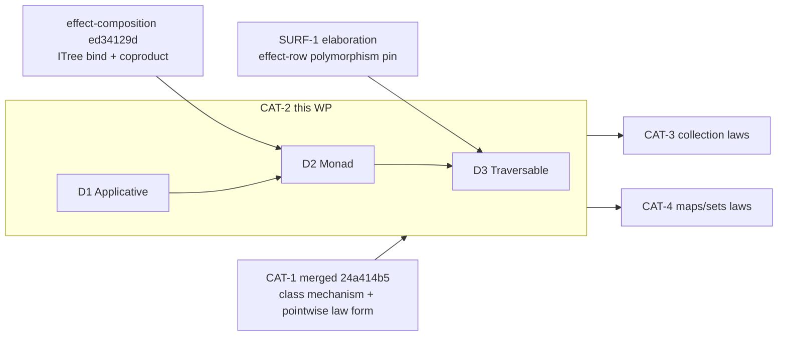

# CAT-2 — `Applicative` / `Monad` / `Traversable` (the effectful constructor classes)

**Owner:** Spec enclave (elaboration) → Language build.
**Branch:** `wp/CAT-2-applicative-monad-traversable` (off `origin/main @ 24a414b`).
**Status:** Steward frame (this doc). **Not yet elaborated.** This is the
*elaboration* WP brief; the build is a downstream deliverable.

**Sequence:** **after CAT-1** (merged `24a414b5` — supplies the higher-kinded
class mechanism + the pointwise law form these inherit) **and after SURF-1**
(`wp/purity-keywords-effect-polymorphism` — its effect-row-polymorphism pin is
what `Traversable.traverse` needs). **Before CAT-3/CAT-4.** See
`../06-catalog-campaign.md` §"Lane A" (CAT-2 = the fast-follow after CAT-1) and
§"Sequencing" #3 (SURF-1 gates the effect-polymorphic traversal).

> **Frame-by-objective, not by current state (§2c).** Every "the landed code
> does X" line below is **perishable** — re-verify it against the elaborator/
> kernel as they stand at pickup, not against this line. CAT-1's extension and
> SURF-1's row-poly pin both move code under this frame between authoring and
> elaboration; trust the tree, not the prose.

---

## 1. Objective

Land the three **effectful constructor classes** that the whole catalog's
monadic/traversal layer (parsers, effectful folds, validation, stateful
computation) leans on, as **lawful classes in the CAT-1 mould** — a class is a
record, each law is an `Ω` value-equation **proved not postulated** over an
inductive carrier, **zero `trusted_base()` delta, kernel-untouched**:

- **`Applicative f`** — `pure` + `ap` (`<*>`), the four applicative laws.
- **`Monad f`** — `bind` (`>>=`), the three monad laws; the presentation must
  **reconcile with the interaction-tree `bind` that effect-composition already
  landed** (`docs/program/wp/effect-composition.md` D1–D3, merged `ed34129d`) —
  the effect system's denotation *is* a monad, so `Monad` must not mint a second,
  divergent `bind`.
- **`Traversable f`** — `traverse` / `sequence`, the traversal coherence laws.
  `traverse : (a → g b) → f a → g (f b)` is **the first library definition that
  is polymorphic over an arbitrary applicative `g`** — the effect-row-polymorphic
  case SURF-1 pins. This is why SURF-1 sequences first.

**Why these lead CAT-2 (not split further):** they are one coherent chain
(`Functor → Applicative → Monad`, plus `Traversable` over `Functor + Foldable`),
they share one law form (pointwise, `55 §5.2`), and the superclass-wiring
template question (§2.2/§5 of `55`, **explicitly deferred to CAT-2**) can only be
answered by the class where the chain first gets deep. Splitting them would
force that decision twice.

**This chapter is the contract.** The enclave brings it to team-ready rigor
(law statements, instance proof obligations, discriminating conformance cases,
the pinned design forks resolved); the Language build lands
`packages/lawful-functors/` additions + any elaborator delta the enclave rules
necessary. The build is **held for the GPT window** (credit-window strategy,
`agent/MODELS.md`); this elaboration runs **now** on the T1 enclave.

---

## 2. Fixed inputs — pinned, do not reopen

These are **settled** by CAT-1 + the effect system + the operator; the enclave
elaborates *within* them and does not relitigate them (§2c: never hand a weaker
downstream model a decided fork marked "open").

1. **Class = record; law = `Ω` value-equation, no truncation.** A class is a
   structure record (`spec/30-surface/33 §5.1`); law fields are `Equal (f _) u v
   : Ω` — proof-irrelevant, **no `‖·‖` truncation** (these are direct value
   equations, not proof-relevant `∨`/`∃`; the `55 §4` / `51 §3` catch does not
   fire). Same discipline as `55 §4`.
2. **Pointwise law form, funext-definitional, one field per law.** funext is
   definitional in Ken's OTT (`obs.rs`: `Eq ((x:A)→B) f g ⇝ (x:A) → Eq (B x) (f
   x) (g x)`), so laws are stated **pointwise** and each instance discharges by
   **direct induction on the carrier** — no funext layer to strip, **one
   canonical field per law**, no point-free duplicate. `55 §5.2` pins this and
   states verbatim that **"this is the form CAT-2's Monad laws inherit."** Applies
   to every Applicative/Monad/Traversable law here.
3. **Proved, zero-delta, inductive carriers.** Every law field is a real kernel
   proof (Ω-motive `Elim`, the K4/K5/K7 capabilities `51 §6`/`55 §3` rest on);
   **no `Axiom`, zero `trusted_base()` delta.** Canonical instances are the
   inductive/finite carriers a catalog author meets — **`List`** and **`Option`**
   at minimum (both real `Type0 → Type0` indformers) — with the two-line proof
   grammar of `55 §3.1` (induction + `cong`) and the **`tt`-vs-`Refl`
   discrimination** of `55 §3.2` (constructor-headed endpoints → `Top` → `tt`;
   neutral endpoints → stuck `Eq` → `Refl`).
4. **The higher-kinded class mechanism is CAT-1's, REUSED not re-forked.** The
   bounded outer-ring extension (`55 §6`, the 5 pieces: AST param-kind; parser
   `class C (f : K)` binder; the 3-site `Term::ty(Level::Zero)` fix; instance-side
   bare-indformer head; parametric instance head `instance C (List a)`) is a
   **CAT-1 Language-build deliverable** (`wp/CAT-1-build`). CAT-2's classes over
   `f : Type → Type` **ride that same extension** — `Applicative`/`Monad` need **no
   new elaborator capability** beyond it. If elaboration finds one is genuinely
   required, that is a **re-fork to Steward** (do not silently grow the boundary),
   exactly as CAT-1 §6's guardrail states.
5. **Kernel-untouched, outer-ring.** No new kernel `Term`/`Decl`; no
   `trusted_base()` change. Effects are outer-ring (`spec/30-surface/36 §2`); this
   WP does not reopen `OQ-8`/`OQ-9`/`OQ-Space`.
6. **`Monad` reconciles with the landed effect denotation.** effect-composition
   merged a real interaction-tree `bind` (`ken-interp`, `declare_def`, reducing)
   and the `injectL`/`injectR`/`resp_sum` coproduct machinery. `Monad` here is the
   **law-carrying class**; its `bind` field and laws must be **satisfiable by, and
   consistent with, that landed `bind`** — one denotation, not two. The ITree
   monad instance is the bridge between the algebra and the effect system.
7. **`Traversable.traverse` is effect-row-polymorphic (SURF-1).** `traverse`
   quantifies over an arbitrary `Applicative g`; in surface syntax it is a `proc`
   (SURF-1: effect-polymorphic ⇒ `proc`, not `fn`). Its well-formedness depends on
   SURF-1's **effect-row-polymorphism pin** (`spec/36`, the row-variable
   mechanism). **Traversable is therefore gated on SURF-1 landing;** Applicative +
   Monad are not.

---

## 3. Mandated deliverable outline

Each deliverable **ends in a concrete, implementable choice** — a class
signature + law statements + named instances + the discriminating conformance
cases — not a survey. The genuine first-of-kind design forks are enumerated in
§5 and routed to the **Architect**; the enclave resolves them *during* this
elaboration and pins the answers here.

### D1 — `Applicative f` (requires `Functor f`)

- **Signature.** `pure : (a : Type) → a → f a` and `ap : (a b : Type) → f (a →
  b) → f a → f b` (ergonomic `<*>`; plain identifier field, infix sugar deferred
  `OQ-syntax` per `55 §2.1`).
- **The four laws, stated pointwise** (`§2` pin 2): identity, homomorphism,
  interchange, composition. Each an `Ω` value-equation; the exact `map`/`pure`/
  `ap` phrasing character-for-character, as `55 §5.2` did for Functor.
- **Functor superclass.** Resolve **fork A (§5)** — wire the `Functor` field or
  restate `map` (with `map = ap ∘ pure`-style coherence recorded). Pin the choice
  and its rationale.
- **Instances (proved, zero-delta):** `List` (the cartesian/ziplist choice is a
  fork — see §5 fork D), `Option`. Every law by induction/case-split, `tt`-vs-
  `Refl` per `55 §3.2`.

### D2 — `Monad f` (requires `Applicative f`)

- **Signature.** `bind : (a b : Type) → f a → (a → f b) → f b` (`>>=`), with
  `pure` inherited. Resolve **fork B (§5)** — `bind`-primary vs `join`+`map`
  primary; pin one, grounded in the landed ITree `bind` (`§2` pin 6).
- **The three monad laws, pointwise:** left identity (`bind (pure a) k = k a`),
  right identity (`bind m pure = m`), associativity (`bind (bind m k) h = bind m
  (λx. bind (k x) h)`). Ω value-equations; inherit the `55 §5.2` form.
- **The ITree bridge (§2 pin 6).** State how `Monad`'s field/laws are satisfied
  by the merged interaction-tree `bind` — an **`Monad ITree`-shaped instance or a
  documented correspondence** — so the effect system's denotation is a *lawful*
  monad, not a parallel construction. This is the load-bearing reconciliation;
  the enclave decides the exact form (instance vs. attested correspondence) and
  pins it.
- **Instances (proved, zero-delta):** `List` (list monad), `Option` (option
  monad). Laws proved over the inductive carrier.

### D3 — `Traversable f` (requires `Functor f` + `Foldable f`; **gated on SURF-1**)

- **Signature.** `traverse : (g : Type → Type) → (Applicative g) → (a b : Type)
  → (a → g b) → f a → g (f b)` and `sequence` as its `id`-specialization. The
  `Applicative g` constraint is the **effect-row-polymorphic** position — pin its
  surface + kernel form **against SURF-1's row-variable mechanism** (fork C, §5),
  not invented here.
- **The traversal coherence laws, pointwise:** naturality, identity
  (`traverse pure ≡ pure` under the identity applicative), composition
  (`traverse (Compose ∘ map g ∘ f) ≡ Compose ∘ map (traverse g) ∘ traverse f`).
  Resolve how many of these are stated vs. derivable, and their exact pointwise
  phrasing.
- **Instance (proved, zero-delta):** `List` traverse (the canonical one);
  `Option` traverse. Over the inductive carrier, effect-polymorphic in `g`.
- **Explicit gate.** If SURF-1's row-poly pin is not yet on `main` at D3 pickup,
  **D1+D2 land first and D3 is held** — do not hand-roll a monomorphic `traverse`
  to dodge the gate (that would be a wart CAT-2 itself reopens). Flag the split to
  Steward.

### D4 — the conformance seed (discriminating, verdict-flipping)

Per the `55`/effect-composition discipline: every soundness case is a
**verdict-flip, not green-vs-green** — a false law (wrong `pure`, a non-
associative `bind`, a naturality-violating `traverse`) must be **rejected for the
right reason** (conversion failure at the *named* law field, asserted as the
specific error variant, not `is_err()`), and a masked `Axiom` must inhabit
`Bottom` via the delta gate. Model on CV's CAT-1 seed (`55 §3.2` endpoint
discriminator). The `Monad`-law cases must include the ITree-bridge
discriminator (§2 pin 6).

---

## 4. Acceptance criteria (testable)

- **AC1 — kernel-untouched, extension-reused.** `git diff origin/main -- crates/
  ken-kernel/` empty; **no new elaborator capability beyond CAT-1's 5-piece
  extension** (if one is needed, it was re-forked to Steward and re-scoped, not
  smuggled). Zero `trusted_base()` delta.
- **AC2 — laws `Ω`, no truncation.** Every law field is `Equal (f _) u v : Ω`;
  no `‖·‖`. (`§2` pin 1.)
- **AC3 — pointwise, one field per law.** Every law stated pointwise, one
  canonical field, no point-free duplicate. (`§2` pin 2 / `55 §5.2`.)
- **AC4 — proved, zero Axiom, zero-delta.** `List`/`Option` instances: every law
  a real kernel proof, **zero `Axiom`/postulate/opaque** (grep-clean), zero
  `trusted_base()` delta; instances bundle at inductive carriers.
- **AC5 — Monad ⇔ ITree reconciliation.** The `Monad` laws are satisfied by /
  consistent with the landed interaction-tree `bind` (`ed34129d`); no second
  divergent `bind`. Stated + discriminated in the seed.
- **AC6 — Traversable ⇔ SURF-1.** `traverse`'s `Applicative g` constraint uses
  SURF-1's row-variable mechanism verbatim; `traverse` classifies as `proc` under
  the SURF-1 bidirectional check. D3 gated on SURF-1 on `main`.
- **AC7 — superclass template pinned.** Fork A resolved once (wire vs restate)
  and applied **consistently** across Functor→Applicative→Monad; the choice + its
  precedent recorded in `55` (updating `55 §2.2`/§5's deferred template note).
- **AC8 — discriminators genuinely flip.** Every conformance soundness case
  flips accept→reject on the wrong witness, at the named law field, asserted as
  the specific variant. Corpus + `cargo test --workspace` green.

---

## 5. Open sub-decisions — routed to the Architect (enclave resolves in-flight)

These are the genuine first-of-kind design questions. The enclave (Architect
owns the soundness/mechanism calls; spec-author transcribes; CV fidelity-gates)
resolves each **during** this elaboration and pins the answer into `55` + this
doc. **None is a build-team decision.**

- **Fork A — superclass: wire vs restate.** `55 §2.2`/§5 **explicitly deferred**
  the constructor-class-chain wiring question to CAT-2. The chain
  `Functor → Applicative → Monad` is 3 deep; restatement (the value-class
  precedent) is costly here. Decide: restate each superclass's ops+laws (simple,
  no mechanism, verbose) vs. wire a superclass field (needs a coercion/projection
  mechanism — is it kernel-untouched? does it ride the CAT-1 extension or re-fork?).
  **Architect owns the mechanism-cost call.**
- **Fork B — Monad presentation.** `bind`-primary vs `join`+`map`. Ground in the
  landed ITree `bind` (`§2` pin 6) — pick the one that makes the ITree bridge a
  direct correspondence, not a re-derivation.
- **Fork C — `Traversable`'s applicative constraint form.** How the `Applicative
  g` bound is expressed against SURF-1's row-variable mechanism — the exact
  surface (`proc traverse`) and kernel form. **Hard-gated on SURF-1;** if SURF-1's
  pin shifts the mechanism, this fork moves with it.
- **Fork D — `List` applicative: cartesian vs ziplist.** Two lawful
  `Applicative List` instances exist. Pick the canonical one (cartesian is the
  `Monad`-coherent default; ziplist is not a monad) — coherence with D2's `Monad
  List` forces cartesian unless a reason surfaces.
- **Fork E — the ITree monad instance's exact form** (instance vs. attested
  correspondence), per D2. Enclave decides; it is the effect-system↔algebra seam.

---

## 6. Do-not-reopen guardrails

- Do **not** touch the kernel or add a `Term`/`Decl` (`§2` pin 5). Any perceived
  need is a re-fork to Steward.
- Do **not** grow the CAT-1 5-piece extension boundary silently (`§2` pin 4) —
  re-fork if a genuinely new elaborator capability is required.
- Do **not** proliferate a second (point-free) law field per law (`§2` pin 2 /
  `55 §5.2`).
- Do **not** mint a second `bind` or a divergent effect denotation (`§2` pin 6 /
  AC5).
- Do **not** hand-roll a monomorphic `traverse` to dodge the SURF-1 gate (D3);
  split D1+D2 ahead and hold D3.
- Do **not** postulate a law or introduce an `Axiom`/opaque to close a hard
  instance (`§2` pin 3 / AC4) — a hard law means the carrier or the statement is
  wrong, surface it.
- Do **not** reopen settled surface/effect decisions (`OQ-8`/`OQ-9`/`OQ-Space`,
  the `view`→`const`/`fn`/`proc` split which is SURF-1's).

---

## 7. Sequencing & dependencies

- **Upstream:** CAT-1 (merged — the mechanism + law form), SURF-1 (elaboration —
  gates D3 only), effect-composition (merged — the ITree `bind` D2 reconciles
  with).
- **Internal order:** D1 → D2 → D3 (Applicative before Monad before Traversable);
  D1+D2 can elaborate as soon as the enclave frees from SURF-1; **D3 waits on
  SURF-1 on `main`.**
- **Downstream:** unblocks CAT-3 (collection laws / `view`) and CAT-4 (maps/sets
  laws) — both lean on the effectful classes for their effectful operations.
- **Build:** the Language build of CAT-2 is **held for the GPT window** (T2,
  credit-window strategy); Architect re-certs AC1/AC3/AC5 on the built diff in the
  Phase-3 Opus re-review, the analog of the CAT-1 build re-cert.
- **Kickoff:** the enclave picks this up **after SURF-1 elaboration**, §2c
  compact-gated at the seam. Do not kick off mid-SURF-1.

---

## 8. Enclave elaboration (rulings landed)

Elaborated against `main@ef791a3` (CAT-1 `55` + SURF-1 `36 §1.5` landed).
Design forks: **Architect owns** (grounded on the landed elaborator + effect
code); **spec-author transcribes** into `spec/50-stdlib/56-effectful-classes.md`
(new chapter) + `55 §2.2`/`§7` pt 5 (template resolution); **Architect
fidelity-gates** the committed text. Landed-code anchors live here, not in the
normative spec.

### E1 — Fork A: superclass **WIRE** (`56 §2`, `55 §7` pt 5 resolved)

The constructor chain wires an explicit superclass-dict field —
`Applicative f { functor : Functor f }`, `Monad f { applicative : Applicative
f }`, `Traversable f { functor + foldable }` — applied consistently up the chain
(AC7). **Reverses** `55 §2.2`'s value-class *restate* default, exactly as `55
§7` pt 5 pre-registered ("restate … unless the chain is deep enough that wiring
wins"; the 3-deep chain is that condition). Value classes still restate; the
split is **by depth**.

Rides existing machinery, **zero new capability beyond CAT-1 `55 §6`** (landed
anchors): `elab_class_decl` (`elab.rs:1845`) elaborates a field typed `Functor
f` like any field; `infer_proj` (`elab.rs:1288`) resolves nested
`d.applicative.functor.map` by head-`Const`/`type_id` match, **supports an
opaque bound-var base**; `compute_ordered_field_values` (`elab.rs:1945`) checks
each instance field value against its substituted type, so a deeper instance
**supplies the already-built sub-dict** and its superclass laws are **not
re-proved** (the win — restatement would duplicate 6 proofs per deep instance).
Same trust level (both kernel-re-checked `declare_def` terms) — no TCB
regression; the `coexist-when-trust-differs` guard does not bite.

**Honest boundary (deferred, not taken):** explicit wiring → verbose use sites
(`d.functor.map`). The ergonomic fix — implicit superclass coercion — **would**
need a new elaborator capability (resolution walking the superclass edge) = a
`55 §6` guardrail re-fork to Steward. CAT-2 ships **explicit** wiring;
implicit-coercion sugar is an `OQ-syntax`/elaborator follow-on, re-forked
if/when wanted. **Existing open item, not a new fork.**

### E2 — Fork B: Monad **`bind`-primary** (`56 §4.1`)

Grounded on the landed `bind` (`declare_bind`, `effects/state.rs:477`): a single
`Term::Elim` over `ITree e resp`, `method_ret = λx. f x` (so `bind (Ret a) f = f
a` — **left-id definitional**, `ι` on `Ret`), `method_vis` rebuilds `Vis` with
`ih r ≡ bind (k r) f`. `bind`-primary makes the ITree bridge (E5) a direct
correspondence. `pure := Ret`; `join`/`map` derivable convenience, **not**
proliferated as primary fields. Field order `(m : f a) (k : a → f b)` matches
the landed bind; three laws pointwise (`55 §5.2`).

### E3 — Fork C: `traverse`'s `Applicative g` = **explicit dict** (`56 §5`)

`traverse : (g : Type→Type) → Applicative g → (a b : Type) → (a → g b) → f a → g
(f b)`, classified **`proc`**. `Applicative g` is an **explicit** dict param
(not implicit `where`): an abstract `g` has no concrete head for implicit
search; `infer_proj` projects `ap_g.ap`/`ap_g.pure` off an opaque bound-var dict
fine, so the explicit form is buildable today and the implicit form is not.

**SURF-1's row variable and the `Applicative g` abstraction are the SAME axis at
two layers** — no new mechanism. `traverse`'s `f : a → g b` has an abstract
codomain head `g`; SURF-1's `classify_telescope` (`effects/extract.rs`)
classifies that `Unknown` → fail-closed → a fresh `RowVar` (`extract.rs:64`). So
`traverse` is row-polymorphic **because** `g` is abstract (⇒ `proc`, AC6 via
SURF-1 verbatim). The `RowVar` **co-varies** with the dict: `g := Option`/`List`
⇒ `RowVar → ∅` but stays `proc` (`36 §1.6` do-not-optimize / PK8); `g := Eff e`
⇒ `RowVar → e` ⇒ `visits [e]` (`36 §1.5.1`'s exemplar is exactly this slice). No
double-count: surface row = conservative signature face; the ITree denotation
reifies the same effects as `g`-data; agree at `Eff e`, both collapse at
`Option`. Surface *spelling* stays `OQ-syntax` (`36 §1.5.1`); the *construct* is
normative.

### E4 — Fork D: `List` applicative **cartesian** (`56 §3.3`/`§4.4`)

Forced by Monad coherence under the wired chain: `Monad List`'s `applicative`
field must satisfy `ap = ap-from-bind` (`ap mf mx = bind mf (λg. bind mx (λx.
pure (g x)))`); `List bind` is `concatMap` ⇒ that `ap` is **cartesian**. Ziplist
`ap` (zipWith) is not `bind`-coherent and ziplist has no lawful `Monad`, so it
cannot be the `Applicative List` the `Monad List` wires. One canonical instance;
ziplist **not** proliferated (rides a `newtype` if ever wanted — deferred, not
CAT-2).

### E5 — Fork E: ITree monad = **attested correspondence** (`56 §4.3`, AC5)

*Corrects* the grounding read "wires `Monad (ITree e resp)`, zero new code": the
carrier `ITree e resp` is a **parametric instance head** (free `e`, `resp`);
`elab_instance_decl` (`elab.rs:1983`) elaborates the head via `elab_type` in an
*empty* context, so free head vars ⇒ `UnresolvedCon` — the **CAT-1 `55 §6.1`
parametric-instance-head gap**, still open with Steward. A general `instance
Monad (ITree e resp)` does **not** elaborate today.

Ruling: reconcile by **attested correspondence** — `Monad`'s `bind`/`pure`
fields + 3 laws are *satisfied by* the landed bind (`pure := Ret`, `bind :=` the
landed `Term::Elim`, left-id definitional, right-id/assoc by ITree induction),
documented as the bridge, **no second `bind` minted** (AC5). The general surface
instance is a **generality upgrade gated on `55 §6.1`'s parametric-head path** —
the already-open Steward fork, **not** new. (A closed-effect `instance Monad
(ITree E₀)` *would* elaborate but is not the general bridge, so not the CAT-2
deliverable.)

### E6 — Scope register (no new Steward re-forks)

Kernel-untouched throughout (AC1); wiring + explicit dicts + attested bridge all
ride CAT-1 `55 §6` + existing record/projection machinery, **zero new
capability**. **Two pointers to EXISTING open items**, neither invented here:
(1) `55 §6.1` parametric-instance-head (Fork E's general-instance upgrade);
(2) an `OQ-syntax` implicit-superclass-coercion follow-on (Fork A's ergonomics).

### E7 — Build sequencing (perishable)

`.ken` source (`packages/lawful-functors/` additions) is a Language-build
deliverable, **held for the GPT window**. CV's grounding confirms
`map`/`bind`/`foldr`/`traverse` for `List`/`Option` are **not yet landed** — the
instance-law conformance cases are **red-until-built** (the CAT-1 `Functor`-case
posture), reconciled against the built package at the CAT-2 build gate.
Architect re-certs AC1/AC3/AC5 on the built diff (the fixpoint-lift seam for
`traverse`'s recursive effect-fold is the same one flagged at SURF-1).
