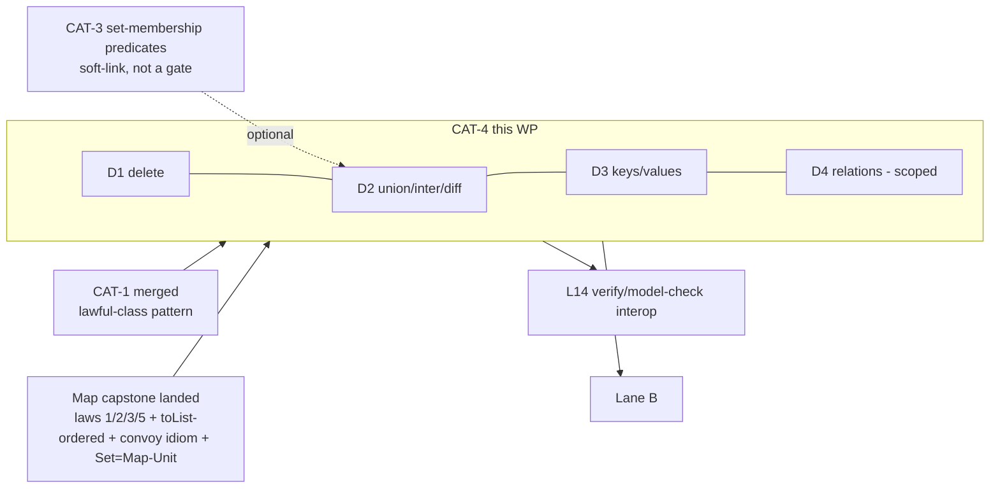

# CAT-4 — Maps / Sets / Relations laws (Layer 2)

**Owner:** Spec enclave (elaboration) → Runtime build (Map was Runtime's
substrate).
**Branch:** `wp/CAT-4-maps-sets-relations` (off `origin/main @ 24a414b`).
**Status:** Steward frame (this doc). **Not yet elaborated.** Elaboration WP;
build held for the GPT window.

**Sequence:** **after CAT-1** (the lawful-class pattern) and **on the landed Map
capstone** (`catalog/packages/collections/map.ken`, `spec/50-stdlib/52-map.md` +
`54-map-verified-laws.md` — laws 1/2/3/5 + toList-ordered already proved).
**CAT-2- and CAT-3-independent** (value-level; the set laws optionally reuse
CAT-3's set-membership predicates if landed — a soft link, not a gate). See
`../06-catalog-campaign.md` §"Lane A" (CAT-4 = Layer 2, Runtime-owned) and
§"Fleet fan-out" (Runtime → maps/sets).

> **Frame-by-objective, not by current state (§2c).** The landed-capstone roster
> below is **perishable** — re-verify `catalog/packages/collections/map.ken` +
> `54-map-verified-laws.md` at pickup. This WP **extends** a substantial landed
> proof corpus; the first elaboration task is to inventory exactly what is already
> proved so nothing is re-derived (`§2` pin 2).

---

## 1. Objective

Complete the **Layer-2 keyed/relational structures** — `Map`, `Set`, and
`Relation` — with their **full law set as proved propositions**, extending the
landed Map capstone (which proved the *hard* core: lookup-after-insert, the
ordered invariant `toList`-ordered, `lookupEmptyIsNone` — laws 1/2/3/5 via the
convoy idiom + the Gap-A `trans`/`cong` route-around, `54 §3`/§5). CAT-4 adds the
operations and laws the capstone deliberately scoped out:

- **`Map`:** `delete` + its laws; `union`/`intersection`/`difference` (keyed
  merge) + their laws; `keys`/`values` coherence.
- **`Set`** (the landed `setInsert`/`setMember`/`setToList` — **Set = Map with
  unit values**): the set-algebra laws (commutativity / associativity /
  idempotence / identity of ∪, ∩, ∖; membership characterizations).
- **`Relation`** (new — a relation as a `Set` of pairs, or `Map key (Set key)`):
  composition, converse, reflexive/symmetric/transitive **as `Ω`-predicates**, and
  (scoped) transitive closure. **The relations half is the frontier** — scope how
  much lands now vs. designed-and-deferred (fork C).

**This chapter is the contract**; the Runtime build lands the `.ken` proofs. Build
held for the GPT window; this elaboration runs on the T1 enclave.

---

## 2. Fixed inputs — pinned, do not reopen

1. **Lawful-class discipline (CAT-1) + the capstone's Ω-discipline (`54 §6`).**
   Laws are `Ω` propositions, **proved not postulated, zero `Axiom`, zero
   `trusted_base()` delta**; the **`tt`-vs-`Refl` base-witness discrimination**
   (`54 §2.3`/K7, `55 §3.2`) and the **convoy idiom** for induction over `Tree`
   (`54 §2`, the Gap-B pattern) apply verbatim to every new inductive law.
2. **REUSE the landed capstone — do not re-derive.** Laws 1/2/3/5 + toList-ordered
   + the ordered-invariant machinery (`Ordered`, `isSortedAppend`, `toListOrdered`,
   the `ord*`/`sorted*` lemmas in `map.ken`) are **landed and reused** as helpers
   for the new laws (e.g. `union` preserves `Ordered` by the same merge-sorted
   machinery). The first elaboration step is to **inventory** what is proved
   (`54 §5.2`/§5.3) — subsume-don't-proliferate.
3. **Set is Map-with-unit (landed pattern).** `setInsert`/`setMember`/`setToList`
   already ride `Map key Unit`. Set-algebra ops derive from the map merge ops;
   **do not mint a parallel Set inductive** unless the enclave grounds a real need
   (then re-fork). Set laws are corollaries of the map laws where possible.
4. **Ω-soundness for any proof-relevant relational content.** A relation's
   *derivations* (a transitive-closure path, a "reachable via" witness) are
   **proof-relevant** and **cannot** be a raw multi-ctor `Ω` inductive
   ([[proof-relevant-inductive-cannot-be-declared-at-omega]], `16 §1.3`) — reflexive/
   symmetric/transitive **properties** are fine as `Π`-into-`Ω` predicates, but a
   **transitive-closure relation** carrying paths needs `‖·‖`-truncation or a
   count/existence encoding. Same hard pin as CAT-3's `Perm` (`§2.4` there). The
   enclave designs the closure representation soundly from the start (fork B).
5. **Kernel-untouched, outer-ring.** No new kernel `Term`/`Decl`; no
   `trusted_base()` delta. `delete`/`union`/`intersection`/`difference`/relations
   are ordinary total Ken over the landed `Tree` carrier (SCT-terminating —
   grounded per op).

---

## 3. Mandated deliverables

### D1 — `Map delete` + laws

- **`delete : (k : K) → Map K V → Map K V`**, total over `Tree`, preserving the
  BST/`Ordered` invariant (reuse the landed ordering machinery).
- **Laws (pointwise `Ω`):** `lookup k (delete k m) ≡ None`; `k ≠ k' →
  lookup k' (delete k m) ≡ lookup k' m`; `Ordered m → Ordered (delete k m)`
  (invariant preservation, via the convoy idiom).
- Verdict-flip case: a `delete` that removes the wrong subtree fails the
  other-key law.

### D2 — `union` / `intersection` / `difference` (Map + Set)

- The three keyed-merge ops over `Map` (with a value-combining function for
  `union` on key-collision — pin its signature), total + `Ordered`-preserving.
- **Map laws:** the lookup characterization of each (`lookup k (union f a b)` in
  terms of `lookup k a`, `lookup k b`, `f`); `Ordered` preservation.
- **Set laws** (Set = Map-Unit, `§2` pin 3): **commutativity, associativity,
  idempotence** of ∪ and ∩; **identity** (`∪ empty`, `∩` universe-in-domain);
  **difference** (`a ∖ b` membership); the **absorption/distributive** laws as far
  as cheap. Each `Ω`, pointwise, proved over the carrier — the set laws derived
  from the map laws where possible (`§2` pin 3).
- Pin the exact statements; carriers `Map Nat V` / `Set Nat` at minimum.

### D3 — `keys` / `values` coherence

- `keys`/`values` (the landed `allKeys`/`pairKeys` are the base) + laws:
  `mem k (keys m) ⇔ isSome (lookup k m)`; `keys`/`values` length + ordering
  coherence with `toList`; `keys (insert k v m)` characterization. `Ω`-predicates,
  reuse `toListOrdered`.

### D4 — `Relation` (scoped — fork C)

- **Representation:** a relation `R : K → K → Ω` reified as `Set (Pair K K)` (or
  `Map K (Set K)`); pin one (fork C-rep).
- **Ops + properties (`Ω`-predicates):** `compose`, `converse`; `isReflexive` /
  `isSymmetric` / `isTransitive` as `Π`-into-`Ω`; `isEquivalence`. These are the
  cheap, provably-`Ω` half.
- **Transitive closure (the proof-relevant frontier):** design its representation
  per `§2` pin 4 (`‖·‖` or a bounded/count encoding) — **fork B**. **Scope
  decision (fork C-scope):** land the properties + composition/converse now;
  **transitive closure may be designed-and-deferred** to a fast-follow if the
  sound encoding is heavy. State clearly what lands vs. defers — no silent
  truncation of scope.
- **Coordination:** relations feed L14 (verify/model-check interop) and Lane B;
  state the seam, do not over-build here.

### D5 — Conformance seed

Discriminating verdict-flipping cases: the `delete` other-key law, the set-algebra
laws (a non-commutative "union" fails), the `keys` coherence, the relation
properties (a non-transitive relation fails `isTransitive`). Model on the
capstone's `54`/CV discipline (convoy base-witness + specific-variant assertions).

---

## 4. Acceptance criteria (testable)

- **AC1 — kernel-untouched.** `git diff origin/main -- crates/ken-kernel/` empty;
  zero `trusted_base()` delta; no new `Term`/`Decl`.
- **AC2 — reuse, zero re-derivation.** The landed capstone laws/lemmas are cited
  and reused (inventory step done); no duplicated proof of laws 1/2/3/5 or the
  ordered-invariant machinery. Grep-clean of `Axiom`/postulate.
- **AC3 — invariant preservation.** Every new op (`delete`/`union`/`intersection`/
  `difference`) has a proved `Ordered`-preservation law (the convoy idiom over
  `Tree`).
- **AC4 — set laws proved, derived-where-possible.** ∪/∩ commutativity /
  associativity / idempotence / identity proved over `Set Nat`; derived from the
  map laws where the derivation exists.
- **AC5 — relation Ω-soundness.** Reflexive/symmetric/transitive are `Π`-into-`Ω`;
  transitive closure (if landed) is **not** a raw multi-ctor `Ω` inductive
  (`§2` pin 4 / fork B) — Architect owns the call. Deferred scope stated
  explicitly.
- **AC6 — discriminators flip.** Each conformance soundness case flips
  accept→reject at the named law, specific variant.
- **AC7 — green.** `cargo test --workspace` + rosetta (16/0) green; extends
  `catalog/packages/collections/` (MANIFEST + derivation path updated).

---

## 5. Open sub-decisions — routed to the Architect / enclave

- **Fork A — `union` value-collision signature:** `union : (V → V → V) → Map →
  Map → Map` (combining fn) vs left/right-biased. Pin one.
- **Fork B — transitive-closure representation** (if landed): `‖·‖`-truncated vs a
  count/bounded encoding — **soundness call, Architect owns** (`§2` pin 4).
- **Fork C — relations scope + representation:** `Set (Pair K K)` vs `Map K
  (Set K)` (C-rep); and how much of D4 lands now vs. deferred (C-scope). State
  the split; coordinate the L14/Lane-B seam.
- **Set-op derivation depth** — how many set laws are corollaries of map laws vs.
  need their own induction; enclave's call after the inventory.
- **Carrier breadth** — `Map Nat V` / `Set Nat` mandatory; richer key types as
  cheap fast-follows.

Anything **beyond** scope — a kernel touch, a new `Term`/`Decl`, a parallel Set
inductive (`§2` pin 3), reopening a decided OQ, or changing the lawful-class /
Ω discipline — **re-forks to Steward**.

---

## 6. Do-not-reopen guardrails

- Do **not** re-derive the landed capstone laws (`§2` pin 2 / AC2) — inventory
  and reuse.
- Do **not** mint a parallel `Set` inductive — Set is Map-with-unit (`§2` pin 3).
- Do **not** declare a transitive-closure relation as a raw multi-ctor `Ω`
  inductive (`§2` pin 4 / AC5).
- Do **not** postulate a law or add an `Axiom` (`§2` pin 1).
- Do **not** over-build relations — it is the L14/Lane-B frontier; land the cheap
  `Ω`-provable half, scope the rest explicitly (D4 / fork C).
- Do **not** touch the kernel or add a `Term`/`Decl` (`§2` pin 5).

---

## 7. Dependencies & sequencing

- **Upstream:** CAT-1 (merged), the Map capstone (landed — the substrate + the
  reused proof corpus). CAT-2/CAT-3-independent.
- **Downstream:** relations feed **L14** (model-check interop) + **Lane B**
  (obligation structures) — the two Ward-adjacent layers; keep the relation
  representation one design with those.
- **Owner:** **Runtime** (Map was its substrate) — the fleet-fan-out assignment
  (`06 §"Fleet fan-out"`). Elaboration is enclave; the build is Runtime in the
  GPT window; Architect re-certs AC1/AC5 (relation Ω-soundness) in Phase-3 Opus
  re-review.
- **Kickoff:** enclave picks up §2c compact-gated at the seam after its prior WP;
  CAT-2/CAT-3-independent so Steward may sequence it flexibly in the queue.

## 8. Enclave elaboration

The design contract is authored in
**`spec/50-stdlib/58-maps-sets-relations.md`**
(the durable transcription). This section records the fork rulings, the
grounding they rest on, and the scope register, so the Runtime build (GPT
window) and the fidelity gate read one durable artifact, not the channel thread.

Grounded on `origin/main @ 7169300f` (`catalog/packages/collections/map.ken` (2225
lines),
`54`/`52`, `10-kernel/16 §1.1–§1.4`/`§6`, `catalog/packages/lawful-classes/
lawful_classes.ken`, `crates/ken-elaborator/src/prelude.rs`).

- **E0 — §2c roster re-verified (perishable, re-checked not trusted).** The
  seven capstone laws are real kernel-rechecked `view` terms with **zero
  `Axiom`/postulate/`declare_primitive`**: `orderedEmpty`/`lookupEmptyIsNone`
  (Branch-A `tt`), `toListOrdered` (law 4), `preservesOrdered` (law 1),
  `lookupFoundAfterInsert` (law 2), `lookupLocality` (law 3), `lookupAssocAgree`
  (law 5). All six D1–D3 ops absent; `glue`/`deleteMin`/`pairVals`/`leqNat`
  absent — every CAT-4 op is net-new.

- **E1 — Fork A (`union` collision signature) = COMBINING FUNCTION** `union :
  (V→V→V) → Map K V → Map K V → Map K V` (Architect, `evt_55htg0ss8y1v6`).
  Subsume-don't-proliferate: left/right bias are `union (\x _. x)`/`union (\_ y.
  y)`. `union f a b := fold (\k v acc. insertWith f k v acc) b a` rides the
  landed `fold` (`map.ken:57`)/`insert` (`:67`). `Ordered`-preservation is
  **`f`-independent** (`f` touches only values; `Ordered` is a key statement);
  `f` appears **only** in the lookup characterization. **Map union is not
  commutative** — no map-commutativity law (`58 §4`).

- **E2 — Fork B (transitive-closure representation) = BOUNDED/DECIDABLE
  REACHABILITY, `Ω`-native `IsTrue`, not `‖·‖`** (Architect, soundness). `R⁺ x y
  := IsTrue (reachableWithin N x y)`, `N := size (dom R)`. The `Perm` move —
  push the proof-relevant "a path exists" into a decidable `Bool` then wrap in
  `IsTrue := Equal Bool · True` (`16 §1.1` predicative Π-into-Ω). **No raw
  multi-ctor `data TC : … : Ω`** (inadmissible proof-relevant, `16 §1.4`+§1.1).
  Faithful: any walk shortens to a simple path ≤ `N−1` (cycle removal), so
  bounded reachability at bound ≥ `N−1` equals full closure (monotone,
  saturates). Beats truncation: evaluates (verdict-flippable), fits the L14
  model-check consumer, rides landed `fold`/`union`/`member` (`58 §7`).

- **E3 — Fork C (relation rep + scope) = `Map K (Set K)` adjacency (`Tree K
  (Tree K Unit)`), with an explicit land-now/defer-build split** (Architect).
  Rides `Ord K` only; **not** `Set (Pair K K)` (the landed `pairLeq`
  (`map.ken:266`) compares first components only — partial, non-total — so it
  cannot key a pair-set, and a proper pair-set would need a lexicographic
  comparator + its four order laws). **Land now:** `compose`/`converse`/`succ`/
  membership + `isReflexive`/`isSymmetric`/`isTransitive`/`isEquivalence` as
  Π-into-Ω predicates + the non-transitive discriminator. **Defer-build:** the
  transitive-closure faithfulness/saturation laws + a net-new `size : Tree k v →
  Nat` (`58 §7`; recorded in `90`).

- **E4 — Fork D (`delete` formulation, surfaced by this enclave's grounding) =
  REBUILD-VIA-`fromList`** (Architect, `evt_3z7c592g37rtr`). The frame billed
  `delete` "zero fork-dependency", but its equal-key case **merges two
  subtrees** with no `insert` analog (insert overwrites in place). `delete key m
  := fromList leq (dropKey leq key (toList m))` reuses the landed
  `preservesOrdered` (`map.ken:950`) wholesale via one new
  `fromListPreservesOrdered` (List-induction, per-step = the landed proof);
  wins on reuse, small proof surface, and the D2 cascade over the structural-
  `glue` route (which re-derives `glue`/`deleteMin` + a cross-subtree-bound
  transport). **Build-pin:** `dropKey` = **filter** (remove all order-equivalent
  entries), so `lookup key (delete key m) ≡ None` is **unconditional**; a
  drop-first `dropKey` would leak a duplicate on a non-`Distinct` input.
  `delete`
  is non-recursive → zero SCT obligation of its own (`58 §3`).

- **E5 — Enclave sub-ruling (set-law formulation) = MEMBERSHIP-EXTENSIONAL**
  (Architect, load-bearing soundness). Set laws are `∀x. setMember x lhs ≡
  setMember x rhs`, **never** `Equal (Set K) lhs rhs`: `union a b`/`union b a`
  are `fold`+`insert`-built shape-different trees with the same key-set, so
  Tree-`Equal` set laws are **false**, not merely unprovable. Extensional makes
  comm/assoc/idem/identity **corollaries** of `bool_or`/`bool_and` (finite 2×2
  via landed `boolDichotomy`, `map.ken:206`), not fresh `Tree` inductions.
  Net-new trivial `bool_and`/`bool_not` alongside landed `bool_or`
  (`lawful_classes.ken:39`) (`58 §5`).

- **E6 — Enclave sub-ruling (carrier) = `Nat` with a net-new `Axiom`-free
  `leqNat`+4 order laws** (Architect; the CAT-3 `List Bool` vacuity lesson). No
  `leqNat`/`Ord Nat` on `main` (grepped). `Ord Int`/`Ord Char` are `Axiom`-holed
  (accept-arm vacuous → flip degenerates to reject-vs-reject); `Ord Bool` is
  `Axiom`-free but only 2 keys (cannot exhibit a→b→c transitivity). `leqNat`
  (`Zero`/`Suc` structural — `Nat = Zero | Suc Nat`, `prelude.rs:187`) + refl/
  antisym/trans/total by `Nat` induction are ordinary total Ken, kernel-
  untouched, the unbundled bare-parameter dictionary (`52 §2`). **D0
  prerequisite** (`58 §2`).

- **E7 — Scope register.** Kernel-untouched, outer-ring, zero `Axiom`, zero
  `trusted_base()` delta throughout (AC1). Two build items ride the deferred/
  prerequisite lanes, neither a kernel touch: `size : Tree k v → Nat` (closure
  bound, deferred) and `leqNat`+4 laws (carrier, D0). No new `Term`/`Decl`, no
  `declare_primitive`/`declare_postulate`, no reopened OQ, no Steward re-fork.
  Net-new corpus enumerated in `58 §8`.

- **E8 — Build sequencing.** **D0 (`leqNat`) → D1 (`delete`) → D2 (`union`/…) →
  D3 (`keys`/`values`) → D4 (land-half)**, Runtime-owned, GPT window.
  Conformance
  seed (D5) authored with the validator on the `Nat` carrier (real `leqNat`,
  never `Int`). Architect re-certifies AC1 (kernel-untouched) + AC5 (relation
  `Ω`-soundness) on the built diff (the frame's Phase-3 Opus re-review); the
  per-branch endpoint tokens (`58 §1 pt 3`: `leqNat`/`Ordered` bases → `tt`,
  neutral/`Suc`-step results → `Refl`/`cong`) reconcile there against the built
  proofs.
