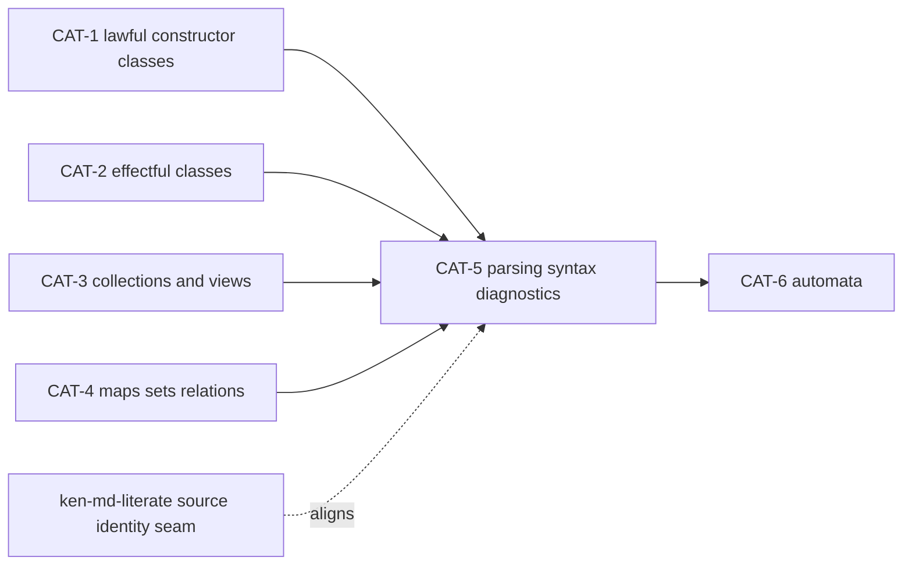

# CAT-5 -- Parsing, syntax, and diagnostics

**Owner:** Language, with Architect review for the source/span and diagnostic
contract. **Branch:** `wp/CAT-5-parsing-syntax-diagnostics`.
**Status:** Steward frame. Released for spec-enclave elaboration after CAT-4.
**Size:** M. **Risk:** medium: ordinary package code, but first-of-kind laws for
source spans, parser/printer round trips, and diagnostic validity.

## 0. Source Brief

Source material:

- `local/core-catalog-and-agent-model-report.md` Layer 3, "Parsing, Syntax, and
  Diagnostics";
- `docs/program/06-catalog-campaign.md` Lane A, later layer list;
- `spec/50-stdlib/README.md` standard-package catalog discipline;
- prior catalog tranche: CAT-1 through CAT-4 (`55` through `58`).

Layer 3 exists because Ken is agent-written and human-read. Agents need ordinary
Ken packages for parsing, explaining, transforming, and validating source-like
data without treating the compiler's own parser as a hidden built-in.

## 1. Objective

Define the catalog's Layer 3 package contract for parsing, source spans, syntax
trees, and diagnostics, then build the first useful package slice.

The package must expose ordinary Ken data and laws for small grammars and
source-located diagnostics. It must not reimplement Ken's compiler parser or
make compiler-internal ASTs part of the public catalog surface.

## 2. Scope

In scope for CAT-5:

- source artifacts and spans: `Source`, `Span`, source length/newline facts,
  span containment, span validity, and span-preserving slicing;
- tokens and parse errors for small package-defined grammars;
- a parser-combinator core with total parse results;
- a minimal concrete syntax tree type for package grammars;
- a diagnostic data type with source/span validity laws;
- parser/printer and formatter laws for a small expression grammar;
- conformance cases that distinguish span-preserving implementations from
  green-but-source-blind implementations.

Out of scope:

- replacing Ken's compiler lexer/parser or exposing its internal AST as the
  catalog API;
- reflection over full Ken syntax;
- LSP, editor integration, doc generation, and formatter tooling outside the
  small package grammar;
- `.ken.md` extraction itself, which is already owned by
  `wp/ken-md-literate`;
- CommonMark, nested Markdown, or literate-programming policy;
- kernel, trusted-base, or language-semantics changes.

## 3. Required Design Pins

Before implementation, the spec enclave must pin:

1. **Package shape.** Decide whether CAT-5 ships one package
   (`packages/parsing/`) or a split package (`packages/source/` plus
   `packages/parsing/`). Prefer one package unless the derivation path becomes
   materially clearer by splitting.
2. **Span model.** Pin `Span` as byte-offset based, with start/end bounds into a
   `Source`, unless the spec identifies a landed reason to use another unit.
   Line/column values may be derived views, not the canonical identity.
3. **Parser totality.** A parser returns a structured success or failure result;
   it does not throw, panic, or rely on partial functions. Failures carry valid
   spans into the same source artifact.
4. **Round-trip surface.** Choose a small grammar whose parser/printer and
   formatter laws can be proved now. This should be a package grammar, not full
   Ken syntax.
5. **Diagnostic validity.** A diagnostic is valid only if every primary and
   secondary span indexes the named source artifact. The law must reject a
   diagnostic that points outside the source.
6. **Relationship to `.ken.md`.** Consume the active `ken-md-literate` decision
   only at the source-identity boundary: original source artifacts own
   diagnostic identity; any extracted or derived buffer is a view, not the sole
   source identity. Do not fold `.ken.md` implementation into CAT-5.

## 4. Deliverables

The spec elaboration should add a new catalog chapter, expected as
`spec/50-stdlib/59-parsing-syntax-diagnostics.md`, and a conformance seed under
`conformance/stdlib/parsing/` or the closest existing catalog home.

The build should add the corresponding package under `packages/`, with a
manifest that states:

- derivation path from built-ins and earlier catalog packages;
- `trusted_base()` delta, expected to be zero;
- which laws are proved now and which richer laws are deferred;
- examples that are small enough to read as catalog literature.

Suggested D-slices:

- **D1 -- source and span core.** `Source`, `Span`, validity predicates,
  containment/intersection where useful, newline-preserving views, and
  source-slice behavior.
- **D2 -- parser result and combinator floor.** Total result type, sequencing,
  choice, repetition with an explicit termination/fuel discipline if needed, and
  error span propagation.
- **D3 -- small syntax grammar.** A tiny expression or command grammar with
  tokens, concrete syntax tree, parser, printer, and formatter.
- **D4 -- diagnostics.** Diagnostic values with valid primary/secondary spans,
  error rendering inputs, and laws that reject out-of-range spans.
- **D5 -- integration examples.** One or two package examples that demonstrate
  parse success, parse failure, diagnostic location validity, and round-trip /
  idempotence.

## 5. Acceptance Criteria

- **AC1 -- zero trust delta.** The package is ordinary Ken. No kernel,
  primitive, opaque, postulate, or export-trust behavior changes are introduced.
- **AC2 -- source/span validity.** A valid span is bounded by its source byte
  length; an out-of-range diagnostic/span is rejected by the law or smart
  constructor.
- **AC3 -- offset preservation.** Parsing a token inside a source reports the
  original byte offset, not an offset in a copied or concatenated buffer.
- **AC4 -- parser totality.** Parse failures are structured values with valid
  spans. No well-typed parse call can crash or silently produce an unlocated
  failure.
- **AC5 -- parser/printer round trip.** For the chosen small grammar, parsing a
  printed syntax tree returns the same syntax tree, modulo the explicitly pinned
  equivalence if whitespace is normalized.
- **AC6 -- formatter idempotence.** Formatting the chosen small grammar twice is
  equal to formatting it once.
- **AC7 -- ambiguity or precedence policy.** The selected grammar either has a
  proved unambiguous parse for the accepted subset or records a concrete
  precedence/associativity policy with discriminating tests.
- **AC8 -- diagnostic validity.** Diagnostics carry source identity plus valid
  primary and secondary spans. A test must flip if an implementation drops
  secondary spans or accepts an out-of-bounds span.
- **AC9 -- `.ken.md` boundary respected.** CAT-5 treats extracted buffers as
  derived source views only. It neither changes nor reimplements
  `ken-md-literate`.
- **AC10 -- workspace green.** Focused package tests, relevant conformance, and
  `scripts/ken-cargo test --workspace` pass.

## 6. Guardrails

- Do not expose the compiler's internal AST as the catalog public API.
- Do not require source maps for CAT-5; v1 should be byte-span based over a
  single source artifact, with derived views explicit.
- Do not use string concatenation as a hidden source identity. If a parser views
  a substring, it must preserve the original source identity and offset basis.
- Do not silently treat formatter output as proof of parser correctness; the
  round-trip law is a separate proposition.
- Do not introduce a "Ken parser package" that claims to parse all Ken source.
  The v1 grammar is deliberately small and package-owned.
- Do not block CAT-5 on `.ken.md` merge unless the spec enclave finds a direct
  source-identity contradiction. Default: align with its D0 seam and proceed.

## 7. Dependencies and Sequencing

CAT-5 follows CAT-4 in the catalog sequence and depends on the catalog
discipline established by CAT-1 through CAT-4. It may reuse:

- lawful classes from CAT-1/CAT-2;
- list/string combinators from the existing collections package;
- source-identity guidance from `ken-md-literate` D0, if landed by pickup.

Build owner is expected to be Team Language after spec elaboration merges.
Because Language is currently building `ken-md-literate`, Steward should release
the CAT-5 build only after that Language WP has merged and retros are in, or
after explicitly deciding to pause/supersede that lane.

## 8. Review Path

Spec-leader routes spec-author and conformance-validator. Architect reviews the
source/span identity, parser/printer law shape, and diagnostic-validity seam.

After elaboration merges to `main`, Steward compact-gates Team Language and
releases the build from the merged spec. Integrator merge uses normal
build/test, conformance, clean-room, and path-guard gates.
