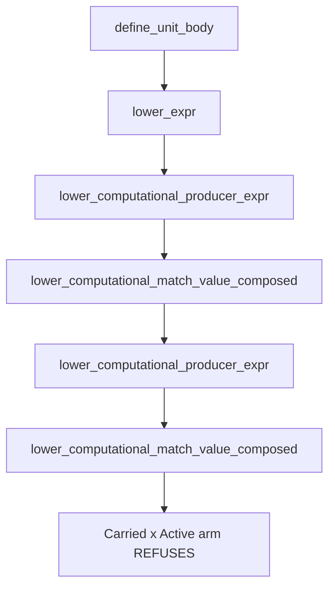

# RT-CARRIED-CONTINUATION-RESUME — `D0`/`D1` checkpoint

**Base: `24d585f8fce19f3b82ca35e3d7234cfa9a2f3f28`** — the superseding accepted
partial, not `50808c11`. The branch was moved there before any commit, on the
Steward's approval: the two objects differ by **two comment lines and zero
non-comment lines**, so the exposed behaviour is identical, but `50808c11` will
not be an ancestor of `main` after a squash and a candidate cut from it would
carry the corrected comment text back in its pre-fix form.

**This candidate changes no code.** `git diff 24d585f8 -- crates/` is empty at
the checkpoint SHA. Every instrument was temporary, was run, and was reverted.
That discharges `AC-4` (landed guards intact), `AC-5` (no new `#[ignore]`) and
`AC-6` (no retirement or lane deletion) byte-identically rather than by
inspection.

> # THE TWO FINDINGS
>
> **1. `PendingLet` has an EMPTY population.** It is reached **zero** times at
> this consumer — any phase, either run, whole lib suite. Not merely unpaired
> with `Carried`: the variant never arrives at all.
>
> **2. `Active`'s population is exactly two arrivals**, one per exposed row, and
> the discriminator is the operand's **phase**, not the frame. The same two
> tests reach this same frame at this same seat in the *retained* run with a
> `Specialized` operand, and pass.
>
> ⇒ `AC-2`'s partition resolves without a mechanism question: **one variant
> fires and the other has no members.** Neither is a hard stop.

## 1. `D0` — the population, closed from the production arm

### 1.1 The instrument

A census at the **entry** of `lower_computational_match_value_composed`, before
any dispatch, recording **every** arrival as `(operand phase, first eliminator
variant)` keyed by the libtest thread name. Recording every arrival rather than
only refusing ones is what makes the zeros below measurements instead of
absences of evidence.

A second census at the compile choke point supplies the outer denominator, so
"compiles that never reach this consumer" is a measured quantity.

The write path issues **one `write_all`** of a pre-formatted buffer. `writeln!`
is not atomic — `write_fmt` emits a syscall per format fragment and concurrent
test threads interleave mid-record, which corrupted two rows of an earlier
census on the sibling node. **Zero malformed records** in both runs here.

### 1.2 Denominators

| quantity | retained | A-only exclusion |
|---|---:|---:|
| compilations | 617 | 613 |
| arrivals at this consumer | 486 | 472 |
| distinct tests compiling | 269 | — |
| distinct tests reaching this consumer | 135 | — |
| tests that compile but never reach it | **134** | — |
| malformed census records | 0 | 0 |

### 1.3 Every arrival, by operand phase and first eliminator

| phase x first eliminator | retained | A-only exclusion |
|---|---:|---:|
| `Carried` x `Computational` | 240 | 241 |
| `Specialized` x `Computational` | 207 | 200 |
| `Specialized` x `Ordinary` | 30 | 22 |
| `Carried` x `Ordinary` | 5 | 5 |
| `Specialized` x `Active` | **4** | 0 |
| `Carried` x `InvocationReturn` | 0 | 2 |
| **`Carried` x `Active`** | **0** | **2** |
| **`Carried` x `PendingLet`** | **0** | **0** |
| `Specialized` x `PendingLet` | **0** | **0** |

### 1.4 The population — `AC-1`

**The production arm `Carried(word)` x first eliminator `{PendingLet, Active}`
is reached exactly twice, both `Active`, one per exposed row:**

| test | arrivals | variant | outcome |
|---|---:|---|---|
| `d8d_the_composed_binding_site_is_live_and_neither_landed_population_installs_a_target` | 1 | `Active` | refuses |
| `px8j_all_three_producer_paths_reach_real_consumers` | 1 | `Active` | refuses |

**The two exposed rows were the floor and they are also the perimeter here** —
but that is a *measured* result, not the assumption the frame warned against.
The census enumerated all 486 arrivals and found no third member; it did not
start from the two rows and stop.

**In production the arm is reached zero times.** Both `Carried x Active`
arrivals appear only under A-only exclusion, which is the seam that routes these
programs onto the functionized lane.

## 2. `D1` — the partition, on evidence

### 2.1 `PendingLet` — an empty population, corroborated by the mechanism

`PendingLet` is reached **zero** times at this consumer, in either phase, in
either run.

**And this is not an artifact of the corpus.** The *specialized* path through
the same function already carries a landed assertion that says the same thing,
for a stated reason:

```rust
EliminatorFrame::PendingLet(_) => {
    unreachable!("pending Let continuations are consumed before value composition")
}
```

⇒ Two independent statements agree: my measurement over the whole lib suite, and
the mechanism's own claim that pending `Let` continuations are consumed before
value composition is entered at all.

**What that does and does not establish.** It establishes that `PendingLet` has
no witness to repair and that a `PendingLet` mechanism would be **a proof over
an empty population** — Campaign Trap 3, where every control passes because
there is nothing to quantify over. It does **not** prove the arm is dead for all
time, and the shared refusal arm should therefore stay as the fail-closed
default rather than being deleted.

### 2.2 `Active` — reachable, and the discriminator is PHASE, not frame

Both rows reproduce the exact first refusal:

```
Unsupported(BoundaryCarrier, "a carried scrutinee reached a continuation frame
that resumes a compile-time value rather than eliminating one")
```

**The positive control is unusually tight, and it is the same two programs.**
In the retained run those two tests produce `Specialized x Active` — 2 arrivals
each — at this same consumer, with this same frame variant, and they pass. Under
A-only exclusion the frame is unchanged and the seat is unchanged; only the
operand's phase moves from `Specialized` to `Carried`.

⇒ The owned fact is the **operand's phase**. Nothing about the `Active` frame,
its pending suffix, or the boundary it reaches is implicated by the measurement.

### 2.3 Activation denominators

| row | arrivals at the arm, retained | arrivals under A-only exclusion |
|---|---:|---:|
| `d8d_...` | 0 | **1** |
| `px8j_all_three_...` | 0 | **1** |

Both refusals are credited to a path that was **measurably entered**, not to an
unreached seat. Retained run stays green at **816 / 0 / 4**, the no-delta
baseline; under exclusion 810 pass and 6 fail, the same six as the sibling node
— two genuine rows plus four artifacts of a suite-wide probe, all four of which
pass unhooked.

### 2.4 The causal chain

Stated by **function name**, per the frame, and every line number below was
re-derived by name **after** reverting instrumentation:



The `Active` frame is the **last** eliminator — zero remaining behind it.

**Note this is a different route from the sibling node's wall.** That one ran
`lower_carried_computational_match` to `lower_source_carried_match` to
`carried_join_arm`. Neither `carried_join_arm` nor the source machine appears on
this path at all. The two authorities are separated by their call chains, not
only by their messages.

### 2.5 The first missing static fact, and its owner

**Owner: `lower_computational_match_value_composed`, its `Carried` x
`{PendingLet, Active}` arm** (`core.rs:3783` at this base).

**The missing fact is a routing decision, not a representation gap.** The
specialized path answers an `Active` frame by handing the operand to
`resume_active_continuation`, and it does so at **two** landed sites
(`core.rs:4068` and `core.rs:4100`):

```rust
EliminatorFrame::Active(active) => {
    return self.resume_active_continuation(builder, LoweringOperand::Specialized(...), active);
}
```

And `resume_active_continuation` (`core.rs:1953`) is **phase-agnostic by
signature**, not by inference:

```rust
fn resume_active_continuation(
    &mut self,
    builder: &mut FunctionBuilder<'_>,
    value: LoweringOperand,
    active: ActiveContinuationFrame<'_>,
) -> Result<LoweringOperand, CraneliftBackendError>
```

It takes a `LoweringOperand`, not a `Lowered`. It returns the value unchanged
when the pending suffix is empty, and otherwise composes it against the pending
head — a head which is `Computational` or `Ordinary`, both of which the carried
arm **already** handles.

⇒ The carried arm simply never routes `Active` there. That is the first
mis-consumed fact: the arm treats "carried" as deciding what can be *done* with
the frame, when the frame's requirement is a resume that the existing entry
point already expresses for any phase.

**This is a candidate for `D2`, not a `D2` decision.** It is recorded here
because the frame asks for the missing fact and its owner, and because it says
to prefer mirroring a landed representation over inventing one. Whether the
mirror is sound — in particular whether a carried value survives
`resume_active_continuation`'s composition against a pending head, and whether
the refusal advances again — is `D2`'s to measure and is deliberately not
claimed.

## 3. Hard stops — none fire

1. **Do `PendingLet` and `Active` prove materially distinct authorities?** No.
   One variant has an **empty population**. There are not two mechanisms to
   partition; there is one reachable variant and one with no witness. This is
   reported as a measured finding with its evidence, exactly as `AC-2` requires,
   and not as an inference from the shared arm.
2. **Does any repair need a new planner or ABI population?** Nothing in the
   measurement implicates one. The candidate route reuses an existing
   phase-agnostic entry point. `D2` must re-confirm before coding.
3. **Has the refusal advanced to a fourth authority?** Not yet — that can only
   be answered by attempting the repair, which is `D2`.

## 4. Bounds, stated rather than implied

- **The census covers the `ken-runtime` lib suite.** The instrument is
  `#[cfg(test)]`, so `ken-cli`'s `rt_parity_native` and `px8f_buffer_native`,
  and `ken-verify`'s `px8f_write_partition`, are **not** covered. Those compile
  real Ken programs.
- **Both population members are hand-built `RuntimeExpr` values.** Campaign
  Trap 1: that proves the consumer is reached with this pairing, and says
  nothing about whether any real Ken program produces it.
- **`PendingLet`'s zero is a measurement over this corpus**, corroborated by a
  landed `unreachable!` on the sibling path. It is not a proof of unreachability
  for all inputs, and the fail-closed arm should stay.
- **A census keyed on this consumer cannot see a caller that reaches the same
  refusal by another route.** The sibling node established that an instrument at
  one consumer answers only for that consumer; here the instrument is at the
  refusing function itself, which is the right seam for this population, but the
  same caution applies to any wider reading.
- **CI has not run.** `AC-8` is a CI claim; no local `--workspace` run, per
  `COORDINATION §12`.
