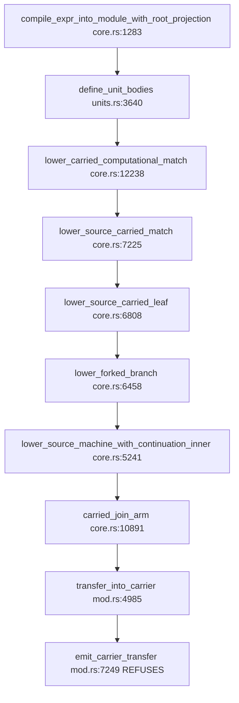

# RT-MATCH-RECURSOR-CONSUMERS — `D0`/`D1` checkpoint

**Base: `89aa15502d6f76e6d42aac1b97ea3ff5032cd889`** (`origin/main`, the merged
corrected `RT-RECURSOR-TRANSPORT` `D0`-`D2`). Branch
`wp/RT-MATCH-RECURSOR-CONSUMERS`.

**This candidate changes no code.** `git diff 89aa1550 -- crates/` is empty at
the checkpoint SHA. Every instrument below was temporary, was run, and was
reverted; nothing in `crates/` differs from the base by a single byte. That
discharges `AC-5` (no new `#[ignore]`) and `AC-6` (both residual variants, both
classifier and collector insertions, and the per-variant exclusion hook present
and unchanged) trivially rather than by inspection.

> # THE HEADLINE, BECAUSE IT IS THE THING THIS NODE EXISTS TO ESTABLISH
>
> **`d8d` is not the perimeter.** The `MatchScrutineeRecursor` population
> contains a second, previously unnamed member:
> `px8j_all_three_producer_paths_reach_real_consumers`.
>
> **And the two are one root, not two.** Their refusal backtraces are identical
> frame for frame and line for line. Neither frame hard stop fires.

## 1. `D0` — the population, closed by measurement

### 1.1 The instrument, and why it is at this seam

The production predicate has exactly **one** consumer:
`select_body_emission_authority` is called from exactly one site,
`compile_expr_into_module_with_root_projection` (`lowering/core.rs:1276`), and
both public entries (`compile_expr_into_module`,
`compile_expr_into_object_module`) delegate to it. So a census placed at that
function sees **every** compilation that can supply the predicate, and no other
path can route a program to `RecursiveDescent` behind its back.

The census recorded, for **every** compilation, the complete
`enumerate_recursive_descent_residuals` set and the lane actually selected,
keyed by the libtest thread name (which is the test's full path). **Every
compile was recorded, not only the firing ones**, so the population has a real
denominator rather than a filtered numerator.

Two instrument defects were found and fixed before the numbers below were
trusted, both by measurement rather than by review:

| defect | how it surfaced | fix |
|---|---|---|
| `writeln!` issues one syscall per format fragment, so concurrent test threads interleaved mid-record | 2 malformed rows in the first run | one `write_all` of a pre-formatted buffer |
| a compile refused by `validate_oriented_subcontinuation_transport` returns **before** the selector, so the census could not see it | suspected, then measured | a second census at function **entry**; entry minus at-selector is exactly the invisible set |

### 1.2 Denominators

| quantity | value |
|---|---|
| compilations reaching function entry | **632** |
| compilations reaching the selector | **617** |
| compilations refused before the selector | **15**, across 7 tests |
| residual set of all 15 pre-selector refusals | **`none`**, every one |
| distinct tests performing at least one compilation | **271** |
| malformed census records, final run | **0** |

**The 15 invisible compiles matter and they are empty.** Had any of them
enumerated `MatchScrutineeRecursor`, the population below would have been short
by construction and no control over it could have said so. They do not, so the
gap is closed by measurement, not by argument.

### 1.3 The measured distribution at the selector

| enumerated set | compilations |
|---|---|
| `none` | 593 |
| `{LexicalCallArgumentRecursor}` | 16 |
| `{MatchScrutineeRecursor}` | **8** |
| both variants together | **0** |

### 1.4 The `MatchScrutineeRecursor` population — `AC-1`

Eight compilations across five tests. Every one enumerates exactly
`{MatchScrutineeRecursor}`; none also carries `LexicalCallArgumentRecursor`.

| test | compiles | complete residual set | production lane, unhooked |
|---|---:|---|---|
| `d8d_the_composed_binding_site_is_live_and_neither_landed_population_installs_a_target` | 1 | `{MatchScrutineeRecursor}` | `RecursiveDescent` |
| `px8j_all_three_producer_paths_reach_real_consumers` | 1 | `{MatchScrutineeRecursor}` | `RecursiveDescent` |
| `rt_d2_exact_counts_and_the_suppression_ab` | 3 | `{MatchScrutineeRecursor}` | `RecursiveDescent` (1 of 3 unhooked) |
| `rt_d2_the_exact_position_a_witness_executes_on_both_lanes_and_agrees` | 2 | `{MatchScrutineeRecursor}` | `RecursiveDescent` (1 of 2 unhooked) |
| `rt_d2_trace_shows_the_marker_propagated_and_never_reaching_the_composed_consumer` | 1 | `{MatchScrutineeRecursor}` | via the committed hook |

**Read the last column carefully.** Several A-firing compilations select
`FunctionizedUnits` in an ordinary suite run. That is **not** production
behaviour — those tests arm the committed one-variant hook themselves. The
production, unhooked answer for every A-firing program is `RecursiveDescent`.
Crediting those hooked rows to production would be the inverse of the frame's
"do not reinterpret a retained `RecursiveDescent` run as activation," and it is
the reason the lane was recorded per compilation rather than per test.

**Three of the five are `RT-RECURSOR-TRANSPORT` `D2`'s own controls.** The
population that exists independently of `D2`'s witness is `d8d` and
`px8j_all_three_producer_paths_reach_real_consumers`.

### 1.5 Candidate selectors used, and what each missed

The frame required stating which selectors were candidates. A grep was used to
generate candidates; **none of them closed the population**, and the table
records the gap rather than implying agreement.

| candidate axis | hits | relation to the measured population |
|---|---:|---|
| CamelCase variant name `MatchScrutineeRecursor` | 23 | over-generates: matches the classifier, collector, enum and hook, none of which are programs |
| snake_case fixture spelling `match_scrutinee_recursor` | 13 | **misses `d8d` and `px8j_all_three` entirely** — neither names the class |
| the lane, `BodyEmissionAuthority::RecursiveDescent` | 17 | over-generates and still misses both |
| the enumerator / observation API | 29 | over-generates |
| the exclusion hook `set_selector_variant_exclusion` | 3 | finds only `D2`'s own controls |

**The two members that matter are invisible to every one of the five axes.**
`d8d` and `px8j_all_three` reach the class through
`px8j_deferred_recursive_field_fixture`, a helper named after neither the class
nor the lane. A grep list is a candidate set; only the enumeration is closure.

### 1.6 The bounds on this closure, stated rather than implied

1. **The census covers the `ken-runtime` lib suite.** The instrument is
   `#[cfg(test)]`, so the lib compiled as a dependency of another crate carries
   no census. `crates/ken-cli/tests/rt_parity_native.rs`,
   `px8f_buffer_native.rs` and `ken-verify`'s `px8f_write_partition.rs` are
   therefore **not** covered here.
2. **Every member of the measured population is a hand-built `RuntimeExpr`.**
   Campaign Trap 1 names this exactly: such a witness proves the classifier
   **sees** the class, and says nothing about whether any real Ken program
   exhibits it. Nothing in this checkpoint claims otherwise.
3. **The four `#[ignore]`d tests never run**, so the census cannot see them.
   Two were run under `--ignored` and compile with `none`. One
   (`b2v_ac10_...`) performs no backend compilation. The fourth,
   `c2_ac4_runtime_host_result_selects_a_separately_generated_nested_payload`,
   never reaches a compilation at all, so it was classified **by inspection
   against the exact predicate**: its `Match` scrutinees are `Var(0)`, never a
   `ComputationalMatch`, and its one `Call` has an empty argument list, so
   neither residual predicate can fire. It is not in the population.
4. **A compile-keyed census cannot see a test that calls the selector
   directly.** This is not hypothetical — see 2.4.

## 2. `D1` — activation and attribution

### 2.1 The seam

A-only exclusion, via the existing one-variant hook, used as designed: enumerate
the full set, remove exactly `MatchScrutineeRecursor`, let the remainder decide.
Both variants were never excluded together and the hook was not generalized.

### 2.2 Retained run, and the regression baseline

**`D0`'s Trap-2 obligation — the target suite on the base with no delta applied:
816 passed, 0 failed, 4 ignored.** That is the regression baseline; every row
green in it is a row `AC-1b` must keep green.

The ordinary retained run stays green at that same 816 with the census attached,
so the instrument is not itself perturbing the suite.

### 2.3 Under A-only exclusion: 810 passed, 6 failed

**Only two of the six are members of this node's repair population.** The other
four fail because the probe was applied suite-wide, which the committed hook
never is. Attributing all six would have overstated the node by a factor of
three.

| row | first refusal / assertion | class |
|---|---|---|
| `d8d_the_composed_binding_site_is_live_...` (`control.rs:18257`) | `Unsupported(UnsupportedLowering { construct: "RecursiveBackedge", reason: "protocol machinery is never a source value at a boundary" })` | **repair population** |
| `px8j_all_three_producer_paths_reach_real_consumers` (`control.rs:1482`) | **identical refusal, verbatim** | **repair population** |
| `d5_c3_a_second_residual_retains_recursive_descent` (`control.rs:12939`) | expected `RecursiveDescent`, got `FunctionizedUnits` | probe artifact |
| `retained_authority_residual_is_the_typed_selector_accounting` (`control.rs:5290`) | expected `RecursiveDescent`, got `FunctionizedUnits` | probe artifact |
| `the_body_authority_selector_narrows_only_completed_ports_and_stays_fail_closed` (`control.rs:5171`) | expected `RecursiveDescent`, got `FunctionizedUnits` | probe artifact |
| `rt_d2_exact_counts_and_the_suppression_ab` (`control.rs:11371`) | `(1,1,1)` where `(1,0,0)` expected | probe artifact |

**The four artifacts were classified by reading the code, not by their names.**
`rt_d2_exact_counts_and_the_suppression_ab:11370` runs the witness through
`rt_run` — the deliberately **unhooked** leg whose whole point is to contrast
with the hooked one. A suite-wide exclusion activates that leg too and destroys
the contrast, which is exactly the `(1,0,0)` to `(1,1,1)` shift observed. All
four pass unhooked on this tree.

### 2.4 The blind spot this exposed, which is worth more than the artifacts

`d5_c3_a_second_residual_retains_recursive_descent`,
`retained_authority_residual_is_the_typed_selector_accounting` and
`the_body_authority_selector_narrows_only_completed_ports_and_stays_fail_closed`
**never appear in the census at all**, yet they reacted to the probe.

They call `select_body_emission_authority` **directly**, without compiling. A
census placed at the compile entry is structurally incapable of seeing them.

⇒ **The selector has two populations, not one:** programs that compile through
it, and controls that call it directly. The production predicate's population is
the first — production reaches the selector only from the compile path, which is
why the closure in section 1 is the right one for a repair. But any future claim
about "everything that consults the selector" needs both, and a compile-keyed
instrument answers only half.

### 2.5 Activation denominators — the guard against a credited-but-unreached refusal

Recorded per compilation, at selection time, before lowering runs:

| row | lane under A-only exclusion | outcome |
|---|---|---|
| `d8d_...` | **`FunctionizedUnits`** | refused in lowering |
| `px8j_all_three_...` | **`FunctionizedUnits`** | refused in lowering |

Both refusals are therefore credited to a path the selector **actually reached**
and routed onto the functionized lane. Neither is an unvisited seat, and neither
is a retained `RecursiveDescent` run misread as activation.

### 2.6 Positive control

`rt_d2_the_exact_position_a_witness_executes_on_both_lanes_and_agrees` is in the
**same family** — it is in the A population, both its compilations reach
`FunctionizedUnits` under A-only exclusion — and it **passes**. So A-only
exclusion plus the functionized lane is not broken for A programs generally; the
two refusals discriminate a specific shape rather than the lane.

### 2.7 Cross-check against the sanctioned seam

The suite-wide probe is not the committed hook, so the refusal was re-measured
with the **committed** `set_selector_variant_exclusion` armed around `d8d`'s own
expression — no reconstruction, the same expression object, the mechanism the
frame names:

```
Err(Unsupported(UnsupportedLowering {
  construct: "RecursiveBackedge",
  reason: "protocol machinery is never a source value at a boundary" }))
```

Identical. The refusal is the seam's answer, not an artifact of the probe.

### 2.8 The causal chain, to the first mis-consumed static fact

Both rows produce the **same backtrace, frame for frame and line for line**:



**This is not `D2`'s seat.** `RT-RECURSOR-TRANSPORT` `D2` propagates the marker
at `resume_active_continuation`, and that function is nowhere on this path. The
`D2` mechanism is sound and is doing its job; it simply does not own this
crossing. That is precisely the completeness defect the node was filed for.

**The first mis-consumed static fact.** `carried_join_arm` (`core.rs:10842`)
classifies a join arm into three cases:

- `Carried(word)` — pass through;
- `Specialized(Lowered::Trap(_))` — **refused, explicitly and honestly**,
  because a compile-time trap arm returns instead of reaching the merge, so the
  merge would have fewer predecessors than the case chain has arms, and that
  control-flow shape "this route does not build yet";
- `Specialized(anything else)` — transfer into the carrier as a **value**.

`Lowered::RecursiveBackedge` falls into the third case. But a backedge arm has
**exactly the property the second case exists to recognise**: the tail-recursive
edge has already been emitted as a CFG jump, the block is predecessor-free, and
the arm contributes no value and no predecessor to the merge.

⇒ The mis-consumed fact is **the arm's already-left-the-block status**.
`carried_join_arm` keys on the operand's representation (`Carried` versus
`Specialized`) when the property that decides whether an arm can be a join
predecessor is *whether control already departed*. `Trap` encodes that property
and is consulted; `RecursiveBackedge` has it and is not.

**Owner: `carried_join_arm`, `lowering/core.rs:10842`**, the carried-match join
arm consumer — with the protocol's producer being the source-machine fork
(`lower_forked_branch` / `lower_source_carried_leaf`) that yielded a backedge
branch. The guard at `emit_carrier_transfer` is **correct and stays**: it is
refusing a genuine category error, and teaching it to accept the marker is the
banned shape.

### 2.9 Sizing signal for `D2`, not a `D2` decision

The `Trap` arm's own comment states the reduced-predecessor merge "is a control
flow shape this route does not build yet." A backedge arm needs that same
missing shape. ⇒ The lawful repair — represent or consume the protocol at its
owner, before the guard — may require building the reduced-predecessor merge
rather than only re-routing an operand. **This is flagged, not decided**; `D2`
is out of scope for this checkpoint.

## 3. Hard stops — neither fires

1. **Materially distinct authorities?** No. Two rows, **one** root: identical
   refusal text, identical owner, identical backtrace frame for frame. This is
   one authority with two call sites, not two symptoms mistaken for one.
2. **Does any repair need a new planner or ABI population?** Not on the evidence
   here. The mis-consumed fact is a lowering-local control-flow property of a
   join arm. No new planner record and no ABI payload is implicated by the
   trace. `D2` must re-confirm this before coding, since a repair not yet
   written cannot be fully priced.

The sibling-specific third stop does not fire either: nothing here proposes
folding with [[RT-LEXICAL-RECURSOR-CONSUMERS]], and no shared root is claimed.

## 4. Observation routed to the sibling node, not acted on

The same census measured the `LexicalCallArgumentRecursor` population at
**16 compilations across 10 tests**. The campaign record and
[[RT-LEXICAL-RECURSOR-CONSUMERS]]'s frame describe that population as *"eight
expressions across five test families."*

**That earlier figure was measured on the six named hard-stop fixtures under
B-only exclusion, and this one is measured over the whole lib suite**, so they
are not the same quantity and neither refutes the other. But the wider number is
the one a sizing decision should see. **Recorded and routed; rows 1-5 were not
touched**, per this node's banned scope.

Two tests compile programs in **both** populations
(`px8j_all_three_producer_paths_reach_real_consumers`,
`rt_d2_exact_counts_and_the_suppression_ab`). **No single compilation enumerates
both variants**, so the two repair populations remain disjoint at the unit that
matters, but a test-keyed reading of either population will double-count.

## 5. What this checkpoint does not cover

- **No `D2` work.** No repair code, no fixture reshaping, no change to the
  `RecursiveBackedge` guard, and no `#[ignore]` — `crates/` is byte-identical
  to the base.
- **Rows 1-5 and the `LexicalCallArgumentRecursor` population were not
  touched.**
- **`10369776252861e8b15e613576256a3682c70066` was not resumed, cherry-picked
  or consulted** as anything but held evidence.
- **Nothing outside the `ken-runtime` lib suite was censused** — see 1.6.1. The
  native parity suites in `ken-cli` and `ken-verify` compile real Ken programs
  and are the population most relevant to Trap 1's caveat; measuring them needs
  an instrument that survives outside `#[cfg(test)]`, which this checkpoint did
  not build.
- **CI has not run.** `AC-8` is a CI claim and no local `--workspace` run was
  performed, per `COORDINATION §12`.
