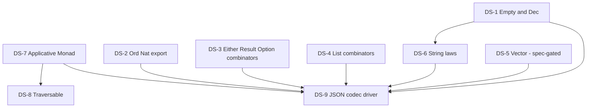

# Catalog data-structures enrichment program (Core + Data Sections)

**Owned by the Steward.** A program — a sequenced set of work packages — that
drives the catalog deliberately through its two innermost Sections: the **Core
Section** (the essential dependent-programming toolkit) and the **Data Section**
(standard datatypes and their operations), per the charter
`06-catalog-campaign.md` ("Sections and Domains"). This doc fixes the *sequence
and rationale*; each WP gets its own Steward frame + enclave boundary at kickoff
(the §2c pipeline).

**Gated behind the initial WP** (`docs/program/wp/ken-authoring-guide.md`): these
entries are authored against `catalog/guide/` + the `write-ken` skill, and their
retros feed back into it (charter → "Retro discipline"). Do not begin DS-1 until
that keystone lands.

Grounded on a gap analysis of the landed catalog (`catalog/packages/`), the
prelude (`crates/ken-elaborator/src/prelude.rs` + `numbers.rs`/`bytes.rs`/
`decimal_char.rs`), and the stdlib spec (`spec/50-stdlib/`), 2026-07-09.

## Method: demand-pull layering

The operator's principle (`06` → Sections): *the deeper Sections are clarified
by building the things that ought to sit on them.* We do not speculate an
exhaustive Core/Data Section in the abstract. Instead a concrete **driver** — a
real higher-Section target — pulls the exact toolkit lemmas and data ops it
needs, and we land those below it. Build-order is **top-informed,
bottom-proven**.

**Proposed near-term driver: a lawful JSON codec** (a future-Section exemplar).
A `Json` value type with `encode : Json -> String` / `decode : String -> Result
E Json` and a proved **round-trip law** `decode (encode j) = Ok j` is a compact
forcing function that exercises nearly all of the Data Section — `String`,
`List`, `Map`, `Either`/`Result`, and lawful equality/decidability — and is
high-value pedagogy (the round-trip law is the canonical "why proofs"
demonstration). Its unmet dependencies *are* this program's Core/Data WP list.
The driver itself lands last (Phase 3), validating the two Sections end-to-end.
The driver is revisable; if a different higher target is preferred, the
pulled-dependency set changes with it.

## Baseline — what the Core/Data Sections already have (do not rebuild)

- **Core Section landed:** propositional equality (kernel `Eq`, surfaced
  `Equal`); `subst`/`cong`/`cast`/`sym`/`trans` (`transport` package); lawful
  `Eq`/`DecEq`/`Ord` scaffolding (`lawful-classes` — `Bool` proved
  zero-`Axiom`, `Int` postulated); `Semigroup`/`Monoid`/`Functor`/`Foldable`
  (`lawful-functors` — `Bool`/`List`/`Option` proved zero-`Axiom`).
- **Data Section landed:** `Nat`, `Bool`, `Int`(+widths), `Char`, `String`,
  `List`, `Option`, `Result`, `Pair`/`Prod`, `Map`, `Set` carriers (prelude +
  `map.ken` capstone with its five inductive laws). Core ops present; see gaps
  below.

## The WP sequence

### Phase 1 — complete the Core Section toolkit

- **DS-1 · `Empty` + `Dec`.** Declare `Empty` (Type-sorted false + `absurd`) and
  `Dec P := (P) + (P -> Empty)` with `decide`, plus the bridge `DecEq a -> (x y
  : a) -> Dec (Equal x y)`. Both exist only as spec prose today
  (`spec/10-kernel/14-inductive.md:49`; `spec/20-verification/23-prover.md:150`)
  — nameable globals are MISSING. *T1-design:* the `Empty` sort and the `Dec`
  encoding (reuse the prelude `Or`-in-Ω sum vs. a fresh Type-sorted inductive)
  are enclave calls. Small, foundational, reused everywhere. **Format pilot** —
  author as the first `.ken.md` entry (campaign item 5). Home: Foundation +
  enclave.
- **DS-7 · `Applicative` + `Monad`.** Realize `spec/50-stdlib/56-effectful-
  classes.md` (no package today). Instances for `Option`, `List`, `Result`.
  *T1-design already substantially done* — the CAT-2 rulings (bind-primary,
  explicit Applicative-g dict, left-id definitional) are recorded; transcribe
  into the frame. Depends on `Functor` (landed). Home: Foundation + enclave.
- **DS-8 · `Traversable`.** `traverse`/`sequence` over `Functor`+`Foldable`+
  `Applicative`, with the naturality/identity/composition laws. Depends on DS-7.
  Home: Foundation + enclave.

### Phase 2 — complete the Data Section datatypes

- **DS-2 · export `Ord Nat` + a `Nat` operations entry.** Lift the private
  `leqNat`/`totalLeqNat`/`transLeqNat`/`antisymLeqNat`/`reflLeqNat` family out
  of `map.ken` (where it is duplicated, `map.ken` grep) into a real **exported
  lawful `Ord Nat` instance**, and collect `min`/`max`/`sub`/`compare` (today
  split across `Derived.ken`) into one entry. Removes duplication; unblocks
  reuse. Mostly mechanical (proofs exist inside `map.ken`); enclave confirms the
  lift is zero-new-`Axiom`. Home: Foundation.
- **DS-3 · `Either` + `Option`/`Result` combinators.** Resolve the `Either`
  question: spec names both `Either e a` and `Result e a` (`spec/50-stdlib/
  README.md:42`) but only `Result` is declared. *T1-design:* rule whether the
  catalog carries a distinct `Either` or `Result` subsumes it (coexist vs.
  subsume). Then lawful combinator entries: `Option` (`getOrElse`/`isSome`/
  `map`/`orElse`), `Result` (`mapErr`/`andThen`/`unwrapOr`). Pulled by the codec
  driver's error path. Home: Foundation + enclave (the Either ruling).
- **DS-4 · `List` combinator completion.** Add `reverse`/`zip`/`concatMap`/
  `range`/`foldl` with their laws (`reverse` involutive, length laws) — absent
  today (`Derived.ken` grep). Extends the existing 7-combinator floor.
  Home: Foundation.
- **DS-5 · length-indexed `Vector` (spec-gated).** `Vec n a` with total
  `head`/`index`/`zip` — the canonical dependent-types showcase, high teaching
  value. **Absent even from the spec** (no `Vector` hit anywhere).
  *Prerequisite:* a spec chapter (spec-leader/spec-author) before a package.
  Parallel spec track; the package follows the chapter. Home: Spec enclave →
  Foundation.
- **DS-6 · lawful `DecEq Char` → `Eq`/`Ord String`.** The named blocker
  (`collections/MANIFEST.md`): `String` ops ship as plain functions, not
  lawful instances, because `DecEq Char` isn't lawful — `Char =
  {c:Int|isScalar c}` and the `Int` decision is `Axiom`-postulated (Int
  opaque to δ). This is the Data Section **capstone with a real wall** (Int
  lawfulness). *T1-design spike first:* can `DecEq Char` be proved via the
  scalar refinement + a reducing Int-equality check, or does it need a
  kernel move? Depends on DS-1 (`Dec`). Enclave-led. Home: enclave spike →
  Foundation.

### Phase 3 — the driver validates the tier

- **DS-9 · lawful JSON codec.** `Json` value type + `encode`/`decode` +
  the proved round-trip law, built entirely from the Core/Data Sections
  above. Consumes DS-1..DS-6. Its clean assembly is the tier's acceptance
  test; any friction is a Finding (kernel defect → Kernel; ergonomics →
  Ergo). Home: Foundation.

## Format, cadence, and home

- **Authored as `.ken.md`** per `07-catalog-style-guide.md`. No `.ken.md` entry
  exists yet, so DS-1 is the **format pilot**; existing plain-`.ken` packages
  convert on their own refinement track (the two-phase cadence in `06`), not
  inside this program.
- **Two-phase quality cadence** (`06`): functional build (proofs real,
  trusted-base honest) may merge first; a refinement follow-on raises each entry
  to guide quality.
- **Home: Foundation**, enclave pinning each abstraction boundary at kickoff.
  Findings route per `06` (kernel-reduction defects → Kernel via enclave; sugar/
  abstraction → Ergo). The catalog author is not its own grader.
- **T1-design-needed** flagged per WP above (DS-1, DS-3, DS-5, DS-6 need real
  enclave rulings; DS-7 mostly transcribes existing CAT-2 rulings; DS-2/DS-4 are
  near-mechanical). First-of-pattern gets T1 design + review; siblings
  mechanical.

## Deferred / prerequisites (named, not forgotten)

- **`Vector` spec chapter** (DS-5) — a spec-gap, not just unimplemented; needs a
  `spec/50-stdlib/` chapter before the package.
- **Int-instance lawfulness** (DS-6) — the `Axiom`-postulated `Eq`/`DecEq`/`Ord
  Int` (and transported `Ord Char`) are the standing wall; DS-6's spike decides
  whether it's crossable in the outer ring or needs a kernel move.
- **`lawful-classes` MANIFEST drift** — its "Derivation path" frames a
  fully-proved inductive-carrier `Eq`/`Ord` as still-open, but the `Bool`
  instances landed proved; a refinement-track doc fix, folded into DS or a
  cleanup pass.
- **`Applicative`/`Monad` superclass wiring** beyond the instances (DS-7) — the
  general `where`-superclass path stays gated on the multi-param-class wall
  (CAT-3 ruling); DS-7 delivers the explicit-dict/bare-op form.
