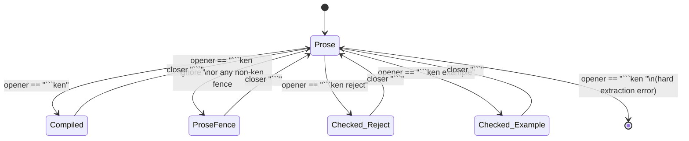

# WP `catalog-literate-fence-roles` — checked literate fence roles

- **Lineage:** Item 3 of `06-catalog-campaign.md` §"Sequenced next actions" —
  "the literate block-role taxonomy (`ken reject` checked to fail, `ken
  example` checked-not-shipped) in `crates/ken-elaborator/src/literate.rs` +
  the check path; small, per the style guide §2." Builds directly on the
  landed `.ken.md` extractor (`ken-md-literate.md`, released to Language
  2026-07-06) and its already-landed `` ```ken ignore `` prose fence.
- **Trigger:** the catalog charter's Purpose 1/3 (self-describing components,
  progressive-disclosure teaching) both want **honest negative examples** —
  "here is Ken code that does *not* typecheck, and here is why." Today a
  literate entry can only ship compiled source or unchecked prose; a negative
  example lives in prose and can rot silently (the language changes, the
  "invalid" snippet becomes valid, or vice versa, and nothing notices).
- **Owner (build):** Language team — same crate/module as the landed
  extractor, same team as `ken-md-literate`.
- **Spec elaboration:** none. This is a Markdown/tooling convention layered on
  the extractor's existing fence classifier; it adds no new Ken surface
  grammar (`30-surface/`) and no elaboration semantics for *Ken* programs —
  only for which fences the extractor hands to the elaborator, and what
  verdict it demands back. **Direct-to-Language**, matching the
  `ken-md-literate` precedent (its own frame lists no spec-pipeline step) and
  the tooling-only fast path recorded in
  `docs/program/IMPLEMENTATION-PROGRESS.md` ("Steward→build directly, no spec
  elaboration"). If implementation surfaces a genuine spec gap (unlikely —
  see §5), escalate to spec-leader rather than deciding it in code.
- **Reviewer:** Architect (elaborator-design fidelity on the fence
  state-machine and the new check path; same reviewer role as
  `ken-md-literate`'s export/hash seam). **CV** enters at the merge Decision
  gate per the standard Architect/Spec voting
  (`03-program-of-work.md` lifecycle) — flagged explicitly (§6) to weigh
  the conformance-seed treatment of `` ```ken reject `` blocks, since this WP
  is what makes negative pedagogy checkable and CV owns the conformance
  corpus's shape.
- **Size:** S. **Risk:** low — pure extraction/tooling change, zero kernel
  delta (§5).
- **Blocks:** the first reframed catalog batch (campaign item 5) needs this to
  author honest negative examples. **Blocked by:** nothing (the landed
  extractor is a stable dependency; independent of the `catalog/packages/` →
  `catalog/catalog/packages/` migration WP).

> **Perishable-state caveat.** Line numbers below are `origin/main`, the state
> read for this frame (2026-07-09); re-locate by shape (function/match-arm
> names, not exact numbers) at pickup.

## 0. Objective

Extend `.ken.md` literate extraction with **checked block roles**, so a
catalog entry's negative examples (and secondary positive-but-unshipped
examples) are elaborator-verified, not merely typed prose. Concretely: add
`` ```ken reject `` (must fail to elaborate) and `` ```ken example `` (must
elaborate, against the module, but does not tangle into it) alongside the two
roles that already exist.

## 1. Ground truth: the current extractor

`crates/ken-elaborator/src/literate.rs` today recognizes exactly two states
for a fenced block, both decided by `extract_ken_md`'s line-by-line state
machine (`FenceState`, lines 112–120):

- An opener line that is **byte-exact** `` ```ken `` (the check at line 42,
  `if line == b"```ken"`) enters `FenceState::Compiled` — its body is copied
  back into the blanked output buffer (lines 60–65) and its byte range is
  recorded in `KenMdExtraction::compiled_ranges` (struct at lines 11–15).
  This is the only role that **tangles**: `validate_ken_md_fences`
  (lines 87–93) parses each compiled range in isolation, and
  `ElabEnv::elaborate_ken_md_file` (`lib.rs:260–266`, same crate) then parses
  and fully elaborates the assembled `extraction.source`.
- **Every other fence opener** — including the already-landed
  `` ```ken ignore `` — falls through the `is_backtick_fence_line` catch-all
  (lines 47–49, 122–124: `line.starts_with(b"```")`, no info-string
  inspection at all) into `FenceState::ProseFence`. Its body is left blank in
  the output and contributes no range anywhere. `ken ignore` is not a distinct
  role to the code today; it is indistinguishable from `` ```python `` or a
  bare ` ``` ` — all three are "not compiled," full stop. This is confirmed
  by the CLI test `ken_ignore_fence_is_prose_only_for_cli`
  (`crates/ken-cli/tests/ken_md_literate_cli.rs`), which asserts the ignored
  block contributes **no declarations** (stderr: "contains no
  declarations").

So today there are exactly two effective states — **compiled** and
**ignored** — and "ignored" is really "anything the exact matcher didn't
claim." There is no role that is checked but not tangled, in either
direction (must-fail or must-succeed-but-not-ship).

## 2. Fixed design (transcribed from the campaign; do not reopen)

Two independent axes, both settled:

| Fence opener | Tangles? | Checked? | Required verdict |
| --- | :---: | :---: | --- |
| `` ```ken ``         | yes | yes (as part of module) | elaborates |
| `` ```ken ignore ``  | no  | no      | — (pure prose)           |
| `` ```ken reject ``  | no  | **yes** | elaboration **fails**    |
| `` ```ken example `` | no  | **yes** | elaboration **succeeds** |

- **Space form, not colon form** — `` ```ken reject ``, matching the landed
  `` ```ken ignore `` convention. This keeps `ken` as the fence's *first*
  info-string token, which is what GitHub/editors key syntax highlighting off
  of; a colon form (`` ```ken:reject ``) would either lose highlighting or
  require every consumer to special-case it. Not a redesign — a consistency
  requirement with what already shipped.
- `` ```ken reject `` is the **primary new capability**: it is the only way a
  catalog entry can show genuinely invalid Ken and have CI catch the day that
  code stops being invalid (a language change closes the gap it illustrated,
  a typo silently "fixes" it, etc.) — the honesty property the campaign
  charter's Purpose 1/3 need from negative pedagogy.
- `` ```ken example `` is secondary/optional: a positive snippet elaborated
  for honesty (so a reader can trust it compiles) but deliberately excluded
  from the shipped module — e.g. a longer usage walkthrough that would bloat
  the tangled library source, or a variant that intentionally shadows a name.



## 3. New decision this frame settles (flagged, not inherited)

The campaign brief fixes the role table and the space-form syntax; it does
not say what happens to a **malformed** `ken`-prefixed opener, e.g.
`` ```ken rejct `` (typo) or `` ```ken reject extra ``. Today such a line
would silently fall into `ProseFence` — exactly the same bucket as
`ken ignore` — because the classifier never inspects the info string past the
byte-exact `` ```ken `` check.

That silent fallback is the same honesty hole this WP exists to close: a
typo'd `reject` role would silently downgrade to unchecked prose, and nobody
would notice the negative example stopped being verified. **This frame
settles it: an opener line that starts with the `` ``` `` fence marker
followed by the token `ken` and then anything other than exactly nothing,
`ignore`, `reject`, or `example` is a hard extraction-time error** (same
`ElabError::ParseError` shape as the existing unterminated-fence error,
lines 71–76), not a silent `ProseFence`. An opener that does not start with
the `ken` token at all (a genuinely different fence language, or a bare
` ``` `) is unaffected and remains `ProseFence` exactly as today.

V1 stays byte-simple per the extractor's own stated design philosophy (module
doc comment, lines 3–5): the info string must be *exactly* one of the four
listed strings (single space, no extra tokens, no CommonMark attributes).
Richer info-string parsing is out of scope (§5), matching
`ken-md-literate.md`'s own "CommonMark-complete fence parsing" exclusion.

## 4. Implementation scope

All edits are in `crates/ken-elaborator/src/literate.rs` unless noted.

1. **Classifier.** Replace the two-way `line == b"```ken"` /
   `is_backtick_fence_line` dispatch (lines 42, 47–49) with a single
   `classify_fence_opener(line: &[u8]) -> FenceOpener` function that parses
   the info string as whitespace-separated tokens: `[]` after `` ``` `` is not
   `ken` at all → `OtherLanguage` (includes bare ` ``` `); `["ken"]` →
   `Source`; `["ken", "ignore"]` → `Ignore`; `["ken", "reject"]` → `Reject`;
   `["ken", "example"]` → `Example`; `["ken", ...]` (anything else) →
   `UnrecognizedRole`. Keep `is_backtick_fence_line` as the cheap first-byte
   guard, reuse it inside the classifier.
2. **`FenceState`.** Extend the enum (lines 112–120): keep `Prose`,
   `ProseFence` (now reached by both `OtherLanguage` and `Ignore` — no
   behavior change for either), keep `Compiled { opener_start, body_start }`
   (`Source` only), add `Checked { role: CheckedRole, opener_start,
   body_start }` with `CheckedRole::Reject | CheckedRole::Example`.
3. **Prose-state dispatch.** In the `FenceState::Prose` match arm, route on
   `classify_fence_opener`'s result: `Source` → `Compiled` (unchanged),
   `Ignore` / `OtherLanguage` → `ProseFence` (unchanged), `Reject` /
   `Example` → `Checked { role, .. }`, `UnrecognizedRole` → return the new
   hard error immediately (§3).
4. **Close-arm.** Extend the closing match (lines 56–65) to also close
   `Checked` states on a `` ``` `` line: push `body_start..line_start` into a
   new `reject_ranges` or `example_ranges` vector (by `role`) — **not** into
   `compiled_ranges`, and **do not** copy the body back into the blanked `out`
   buffer. Checked-but-not-tangled content must stay blank in
   `extraction.source`, exactly like `ken ignore` does today, so it can never
   accidentally ship as part of the module.
5. **`KenMdExtraction`.** Add two `pub` fields (struct at lines 11–15):
   `reject_ranges: Vec<Range<usize>>`, `example_ranges: Vec<Range<usize>>` —
   same original-file byte-offset convention as `compiled_ranges`. Their body
   text is **not** present in `extraction.source` (point 4), so the check path
   must slice the *original* `src` string by these ranges, not
   `extraction.source`.
6. **Check path — `crates/ken-elaborator/src/lib.rs`.** `literate.rs` has no
   `ElabEnv` dependency today (it only calls `crate::parser::parse_decls`) and
   should keep that separation — verdict-checking needs full elaboration, so
   it belongs beside `ElabEnv::elaborate_ken_md_file` (lines 260–266), not in
   `literate.rs`. Extend `elaborate_ken_md_file` (or add a sibling method
   called from it) so that, after the existing module elaboration
   (`expand_and_elaborate` over `extracted.source`, line 264) succeeds:
   - For each `reject_ranges` entry: slice the raw block text from the
     original `src`, and attempt to elaborate it against the now-populated
     `self` env (reuse `elaborate_file`, lines 248–252, which already does
     parse + `expand_and_elaborate`). **Success is an error** — surface a
     clear, distinct `ElabError` (e.g. an `Internal` or new `ParseError`
     variant naming the block's original byte range) reporting that a
     `ken reject` block unexpectedly elaborated (the negative example has
     gone stale). A parse or elaboration failure is the **expected, passing**
     outcome — swallow it (or log it at a diagnostic level) and move on.
   - For each `example_ranges` entry: same elaboration attempt, but
     **failure is propagated** as the ordinary `elaborate_ken_md_file` error
     (the example was supposed to typecheck and didn't).
   - V1 checks blocks **in document order against the shared, module-seeded
     env** — it does not fork/rollback env state per block. A later checked
     block can therefore observe declarations an earlier checked block
     introduced. This is a deliberate V1 simplification (§5 guardrail), not
     an oversight.
7. **No change** to `validate_ken_md_fences` (lines 87–93) or
   `KenMdExtraction::source_for_range` (lines 95–109) — both continue to
   operate on `compiled_ranges`/`source` only, i.e. `Source`-role text exactly
   as today. This keeps AC (c)/(d) (§6) mechanically true rather than merely
   tested: the existing code paths for `ken` and `ken ignore` are untouched.

## 5. Guardrails (do-not / out of scope)

- Do not touch `crates/ken-kernel` or `Cargo.lock` — this is a pure
  extraction/elaboration-driver change in `ken-elaborator`/`ken-cli`. Zero
  kernel delta; `trusted_base()` is untouched.
- Do not change `Source` (bare `` ```ken ``) or `Ignore` (`` ```ken ignore ``)
  semantics or byte offsets. Every existing `ken-md-literate` test
  (`crates/ken-elaborator/tests/ken_md_literate.rs`,
  `crates/ken-cli/tests/ken_md_literate_cli.rs`) must stay green with no
  edits.
- Do not implement general CommonMark info-string/attribute parsing — the
  four exact token sequences in §2/§3 are the whole grammar for V1.
- Do not fork or snapshot `ElabEnv` per checked block for V1 (§4.6) — that is
  a legitimate follow-on (§8) if cross-block leakage becomes a real problem in
  practice, not a blocker for this WP.
- Do not add a new CLI subcommand. `ken run <file>.ken.md` already routes
  through `elaborate_ken_md_file`; extending that one entry point is the
  minimal-diff path and is sufficient for CI to invoke (`ken run
  catalog/catalog/packages/<pkg>/<pkg>.ken.md` becomes a complete literate check:
  module elaborates, every `reject` block fails, every `example` block
  succeeds). A dedicated `ken check`/`ken build` subcommand, if wanted, is
  downstream (§8) and orthogonal to this WP.
- Do not decide the conformance-seed shape for `ken reject` — flagged to CV
  at the merge gate (§6), not settled here.

## 6. Acceptance criteria (all required)

- **AC1 — classifier generalized, exact backward compatibility preserved.**
  `` ```ken `` still compiles (`Source`/`Compiled`, byte-identical behavior to
  today); `` ```ken ignore `` still produces zero declarations
  (`Ignore`/`ProseFence`, byte-identical behavior to today). Existing focused
  tests in `ken_md_literate.rs` and `ken_md_literate_cli.rs` pass unmodified.
- **AC2 — `ken reject`, invalid body, check PASSES.** A `.ken.md` fixture with
  one valid `` ```ken `` module fence and one `` ```ken reject `` fence whose
  body fails to elaborate (e.g. references an undefined name, or a type
  error) makes `ken run` on that file **succeed overall** — the module still
  runs, and the reject block's expected failure is not surfaced as an error.
  Add a CLI test mirroring `ken_ignore_fence_is_prose_only_for_cli`'s shape.
- **AC3 — `ken reject`, stale (unexpectedly valid) body, check FAILS.** The
  same shape, but the `reject` block's body is valid Ken that *does*
  elaborate. `ken run` **fails**, and stderr names the block (its role and
  original byte range/offset) so a catalog author can find the stale
  example. This is the discriminator that proves the check is real, not
  decorative — a test that only exercises AC2 does not prove AC3.
- **AC4 — `ken example`, valid body, check PASSES and body is NOT tangled.**
  A `` ```ken example `` fence whose body elaborates successfully does not
  fail the run, and — proved by a discriminating assertion, not just
  "the run succeeded" — the example's declarations are absent from
  `extraction.compiled_ranges`/`extraction.source` (e.g. assert a name
  declared only in the `example` block is not in `elab_env.globals` after
  `elaborate_ken_md_file`, or that removing the `example` fence entirely does
  not change `extraction.source`'s content).
- **AC5 — `ken example`, invalid body, check FAILS.** Mirror of AC3 for the
  positive-checked role: an `example` block that fails to elaborate makes
  `ken run` fail, citing the block.
- **AC6 — `ken ignore` unchanged.** A regression test (or the existing
  `ken_ignore_fence_is_prose_only_for_cli`, confirmed still passing
  unmodified) proves an `ignore` block with an elaboration-breaking body is
  never checked at all — no pass/fail signal either way, exactly today's
  behavior.
- **AC7 — unrecognized `ken` role hard-errors.** A fixture with
  `` ```ken bogus `` (or any token outside the four-entry table) makes
  extraction fail with a clear, distinct error — not a silent `ProseFence`
  fallthrough. Add a focused unit test in `ken_md_literate.rs` and, if
  practical, a CLI-level test.
- **AC8 — offset/UTF-8 safety preserved.** `reject_ranges`/`example_ranges`
  entries are valid byte offsets into the original `.ken.md` source (not
  `extraction.source`), and extraction remains UTF-8-safe and byte-length-
  preserving exactly as the base extractor guarantees (`ken-md-literate.md`
  AC1/AC4) — cover with a fixture containing non-ASCII prose around a
  `reject`/`example` fence.
- **AC9 — zero kernel delta.** `crates/ken-kernel` and `Cargo.lock` diffs are
  empty; `trusted_base()` is byte-unchanged.
- **AC10 — workspace green.** `scripts/ken-cargo test --workspace` passes.

## 7. Review path

Language leader routes implementer/QA per the standard build-team pipeline
(`ken-build-leader`/`ken-build-implementer`/`ken-build-qa`). Architect reviews
the fence state-machine extension and the check-path placement (§4.6's
literate.rs/lib.rs split) for elaborator-design fidelity — the same review
role it held on `ken-md-literate`'s export/hash seam. **CV enters at the merge
Decision gate** (standard Architect/Spec voting,
`03-program-of-work.md` lifecycle) and should specifically weigh: whether
`` ```ken reject ``/`` ```ken example `` blocks belong in the conformance
corpus (e.g. a `conformance/surface/literate/` seed exercising AC2/AC3/AC5/AC7
as black-box cases) so the checked-fence-role machinery itself stays
conformance-pinned, not just unit/CLI-tested. No spec-chapter delta is
expected (§0); if CV or Architect finds one, escalate to spec-leader rather
than deciding it in this WP.

## 8. Downstream

Once this lands, the Foundation catalog-authoring overlay (campaign item 4)
and the first reframed catalog batch (item 5) can author real
`` ```ken reject ``/`` ```ken example `` blocks. Possible later follow-ons,
none required by this WP:

- per-checked-block `ElabEnv` isolation (§5), if shared-env leakage between
  checked blocks proves to be a real authoring hazard;
- a dedicated `ken check`/`ken build` CLI surface distinct from `ken run`,
  if catalog CI wants a check that does not also execute `main`;
- `ken fmt` / LSP awareness of the four fence roles (out of scope for both
  this WP and the base `ken-md-literate` WP);
- extending `07-catalog-style-guide.md` with authoring guidance for
  `reject`/`example` blocks (naming discipline to avoid the env-sharing
  collision noted in §4.6, when to use `reject` vs. `ignore`).
