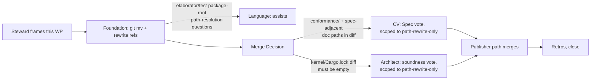

# catalog-tree-migration — move `catalog/packages/` under `catalog/`

**Owner:** Team Foundation (leader → implementer → QA); Team Language assists
on any elaborator/test package-root path-resolution surface (grounding below
shows this surface is scattered literal paths, not a single resolver — see
§3).
**Kind:** mechanical tree move + reference rewrite (Rust production src ·
Rust test fixtures · conformance seeds · docs). **No kernel change, no proof
change, no `.ken` source-content change.**
**Size:** M — wide, shallow: ~303 grep hits across ~64 files, all path-string
rewrites; zero semantic risk. **Risk:** low, with one narrow watch-item (§3,
the sole production-crate reference).
**Base:** cut `wp/catalog-tree-migration` from `origin/main` (`git rebase
origin/main` before working). Frame authored by the Steward
(`docs/program/06-catalog-campaign.md`, "Sequenced next actions" item 2);
**does not require Spec-enclave elaboration** — a pure mechanical move, like
`SURF-def-refinement`'s keyword swap, goes straight to the team. The Spec
enclave enters only at the **merge Decision gate** (diff touches
`conformance/` and `spec/`-adjacent doc paths → CV Spec vote + Architect
soundness vote, both scoped to "diff is a path rewrite, no content change").

## 1. Objective

Introduce a top-level `catalog/` directory and move `catalog/packages/` to
`catalog/catalog/packages/` verbatim (`git mv`, no internal renames), updating every
reference so `scripts/ken-cargo test --workspace` stays green throughout.
Create three light stub files that the charter's layout requires but that do
not exist today. Target layout (from `06-catalog-campaign.md` §"Layout: the
`catalog/` tree"):

```text
catalog/
  README.md            catalog index + the four purposes, one screen
  REFERENCES.md         catalog-wide reference conventions (light stub;
                        per-entry refs live in each entry per the style guide)
  catalog/packages/             light container: a README + one subdir per package
    README.md           package index / navigation (today's catalog/packages/README.md,
                        moved verbatim, content untouched by this WP)
    collections/  lawful-classes/  lawful-functors/
    parsing/  transport/  verify/   (moved verbatim, contents untouched)
```

This WP moves the tree and repoints references; it does **not** author
catalog content, does **not** touch package internals, and does **not**
implement the literate `.ken.md` format (that is `06`'s action 5, a later
WP).

## 2. Fixed inputs (pinned — settled, not for the team to relitigate)

- **Behavior-preserving.** `crates/ken-kernel/**` and `Cargo.lock` diffs must
  be **empty**. No new `Term`/`Decl` variant, no `trusted_base` change, no
  proof edits, no `Axiom`/primitive change.
- **Verbatim move.** `git mv catalog/packages/<dir> catalog/catalog/packages/<dir>` for each
  of the six package dirs (`collections`, `lawful-classes`,
  `lawful-functors`, `parsing`, `transport`, `verify`) and for
  `catalog/packages/README.md` → `catalog/catalog/packages/README.md`. No content edits
  inside any moved file except path references to sibling packages (if any
  exist — grep found none; `.ken`/`MANIFEST.md` package-internal prose
  reads by package-relative name, not by repo path).
- **Three new stub files**, each a heading + one paragraph + pointers to `06`
  and `07`; no deeper content:
  - `catalog/README.md` — the catalog index: states the four purposes
    (one line each) and points to `06-catalog-campaign.md` for the charter
    and `07-catalog-style-guide.md` for the entry format.
  - `catalog/REFERENCES.md` — states that catalog-wide reference conventions
    live here, per-entry references live in each entry (per `07`), and this
    file is a stub pending the first reframed batch (`06` action 5).
  - `catalog/catalog/packages/README.md` does **not** need to be authored fresh — it
    is today's `catalog/packages/README.md`, moved verbatim (see above). Do not
    duplicate it.
- **This is not doc-only.** It touches `crates/ken-interp/src` (a production
  crate, §3) and `crates/**/tests/*.rs` fixtures, so it goes through CI via
  the normal publisher path, not a doc-only fast lane.
- **No dynamic package-root resolver exists today** (grounded, §3) — every
  Rust reference is an independent literal relative-path string. This WP
  rewrites each site individually; it does not introduce a shared
  path-resolution helper or constant (that would be a *new* capability, out
  of scope — flag it as a Finding if the team judges it valuable, do not
  build it here).

## 3. ★ Reference-site inventory (grounded — re-grep before executing)

Snapshot taken at authoring time (`git grep -n 'catalog/packages/'`, repo root, HEAD).
**Re-run the greps below yourself before starting work** — the tree may have
moved between authoring and execution, and this table is a starting map, not
a substitute for the team's own grounding.

Total: **303** occurrences of the literal string `catalog/packages/` across the
tracked tree (`git grep -n 'catalog/packages/' | wc -l`), zero of which are in
`*.toml`, `scripts/**`, or `.github/**` (all zero — confirmed by grep; the
build/CI config has no `catalog/packages/` literal to update).

| Area | Glob | Files | Occurrences | Notes |
|---|---|---|---|---|
| Rust production src | `crates/*/src/**/*.rs` | 1 | 2 | `crates/ken-interp/src/proof_erasure_checker.rs` — **the sole load-bearing production reference**, see below |
| Rust production src (comment-only) | same | 2 | 2 | `crates/ken-elaborator/src/prelude.rs:783`, `crates/ken-elaborator/src/decimal_char.rs:210` — prose comments citing a package path; update for accuracy, not load-bearing |
| Rust test fixtures | `crates/**/tests/*.rs` | 10 | 44 | see per-file table below |
| Conformance seeds | `conformance/**` | 15 | 38 | prose citations (`` `catalog/packages/...` ``) inside seed `.md` files, plus 4 `.ken` challenge fixtures each citing one package path in a comment |
| Docs — `docs/program/` (direct) | `docs/program/*.md` | 4 | — | `03-program-of-work.md`, `06-catalog-campaign.md`, `07-catalog-style-guide.md`, `IMPLEMENTATION-PROGRESS.md` |
| Docs — `docs/program/wp/` | `docs/program/wp/*.md` | 28 | — | historical + open WP frames citing `catalog/packages/...` paths |
| Docs — `spec/` | `spec/**/*.md` | 12 | — | `30-surface/` (2), `40-runtime/` (1), `50-stdlib/` (9) |
| Docs — `agent/` | `agent/**/*.md` | 7 | — | memory notes + two playbooks (`federation/steward.md`, `spec/spec-author.md`) |
| Docs — `catalog/packages/` (moving with the tree) | `catalog/packages/**/*.md` | 5 | — | `catalog/packages/README.md` + four `MANIFEST.md` files — these move as part of the `git mv`, not a separate rewrite pass (only rewrite if a `MANIFEST.md` cites another package's repo-relative path) |
| Docs — `examples/` | `examples/**/*.md` | 3 | — | three `examples/rosetta/*/README.md` |

Markdown total: **70 files** (32 docs + 12 spec + 11 conformance + 7 agent +
5 packages + 3 examples — reconciles exactly with the charter's "~70 docs"
estimate). Occurrence counts above are file-hit counts for `.md` (a file may
cite `catalog/packages/` more than once); Rust and conformance rows give raw
occurrence counts.

**Rust test-fixture breakdown** (`git grep -c 'catalog/packages/' -- crates/**/*.rs`,
test files only):

| File | Occurrences |
|---|---|
| `crates/ken-elaborator/tests/map_build_acceptance.rs` | 7 |
| `crates/ken-elaborator/tests/cat1_lawful_functors_package.rs` | 6 |
| `crates/ken-cli/tests/rosetta.rs` | 6 |
| `crates/ken-elaborator/tests/surface_transport_acceptance.rs` | 5 |
| `crates/ken-elaborator/tests/es2_acceptance.rs` | 5 |
| `crates/ken-elaborator/tests/l3_strings_surface_acceptance.rs` | 4 |
| `crates/ken-elaborator/tests/cat3_collections_package.rs` | 4 |
| `crates/ken-elaborator/tests/es4_classes_acceptance.rs` | 3 |
| `crates/ken-elaborator/tests/cat5_parsing_package.rs` | 3 |
| `crates/ken-elaborator/tests/mutual_recursion_surface_acceptance.rs` | 1 |

All ten use one of two literal-path shapes, both rewritten by a straight
`catalog/packages/` → `catalog/catalog/packages/` string substitution inside the literal:

- `include_str!("../../../catalog/packages/<pkg>/<file>.ken")` — nine files, compile-
  time embed relative to the test file's own crate dir. **Prefix depth is
  unchanged** (`catalog/catalog/packages/` sits at the same tree depth as
  `catalog/packages/` — only the path *string* changes, not the number of `../`
  segments).
- `workspace_root().join("catalog/packages/<pkg>/<file>.ken")` — `rosetta.rs` only,
  runtime join off a `CARGO_MANIFEST_DIR`-derived helper; the helper itself
  (`fn workspace_root()`, also present verbatim in three other `ken-cli`
  test files) needs **no change** — only its two call-site literals do.

**★ The single load-bearing point:**
`crates/ken-interp/src/proof_erasure_checker.rs` (production crate, not a
test) embeds `catalog/packages/verify/proof_erasure_boundary_checker.ken` via
`include_str!` at line 15 and cites the same path in an error string at line
69. This is the **only** `catalog/packages/` reference in a crate that ships in the
built `ken` binary — every other Rust hit is test-only. Get this file right
first and confirm `cargo build -p ken-interp` succeeds before running the
full suite; a miss here fails the build, not just a test.

**No shared package-root constant/config exists to change once.** The team
searched for a `PACKAGE_ROOT` constant, a `PackageResolver`, or any
runtime/compile-time package-search-path config in `crates/*/src/**`
(production code) and found none — every Rust site above is an independent
literal string. There is nothing to repoint centrally; each of the ~13
distinct literal-path sites (2 production, 11 test-file locals) must be
edited individually. This is worth flagging as an ergonomics/maintainability
Finding (per `06`'s Findings routing) once the catalog exists, but
introducing a shared resolver is out of scope for this WP.

## 4. Mandated deliverables + acceptance criteria

1. **The move.** `git mv` each of the six package dirs and `catalog/packages/
   README.md` into `catalog/catalog/packages/`. **AC:** `git status` shows renames
   (not add+delete) for every file under the old `catalog/packages/` tree; `ls
   catalog/packages/` fails (dir gone); `catalog/catalog/packages/` matches the target
   layout in §1.
2. **Stub files.** Author `catalog/README.md` and `catalog/REFERENCES.md`
   per §2's stub spec. **AC:** both files exist, each under ~40 lines, each
   points to `06-catalog-campaign.md` and `07-catalog-style-guide.md` by
   relative path (verify the relative path resolves from `catalog/`).
3. **Production src.** Rewrite the two references in
   `crates/ken-interp/src/proof_erasure_checker.rs` (§3). **AC:** `cargo
   build -p ken-interp` succeeds; the crate's existing tests exercising this
   checker still pass; `git grep -n 'catalog/packages/' crates/ken-interp/src`
   returns nothing outside `catalog/`-prefixed strings.
4. **Rust test fixtures.** Rewrite all 44 occurrences across the ten files
   in §3's table (both `include_str!` and `workspace_root().join` shapes).
   **AC:** every touched test file compiles; `cargo test --workspace`
   (`scripts/ken-cargo test --workspace`) is green, including
   `map_build_acceptance`, `cat1_lawful_functors_package`, `rosetta`,
   `surface_transport_acceptance`, `es2_acceptance`,
   `l3_strings_surface_acceptance`, `cat3_collections_package`,
   `es4_classes_acceptance`, `cat5_parsing_package`,
   `mutual_recursion_surface_acceptance` by name.
5. **Conformance seeds.** Rewrite the 38 prose-citation occurrences across
   the 15 files in §3 (`conformance/stdlib/**`, `conformance/surface/**`,
   `conformance/challenge/**`, including the four `.ken` challenge
   fixtures). **AC:** no seed cites a `catalog/packages/`-rooted path; the seeds'
   own pass/fail status is unchanged (this is a prose-only rewrite — no
   seed's expected behavior changes).
6. **Docs.** Rewrite `catalog/packages/`-rooted path references across the 70
   markdown files enumerated in §3 (`docs/program/` incl. `wp/`, `spec/`,
   `agent/`, the four `catalog/packages/*/MANIFEST.md` files if they cross-cite, and
   `examples/`). Historical/closed WP frames under `docs/program/wp/` may be
   left as an accurate historical record **if** the WP is already closed and
   pruned per the tracker's normal branch-prune convention — use judgment;
   when in doubt, rewrite (cheap, and keeps grep-for-path reliable). **AC:**
   `git grep -rn 'catalog/packages/' -- '*.md'` returns zero hits outside
   `catalog/**` on files that are live (not historical/closed-and-pruned) WP
   text.
7. **Global no-regression AC.** `scripts/ken-cargo test --workspace` green.
   `git diff origin/main -- crates/ken-kernel Cargo.lock` is **empty**. `git
   grep -n 'catalog/packages/' | grep -v '^catalog/'` returns **zero** hits (the
   final sweep — run this last, after 1–6, as the closing gate). The tree
   under `catalog/` matches §1's target layout exactly (`find catalog -type
   d` diffed against the target).

## 5. Do-not-reopen guardrails

- Do **not** author real content into `catalog/README.md`,
  `catalog/REFERENCES.md`, or `catalog/catalog/packages/README.md` beyond the stub
  spec in §2 — deep content is `06`'s action 5 (the first reframed catalog
  batch), a separate, later WP.
- Do **not** rename, restructure, or edit the contents of any individual
  package (`collections/`, `lawful-classes/`, `lawful-functors/`,
  `parsing/`, `transport/`, `verify/`) beyond the path-reference rewrites
  this WP requires. The `.ken` sources, `MANIFEST.md` proof/derivation
  fields, and package-internal structure are untouched.
- Do **not** introduce a shared package-root constant, environment variable,
  or resolver function as part of this WP, even though §3 shows the current
  scheme is scattered literals — that is a *new capability* and belongs in
  its own WP (or a Foundation Finding) if the team judges it worthwhile.
  Land the mechanical move first.
- Do **not** touch `crates/ken-kernel/**` or `Cargo.lock`. If any rewrite
  appears to require a kernel-crate edit, **stop and escalate to the
  Steward** — that means this isn't the behavior-preserving move it's framed
  as.
- Do **not** re-litigate the target layout (§1) — it is fixed by
  `06-catalog-campaign.md`'s charter. If the tree shape looks wrong once
  you're in it, escalate; don't improvise a different shape.

## 6. Sequencing



Steward frames (this doc) → **Team Foundation executes directly** (leader →
implementer → QA on `wp/catalog-tree-migration`), pulling in Team Language
only if an elaborator/test path-resolution question comes up (§3 found none
expected — the move is string-literal rewrites, not resolver logic) → merge
Decision pulls **CV (Spec vote, scoped to confirming the diff is a path
rewrite with no content/behavior change)** and **Architect (soundness vote,
scoped to confirming the kernel/Cargo.lock diff is empty)** → publisher path
merges → retros → close. No Spec-enclave elaboration step.
