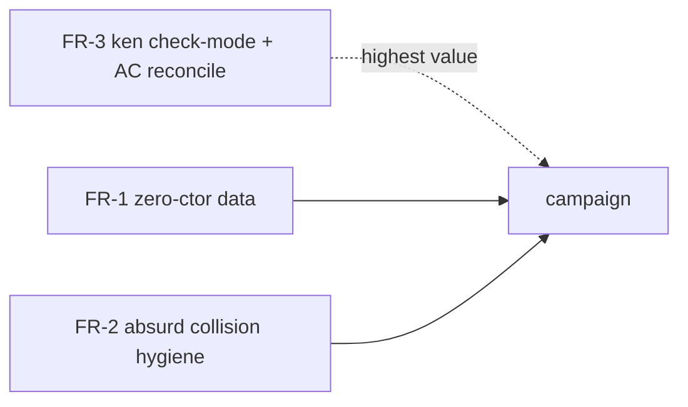

# WP program — DS-1 findings remediation (surface + tooling → Ergo)

**Owned by the Steward** (frame); **home: Ergo** (elaborator/surface/`ken-cli`
ergonomics). These are the **acted-on retro** from DS-1 (`Empty`+`Dec`, the
`.ken.md` format pilot) — the catalog's Retro discipline
(`06-catalog-campaign.md` → "Retro discipline") requires a catalog WP's findings
to be *filed and routed*, not just logged. DS-1's build surfaced four findings;
one (the smoke test) was a positive result, three are real gaps captured here.

**None block DS-1.** DS-1 ships with sound, zero-new-trust-category workarounds
(`Empty` via `data::elab_data_decl` called directly like `Bool`; the eliminator
named `absurdEmpty`; fences checked via `elaborate_ken_md_file`). These WPs
remove the workarounds' *cause* so later catalog entries don't inherit them.
**FR-3 is the highest-value** — it bears on *every* pure-library catalog entry.

**Kick status:** created and queued; **not yet assigned.** Per the operator's
DS-1 process-review hold, the actual kickoffs wait for the review — this doc
makes them ready to route.

Grounding: all three sites verified against landed code
(`origin/main`-adjacent), not just the report.

## FR-1 · Zero-constructor `data` has no surface spelling

**Finding.** The surface parser cannot express an empty type. Both
`parse_data_decl` and `parse_explicit_data_decl`
(`crates/ken-elaborator/src/parser.rs:886`/`:944`) require ≥1 constructor —
`parse_explicit_data_decl` hard-errors *"explicit data block requires at least
one constructor"* (`parser.rs:956`). So the DS-1 brief's pinned literal spelling
`data Empty : Type0 =` does **not** parse; `Empty` had to be bootstrapped via
`data::elab_data_decl` called directly (the identical kernel-admission path
`ElabEnv::empty()` uses to bootstrap `Bool` — no new trust category, but it
bypasses the ordinary source-text `elaborate_decl` path every other prelude
`data` uses).

**Remediation.** Accept a zero-constructor `data` declaration at the surface —
`data Empty : Type0 = ` (or `data Empty : Type0 where { }`) — lowering to the
same `elab_data_decl` admission the bootstrap already uses. The kernel already
admits zero-constructor inductives (that is *how* `Empty` landed); this is a
pure **parser/surface** gap, no kernel or trust change.

**Scope/urgency.** Small, low-urgency (an empty `data` is rare), but real: it is
the one place DS-1's pinned design could not be authored as written. Confirm the
`absurd`/empty-`match` eliminator story still elaborates over a surface-declared
`Empty` (it should — same admission).

## FR-2 · Reserved sugar `absurd` silently shadows a user global

**Finding — a naming/hygiene hazard, not a sugar gap.** `absurd` is checked-mode
surface sugar keyed on the **bare identifier**: `elab.rs:499` intercepts every
`RApp` whose head is `RCon("absurd")` and lowers it to `Term::Absurd`
(Ω-classified `Bottom`-elimination, `16 §1.4`). Declaring a real global named
`absurd` does **not** error — but the sugar unconditionally intercepts every
syntactic `absurd x`, so the user-declared `absurd` becomes **permanently
unreachable** via ordinary call syntax. Confirmed empirically (a probe declaring
`fn absurd …` then re-using the old `absurd h : Bottom` shape still elaborated
against the new declaration's unrelated signature, no error). DS-1 sidesteps it
by naming its `Empty` eliminator `absurdEmpty`.

**Remediation — DECIDED (Architect ruling, arity-indexed; `evt_4p5a2xkqemnge`).**
Build **(1) + (2)**; **decline (3)**. The reserved sugar identifiers do **not**
all intercept the same way, and the declaration-time guard's correct domain is
only the **total-/canonical-steal** names — grouping the arity-gated names with
the bare-`RCon` ones (the original pin's error) would reject a landed,
spec-grounded catalog class.

- **`Refl` (`elab.rs:462`), `Axiom` (`elab.rs:482`)** — bare `RCon`, **total
  intercept**: any syntactic occurrence is stolen, so a declared global of that
  name is *wholly* unreachable. A hard error on declaration is exactly right and
  complete.
- **`absurd` (`elab.rs:499`)** — `RApp(RCon("absurd"), _)`, **arity-1**: the
  canonical (and only meaningful) use of a value so named; the *originating*
  FR-2 footgun (DS-1's `absurdEmpty` rename). No landed coexistence. Guard it.
- **`J` (`elab.rs:1354`), `Eq` (`elab.rs:410` type-level / `1364` expr-level)** —
  `peel_named_app(_, name, 3)`, **arity-3 only, gated *by design* to coexist**
  with a lower-arity type-former/class of the same name. Landed `class Eq a`
  (arity-1, `spec/50-stdlib/51-lawful-classes.md §2.1`; DecEq / lawful functors /
  `map.ken` / `EmptyDec.ken.md` all build on it) coexists with the arity-3
  equality sugar — the elaborator's arity gate already routes `Eq a`→class,
  `Eq A a b`→sugar. A declaration-time name reject is the categorically wrong
  tool here; a reference-site "arity-3 sugar fires AND a global `Eq` is in scope"
  check would be *catastrophic* (it breaks every legitimate `Eq A a b` use in any
  file that also imports `class Eq`). **Not guarded.**

So the shared **`RESERVED_SUGAR` = {`Refl`, `Axiom`, `absurd`}** (the
`resolve_decl` hard-error set). `Cast`/`Ascript` are `[K2]` keyword-reserved at a
different layer with no `RCon` interception arm; `tt` has no `name == "tt"` arm —
none belong in the guard.

1. **Doc note** (`elab.rs` at the sugar arms + the surface reference) stating the
   *actual* reservation: {`Refl`, `Axiom`, `absurd`} are reserved names
   (declaring one is a resolve-time hard error); arity-3 `Eq`/`J` **applications**
   are the kernel equality/`J` sugar (reserved at that arity), while a
   lower-arity type-former/class named `Eq`/`J` coexists.
2. **Collision diagnostic — a resolve-time HARD ERROR** in `resolve_decl`
   (`resolve.rs`, the single decl-kind-uniform funnel), guarding the produced
   decl's name **and** data-constructor names (a `data … = Refl | …` ctor
   collides identically), reading the one shared `RESERVED_SUGAR` const that the
   sugar-guard arms and the collision check both consume so they cannot drift.
3. **Defer-to-global — DECLINED.** History-sensitive; inverts the trust posture.

**Residual (deferred, out of FR-2 scope).** A user `def Eq (A B C : Type)` at
arity-3 would be shadowed by the equality sugar — an inherent, *documented*
reservation of the arity-3 `Eq`/`J` application form, not a silent bug FR-2 must
close (closing it risks the coexistence lawful classes depend on). If ever
wanted, the sound detector is a **declaration-arity** check (reject a type-former
named `Eq`/`J` whose *own* arity is exactly 3), never a reference-site scope
check.

**Safe:** the Architect grep-confirmed none of {`Refl`, `Axiom`, `absurd`} is a
prelude global, so the hard error cannot break the bootstrap. **Zero
kernel/trust delta** — a pure outer-ring resolver completeness restriction,
fail-closed.

## FR-3 · `ken run` has no library check-mode (highest value)

**Finding.** `ken run` unconditionally executes the file's **last** declaration
as an IO tree (`crates/ken-cli/src/main.rs:30` `run_file`; the failure is
*"ken run: last definition is not an IO tree"*, `main.rs:188`). That is correct
for a runnable program (`examples/rosetta/*`), but a **pure-library** catalog
entry has no natural IO `main`, so `ken run` fails *post-elaboration* even when
every `` ```ken ``/`` ```ken example ``/`` ```ken reject `` fence checks. DS-1
verified its fences via `ElabEnv::elaborate_ken_md_file` directly (the identical
fence-checking `ken run` calls *before* its separate IO-execution step;
`crates/ken-elaborator/tests/ds1_empty_dec_acceptance.rs`).

**Why this is the important one.** *Most* catalog entries are pure libraries.
The standard-entry AC (`ken run` exits 0) and the guide's AC1 are therefore
mis-stated for library entries — the check they *mean* is "elaborate + all
fences behave," not "execute an IO `main`." Every future entry inherits DS-1's
workaround until this is fixed.

**Remediation.**
- **`ken-cli`:** add a **check-only mode** (e.g. `ken check <file.ken.md>` or
  `ken run --check`) that elaborates and verifies fences and, when the last
  declaration is not IO-shaped, **skips IO-execution and exits 0** instead of
  erroring. Reuses the existing `elaborate_ken_md_file` path — no new checking
  logic, just the mode gate.
- **Companion (Steward/Librarian, gated on the above):** reconcile the catalog
  standard-entry AC and the guide's AC to invoke the check-mode for library
  entries, not `ken run`. (Also reconcile the keystone guide's own
  "`ken run` exits 0 on all three strands" claim — the strands are pure-library
  docs, so the check-mode is the honest invocation there too.)

**Scope/urgency.** Small `ken-cli` change, **high leverage** — unblocks clean,
uniform validation of every library catalog entry. Prioritize this one.

## Sequencing



Independent; no ordering constraint. Recommended priority: **FR-3 → FR-1 →
FR-2.** All route to **Ergo**; FR-2 level-(2)/(3) and any FR-3 AC-contract change
take an enclave design pin before build. Each closes when its fix lands with the
usual gate (Architect soundness where the elaborator/kernel boundary is touched;
publisher path to the Steward). Filing these **closes DS-1's retro-action
obligation**.
