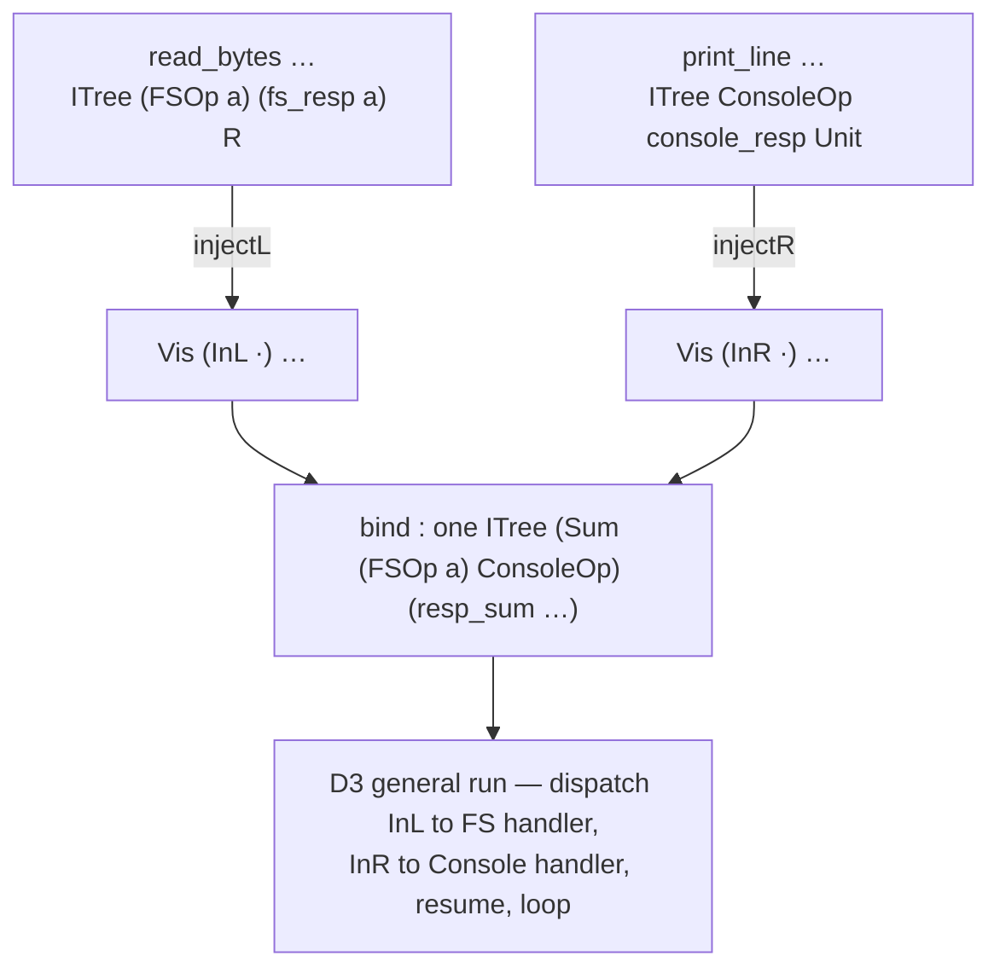

# effect-composition — execute a program that composes two base effects

**Steward frame → spec enclave (elaborate the design) → build.** The capability
VAL2 surfaced and that `fs-read-file-lines-flip` had to route around: today a
Ken program **cannot compose two distinct base effects in one computation** —
`main` can read via `[FS]` **or** print via `[Console]`, but not both, because
`Vis` forces a single concrete op-family per typed tree and the top-level driver
`run_io` has no coproduct dispatch. `read-file-lines` closed 16/0 via **Option
3** (pure-FS `main` returning its lines, CLI prints them) with a documented
honesty asterisk: *it demonstrates FS-read + pure-parse, not effect
composition.* **This WP builds the real capability and retires that asterisk.**

Owner: **Runtime** builds (the effect substrate lives in
`crates/ken-elaborator/src/effects/` + `crates/ken-interp`; Runtime built FS +
the `run_io` driver + owns the State-effect machinery this generalizes). Design
front-loaded to the **enclave** — **Architect owns the core** (he sized this
capability, `evt_2aj8ybb5b44pf`); spec-author + conformance-validator assist on
surface + conformance. Gate: enclave elaboration → merge → Runtime build →
Architect soundness + Runtime-QA + Verify-QA + CI. Findings → **Steward**.

## Why this is a real capability, not a rosetta fix (Architect sizing)

Grounded by the Architect at the flip's D4 escalation (`evt_2aj8ybb5b44pf`):
building+running a `Sum ConsoleOp (FSOp a)` tree needs **three pieces that do
not exist today**. The general `Sum a b = InL a | InR b` coproduct and
`InL`/`InR` **already exist** and are effect-agnostic (`state.rs:206`
`declare_sum`) — so the gap is not the coproduct type; it is everything that
makes a coproduct of effects *constructible at the surface* and *executable at
the top level*:

1. **A general coproduct response family.** `resp_sum` is hardcoded to `Sum
   (StateOp s) f` with State pinned as the first summand (`state.rs:245`
   `declare_resp_sum`). Composing two *arbitrary* base effects needs a response
   combinator for `Sum g h` given each summand's response family — not a
   State-first special case.
2. **Surface injection / lift into the `Sum`.** `read_bytes` / `print_line`
   produce **un-wrapped** `ITree (FSOp a) …` / `ITree ConsoleOp …`; there is
   **no `inject`/`lift` morphism** into a coproduct tree (the State path
   hand-bakes `InL` directly into `get`/`put`). Without a lift, two effects
   cannot be sequenced in one tree at all.
3. **A coproduct-aware top-level interpreter.** `run_io` matches **raw** op tags
   (`Write`/`ReadFile`) with zero `Sum` awareness; `run_state` (the only
   `Sum`-fold) interprets State and passes the *other* summand through
   **un-run**. **No path executes two base effects at the top level.** This WP
   builds one.

The landed **State-effect machinery**
(`crates/ken-elaborator/src/effects/state.rs` — `declare_sum` /
`declare_resp_sum` / `declare_run_state` / `get` / `put`) is the
**template/pattern** to generalize — **not to copy**. Line numbers perishable;
verify against the landed code at pickup.

## Objective + the load-bearing property (frame by acceptance, not mechanism)

**Objective.** A Ken program can **express and execute** a computation that
performs two distinct base effects (concretely: read a file via `[FS]` *and*
print via `[Console]` in one `main`), producing correct observable output — with
the composition **general**, not a one-off `Sum ConsoleOp (FSOp a)`
special-case.

**The generality property (load-bearing — this is *why* the flip deferred the
bolt-on).** The whole reason Option 1 was not bolted into the flip is
**subsume-don't-proliferate**: a hand-built `Sum ConsoleOp (FSOp a)` dispatcher
to print three lines is the extend-with-a-special-case anti-pattern. This WP
must deliver the **general** mechanism — demonstrated by **either** (a) a
parametric combinator that composes *any* two base effects given their pieces,
**or** (b) at least **two distinct effect pairings** running through the same
machinery — so the acceptance proves generality, not a second special case.

## Settled inputs / locked — DO NOT REOPEN

- **Kernel / `trusted_base` untouched.** The whole delta is outer-ring — the
  effect prelude (`ken-elaborator/src/effects/`) + `ken-interp` — mirroring how
  FS and State stayed kernel-clean. **Zero `ken-kernel/` diff, no new
  `Term`/`Decl` variant, `trusted_base` delta zero** (grep-verified, not a
  test). Hand-built inductives via `declare_inductive` (as FS/ITree/`Sum`
  already are, because surface `data` hardcodes params to `Type0`) are fine —
  that is outer-ring elaborator work, not a kernel change. **If any step seems
  to need a kernel/`Term`/`Decl` change → STOP, route to Steward.**
- **Totality preserved.** Composing effects must not open a non-termination or a
  partiality hole; the composed program stays total, and the interpreter's fold
  is structural. (A general `run` over a coproduct tree is the stress case — the
  enclave must show it terminates.)
- **Do not break State or FS.** The State-effect machinery and the FS driver +
  their conformance/tests stay green. Generalizing `resp_sum`/the interpreter
  must **subsume** State (State becomes an instance of the general mechanism, or
  coexists unbroken) — not fork it. `cargo test --workspace` green.
- **The concrete first consumer is FS + Console.** The acceptance re-authors
  `read-file-lines` (or adds a dedicated example) to **genuinely compose** an FS
  read with a Console print — retiring the Option-3 honesty asterisk.
- **Reflect the effect-row model, don't invent a parallel one.** The surface
  already declares effect **rows** (`[FS, Console]`); the gap is executing a
  composed row. The enclave grounds whether `/spec` already specifies effect-row
  composition (e.g. `62`/the effects chapters) and builds the driver + surface
  to **reflect** that spec — not a bespoke composition calculus. If the spec is
  silent or forks, route to Steward → operator.

## Mandated deliverable outline (each item → a concrete choice)

The enclave elaborates the **how**; this frame fixes **what each piece must
achieve**. Illustrative names are tagged *decide against the landed system.*

### D1 — General coproduct response family
Generalize `resp_sum` from `Sum (StateOp s) f` to a response combinator over
`Sum g h` given each summand's response family (`resp_g`, `resp_h`). Pin its
signature + that it is total/structural. State's `resp_sum` becomes an instance
(or is subsumed).

### D2 — Surface injection / lift into a coproduct effect
The morphism(s) that lift a single-effect computation (`ITree g rg a`) into a
coproduct tree (`ITree (Sum g h) (resp_sum…) a`) — the missing `inject`/`lift`.
Decide the surface form: **how does a program author write a computation that
performs both effects?** (a lift/`inject` applied to each op; a combined-effect
`view`; an effect-row-directed elaboration). This is the
**surface-expressibility** crux — if it needs new surface syntax that itself
forks the design, **route to Steward → operator** (do not invent surface
language unilaterally). Ground whether surface `data`'s `Type0`-param limit
forces hand-built inductives here (as it did for FS).

### D3 — Coproduct-aware top-level interpreter
A `run_io` (or a new top-level `run`) that **executes both base effects** in a
`Sum g h` tree — dispatching `InL`/`InR` to each effect's real handler, resuming
the continuation, looping — rather than folding one and passing the other
un-run. Fail-closed on any degenerate shape. Show it terminates (totality
stress).

### D4 — The composed example(s) + generality demonstration
Re-author `read-file-lines` (or a dedicated example) to genuinely compose
FS-read + Console-print through D1–D3; update its `expected` oracle; **retire /
rewrite the honesty asterisk** in its README. Plus the generality witness (AC3):
a second effect pairing **or** the parametric-combinator demonstration.

### D5 — Conformance / acceptance plan (CV)
The e2e that drives a **real composed program** end-to-end (no hand-fed
coproduct trees at the interpreter — the anti-pattern guard,
[[conformance-hand-feeds-the-deliverable]]); the generality discriminator; the
State-and-FS no-regression face; the totality face.

## Acceptance criteria (testable)

- **AC1 — kernel untouched.** `git diff origin/main -- crates/ken-kernel/`
  empty; no new `Term`/`Decl`; `trusted_base` delta zero. **Grep-verified.**
- **AC2 — composed program runs.** A program performing FS-read **and**
  Console-print in one computation elaborates and executes, producing the
  correct observable output (a byte-exact oracle).
- **AC3 — generality (subsume-don't-proliferate).** Not a one-off `Sum ConsoleOp
  (FSOp a)` special-case: **either** a parametric combinator composing any two
  base effects, **or** ≥2 distinct effect pairings through the same machinery.
  Verified structurally, not by a single example.
- **AC4 — totality preserved.** The composed program is total; the interpreter's
  coproduct fold terminates (the recursive/continuation case stressed).
- **AC5 — State + FS subsumed/unbroken.** State-effect + FS driver + their tests
  stay green; State is an instance of (or coexists with) the general mechanism.
  `cargo test --workspace` green.
- **AC6 — honesty asterisk retired.** `read-file-lines` (or the dedicated
  example) genuinely composes; its README no longer defers Console-composition
  as a gap (or the deferral is rewritten to what actually remains).
- **AC7 — no hand-fed coproduct.** The e2e drives a real composed surface
  program; no test hand-constructs the `Sum`/`InL`/`InR` tree at the interpreter
  to stand in for the surface flow ([[conformance-hand-feeds-the-deliverable]]).

## Guardrails — do not reopen

1. **Kernel untouched** (AC1). Seems-to-need-kernel ⇒ STOP → Steward.
2. **General, not a special-case** (AC3) — the reason the flip deferred this.
3. **Subsume State/FS, don't fork** (AC5).
4. **Reflect the spec's effect-row model** — if surface syntax forks the design,
   route to Steward → operator; don't invent surface language in the build.
5. **Totality is non-negotiable** (AC4).

## Sequencing (§2c)

1. **Steward authors this frame** (done) on `wp/effect-composition` (off
   `origin/main@43e97d02`).
2. **Enclave elaboration** — ⛔ handoff gate first (compact-verify the enclave
   **unconditionally**). Mention **spec-leader**; **Architect owns the core
   design** (D1–D3 soundness + the coproduct/interpreter mechanism), spec-author
   the surface form (D2), conformance-validator D5. If D2's
   surface-expressibility forks the design (new surface syntax) → **route back
   to Steward → operator.**
3. **Elaborated spec merges to `main`** (spec-leader → Integrator).
4. **Runtime build** — ⛔ handoff gate first (compact the team, unconditional).
   Kick off leader-only. One branch, one merge Decision. Gate: Architect
   soundness + Runtime-QA + Verify-QA + CI.

## Size / risk

**L** (Architect: operator-scope-worthy new capability). Three coupled pieces
(response combinator + injection/lift + coproduct interpreter) plus a
surface-form decision (D2) that could itself fork. Design-heavy → front-loaded
to the enclave. Contained by: kernel-clean by construction (outer-ring, like
FS/State), a landed template to generalize (`state.rs`), and a concrete first
consumer (FS+Console). **This retires VAL2 16/0's one honesty asterisk — Ken
programs that compose effects become expressible and runnable.**

## Enclave elaboration — D2 (surface injection / lift)

> Author: **spec-author**. Grounded against the landed effect substrate
> (`origin/main@43e97d02`: `effects/state.rs`, `prelude.rs`) and the
> **normative** effect-row model (`spec/30-surface/36-effects.md` §2.3, §2.4,
> §4.5) — the morphism below is **already in the spec** (§2.4 `incl`); D2 gives
> its landed realization + the surface decision. **No new surface syntax → the
> frame's STOP condition is *not* triggered** (§D2.3). Couplings flagged to
> **Architect** (D1↔D2, D2↔D3) in §D2.6.

### D2.0 Grounding — what the landed system has, and the exact gap

The lifted interaction tree is **shared and effect-generic** —
`prelude.rs` registers `effects::state::declare_itree`'s 3-parameter
`ITree (E : Type) (Resp : E -> Type) (R : Type)` as the *one* `ITree`, so FS,
Console, and State all denote over it, differing **only** in the `E`/`Resp`
arguments (`36 §2.1`, §4.5.6). That is what makes composition *type-possible*.

But the two base effects we must compose produce **bare, single-effect** trees —
neither is injected into a coproduct (verified in `prelude.rs`):

```
print_line s  =  Vis ConsoleOp console_resp Unit (Write s) (\_. Ret … MkUnit)
              :  ITree ConsoleOp  console_resp        Unit        -- E = ConsoleOp
read_bytes a cap path
              =  Vis (FSOp a) (fs_resp a) … (ReadFile cap path) (\r. Ret … r)
              :  ITree (FSOp a) (fs_resp a) (Result IOError Bytes) -- E = FSOp a
```

They live over **different** `E`, so `bind` cannot sequence them: `bind` is
homogeneous in `(E, Resp)` (`ITree e resp a -> (a -> ITree e resp b) -> ITree e
resp b`, `state.rs::declare_bind`). To sequence FS-read then Console-print in
**one** tree, both must first be **re-tagged** into the shared signature
`Sum (FSOp a) ConsoleOp` — and **no such re-tagging morphism exists** (grep of
`ken-elaborator`/`ken-interp` for `inject`/`lift`/`incl`: none). The *only*
`Sum`-tagging in the tree today is `get`/`put` **hand-baking `InL`** directly
(`state.rs::declare_get`/`declare_put`: `Vis (InL Get) …`), with State pinned as
the left summand. **D2 supplies the general morphism that hand-baking is a
special case of.**

### D2.1 The morphism — `injectL` / `injectR` (the spec's §2.4 `incl`)

Two **general** (effect-agnostic) tree re-taggings, parametric in both summands
and their response families — the two inclusions `g ↪ Sum g h` and
`h ↪ Sum g h` of `36 §2.3`'s `⊕`, realized as the `elim_ITree` map `36 §2.4`
already names `incl_{ρ_g ↪ ρ}` ("*itself an `elim_ITree` map over the `Vis`
tags — pure*"). Signatures (illustrative names — *decide against the landed
system*; denotation is normative):

```
injectL : (g h : Type) -> (rg : g -> Type) -> (rh : h -> Type) -> (a : Type)
        -> ITree g rg a
        -> ITree (Sum g h) (resp_sum g h rg rh) a

injectR : (g h : Type) -> (rg : g -> Type) -> (rh : h -> Type) -> (a : Type)
        -> ITree h rh a
        -> ITree (Sum g h) (resp_sum g h rg rh) a
```

Denotation — a structural `elim_ITree` fold that rewrites every `Vis` tag
through `InL` (resp. `InR`) and leaves `Ret` leaves and the branching shape
untouched:

```
injectL g h rg rh a t =
  elim_ITree                                             -- fold on t : ITree g rg a
    (M _ = ITree (Sum g h) (resp_sum g h rg rh) a)       -- constant motive → SMALL elim
    (\ (x : a).                             Ret  … x)    -- Ret leaf ↦ Ret leaf (re-typed)
    (\ (op : g) (k  : rg op -> ITree g rg a)             -- Δ_k : Vis's own continuation
                (ih : rg op -> ITree (Sum g h) (resp_sum g h rg rh) a).
       Vis … (InL g h op) ih)                            -- Vis op k ↦ Vis (InL op) (fold∘k)
    t
```

- `injectR` is the exact mirror: scrutinee `ITree h rh a`, tag `InR g h op`.
- **`ih` is the kernel-supplied W-style induction hypothesis** — it already *is*
  `injectL … ∘ k` at the sub-tree (`state.rs::declare_bind`'s "`ih r` ≡ the fold
  on `k r`" pattern); there is **no self-recursive `Const`**, so no SCT
  interaction, total by structural descent (`14 §3`). The `Δ_k` binder (`k`,
  Vis's own continuation) must still be bound though unused — omitting it shifts
  every de Bruijn index (the exact completeness bug `state.rs::declare_bind`'s
  comment documents).
- **The motive is constant** (the target `ITree` type does not depend on the
  scrutinee) → an ordinary **small** elimination like `bind`'s, *not* the
  large-elim motives `resp_state`/`resp_sum` use.

### D2.2 Well-typedness — the response-reconciliation (D1↔D2 contract)

`Vis (InL op) ih` demands `ih : resp_sum g h rg rh (InL op) -> ITree (Sum g h)
(resp_sum …) a`. The kernel supplies `ih : rg op -> ITree (Sum g h) (resp_sum
…) a`. These agree **iff**

```
resp_sum g h rg rh (InL o)  ≡  rg o          (definitionally, by ι)
resp_sum g h rg rh (InR o)  ≡  rh o
```

so the injection is well-typed **exactly when D1's general `resp_sum` reduces to
the injected summand's own response** on each tag. The landed **State-first**
`resp_sum` already has this shape — its `InL` method is `\a. resp_state s a`
(the left summand's response) and its `InR` method is `\o. RespF o`
(`state.rs::declare_resp_sum`); the **generalization must preserve it**,
replacing the `resp_state`-specialization with the abstract `rg` and the
`RespF`-parameter with `rh`. **This is the load-bearing D1↔D2 coupling: if D1
picks a `resp_sum` that wraps or reorders the response instead of reducing to
`rg o`/`rh o`, `injectL`/`injectR` do not type-check.** (Flagged to Architect,
§D2.6.)

### D2.3 Surface form — the decision, and why STOP is *not* triggered

**How does a program author write a computation that performs both effects?**
The frame's three candidates:

| | surface form | verdict |
|---|---|---|
| (a) | explicit named `injectL`/`injectR` applied per single-effect sub-computation, sequenced with `bind` | **chosen — the direct / monadic door** |
| (b) | a combined-effect `view` | subsumed by (c) |
| (c) | effect-row-directed elaboration: author writes ordinary calls under `visits [FS, Console]`, the elaborator inserts `incl` per `36 §2.4` | **eventual sugar — deferred** |

**Decision: (a).** `injectL`/`injectR` are exposed as **first-class named
operations**, and the author sequences injected sub-computations with the
existing `bind`. This is **exactly parallel to `36 §4.5`** exposing
`get`/`put`/`runState` as named ops — the *direct/monadic door* that is the
**floor** under the full row-directed model (as C1 explicit state-threading is
the floor under `[State s]`, §4.5.6). It introduces **no new denotation**: it is
`36 §2.3`'s `inj` / §2.4's `incl` made program-callable, the same move §4.5 made
for the State handler.

**STOP condition — NOT triggered, and precisely why.** The frame mandates: *if
D2 needs new surface syntax that itself forks the design, route to Steward →
operator.* Form (a) adds **no grammar, no keyword, no notation** — `injectL c`,
`injectR c`, `bind` are **ordinary function applications**, identical in surface
shape to the already-landed `get`/`put`/`bind`/`read_bytes`/`print_line`. The
injection morphism is *already normative* (§2.4 `incl`); D2 exposes landed
machinery, it does not invent surface language. Therefore the surface-form
decision is **in-bounds for the enclave to settle** (the STOP is scoped to a
*forking new syntax*, which this is not) and I settle it here rather than
routing. **Form (c)** — the elaborator auto-inserting `incl` from a `visits`
row — is the whole §1–§2.4 row-inference→denotation pipeline, which is **not
landed** (the substrate today is named ops + `bind`, the direct door); it is
named here as the deferred sugar, the honest floor, **not** in D2's scope.

### D2.4 Worked composed program (AC2 / AC7)

A `main` that genuinely composes an FS read with a Console print — the tree is
built **by the surface program** via `injectL`/`injectR`, so nothing hand-feeds
`Sum`/`InL`/`InR` at the interpreter (AC7):

```
-- path : Bytes (the file to read), render : Result IOError Bytes -> String
main : (cap : Cap APartial)
     -> ITree (Sum (FSOp APartial) ConsoleOp)
              (resp_sum (FSOp APartial) ConsoleOp (fs_resp APartial) console_resp)
              Unit
main cap =
  bind …                                          -- sequence in the composed tree
    (injectL … (read_bytes APartial cap path))    -- FS-read, re-tagged into the LEFT summand
    (\ (r : Result IOError Bytes).
       injectR … (print_line (render r)))         -- Console-print, re-tagged into the RIGHT summand
```

Both `injectL (read_bytes …)` and `injectR (print_line …)` inhabit the *same*
`ITree (Sum (FSOp APartial) ConsoleOp) (resp_sum …) _`, so the homogeneous
`bind` sequences them into one composed tree. D3's general `run` (Architect)
then executes **both** base effects; the CLI's manifest-read → mint-exactly →
bind path (the fs-flip D2b, unchanged) supplies the `Cap APartial`. **D2's
deliverable is precisely what makes `main`'s *body* constructible at the
surface** — the enabling morphism; the `run`/CLI wiring is D3/D4.



### D2.5 Generality (AC3) and State subsumption (AC5)

- **The parametric combinator is the AC3 witness (option a).** `injectL`/
  `injectR` are parametric in `(g, h, rg, rh, a)` — **one** pair of definitions
  composes *any* two base effects. Instantiated at `(FSOp a, ConsoleOp)` for the
  first consumer (§D2.4); a **second distinct pairing** (e.g. `(StateOp s,
  ConsoleOp)` or the swapped `(ConsoleOp, FSOp a)`) runs through the **same**
  `injectL`/`injectR` — the option-(b) belt-and-suspenders. The concrete second
  pairing is CV's D5 to pin; D2 guarantees the machinery is pairing-agnostic.
- **State is an *instance*, not a fork (AC5).** `get`/`put`'s hand-baked
  `Vis (InL Get) …` / `Vis (InL (Put s')) …` (`state.rs::declare_get`/
  `declare_put`) **is** `injectL` specialized to `g = StateOp s` and inlined at
  the leaf. The general `injectL` is the un-specialized form of that exact
  pattern, so State's existing tagging is *subsumed* by the mechanism. **The
  landed `get`/`put` need not be rewritten** — they already emit the correct
  `Sum`-tagged tree and stay green; generality is demonstrated by the parametric
  combinator subsuming their shape, not by touching them. *(Optional follow-on,
  explicitly NOT required by D2 and NOT to be done if it risks AC5: re-express
  `get`/`put` as `injectL get_raw` / `injectL put_raw` over bare `StateOp s`
  producers, literally routing State through the combinator. Flagged as optional
  hygiene, deferred.)*

### D2.6 Couplings to Architect (D1, D3) + the `data` Type0 question

- **D1↔D2 (hard).** `injectL`/`injectR` type-check **only if** D1's general
  `resp_sum g h rg rh` reduces `resp_sum (InL o) ≡ rg o` and `resp_sum (InR o) ≡
  rh o` **definitionally** (§D2.2). D1 must preserve the landed reduction shape
  (per-tag: return the injected summand's own response), not merely produce
  *some* response family.
- **D2↔D3 (shape agreement).** `injectL` emits `Vis (InL op) …`, `injectR` emits
  `Vis (InR op) …`. D3's general `run` must dispatch **both** summands
  symmetrically (unlike `runState`, which is State-first: `InL`→handle,
  `InR`→pass-through). The **shared substrate** D2 and D3 both read off is
  exactly two things: (i) `Sum`'s constructor order (`InL` = first summand,
  `InR` = second — fixed by the landed `data Sum a b = InL a | InR b`); (ii)
  D1's `resp_sum` reduction (above), which D3's own `Vis`-passthrough also needs
  to type. Beyond agreeing which tag carries which effect, `injectL`/`injectR`
  place **no** constraint on *how* D3 handles each op — only that it handles
  both tags. So the coupling is a **convention hand-off**, not a design lock:
  pick the summand order once (D3's dispatch = D2's injection), symmetric.
- **`data`'s `Type0`-param limit (frame-asked): does it force a hand-built
  inductive here too?** **No new inductive.** `injectL`/`injectR` are derived
  **functions**; `Sum`/`ITree` already exist. But the morphism itself **must be
  hand-built via `declare_def` + `Term::Elim`** (an `elim_ITree` map), **not**
  surface `match` — the *same* reason `bind`/`runState` are (`effects/state.rs`
  module doc): the surface `data`/`match` machinery (`parse_ctor_decl`,
  `compile_match_matrix`'s flat `ColKind::Ih`) cannot express the W-style
  dependent-`Vis` continuation / Π-nested IH. So: no new inductive, but the
  morphism is a hand-built eliminator, same technique and same file as `bind`.
  **Kernel-clean (AC1):** a real `Decl::Def`, kernel-re-checked, zero
  `ken-kernel` diff, no new `Term`/`Decl`, `trusted_base` delta zero.

### D2.7 Level reconciliation (§7.4 — the pass owed before Architect handoff)

Every level is the **predicative `max`** of its parts (`12 §2`, non-cumulative);
the row machinery adds **no new level rule**, only instances of Π / inductive /
elim formation (`36 §7.4`):

| Construct | Level | Rule |
|---|---|---|
| `Sum g h`  (`g, h : Type ℓ`) | `Type ℓ` | coproduct of `Op`s (`14`), `36 §7.4` `E ⊕ F` |
| `resp_sum g h rg rh : Sum g h -> Type ℓ` | codomain `Type ℓ` | `elim_Sum` into `Type ℓ` (large-elim motive at `Type (suc ℓ)`) |
| `ITree (Sum g h) (resp_sum …) a` | `Type (max a-lvl ℓ ℓ)` | `36 §2.1`/§7.4; first-order `ℓ = 0` ⇒ `Type 0` |
| `injectL`/`injectR` | Π-telescope over the above | ordinary Π-Form (`13 §1`) |

For the concrete first-order consumer (`FSOp a`, `ConsoleOp`, responses and `R`
at level 0) every type sits at `Type 0` — a small type, same universe as the
values it sequences. **No impredicativity, no implicit lift, no `Type : Type`;
clears §7.4.**

### D2.8 Conformance hooks for D5 (CV)

D2's surface face for CV's acceptance plan (CV owns D5; these are the
D2-specific discriminators):

- **AC2/AC7 — real composed surface program.** The §D2.4 `main` drives the
  actual interpreter; assert the **byte-exact** Console output *and* that the FS
  read genuinely happened (the printed bytes are the file's). No hand-fed
  `Sum`/`InL`/`InR` at the interpreter — the `.ken` program builds the tree via
  `injectL`/`injectR` ([[conformance-hand-feeds-the-deliverable]]).
- **AC3 generality — structural, not by one example.** Assert the *same*
  `injectL`/`injectR` type-check and run at **two** distinct `(g, h)`
  instantiations (the parametric-combinator witness), not a single FS+Console
  path.
- **Injection is a faithful re-tag (discriminating).** `injectL c` must produce
  a tree whose `Vis` tags are *exactly* `c`'s tags under `InL`, same branching,
  same `Ret` leaves — a structural assertion on the tag sequence (`36 §7.5`
  case 2 shape), which **flips** if injection drops/reorders a node or mis-tags
  (`InL` vs `InR`).
