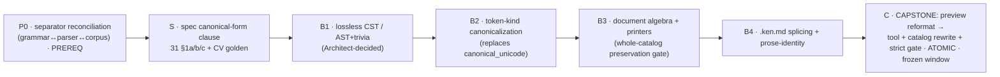

# kenfmt work program — the mandated canonical formatter

Owner: Steward. Design source of truth:
`docs/program/kenfmt-canonical-form-review.md` (the canonical-form readability
review, 2026-07-12) + `docs/program/wp/ken-formatter-canonical.md` (the original
Steward frame). This document decomposes the formatter into sequenced,
shovel-ready work packages and records their state. It is the kenfmt analog of
`docs/program/wp/adr0014-work-program.md`: **a work program, not one WP.**

`ken fmt` is Ken's `gofmt`/`black` — a single canonical style, mechanically
enforced by a strict CI gate. It is the load-bearing **review interface** for an
agent-written codebase: it kills style-churn diffs, stops agents spending tokens
on layout, and exposes exactly the boundaries a human checks (telescope inputs,
claimed result, effect/contract boundary, exhaustive cases, the proof-term tree).

## Fixed inputs — SETTLED, do not reopen

Operator-ruled; the program implements them, it does not relitigate.

- **Scope = FULL canonical layout** (operator, 2026-07-11): ASCII↔Unicode
  canonicalization + TR39 confusable resistance + wrapping/columns + indent +
  spacing + fence normalization, for `.ken` **and** `.ken.md` code fences (prose
  untouched).
- **Enforcement = STRICT CI GATE from day one** (operator, 2026-07-11):
  `ken fmt --check` blocks any non-canonical file, landed **atomically** with a
  whole-catalog reformat so the gate is green on arrival.
- **Column target = 96 display columns for code** (operator, 2026-07-12), with
  the prose rule staying **80**. A *soft* pretty-printer width but deterministic:
  a syntactic group either fits or it breaks. Rationale: dependent-type proofs
  carry more unavoidable punctuation than prose; 8 extra columns cut vertical
  explosion while staying comfortable in side-by-side review.
- **No escape hatch** (operator, 2026-07-12): there is **no** `fmt:off`-style
  disable directive. A mandated format with escape hatches is no longer one
  canonical format. Verbatim literals (strings, foreign names, temporal text)
  are **semantic** exceptions the formatter already never touches — not style
  escapes.
- **Canonicalize by parsed token kind, never raw text.** Emit the blessed
  Unicode glyphs for operators/notation (`->`→arrow, `|->`→match-arrow, ASCII
  lambda→`λ`, `Ω`); keywords stay ASCII words (`const`, `fn`, `proc`, `data`,
  `match`, `requires`, `ensures`, `proof`, …). An identifier `l`, the keyword
  `in`, prose `not` are **never** converted by byte resemblance. (This closes the
  `l`/`level`→`ℓ` over-fire and the `|->` maximal-munch hazard — both real fleet
  traps.)
- **Formatting is not refactoring.** Preserve declaration order, binder grouping
  (`(x : A) (y : A)` is not merged into `(x y : A)`, nor split), comment text,
  literal spelling (numeric base/separators/suffixes, string delimiters/escapes),
  and every non-canonical choice. Never reorder/sort imports/constraints/rows/
  fields/instances; never desugar `if`/`match`/records/classes/effects; never
  switch `lemma`↔`proof`↔`fn`↔`const` or an attached-proof selector for another
  spelling; never add/remove types/implicits/constraints.
- **Break by syntactic boundary, never arbitrary token position:** argument
  boundaries for applications, domain boundaries for arrow chains (one binder
  group per line, arrow-led continuations), one match-arm per line, leading-`|`
  sum constructors, no vertical column alignment ever (indentation expresses
  structure; alignment creates unrelated diff churn).
- **Architecture = lossless representation + document algebra.** A lossless
  concrete syntax tree (preferred) **or** the AST + a complete ordered
  token/trivia stream with a deterministic comment-attachment algorithm; plus a
  Wadler/Prettier `Doc`/`group`/`nest`/`flatten` algebra with display-width
  measurement, **one printer per grammar production**. The existing
  `crates/ken-elaborator/src/format.rs::canonical_unicode` is a **migration
  seed** (raw-byte lexical normalizer), **not** the foundation.
- **`.ken.md` = fences only.** Recognize only the four literate roles (`ken`,
  `ken ignore`, `ken reject`, `ken example`); format recognized fence bodies in
  place; **Markdown prose byte-for-byte identical** (tested by masking fence
  ranges before comparing).

The full 12-section rule set and the 8 semantic gates live in the review doc;
the normative home is the spec canonical-form clause (WP **S**, spec
`31 §1a/b/c`). Build agents build from **S + this program**, never from `local/`.

## The blast-radius insight — only the capstone needs the freeze

Strict-gate + full-canonical + whole-catalog-reformat is the single
largest-blast-radius change on the roadmap — **but the blast radius is confined
to the final merge.** WP **S** is a spec clause; **B1–B4** are inner-ring work
inside `crates/ken-*` with the preservation gates run against the catalog
**read-only** — none of them rewrite a catalog file. The whole-catalog reformat
happens **exactly once, in the capstone C**. So:

- The kenfmt **spec + build series (S, B1–B4) runs now, in parallel** with the
  ADR-0014 module rounds (N3/N4/N5 — surface/elaboration, catalog-light).
- The Steward schedules the **catalog freeze only for the capstone C**, when B4
  is landing.

## Work packages

### P0 — field-separator reconciliation (prerequisite) · size S · **first**

- **The divergence.** The formatter surfaces a real three-way split: the EBNF
  (`spec/30-surface/32-grammar.md`) uses **commas** for record/class fields, while
  the catalog corpus and the landed parser use **semicolons**. This is **more
  than formatting** — a coupled grammar/parser/corpus decision.
- **Objective.** Choose one canonical field/assignment separator for multiline
  `record`/`class`/`instance` (and sibling) blocks and reconcile **grammar,
  parser, and corpus together** so kenfmt canonicalizes onto an already-consistent
  surface. Review leans **semicolons between declaration-like fields, no trailing
  semicolon**. Owner: enclave (spec/grammar authority) with Language (parser) if a
  parser touch is needed; Architect on the grammar-shape call.
- **Why first.** kenfmt's canonical output for these blocks is undefined until the
  separator is settled; deciding it inside the formatter would smuggle a grammar
  change into a formatting diff. **Must land before the capstone C.**
- **AC.** grammar/parser/corpus agree on one separator; conformance updated;
  zero kernel/trust delta (surface-only).

### S — canonical-form spec clause · size M · enclave

- **Objective.** Turn the review's 12 rule sections into the normative canonical
  form at spec **`31 §1a/b/c`**, and **resolve the S-owned open points**:
  - **Layout vs braces →** canonicalize to explicit braces now (already the
    grammar's base form; revisit only via a language decision).
  - **Lambda surface →** always emit the Unicode `λ` with a dot; ASCII forms
    input-only.
  - **Literate `ignore`/`reject` →** a narrow, explicit fence-role exemption:
    token-aware canonicalization only (no structural layout) for deliberately
    incomplete/erroring fences; the strict gate distinguishes "canonical
    parseable Ken" from "teaching fragment."
  - **Type application (juxtaposition vs brackets) →** **preserve as parsed**
    until `OQ-syntax` settles (no forcing).
  - **Field separator →** per **P0** (cite it; do not re-decide here).
- **Deliverable.** Normative `31 §1a/b/c` clause + a CV conformance golden for the
  **semantic gates** (idempotence, parse-preservation, elaboration-preservation
  where a stable comparison exists) as laws, extending the CAT-5 AC6 idempotence
  foundation to the real grammar.
- **Merges before** any build WP that depends on the normative form.

### B1 — lossless syntax/trivia layer · size M · Language

- **Objective.** A lossless CST (preferred) or AST + complete token/trivia stream
  with deterministic comment attachment; round-trips source **without changing
  layout**. **Architecture is Architect-decided** (CST vs AST+trivia); **operator
  reviews the architecture ruling before merge.**
- **AC.** byte-exact round-trip over the whole catalog (no layout change yet);
  comments/trivia preserved; typed views for decls/types/patterns/exprs.

### B2 — token-kind canonicalization · size S/M · Language

- **Objective.** Move Unicode canonicalization behind the lexer (accepted
  ASCII/Unicode aliases → one token kind; the printer chooses the canonical
  glyph); **replace** `canonical_unicode`. Close the protected-region gaps
  (strings/raw/multiline/chars/bytes/comments/doc-comments/temporal/foreign) and
  the `l`/`level` + `in`-vs-membership context bugs. Reject unblessed confusable
  identifier chars at the lexer boundary (TR39).
- **AC.** canonicalization is token-role-driven; the ambiguity suite (match-arrow
  vs arrow, `:` vs `::`, projection vs qualified path, `l`-ident vs level,
  `in`-keyword vs membership, aliases inside every literal form) is green.

### B3 — document algebra + printers · size M/L · Language

- **Objective.** The Wadler/Prettier `Doc` algebra + one printer per production
  (declaration, binder, type, application, match-arm, block), composing
  recursively; **no** regex/line-based heuristics, **no** global alignment
  combinators. The **whole-catalog preservation gate runs continuously**.
- **AC.** AC1 (parse-preservation) + AC2 (idempotence, byte) hold over the
  **entire** catalog, not a sample; 96-col width property holds (every >96 line
  classified as indivisible/verbatim); no breakable syntax silently overflows.

### B4 — `.ken.md` splicing + prose identity · size S · Language

- **Objective.** Reuse the literate extractor's ranges (retain role + original
  opener/closer); format recognized bodies; splice replacements last-range-first
  so byte offsets stay valid; verify prose segments concatenate to the **exact**
  original bytes.
- **AC.** prose byte-identical (fence-masked comparison); the four fence roles
  handled per S's exemption; verified on a literate file with long prose + long
  code.

### C — capstone: atomic landing · size M · Language + Steward-scheduled freeze

- **Objective.** Preview corpus reformat + representative review (ordinary code,
  dependent telescopes, class laws, deeply nested proofs, all fence roles); then
  land the **tool + whole-catalog rewrite + strict `ken fmt --check` CI gate in
  ONE atomic merge**, in a **catalog-quiet freeze window** the Steward schedules.
- **AC.** the gate is real and green day-one (no silently grandfathered
  violations; any deliberate exemption `log`ged); AC1–AC6 of the original frame +
  the review's 8 semantic gates hold; workspace-green in CI.

## Gate & review

Per WP: Language ring → **@architect gate** (semantics/AST-preservation is the
soundness AC — a formatter that changes parsed meaning is catastrophic; plus the
pretty-printer approach and, for B1, the CST-vs-AST architecture) → **Spec/CV**
for S (the `31 §1a/b/c` clause + golden). **Operator reviews the B1 architecture
ruling before merge** (operator, 2026-07-12). `git_request` to Steward;
honesty-gated publish; **the capstone merges only in the scheduled quiet window.**

## Sequencing (Steward discretion)

`P0 → S → B1 → B2 → B3 → B4 → C`. P0 is the prerequisite (settle the separator
before canonical output is defined). S merges before the build depends on it.
**B1–B4 run in parallel with the ADR-0014 module rounds** (they are inner-ring,
catalog read-only). The capstone **C** is the only WP that needs the catalog
freeze; the Steward opens that window when B4 is landing and no catalog/spec WP
is mid-flight.

## Do-not-reopen guardrails

- **No language/semantic change** — the formatter is whitespace + canonical-token
  only; it must never alter the parsed AST (the soundness AC).
- **No escape hatch, no config** — one canonical form; verbatim regions are
  semantic, not style escapes.
- **No literal normalization** — numeric/string/foreign/temporal payloads are a
  later, separately justified decision, not needed for layout.
- **No import/field/row/instance sorting** — source order is
  resolution-relevant and part of the author's explanatory order.
- **No LSP/editor integration or doc generation** — later tooling.
- **`canonical_unicode` is a seed, not a foundation** — do not extend the
  raw-byte path into the real formatter.
