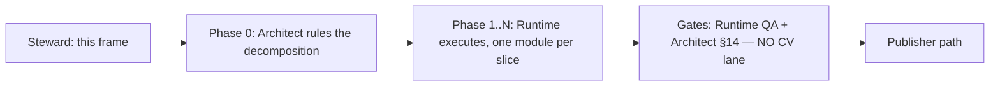

# RT-SPLIT — decompose `cranelift_backend.rs`

**Owner:** Team Runtime · **Size:** L (a slice series) · **Risk:** medium
(large diff, low semantic content) · **Gate:** none — maintainability work,
feeds no G-gate · **Deps:** none (PX8 series complete and landed)

**Status:** frame authored; **Phase 0 ruling DELIVERED and transcribed below
(§10) — it is the binding decomposition.** Execution waits only on the Runtime
ring becoming free (it is sequential and currently on RT-PARITY).

## 1. Objective

`crates/ken-runtime/src/cranelift_backend.rs` is **22,081 lines** in a single
flat module. Decompose it into coherent submodules **without changing any
behavior**. The value is entirely in future legibility and review cost: every
Runtime WP for the last several series has landed in this one file, and both
the implementer and the §14 reviewer now pay a 22k-line orientation tax on
every change.

This WP is a **pure move**. It buys no features, fixes no defects, and changes
no semantics.

## 2. Flow — and why the spec enclave is not in it

Normal WP release runs Steward-frame → spec-enclave elaboration → build team
(`steward.md §2c`). **This WP skips the enclave step deliberately:** it touches
no `spec/` and no `conformance/` path, changes no behavioral contract, and asks
no "what must this do to be correct?" question — the artifact it changes is
module structure. What it *does* need is a component-design ruling, which is
the `any → Architect` edge (COORDINATION §9). The operator directed this
explicitly: *"architect to rule on the breakdown."*

So the flow is:



**No CV vote** — the combined diff-scope touches no `spec/`/`conformance/`
path. If a slice somehow does, that slice pulls a Spec vote (§14 diff-scope);
that would itself be a signal the slice is out of scope.

## 3. Phase 0 — the Architect's ruling (blocking, and the real design work)

> **✅ DELIVERED — see §10 for the binding ruling.** This section states what
> was *asked for*; §10 is what was *ruled*. Where they differ, §10 governs.

**Runtime does not choose the seams.** The Architect rules, and the ruling
must pin four things:

1. **The module list** — the target set of submodules, each with a one-line
   charter, and a ceiling on any single resulting module.
2. **The assignment** — which items land in which module. The Architect need
   not enumerate all 191 top-level items individually; a rule per cluster plus
   the disposition of the ambiguous ones is enough.
3. **The dependency order** — the modules must form a DAG. `mod` cycles are
   legal in Rust, so nothing mechanically stops a tangled cut; the ruling is
   what prevents it.
4. **The visibility policy** — see §4, which is the constraint that actually
   decides whether a proposed cut is good.

**Slice order** is also the Architect's to set, and should be *leaf-first*: the
modules nothing else depends on move first, so each slice shrinks the residual
file without re-touching an already-moved one.

## 4. ★ The constraint that decides the cut: visibility widening

This is the non-obvious part and the reason a ruling is needed rather than a
tidy-up.

In a flat module every item is mutually accessible with **no visibility
annotation at all**. The instant the file is split, every reference that
crosses a new module boundary needs `pub(crate)` or `pub(super)`. And
`crates/ken-runtime/src/lib.rs:39` does:

```rust
pub use cranelift_backend::*;
```

— a **glob re-export**. So an item promoted to bare `pub` to satisfy a cut
does not merely become crate-visible; it lands in `ken_runtime`'s **public
API**. A cut can therefore silently widen the crate's public surface while
every test stays green, because nothing in-repo fails when a surface grows.

⇒ **The count of items that must be visibility-widened is the objective
quality metric of a proposed decomposition.** A cut that follows topic labels
but severs a tightly-coupled cluster will need hundreds of `pub(crate)`s; a
cut that follows the actual dependency structure will need few. **Prefer the
cut that minimizes widening, not the one with the prettiest module names.**

This is the expressibility shape from `steward.md §2c (b‴)`: the obligation
*"this item is an internal detail"* needs a home the compiler checks. In a
flat module the home is "it's private to the file." After a split, a bare
`pub` is a **reach outside the checked vocabulary** — the guarantee stops
being enforced and survives only as intent. `pub(crate)` keeps it enforced.
Hence AC-7.

## 5. Fixed inputs — settled, do not reopen

1. **Pure move.** No logic changes. No renames. No signature changes. No
   clippy/format drive-bys, no "while I'm here" cleanups, no dead-code
   removal. A one-line semantic change hidden in a 20k-line move diff is
   effectively invisible to review — that is the entire risk of this WP, and
   it is bought down only by the diff being *provably* a move.
2. **The crate's exported name set is invariant.** Every name reachable as
   `ken_runtime::<name>` before must be reachable after, unchanged. 25 test
   files across the workspace consume `ken_runtime::` paths.
3. **Tests move with their subject.** ~7,067 lines (32% of the file) sit in 25
   `#[cfg(test)]` blocks that exercise **private** internals. Each moves with
   the items it tests. None may be deleted, `#[ignore]`d, or weakened to make
   a move compile.
4. **CI is the venue for workspace-green** (COORDINATION §12, operator hard
   rule). Local work is `scripts/ken-cargo -p ken-runtime` only. **Never** a
   local `--workspace` — it OOMs the box and stalls the fleet.
5. **No ABI, wire-format, or codegen change.** A pure move must not perturb
   emitted code.

## 6. Grounded inventory (measured at `origin/main @ c4f55c19`)

**⚠ Perishable — re-verify against the landed code at pickup; do not trust
these numbers if the file has moved under this frame.**

| Property | Value |
|---|---|
| Total lines | 22,081 |
| Free functions (`^fn` / `^pub fn`) | 93 |
| `impl` blocks | 17 |
| Structs | 51 |
| Enums | 30 |
| `#[cfg(test)]` blocks | 25 (≈ 7,067 lines) |
| Section-comment banners | **none** — the file is flat |

The absence of banners matters: there is **no existing authorial seam to
follow**, so the decomposition must be derived from the dependency graph, not
recovered from comments.

**In-crate consumers** of `cranelift_backend::` paths:
`object_linker_packaging.rs` (11 references), `native_int_clif.rs` (1),
`lib.rs` (the glob re-export).

**Apparent clusters — a starting signal for Phase 0, NOT a pinned
decomposition.** The Architect owns the actual cut and should feel free to
discard this grouping entirely:

> **⛔ SUPERSEDED — and the ruling did discard it. DO NOT BUILD FROM THIS
> LIST.** §10.0 found that the `Lowering` impl's call graph contains a
> 29-method strongly connected component, and that splitting it along exactly
> the "control / source / host / value" lines suggested below **would
> manufacture a module cycle and is forbidden.** The list is retained only as
> a record of the pre-ruling signal. **The binding decomposition is §10.**

- **Errors / reports** — `CraneliftBackendError`, `ValidatedNativeRunError`,
  `UnsupportedLowering`, `BackendFailure`, `CraneliftRunReport`,
  `NativeDifferentialReport`, `NativeTrustReport`, `NativeToolchainReport`,
  `NativeRuntimeIrComparisonReport`, `InterpreterOracleObservation`,
  `NativeRunEvidence`, `NativeArtifactIdentity`.
- **Oriented-subcontinuation / recursor control** (the PX8-TA/DS/J surface) —
  `DynamicSpliceEdge{,Id}`, `AffineSpliceCapability`,
  `RecursorInvocationSegment`, `{Owned,Installed}OrientedSubcontinuationSegment`,
  `OwnedSelectedScope`, `RecursorUnwindStack`, `RecursorFrameProvenance`,
  `RecursorProducerOriginId`, `CheckedOrientedMarkerSets`,
  `OrientedControlLedgerEntry`, `ComputationalRecursorLayer`,
  `ComputationalRecursorFramePayload`, `SourceComputationalAnswerRoute`,
  `SelectedCaseReturnDelimiter`, `{Root,}TerminalAnswerAuthority`,
  `OpenControlObligation`, `SourceControl`, `SourceBranchFanout`,
  `SourceJoinTarget`, `SourcePredecessorEdge`, `SourceSelectedContinuation`.
- **Continuation frames / eliminators** — `ActiveContinuationFrame`,
  `ComputationalEliminatorFrame`, `OrdinaryEliminatorFrame`,
  `PendingLetContinuationFrame`, `DeferredConstructorCaseEnvironment`,
  `Continuation{Activation,Cursor}Id`, `ArmedInvocation`.
- **Value / numeric lowering** — `BoundedNatV1`, `StructuralNatV1`,
  `NativeScalarPairV1`, `DynamicConstructor{V1,AlternativeV1}`.
- **Compilation / JIT / artifact** — `CompiledModule`,
  `CraneliftObjectArtifact`, `NativeSeedEnvironment`, `Lowering`.
- **Recursive declarations** — `ActiveRecursiveDeclarationV1`,
  `CheckedRecursiveInvocationInstance`.

Note the second cluster is both the largest and the most recently churned (the
whole PX8 chain landed there). It is the highest-value extraction and probably
the hardest — the Architect should decide whether it leads or trails the
series.

## 7. Acceptance criteria

Each is checkable by a reviewer; AC-2/3/7 are the ones that make the "pure
move" claim auditable rather than asserted.

> **★ AC-2 and AC-3 were REWRITTEN 2026-07-22, after slice 1 merged**, on the
> adversary's post-merge findings and the Architect's ruling
> (`evt_1y255ges6mftc`). **Slice 1's verdict is unchanged and clean**, and it
> rests on a *conjunction*, not on any single oracle: its ordered moved content
> was reviewed directly; the adversary's line-multiset check independently
> established inventory and visibility-ledger completeness; and Runtime QA's
> pre-move coverage plus targeted tests covered the moved behavior and impl
> surface. **AC-2 established only module-level item-name identity.** What
> changed is the *evidence contract for slices 2–7*: AC-2 was carrying a claim
> it had never established, and AC-3 named a mechanism loosely enough that a
> multiset could be read as discharging it. **If you cut a slice against the
> pre-2026-07-22 wording of these two ACs, re-read them now.**

1. **Decomposition matches the ruling.** The resulting modules are exactly the
   Architect's ruled list, and no module exceeds the ruled ceiling.
2. **Module-level exported-NAME identity.** The set of *module-level item
   names* reachable as `ken_runtime::<name>` is **identical** before and
   after — verified by a sorted symbol dump taken at the merge-base and at the
   candidate tip, diffed to **empty**. The command used goes in the PR body.

   > ⛔ **State this check at its measured strength and no further** (Architect
   > ruling `evt_1y255ges6mftc`, 2026-07-22, on the adversary's measurement).
   > `cargo doc --no-deps` + hrefs from `all.html` enumerates **module-level
   > item names only.** Fields, enum variants, inherent methods, and trait
   > impls are **not names in that namespace**, so they cannot move the diff.
   > Four real public-surface mutations were run against the landed oracle and
   > **all four went undetected** (baseline 14 hrefs → mutated 14 hrefs, diff
   > empty): private field → `pub`; new public enum **variant**; new public
   > inherent **method**; **deleted `impl Display`**.
   >
   > **AC-2 is necessary, never sufficient.** Cite it in a PR body as *"no
   > module-level item name changed"* — that sentence, not "no public surface
   > change." The whole-public-surface claim is carried by **AC-3**, which is
   > where impls, methods, variants, and fields are actually held.
   >
   > This is the same defect as `DOC-VALIDATION-BINDING`, one day later in
   > another team: **an enumeration checked against another enumeration of the
   > same kind, while the property that matters lives outside the domain
   > either one iterates.**

3. **Move-purity — ORDERED item-level identity, PLUS removed-line closure.**
   For each slice, every moved production **declaration, function/method body,
   trait impl, and macro invocation** is compared against its source as an
   **ordered token sequence**, and the only permitted deltas are enumerated and
   reviewed **separately**: module/import paths, namespace wiring, and the
   exact AC-7 visibility ledger. **AND: every line removed from the parent is
   either present in the new module or listed in the AC-7 ledger.** State both
   mechanisms in the PR body.

   > ### ⛔ THE SECOND HALF IS NOT OPTIONAL — ORDERED IDENTITY CANNOT SEE A DELETION
   >
   > Added 2026-07-22 on the adversary's slice-2 finding (`evt_58rd48tw0vdjp`),
   > which measured the first half of this AC against its own four blind spots:
   > field→`pub`, new enum variant, and new inherent method are **caught** (each
   > lives inside a moved declaration, so its token sequence changes). **A
   > deleted `impl Display` is not**, and the reason is structural:
   >
   > **Ordered identity compares every moved item *against its source* — a
   > comparison over items present on BOTH sides. A deleted item has no
   > post-image, so it is never in the compared set.** It is a **presence
   > check, not a closure check**, and no amount of ordering strengthens it in
   > that direction.
   >
   > **⛔ And no other AC catches it either.** Walking a dropped *unreferenced*
   > item through all seven: **AC-1** module list unchanged → blind; **AC-2**
   > only module-level *public* names, and the item may be private → blind;
   > **AC-3** not in the compared set → blind; **AC-4** count preserved, nothing
   > references it → blind; **AC-5** compiles, being unreferenced → blind;
   > **AC-6** not codegen → blind; **AC-7** a deletion widens nothing → blind.
   >
   > **The removed-line multiset was the only net for absence, and it was not a
   > criterion** — it appeared only in prose. On slice 2 it produced:
   > `removed-from-parent 270 unique non-blank, present in planning.rs 261,
   > NOT present exactly 9` — and those 9 are byte-for-byte the AC-7 ledger
   > (5 fns, 1 struct, 3 fields). **Slice 2 was clean; it just was not clean
   > *because of an AC*.** It costs one command.
   >
   > **The worst case this closes is a silently-lost `impl Drop`** — invisible
   > to AC-2 (not a module-level name), invisible to AC-3 (no post-image),
   > compiles clean when removed, and behaviourally load-bearing. The residual
   > parent has exactly **three**; `:3188` `impl Drop for Restore` is genuinely
   > load-bearing (pure save/restore with no entry normalization — losing it
   > latches `PX8DS_RETIRED_FLAT_ORDER` true for the rest of the thread) and is
   > defended by a real two-arm discriminator at
   > `ken-cli/tests/px8ta_oriented_subcontinuation.rs:272-300`. The other two
   > are defensively redundant, clearing state at entry as well as in `drop`.
   >
   > This is [[completeness-gate-must-be-bidirectional]] in an AC: **a check
   > that ranges over what survived can only ever confirm what survived.**

   > ### ⚠ AC-2 CALIBRATION — a private-only slice must SAY SO, not cite a number
   >
   > All nine items slice 2 moved were **private** pre-split, so they were never
   > among the 338 module-level names. **`338 → 338` was incapable of moving for
   > that slice** — it is not weak evidence there, it is *no* evidence.
   > Consistent with "necessary, never sufficient," but a reader tallying green
   > checks will over-count. **If a slice moves only private items, state that
   > AC-2 is vacuous for it rather than reporting the unchanged number.**
   > Slices 3 and 4 move behavior and will not have this property.

   > ⛔ **Order is load-bearing; a multiset is not enough.** A normalized line
   > multiset is excellent as a **second inventory net** — it exposes
   > dropped/added lines and it *produces* the AC-7 ledger as a measurement
   > rather than as an author's enumeration confirmed after the fact — but it
   > **discards order and context.** Swapping two effectful statements
   > preserves the multiset and changes behavior. Use it; do not let it stand
   > in for ordered identity.
   >
   > ⛔ **"The tests pass" is not evidence of move-purity.** It is evidence of
   > behavior on the paths the tests reach. Retain pre-move coverage
   > measurement plus targeted green as the **behavior** net — especially for
   > trait impls and macro-generated behavior — but **never substitute tests
   > for ordered move identity.**
   >
   > ⛔ **There is no "restructuring class" that relaxes this.** Every RT-SPLIT
   > **production** slice remains move-pure under this AC and §10.5. The word
   > *restructuring* may describe namespace scaffolding, imports, test-file
   > redistribution, or the final facade — it **does not authorize production
   > logic or content change** in any slice. Applied to the ruled order:
   > slices **2** (`planning`), **3** (`compiled`), **5** (lowering support),
   > and the **artifact-internals body in 7** are predominantly ordered item
   > moves. Slice **4** (`lowering::core`) adds hierarchy and test scaffolding;
   > slice **6** adds the `artifact/mod.rs` namespace scaffold,
   > `artifact::api`, and its API/test-support wiring; and slice **7** adds the
   > adapter/test-support/final-facade wiring around the ordered artifact-item
   > move. **For slices 4, 6, and 7, each new wiring delta gets its own
   > separate review pass**, while moved production text remains held to
   > ordered identity.
   >
   > ⛔ **And nothing in this AC is discharged by a byte-identity check of
   > whole files.** Byte-identity goes red on lawful import and visibility
   > churn — it was ruled out (operator, 2026-07-22) and stays out. The unit
   > is the **moved item**, not the file.

> ### ★ THE EVIDENCE HEURISTIC BEHIND AC-2, AC-3, AND AC-7
>
> Adopted 2026-07-22 from the Runtime ring's slice-2 retros (implementer
> `evt_22zh45vfbvppj`, leader `evt_66xzjpkxg77gv`). It generalizes past this WP
> and applies to every ledger, inventory, or count in any frame:
>
> > **A ledger or inventory is stronger as the OUTPUT of a mechanism than as an
> > assertion the mechanism confirms.**
>
> The weaker reading — *"check your list twice"* — sounds identical and is not
> the point. The point is that **an author's enumeration can only ever be
> checked for the items the author thought to list.** A check that *confirms* a
> list is bounded by the list; a check that *emits* the list is bounded by the
> code. Only the second can surprise you.
>
> **Concretely, in this WP:** the AC-7 visibility ledger is the **output of the
> AC-3 ordered diff**, not an author's enumeration that the diff later agrees
> with. Report it that way.
>
> **This is the same defect the §7 rewrite corrected one layer up** — AC-2 was
> an enumeration of module-level names checked against another enumeration of
> module-level names, structurally blind to fields, variants, methods, and
> trait impls. Three occurrences in two days across three artifacts, so treat
> it as a standing review question rather than a fixed instance: **for every
> count or list in an evidence package, ask whether it was measured or
> asserted.**
>
> Applies to aggregates too. **A total is an assertion; the rows are the
> measurement.** The slice-2 implementer twice computed an aggregate with a
> line-anchored pattern and nearly reported a fictional coverage table — caught
> both times by dumping rows rather than trusting the total.

4. **Test preservation.** All 25 `#[cfg(test)]` blocks compile and pass. The
   total test-function count is unchanged; no test is deleted, `#[ignore]`d,
   or has an assertion weakened. Report the before/after count.
5. **Targeted green locally, workspace-green in CI.**
   `scripts/ken-cargo test -p ken-runtime` green on the candidate; the full
   `--workspace --locked` run is **CI's**, polled by the publisher path.
6. **Codegen unperturbed.** The native differential and any frozen native
   fixture remain green and **unmodified**. If a frozen fixture needs an
   update, the move was not pure — stop and escalate rather than
   re-baselining.
7. **No public-surface widening.** No item gains bare `pub` that did not have
   it. Every new cross-module visibility is `pub(crate)` or `pub(super)`, and
   the **count** of items so widened is reported per slice in the PR body
   (it is the metric from §4).

8. **`test_support` has no production consumer — CHECKED, not asserted**
   (**slices 6–7** — the module is seeded in slice 6 and completed in slice 7
   under the reversed order, §10.2a rule 6; adversary detector-gap
   `evt_457npdbe9zmp9`, predicate corrected by the Architect
   `evt_vd1xkmfhrkrp`). **AC-8 applies from the moment the module exists**, not
   only at series end.

   > **Outside ruled `tests.rs` / `tests/**` modules: every consumer must
   > spell `crate::cranelift_backend::test_support::<item>` at the direct
   > semantic use, inside an entire item carrying item-level `#[cfg(test)]`.
   > A `#[cfg(test)]` statement, block, or branch inside an otherwise
   > production item does **not** qualify. **No `use`, `pub use`, re-export,
   > or other cross-item alias/binding may launder a `test_support` item into
   > a name consumed elsewhere.** The exact facade wiring declaration
   > `#[cfg(test)] mod test_support;` remains the sole non-consumer
   > exception.**

   **Evidence is a closed ledger with exactly three classes:**

   > 1. the exact facade wiring declaration;
   > 2. a ruled test-module reference — **imports are allowed here**;
   > 3. an outside-test **direct rooted non-import/non-alias** use inside an
   >    entire item with item-level `#[cfg(test)]` — **name the enclosing item
   >    and show its item-level attribute.**
   >
   > Report the raw search command and hit count. **Raw code-reference hits
   > and classified rows must reconcile one-for-one; comments and strings
   > cannot satisfy a row.**

   **⛔ The detector is the CONJUNCTION of item-level confinement and the
   no-laundering rule. Neither half is sufficient, and an earlier draft of
   this AC claimed otherwise.** Item-level confinement alone is defeated by a
   `use`: a `use` declaration **is** an item, so
   `#[cfg(test)] use …::test_support::helper;` carries a genuine item-level
   `#[cfg(test)]` and classifies **cleanly** — while the call site then reads
   `helper()` and **never lexically names `test_support`.** The ledger
   inspects the *import* site, where the attribute innocently sits; the leak
   is at the *use* site, which the search cannot see at all. **The reference
   and the leak end up in different items, and only the innocent one is
   greppable** (adversary `evt_6baweq79m4fkf`, compiled repro; Architect
   `evt_ez3766tp1gbn` withdrawing the contrary claim).

   **Why "rooted" and not merely "fully-qualified."** `test_support::<item>`
   is not enough — it can itself rest on `use crate::…::test_support;`, which
   reintroduces the laundering one level up. The path must be **rooted at
   `crate::`** so the checked name appears at the point of use.

   **Checked bidirectionally, per AC-8's own earlier lesson:** the facade
   declaration is carved out ✅; the object-emission helpers at former `:311`,
   `:580`, `:625` are entire `#[cfg(test)]` items and classify under class 3
   ✅; ruled tests modules keep `use` ✅; the compiled import repro is
   rejected ✅. **Still a human-audited grep ledger — no parser, no topology
   change.**

   > **Why this AC exists.** §10.2a rule 2 says *"production modules must not
   > import it"* and rule 7 restates it as a stop-and-return — but **that was
   > the one constraint in the seven-point rule with no enforcing mechanism.**
   > Its siblings are all checkable: rules 1 and 7a are structural (`cfg`),
   > 2a and 3 are greppable, 5 defers to §10.5a, 6 rides AC-3. **2b/7b had
   > nothing**, so it lived only in prose.
   >
   > **The reach is created by the ruling itself.** `pub(super)` on an item in
   > `cranelift_backend::test_support` **is** `pub(in crate::cranelift_backend)`
   > — visible to the facade **and every descendant, including production
   > ones**. A helper sitting in `lowering/core/tests/` is not visible to
   > production siblings this way; hoisting to facade level is the *widest*
   > test-only visibility in the subtree, and rules 2b/7b are the compensating
   > constraint. **Compiled repro:** a production `fn` importing a
   > `test_support` item under `#[cfg(test)]` builds green under `--test`
   > while returning the fixture value, and returns something else in release.
   > Nothing in the rule, the compiler, or any existing gate objects.
   >
   > **Latent, not live** — reconciled on `origin/main`: `#[cfg(test)] use`
   > occurrences in `crates/ken-runtime/src` = **0**; references to
   > `test_support` anywhere under `crates/` = **0**; the module does not exist
   > yet. **This AC is written before the reach is created, which is the only
   > cheap moment** — retrofitting after slice 7 costs a re-ruling.
   >
   > ★ **The general form is the expressibility audit (§2c b‴), run on this
   > frame by the adversary:** an obligation whose only discharge is prose is
   > *"a reach outside the shape's own checked vocabulary."* Naming a
   > stop-and-return does not make it detectable. **Every rule in a ruled list
   > should be able to name what would catch its violation** — and if one
   > can't, that is the finding.

9. **⛔ RESIDUAL-PARENT CLOSURE IS TWO-LAYERED — NEITHER LAYER SUBSTITUTES FOR
   THE OTHER.** (Architect `evt_2mexay4h5tr6y`.) Binding on every slice from 5
   onward, and the condition under which any "no further assignment gap" claim
   may be made.

   > ⚠ **Slice 6 creates a SECOND scaffold-import population**, in
   > `artifact/mod.rs`: the six still-residual parent operations named in
   > §10.5. **Slice 7 must delete all six**, and the same two-layer closure
   > applies to it — the import list is one instrument and the parent
   > source-coverage partition is the other. **Do not reuse slice 5's
   > reconciliation numbers**; this is a different population in a different
   > module, and the lesson that produced this AC is precisely that closing an
   > enumeration for one population says nothing about another.

   > ### ⛔ SLICE 7 ADDS A THIRD POPULATION — THE 37 RESIDUAL TEST ITEMS
   > (Architect `evt_h69xwchqqxmj`, 2026-07-22)
   >
   > Slice 7 must additionally **emit the final-user-LCA ledger for all 37
   > residual facade-scope test items** and **move every lower-LCA transitive
   > closure to its lowest ruled test ancestor** (§10.2a rule 8). The candidate
   > measured **30 of 37** with a lowering-only final LCA.
   >
   > **⛔ This is a new PROPERTY AXIS, not an invisible population — state it
   > exactly.** (Architect `evt_73kn217kzjdvv`, correcting an earlier
   > overclaim in this block.) The three prior instruments stand in **three
   > different** relations to these 37 items, and collapsing them is precisely
   > the error this AC exists to prevent:
   >
   > | instrument | can it SEE these items? | can it establish their PLACEMENT? |
   > |---|---|---|
   > | scaffold-import list | **no** — blind to these declarations | no |
   > | source-coverage partition | **yes** — ranges over every non-trivia source span | **no** |
   > | semantic declaration inventory | **yes** — ranges over every declaration, including its `cfg` reach | **no** |
   >
   > **Two of the three can enumerate the population perfectly well.** What none
   > of them establishes is the *different property* now required: **each item's
   > final-user LCA and its lawful final placement.** The new ledger closes
   > **that property axis** — it does not close an allegedly invisible set.
   >
   > ★ **Why this correction matters more than its size.** The overclaimed
   > version reasoned *"a new deliverable is needed, therefore the existing
   > instruments must not have been able to see this"* — inventing a blindness
   > to justify a real requirement. **The requirement was real and the
   > justification was false.** An enumeration being complete over a population
   > says nothing about *which property* it measured over that population; that
   > is the same conflation, one level up, as the item-axis/user-axis lesson
   > below.
   >
   > **The ledger is the deliverable, not the count.** "30 of 37" is a
   > measurement a reviewer cannot re-derive from a number; the per-item
   > final-user LCA is. ⛔ **Do not report a residual count in place of the
   > ledger.**
   >
   > **What travels with a moving item** (Architect `evt_73kn217kzjdvv`):
   > move each lower-LCA item together with **the dependency declarations used
   > ONLY by that closure**, and **retain a dependency at the facade only when
   > it has an independent, genuine facade-LCA user.** Recompute over **final
   > direct users**.
   >
   > ⛔ An earlier gloss here had this backwards — it said an item *"whose own
   > LCA is the facade may still move if it is only reachable through one that
   > is not."* **That reverses the quantifier**: under this frame's
   > actual-final-user-LCA definition, an item reachable *only* through a
   > lower-LCA owner **does not have a facade LCA in the first place**. The
   > wording as written would have authorized a genuine facade-LCA declaration
   > to be dragged down merely because one lower item also depends on it.
   >
   > **Production content stays frozen.** `core.rs`, `lowering/mod.rs`, and
   > `artifact/api.rs` production content is unchanged by this fold — it is
   > test-only finalization, and the no-re-touch rule that has governed five
   > consecutive slices is **not** relaxed by it.

   **What is already closed, and exactly how far it reaches.** The 92-name
   scaffold-import reconciliation is valid and **closes the emitted import
   population** with zero residue:

   ```
   lowering/mod.rs unconditional scaffold import list        92 names
     -66  moved into lowering/mod.rs in slice 5
     - 4  repository-owned, already assigned and landed:
            backend_module          -> surface.rs   (slice 1)
            CraneliftBackendError   -> surface.rs   (slice 1)
            NativeSeedEnvironment   -> surface.rs   (slice 1)
            CompiledModule          -> compiled.rs  (slice 3, pub(super))
     -22  external deps: cranelift 13 + crate-level Runtime* 9  (no destination)
     =  0  residue
   ```

   ⛔ **It does NOT close the residual-parent DECLARATION population**, and the
   distinction is the whole point of this AC. **A closed enumeration is not a
   closed class.** The scaffold list is complete over *imported names*; the
   property that matters is *every parent declaration that must move*. **A
   facade-declared, facade-only-consumed item is in the second set and not the
   first** — so it is invisible to that instrument by construction, not by
   oversight.

   **Both layers are required:**

   a. **A complete source-coverage partition.** Every non-trivia source span in
      the residual parent is attributed to exactly one of: a moved
      item/macro invocation, a retained facade declaration/re-export, or an
      explicitly forbidden deletion.

   b. **A macro-aware semantic inventory.** Every declaration — **including
      declarations generated inside macro invocations** — with its `cfg` reach
      (§10.4b) and its destination recorded.

   **Why both, empirically:** line coverage alone passed the earlier semicolon
   mis-split; a declaration regex missed the indented `thread_local!` statics.
   **`thread_local!` is a macro invocation, so its statics are not items a
   declaration enumerator matches, and they are not names in the import list
   either** — invisible to *both* single instruments simultaneously, which is
   precisely why neither closure found them.

   c. **The configuration matrix is the independent shape net.** Default
      non-test, test, and non-test-with-`px8-ds-test-support` must **all**
      compile in the appropriate targeted/CI gates, **with public/visibility
      ledgers compared in the default AND the feature-enabled domains.** A
      ledger taken in one domain is silent about items whose reach is in
      another (§10.4b).

   **⛔ Frame corrections this AC carries — do not restore the withdrawn text:**
   - **Withdraw every "exactly two declarations" and every "closed by
     construction" claim, in any form.** *"Exactly two consts in the scaffold
     list"* remains true **and is not a population bound.** The "exactly two"
     figure was itself a **column-0 regex artifact**: re-run at any indentation,
     the facade production region holds **eight** bare-value declarations — the
     2 ruled consts plus **6 indented `static`s inside `thread_local!` blocks**.
   - Item 6's assignment gap may claim closure **only** when the 92-row scaffold
     reconciliation, the full parent source-coverage partition, the macro-aware
     declaration/`cfg` ledger, **and** the configuration evidence all reconcile
     with **zero residue**.

   > ★ **The transferable bar, and why it is the one to write:** prefer
   > *"every line of the parent is attributed to a destination"* over *"every
   > name in list L is assigned."* The first is **checkable by construction and
   > has no window in which it can be narrower than the class**; the second is
   > only ever as complete as whoever built L. **Compute the complement of your
   > own enumerator** — the lines your instrument covers, subtracted from the
   > file — and read what falls out. It is one coverage subtraction, and it is
   > the step that found all three missing `thread_local!` blocks.

## 8. Guardrails — do not reopen

- **Do not redesign the backend.** If you find something that looks wrong
  while moving it, **move it unchanged and file it separately.** A defect
  found during a refactor is a follow-up WP, never a bundled fix.
- **Do not widen visibility to make a test reach its subject.** If a test
  cannot reach what it tests after a cut, the *cut* is wrong — escalate to the
  Architect for a seam revision. Silently promoting an item to `pub` to buy
  green inverts AC-7 into a rubber stamp.
- **Do not bundle the adversary docket items.** F4/F5/F6 are open against
  neighbouring surfaces and are being classified separately; none of them
  lands here.
- **Do not touch `crates/ken-interp/`, `crates/ken-host/`, or any `catalog/`,
  `spec/`, or `conformance/` path.** If a slice appears to need one, that is
  an escalation, not a scope stretch.
- **Every anchor in this frame is perishable.** The §6 figures and the §4
  `lib.rs:39` citation were measured at `origin/main @ c4f55c19`. Re-verify at
  pickup; **if a fixed input turns out false against the landed code, say so
  and escalate — do not quietly build around it.**

### 8a. ★ The method this frame keeps re-learning — state your frame as a claim

**Every disposition in §10 that had to be corrected was rigorous inside a frame
nobody audited, because the frame was never stated as a claim.** This is not a
retrospective; it is the working instruction for slices 6–7.

**Four instances, one shape:**

| the reasoning | the unstated frame | what it missed |
|---|---|---|
| *"these constraints jointly exclude every option"* | ranged over **the reporter's search**, not over the constraint set | a fourth option existed — the `#[cfg(test)] pub(super)` adapter |
| *"the complete inverse-call ledger"* | complete over **test** users | the sole **production** caller — the basis of the ownership ruling |
| *"exactly two consts"* | items matched at **column 0** | six indented `thread_local!` statics |
| *"reconcile every name in the scaffold import list"* | complete over **imported** names | facade-declared, facade-only-consumed declarations |

**None of these were careless.** Each was a correct statement about its own
domain, restated as a property of the class. **An unstated exhaustiveness claim
is never audited, because nobody notices a claim that was never made aloud.**

**So, three standing instructions:**

1. **Write the quantifier at the point of assertion.** *"Complete"*, *"every"*,
   *"exactly N"*, *"the only"* — each must name the population it ranges over,
   in the sentence that makes the claim. A reader cannot supply a scope the
   author left implicit; they will supply the **widest** one.
2. **Let the artifact emit the population, then partition it on an axis the
   rule is silent about.** The instrument that actually *closed* a class here
   did not search harder — it took the scaffold's own emitted import list and
   split it by **item kind**, an axis §10.2's family language never mentions,
   and the unclassifiable cell fell out immediately. Ask what your partition
   **cannot express** (§10.4b is exactly that question asked of
   production-vs-`cfg(test)`).
3. **Distinguish "the ruling is defective" from "the ruling has an option I did
   not enumerate."** They read alike and **route completely differently** — the
   first re-opens a settled ruling and spends the Architect's attention; the
   second is answered in one reply. **Check which one you have before
   escalating**, and say which one you are claiming.

## 9. Sequencing and branches

- Frame branch: `wp/rt-split-frame` (Steward's; merges and dies).
- Build branches: `wp/rt-split-<n>-<slug>`, each cut **fresh from current
  `origin/main`** after the previous slice lands. A squash-merged branch
  cannot be continued.
- **Each slice is independently behavior-preserving, independently green, and
  independently mergeable.** This is not a land-together assembly — a slice
  that only makes sense alongside the next one is mis-cut.
- Rebase each slice onto current `origin/main` before its merge Decision;
  "rebased onto current main" is a perishable claim (§14(5)).

## 10. Phase 0 ruling — DELIVERED (Architect, `evt_1q0cdpv9qrjxe`)

Grounded at `origin/main @ 244cfe9c`; the §6 perishable inputs were
re-confirmed still true (22,081 lines, `lib.rs` glob export unchanged).

**This section is the binding decomposition.** It is transcribed here because
an in-thread ruling is not a durable deliverable — build from this file, never
from the convo thread.

### 10.0 Why the topical cut is forbidden

The cut is driven by the **call graph**, not by the apparent topic list. The
`Lowering` impl has **108 methods**. Its direct self/associated-call graph has
one **29-method strongly connected component occupying 5,864 method-body
lines**. The other **79 methods occupy 3,506 lines**; there are **145 calls
from the SCC into those helpers and zero calls from those helpers back into
the SCC**.

⇒ Splitting that SCC into "control", "source", "host", and "value" production
modules — i.e. the cluster grouping this frame listed in §6 as a *starting
signal only* — **would manufacture a module cycle and a broad visibility seam.
It is forbidden.**

### 10.1 Pinned production modules

**No physical Rust module file may exceed 6,500 lines after `rustfmt`.** Do
not satisfy the ceiling with a giant inline module; the ceiling applies to
each `.rs` module body too.

1. `cranelift_backend/mod.rs` — facade only: module declarations and explicit
   re-exports preserving the exact old `ken_runtime::<name>` surface.
2. `cranelift_backend/surface.rs` — reports, evidence, errors, outward data
   types, `NativeSeedEnvironment`, and their `Display`/`Error`/`From` impls.
3. `cranelift_backend/planning.rs` — native-join/oriented-plan extraction,
   checked-marker census, pre-emission transport validation; no CLIF emission.
4. `cranelift_backend/compiled.rs` — `CompiledModule`, `CompiledExpr`,
   `ResultDecoder`, result-table ownership, JIT result decoding/execution.
5. `cranelift_backend/lowering/mod.rs` — `Lowering` state, lowered-value and
   continuation/control data model, pure free helpers, and the 79 acyclic
   support methods outside the SCC.
6. `cranelift_backend/lowering/core.rs` — the **indivisible 29-method lowering
   SCC** plus `compile_expr_into_module`; the recursive lowering engine.
7. `cranelift_backend/artifact/mod.rs` — ISA/module setup and private
   JIT/object compilation and materialization machinery.
8. `cranelift_backend/artifact/api.rs` — the existing public and crate-facing
   run, validation, comparison, and object-emission entrypoints and their
   orchestration.

**Required test modules:** `planning/tests.rs` · `artifact/tests.rs` ·
`artifact/api/tests.rs` · `lowering/core/tests/mod.rs` (shared test-only
fixtures) · `lowering/core/tests/control.rs` ·
`lowering/core/tests/constructors.rs` · `lowering/core/tests/effects.rs` ·
`lowering/core/tests/values.rs` · **`cranelift_backend/test_support.rs`**
(§10.2a — facade-level shared fixtures only, **not** a `mod tests`). The
6,500-line ceiling applies to these too. **No residual omnibus `mod tests`
remains in the facade.**

### 10.2 Assignment rule

- **`surface.rs`** — the current report/evidence/error declarations from the
  top of the file, `NativeSeedEnvironment`, the report/error impls, and
  `unsupported`/`backend`/`backend_module`.
- **`planning.rs`** — `native_join_plan_for_program`,
  `oriented_subcontinuation_plan_for_program`,
  `collect_checked_subcontinuation_frames`, the checked-marker collectors and
  exact-location checks, and `validate_oriented_subcontinuation_transport`.
- **`compiled.rs`** — exactly the compiled container, decoder, JIT `run`, and
  their directly-owned decoding state. **It does not own compilation policy.**
- **`artifact/mod.rs`** — `compile_expr`, `compile_program_expr`,
  `compile_expr_with_declarations{,_and_process_input}`, object/JIT module
  creation, target naming, private object/JIT materializers. **⛔ NOT verifier
  invocation** — see the `verify_cranelift_function` ruling below.
- **`artifact/api.rs`** — all outward runners, preflight and
  differential/report orchestration, existing object-emission entrypoints.
- **`lowering/core.rs`** — `compile_expr_into_module` and exactly this SCC:
  `lower_recursor_residual_call`, `lower_computational_match_expr`,
  `lower_computational_producer_expr`, `resume_active_continuation`,
  `lower_computational_match_value_composed`, `lower_bounded_nat_computational`,
  `materialize_eliminator_frame_env`, `lower_source_machine`,
  `lower_source_machine_with_continuation`,
  `lower_source_machine_with_continuation_inner`,
  `lower_source_bounded_nat_match`, `lower_source_dynamic_bool_match`,
  `lower_source_dynamic_host_result_match`,
  `lower_source_dynamic_constructor_match`,
  `lower_source_nested_dynamic_constructor_match`,
  `lower_source_planned_dynamic_constructor_match`, `source_call_state`,
  `lower_source_declaration_call`, `lower_expr`, `lower_process_host_effect`,
  `lower_unary_recursive_nat_fold`, `lower_recursive_declaration_call`,
  `lower_declaration_ref`, `lower_borrowed_match`,
  `lower_borrowed_option_match`, `lower_dynamic_host_result_match`,
  `lower_bounded_nat_match`, `lower_dynamic_constructor_match`,
  `lower_primitive_call`.
- **`lowering/mod.rs`** — every other `Lowering` method; the private
  lowered-value, recursive-declaration, continuation, source-machine,
  oriented-control, bounded-Nat, dynamic-constructor and scalar-pair types
  plus their free helpers; the recursive-argument helpers after the impl.

**Ambiguous dispositions (ruled):**

- `with_px8ds_retired_flat_order` and the PX8 test/mutation ledgers stay with
  lowering; the facade explicitly re-exports their pre-existing visibility.
- `Px8trTrapProvenanceEvent`, `NativeIntLoweringMutation`, and
  `NATIVE_INT_LOWERING_MUTATION` are **lowering-owned** — not artifact, not
  surface. ⛔ **Their ownership is lowering; their *reach* is not "test-only"
  and this frame no longer says so** (Architect `evt_2mexay4h5tr6y`).
  `PX8DS_RETIRED_FLAT_ORDER` and `with_px8ds_retired_flat_order` carry
  `#[cfg(any(test, feature = "px8-ds-test-support"))]` and are therefore
  **lowering-owned, feature-enabled production/test instrumentation.** See
  §10.4b — classify by compilation reach, never by a production/`cfg(test)`
  binary.
- **`verify_cranelift_function` is LOWERING-OWNED** (Architect
  `evt_3tgaw9ws44fqg`), moved byte-for-byte and private into `lowering/mod.rs`
  in **slice 5**. It has exactly **one** production consumer — the unchanged
  call in `lowering::core::compile_expr_into_module`. Verification of the CLIF
  function immediately produced by the lowering engine is **lowering-completion
  policy**. Moving it to sibling `artifact` would create the forbidden
  `lowering::core → artifact → lowering::core` production cycle and would spend
  a seam to encode the wrong ownership. `core.rs` is **not** touched; it
  resolves the private ancestor item through its existing `use super::*`.
  Production budget remains **22/24**.
- **`CRANELIFT_HOST_EFFECT_CONSUMERS_V1` → `lowering/mod.rs`** (private);
  its invariant test → `lowering/core/tests/effects.rs`
  (Architect `evt_kvk63qgafqfh`).
- **`MALFORMED_DYNAMIC_CONSTRUCTOR_STATUS` → `lowering/mod.rs`** (private,
  byte-for-byte); its test → `lowering/core/tests/constructors.rs`
  (Architect `evt_5habt0mvvhhm9`). Its existing `core.rs` uses are unchanged —
  the constant resolves from the private lowering ancestor, so **no adapter and
  no widening**. The DAG is unchanged.

  > ⛔ **Both constants carry TWO independent obligations, and a sweep
  > naturally flattens them into one. Keep them separate:**
  >
  > - **That it must move** is §10.1 closure — the final
  >   `cranelift_backend/mod.rs` is *"facade only: module declarations and
  >   explicit re-exports,"* and **a private constant cannot survive there.**
  >   This is true regardless of which module receives it.
  > - **Where it goes** is consumer ownership — every production consumer is
  >   inside lowering, and there are **zero** in artifact, API, planning,
  >   compiled, or surface.
  >
  > ⛔ **Do not encode "and these are the last two" as a proved frame claim.**
  > The 92-name partition proves only that these are the two *consts in the
  > scaffold import list*. It does not prove the other 68 repository-owned
  > declarations have §10.2 destinations. That is AC-9's job.
- `ResultDecoder` belongs to `compiled`, **not** value lowering.
- `reject_program_blockers` belongs to `artifact/api`, **not** planning.
- Dynamic-constructor validation/selection and source-continuation free
  helpers belong to **lowering support**; their callers in the SCC do not make
  them part of the SCC.
- Test helpers go in the lowest `tests/mod.rs` ancestor shared by their actual
  users. **They never justify widening a production item.** ⚠ That sentence
  **presumes a helper has a single subject tree, which is false for this
  file** — see §10.2a for the cross-tree case.

#### 10.2a Cross-tree test helpers (Architect, `evt_5nbk14ckbbe6z`)

**The rationale is one unhandled branch, NOT a recurrence count.** §10.2
already says a shared helper goes at its actual-user LCA. The gap is that when
that LCA is **the facade**, the final topology offers **no lawful narrow
home** — `test_support.rs` supplies exactly that missing structural case
without reviving an omnibus test module. **One grounded counterexample is
sufficient to make the placement rule total**; there is no threshold to reach,
and future items follow the decision procedure below rather than analogy or
counts.

**The one grounded counterexample** is `test_only_distinguished_root_join_plan`
`:270` — a genuine shared fixture helper (it constructs plan/site fixture
state), census **seven occurrences**: one declaration, three calls in test-only
object-emission/API helpers at `:311`, `:580`, `:625`, and three in
lowering-subject fixtures at `:15822`, `:18546`, `:18821`. Its users span
`lowering` and `artifact/api`; LCA is the facade.

**`new_jit_module` and `verify_cranelift_function` are CONTRAST CASES, not
precedents.** They are also cross-tree, and they resolve **differently** —
they are production-private operations whose test-only one-call wrappers stay
**in the module that owns the original**, under §10.5a. **⛔ Do not read "three
cross-tree items" as "three instances of one rule."**

> ⛔ **THIS CLAUSE CLASSIFIES. IT DOES NOT ENUMERATE.**
>
> **The classification:** every one of these items is an **owner-adjacent
> boundary adapter**, not a fixture helper, and each sits **beside its private
> original, in the module §10.2 assigns that original.** The generalizing rule
> is *"the adapter sits beside its private original"* — **never** *"the adapter
> sits in `artifact`."*
>
> **⛔ For the population — which operations, how many, and in whose module —
> see §10.5a′'s item-axis census. That is the sole enumerating site.** Do not
> restate the members or the count here, and do not infer either from the two
> contrast cases named above: they are illustrations of the classification, not
> the population.
>
> **Two withdrawn premises, kept as non-normative history only** — an earlier
> revision called **both** named functions *"artifact operations"* and sent both
> adapters to `artifact/mod.rs`, which is false for `verify_cranelift_function`
> (§10.2 rules it lowering-owned, Architect `evt_3tgaw9ws44fqg`); a later
> revision then asserted a two-adapter population, also false (item-axis ruling
> `evt_r0ywa1s4d4j4`). **The classification survived both corrections
> untouched.** What failed each time was an enumeration kept in a clause that
> had no way to stay in step with the census — which is exactly why this clause
> no longer keeps one.

Classify first:

| category | test | disposition |
|---|---|---|
| **owner-adjacent boundary adapter** — one call, no setup or fixture construction | body is a single delegating call | **§10.5a** — `#[cfg(test)] pub(super)` adapter beside the private original, in its **owning** module |
| **genuine fixture/setup helper** — body constructs shared state | e.g. builds `NativeJoinPlanV1`, site metadata, fingerprints | **this clause** — `test_support.rs`, but only when the actual-user LCA is the facade |

**The rule:**

1. Add `#[cfg(test)] mod test_support;` as a **private child of
   `cranelift_backend`**, and `cranelift_backend/test_support.rs` in the final
   tree.
2. A genuine fixture/setup helper whose users span **two or more** ruled
   subject-test subtrees **and** whose LCA is the facade lives there. Items are
   `pub(super)` only; **production modules must not import it.**
3. `test_support.rs` contains **no `#[test]` cases, assertions, subject-specific
   tests, production policy, or owner-private boundary adapters** — only the
   minimal shared fixture constructors/data that cannot live in a lower
   `tests/mod.rs` ancestor. **This is what keeps it from becoming the forbidden
   residual omnibus `mod tests`.**
4. **Single-subtree helpers still follow the existing rule.**
   `oriented_dynamic_sibling_fixture` and `root_authority_test_lowering` stay
   in `lowering/core/tests/control.rs`.
5. **Owner-adjacent transparent adapters remain governed by §10.5a**, not this
   clause. **Each adapter stays beside its own private original, in the module
   §10.2 assigns that original** — ⛔ **do not enumerate the adapters here.**
   Their population is the item-axis census output in §10.5a′ and it is the
   single place that enumerates them; a second list in this clause can only go
   stale against it. ⛔ Two superseded wordings rested on premises since
   withdrawn — *"the JIT/verifier bridges stay in `artifact/mod.rs`"* (the
   co-ownership premise) and a two-item *"the JIT bridge … the verifier bridge
   …"* pair (the two-adapter population). See the contrast-case table above.
6. Move the **grounded facade-LCA fixtures** to `test_support.rs` — **⛔ split
   across slices 6 and 7 under the reversed order** (Architect
   `evt_2j4gnwffr7h63`). Until each fixture's slice arrives it remains at
   **residual-parent file scope under item-level `#[cfg(test)]`**, private;
   **no temporary widening is needed.**

   | slice | what lands in `test_support` | when |
   |---|---|---|
   | **6** | create/seed the module with `test_only_distinguished_root_join_plan` | **once its API-side users have moved below the facade** |
   | **7** | `total_primitive` | **at the rule-8 whole-residual placement fold** |

   **API and lowering tests use the already-ruled direct rooted path.** This is
   an **accumulating namespace scaffold** — ⛔ **not a production-module
   retouch and not a production widening**, so it stays outside the 22/24
   ledger and §10.5's no-re-touch rule is not engaged.

   **`test_support.rs` holds the facade-LCA fixtures the whole-residual census
   emits — currently TWO** (Architect `evt_1s7nxrjje35tk`, superseding the
   "exactly ONE" reading of `evt_h69xwchqqxmj`):

   | fixture | final users span | LCA |
   |---|---|---|
   | `test_only_distinguished_root_join_plan` | `lowering` + `artifact/api` | facade |
   | `total_primitive` | `artifact/api/tests.rs` ×5 + `effects` ×2 + `values` ×10 | facade |

   > ⛔ **"exactly ONE" and "slice 7: nothing further" are WITHDRAWN.** They were
   > the output of the earlier *grounded-fixture* census, whose job was to
   > correct the false `NativeInvocationFixture` row — **not a universal cap.**
   > The rule-8 whole-residual ledger has now falsified that enumerative output.
   > ⛔ **Reading it as a cap would make rule 2 and the binding 37-item placement
   > test self-contradictory** — rule 2 sends a genuine facade-LCA fixture helper
   > here, and rule 8 point 3 cannot leave one at facade file scope when
   > `test_support.rs` is its lawful lower namespace home.
   >
   > ★ **This is the THIRD enumeration in this clause family falsified by a
   > later census** — two adapters → the `NativeInvocationFixture` row →
   > "exactly ONE". The pattern is stable: **a count written beside a rule
   > cannot stay in step with the derivation that produces it.** State the rule;
   > let the census emit the members.

   > ### ⛔ WITHDRAWN ROW — `NativeInvocationFixture` / `BorrowedFixtureValue`
   > (Architect `evt_h69xwchqqxmj`, 2026-07-22, at `origin/main @ 7c6e03c8`)
   >
   > This clause previously carried a second row claiming
   > `NativeInvocationFixture`'s users span
   > `lowering/core/tests/effects.rs` **+ `artifact/tests.rs`**, giving it a
   > facade LCA. **That `artifact/tests.rs` user does not exist and never
   > will.** Measured direct users close exactly at:
   >
   > - `NativeInvocationFixture` → `run_px8n_arm_fixture`,
   >   `px8n_scripted_host_dispatch`, `run_borrowed_fixture`;
   > - `BorrowedFixtureValue` → that same effects-owned fixture closure;
   > - every caller of `run_px8n_arm_fixture` sits in `effects.rs`;
   > - **zero** use or alias in the residual `mod tests` that becomes
   >   `artifact/tests.rs`.
   >
   > **⇒ The pair is lowering/effects-only. Move it, with its direct-user
   > fixture closure, to `lowering/core/tests/effects.rs`. ⛔ Do NOT add either
   > to facade `test_support.rs`.** The pair still moves together (see the
   > transitive-dependency note below); only its destination changed.
   >
   > **How the row went stale — the failure is reusable.** It inherited a
   > slice-4 premise that read *"parent `px8i_*` (**artifact** tests)"*, whose
   > named case was
   > `px8i_positioned_start_and_metadata_promote_u64_above_i64_max`. **Slice 5's
   > semantic-subject pass reclassified that case as `effects` and moved it** —
   > and this frame kept the **pre-partition lexical** classification. So the
   > row was not wrong when written; it was **invalidated by a later ruling that
   > nobody swept back into it.** ⚠ Any row whose justification cites a
   > pre-partition subject name must be re-derived after each semantic-subject
   > pass — see [§8a] on stating a frame's claim so it can be falsified.
   >
   > Corroborated independently by @adversary at the same SHA, which
   > specifically closed the **alias-laundering** blind spot (`use super::X as
   > Y;` puts a consumption site beyond a name grep): an alias declaration
   > necessarily contains the literal name, and the grep spanned the entire
   > file including `mod tests` — seven occurrences, all at or below `:997`,
   > `mod tests` beginning at `:1303`.

   **`BorrowedFixtureValue` travels with `NativeInvocationFixture`** as its
   minimal transitive type dependency through
   `NativeInvocationFixture.process_input`. The pair moves together or not at
   all — **to `effects.rs`**, per the withdrawn-row ruling above.

   > ⚠ **"Residual-parent file scope" does NOT mean inside the parent's
   > `mod tests`.** `cranelift_backend::tests` is a **sibling** of
   > `cranelift_backend::lowering::core::tests`, not an ancestor — a descendant
   > test module cannot reach into it by rooted path (`E0603`, probed). File
   > scope under `#[cfg(test)]` **is** ancestor-private, so descendants reach
   > it with zero widening. The Architect withdrew the looser wording
   > explicitly.

   > ### ⛔ 6a. COMPUTE LCA FROM FINAL RULED DESTINATIONS
   > (Architect `evt_3eg25g63vyc5h`, after slice 4 got this wrong)
   >
   > **A helper's LCA is the lowest common ancestor of its users' FINAL RULED
   > subject-test subtrees — never of wherever those users happen to sit
   > mid-decomposition. A transient residual-parent location never justifies
   > early facade hoisting.**
   >
   > **Why this is not a detail.** During a multi-slice split, *some* users of
   > almost every shared fixture have moved and *others* are still in the
   > residual facade. Reading LCA off current locations therefore manufactures
   > a **facade LCA for nearly every shared helper**, and `test_support.rs`
   > becomes precisely the residual omnibus §10.1 forbids — arriving by the
   > front door, one slice at a time, while each individual hoist looks
   > locally justified.
   >
   > **The inversion is the tell.** Slice 4 hoisted **eleven** declarations
   > on transient splits while correctly leaving
   > `test_only_distinguished_root_join_plan` — *the one grounded facade-LCA
   > case* — in the parent. Two counterexamples settle it:
   > `Px8dsEdgeMutation` has **every** use in
   > `lowering/core/tests/control.rs`, so its LCA is `control.rs`;
   > `root_authority_test_lowering` is **named by rule 4 above** as a
   > `control.rs` helper, and its remaining parent caller is a source-install
   > test that §10.2 assigns to `control`.
   >
   > **Current residual location is not ownership.** Descendant test modules
   > may reference ancestor-private test helpers by explicit private/rooted
   > path — **no production-module re-export and no visibility widening is
   > needed** to keep a helper where it belongs until its slice arrives.
   > **"Test-only" waives neither placement nor AC-8.**
7. Absent from production builds — ⚠ **and here that phrase is licensed only
   because every item in this clause carries a bare `#[cfg(test)]`, a predicate
   that implies `test = true`. It is NOT a general property of "test" items:
   see §10.4b.** A feature-gated item is present in production builds whenever
   the feature is on. **Check the predicate before writing "absent from
   production" anywhere in this frame.** Zero against the AC-7 production seam
   budget; reported in the separate test-scaffolding ledger. **Any production
   consumer, subject logic, or helper that could live under a lower common test
   ancestor is a stop-and-return, not permission to grow the module.**

8. > ### ⛔ 8. SLICE 7 FINALIZATION — LOWER-LCA RESIDUE MAY NOT REMAIN AT
   > ### FACADE FILE SCOPE
   > (Architect `evt_h69xwchqqxmj`, 2026-07-22, ratifying the candidate's own
   > item-3 observation)
   >
   > **Residual-parent file scope was a TRANSITIONAL ZERO-WIDENING HOLDING
   > POSITION. It was never final ownership.** Slice 7 is where the facade stops
   > being provisional, so it is the slice at which that holding position must
   > be discharged.
   >
   > The candidate measured that **30 of the 37 remaining facade-scope test
   > fixtures have a lowering-only final LCA** and that slice 7 scheduled none of
   > them to move. **That fires rule 7's stop-and-return**, and the ruling is
   > that it is binding, not benign:
   >
   > **⛔ Three things do NOT legalize lower-LCA residue at facade scope —
   > and each one was offered in good faith as a reason it was fine:**
   >
   > | offered justification | why it does not apply |
   > |---|---|
   > | `#[cfg(test)]`, so the production budget is unaffected | true, and irrelevant — **the production budget is not the placement rule.** `cfg(test)` waives neither placement nor AC-8 |
   > | the facade lands ~700 lines against a 6,500 cap | **a line cap is not an ownership argument.** Fitting is not belonging |
   > | it is file scope, not a `mod tests`, so §10.1's omnibus prohibition is not engaged | correct about §10.1 and **beside the point** — rule 7 is a *placement* rule and applies independently |
   >
   > **The obligation, before handoff:**
   >
   > 1. **Emit the final-user-LCA ledger for all 37 residual test items** — the
   >    ledger is the deliverable, not a count. Ledger-as-output, per AC-9.
   > 2. **Move every lower-LCA transitive closure to its lowest ruled test
   >    ancestor** — carrying the dependency declarations used **only** by that
   >    closure, and **retaining at the facade any dependency that has an
   >    independent genuine facade-LCA user.** Recompute over **final direct
   >    users**. ⛔ **AC-9 states the quantifier and the way it has already been
   >    reversed once — read it there; it is not restated here.**
   > 3. The final facade **retains only** test scaffolding whose actual
   >    final-user LCA **really is the facade** and which has **no lawful lower
   >    home**.
   >
   > **This is test-only finalization, NOT a production-module retouch.**
   > `core.rs`, `lowering/mod.rs`, and `artifact/api.rs` **production content
   > remains frozen** — the no-re-touch rule that has now governed five
   > consecutive slices is not relaxed by this clause.
   >
   > ⚠ **Coupling to the adapter census (§10.5a′):** the five-adapter population
   > is an output of the census *after* final placement. **The final ledger must
   > identify the direct user item for each adapter after the 37-item placement
   > fold** — so that **an adapter cannot be justified by a helper that should
   > itself have moved lower.** Run the placement fold first, then re-derive the
   > adapters; doing it in the other order can manufacture an adapter for a
   > helper that is about to leave.

**Deterministic placement test for slices 5–7:** classify adapter vs fixture
helper → for a fixture helper, compute the **actual-user** LCA → use
`test_support.rs` **only** when that LCA is the facade. **At slice 7 this test
is applied to the entire 37-item residual, not only to items a slice happens to
schedule** — see rule 8.

**Test assignment is by subject:** `oriented_*`, `px8j_*`, root-authority,
join-site, source-install and recursor tests → `control`; constructor-field,
dynamic-constructor, nested-computational and heterogeneous-eliminator tests →
`constructors`; host-reply, bounded-Nat, IO, borrowed-ingress and native-int
tests → `effects`; scalar/bytes/string/closure/primitive lowering tests →
`values`; certificate, preflight, differential and outward-runner tests →
`artifact/api/tests.rs`; exact JIT/object/ISA tests → `artifact/tests.rs`. **A
test spanning two topics is assigned by the private item whose behavior it
directly discriminates.**

### 10.3 Dependency DAG

Arrows mean "caller depends on callee":

```
facade          -> artifact::api, surface, existing lowering test hooks
artifact::api   -> artifact, planning, surface
artifact        -> lowering::core, compiled, planning, surface
lowering::core  -> lowering support, compiled, planning, surface
lowering support-> compiled, planning, surface
planning        -> surface
compiled        -> surface
```

> ⛔ **`lowering support -> compiled, planning, surface` — CORRECTED from the
> old support→surface-only claim** (Architect `evt_1zethb9bspsr1`). Exact
> grounding: support-owned `Lowering::emit_result` constructs
> `compiled::ResultDecoder`; support-owned
> `source_case_has_no_checked_control_markers` calls the planning collectors and
> uses `CheckedOrientedMarkerSets`. **§10.2 pins all four ownerships**, and both
> target modules depend only on `surface`, **so the corrected graph remains
> acyclic.** This line was the only occurrence of the old claim in the frame.

**There are no reverse edges.** In particular: `artifact` never imports
`artifact::api`; lowering support never calls `lowering::core`; **there is no
reverse edge from lowering to artifact**; and no implementation module imports
through the facade. Module declarations and facade re-exports are **namespace
wiring, not permission to introduce a semantic back-edge**.

> ⛔ **State the lowering/artifact constraint as "no reverse edge from lowering
> to artifact" — NOT as "add a `lowering::core -> lowering::mod.rs` self-edge."**
> The self-edge framing is wrong twice over: a parent/child resolution inside
> one subtree is not a dependency edge in this graph at all, and naming it
> obscures the constraint that actually decides the
> `verify_cranelift_function` ruling. The production DAG after that ruling is
> `artifact → lowering::core → lowering support`, and **test-only adapter reach
> does not enter this DAG in either direction** — which is precisely why two
> adapters can point opposite ways across the boundary without creating a cycle.

### 10.4 Visibility policy

- The facade uses **explicit re-export lists only**. No internal
  `pub use child::*`; the existing `lib.rs` glob remains unchanged.
- Existing bare-`pub` declarations stay bare `pub`; existing `pub(crate)`
  declarations retain that visibility. Explicit facade re-exports may expose
  **only** already-exported names.
- **No private declaration may gain bare `pub`.**
- A new production seam uses the narrowest `pub(super)` or
  `pub(in crate::cranelift_backend)`. **New `pub(crate)` is prohibited**
  unless an already-landed consumer outside `cranelift_backend` requires it.
- **Hierarchy is load-bearing:** `lowering::core` is a child of the module
  owning `Lowering` state/support, and `artifact::api` is a child of
  `artifact`. **Descendants consume ancestor-private items without widening
  them.**
- Tests move below their subject. **A production visibility change made only
  for a test is a seam failure.**
- **★ BUDGET — at most 24 newly visibility-widened declarations over the whole
  series, and at most 12 in one slice.** Existing visibility and explicit
  re-exporting of an already-exported name do not count. **Count fields
  individually.** If either budget would be exceeded, **stop and return the
  proposed extra seams to the Architect — do not spend through the cap.**
- Every slice reports a **before/after exported-name dump** and an **exact
  visibility ledger**: item, old visibility, new visibility, cross-module
  consumer.

**Expected widest single seam:** `compiled.rs` — its private container fields
are shared by artifact construction and lowering completion. That is a real
shared boundary and may consume most of one slice's allowance. The `Lowering`
fields and the 79 support methods should consume **zero** new visibility,
because `core` is their descendant.

### 10.4a ⛔ SLICE 3 SEAM REVISION — the budget forced an encapsulated seam

**Architect ruling `evt_725trc8dfag3c`, 2026-07-22, after slice 2's ledger.**
This is a **§10.5 seam revision**, binding on slice 3. It is **not** permission
to spend through the cap.

**The arithmetic from landed code is decisive:**

| slice | new widenings |
|---|---:|
| 1 `surface` | 3 |
| 2 `planning` (candidate) | 9 → **cumulative 12** |
| 3 `compiled`, **literal** extraction — `CompiledModule` + its eight fields + `CompiledExpr` + `ResultDecoder` + `run` | **12** |
| 4 — `lowering::core::compile_expr_into_module` exposed to sibling `artifact` at `pub(in crate::cranelift_backend)`, unavoidable | ≥ 1 |

**A literal field widening reaches 25 before slices 5–7 even start.** The 24
cap is therefore **doing its job**: it forces an encapsulated seam rather than
normalizing a bag of public-to-parent fields. **Do not raise the cap.**

**Required slice-3 shape:**

1. Move `CompiledModule`, `CompiledExpr`, `ResultDecoder`, and `run` to
   `compiled.rs` as already ruled.
2. Add **one** parent-confined associated constructor, exact intent
   `pub(super) fn from_parts(...) -> Self`, used at the existing **three**
   `CompiledModule { … }` construction sites. **Its body is a transparent
   one-to-one struct literal: no validation, no defaults, no clones, no
   reordering, no policy.** This is the explicitly authorized
   **namespace-wiring delta** — ledger it and review it **separately** from
   ordered moved-item identity (§7 AC-3).
3. **Keep construction-only fields private:** `func_id`, `decoder`,
   `result_table`, `trap`.
4. **Only the four fields consumed outside `compiled` may be `pub(super)`:**
   `module`, `verifier_passed`, `assumptions`, `unsupported`. Their reachable
   set is **delta-zero** relative to parent-private fields before extraction.
5. `CompiledModule`, `CompiledExpr`, `ResultDecoder`, `from_parts`, `run`, and
   those four fields are **9 slice-3 seams, not 12. Count the new constructor
   as a seam.**
6. Slice 4's `compile_expr_into_module` is the forecast **tenth** post-planning
   seam. **Projected series total 22**, leaving two items of contingency.
   Slices 5–7 are still expected to consume **zero** new widenings, because
   `core` is a descendant of lowering support and `api` is a descendant of
   `artifact`. **Any contrary dry-run stops before cutting.**

   > ⛔ **THAT DESCENDANCY PREMISE IS TRUE ONLY IN THE FINAL TOPOLOGY, AND THE
   > SLICE ORDER MUST MAKE IT TRUE *DURING* EACH SLICE TOO.**
   >
   > *"`api` is a descendant of `artifact`"* holds **once `api` is cut**. It is
   > **false for the whole of a slice that cuts `artifact` first**, when the
   > api-destined callers are still in the residual parent and the items they
   > call have just become private to a child. The slice-6 dry-run measured
   > exactly that: **seven widenings, 22 → 29, cap 24** (Architect
   > `evt_2j4gnwffr7h63`).
   >
   > **The zero-widening forecast is therefore conditional on ordering**, and
   > §10.5 now orders slices 6–7 **api-first** so the premise holds throughout
   > each slice, not only at the end of the series. **The forecast stands at
   > 22/24 under that order and only under it.**
   >
   > ★ **This is the generalizable half:** a visibility forecast derived from
   > the *final* module graph says nothing about the *transitional* graph a
   > slice actually compiles against. **Re-derive every such premise against
   > the intermediate state each slice creates** — that is what "any contrary
   > dry-run stops before cutting" is for, and it is what caught this.

**Before slice 3 moves any code:** produce the proposed exact visibility ledger
and confirm projected cumulative **≤ 24**. **If the constructor cannot remain
the transparent packing seam described above, stop and return the actual
consumer graph** — do not improvise a validating or defaulting constructor to
make the arithmetic work.

> **⚠ Why this is worth the ceremony.** The tempting move at slice 3 is to
> widen the eight fields and note that the budget is "nearly" fine. That
> normalizes a container whose internals are public to its parent, which is the
> precise outcome the decomposition exists to avoid — and it would be
> discovered in the artifact slices, when there is no cheap way back. **The
> budget is not a
> resource to consume efficiently; it is a detector for a seam that should have
> been encapsulated.**

### 10.4b ⛔ CLASSIFY BY COMPILATION REACH, NOT BY A PRODUCTION/`cfg(test)` BINARY

**(Architect `evt_2mexay4h5tr6y` — binding on every sweep, ledger, and AC in
this frame.)**

`#[cfg(any(test, feature = "px8-ds-test-support"))]` occupies **two** reachable
domains: test builds **and** non-test feature-enabled builds. The second is
**production-capable and not hypothetical in this repository** —
`crates/ken-cli/Cargo.toml` enables `px8-ds-test-support` on its ordinary
`ken-runtime` dependency. **Calling such a declaration "test-only" is false.**

**The durable classification rule:**

1. Record each declaration's **or macro invocation's** original `cfg`
   predicate.
2. A predicate **satisfiable with `test = false` is production-reachable.** A
   feature name containing `test-support` **does not change that.**
3. A predicate that **implies `test = true`** is test-only.
4. A predicate such as `any(test, feature = …)` **spans both domains and must
   be represented as such** — ⛔ do not force it into one exclusive label.
5. **Preserve the predicate byte-for-byte** during a pure move. **Visibility
   and surface checks run in every reachable domain, not only the default
   build.**

> ### ⛔ WHY THIS IS AN AXIS CORRECTION, NOT A ONE-ITEM FIX
>
> `lowering/mod.rs` has exactly **two** import lists — unconditional and
> `#[cfg(test)]` — and **every sweep run against this file partitioned on that
> same binary**: the Steward's, the adversary's, and the implementer's. A
> feature-gated item is invisible to a *"production items"* sweep **and** to a
> *"`cfg(test)` items"* sweep **simultaneously**. The vocabulary could not
> express the third cell, so no amount of care within it would have found the
> item. **The instrument agreed with itself three times because all three runs
> inherited the same premise** — which is why the finding came from asking what
> the partition could not say, not from running it more carefully.
>
> The instance that surfaced it (`PX8DS_RETIRED_FLAT_ORDER`) is facade-local,
> so it was not itself a reach problem. **The axis is not local, and the axis
> is the ruling.**

**Disposition for the six `thread_local!` state cells.** Move each cell with the
lowering-owned function/type cluster that reads or mutates it, into
`lowering/mod.rs`, **with its enclosing attribute and visibility unchanged**:

| cell | disposition |
|---|---|
| `PX8DS_RETIRED_FLAT_ORDER` | stays **private** beside the lowering-owned `with_px8ds_retired_flat_order` / retired-order helper path. Its existing feature-gated bare-`pub` function keeps the old public surface through an **explicit facade re-export under the same feature predicate**. |
| `NATIVE_INT_LOWERING_MUTATION` | retains its pre-existing **`pub(crate)`** visibility and gets the explicit facade re-export needed by `object_linker_packaging.rs`. **This is preservation, not a new widening.** |
| `PX8J_SOURCE_TRACE`, `PX8J_DELETE_OWNED_SELECTED_SCOPE`, `PX8TR_TRAP_PROVENANCE`, `PX8TR_DISABLE_DEFORESTED_ANSWER_ROUTE` | remain **private lowering state**; no facade exposure needed. |

**No logic change, no new DAG edge, no new production visibility spend.
Budget remains 22/24.**

> ### ⚠ LIVE HAZARD — THE GATE THAT CANNOT SEE THIS CLASS
>
> `with_px8ds_retired_flat_order` is **bare `pub`**, re-exported via
> `lib.rs:39`, and consumed **cross-crate** by
> `crates/ken-cli/tests/px8ta_oriented_subcontinuation.rs`. It is the public
> door to `PX8DS_RETIRED_FLAT_ORDER`.
>
> **The feature is default-off and only `ken-cli` enables it**, so:
> - **AC-2's rustdoc dump runs on default features and reads 338→338 whether
>   the facade re-export is correct, wrong, or entirely MISSING.** That is
>   **incapable, not merely weak** — the item is not in the dump's domain at
>   all.
> - **`-p ken-runtime` compiles the block away**, so the crate-local build is
>   equally blind.
>
> ⇒ **Omitting the re-export leaves every local gate GREEN and a different
> crate broken**, caught only by the CI workspace build.
>
> **The only local evidence is:**
> ```
> scripts/ken-cargo test -p ken-cli --test px8ta_oriented_subcontinuation
> ```
> ⛔ **NOT `--workspace`** (COORDINATION §12). This is the general shape of
> rule 5 above: **a surface check that runs in only one configuration domain is
> silent about every item whose reach lies in another.**

### 10.5 Slice order

1. `surface`
2. `planning`
3. `compiled`
4. `lowering::core` plus its subject tests
5. `lowering` support/state plus its remaining subject tests
6. **`artifact::api` plus API tests** — and the `artifact/mod.rs` namespace
   scaffold
7. **`artifact` internals, the artifact tests, and the final explicit facade**

> ### ⛔ SLICES 6 AND 7 ARE REVERSED FROM LEAF-FIRST — API LEADS INTERNALS
>
> **(Architect `evt_2j4gnwffr7h63`, on a slice-6 dry-run stop.)** This is the
> **second** deliberate exception to leaf-first, and it is **the same exception
> as the lowering one, one module over.**
>
> **The counterexample that forced it.** Cutting `artifact` first makes six
> production operations private below their **still-parent** `artifact::api`
> callers, plus `native_isa` private below its still-parent artifact test.
> Satisfying that needs **seven `pub(super)` widenings — 22 + 7 = 29 against a
> cap of 24.** The stop condition did its job.
>
> **Why the demand is transitional and not real:** every one of those callers
> is `artifact::api`-destined, so in the **final** topology they are
> *descendants* of `artifact` and reach those items with **zero** widening.
> The demand exists **only** in the window created by cutting `artifact`
> before `artifact::api`. Reversing the order removes the window.
>
> **Slice 6 shape:** create the final `artifact/mod.rs` namespace scaffold and
> extract `artifact/api.rs` plus its subject tests. The scaffold **privately
> imports** the six still-residual parent operations — `compile_expr`,
> `compile_expr_with_declarations_and_process_input`, `compile_program_expr`,
> `compile_program_expr_object`, `new_object_module`,
> `native_platform_target_name` — and `artifact::api` consumes them through
> `super::…`. **When slice 7 moves those declarations into `artifact/mod.rs`
> the imports disappear and `artifact/api.rs` does not change.**
>
> The namespace edge for the facade's explicit re-exports may be
> **`pub(super) mod api`**. That is **module wiring, not a widened owned
> declaration, and does not enter the 22/24 ledger** — the Architect compiled
> the exact privacy shape: a descendant can consume a private ancestor import,
> and the facade can re-export public items through a `pub(super)` child module.
>
> **Slice 7 shape:** move the nine private artifact items and the exact
> JIT/object/ISA tests, **delete the six scaffold imports**, **run the 37-item
> residual-placement fold (§10.2a rule 8)**, add **the item-axis adapters the
> census emits at that point** beside their private originals, and perform the
> final explicit-facade cut. **`native_isa` stays with its artifact test until
> this slice, so it never needs transitional visibility.**
>
> ⛔ **Order matters and it is not cosmetic: the placement fold runs BEFORE the
> adapter derivation.** An adapter derived first can be justified by a helper
> that the fold is about to move lower — manufacturing an adapter for a caller
> that will not be there. **⛔ Do not read "the adapters" as a fixed count**;
> the census at `7c6e03c8` emitted **five** (§10.5a′), which the Architect
> ratified as a sound extension of the frame's earlier three — *as census
> output at a base*, never as an invariant.
>
> **Rejected, with reasons:** temporary widening is forbidden by the cap
> (§10.4a — the cap is a *detector*, not a resource); a seven-operation
> transitional mux is an artificial API encoding the wrong ownership; and
> **merging 6+7 would close the counterexample but needlessly discard the
> independent-merge boundary**, which the inverse order preserves.
>
> **Budget remains 22/24 after both slices**, no reverse DAG edge, and no
> production facade dependency from an implementation module.

Slices 1–3 are true leaves. **The control SCC then LEADS rather than trails
the lowerer extraction — the first deliberate exception to leaf-first.** In
slice 4, create the final `lowering/mod.rs` scaffold with a private import of
the still-residual parent items, and make `core.rs` import only from its
parent. In slice 5, move those residual state/support items into
`lowering/mod.rs`; **`core.rs` is not touched again.** Moving support first
would force temporary widening of every field/method merely so the residual
parent could reach into its child.

Each slice is independently green and mergeable, starts fresh from the newly
landed `origin/main`, moves one production module plus its tests, and does not
re-touch a previously moved module. **If move-purity, the visibility budget,
or the DAG cannot be demonstrated for a slice, that slice stops for seam
revision — it does not improvise a topical split.**

### 10.5a ⛔ THE ARTIFACT/LOWERING TEST-BOUNDARY SEAM (Architect, `evt_473mn1qmaw7bf`)

> **Fold this before the artifact-internals slice is framed** — that is
> **slice 7** under the reversed order (§10.5). Surfaced by the slice-4 dry-run
> (`§10.4a`) — which is exactly what that dry-run exists to do — and ruled
> before it rather than discovered inside it.

> The prior ruling assumed both private operations were artifact-owned. That
> premise is withdrawn. The invariant that survives is **one owner-adjacent
> `#[cfg(test)] pub(super)` one-call adapter per private operation whose tests
> cross the ownership boundary**, with zero production visibility spend.
> §10.5a′ below is the sole binding form.

#### 10.5a′ ⛔ THE CORRECTED SEAM — BINDING

**(Architect `evt_3tgaw9ws44fqg`, extended by the item-axis ruling
`evt_r0ywa1s4d4j4` and its derivation clarification `evt_1g6c51bw45n3y`.)**

> ### ⛔ THE RULE IS THE DERIVATION. THE TABLE IS ITS OUTPUT.
>
> **One owner-adjacent test adapter per private operation whose tests cross the
> ownership boundary.** The **item-axis census** is the mechanism that emits
> the population. **⛔ Do not state a bare cardinality as an invariant** — not
> "exactly two", not "exactly four". A later item-axis census may **extend**
> the table **without contradicting the rule**; a stated number could only be
> falsified by one.
>
> **The population below is what the census emitted at its stated base**, not a
> bound the design imposes. **⛔ Re-run it at your own base before
> implementing** — the frame's number is evidence of a past derivation, never a
> substitute for the derivation.

**Census output at `origin/main @ cf91ec5a`, EXTENDED by the re-run at
`origin/main @ 7c6e03c8`** (candidate `evt_4yt2sw90hy00s`; ratified by the
Architect in `evt_h69xwchqqxmj` as a sound extension under this clause, **not**
a contradiction of it). All nine artifact-destined operations were checked at
each base. Each adapter sits beside the private original it exposes:

**⚠ Every "called by" count below is measured at `7c6e03c8`** — the later base.
The `first emitted` column records only which census run **first** put the row
in the table, never when its counts were taken. **These are not the same
question**, and conflating them is how a row acquires a stale justification
while looking freshly measured.

> ⛔ **A CALL SITE IS NOT A DECLARATION SITE.** (Architect `evt_73kn217kzjdvv`,
> verified against the exact `7c6e03c8` tree.) A first pass at this refresh
> reported **6 / 7+3 / 4** — each inflated by exactly one, because **the
> function's own declaration line was counted as a call**: `new_jit_module`
> `:651`, `new_object_module` `:657`, `compile_expr` `:559`. A bare name grep
> cannot tell a definition from a use, and the error is **uniform**, so the
> inflated set looks internally consistent and survives a sanity check.
> Additionally, `new_jit_module`'s two facade `px8i` calls at `:1307`/`:1335`
> become **owner-local artifact tests** and therefore **do not cross the
> ownership boundary** at all.

| private original | owner module | adapter | added in | called by (@ `7c6e03c8`) | first emitted |
|---|---|---|---|---|---|
| `new_jit_module` | `artifact/mod.rs` | `new_jit_module_for_lowering_tests` | **slice 7** | lowering tests — **5** sites (`constructors`:14, `control`:81/525, `effects`:18/333) | `cf91ec5a` |
| `new_object_module` | `artifact/mod.rs` | `new_object_module_for_lowering_tests` | **slice 7** | **6** lowering sites **+ 3 genuine facade fixture sites** (`:159`/`:428`/`:473`) | `cf91ec5a` |
| `compile_expr` | `artifact/mod.rs` | `compile_expr_for_lowering_tests` | **slice 7** | lowering constructor tests — **3** sites (`:627`/`:715`/`:934`) | `cf91ec5a` |
| **`native_isa`** | `artifact/mod.rs` | *(name at implementation)* | **slice 7** | the effects-owned `run_px8n_arm_fixture` | **`7c6e03c8`** |
| **`native_platform_target_name`** | `artifact/mod.rs` | *(name at implementation)* | **slice 7** | the genuinely facade-LCA / cross-tree object-emission test helpers | **`7c6e03c8`** |
| `verify_cranelift_function` | **`lowering/mod.rs`** | **`verify_cranelift_function_for_artifact_tests`** | **slice 5** | the two `px8i_*` tests → `artifact/tests.rs` | landed ✅ |

⚠ **The lowering call-site counts did NOT move between bases** — 5 / 6 / 3 at
both. What the re-run actually added is the **three previously unrecorded
facade fixture users** on the `new_object_module` row. **So this refresh
corrects USER-SITE EVIDENCE; it does not change the item-axis result**, and the
five-operation adapter population stands ratified on its own derivation.

★ **Do not read that as "the re-run was unnecessary."** It surfaced three real
unrecorded users and two genuinely new operations (`native_isa`,
`native_platform_target_name`). It also produced a uniform off-by-one that a
count-versus-count check could not catch — **which is the argument for the
per-site enumeration in the table above rather than a bare total.** A number
cannot be audited; a site list can.

> ⛔ **`native_platform_target_name` is justified by the facade-LCA helpers —
> NOT by the 30 lower-LCA residue items** (§10.2a rule 8). That distinction is
> load-bearing: those 30 are scheduled to move lower, and an adapter resting on
> one of them would be resting on a caller that is about to leave. **Run the
> placement fold first, then re-derive this table** — the ratification of five
> is explicitly conditioned on that order.

> ### ⛔ TWO LEDGERS, TWO AXES — NEITHER SUBSTITUTES FOR THE OTHER
>
> | ledger | axis | ranges over | status |
> |---|---|---|---|
> | the JIT/verifier inverse-call ledger (§10.5a below) | **user** | test callers of a given operation | complete over **test users**, plus the separately named production caller |
> | the cross-boundary adapter population (this table) | **item** | private operations reached across the ownership boundary | complete over the **item axis** at `7c6e03c8` (re-run; extended `cf91ec5a`) |
>
> **The user ledger was completed twice — three fixtures → six — which made it
> feel audited, while the item axis had never been enumerated at all.** The
> rule's own quantifier says *"per private **operation**"*, so it ranges over
> items; every ledger built for it counted users. **Completing an enumeration
> on one axis is not evidence about any other axis**, and a correction *within*
> an axis is the easiest thing to mistake for coverage *across* axes.

**Why the tests do not move** (`evt_r0ywa1s4d4j4`): §10.2 assigns tests by the
private behavior they **discriminate**. The six object-module cases discriminate
oriented-control planning/transport; the three `compile_expr` cases discriminate
constructor lowering. **Reassigning them into artifact tests would make
placement follow a setup callee instead of the subject under test** — which
§10.2a rule 6a and §8 both forbid. Test-user multiplicity still does not
multiply adapters.

**The three new artifact-owned adapter bodies**, adjacent to their private
originals in `artifact/mod.rs` (the JIT one already ruled; the other two exact):

```rust
#[cfg(test)]
pub(super) fn new_object_module_for_lowering_tests(
    name: &str,
) -> Result<ObjectModule, CraneliftBackendError> {
    new_object_module(name)
}

#[cfg(test)]
pub(super) fn compile_expr_for_lowering_tests(
    expr: &RuntimeExpr,
    seed_env: &NativeSeedEnvironment,
) -> Result<CompiledExpr, CraneliftBackendError> {
    compile_expr(expr, seed_env)
}
```

**Existing leaf-test call tokens are preserved through test-only namespace
wiring** in `lowering/core/tests/mod.rs` — an **import-only** edit, the same
already-authorized artifact/lowering test-boundary wiring as the JIT adapter,
now complete on the item axis:

```rust
pub(in crate::cranelift_backend) use crate::cranelift_backend::artifact::{
    compile_expr_for_lowering_tests as compile_expr,
    new_jit_module_for_lowering_tests as new_jit_module,
    new_object_module_for_lowering_tests as new_object_module,
};
```

⛔ **No production item is widened. No facade alias is added. `lowering/mod.rs`
remains untouched in slices 6 and 7.** No production DAG edge; **budget stays
22/24.**

**Lowering's own tests use the private original — NOT a bridge.** Slice 5 adds
the explicit private import in `lowering/core/tests/mod.rs` so descendant
subject modules inherit it:

```rust
use super::super::verify_cranelift_function;
```

The lowering-side adapter is added adjacent to the private original in
`lowering/mod.rs`:

```rust
#[cfg(test)]
pub(super) fn verify_cranelift_function_for_artifact_tests(
    func: &Function,
    isa: &dyn cranelift_codegen::isa::TargetIsa,
) -> Result<(), CraneliftBackendError> {
    verify_cranelift_function(func, isa)
}
```

**Slice-5 transitional wiring, and its retirement in slice 7.** While the two
`px8i_*` tests remain in the residual facade during slice 5, preserve their
call tokens with temporary **item-level** test wiring:

```rust
#[cfg(test)]
use lowering::verify_cranelift_function_for_artifact_tests as verify_cranelift_function;
```

⛔ **When slice 7 moves those tests to `artifact/tests.rs`, replace that
temporary facade alias with an explicit import/call of
`verify_cranelift_function_for_artifact_tests`. Do NOT touch `lowering/mod.rs`
again** — re-touching a completed module is exactly what §10.5's
no-re-touch rule forbids, and the transitional alias exists so that slice 7
does not have to.

**Why the clearance sentence had to be withdrawn.** An earlier revision said
*"the implementer is not touching `verify_cranelift_function` in slice 5."*
Leaving it for the artifact slice would have forced **either** a retouch of the
completed lowering module **or** a reverse `lowering::core → artifact` edge. The branch
was still clean when the dry-run fired, which is why this was the cheap seam —
**the stop condition paid for itself in the slice it fired in.**

**Why this does not engage the constraints that appeared to exclude it.** A
`#[cfg(test)]` adapter is **not a production item**, so §10.2's *"test helpers
never justify widening a **production** item"* is not engaged; each adapter
lives in a ruled production module rather than the facade, so §10.1's
residual-omnibus-facade ban is not engaged; and **each adapter matches its
original's §10.2 ownership**, so §10.2's assignment stands unamended. **Note
what changed and what did not:** the ownership of one function moved; the
argument for the seam shape did not depend on which module owned it.

> **The bridges are not shared test helpers under that placement rule:** they
> contain no setup, fixture construction, assertion, policy, or duplicated
> helper logic. They are **owner-adjacent** `cfg(test)`-only boundary adapters
> sitting beside the private operations they expose — **each in the owner named
> by the current census: artifact for `new_jit_module`, `new_object_module`, and
> `compile_expr`; lowering for `verify_cranelift_function`** (§10.5a′); all
> actual test-helper logic remains in the ruled subject test modules.

That last point answers §10.2's **first** sentence — *test helpers go in the
lowest `tests/mod.rs` ancestor shared by their users* — which the
production-widening argument alone leaves open. **§10.2 ownership does not
change** — this is a test-boundary note under §10.4/§10.5, not a reassignment.

**The complete TEST-USER ledger, plus the separately named production caller**
(Architect, `evt_445j846aqqtwp`; qualifier required by `evt_3tgaw9ws44fqg`).

> ⛔ **The word "complete" here ranges over TEST users only, and the frame must
> say so.** An earlier revision called this *"the complete inverse-call
> ledger"* unqualified — which reads as *every* caller and is false. **The
> production caller is not in this table and must be named separately:**
>
> | production caller | callee | status |
> |---|---|---|
> | `lowering::core::compile_expr_into_module` | `verify_cranelift_function` | **the sole production consumer**; the call site is unchanged by the move |
>
> That single production edge is the entire basis of the lowering-ownership
> ruling. A ledger that silently omitted it while calling itself *complete*
> would have made the ruling's own premise unauditable — **the ledger and the
> ruling would have contradicted each other, and only the ledger was being
> read.** Qualify the scope of every enumeration in this frame at the point it
> is asserted, not in the reader's head.

The JIT/verifier pair has **six** distinct test users, not the two trees first
reported. Two of them appeared in no ledger — both inside the omnibus
`#[cfg(test)] mod tests` at `:14096–:21177` that §10.1 requires be dissolved —
and §10.2's subject rule determines their destinations:

| fixture | line | destination |
|---|---|---|
| `run_px8j_malformed_recursor_consumer` | `:1463` | `lowering/core/tests/control.rs` |
| `run_checked_bounded_nat_fixture` | `:1641` | `lowering/core/tests/effects.rs` |
| `run_dynamic_constructor_dispatch_fixture` | `:1868` | `lowering/core/tests/constructors.rs` |
| **`run_px8ds_edge_consumer`** | **`:14741`** | **`lowering/core/tests/control.rs`** |
| **`run_borrowed_fixture`** | **`:18535`** | **`lowering/core/tests/effects.rs`** |
| `px8i_*` (two tests) | `:20977`, `:21005` | `artifact/tests.rs` — calls `new_jit_module` privately, and `verify_cranelift_function_for_artifact_tests` across the boundary (§10.5a′) |

**The user count does not multiply the adapters.** There is **one** one-call
adapter **per private operation crossing the ownership boundary** — not one per
tree and not one per fixture. The five lowering fixture helpers collectively use
the single artifact-owned `new_jit_module_for_lowering_tests`; the two `px8i_*`
artifact tests use the single lowering-owned
`verify_cranelift_function_for_artifact_tests`. Lowering's own tests call the
private verifier original.

> ⚠ **This ledger is the USER axis and settles only user multiplicity.** How
> many *operations* are in the population is the **item** axis, answered by the
> census in §10.5a′ — which found **three** artifact-private operations reached
> by lowering tests, not one. **Completing this ledger said nothing about
> that**, and reading it as though it had is what left the adapter table short
> for two revisions. Do not infer the adapter count from anything on this page.

This is why the correction completes
the ledger without reopening the ruling: **it would only have mattered under a
per-tree-duplication remedy, which the bridge shape removes from
consideration.** Moving the production functions to the facade would weaken a
ruled ownership boundary to solve a test-only reachability problem that is
already solved without production exposure. **Expand the artifact-slice deferred
ledger from the original three fixtures to this complete set.**

**And enumerate type placement explicitly in the slice-5 dry-run.** §10.2
assigns *functions* explicitly and leaves **type** placement implicit. The
fixtures name 20 parent-private types and all 20 happen to be lowering-side,
so exposure came out zero — **fortunate, not established.** Do not let a clean
result recur twice and start reading as a property.
