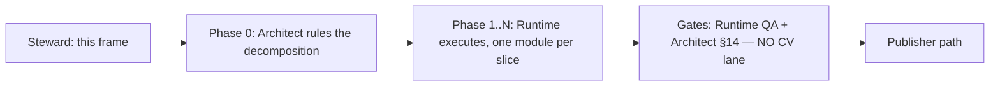

# RT-SPLIT — decompose `cranelift_backend.rs`

**Owner:** Team Runtime · **Size:** L (a slice series) · **Risk:** medium
(large diff, low semantic content) · **Gate:** none — maintainability work,
feeds no G-gate · **Deps:** none (PX8 series complete and landed)

**Status:** frame authored; **Phase 0 ruling DELIVERED and transcribed below
(§10) — it is the binding decomposition.** Execution waits only on the Runtime
ring becoming free (it is sequential and currently on RT-PARITY).

## 1. Objective

`crates/ken-runtime/src/cranelift_backend.rs` is **22,081 lines** in a single
flat module. Decompose it into coherent submodules **without changing any
behavior**. The value is entirely in future legibility and review cost: every
Runtime WP for the last several series has landed in this one file, and both
the implementer and the §14 reviewer now pay a 22k-line orientation tax on
every change.

This WP is a **pure move**. It buys no features, fixes no defects, and changes
no semantics.

## 2. Flow — and why the spec enclave is not in it

Normal WP release runs Steward-frame → spec-enclave elaboration → build team
(`steward.md §2c`). **This WP skips the enclave step deliberately:** it touches
no `spec/` and no `conformance/` path, changes no behavioral contract, and asks
no "what must this do to be correct?" question — the artifact it changes is
module structure. What it *does* need is a component-design ruling, which is
the `any → Architect` edge (COORDINATION §9). The operator directed this
explicitly: *"architect to rule on the breakdown."*

So the flow is:



**No CV vote** — the combined diff-scope touches no `spec/`/`conformance/`
path. If a slice somehow does, that slice pulls a Spec vote (§14 diff-scope);
that would itself be a signal the slice is out of scope.

## 3. Phase 0 — the Architect's ruling (blocking, and the real design work)

> **✅ DELIVERED — see §10 for the binding ruling.** This section states what
> was *asked for*; §10 is what was *ruled*. Where they differ, §10 governs.

**Runtime does not choose the seams.** The Architect rules, and the ruling
must pin four things:

1. **The module list** — the target set of submodules, each with a one-line
   charter, and a ceiling on any single resulting module.
2. **The assignment** — which items land in which module. The Architect need
   not enumerate all 191 top-level items individually; a rule per cluster plus
   the disposition of the ambiguous ones is enough.
3. **The dependency order** — the modules must form a DAG. `mod` cycles are
   legal in Rust, so nothing mechanically stops a tangled cut; the ruling is
   what prevents it.
4. **The visibility policy** — see §4, which is the constraint that actually
   decides whether a proposed cut is good.

**Slice order** is also the Architect's to set, and should be *leaf-first*: the
modules nothing else depends on move first, so each slice shrinks the residual
file without re-touching an already-moved one.

## 4. ★ The constraint that decides the cut: visibility widening

This is the non-obvious part and the reason a ruling is needed rather than a
tidy-up.

In a flat module every item is mutually accessible with **no visibility
annotation at all**. The instant the file is split, every reference that
crosses a new module boundary needs `pub(crate)` or `pub(super)`. And
`crates/ken-runtime/src/lib.rs:39` does:

```rust
pub use cranelift_backend::*;
```

— a **glob re-export**. So an item promoted to bare `pub` to satisfy a cut
does not merely become crate-visible; it lands in `ken_runtime`'s **public
API**. A cut can therefore silently widen the crate's public surface while
every test stays green, because nothing in-repo fails when a surface grows.

⇒ **The count of items that must be visibility-widened is the objective
quality metric of a proposed decomposition.** A cut that follows topic labels
but severs a tightly-coupled cluster will need hundreds of `pub(crate)`s; a
cut that follows the actual dependency structure will need few. **Prefer the
cut that minimizes widening, not the one with the prettiest module names.**

This is the expressibility shape from `steward.md §2c (b‴)`: the obligation
*"this item is an internal detail"* needs a home the compiler checks. In a
flat module the home is "it's private to the file." After a split, a bare
`pub` is a **reach outside the checked vocabulary** — the guarantee stops
being enforced and survives only as intent. `pub(crate)` keeps it enforced.
Hence AC-7.

## 5. Fixed inputs — settled, do not reopen

1. **Pure move.** No logic changes. No renames. No signature changes. No
   clippy/format drive-bys, no "while I'm here" cleanups, no dead-code
   removal. A one-line semantic change hidden in a 20k-line move diff is
   effectively invisible to review — that is the entire risk of this WP, and
   it is bought down only by the diff being *provably* a move.
2. **The crate's exported name set is invariant.** Every name reachable as
   `ken_runtime::<name>` before must be reachable after, unchanged. 25 test
   files across the workspace consume `ken_runtime::` paths.
3. **Tests move with their subject.** ~7,067 lines (32% of the file) sit in 25
   `#[cfg(test)]` blocks that exercise **private** internals. Each moves with
   the items it tests. None may be deleted, `#[ignore]`d, or weakened to make
   a move compile.
4. **CI is the venue for workspace-green** (COORDINATION §12, operator hard
   rule). Local work is `scripts/ken-cargo -p ken-runtime` only. **Never** a
   local `--workspace` — it OOMs the box and stalls the fleet.
5. **No ABI, wire-format, or codegen change.** A pure move must not perturb
   emitted code.

## 6. Grounded inventory (measured at `origin/main @ c4f55c19`)

**⚠ Perishable — re-verify against the landed code at pickup; do not trust
these numbers if the file has moved under this frame.**

| Property | Value |
|---|---|
| Total lines | 22,081 |
| Free functions (`^fn` / `^pub fn`) | 93 |
| `impl` blocks | 17 |
| Structs | 51 |
| Enums | 30 |
| `#[cfg(test)]` blocks | 25 (≈ 7,067 lines) |
| Section-comment banners | **none** — the file is flat |

The absence of banners matters: there is **no existing authorial seam to
follow**, so the decomposition must be derived from the dependency graph, not
recovered from comments.

**In-crate consumers** of `cranelift_backend::` paths:
`object_linker_packaging.rs` (11 references), `native_int_clif.rs` (1),
`lib.rs` (the glob re-export).

**Apparent clusters — a starting signal for Phase 0, NOT a pinned
decomposition.** The Architect owns the actual cut and should feel free to
discard this grouping entirely:

> **⛔ SUPERSEDED — and the ruling did discard it. DO NOT BUILD FROM THIS
> LIST.** §10.0 found that the `Lowering` impl's call graph contains a
> 29-method strongly connected component, and that splitting it along exactly
> the "control / source / host / value" lines suggested below **would
> manufacture a module cycle and is forbidden.** The list is retained only as
> a record of the pre-ruling signal. **The binding decomposition is §10.**

- **Errors / reports** — `CraneliftBackendError`, `ValidatedNativeRunError`,
  `UnsupportedLowering`, `BackendFailure`, `CraneliftRunReport`,
  `NativeDifferentialReport`, `NativeTrustReport`, `NativeToolchainReport`,
  `NativeRuntimeIrComparisonReport`, `InterpreterOracleObservation`,
  `NativeRunEvidence`, `NativeArtifactIdentity`.
- **Oriented-subcontinuation / recursor control** (the PX8-TA/DS/J surface) —
  `DynamicSpliceEdge{,Id}`, `AffineSpliceCapability`,
  `RecursorInvocationSegment`, `{Owned,Installed}OrientedSubcontinuationSegment`,
  `OwnedSelectedScope`, `RecursorUnwindStack`, `RecursorFrameProvenance`,
  `RecursorProducerOriginId`, `CheckedOrientedMarkerSets`,
  `OrientedControlLedgerEntry`, `ComputationalRecursorLayer`,
  `ComputationalRecursorFramePayload`, `SourceComputationalAnswerRoute`,
  `SelectedCaseReturnDelimiter`, `{Root,}TerminalAnswerAuthority`,
  `OpenControlObligation`, `SourceControl`, `SourceBranchFanout`,
  `SourceJoinTarget`, `SourcePredecessorEdge`, `SourceSelectedContinuation`.
- **Continuation frames / eliminators** — `ActiveContinuationFrame`,
  `ComputationalEliminatorFrame`, `OrdinaryEliminatorFrame`,
  `PendingLetContinuationFrame`, `DeferredConstructorCaseEnvironment`,
  `Continuation{Activation,Cursor}Id`, `ArmedInvocation`.
- **Value / numeric lowering** — `BoundedNatV1`, `StructuralNatV1`,
  `NativeScalarPairV1`, `DynamicConstructor{V1,AlternativeV1}`.
- **Compilation / JIT / artifact** — `CompiledModule`,
  `CraneliftObjectArtifact`, `NativeSeedEnvironment`, `Lowering`.
- **Recursive declarations** — `ActiveRecursiveDeclarationV1`,
  `CheckedRecursiveInvocationInstance`.

Note the second cluster is both the largest and the most recently churned (the
whole PX8 chain landed there). It is the highest-value extraction and probably
the hardest — the Architect should decide whether it leads or trails the
series.

## 7. Acceptance criteria

Each is checkable by a reviewer; AC-2/3/7 are the ones that make the "pure
move" claim auditable rather than asserted.

> **★ AC-2 and AC-3 were REWRITTEN 2026-07-22, after slice 1 merged**, on the
> adversary's post-merge findings and the Architect's ruling
> (`evt_1y255ges6mftc`). **Slice 1's verdict is unchanged and clean**, and it
> rests on a *conjunction*, not on any single oracle: its ordered moved content
> was reviewed directly; the adversary's line-multiset check independently
> established inventory and visibility-ledger completeness; and Runtime QA's
> pre-move coverage plus targeted tests covered the moved behavior and impl
> surface. **AC-2 established only module-level item-name identity.** What
> changed is the *evidence contract for slices 2–7*: AC-2 was carrying a claim
> it had never established, and AC-3 named a mechanism loosely enough that a
> multiset could be read as discharging it. **If you cut a slice against the
> pre-2026-07-22 wording of these two ACs, re-read them now.**

1. **Decomposition matches the ruling.** The resulting modules are exactly the
   Architect's ruled list, and no module exceeds the ruled ceiling.
2. **Module-level exported-NAME identity.** The set of *module-level item
   names* reachable as `ken_runtime::<name>` is **identical** before and
   after — verified by a sorted symbol dump taken at the merge-base and at the
   candidate tip, diffed to **empty**. The command used goes in the PR body.

   > ⛔ **State this check at its measured strength and no further** (Architect
   > ruling `evt_1y255ges6mftc`, 2026-07-22, on the adversary's measurement).
   > `cargo doc --no-deps` + hrefs from `all.html` enumerates **module-level
   > item names only.** Fields, enum variants, inherent methods, and trait
   > impls are **not names in that namespace**, so they cannot move the diff.
   > Four real public-surface mutations were run against the landed oracle and
   > **all four went undetected** (baseline 14 hrefs → mutated 14 hrefs, diff
   > empty): private field → `pub`; new public enum **variant**; new public
   > inherent **method**; **deleted `impl Display`**.
   >
   > **AC-2 is necessary, never sufficient.** Cite it in a PR body as *"no
   > module-level item name changed"* — that sentence, not "no public surface
   > change." The whole-public-surface claim is carried by **AC-3**, which is
   > where impls, methods, variants, and fields are actually held.
   >
   > This is the same defect as `DOC-VALIDATION-BINDING`, one day later in
   > another team: **an enumeration checked against another enumeration of the
   > same kind, while the property that matters lives outside the domain
   > either one iterates.**

3. **Move-purity — ORDERED item-level identity, PLUS removed-line closure.**
   For each slice, every moved production **declaration, function/method body,
   trait impl, and macro invocation** is compared against its source as an
   **ordered token sequence**, and the only permitted deltas are enumerated and
   reviewed **separately**: module/import paths, namespace wiring, and the
   exact AC-7 visibility ledger. **AND: every line removed from the parent is
   either present in the new module or listed in the AC-7 ledger.** State both
   mechanisms in the PR body.

   > ### ⛔ THE SECOND HALF IS NOT OPTIONAL — ORDERED IDENTITY CANNOT SEE A DELETION
   >
   > Added 2026-07-22 on the adversary's slice-2 finding (`evt_58rd48tw0vdjp`),
   > which measured the first half of this AC against its own four blind spots:
   > field→`pub`, new enum variant, and new inherent method are **caught** (each
   > lives inside a moved declaration, so its token sequence changes). **A
   > deleted `impl Display` is not**, and the reason is structural:
   >
   > **Ordered identity compares every moved item *against its source* — a
   > comparison over items present on BOTH sides. A deleted item has no
   > post-image, so it is never in the compared set.** It is a **presence
   > check, not a closure check**, and no amount of ordering strengthens it in
   > that direction.
   >
   > **⛔ And no other AC catches it either.** Walking a dropped *unreferenced*
   > item through all seven: **AC-1** module list unchanged → blind; **AC-2**
   > only module-level *public* names, and the item may be private → blind;
   > **AC-3** not in the compared set → blind; **AC-4** count preserved, nothing
   > references it → blind; **AC-5** compiles, being unreferenced → blind;
   > **AC-6** not codegen → blind; **AC-7** a deletion widens nothing → blind.
   >
   > **The removed-line multiset was the only net for absence, and it was not a
   > criterion** — it appeared only in prose. On slice 2 it produced:
   > `removed-from-parent 270 unique non-blank, present in planning.rs 261,
   > NOT present exactly 9` — and those 9 are byte-for-byte the AC-7 ledger
   > (5 fns, 1 struct, 3 fields). **Slice 2 was clean; it just was not clean
   > *because of an AC*.** It costs one command.
   >
   > **The worst case this closes is a silently-lost `impl Drop`** — invisible
   > to AC-2 (not a module-level name), invisible to AC-3 (no post-image),
   > compiles clean when removed, and behaviourally load-bearing. The residual
   > parent has exactly **three**; `:3188` `impl Drop for Restore` is genuinely
   > load-bearing (pure save/restore with no entry normalization — losing it
   > latches `PX8DS_RETIRED_FLAT_ORDER` true for the rest of the thread) and is
   > defended by a real two-arm discriminator at
   > `ken-cli/tests/px8ta_oriented_subcontinuation.rs:272-300`. The other two
   > are defensively redundant, clearing state at entry as well as in `drop`.
   >
   > This is [[completeness-gate-must-be-bidirectional]] in an AC: **a check
   > that ranges over what survived can only ever confirm what survived.**

   > ### ⚠ AC-2 CALIBRATION — a private-only slice must SAY SO, not cite a number
   >
   > All nine items slice 2 moved were **private** pre-split, so they were never
   > among the 338 module-level names. **`338 → 338` was incapable of moving for
   > that slice** — it is not weak evidence there, it is *no* evidence.
   > Consistent with "necessary, never sufficient," but a reader tallying green
   > checks will over-count. **If a slice moves only private items, state that
   > AC-2 is vacuous for it rather than reporting the unchanged number.**
   > Slices 3 and 4 move behavior and will not have this property.

   > ⛔ **Order is load-bearing; a multiset is not enough.** A normalized line
   > multiset is excellent as a **second inventory net** — it exposes
   > dropped/added lines and it *produces* the AC-7 ledger as a measurement
   > rather than as an author's enumeration confirmed after the fact — but it
   > **discards order and context.** Swapping two effectful statements
   > preserves the multiset and changes behavior. Use it; do not let it stand
   > in for ordered identity.
   >
   > ⛔ **"The tests pass" is not evidence of move-purity.** It is evidence of
   > behavior on the paths the tests reach. Retain pre-move coverage
   > measurement plus targeted green as the **behavior** net — especially for
   > trait impls and macro-generated behavior — but **never substitute tests
   > for ordered move identity.**
   >
   > ⛔ **There is no "restructuring class" that relaxes this.** Every RT-SPLIT
   > **production** slice remains move-pure under this AC and §10.5. The word
   > *restructuring* may describe namespace scaffolding, imports, test-file
   > redistribution, or the final facade — it **does not authorize production
   > logic or content change** in any slice. Applied to the ruled order:
   > slices **2** (`planning`), **3** (`compiled`), **5** (lowering support),
   > and **6** (`artifact`) are predominantly ordered item moves; slice **4**
   > (`lowering::core`) adds hierarchy and test scaffolding and slice **7**
   > adds `artifact::api` plus the explicit facade — for those two, the **new
   > wiring** gets its own separate review pass, and the moved production text
   > is still held to ordered identity.
   >
   > ⛔ **And nothing in this AC is discharged by a byte-identity check of
   > whole files.** Byte-identity goes red on lawful import and visibility
   > churn — it was ruled out (operator, 2026-07-22) and stays out. The unit
   > is the **moved item**, not the file.

> ### ★ THE EVIDENCE HEURISTIC BEHIND AC-2, AC-3, AND AC-7
>
> Adopted 2026-07-22 from the Runtime ring's slice-2 retros (implementer
> `evt_22zh45vfbvppj`, leader `evt_66xzjpkxg77gv`). It generalizes past this WP
> and applies to every ledger, inventory, or count in any frame:
>
> > **A ledger or inventory is stronger as the OUTPUT of a mechanism than as an
> > assertion the mechanism confirms.**
>
> The weaker reading — *"check your list twice"* — sounds identical and is not
> the point. The point is that **an author's enumeration can only ever be
> checked for the items the author thought to list.** A check that *confirms* a
> list is bounded by the list; a check that *emits* the list is bounded by the
> code. Only the second can surprise you.
>
> **Concretely, in this WP:** the AC-7 visibility ledger is the **output of the
> AC-3 ordered diff**, not an author's enumeration that the diff later agrees
> with. Report it that way.
>
> **This is the same defect the §7 rewrite corrected one layer up** — AC-2 was
> an enumeration of module-level names checked against another enumeration of
> module-level names, structurally blind to fields, variants, methods, and
> trait impls. Three occurrences in two days across three artifacts, so treat
> it as a standing review question rather than a fixed instance: **for every
> count or list in an evidence package, ask whether it was measured or
> asserted.**
>
> Applies to aggregates too. **A total is an assertion; the rows are the
> measurement.** The slice-2 implementer twice computed an aggregate with a
> line-anchored pattern and nearly reported a fictional coverage table — caught
> both times by dumping rows rather than trusting the total.

4. **Test preservation.** All 25 `#[cfg(test)]` blocks compile and pass. The
   total test-function count is unchanged; no test is deleted, `#[ignore]`d,
   or has an assertion weakened. Report the before/after count.
5. **Targeted green locally, workspace-green in CI.**
   `scripts/ken-cargo test -p ken-runtime` green on the candidate; the full
   `--workspace --locked` run is **CI's**, polled by the publisher path.
6. **Codegen unperturbed.** The native differential and any frozen native
   fixture remain green and **unmodified**. If a frozen fixture needs an
   update, the move was not pure — stop and escalate rather than
   re-baselining.
7. **No public-surface widening.** No item gains bare `pub` that did not have
   it. Every new cross-module visibility is `pub(crate)` or `pub(super)`, and
   the **count** of items so widened is reported per slice in the PR body
   (it is the metric from §4).

## 8. Guardrails — do not reopen

- **Do not redesign the backend.** If you find something that looks wrong
  while moving it, **move it unchanged and file it separately.** A defect
  found during a refactor is a follow-up WP, never a bundled fix.
- **Do not widen visibility to make a test reach its subject.** If a test
  cannot reach what it tests after a cut, the *cut* is wrong — escalate to the
  Architect for a seam revision. Silently promoting an item to `pub` to buy
  green inverts AC-7 into a rubber stamp.
- **Do not bundle the adversary docket items.** F4/F5/F6 are open against
  neighbouring surfaces and are being classified separately; none of them
  lands here.
- **Do not touch `crates/ken-interp/`, `crates/ken-host/`, or any `catalog/`,
  `spec/`, or `conformance/` path.** If a slice appears to need one, that is
  an escalation, not a scope stretch.
- **Every anchor in this frame is perishable.** The §6 figures and the §4
  `lib.rs:39` citation were measured at `origin/main @ c4f55c19`. Re-verify at
  pickup; **if a fixed input turns out false against the landed code, say so
  and escalate — do not quietly build around it.**

## 9. Sequencing and branches

- Frame branch: `wp/rt-split-frame` (Steward's; merges and dies).
- Build branches: `wp/rt-split-<n>-<slug>`, each cut **fresh from current
  `origin/main`** after the previous slice lands. A squash-merged branch
  cannot be continued.
- **Each slice is independently behavior-preserving, independently green, and
  independently mergeable.** This is not a land-together assembly — a slice
  that only makes sense alongside the next one is mis-cut.
- Rebase each slice onto current `origin/main` before its merge Decision;
  "rebased onto current main" is a perishable claim (§14(5)).

## 10. Phase 0 ruling — DELIVERED (Architect, `evt_1q0cdpv9qrjxe`)

Grounded at `origin/main @ 244cfe9c`; the §6 perishable inputs were
re-confirmed still true (22,081 lines, `lib.rs` glob export unchanged).

**This section is the binding decomposition.** It is transcribed here because
an in-thread ruling is not a durable deliverable — build from this file, never
from the convo thread.

### 10.0 Why the topical cut is forbidden

The cut is driven by the **call graph**, not by the apparent topic list. The
`Lowering` impl has **108 methods**. Its direct self/associated-call graph has
one **29-method strongly connected component occupying 5,864 method-body
lines**. The other **79 methods occupy 3,506 lines**; there are **145 calls
from the SCC into those helpers and zero calls from those helpers back into
the SCC**.

⇒ Splitting that SCC into "control", "source", "host", and "value" production
modules — i.e. the cluster grouping this frame listed in §6 as a *starting
signal only* — **would manufacture a module cycle and a broad visibility seam.
It is forbidden.**

### 10.1 Pinned production modules

**No physical Rust module file may exceed 6,500 lines after `rustfmt`.** Do
not satisfy the ceiling with a giant inline module; the ceiling applies to
each `.rs` module body too.

1. `cranelift_backend/mod.rs` — facade only: module declarations and explicit
   re-exports preserving the exact old `ken_runtime::<name>` surface.
2. `cranelift_backend/surface.rs` — reports, evidence, errors, outward data
   types, `NativeSeedEnvironment`, and their `Display`/`Error`/`From` impls.
3. `cranelift_backend/planning.rs` — native-join/oriented-plan extraction,
   checked-marker census, pre-emission transport validation; no CLIF emission.
4. `cranelift_backend/compiled.rs` — `CompiledModule`, `CompiledExpr`,
   `ResultDecoder`, result-table ownership, JIT result decoding/execution.
5. `cranelift_backend/lowering/mod.rs` — `Lowering` state, lowered-value and
   continuation/control data model, pure free helpers, and the 79 acyclic
   support methods outside the SCC.
6. `cranelift_backend/lowering/core.rs` — the **indivisible 29-method lowering
   SCC** plus `compile_expr_into_module`; the recursive lowering engine.
7. `cranelift_backend/artifact/mod.rs` — ISA/module setup and private
   JIT/object compilation and materialization machinery.
8. `cranelift_backend/artifact/api.rs` — the existing public and crate-facing
   run, validation, comparison, and object-emission entrypoints and their
   orchestration.

**Required test modules:** `planning/tests.rs` · `artifact/tests.rs` ·
`artifact/api/tests.rs` · `lowering/core/tests/mod.rs` (shared test-only
fixtures) · `lowering/core/tests/control.rs` ·
`lowering/core/tests/constructors.rs` · `lowering/core/tests/effects.rs` ·
`lowering/core/tests/values.rs` · **`cranelift_backend/test_support.rs`**
(§10.2a — facade-level shared fixtures only, **not** a `mod tests`). The
6,500-line ceiling applies to these too. **No residual omnibus `mod tests`
remains in the facade.**

### 10.2 Assignment rule

- **`surface.rs`** — the current report/evidence/error declarations from the
  top of the file, `NativeSeedEnvironment`, the report/error impls, and
  `unsupported`/`backend`/`backend_module`.
- **`planning.rs`** — `native_join_plan_for_program`,
  `oriented_subcontinuation_plan_for_program`,
  `collect_checked_subcontinuation_frames`, the checked-marker collectors and
  exact-location checks, and `validate_oriented_subcontinuation_transport`.
- **`compiled.rs`** — exactly the compiled container, decoder, JIT `run`, and
  their directly-owned decoding state. **It does not own compilation policy.**
- **`artifact/mod.rs`** — `compile_expr`, `compile_program_expr`,
  `compile_expr_with_declarations{,_and_process_input}`, object/JIT module
  creation, verifier invocation, target naming, private object/JIT
  materializers.
- **`artifact/api.rs`** — all outward runners, preflight and
  differential/report orchestration, existing object-emission entrypoints.
- **`lowering/core.rs`** — `compile_expr_into_module` and exactly this SCC:
  `lower_recursor_residual_call`, `lower_computational_match_expr`,
  `lower_computational_producer_expr`, `resume_active_continuation`,
  `lower_computational_match_value_composed`, `lower_bounded_nat_computational`,
  `materialize_eliminator_frame_env`, `lower_source_machine`,
  `lower_source_machine_with_continuation`,
  `lower_source_machine_with_continuation_inner`,
  `lower_source_bounded_nat_match`, `lower_source_dynamic_bool_match`,
  `lower_source_dynamic_host_result_match`,
  `lower_source_dynamic_constructor_match`,
  `lower_source_nested_dynamic_constructor_match`,
  `lower_source_planned_dynamic_constructor_match`, `source_call_state`,
  `lower_source_declaration_call`, `lower_expr`, `lower_process_host_effect`,
  `lower_unary_recursive_nat_fold`, `lower_recursive_declaration_call`,
  `lower_declaration_ref`, `lower_borrowed_match`,
  `lower_borrowed_option_match`, `lower_dynamic_host_result_match`,
  `lower_bounded_nat_match`, `lower_dynamic_constructor_match`,
  `lower_primitive_call`.
- **`lowering/mod.rs`** — every other `Lowering` method; the private
  lowered-value, recursive-declaration, continuation, source-machine,
  oriented-control, bounded-Nat, dynamic-constructor and scalar-pair types
  plus their free helpers; the recursive-argument helpers after the impl.

**Ambiguous dispositions (ruled):**

- `with_px8ds_retired_flat_order` and the PX8 test/mutation ledgers stay with
  lowering; the facade explicitly re-exports their pre-existing visibility.
- `Px8trTrapProvenanceEvent`, `NativeIntLoweringMutation`, and
  `NATIVE_INT_LOWERING_MUTATION` remain **test-only lowering** ownership — not
  artifact, not surface.
- `ResultDecoder` belongs to `compiled`, **not** value lowering.
- `reject_program_blockers` belongs to `artifact/api`, **not** planning.
- Dynamic-constructor validation/selection and source-continuation free
  helpers belong to **lowering support**; their callers in the SCC do not make
  them part of the SCC.
- Test helpers go in the lowest `tests/mod.rs` ancestor shared by their actual
  users. **They never justify widening a production item.** ⚠ That sentence
  **presumes a helper has a single subject tree, which is false for this
  file** — see §10.2a for the cross-tree case.

#### 10.2a Cross-tree test helpers (Architect, `evt_5nbk14ckbbe6z`)

**The rationale is one unhandled branch, NOT a recurrence count.** §10.2
already says a shared helper goes at its actual-user LCA. The gap is that when
that LCA is **the facade**, the final topology offers **no lawful narrow
home** — `test_support.rs` supplies exactly that missing structural case
without reviving an omnibus test module. **One grounded counterexample is
sufficient to make the placement rule total**; there is no threshold to reach,
and future items follow the decision procedure below rather than analogy or
counts.

**The one grounded counterexample** is `test_only_distinguished_root_join_plan`
`:270` — a genuine shared fixture helper (it constructs plan/site fixture
state), census **seven occurrences**: one declaration, three calls in test-only
object-emission/API helpers at `:311`, `:580`, `:625`, and three in
lowering-subject fixtures at `:15822`, `:18546`, `:18821`. Its users span
`lowering` and `artifact/api`; LCA is the facade.

**`new_jit_module` and `verify_cranelift_function` are CONTRAST CASES, not
precedents.** They are also cross-tree, and they resolve **differently** —
they are production-private artifact operations whose test-only one-call
wrappers stay in `artifact/mod.rs` under §10.5a. **⛔ Do not read "three
cross-tree items" as "three instances of one rule."** Classify first:

| category | test | disposition |
|---|---|---|
| **owner-adjacent boundary adapter** — one call, no setup or fixture construction | body is a single delegating call | **§10.5a** — `#[cfg(test)] pub(super)` adapter beside the private original, in its **owning** module |
| **genuine fixture/setup helper** — body constructs shared state | e.g. builds `NativeJoinPlanV1`, site metadata, fingerprints | **this clause** — `test_support.rs`, but only when the actual-user LCA is the facade |

**The rule:**

1. Add `#[cfg(test)] mod test_support;` as a **private child of
   `cranelift_backend`**, and `cranelift_backend/test_support.rs` in the final
   tree.
2. A genuine fixture/setup helper whose users span **two or more** ruled
   subject-test subtrees **and** whose LCA is the facade lives there. Items are
   `pub(super)` only; **production modules must not import it.**
3. `test_support.rs` contains **no `#[test]` cases, assertions, subject-specific
   tests, production policy, or owner-private boundary adapters** — only the
   minimal shared fixture constructors/data that cannot live in a lower
   `tests/mod.rs` ancestor. **This is what keeps it from becoming the forbidden
   residual omnibus `mod tests`.**
4. **Single-subtree helpers still follow the existing rule.**
   `oriented_dynamic_sibling_fixture` and `root_authority_test_lowering` stay
   in `lowering/core/tests/control.rs`.
5. **Owner-adjacent transparent adapters remain governed by §10.5a**, not this
   clause. The JIT/verifier bridges stay in `artifact/mod.rs` as approved.
6. Move `test_only_distinguished_root_join_plan` to `test_support.rs` in
   **slice 7**, when `artifact::api` and the final facade are cut. Until then
   it may remain at the residual parent; **no temporary widening is needed.**
7. Absent from production builds; **zero** against the AC-7 production seam
   budget; reported in the separate test-scaffolding ledger. **Any production
   consumer, subject logic, or helper that could live under a lower common test
   ancestor is a stop-and-return, not permission to grow the module.**

**Deterministic placement test for slices 5–7:** classify adapter vs fixture
helper → for a fixture helper, compute the **actual-user** LCA → use
`test_support.rs` **only** when that LCA is the facade.

**Test assignment is by subject:** `oriented_*`, `px8j_*`, root-authority,
join-site, source-install and recursor tests → `control`; constructor-field,
dynamic-constructor, nested-computational and heterogeneous-eliminator tests →
`constructors`; host-reply, bounded-Nat, IO, borrowed-ingress and native-int
tests → `effects`; scalar/bytes/string/closure/primitive lowering tests →
`values`; certificate, preflight, differential and outward-runner tests →
`artifact/api/tests.rs`; exact JIT/object/ISA tests → `artifact/tests.rs`. **A
test spanning two topics is assigned by the private item whose behavior it
directly discriminates.**

### 10.3 Dependency DAG

Arrows mean "caller depends on callee":

```
facade          -> artifact::api, surface, existing lowering test hooks
artifact::api   -> artifact, planning, surface
artifact        -> lowering::core, compiled, planning, surface
lowering::core  -> lowering support, compiled, planning, surface
lowering support-> surface
planning        -> surface
compiled        -> surface
```

**There are no reverse edges.** In particular: `artifact` never imports
`artifact::api`; lowering support never calls `lowering::core`; and no
implementation module imports through the facade. Module declarations and
facade re-exports are **namespace wiring, not permission to introduce a
semantic back-edge**.

### 10.4 Visibility policy

- The facade uses **explicit re-export lists only**. No internal
  `pub use child::*`; the existing `lib.rs` glob remains unchanged.
- Existing bare-`pub` declarations stay bare `pub`; existing `pub(crate)`
  declarations retain that visibility. Explicit facade re-exports may expose
  **only** already-exported names.
- **No private declaration may gain bare `pub`.**
- A new production seam uses the narrowest `pub(super)` or
  `pub(in crate::cranelift_backend)`. **New `pub(crate)` is prohibited**
  unless an already-landed consumer outside `cranelift_backend` requires it.
- **Hierarchy is load-bearing:** `lowering::core` is a child of the module
  owning `Lowering` state/support, and `artifact::api` is a child of
  `artifact`. **Descendants consume ancestor-private items without widening
  them.**
- Tests move below their subject. **A production visibility change made only
  for a test is a seam failure.**
- **★ BUDGET — at most 24 newly visibility-widened declarations over the whole
  series, and at most 12 in one slice.** Existing visibility and explicit
  re-exporting of an already-exported name do not count. **Count fields
  individually.** If either budget would be exceeded, **stop and return the
  proposed extra seams to the Architect — do not spend through the cap.**
- Every slice reports a **before/after exported-name dump** and an **exact
  visibility ledger**: item, old visibility, new visibility, cross-module
  consumer.

**Expected widest single seam:** `compiled.rs` — its private container fields
are shared by artifact construction and lowering completion. That is a real
shared boundary and may consume most of one slice's allowance. The `Lowering`
fields and the 79 support methods should consume **zero** new visibility,
because `core` is their descendant.

### 10.4a ⛔ SLICE 3 SEAM REVISION — the budget forced an encapsulated seam

**Architect ruling `evt_725trc8dfag3c`, 2026-07-22, after slice 2's ledger.**
This is a **§10.5 seam revision**, binding on slice 3. It is **not** permission
to spend through the cap.

**The arithmetic from landed code is decisive:**

| slice | new widenings |
|---|---:|
| 1 `surface` | 3 |
| 2 `planning` (candidate) | 9 → **cumulative 12** |
| 3 `compiled`, **literal** extraction — `CompiledModule` + its eight fields + `CompiledExpr` + `ResultDecoder` + `run` | **12** |
| 4 — `lowering::core::compile_expr_into_module` exposed to sibling `artifact` at `pub(in crate::cranelift_backend)`, unavoidable | ≥ 1 |

**A literal field widening reaches 25 before slices 5–7 even start.** The 24
cap is therefore **doing its job**: it forces an encapsulated seam rather than
normalizing a bag of public-to-parent fields. **Do not raise the cap.**

**Required slice-3 shape:**

1. Move `CompiledModule`, `CompiledExpr`, `ResultDecoder`, and `run` to
   `compiled.rs` as already ruled.
2. Add **one** parent-confined associated constructor, exact intent
   `pub(super) fn from_parts(...) -> Self`, used at the existing **three**
   `CompiledModule { … }` construction sites. **Its body is a transparent
   one-to-one struct literal: no validation, no defaults, no clones, no
   reordering, no policy.** This is the explicitly authorized
   **namespace-wiring delta** — ledger it and review it **separately** from
   ordered moved-item identity (§7 AC-3).
3. **Keep construction-only fields private:** `func_id`, `decoder`,
   `result_table`, `trap`.
4. **Only the four fields consumed outside `compiled` may be `pub(super)`:**
   `module`, `verifier_passed`, `assumptions`, `unsupported`. Their reachable
   set is **delta-zero** relative to parent-private fields before extraction.
5. `CompiledModule`, `CompiledExpr`, `ResultDecoder`, `from_parts`, `run`, and
   those four fields are **9 slice-3 seams, not 12. Count the new constructor
   as a seam.**
6. Slice 4's `compile_expr_into_module` is the forecast **tenth** post-planning
   seam. **Projected series total 22**, leaving two items of contingency.
   Slices 5–7 are still expected to consume **zero** new widenings, because
   `core` is a descendant of lowering support and `api` is a descendant of
   `artifact`. **Any contrary dry-run stops before cutting.**

**Before slice 3 moves any code:** produce the proposed exact visibility ledger
and confirm projected cumulative **≤ 24**. **If the constructor cannot remain
the transparent packing seam described above, stop and return the actual
consumer graph** — do not improvise a validating or defaulting constructor to
make the arithmetic work.

> **⚠ Why this is worth the ceremony.** The tempting move at slice 3 is to
> widen the eight fields and note that the budget is "nearly" fine. That
> normalizes a container whose internals are public to its parent, which is the
> precise outcome the decomposition exists to avoid — and it would be
> discovered at slice 6, when there is no cheap way back. **The budget is not a
> resource to consume efficiently; it is a detector for a seam that should have
> been encapsulated.**

### 10.5 Slice order

1. `surface`
2. `planning`
3. `compiled`
4. `lowering::core` plus its subject tests
5. `lowering` support/state plus its remaining subject tests
6. `artifact` plus artifact tests
7. `artifact::api`, API tests, and the final explicit facade

Slices 1–3 are true leaves. **The control SCC then LEADS rather than trails
the lowerer extraction — the one deliberate exception to leaf-first.** In
slice 4, create the final `lowering/mod.rs` scaffold with a private import of
the still-residual parent items, and make `core.rs` import only from its
parent. In slice 5, move those residual state/support items into
`lowering/mod.rs`; **`core.rs` is not touched again.** Moving support first
would force temporary widening of every field/method merely so the residual
parent could reach into its child.

Each slice is independently green and mergeable, starts fresh from the newly
landed `origin/main`, moves one production module plus its tests, and does not
re-touch a previously moved module. **If move-purity, the visibility budget,
or the DAG cannot be demonstrated for a slice, that slice stops for seam
revision — it does not improvise a topical split.**

### 10.5a ⛔ SLICE-6 TEST-BOUNDARY SEAM (Architect, `evt_473mn1qmaw7bf`)

> **Fold this before slice 6 is framed.** Surfaced by the slice-4 dry-run
> (`§10.4a`) — which is exactly what that dry-run exists to do — and ruled
> before slice 6 rather than discovered inside it.

> **Slice-6 test-boundary seam.** Keep `new_jit_module` and
> `verify_cranelift_function` private in `artifact/mod.rs`. Their production
> ownership does not move. Because lowering's subject fixtures become a
> sibling test subtree, slice 6 adds exactly two adjacent
> `#[cfg(test)] pub(super)` one-call bridge functions in `artifact/mod.rs`,
> named `new_jit_module_for_lowering_tests` and
> `verify_cranelift_function_for_lowering_tests`. Only `lowering/core/tests/*`
> calls the bridges; `artifact/tests.rs` calls the private originals. The
> bridges contain no ISA flags, validation, defaults, transformation, or error
> remapping. They are reported separately as test scaffolding, absent from
> production builds, and consume zero of the AC-7 production visibility
> budget. No facade `mod tests`, shared production helper, helper duplication,
> production widening, or DAG edge is introduced. A slice-6 dry-run that finds
> any non-test lowering consumer stops and returns the actual graph.

**Why this does not engage the constraints that appeared to exclude it.** A
`#[cfg(test)]` bridge is **not a production item**, so §10.2's *"test helpers
never justify widening a **production** item"* is not engaged; the bridge lives
in `artifact/mod.rs`, so §10.1's residual-omnibus-facade ban is not engaged;
and the pair stays artifact-owned, so §10.2's assignment stands unamended.

> **The bridges are not shared test helpers under that placement rule:** they
> contain no setup, fixture construction, assertion, policy, or duplicated
> helper logic. They are artifact-owned, `cfg(test)`-only boundary adapters
> adjacent to the private operations they expose; all actual test-helper logic
> remains in the ruled subject test modules.

That last point answers §10.2's **first** sentence — *test helpers go in the
lowest `tests/mod.rs` ancestor shared by their users* — which the
production-widening argument alone leaves open. **§10.2 ownership does not
change** — this is a test-boundary note under §10.4/§10.5, not a reassignment.

**The complete inverse-call ledger** (Architect, `evt_445j846aqqtwp`). The
JIT/verifier pair has **six** distinct test users, not the two trees first
reported. Two of them appeared in no ledger — both inside the omnibus
`#[cfg(test)] mod tests` at `:14096–:21177` that §10.1 requires be dissolved —
and §10.2's subject rule determines their destinations:

| fixture | line | destination |
|---|---|---|
| `run_px8j_malformed_recursor_consumer` | `:1463` | `lowering/core/tests/control.rs` |
| `run_checked_bounded_nat_fixture` | `:1641` | `lowering/core/tests/effects.rs` |
| `run_dynamic_constructor_dispatch_fixture` | `:1868` | `lowering/core/tests/constructors.rs` |
| **`run_px8ds_edge_consumer`** | **`:14741`** | **`lowering/core/tests/control.rs`** |
| **`run_borrowed_fixture`** | **`:18535`** | **`lowering/core/tests/effects.rs`** |
| `px8i_*` (two tests) | `:20977`, `:21005` | `artifact/tests.rs` — calls the private originals |

**The user count does not multiply the bridges.** There are exactly **two**
one-call adapters — one per private artifact operation — not one per tree or
per fixture. Five lowering fixture helpers across `control`, `effects`, and
`constructors` call the same two bridges. This is why the correction completes
the ledger without reopening the ruling: **it would only have mattered under a
per-tree-duplication remedy, which the bridge shape removes from
consideration.** Moving the production functions to the facade would weaken a
ruled ownership boundary to solve a test-only reachability problem that is
already solved without production exposure. **Expand the slice-6 deferred
ledger from the original three fixtures to this complete set.**

**And enumerate type placement explicitly in the slice-5 dry-run.** §10.2
assigns *functions* explicitly and leaves **type** placement implicit. The
fixtures name 20 parent-private types and all 20 happen to be lowering-side,
so exposure came out zero — **fortunate, not established.** Do not let a clean
result recur twice and start reading as a property.
