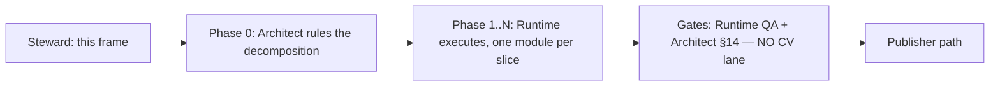

# RT-SPLIT — decompose `cranelift_backend.rs`

**Owner:** Team Runtime · **Size:** L (a slice series) · **Risk:** medium
(large diff, low semantic content) · **Gate:** none — maintainability work,
feeds no G-gate · **Deps:** none (PX8 series complete and landed)

**Status:** frame authored; **Phase 0 (Architect decomposition ruling) is
BLOCKING** and not yet cast.

## 1. Objective

`crates/ken-runtime/src/cranelift_backend.rs` is **22,081 lines** in a single
flat module. Decompose it into coherent submodules **without changing any
behavior**. The value is entirely in future legibility and review cost: every
Runtime WP for the last several series has landed in this one file, and both
the implementer and the §14 reviewer now pay a 22k-line orientation tax on
every change.

This WP is a **pure move**. It buys no features, fixes no defects, and changes
no semantics.

## 2. Flow — and why the spec enclave is not in it

Normal WP release runs Steward-frame → spec-enclave elaboration → build team
(`steward.md §2c`). **This WP skips the enclave step deliberately:** it touches
no `spec/` and no `conformance/` path, changes no behavioral contract, and asks
no "what must this do to be correct?" question — the artifact it changes is
module structure. What it *does* need is a component-design ruling, which is
the `any → Architect` edge (COORDINATION §9). The operator directed this
explicitly: *"architect to rule on the breakdown."*

So the flow is:



**No CV vote** — the combined diff-scope touches no `spec/`/`conformance/`
path. If a slice somehow does, that slice pulls a Spec vote (§14 diff-scope);
that would itself be a signal the slice is out of scope.

## 3. Phase 0 — the Architect's ruling (blocking, and the real design work)

**Runtime does not choose the seams.** The Architect rules, and the ruling
must pin four things:

1. **The module list** — the target set of submodules, each with a one-line
   charter, and a ceiling on any single resulting module.
2. **The assignment** — which items land in which module. The Architect need
   not enumerate all 191 top-level items individually; a rule per cluster plus
   the disposition of the ambiguous ones is enough.
3. **The dependency order** — the modules must form a DAG. `mod` cycles are
   legal in Rust, so nothing mechanically stops a tangled cut; the ruling is
   what prevents it.
4. **The visibility policy** — see §4, which is the constraint that actually
   decides whether a proposed cut is good.

**Slice order** is also the Architect's to set, and should be *leaf-first*: the
modules nothing else depends on move first, so each slice shrinks the residual
file without re-touching an already-moved one.

## 4. ★ The constraint that decides the cut: visibility widening

This is the non-obvious part and the reason a ruling is needed rather than a
tidy-up.

In a flat module every item is mutually accessible with **no visibility
annotation at all**. The instant the file is split, every reference that
crosses a new module boundary needs `pub(crate)` or `pub(super)`. And
`crates/ken-runtime/src/lib.rs:39` does:

```rust
pub use cranelift_backend::*;
```

— a **glob re-export**. So an item promoted to bare `pub` to satisfy a cut
does not merely become crate-visible; it lands in `ken_runtime`'s **public
API**. A cut can therefore silently widen the crate's public surface while
every test stays green, because nothing in-repo fails when a surface grows.

⇒ **The count of items that must be visibility-widened is the objective
quality metric of a proposed decomposition.** A cut that follows topic labels
but severs a tightly-coupled cluster will need hundreds of `pub(crate)`s; a
cut that follows the actual dependency structure will need few. **Prefer the
cut that minimizes widening, not the one with the prettiest module names.**

This is the expressibility shape from `steward.md §2c (b‴)`: the obligation
*"this item is an internal detail"* needs a home the compiler checks. In a
flat module the home is "it's private to the file." After a split, a bare
`pub` is a **reach outside the checked vocabulary** — the guarantee stops
being enforced and survives only as intent. `pub(crate)` keeps it enforced.
Hence AC-7.

## 5. Fixed inputs — settled, do not reopen

1. **Pure move.** No logic changes. No renames. No signature changes. No
   clippy/format drive-bys, no "while I'm here" cleanups, no dead-code
   removal. A one-line semantic change hidden in a 20k-line move diff is
   effectively invisible to review — that is the entire risk of this WP, and
   it is bought down only by the diff being *provably* a move.
2. **The crate's exported name set is invariant.** Every name reachable as
   `ken_runtime::<name>` before must be reachable after, unchanged. 25 test
   files across the workspace consume `ken_runtime::` paths.
3. **Tests move with their subject.** ~7,067 lines (32% of the file) sit in 25
   `#[cfg(test)]` blocks that exercise **private** internals. Each moves with
   the items it tests. None may be deleted, `#[ignore]`d, or weakened to make
   a move compile.
4. **CI is the venue for workspace-green** (COORDINATION §12, operator hard
   rule). Local work is `scripts/ken-cargo -p ken-runtime` only. **Never** a
   local `--workspace` — it OOMs the box and stalls the fleet.
5. **No ABI, wire-format, or codegen change.** A pure move must not perturb
   emitted code.

## 6. Grounded inventory (measured at `origin/main @ c4f55c19`)

**⚠ Perishable — re-verify against the landed code at pickup; do not trust
these numbers if the file has moved under this frame.**

| Property | Value |
|---|---|
| Total lines | 22,081 |
| Free functions (`^fn` / `^pub fn`) | 93 |
| `impl` blocks | 17 |
| Structs | 51 |
| Enums | 30 |
| `#[cfg(test)]` blocks | 25 (≈ 7,067 lines) |
| Section-comment banners | **none** — the file is flat |

The absence of banners matters: there is **no existing authorial seam to
follow**, so the decomposition must be derived from the dependency graph, not
recovered from comments.

**In-crate consumers** of `cranelift_backend::` paths:
`object_linker_packaging.rs` (11 references), `native_int_clif.rs` (1),
`lib.rs` (the glob re-export).

**Apparent clusters — a starting signal for Phase 0, NOT a pinned
decomposition.** The Architect owns the actual cut and should feel free to
discard this grouping entirely:

- **Errors / reports** — `CraneliftBackendError`, `ValidatedNativeRunError`,
  `UnsupportedLowering`, `BackendFailure`, `CraneliftRunReport`,
  `NativeDifferentialReport`, `NativeTrustReport`, `NativeToolchainReport`,
  `NativeRuntimeIrComparisonReport`, `InterpreterOracleObservation`,
  `NativeRunEvidence`, `NativeArtifactIdentity`.
- **Oriented-subcontinuation / recursor control** (the PX8-TA/DS/J surface) —
  `DynamicSpliceEdge{,Id}`, `AffineSpliceCapability`,
  `RecursorInvocationSegment`, `{Owned,Installed}OrientedSubcontinuationSegment`,
  `OwnedSelectedScope`, `RecursorUnwindStack`, `RecursorFrameProvenance`,
  `RecursorProducerOriginId`, `CheckedOrientedMarkerSets`,
  `OrientedControlLedgerEntry`, `ComputationalRecursorLayer`,
  `ComputationalRecursorFramePayload`, `SourceComputationalAnswerRoute`,
  `SelectedCaseReturnDelimiter`, `{Root,}TerminalAnswerAuthority`,
  `OpenControlObligation`, `SourceControl`, `SourceBranchFanout`,
  `SourceJoinTarget`, `SourcePredecessorEdge`, `SourceSelectedContinuation`.
- **Continuation frames / eliminators** — `ActiveContinuationFrame`,
  `ComputationalEliminatorFrame`, `OrdinaryEliminatorFrame`,
  `PendingLetContinuationFrame`, `DeferredConstructorCaseEnvironment`,
  `Continuation{Activation,Cursor}Id`, `ArmedInvocation`.
- **Value / numeric lowering** — `BoundedNatV1`, `StructuralNatV1`,
  `NativeScalarPairV1`, `DynamicConstructor{V1,AlternativeV1}`.
- **Compilation / JIT / artifact** — `CompiledModule`,
  `CraneliftObjectArtifact`, `NativeSeedEnvironment`, `Lowering`.
- **Recursive declarations** — `ActiveRecursiveDeclarationV1`,
  `CheckedRecursiveInvocationInstance`.

Note the second cluster is both the largest and the most recently churned (the
whole PX8 chain landed there). It is the highest-value extraction and probably
the hardest — the Architect should decide whether it leads or trails the
series.

## 7. Acceptance criteria

Each is checkable by a reviewer; AC-2/3/7 are the ones that make the "pure
move" claim auditable rather than asserted.

1. **Decomposition matches the ruling.** The resulting modules are exactly the
   Architect's ruled list, and no module exceeds the ruled ceiling.
2. **Exported-symbol-set identity.** The set of names reachable as
   `ken_runtime::<name>` is **identical** before and after — verified by a
   sorted symbol dump taken at the merge-base and at the candidate tip, diffed
   to **empty**. The command used goes in the PR body. *(This is the checkable
   home for "no public surface change"; a green suite does not prove it,
   because a surface that only ever grows breaks no in-repo caller.)*
3. **Move-purity.** For each slice, the moved text is identical to the source
   text modulo module path and the visibility annotations required by AC-7. A
   reviewer must be able to confirm this cheaply — state the mechanism in the
   PR body (`git diff --find-renames`, or a normalized before/after token
   diff over the moved ranges showing zero net content delta). **"The tests
   pass" is not evidence of move-purity** — it is evidence of behavior on the
   paths the tests reach.
4. **Test preservation.** All 25 `#[cfg(test)]` blocks compile and pass. The
   total test-function count is unchanged; no test is deleted, `#[ignore]`d,
   or has an assertion weakened. Report the before/after count.
5. **Targeted green locally, workspace-green in CI.**
   `scripts/ken-cargo test -p ken-runtime` green on the candidate; the full
   `--workspace --locked` run is **CI's**, polled by the publisher path.
6. **Codegen unperturbed.** The native differential and any frozen native
   fixture remain green and **unmodified**. If a frozen fixture needs an
   update, the move was not pure — stop and escalate rather than
   re-baselining.
7. **No public-surface widening.** No item gains bare `pub` that did not have
   it. Every new cross-module visibility is `pub(crate)` or `pub(super)`, and
   the **count** of items so widened is reported per slice in the PR body
   (it is the metric from §4).

## 8. Guardrails — do not reopen

- **Do not redesign the backend.** If you find something that looks wrong
  while moving it, **move it unchanged and file it separately.** A defect
  found during a refactor is a follow-up WP, never a bundled fix.
- **Do not widen visibility to make a test reach its subject.** If a test
  cannot reach what it tests after a cut, the *cut* is wrong — escalate to the
  Architect for a seam revision. Silently promoting an item to `pub` to buy
  green inverts AC-7 into a rubber stamp.
- **Do not bundle the adversary docket items.** F4/F5/F6 are open against
  neighbouring surfaces and are being classified separately; none of them
  lands here.
- **Do not touch `crates/ken-interp/`, `crates/ken-host/`, or any `catalog/`,
  `spec/`, or `conformance/` path.** If a slice appears to need one, that is
  an escalation, not a scope stretch.
- **Every anchor in this frame is perishable.** The §6 figures and the §4
  `lib.rs:39` citation were measured at `origin/main @ c4f55c19`. Re-verify at
  pickup; **if a fixed input turns out false against the landed code, say so
  and escalate — do not quietly build around it.**

## 9. Sequencing and branches

- Frame branch: `wp/rt-split-frame` (Steward's; merges and dies).
- Build branches: `wp/rt-split-<n>-<slug>`, each cut **fresh from current
  `origin/main`** after the previous slice lands. A squash-merged branch
  cannot be continued.
- **Each slice is independently behavior-preserving, independently green, and
  independently mergeable.** This is not a land-together assembly — a slice
  that only makes sense alongside the next one is mis-cut.
- Rebase each slice onto current `origin/main` before its merge Decision;
  "rebased onto current main" is a perishable claim (§14(5)).
