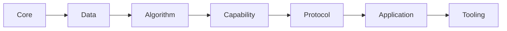

# Catalog package taxonomy proposal

**Status:** Research proposal; no package moves are performed here.
**Date:** 2026-07-15
**Scope:** `catalog/packages/`, including all 37 current Ken source entries.

## Recommendation

Adopt one controlled, seven-section catalog:

1. `Core`
2. `Data`
3. `Algorithm`
4. `Capability`
5. `Protocol`
6. `Application`
7. `Tooling`

The first four are the dependency strata already established by the
[catalog campaign charter](../docs/program/06-catalog-campaign.md). Add
`Application` and `Tooling` now because packages in both strata have landed.
Reserve `Protocol` as the next section, but do not create an empty directory
until its first package lands.

Within those sections, use this semantic hierarchy:

> **Section > Domain > optional Subdomain > Package**

The existing path rule already supports arbitrary depth: an import is the
identity spelling of its path, and the resolver does not interpret which
components are sections or domains. Extending the taxonomy with subdomains
therefore preserves the design in the [style guide][style-paths] and the
[enclave-pinned path/import decision][path-wp].

[style-paths]: ../docs/program/07-catalog-style-guide.md#13-path--import--the-normative-rule
[path-wp]: ../docs/program/wp/catalog-taxonomy-paths-imports.md

The target dependency direction is:

This is a filing and default dependency direction, not a claim that every
package uses every section to its left. A package should not depend on a
section to its right.

## What is wrong with the current tree

The current tree has **14 top-level directories for 37 source entries**. It
mixes three different kinds of name at the same level:

- dependency strata: `Core`, `Data`, `Capability`;
- subject domains: `Text`, `Parsing`, `Diagnostic`, `Pretty`, `Process`,
  `System`, `Test`, `Time`;
- individual application facilities: `ArgParse`, `Config`, `Schema`.

That makes proximity accidental. For example:

- generic parser substrate is split between `Parsing` and
  `Capability/Parsing`;
- platform-facing packages are split among `Capability/Console`,
  `Capability/FS`, `Process`, `System`, and `Time`;
- text packages are split between top-level `Text` and
  `Data/Collections/StringBijection`;
- `ArgParse`, its shared `Schema`, and `Config.Decoder` are peer top-level
  directories even though they form one application-input stack;
- a worked `ArgParse` example is filed as an importable peer package;
- the proof-erasure boundary checker is filed as an end-user capability even
  though its function is development-time verification tooling.

Several leaves are also broader than their filenames suggest:

- `Data.Collections.Collections` contains list, natural-number, string, and
  byte views;
- `Data.Collections.Map` also contains `Set` and binary-relation operations;
- `Capability.Parsing.Parsing` combines source/span infrastructure with a
  concrete Boolean grammar;
- `Text.Numeric.Numeric` combines decimal parsing, diagnostic construction,
  and decimal formatting.

Those are package-cohesion issues, not reasons to promote their current names
to sections.

## Classification rules

### Section

A Section is a broad, durable dependency stratum expected to contain several
unrelated domains. A name is not a Section merely because it currently owns a
directory. Adding a Section is an architectural decision because it changes
the catalog's long-term dependency order.

### Domain

A Domain is a stable subject vocabulary within a Section: `Collections`,
`Parsing`, `Filesystem`, or `CommandLine`. A domain should remain sensible
when the catalog is an order of magnitude larger.

### Subdomain

A Subdomain is an optional partition inside a mature Domain. Create one only
when either:

1. at least two coherent sibling families already exist; or
2. one family exists and the roadmap names at least two credible siblings.

Examples are `Data.Numeric.Nat`, `Capability.Filesystem.Path`, and future
`Protocol.DataFormat.Json`. Do not synthesize a subdomain merely to make all
paths the same depth.

### Package

A Package is one cohesive importable component. Prefer a descriptive leaf to
repeating the parent (`Capability.Console.Text`, not
`Capability.Console.Console`). Preserve the existing leaf-or-namespace rule:
a component cannot be both a file and a directory at the same level.

### Canonical home and metadata

Give each package one canonical home based on what it *does* and where it sits
in the dependency order. Record secondary facets as controlled metadata rather
than duplicating the package or adding more top-level directories. Useful
facets include:

- `platform`: portable, POSIX, Windows, browser, mobile;
- `effects`: pure, console, filesystem, clock, network;
- `assurance`: proved, tested, delegated, unknown;
- `maturity`: stable, experimental, deprecated;
- `audience`: runtime, application, development;
- `security`: cryptographic, authority-sensitive, parser-boundary;
- `artifact-kind`: library, example, checker, adapter.

Cargo is a useful precedent for keeping a controlled category vocabulary
distinct from free search keywords; its manifest documentation treats them as
separate fields and requires registry categories to match known strings
exactly ([Cargo manifest fields][cargo-categories]).

[cargo-categories]: https://doc.rust-lang.org/cargo/reference/manifest.html#the-categories-field

## Proposed section and domain catalog

Directories marked **active** have a current package mapped into them. Others
are the controlled horizon for a comprehensive catalog, not a request to add
empty directories.

| Section | Purpose | Domains and representative subdomains |
|---|---|---|
| `Core` | Minimal proof, logic, abstraction, and control vocabulary on which all ordinary packages build | **Active:** `Logic`, `Classes`. **Horizon:** `Function`, `Control`, `Type`, `Proof` |
| `Data` | Pure representations, constructors, views, instances, and representation-local operations | **Active:** `Collections`, `Sums`, `Numeric/Nat`, `Text`, `Binary`. **Horizon:** `Time`, `Identifiers`, `Trees`, `Graphs`, `Sequences` |
| `Algorithm` | General computations over `Data`, independent of an application competency | **Horizon:** `Sorting`, `Searching`, `Graph`, `Automata`, `Numeric`, `Statistics`, `Optimization`, `LinearAlgebra`, `SymbolicAlgebra`, `Geometry` |
| `Capability` | Focused competencies and interaction boundaries used by many applications | **Active:** `Parsing`, `Formatting`, `Diagnostics`, `Console`, `Filesystem/Path`, `Process`, `Time`. **Horizon:** `Network`, `Storage`, `Concurrency`, `Randomness`, `Cryptography` |
| `Protocol` | Interchange rules whose identity is an external encoding, format, or protocol | **Horizon:** `Encoding`, `Serialization`, `DataFormat`, `Compression`, `Network`, `Authentication`, `SupplyChain` |
| `Application` | Reusable application-facing facilities and frameworks assembled from lower sections | **Active:** `Input`, `CommandLine`, `Configuration`. **Horizon:** `Database`, `Service`, `Web`, `UI`, `Mobile`, `Edge`, `Workflow` |
| `Tooling` | Packages that inspect, verify, test, document, package, or transform programs and artifacts | **Active:** `Verification`, `Testing`. **Horizon:** `Benchmarking`, `Debugging`, `Profiling`, `Documentation`, `CodeGeneration`, `Packaging`, `Migration` |

This shape follows patterns visible in mature standard libraries without
copying any one library's names. Python separates data types, text and binary
processing, file formats, operating-system services, command-line facilities,
protocols, and development tools
([Python standard-library index](https://docs.python.org/3/library/index.html)).
Haskell's `base` uses broad `Control`, `Data`, and `System` namespaces and then
nests narrow families such as `Data.List.NonEmpty`; it also keeps `Map`/`Set`
and text in focused libraries rather than treating each as a top-level
universe
([Hackage `base` module index](https://hackage.haskell.org/package/base)).

## Proposed homes for every current entry

The table gives the target semantic home. “Split” rows should be separate
follow-up package edits, not mixed into the first mechanical relocation.

| Current path under `catalog/packages/` | Proposed canonical home | Rationale / follow-up |
|---|---|---|
| `ArgParse/ArgParse.ken.md` | `Application/CommandLine/ArgParse.ken.md` | Reusable command-line application facility |
| `ArgParse/Example.ken.md` | leave `packages/`; move to `catalog/examples/CommandLine/Forge.ken.md` or embed in the ArgParse entry | A worked client is evidence and documentation, not a peer library package |
| `Capability/Console/Console.ken.md` | `Capability/Console/Text.ken.md` | Text-output policy over the byte Console ABI |
| `Capability/FS/FS.ken.md` | `Capability/Filesystem/Errors.ken.md` | The file contains filesystem-error rendering, not the FS algebra itself |
| `Capability/Parsing/Parsing.ken.md` | **Phase-2 provisional:** stays at `Capability/Parsing/Parsing.ken.md` (already an allowlisted home, no move); **Phase-3** split into `Capability/Parsing/Source.ken.md` and `Capability/Parsing/Language/Boolean.ken.md` | Separates reusable source/span carriers from one concrete grammar |
| `Capability/Verify/ProofErasureBoundaryChecker.ken` | `Tooling/Verification/ProofErasureBoundaryChecker.ken` | A development-time artifact checker |
| `Config/Decoder.ken.md` | `Application/Configuration/Decoder.ken.md` | Environment/config application input decoder |
| `Core/EffectfulClasses.ken.md` | `Core/Classes/EffectfulClasses.ken.md` | `Applicative`, `Monad`, and `Traversable` class vocabulary |
| `Core/EmptyDec.ken.md` | `Core/Logic/EmptyDec.ken.md` | Computational falsity and decidability |
| `Core/LawfulClasses.ken.md` | `Core/Classes/LawfulClasses.ken.md` | Equality and ordering class vocabulary |
| `Core/LawfulFunctors.ken.md` | `Core/Classes/LawfulFunctors.ken.md` | Algebraic and constructor classes |
| `Core/NatArith.ken.md` | `Data/Numeric/Nat/Arithmetic.ken.md` | Operations and laws for the `Nat` representation |
| `Core/OrdNat.ken.md` | `Data/Numeric/Nat/Order.ken.md` | `Nat` ordering and representation-local operations |
| `Core/Transport.ken.md` | `Core/Logic/Transport.ken.md` | Equality elimination and transport utilities |
| `Data/Collections/BytesKeys.ken.md` | `Data/Binary/BytesKeys.ken.md` | Lawful byte equality is binary-data vocabulary, not a collection family |
| `Data/Collections/Collections.ken.md` | provisional `Data/Collections/Derived.ken.md`; then split by carrier | Contains list, `Nat`, string, and byte material; the final packages should live in `Collections`, `Numeric/Nat`, `Text`, and `Binary` respectively |
| `Data/Collections/Map.ken.md` | `Data/Collections/Map.ken.md`; later consider `Set.ken.md` and `Algorithm/Relation` extraction | `Map`/`Set` are data structures; relation algorithms are a separable concern |
| `Data/Collections/StringBijection.ken.md` | `Data/Text/StringBijection.ken.md` | Certificate about the `String` structural view |
| `Data/NonEmpty/NonEmpty.ken.md` | `Data/Collections/NonEmpty.ken.md` | A non-empty list representation |
| `Data/Sums/Sums.ken.md` | `Data/Sums/Combinators.ken.md` | `Option`/`Result`/`Either` combinator floor |
| `Data/Validation/Validation.ken.md` | `Data/Sums/Validation.ken.md` | An accumulating error-or-value sum |
| `Diagnostic/Core.ken.md` | `Capability/Diagnostics/Core.ken.md` | Cross-client diagnostic carrier |
| `Diagnostic/Render.ken.md` | `Capability/Diagnostics/Render.ken.md` | Cross-client diagnostic presentation |
| `Parsing/Cursor.ken.md` | `Capability/Parsing/Cursor.ken.md` | Generic parsing substrate |
| `Parsing/Decoder.ken.md` | `Capability/Parsing/Decoder.ken.md` | Generic progress-safe parsing substrate |
| `Pretty/Doc.ken.md` | `Capability/Formatting/Doc.ken.md` | General document-formatting capability |
| `Process/Arguments.ken.md` | `Capability/Process/Arguments.ken.md` | Byte-preserving process-input view |
| `Process/Environment.ken.md` | `Capability/Process/Environment.ken.md` | Byte-preserving process-input view |
| `Process/WorkingDirectory.ken.md` | `Capability/Process/WorkingDirectory.ken.md` | Byte-preserving process-input view |
| `Schema/Schema.ken.md` | `Application/Input/Schema.ken.md` | Shared application-input description used by command-line and configuration clients |
| `System/Exit.ken.md` | `Capability/Process/Exit.ken.md` | Policy over the process exit ABI |
| `System/Path/Posix.ken.md` | `Capability/Filesystem/Path/Posix.ken.md` | Platform-specific lexical filesystem paths |
| `Test/Property.ken.md` | `Tooling/Testing/Property.ken.md` | Deterministic property-test runner for developers and agents |
| `Text/Codec/Codec.ken.md` | `Data/Text/Codec.ken.md` | Pure byte/text views and classifiers |
| `Text/Numeric/Numeric.ken.md` | **Phase-2 provisional:** `Capability/Parsing/Numeric.ken.md` (combined file relocated intact out of non-allowlisted `Text/`); **Phase-3** split into `Capability/Parsing/Decimal.ken.md` and `Capability/Formatting/Decimal.ken.md` | The current file crosses parsing, diagnostics, and formatting |
| `Text/StringKeys/StringKeys.ken.md` | `Data/Text/StringKeys.ken.md` | Lawful `String` equality and order |
| `Time/Clock.ken.md` | `Capability/Time/WallClock.ken.md` | Ambient wall-clock interaction; leaves room for monotonic clocks and timers |

### Two deliberate changes to earlier pins

This proposal revisits two classifications in the earlier path/import WP:

1. `Capability.Verify` becomes `Tooling.Verification`. The earlier decision
   predated a `Tooling` Section and reasonably treated verification as a
   focused competence. In a comprehensive catalog, an artifact checker has a
   clearer audience and dependency position in `Tooling`.
2. direct `Core` leaves move into `Core.Logic` and `Core.Classes`. The earlier
   variable-depth rule remains correct; the catalog has simply grown enough
   that `Core` is now genuinely subdivided.

Because the first change supersedes an enclave-pinned classification, it
should be approved as a taxonomy decision before any mechanical move.

## Boundaries that prevent future drift

### `Data` versus `Algorithm`

`Data` owns representations, structural views, instances, and operations
intrinsic to one representation. `Algorithm` owns reusable computations over
those representations. Thus a binary-search-tree `Map` is `Data.Collections`,
while general graph traversal is `Algorithm.Graph` even if it consumes a
`Data.Graph` representation.

### `Capability` versus `Protocol`

`Capability` owns what a program can do: parse, format, access files, use a
clock, open a connection. `Protocol` owns externally specified interchange:
JSON, CBOR, HTTP, compression formats, attestations. A socket API is
`Capability.Network`; HTTP message and state-machine rules are
`Protocol.Network.Http`.

### `Capability` versus `Application`

`Capability` is reusable competence or interaction substrate. `Application`
assembles those competencies into application-facing policy and frameworks.
Generic decoder combinators are `Capability.Parsing`; command-line option
specification and help behavior are `Application.CommandLine`.

### `Application` versus `Tooling`

`Application` helps programs serve their users. `Tooling` helps developers or
agents build, inspect, verify, test, document, package, or migrate programs.
The proof-erasure checker is therefore `Tooling.Verification`, regardless of
the fact that it is itself written in Ken.

### Pure does not imply `Data`

Purity is metadata, not a Section. A pure path parser still belongs to the
filesystem capability family; a pure command-line specification still belongs
to the application command-line domain. Filing by subject keeps related pure
and effectful packages discoverable together.

## Migration plan

### Phase 1 — ratify and enforce the vocabulary

- Approve the seven-section allowlist and the two revised classifications.
- Extend the campaign charter's “Sections and Domains” text with optional
  Subdomains and the definitions above.
- Add a catalog lint that rejects any new top-level package directory outside
  the allowlist.
- Keep empty future Sections and Domains in documentation only.

### Phase 2 — mechanical relocation

- Move cohesive files without changing their Ken contents.
- Rewrite every path reference and expected dotted import identity.
- Move the ArgParse example out of the importable package corpus.
- Preserve old-to-new redirects only in documentation or tooling metadata;
  do not retain duplicate package files.
- Run targeted local checks only; let full catalog/workspace gates run in CI.

The first move should not also split large files. Separating relocation from
semantic edits keeps the review capable of proving that identities changed
without behavior changing.

### Phase 3 — split mixed packages

Split these in separate, dependency-aware work packages:

1. `Collections.Collections` by carrier;
2. `Map` into data structures and relation algorithms where warranted;
3. `Capability.Parsing.Parsing` into source infrastructure and Boolean
   grammar;
4. `Text.Numeric.Numeric` into decimal parsing and formatting;
5. any worked examples that remain embedded as importable packages.

### Phase 4 — make drift mechanically difficult

Add catalog checks for:

- the top-level Section allowlist;
- path/import identity at arbitrary depth;
- leaf-or-namespace uniqueness;
- PascalCase path components;
- no empty namespace directories;
- no `Example` package without an explicit library rationale;
- one declared canonical category plus controlled metadata facets;
- no dependency on a Section to the right of the package's Section.

## Decision summary

The catalog should not promote every new competency to the root. Its durable
shape is a small set of dependency Sections, stable subject Domains, optional
Subdomains when a domain has real internal structure, and cohesive package
leaves. Applied now, that collapses fourteen accidental roots into five active
Sections, preserves `Algorithm` for the next general algorithms, reserves
`Protocol` for interchange work, and gives all 37 current entries an explicit
home or a reason to leave the package tree.
