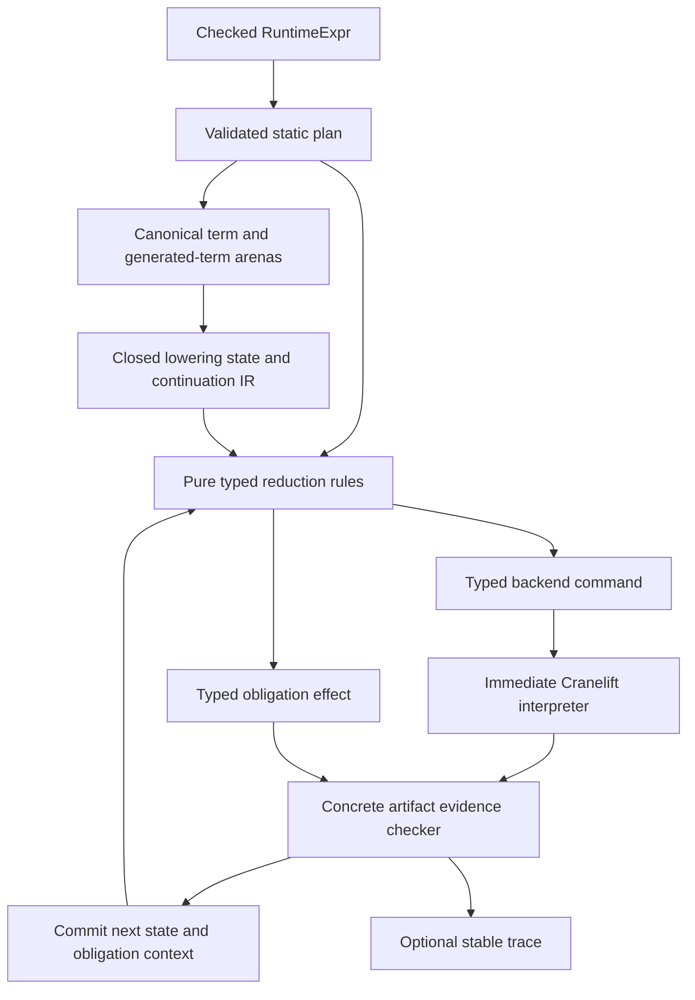

# Refactoring the compiler around causal obligations

**Research status:** advisory, not an architecture ruling or work-package
authorization

**Grounding:** `origin/main` at
`8c6ab6f9719de28ecb31d65c30ee9e9db7597835`

**Date:** 2026-08-08

## Executive assessment

Yes: the compiler can take advantage of the extracted causal-obligation
calculus. The strongest refactoring is a **hybrid checked lowering
transducer**, built from four layers:

1. a canonical planner-owned term representation;
2. a closed source-machine state and continuation IR;
3. pure typed reduction rules that select explicit backend commands and
   obligation effects; and
4. an immediate Cranelift interpreter followed by independent evidence checks
   over the emitted artifact.

This is more useful than either extreme. Leaving the rules embedded in a large
imperative lowering loop keeps obligation effects implicit. Building a complete
standalone symbolic backend duplicates Cranelift's control-flow and entity
semantics, while still requiring inspection of actual emitted CLIF. The hybrid
form makes the semantic transition symbolic and auditable, but performs backend
commands immediately and retains concrete evidence.

The refactoring should extract a small family of typed closure-law combinators,
not one universal obligation ledger. Domain-specific identity, ownership,
producer, route, phase, target, and publication boundaries remain concrete.

Expected benefits are substantial:

- clearer rule coverage and failure attribution;
- more explicit compiler expressivity for alternative discharge, branch
  partition, grouped completeness, and authorization-only populations;
- easier extension through closed term, continuation, command, and law types;
- better differential and mutation testing; and
- smaller conceptual units even if the total amount of compiler logic does not
  immediately shrink.

The refactoring does not by itself solve missing authorities. It makes a
missing authority appear as "no lawful rule for this state" earlier, rather
than as a late guard discovered after another repair.

## 1. Evidence that the abstraction already exists

### 1.1 A planner-side semantic plane exists

The planner already constructs a `SemanticPlane` with canonical descriptors,
programs, records, operands, positional child origins, capture layouts, ruled
children, and predeclared functions
([`semantic_ir.rs`](../crates/ken-runtime/src/cranelift_backend/planning/static_transition/semantic_ir.rs)).

Each `SemanticRecord` has an origin, operand range, child-origin range, and one
of six coarse `SemanticOpcode` values:

```text
EvaluateExpression
TransferValueOrControl
SelectBranchOrCase
InvokeOrResume
ReturnOrComplete
RunAffineCleanup
```

This is useful planning metadata, but it is not yet the production lowering
language. Lowering still dispatches primarily on cloned `RuntimeExpr` values,
source origins, and continuation structures. The opcodes describe broad
semantic classes rather than the exact reduction rule or obligation effect.

### 1.2 A defunctionalized source machine exists

The lowering layer already contains the core of a typed transition system:

- `SourceMachineState` distinguishes evaluation from a routed returned value;
- `SourceContinuation` enumerates pending source contexts;
- `SourceControl` carries the selected continuation lineage and terminal
  cursor; and
- `lower_source_machine_with_continuation_inner` is an explicit loop that
  matches the current state and source term
  ([`lowering/mod.rs`](../crates/ken-runtime/src/cranelift_backend/lowering/mod.rs),
  [`lowering/core.rs`](../crates/ken-runtime/src/cranelift_backend/lowering/core.rs)).

This is a CEK-like machine in concrete Rust. The proposed refactoring does not
invent an abstract machine; it makes the existing one the canonical lowering
boundary and names its transitions.

### 1.3 A canonical source-occurrence authority exists

`StaticTransitionPlan::source_occurrence` is the sole origin-to-expression
route in the backend. It distinguishes an out-of-range origin, a control node
with no source expression, and a corrupt table entry whose stored origin
disagrees with its index
([`static_transition.rs`](../crates/ken-runtime/src/cranelift_backend/planning/static_transition.rs)).

This supports replacing cloned planner-owned expressions in long-lived frames
with canonical term ids. It does not support deleting every owned expression:
the source machine synthesizes traps that occur nowhere in the source tree.
`OwnedSourceOccurrence` documents that forced boundary
([`lowering/mod.rs`](../crates/ken-runtime/src/cranelift_backend/lowering/mod.rs)).

### 1.4 Obligation laws are distributed but mature

The compiler contains several independently developed closure mechanisms:

- `CheckedCallLedger`: `planned = consumed = emitted`, followed by actual
  callee agreement;
- `ContinuationClaimLedger`: planned and declared populations plus the
  disjoint, exhaustive `direct`/`composed` discharge partition;
- `AggregateAllocationLedger`: independently observed events related to
  authorizations, with `domain(R) = E` and `image(R) subset-of P`; and
- `EffectSeatLedger`: exact seat equality per visit, phase admission, local
  commit, and global image containment
  ([`lowering/units.rs`](../crates/ken-runtime/src/cranelift_backend/lowering/units.rs),
  [`lowering/mod.rs`](../crates/ken-runtime/src/cranelift_backend/lowering/mod.rs)).

These mechanisms are sufficient evidence for a common typed law library. Their
different equations are equally strong evidence against one generic ledger
whose policy is controlled by flags.

## 2. Three refactoring options

### 2.1 Option A: retain direct imperative lowering

Under this option, the source-machine loop remains a direct mixture of:

- semantic case selection;
- continuation mutation;
- planner lookups;
- Cranelift builder calls;
- causal claims;
- locally accumulated evidence; and
- attributed refusals.

This preserves one representation and has the smallest migration surface. It
also preserves the present failure mode: a newly reached combination may be
represented by the Rust values but have no explicit semantic rule. The absence
is discovered at whichever guard happens to observe it, often after a previous
guard was repaired.

This is a lawful baseline, but it does not capitalize on the calculus.

### 2.2 Option B: build a complete symbolic lowering engine

This option would reduce source terms to a persistent target-independent IR,
then translate the complete result into Cranelift.

It offers maximal replayability and target separation. It also creates the
largest duplicate semantics:

- symbolic blocks must shadow Cranelift blocks;
- symbolic values must later map to function-local Cranelift values;
- call targets and ABI layouts are resolved twice;
- branch parameters and dominance are constructed twice; and
- concrete artifact evidence still must be checked after translation.

A complete symbolic engine may eventually be justified for multiple backends
or whole-function optimization. The current obligation problem does not by
itself justify it.

### 2.3 Option C: use a hybrid checked transducer

The recommended option separates one reduction into three phases:

```text
select rule and command
    -> interpret command into the current Cranelift function
    -> validate evidence and commit the obligation transition
```

The semantic reducer is pure with respect to the backend builder. It receives a
closed state, immutable plan views, and typed authority views. It returns:

```text
Transition {
    rule,
    next_state,
    command,
    obligation_effect,
    expected_evidence,
}
```

The command interpreter owns Cranelift mutation. The evidence checker inspects
the resulting `Inst`, `Value`, block, call target, operands, or return route.
Only a successful evidence check applies the obligation effect.

An optional trace records the rule, stable semantic ids, obligation change, and
evidence summary. Function-local Cranelift handles do not escape their scope.

## 3. Recommended architecture



### 3.1 Canonical term layer

Use two non-interchangeable term references:

```text
PlannedTerm(StaticOriginId)
GeneratedTerm(GeneratedTermId)
```

`PlannedTerm` resolves through the validated source-occurrence and positional
child-origin tables. `GeneratedTerm` resolves through a compiler-owned arena
whose constructor records why the term exists. No generated term receives a
fabricated `StaticOriginId`.

The long-term goal should be to replace `RuntimeExpr + StaticOriginId` pairs in
pending frames, not to retain both the old pair and the new id indefinitely.
During migration, adapters can be local and temporary, with an explicit
consumer ledger for their retirement.

### 3.2 Closed state and continuation IR

The existing `SourceMachineState` and `SourceContinuation` should become the
canonical semantic control representation. Each constructor should contain
only:

- stable term ids or generated-term ids;
- environment references with explicit ownership/lifetime class;
- route and phase information that affects rule selection;
- exact typed authority carried across the frame; and
- the next closed continuation.

The representation should avoid `Option<T>` where absence and "not supplied"
are different semantic states. `ContinuationDischarge` already demonstrates
the preferred shape: explicit `DirectSpecializationCall` and
`ComposedSourceContinuation(identity)` arms, with no default
([`lowering/mod.rs`](../crates/ken-runtime/src/cranelift_backend/lowering/mod.rs)).

### 3.3 Rule layer

Rules should be closed enums or functions selected by exhaustive matches over
closed input types. A rule owns four decisions:

1. which source/control combination it recognizes;
2. which planner facts and authority premises it requires;
3. which backend command it requests; and
4. which obligation effect and evidence it expects.

Illustrative rule names are:

```text
EvalLet
EvalConstructorHead
ReturnConstructorArgument
SelectComputationalCase
InvokeDirectSpecialization
InvokeComposedContinuation
ResumeActiveContinuation
TransferCarriedAnswer
CloseTerminalAnswer
```

Names are diagnostic and trace vocabulary, not new semantics. The exact list
must be extracted from existing behavior rather than designed in the abstract.

### 3.4 Backend command layer

Commands form a narrow interface over `FunctionBuilder` and other
function-local material. They should be semantic enough to validate, but not a
second full target IR.

For example, `EmitDeclaredCall` can carry a stable resolved call contract,
ordered semantic operands, and expected result representation. The interpreter
resolves or checks function-local handles, emits the instruction, decodes the
actual callee, and returns typed call evidence.

Keeping interpretation immediate avoids storing a graph of symbolic Cranelift
entities that must later be reconciled with the real graph.

### 3.5 Obligation-law layer

Extract reusable typed combinators for the four observed laws:

```text
ExactRealization<P, C, E>
AlternativeRealization<P, Direct, Composed>
EventRelation<Event, Record>
VisitClosure<Group, Seat, Phase>
```

Each type can share finite-set and finite-relation algorithms, difference
diagnostics, and mutation helpers. Each domain supplies distinct typed keys,
producers, evidence decoders, and publication boundaries.

The combinators should not expose a common untyped key or accept runtime flags
such as `must_consume`, `allow_composed`, or `per_visit`. Such flags recreate the
semantic distinction as unchecked configuration.

### 3.6 Evidence and trace layer

Evidence remains independent of intention:

- a call is emitted only after its `Inst` exists and its callee decodes;
- an allocation event comes from the actual result value, not relation keys;
- a composed discharge is promoted only after its target, operands, and return
  route validate; and
- a visit closes before host dispatch or successful exit.

The optional trace should contain stable semantic coordinates rather than
Cranelift entity numbers wherever possible. A trace entry may include the
function id as a scope plus an ephemeral local entity for diagnostics, but it
must not make that entity appear portable.

## 4. Benefits

### 4.1 Clarity

The present code often states a discovered law in a guard adjacent to a large
amount of control and builder state. A rule layer turns the governing question
into:

```text
Is there one exhaustive rule for this
(term shape, continuation shape, phase, route, authority) tuple?
```

If not, the failure is a missing semantic case. If a rule exists but a premise
fails, the diagnostic can name the absent or conflicting authority. This is a
clearer distinction than a succession of broad "unsupported" guards.

The refactoring also separates three meanings that are easy to blur:

- the planner authorized an event;
- lowering intended to emit it; and
- the finished artifact contains it and agrees with the plan.

### 4.2 Correctness and auditability

Closed term, continuation, route, phase, and command types can make omitted
cases compile failures. Typed obligation effects make a rule's resource
behavior visible at its signature rather than scattered among mutations.

The hybrid still preserves the strongest existing backstop: concrete CLIF is
inspected after emission. This avoids replacing an implementation check with a
symbolic assertion generated by the same code that may be wrong.

### 4.3 Compiler expressivity

The calculus gives the compiler a vocabulary for relationships it currently
implements separately:

- mandatory exactly-once realization;
- alternative direct or composed discharge;
- static partition across emitted bodies;
- at-most-once capabilities;
- authorization without mandatory occurrence;
- exact per-visit completeness;
- local transaction closure before publication; and
- post-artifact agreement.

This is compiler expressivity, not source-language expressivity. It makes more
compiler protocols directly representable and checkable.

### 4.4 Ease of extension

A new semantic form has predictable extension surfaces:

1. add or reuse a canonical term constructor;
2. add the state/continuation cases it can reach;
3. add exhaustive reduction rules;
4. add backend commands only if existing commands cannot express the event;
5. select a typed obligation law and domain identity; and
6. add concrete evidence checks and mutation pairs.

The compiler then rejects an extension that adds a term but omits a rule, adds
a command but omits evidence, or adds a mandatory population without closure.

### 4.5 Debuggability

A stable transition trace can answer:

- which rule selected the carried route;
- which term and continuation constructors were in hand;
- which authority was required and where it came from;
- which command emitted the concrete event;
- which evidence promoted the discharge; and
- which closure law later accepted or rejected it.

This is particularly useful when multiple tails or routes reach the same guard
and therefore produce the same refusal string. The trace records the path, not
only the final message.

### 4.6 Testing

Pure rule selection admits compact table tests over closed state tuples.
Command interpreters admit focused backend tests. Evidence validators admit
mutations that preserve rule selection while corrupting the emitted artifact.
Closure combinators admit algebraic tests over finite sets and relations.

The layers should also be tested together. Isolated green tests do not establish
that production reaches the rule or that the concrete evidence is wired into
closeout.

## 5. Costs and risks

### 5.1 Parallel representation drift

The largest risk is adding a new term or state IR beside `RuntimeExpr`,
`SemanticPlane`, `OwnedSourceOccurrence`, and the existing source machine
without retiring an old representation. Every parallel form creates mapping
code and a new place for provenance to drift.

Mitigation: define the intended canonical owner of each fact, keep adapters at
one boundary, maintain a consumer-edge ledger, and delete the replaced carrier
in the same refactoring arc.

### 5.2 A generic engine that erases domain laws

A universal key plus configurable policies would make unrelated identities
interchangeable and allow invalid policy combinations. It could also turn an
authorization population into a mandatory one or vice versa.

Mitigation: share algorithms through typed generics while preserving distinct
domain key and law types.

### 5.3 Symbolic/backend divergence

A persistent symbolic target graph can say a call exists while the Cranelift
interpreter emits another target or no call. It can also assign a symbolic
value a lifetime that the actual function-local entity does not have.

Mitigation: interpret commands immediately and validate evidence against the
finished function. Treat the symbolic command as an intention, never as proof
of realization.

### 5.4 Fabricated source provenance

Compiler-generated traps and potentially other synthetic terms have no source
occurrence. Forcing every term through `StaticOriginId` would make provenance
total by lying.

Mitigation: a separate `GeneratedTermId` type and arena, with explicit
constructors recording the compiler reason.

### 5.5 Refactoring without a semantic inventory

Moving code into smaller modules before enumerating its rule and obligation
surfaces can preserve or worsen the hidden coupling. File size alone does not
identify a lawful boundary.

Mitigation: extract a closed rule table and consumer ledger before moving
ownership. Use the table to drive module boundaries.

### 5.6 Mistaking earlier detection for a solution

The transition engine cannot synthesize an authority the planner never issued.
It will report the missing case more precisely and earlier, but an owning design
decision may still be required.

Mitigation: measure success as improved attribution, exhaustiveness, and
reduction of duplicated mechanisms, not as automatic elimination of all hard
stops.

## 6. Migration sequence

### Stage 1: extract the rule inventory without behavior change

Name each current source-machine transition and record its input tuple, planner
premises, builder effects, obligation mutations, and possible refusals. Keep the
existing loop and calls intact.

The deliverable is an exhaustive table checked against the term and
continuation enums. It should expose residual catch-all descent and every place
where a new constructor could bypass obligation handling.

### Stage 2: introduce typed transition results

Make selected portions of the loop return a `Transition` value. The existing
loop interprets it immediately. Start with rules that do not emit backend
instructions, such as let/constructor sequencing and frame transitions.

### Stage 3: introduce typed backend commands

Move one narrow emission family, preferably declared calls, behind a command
interpreter. Preserve the existing post-CLIF callee check and compare old and
new evidence on the same cases.

### Stage 4: canonicalize pending terms

Replace cloned planned expressions in frames with `PlannedTerm` ids. Introduce
`GeneratedTerm` for the synthetic-trap population. Delete superseded carriers
as each consumer class closes; do not leave both canonical forms.

### Stage 5: extract the alternative-realization law

Extract the direct/composed continuation partition first. It is the strongest
and most discriminating existing law, and its two evidence producers make a
useful test of whether the abstraction preserves independent evidence.

### Stage 6: add stable traces and mutation parity

Record rule, stable input coordinates, command class, obligation delta, and
evidence summary. For every migrated premise, retain or add a mutation that
proves the checker can fail for that premise on a reached production path.

### Stage 7: extract the remaining law combinators

Move exact realization, event relations, and visit closure incrementally. Keep
local publication gates where they presently run; abstraction must not delay a
failure until after a function is defined.

### Stage 8: reassess the need for a persistent lowering IR

Only after the hybrid boundary is operating should the project decide whether
multi-backend support, optimization, serialization, replay, or formal
verification justifies retaining a whole-function symbolic target IR.

## 7. Acceptance questions

A proposed refactoring slice should be able to answer yes to all applicable
questions:

1. Is there one canonical owner for every moved fact?
2. Can new term, continuation, route, and law variants fail exhaustiveness at
   compile time?
3. Does every mandatory obligation name its producer, owner, evidence, and
   closure boundary?
4. Are authorization-only populations still allowed to remain unused?
5. Is concrete emitted CLIF still inspected independently?
6. Are function-local backend entities prevented from escaping their scope?
7. Are compiler-generated terms distinguished from planned source terms?
8. Does the slice retire, rather than duplicate, the representation it
   replaces?
9. Can a mutation show that each absence or equality check is non-vacuous?
10. Does failure occur before the relevant artifact publication boundary?

## 8. What this refactoring does not decide

This report does not decide:

- the exact Rust module or public type names;
- the ordering or size of work packages;
- whether the compiler should eventually support multiple target backends;
- whether traces are persisted or only available in tests and diagnostics;
- whether the standalone calculus is mechanized in Ken, another proof
  assistant, or a model checker; or
- whether linear types ever become a Ken source-language feature.

Those are architecture, program, and product decisions for their owning roles.
The recommendation here is a technical shape supported by the current code.

## 9. Product and research posture

The compiler refactoring is independently useful. It does not require reopening
the product resource decision or adding affine types to Ken. `R2` remains
closed, and
[ADR 0021](../docs/adr/0021-resource-lifetime-and-ward-delegation.md) remains in
force.

The extracted calculus may be formalized as a compiler protocol while the
ATT–OTT equality problem remains open. A successful compiler refactoring is
therefore evidence about the calculus's utility, not evidence that
resource-sensitive observational equality has been solved.

## Conclusion

The compiler has already paid most of the conceptual cost of an explicit
causal-obligation IR: it has opaque identities, closed control states, exact
owners, alternative discharge forms, independently observed events, and strong
closure laws. What is missing is a boundary that makes those facts the input
and output of each semantic transition.

The recommended hybrid checked transducer supplies that boundary without
duplicating Cranelift. It makes rule selection symbolic, builder mutation
explicit, evidence concrete, and closure domain-specific. Its main benefit is
not fewer lines in the first refactoring. It is a compiler whose legal moves and
resource effects can be enumerated, audited, extended, and falsified directly.
