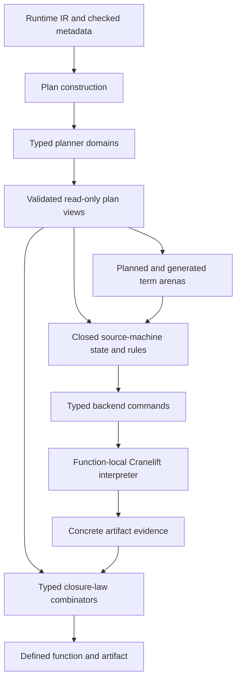

# Structuring the compiler refactoring program

**Research status:** advisory, not an architecture ruling, work-package frame,
or sequencing authorization

**Grounding:** `origin/main` at
`67439d2e25f16129ab1bc54bdfaaf60d6574cfd6`

**Date:** 2026-08-08

## Executive recommendation

The coming compiler refactoring should be structured as a **semantic
decomposition program**, not as one large file-splitting commit and not as an
immediate rewrite around a new symbolic IR.

The scheduled `RT-BACKEND-MODULE-SPLIT` node is correctly sequenced after
`RT-DESCENT-RETIRE`: the retirement deletes a lane across the same oversized
files and changes their natural seams
([campaign §4](../docs/program/16-recursive-descent-retirement.md#8--the-module-split-goes-after-the-capstone-operator-2026-07-31),
[`RT-BACKEND-MODULE-SPLIT`](../docs/program/issues/RT-BACKEND-MODULE-SPLIT.md)).
Once that deletion lands, the module split should establish the **target
ownership boundaries** for a longer refactor while remaining behavior
preserving itself.

The recommended program has two distinct arcs:

1. **Structural arc:** remeasure the post-retirement tree, inventory every
   producer/consumer/test edge, and extract modules around durable semantic
   responsibilities without changing representations or rules.
2. **Semantic arc:** incrementally introduce canonical planned/generated terms,
   a closed source-machine rule layer, typed backend commands, concrete
   post-emission evidence, and a small family of typed obligation-law
   combinators.

The structural arc should make the semantic arc easier, but it should not claim
to deliver it. Combining code motion, representation change, and obligation-law
change in one candidate would make regressions difficult to attribute and would
put the current mutation evidence in motion at the moment it is most needed.

The primary scope should remain `ken-runtime`'s Cranelift backend. The wider
compiler contains other large files, but the exceptional concentration is in
the native backend: three production files exceed 17,000 lines and one test
file exceeds 27,000 lines. A repo-wide "split every large file" campaign would
confuse a local architecture problem with a global line-count policy.

## 1. Current compiler shape

### 1.1 Crate scale

At the grounded revision, Rust source under each crate's `src/` directory is:

| Crate | Rust lines |
|---|---:|
| `ken-runtime` | 157,092 |
| `ken-elaborator` | 52,621 |
| `ken-interp` | 11,352 |
| `ken-host` | 10,881 |
| `ken-kernel` | 7,493 |
| `ken-verify` | 3,150 |
| `ken-cli` | 1,647 |
| `ken-foundation` | 1,154 |

These figures are descriptive, not quality thresholds. They show that the
refactoring question is dominated by `ken-runtime`, which is about three times
the size of the elaborator and more than fourteen times the interpreter.

The kernel is comparatively small and already organized by semantic concern:
checking, conversion, observation, inductives, syntax, normalization, and
termination. Its size is not evidence for joining it to a general compiler
module campaign.

### 1.2 Native-backend hotspots

The largest native-backend files are:

| File | Lines | Role today |
|---|---:|---|
| `lowering/core/tests/control.rs` | 27,117 | integration controls, mutations, campaign fixtures, source-text and reachability checks |
| `planning/static_transition.rs` | 23,798 | graph, origins, continuation planning, aggregates, effects, units, validation, and 117 tests |
| `lowering/mod.rs` | 19,604 | lowering state, value representations, authorities, ledgers, source-machine IR, and test hooks |
| `lowering/core.rs` | 17,137 | expression/source-machine execution and concrete Cranelift emission |
| `lowering/core/tests/constructors.rs` | 9,283 | constructor-focused fixtures and 120 tests |
| `boundary_value_clif.rs` | 9,116 | boundary-value representation and emitted helper graph |

Together, the first six files contain 106,055 lines. File size is not the
fundamental defect, but this concentration makes the actual defect visible:
many semantic lifecycles converge in a handful of compilation units.

### 1.3 Churn and co-change

From 2026-07-01 through the grounded revision:

| File | Commits touching it | Insertions | Deletions |
|---|---:|---:|---:|
| `planning/static_transition.rs` | 23 | 34,589 | 10,791 |
| `lowering/mod.rs` | 22 | 23,558 | 3,954 |
| `lowering/core.rs` | 30 | 20,026 | 2,889 |
| `lowering/core/tests/control.rs` | 30 | 27,968 | 851 |

Across the 49 commits touching at least one of those files, pairwise co-change
counts were:

| Pair | Commits touching both |
|---|---:|
| `core.rs` + `control.rs` | 22 |
| `lowering/mod.rs` + `core.rs` | 19 |
| `lowering/mod.rs` + `control.rs` | 16 |
| `planning` + `lowering/mod.rs` | 11 |
| `planning` + `core.rs` | 10 |
| `planning` + `control.rs` | 10 |

This is stronger evidence than line count. It says the planner, lowering state,
emitter, and integration controls repeatedly move together. A mechanical split
that preserves the same coupling through broad re-exports will reduce file
length but not change the cost of future changes.

### 1.4 Other large compiler files

The next tier includes:

- `ken-runtime/boundary_value_clif.rs` at 9,116 lines;
- `ken-interp/eval.rs` at 8,013 lines;
- `ken-elaborator/erasure.rs` at 7,294 lines;
- `ken-elaborator/checked_core.rs` at 7,272 lines;
- `ken-elaborator/elab.rs` at 7,159 lines; and
- `ken-elaborator/compiler_driver.rs` at 6,205 lines.

Several are also high-churn. That warrants later local reviews, but they do not
form one coupled refactoring unit with the Cranelift backend. Their semantics,
owners, tests, and failure boundaries differ. The project should carry the
method developed here to them only if their own consumer and co-change surveys
show the same problem.

## 2. What the compiler work has taught us

### 2.1 The stable architecture is producer to authority to consumer

The native campaign repeatedly converged on the same pattern:

```text
planner derives one exact fact
    -> lowering transports its opaque identity
    -> the owning consumer uses it at one exact seat
    -> concrete emitted evidence is checked
    -> a domain-specific closeout rejects omission or duplication
```

The causal-obligation report identifies this pattern across continuation calls,
dynamic splice edges, allocations, effect seats, joins, and terminal authority
([research report §2](causal-obligation-calculus.md#2-the-compiler-evidence)).

That lifecycle is a better module boundary than the work package that happened
to introduce it. A durable module should be named for a semantic domain such as
continuation planning, aggregate authorization, effect-seat closure, or source
machine control. It should not be named `d7`, `b2f`, or after a campaign node.

### 2.2 The planner/lowering distinction is necessary but insufficient

The backend already separates `planning` from `lowering`. That is the correct
top-level direction: lowering consumes a validated plan and must not mint its
own planner authority.

Within each side, however, several domains share one large file. The planner's
`static_transition.rs` contains:

- graph identities and transition kinds;
- source occurrence and child-origin authority;
- continuation specializations, contexts, inputs, calls, and routes;
- aggregate shape, ownership, and synthesized trees;
- host-effect seat contracts;
- unit and call-edge projections;
- planner construction and finalization; and
- extensive inline mutation and acceptance tests
  ([`static_transition.rs`](../crates/ken-runtime/src/cranelift_backend/planning/static_transition.rs)).

Similarly, `lowering/mod.rs` contains function-local handles, lowering values,
environment bindings, continuation authority, several ledgers, recursor state,
source-machine control, test mutations, and the primary `Lowering` state
([`lowering/mod.rs`](../crates/ken-runtime/src/cranelift_backend/lowering/mod.rs)).

The next split should therefore preserve the planning-to-lowering direction
while decomposing each side by semantic lifecycle.

### 2.3 The source machine is already an architectural center

`SourceMachineState`, `SourceContinuation`, and
`lower_source_machine_with_continuation_inner` form a defunctionalized
source-machine evaluator
([`lowering/mod.rs`](../crates/ken-runtime/src/cranelift_backend/lowering/mod.rs),
[`lowering/core.rs`](../crates/ken-runtime/src/cranelift_backend/lowering/core.rs)).

The recent carried-value chain exposed four successive walls in this machine.
Each prior repair was correct, and each made the next unrepresented combination
reachable. The campaign records this as fail-closed behavior, not four
regressions
([recursive-descent campaign schedule](../docs/program/16-recursive-descent-retirement.md#4-schedule)).

The lesson for refactoring is not "put the four guards in one smaller file."
It is "make the state tuple and legal transition relation enumerable." The
source machine should become the long-term center of semantic rule ownership.

### 2.4 Evidence must stay independent of intention

The strongest compiler checks do not trust the path that planned or requested
an event:

- checked calls enter the emitted set only after the `Inst` exists and its
  callee decodes;
- aggregate events are recorded independently from relation keys;
- composed continuation discharge validates target, operands, and return route;
  and
- effect visits close locally before a body is published
  ([`lowering/units.rs`](../crates/ken-runtime/src/cranelift_backend/lowering/units.rs),
  [`lowering/mod.rs`](../crates/ken-runtime/src/cranelift_backend/lowering/mod.rs)).

A refactor must preserve this independence. Moving planning, emission, and
evidence into one convenient abstraction can make agreement true by
construction and remove the very check that matters.

### 2.5 Test machinery is part of the architecture problem

The large production files contain hundreds of `#[cfg(test)]` gates, mutation
selectors, counters, observations, and restore guards. The 27,117-line
`control.rs` contains 218 tests plus substantial fixture construction and
campaign-specific controls.

This is not simply test bloat. The mutations are executable evidence that
negative checks can fail and that a supposedly absent event was actually
reached. Removing or weakening them to make modules cleaner would trade
navigational clarity for correctness.

The refactor should separate reusable test instrumentation and fixtures by
domain while keeping injection points at the production boundary they test.
Both library and test configurations must continue to compile: the current
facades document several places where a re-export valid in one configuration
fails in the other
([`cranelift_backend.rs`](../crates/ken-runtime/src/cranelift_backend.rs),
[`planning.rs`](../crates/ken-runtime/src/cranelift_backend/planning.rs)).

## 3. Target dependency architecture

The recommended long-term dependency direction is:



The load-bearing arrows are one-way:

- plan domains do not import lowering;
- the machine reads validated plan views, not planner builders;
- rules request commands but do not mutate Cranelift;
- command interpretation does not invent planner identity;
- closure laws receive independent plan and artifact evidence; and
- the final artifact is published only after local and whole-pass closure.

## 4. Recommended module ownership

The exact filenames are an architecture decision. The following ownership map
is a recommendation for what the modules should mean.

### 4.1 Planning facade

The planning facade should own:

- extraction of checked metadata from `RuntimeProgram`;
- orchestration of plan construction;
- one validation entry point; and
- narrow re-exports of immutable read-only views consumed by lowering.

It should not re-export planner builders, mutable tables, or mutation controls
into production lowering.

### 4.2 Planner foundation

A foundation module should own stable ids and the core graph:

- `StaticOriginId`, node ids, edge ids, source ids, and function ids;
- transition and edge kinds;
- occurrence and positional child relations; and
- the source occurrence lookup boundary.

Only ids that genuinely share construction and validation should live here.
Putting every newtype in an `ids.rs` file merely because it is small can hide
which domain owns its minting.

### 4.3 Planner domains

Separate semantic domains should own their complete planner side:

| Domain | Owns |
|---|---|
| occurrences | source records, positional children, planned/generated distinction |
| units and ABI | predeclared functions, unit descriptors, slots, call-edge views |
| continuations | contexts, source coordinates, specializations, calls, routes, result edges |
| aggregates | occurrence ids, shapes, child provenance, ownership, synthesized trees |
| effects | seat operations, needs, availability, planned seats, contract derivation |
| joins and traps | join result plans, predecessor identity, planned traps and terminal ownership |

`semantic_ir.rs` and `abi.rs` already establish the precedent for extending the
`static_transition/` directory rather than creating a second planning tree
([`semantic_ir.rs`](../crates/ken-runtime/src/cranelift_backend/planning/static_transition/semantic_ir.rs),
[`abi.rs`](../crates/ken-runtime/src/cranelift_backend/planning/static_transition/abi.rs)).

### 4.4 Lowering facade and function state

The lowering facade should own the public-in-backend entry points and the
orchestration of one compilation. A function-state module should own material
whose validity is scoped to one Cranelift function:

- `FuncRef`, `GlobalValue`, `Value`, `Inst`, and block maps;
- activation and seed-material references;
- function-local evidence accumulators; and
- the defining function's owner identity.

This boundary prevents function-local entities from looking like stable plan
ids.

### 4.5 Lowering values and boundary representations

One module family should own `Lowered`, `LoweringOperand`, carried boundary
words, environment bindings, and their closed disposition rules. It should
depend on stable planner views and boundary-value contracts, but not on planner
construction.

The representation should be split by semantic class only where the operations
are also split. Dividing one enum's variants among modules while retaining one
giant match elsewhere changes navigation without changing ownership.

### 4.6 Source machine

The source-machine family should own:

- planned and generated term references;
- source state and control;
- continuation and eliminator-frame datatypes;
- selected-continuation lineage;
- pure rule selection; and
- attributed refusal when no rule applies.

This is the correct home for the explicit transition IR recommended by the
causal-obligation analysis. Initially, the current imperative loop can remain
the interpreter. The module split should prepare this boundary without changing
the loop's behavior.

### 4.7 Backend commands and emitters

Typed command interpreters should eventually own concrete Cranelift mutation by
event family:

- calls and returns;
- blocks, branches, joins, and block parameters;
- constructors, records, and aggregate allocation;
- host effects;
- traps and terminal exits; and
- cleanup.

This is not a second whole-function target IR. Commands can be interpreted
immediately and return concrete evidence.

### 4.8 Obligation laws and domain adapters

The shared layer should contain algorithms for:

- exact realization;
- disjoint alternative realization;
- event-to-record relations; and
- per-visit closure.

Domain adapters retain distinct key types, owner types, evidence decoders, and
publication boundaries. Continuation, checked-call, aggregate, and effect-seat
ledgers should not become values of one untyped universal ledger.

### 4.9 Tests

Tests should be divided into four classes:

1. **domain unit tests** beside planner, rule, command, evidence, and law
   modules;
2. **fixture builders** in reusable test-support modules, named for semantic
   shapes rather than work-package history;
3. **mutation controls** beside the boundary they falsify; and
4. **end-to-end integration controls** that cross planning, lowering, concrete
   CLIF, closure, and execution.

The large `control.rs` should retain only class 4 after migration. It should not
be emptied by turning integration properties into isolated unit tests. Every
moved test needs a property ledger stating whether it is lane-specific,
domain-local, or end-to-end and which production injection point it reaches.

## 5. Program structure

### 5.1 Stage A: post-retirement census

Begin only after `RT-DESCENT-RETIRE` merges, as the existing program requires.
Re-derive all measurements; do not carry today's counts into the frame.

Produce five inventories before code motion:

1. **type ownership:** every public-in-backend type, its minting module, and its
   consumers;
2. **producer/consumer/closeout:** each authority and the exact lifecycle it
   governs;
3. **re-export surface:** every existing path and visibility class in both
   library and test builds;
4. **test property:** each test, fixture, mutation, counter, and source oracle;
   and
5. **co-change baseline:** the post-retirement version of the four-file matrix
   in §1.3.

The census is the refactor's plan. A directory sketch without these inventories
is insufficient because it cannot show which semantic edges a move must
preserve.

### 5.2 Stage B: behavior-preserving structural extraction

Extract modules one semantic domain at a time. Each slice should be a pure move
plus the smallest necessary visibility and re-export changes. Do not rename
types, change representation, alter diagnostics, or generalize a ledger in the
same slice.

A useful order is:

1. stable planner domains already adjacent to `semantic_ir.rs` and `abi.rs`;
2. function-local lowering state and backend references;
3. domain ledgers and their test instrumentation;
4. source-machine datatypes; and
5. emitter families whose producer and evidence boundaries are already closed.

The order begins with boundaries whose semantics are already explicit and
leaves the most coupled source-machine methods until their datatypes and
authorities have homes.

### 5.3 Stage C: test corpus decomposition

Move fixtures and domain tests alongside their extracted domains in the same
slice that moves the production ownership. Keep end-to-end controls in an
integration module.

For every movement:

- the same mutation must still turn the same property red;
- the positive reachability denominator must still be nonzero;
- restore guards must still reset shared selector state;
- the test must compile in the same configuration; and
- no test may be deleted merely because its campaign lane was difficult to
  name after the move.

This stage may run interleaved with Stage B, but its evidence should remain
separately auditable from production moves.

### 5.4 Stage D: extract typed obligation laws

After structural ownership is stable, extract one law at a time:

1. alternative direct/composed continuation realization;
2. exact checked-call realization;
3. aggregate event authorization; and
4. effect-seat visit closure.

The continuation partition is the best first proof because its direct and
composed evidence are independently produced and its disjoint-union law is the
strongest discriminator.

Each extraction should preserve the old domain key type and error attribution.
Delete the superseded domain-local set algorithm once parity is established;
do not keep two closeout implementations.

### 5.5 Stage E: canonicalize terms

Replace pending `RuntimeExpr + StaticOriginId` pairs with a sum that
distinguishes:

```text
PlannedTerm(StaticOriginId)
GeneratedTerm(GeneratedTermId)
```

Migrate consumer classes one at a time. Source terms resolve only through the
validated occurrence table. Compiler-synthesized traps and other generated
terms resolve only through the generated arena. Do not fabricate source origins
to make the representation uniform.

Maintain a spine/element/obligation-only consumer ledger. Delete adapters and
old carriers as each class closes, so the resting state has one canonical term
representation.

### 5.6 Stage F: make the transition relation explicit

Name and type the source-machine transitions. First return explicit transition
values for rules that make no backend mutation. Then introduce typed backend
commands for one event family, preferably declared calls, while the current
loop interprets them immediately.

The transition should expose:

- input term, control, route, and phase constructors;
- required planner and owner premises;
- the next state;
- the backend command;
- the obligation effect; and
- the expected concrete evidence.

Exhaustive matches over closed input types should replace fallthrough where
completeness is load-bearing.

### 5.7 Stage G: separate command interpretation from evidence

For each migrated command:

1. select the command without mutating Cranelift;
2. interpret it within one function-local scope;
3. inspect the emitted artifact;
4. validate concrete evidence; and
5. commit the obligation transition only after validation.

The existing post-CLIF checks are the baseline. A new symbolic trace cannot
replace them.

### 5.8 Stage H: closure and facade minimization

At the end of the arc:

- delete migration adapters and parallel representations;
- narrow broad re-exports to read-only views;
- remove dependency cycles and cross-domain mutation access;
- keep end-to-end controls at the facade;
- re-run the ownership and co-change inventories; and
- record which formerly coupled changes now stay within one module family.

Only then should the project reassess whether a persistent whole-function
lowering IR is warranted for multiple backends, optimization, serialization,
or formal replay.

## 6. Recommended work-package cuts

The Steward and Architect own the actual node graph. On technical grounds, the
work should be cut along the following outcomes rather than as one large `M`
module split:

| Cut | Outcome | Semantic change allowed? |
|---|---|---:|
| post-retirement census | current ownership, surface, test, and churn ledgers | no |
| planner domain extraction | graph foundation plus continuation, aggregate, effect, and unit modules | no |
| lowering state extraction | function-local state, values, authorities, and source-machine datatypes | no |
| test-support extraction | domain fixtures/mutations plus retained integration controls | no |
| obligation-law extraction | typed laws replacing duplicate set/relation algorithms | yes, one law at a time |
| canonical term migration | planned/generated term sum replaces owned planned expressions | yes |
| transition-rule extraction | explicit closed rule results interpreted by existing loop | yes |
| command/evidence split | immediate command interpreter plus concrete evidence | yes, one event family at a time |
| closure | delete adapters, narrow facades, remeasure locality | deletion only |

The first three structural cuts may be grouped if their diffs remain pure moves
and independently reviewable. The semantic cuts should remain separate because
each changes a different correctness boundary and needs a different mutation.

## 7. Guardrails

### 7.1 Do not optimize for equal-sized files

A 5,000-line cohesive source machine is preferable to five 1,000-line modules
that share its private state through broad imports. The useful metrics are
ownership, dependency direction, exhaustiveness, and change locality.

### 7.2 Do not name permanent modules after temporary campaign nodes

Work-package labels encode history and sequencing, not semantic ownership. A
future reader should find continuation planning under `continuation`, not know
which `D8` introduced it.

### 7.3 Do not combine pure moves with semantic rewrites

If a pure extraction changes behavior, the movement exposed an implicit
dependency. Stop and record it. Do not repair that dependency inside the same
commit and continue calling the slice mechanical.

### 7.4 Do not preserve two canonical forms

Ken has no compatibility consumer requiring the old internal form. Once a
representation is migrated, delete its predecessor and adapters in the same
arc. Parallel forms increase the trusted audit surface and allow provenance to
drift.

### 7.5 Do not generalize domain identities away

Share finite-set algorithms, not untyped keys. Producer occurrence, emission
owner, recursive position, phase, route, and source coordinate have each proved
load-bearing. A generic id that omits them will fail as a collision or wrong
owner somewhere else.

### 7.6 Do not move closure later

If a visit or body currently closes before `define_function`, an abstraction
must preserve that publication boundary. Whole-pass detection is not equivalent
when a defective body has already entered the module.

### 7.7 Do not weaken concrete evidence

Plans and commands are intentions. Actual callee, result value, operand run,
return route, group membership, and defined function are evidence. The same
producer should not manufacture both sides of a claimed agreement without an
independent observation.

### 7.8 Do not trust one build configuration

Relocation changes visibility and `cfg(test)` re-exports. Each structural slice
must compile the affected crate as a library and under the targeted test
configuration. Local runs must remain scoped through `scripts/ken-cargo`; the
workspace gate belongs to CI.

### 7.9 Do not replace tests with source-text inventories

Text inventories select candidates and can be useful during a one-shot
refactor audit. They are not durable semantic oracles. Visibility, reachability,
exhaustiveness, and emission should be asked through the compiler or artifact
where possible.

## 8. Success measures

Line count should be reported, but it is not the primary acceptance measure.
The refactor is successful when:

1. every planner fact has one minting owner and narrow read-only consumers;
2. every causal authority has one typed producer, consumer set, evidence type,
   and closure law;
3. source-machine term/control/phase/route cases are exhaustively enumerable;
4. compiler-generated terms cannot masquerade as source terms;
5. function-local Cranelift entities cannot cross function ownership;
6. symbolic commands cannot count as emitted evidence;
7. mutation and reachability controls retain parity through movement;
8. broad facades shrink rather than re-export the old monolith;
9. future domain changes touch fewer of the four former hotspot files; and
10. the post-refactor co-change matrix shows semantic changes localizing to
    their owning module families.

A secondary navigational target is that no ordinary production module should
again accumulate several unrelated semantic lifecycles. This is deliberately
not a numeric line ceiling. A ceiling can be satisfied by arbitrary splitting;
the lifecycle criterion cannot.

## 9. Likely benefits

### 9.1 Clarity

The compiler's legal moves become visible as plan construction, state
transition, command, evidence, and closure rather than one interleaved method
body. A refusal can identify which premise failed.

### 9.2 Correctness

Closed types and exhaustive matches make omission harder. Independent concrete
evidence remains in place. Domain-specific closure laws become reusable without
becoming configurable flags.

### 9.3 Ease of extension

A new feature has predictable homes: planner domain, term/control rule, command
if necessary, evidence, closure law, fixture, mutation, and integration control.
The compiler can reject a feature that adds only some of those surfaces.

### 9.4 Reviewability

Reviewers can assess one semantic lifecycle without loading 60,000 lines of
adjacent mechanisms. Pure movement and semantic change arrive in separate
candidates, making a red test or changed diagnostic attributable.

### 9.5 Research value

The explicit rule/evidence boundary becomes an executable instance of the
linear causal-obligation calculus. It can produce stable traces for a later
standalone formal model without making that model part of the compiler's
trusted runtime path.

## 10. Limits and open decisions

This survey does not establish that file size caused the recent hard stops. The
campaign itself correctly records that hypothesis as unmeasured. The report
does establish concentration, churn, and repeated co-change, which are enough
to justify better semantic ownership even if navigation played no role in the
hard stops.

The following remain decisions for the owning roles:

- exact module and work-package names;
- whether the structural arc is one node or several accepted partials;
- which planner domain moves first after retirement;
- whether stable traces are persisted or diagnostic-only;
- whether the hybrid transducer eventually becomes a serializable lowering IR;
  and
- whether the method later applies to elaborator and interpreter hotspots.

The product type-system posture is unchanged. This refactor does not reopen
`R2`, alter ADR 0021, or claim that affine and observational type theory have
been unified. It operationalizes a compiler-local causal protocol.

## Conclusion

The compiler is ready for a general refactor, but the durable opportunity is
larger than shorter files and smaller than a new backend rewrite.

The next node should first expose the architecture already earned by the
campaign: validated planner domains, canonical occurrences, explicit source
control, function-local backend state, concrete evidence, and typed closure.
Then follow-on semantic cuts can make the causal-obligation transition relation
explicit without duplicating Cranelift or erasing domain authority.

Structured this way, the refactor banks three gains at once:

- immediate navigational and review improvement from smaller cohesive modules;
- a safer extension surface from closed rules and typed obligation laws; and
- a direct path from the compiler's concrete discoveries to a formal
  causal-obligation model.

The key is sequencing: delete the obsolete lane, inventory the surviving
lifecycles, move them without changing them, and only then abstract the rules
they share.
