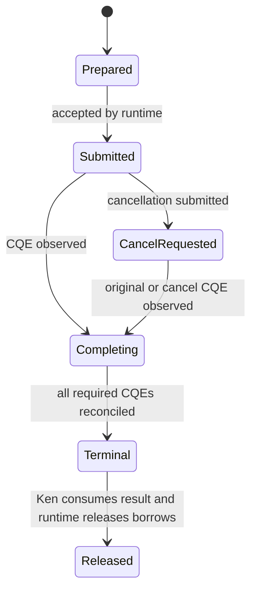
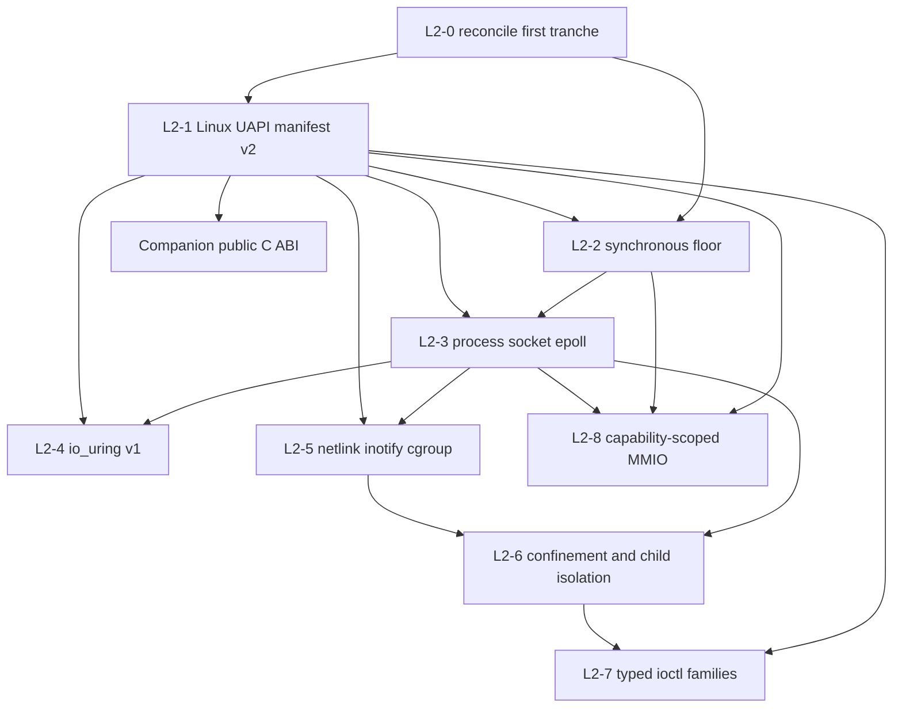

# Linux ABI II: completion, control, and asynchronous I/O

**Research advisory**

**Audit baseline:** `origin/main @ a9db5a17` (2026-07-19)

**Amended:** 2026-07-19 on `origin/main @ b4c4c9d1`, correcting the original
MMIO and atomics boundary after operator clarification

**Prepared for:** the operator and Steward

## Executive recommendation

Ken should undertake a second Linux ABI program, but it should begin by naming
the state of the first one accurately.

The current tree contains a strong Linux host-boundary foundation: a private,
exact-pinned `rustix` dependency; a generated and independently checked target
manifest; native host-effect execution; opaque generation-checked resources;
bounded buffers; and positioned I/O. It does **not** yet satisfy the first
campaign's committed exit. There is no process-operation family, socket family,
or `epoll` event loop, and the native `writeAll` fixture remains the end of an
active compiler chain. The current achievement is therefore the **Linux ABI
foundation and descriptor tranche**, not the whole PX-A through PX-E campaign.

Linux ABI II should have eight substantive tracks:

1. finish and reconcile the first tranche;
2. generalize the target manifest into a family-scoped Linux UAPI contract;
3. complete the synchronous user-space floor;
4. deliver the already-committed process, socket, and event-loop work;
5. make `io_uring` a first-class, single-issuer asynchronous I/O facility;
6. add Linux observation and control through typed netlink and cgroup APIs;
7. add self-confinement, child isolation, and selected typed `ioctl` families;
8. add capability-scoped device access, including typed, bounded MMIO.

The public C ABI and generated headers should proceed as a **linked companion
program**, not as a Linux ABI II phase. It is target-neutral language interop,
has a different stability boundary, and must not expose Ken's private runtime
representation merely because the Linux host boundary is ready.

The following remain outside this proposal:

- a thread-safe Ken runtime, already covered by separate research;
- affine or unique types, which the operator has ruled out of Ken;
- Ken-visible raw addresses, arbitrary dereference, or pointer arithmetic;
- arbitrary atomics over addresses or untyped shared memory;
- a generic syscall or generic `ioctl` escape hatch;
- bare-metal execution and in-kernel driver implementation; and
- ambient physical-memory access such as a general `/dev/mem` capability.

The original version of this report overgeneralized the operator's rejection
of bare pointers. Safely wrapped MMIO is not equivalent to a raw-pointer API.
Linux ABI II should permit capability-scoped, runtime-owned mappings with
typed, bounded register access. Likewise, atomics are not inherently
incompatible with Ken: runtime-private atomics and facility-specific atomic
protocols are in scope, while a general Ken atomic-cell API awaits an explicit
shared-memory and concurrency model.

This is an advisory program shape. Work-package release, ownership, and
acceptance language remain Steward and Architect decisions.

## 1. The question this report answers

The first charter explicitly excluded:

> netlink · seccomp/Landlock/namespaces · `io_uring` · cgroups · typed `ioctl`
> families · the public C ABI and generated headers · a thread-safe runtime ·
> affine/unique types · raw pointers/atomics/MMIO

The operator has now narrowed the question. Thread safety has its own report;
affine typing is not a Ken direction; and an ordinary raw-pointer surface would be
contrary to Ken's model. The operator has further clarified that this does not
exclude MMIO when the mapping and access protocol are safely wrapped. This
report asks:

- which remaining facilities belong in a coherent second Linux program;
- what prerequisites the first program actually supplied;
- what its committed and researched gaps still are;
- how those facilities can preserve Ken's capability and honesty boundaries;
  and
- which concerns are adjacent but should not be coupled to Linux.

The answer is not “expose more syscalls.” Linux ABI II should expose a small set
of **typed protocols** whose unsafe mechanics remain private to `ken-host`, with
ordinary checked Ken packages above them.

## 2. Three different baselines must not be conflated

There are three relevant descriptions of the work:

1. the original research report,
   `local/ken-posix-linux-interface-gap-report.md`, written before the
   Linux-direct ruling;
2. the campaign charter, [`docs/program/09-posix-linux-abi-campaign.md`][charter],
   which reframed that advice and committed through PX-E; and
3. the implementation now on `main`.

The report was a landscape and phased recommendation. The charter was a
commitment. The implementation is the evidence. A phase appearing in either
document is not evidence that it landed.

### 2.1 Original report against current reality

| Original recommendation | Current disposition |
|---|---|
| Phase A: target/ABI identity, machine types, executable host-operation contract | Substantially landed, but for the current narrow boundary rather than a general Linux UAPI schema |
| Phase B: descriptor vertical slice and resources | Substantially landed: opaque resources, bounded buffers, open/release, metadata, positioned I/O |
| Phase C: buffers, mappings, and event loop | Buffers landed; mappings and the event loop did not |
| Phase D: process and socket services | Not present in `HostOpV1` and not delivered |
| Phase E: netlink, inotify, sandboxing, cgroups, advanced descriptor operations, typed `ioctl` | Not delivered; this is central Linux ABI II scope |
| Phase F: stable public C ABI | Not delivered; recommended here as a companion program |
| Phase G: concurrency and performance research, including `io_uring` | Thread safety is separate; `io_uring` can now be split out and delivered safely without it |

The original report was right about the required layering, resource handles,
manifest-bound ABI facts, native/interpreter parity, and the dangers of an
untyped syscall escape. Its POSIX portability layer was subsequently and
correctly rejected in favor of Linux-direct backends. Its placement of
`io_uring` after concurrency research was prudent at the time, but is no longer
necessary: the landed runtime-owned resource and buffer substrate permits a
useful single-issuer design.

One further refinement is needed. A “minimum kernel version” is useful release
metadata, but it is not a sufficient availability contract. Distribution
backports, configuration, security policy, and per-operation support mean Linux
II should record **facility and operation probes**, not infer all support from
`uname`.

### 2.2 The first charter's own unfulfilled commitment

The charter says “COMMIT THROUGH PX-E”: processes and sockets followed by
nonblocking descriptors and an event loop. Its exit requires both a native
network service and a native process supervisor. Its own phase definitions name
PX10 (processes), PX11 (sockets), and PX12 (`epoll`, `eventfd`, `timerfd`, and
`signalfd`). None of those operation families is in the current closed host
catalog.

That is not a criticism of the substantial work that landed. It is a status
correction needed to plan honestly. Linux ABI II must not quietly relabel
unfinished PX-D/PX-E work as an optional enhancement.

### 2.3 What has actually landed

At the audit baseline:

- `HostOpV1` is a closed catalog of 22 operations.
- Thirteen are `NativeTested`: console write/flush/terminal detection; whole-file
  read/write; mode change; open; handle metadata; positioned read/write;
  resource release; buffer allocation; and buffer freeze.
- Nine are explicitly `RepresentedUnavailable`: console read, wall time, append,
  path metadata, directory read/create/remove, file removal, and rename.
- There are no process, socket, resolver, polling, signal, random, terminal
  control, memory mapping, netlink, cgroup, sandbox, `io_uring`, or typed
  `ioctl` operations.
- `rustix` is pinned with only `std`, `fs`, `process`, and `try_close` features.
  The `process` feature currently supports startup identity work; it is not a Ken
  process-control surface.
- the target manifest holds target/backend/dependency identity and 23 current
  facts, principally widths, filesystem flags, syscall numbers, modes, and two
  errno values;
- manifest generation fails closed unless the build target equals the Linux
  host, so cross-target artifact production is not available; and
- host-effect wire layouts are independently C-probed, but only for the current
  effect records.

The current manifest is therefore correct for its declared boundary, not a
general Linux ABI database. It lacks the broader family constants and layouts,
feature vocabulary, endianness and C data-model facts, and cross-target
generation strategy needed by netlink, `io_uring`, `ioctl`, sockets, and public
interop.

The first campaign also planned a general `System.Error`. What exists is a good
filesystem floor: `IOError` has stable semantic identities and preserves an
`Other Int` errno, while `FileError` adds operation and optional path context.
It is not yet a cross-domain system error with retry/transience, process,
socket, netlink, cgroup, or asynchronous-completion context.

Finally, two documentation debts are now operationally misleading:

- `Capability/Filesystem/Errors.ken.md` still says filesystem authority is
  coarse and not path-confined, although scoped roots, rights, symlink policy,
  and no-follow resolution have landed; and
- `Capability/Filesystem/Path/Posix.ken.md` retains the portability name that
  the Linux-direct ruling rejected.

These should be corrected as reconciliation work, not left for a future
documentation sweep.

## 3. Program principles

Linux ABI II should be governed by the following constraints.

### 3.1 Typed protocol, not syscall inventory

The public Ken surface represents operations, resources, replies, and policy.
It does not represent syscall numbers, C pointers, arbitrary flag words, or
kernel structs. The runtime may use those privately in a small audited module.

### 3.2 Capability admission precedes host dispatch

Every facility has a least-authority capability vocabulary. Validation occurs
before a host call or shared-ring submission. Authority to open a file does not
imply authority to register it with a ring; network observation does not imply
network mutation; and permission to launch a child does not imply permission to
place it in an arbitrary cgroup or namespace.

### 3.3 Availability is explicit and fine-grained

Each artifact binds:

- the target ABI manifest hash;
- the relevant facility-schema versions;
- build-time facts and layouts;
- runtime-probed feature and operation availability; and
- the evidence status of each guarantee.

An unavailable operation is a stable, named result or pre-execution rejection,
never a no-op and never an accidental fallback to a less safe operation.

### 3.4 Runtime ownership remains honest

Ken still cannot prove exactly-once release. The runtime owns kernel resources,
uses generation-checked tokens, and exports its lifetime obligations to Ward.
Source documentation says `runtime-enforced` and `tested`, never `proved`.

### 3.5 Interpreter/native parity remains a release gate

Every new host operation needs semantic traces and external-delta comparisons
on both paths. For Linux-only facilities whose observations are inherently
racy, the comparison should use a normalized semantic observation rather than
unstable kernel sequence numbers, descriptor numbers, timestamps, or message
ordering not promised by the API.

## 4. Proposed program

The identifiers below are proposed planning names, not released work-package
IDs.

### L2-0 — reconcile and close the first tranche

**Objective:** establish a truthful, green baseline before widening the host
surface.

1. Complete the active PX8 native `writeAll` chain and its unchanged reaching
   fixture.
2. Either promote each of the nine represented-unavailable v1 operations with
   differential evidence or explicitly defer it with a named destination.
3. Reconcile the first charter's status and exit language: either complete
   PX10–PX12 before declaring it finished, or rename the achieved scope as the
   Linux ABI foundation/descriptor tranche.
4. Correct stale capability prose and Linux-direct package naming.
5. Produce a generated inventory of operation identities, availability, rights,
   request/reply schemas, and differential fixtures. Tests assert the promised
   memberships and properties, not brittle total counts.

This phase prevents the second campaign from obscuring first-campaign debt.

### L2-1 — Linux UAPI manifest v2

**Objective:** make new Linux-family contracts expressible before using them.

The current single vector of integer facts should evolve into versioned,
family-scoped manifests:

- target identity: architecture, pointer width, endianness, C scalar widths and
  alignments, and selected calling convention;
- dependency and backend identity, as today;
- constants and record/union layouts for each enabled family;
- facility-required atomic widths, alignment, and ordering capabilities without
  treating host support as a public Ken atomic API;
- facility ABI versions and build-time availability;
- runtime-probe schema and results;
- kernel-policy dependencies where relevant; and
- canonical hashes for the whole manifest and individual family projections.

Generation should have two independent sources where practical: selected
`linux-raw-sys`/`rustix` facts and a target-header layout probe. Cross-target
builds cannot run the target probe, so CI should publish signed or
content-addressed, target-specific generated manifests made on native builders.
A consumer must fail closed when it cannot establish that the manifest matches
the artifact target.

The manifest should be generated from family schemas rather than maintained as
one growing handwritten list. That mechanism is a prerequisite for netlink,
`io_uring`, and typed `ioctl`, not incidental build tooling.

### L2-2 — synchronous Linux user-space floor

**Objective:** complete the dependable blocking operations on which later
protocols rely.

Recommended contents:

- a cross-domain `System.Error` carrying semantic identity, raw Linux errno when
  present, operation, resource, and safe context;
- explicit retry/interruption/transience classification without promising that
  retry is always safe;
- complete descriptor operations: seek, truncate, sync/data-sync, flags,
  duplication under explicit inheritance policy, and descriptor metadata;
- directory streaming and the currently unavailable filesystem operations;
- monotonic clocks, sleep/deadlines, and secure kernel entropy;
- terminal basics and process signal disposition needed at the executable edge;
- `statx`-shaped metadata with field-availability bits; and
- ordinary anonymous and file-backed memory mapping exposed only as opaque
  runtime-owned regions and bounded byte views, never Ken pointers.

Ordinary mappings and device memory are different authority classes and must
not share an undifferentiated public API. L2-2 supplies the common mapping,
lifetime, and bounded-access substrate. L2-8 adds the stronger acquisition,
register-schema, volatile-access, and ordering rules required for MMIO.

### L2-3 — processes, sockets, and the readiness event loop

**Objective:** deliver the first charter's committed PX-D/PX-E exit.

#### Processes

- spawn/exec/wait with explicit argv and environment bytes;
- pipe and descriptor-map construction;
- close-on-exec and deny-by-default inheritance;
- `pidfd` identity and signaling where available;
- typed child-exit and signal observations; and
- a child-setup plan that can later attach namespaces, credentials, cgroups,
  and sandbox policies before the Ken runtime starts.

The safe surface should be a declarative spawn plan. A raw post-`fork` Ken
callback is not acceptable: it exposes a restricted process state and makes
runtime invariants unstateable.

#### Sockets and name service

- typed IPv4, IPv6, and Unix-domain addresses;
- stream/datagram socket kinds and bounded send/receive operations;
- accept/connect/listen/shutdown and socket-error context;
- explicit socket option families rather than integer option pairs; and
- an injected resolver capability whose trust source and policy are visible.

DNS remains a service boundary, not a syscall masquerading as one.

#### Readiness

- nonblocking-mode transitions;
- `epoll`, `eventfd`, `timerfd`, and `signalfd` resources;
- explicit one-shot/level/edge registration modes;
- cancellation and timeout results in operation types; and
- normalized event observations for differential tests.

Exit remains the original one: a real native network service and process
supervisor, matching interpreter observations, with checked Ken protocol and
policy logic above the host boundary.

### L2-4 — `io_uring`

**Objective:** provide high-throughput asynchronous file and socket I/O without
adding Ken-visible pointers, general shared-memory atomics, affinity, or
runtime threading.

`io_uring` belongs in Linux ABI II. It is no longer credible to treat it as an
indefinite performance experiment for a systems-adjacent Linux language. It is,
however, a different protocol from readiness polling and must not replace
L2-3's `epoll` floor.

#### Version 1 shape

The first version should be deliberately constrained:

- one runtime issuer and one Ken invocation at a time;
- interrupt-driven submission/completion, with no `SQPOLL`;
- no registered/fixed buffers or fixed-file table;
- runtime-owned ring mappings, queue indices, SQEs, CQEs, and memory ordering;
- opaque Ken ring, request, and completion tokens;
- bounded copy-in/copy-out buffers initially;
- an allowlist of supported opcodes and flags;
- no arbitrary SQE constructor; and
- no fallback that silently changes completion, cancellation, or durability
  semantics.

This design does not require a thread-safe Ken evaluator. The kernel-shared ring
does require atomic and memory-ordering mechanics, but these are a
facility-private protocol inside the audited runtime module, not a general Ken
atomic-memory surface. Enabling `rustix`'s `io_uring` feature widens its compiled
feature surface and exposes unsafe raw-pointer-bearing setup/register functions;
it does not by itself create a Ken thread-safety requirement. The dependency
delta and exercised upstream unsafe surface must therefore be re-audited.

#### Request state machine

Each submitted request needs a runtime state at least as precise as:

A cancellation request is not a resource release. In particular, an
`EALREADY`-shaped cancellation result says that the target request may already
be progressing; the runtime must wait for the terminal completion evidence
before releasing or reusing its buffers. Completion and cancellation CQEs must
be correlated without allowing a stale token to name a new request
([`io_uring_enter(2)`][uring-enter]).

#### Feature negotiation and ring restriction

The runtime should:

1. create the ring disabled;
2. probe supported operations;
3. register an explicit restriction/allowlist policy;
4. bind the resulting capability vector to the invocation/artifact record; and
5. enable the ring only after those checks pass.

The setup and register interfaces provide disabled-ring, restriction, and
opcode-probe mechanisms ([`io_uring_register(2)`][uring-register]). The exact
result is target/facility evidence, not a claim that a kernel version implies
every opcode is usable.

#### Version 2, only after version 1 is stable

Registered buffers and fixed files may follow. They require a runtime-owned
pinning pool, memory-lock accounting, explicit replacement/unregistration
states, and Ward lifetime observations. They do **not** require affine Ken
types, because Ken never owns or aliases the underlying address; the runtime
owns it and lends only generation-checked bounded tokens.

Multishot operations, provided-buffer rings, zero-copy networking, and `SQPOLL`
should be later extensions, each with its own lifetime and cancellation audit.

### L2-5 — Linux observation and control

**Objective:** support ordinary service administration without creating raw
message or pseudo-filesystem escape hatches.

#### Netlink

Build a versioned codec/generator from the kernel's machine-readable YAML
specifications. The kernel documentation describes those specifications as the
source for generated headers, policy, operation descriptions, and documentation
([Netlink specifications][netlink-specs]). Use them as input facts under the
clean-room review; do not hand-copy a growing set of constants and structs.

Recommended order:

1. the netlink transport and attribute codec;
2. Generic Netlink family discovery;
3. one bounded Generic Netlink family vertical slice;
4. `rtnetlink` link/address/route observation; and
5. carefully capability-separated network mutation.

The decoder must handle unknown attributes, nested attributes, multipart dumps,
extended acknowledgements, interrupted dumps, and family-ID discovery. Dump
results should disclose that they may be inconsistent snapshots rather than
claiming an atomic view ([Netlink introduction][netlink-intro]).

Add `inotify` here as the first filesystem observation facility. `fanotify`
belongs later because its permission-event and privilege model is materially
larger.

#### Cgroup v2

Cgroup v2 is mainly a typed protocol over a delegated filesystem hierarchy, not
one syscall. Expose an explicit cgroup-root capability bound to an already
delegated subtree. Model controllers and files as typed operations, preserving
the kernel's top-down constraints, no-internal-process rule, and delegation
containment ([Control Groups v2][cgroup-v2]).

Initial surface:

- discover enabled/available controllers;
- create/remove child cgroups;
- set selected CPU, memory, process, and I/O controls;
- move a child process only within the delegated subtree; and
- read pressure and event observations.

Do not make “host root cgroup” ambient authority. Delegation containment is part
of the capability contract and the integration test environment.

### L2-6 — self-confinement and child isolation

**Objective:** make Linux defense in depth explicit without confusing tested
kernel enforcement with Ken proof.

This should be two surfaces, not one “sandbox” flag.

#### Startup self-confinement

Landlock and seccomp policies should be derived from a declared
capability/effect manifest and installed **before** checked Ken execution.

- Landlock rules explicitly identify the access rights the runtime handles,
  query the supported ABI at runtime, and fail closed or disclose a ruled
  degradation ([Landlock userspace API][landlock]).
- Seccomp filters always validate syscall architecture and admit only the host
  boundary required by the chosen effect families
  ([Seccomp BPF filter][seccomp]).
- The installed policy and its runtime feature result are hashed into artifact
  execution evidence.
- Policy enforcement is `tested`/`delegated` to Linux, never a Ken theorem.

Seccomp user notification should not be in the first self-confinement slice. It
is an inter-process mediation protocol with typed `ioctl` records and explicit
time-of-check/time-of-use hazards.

#### Child isolation

Namespaces, credentials, mounts, cgroups, and child seccomp/Landlock policy
belong in the declarative spawn plan from L2-3. Namespace changes affect the
calling thread or process and therefore must happen in a constrained child setup
stage before runtime initialization. They are not arbitrary in-process effects
([`namespaces(7)`][namespaces]).

Recommended order:

1. pid/user/mount/network namespace specification;
2. validated uid/gid maps and credential transition;
3. mount plan with explicit propagation and root policy;
4. cgroup placement; and
5. terminal sandbox installation followed by exec.

Container orchestration is not the first objective. A deterministic,
least-authority child launcher is.

### L2-7 — typed `ioctl` families

**Objective:** cover important device/descriptor controls without blessing the
historical generic `ioctl(fd, request, pointer)` interface.

“Typed ioctl” must mean a schema and selected families, not a typed wrapper
around an arbitrary request number. Each operation records:

- its resource kind;
- direction and ownership of every field;
- exact request encoding and target layouts;
- bounds for variable payloads;
- feature/probe behavior; and
- semantic error and interruption rules.

Good first families are terminal attributes/window size and the namespace or
seccomp-notification records required by L2-6. Later candidates can include
selected block/filesystem queries. Device-private and graphics ioctl universes
should remain outside the standard catalog until individually motivated.

The kernel's `_IO`, `_IOR`, `_IOW`, and `_IOWR` conventions help generation but
do not make all real ioctl families regular
([ioctl numbering and encoding][ioctl]). Independent target-header layout checks
remain necessary. There should be no standard-library “raw request” escape
hatch.

### L2-8 — capability-scoped MMIO and device memory

**Objective:** let Ken programs perform efficient device I/O through
runtime-owned mappings and generated access protocols, without turning machine
addresses into language values.

MMIO belongs in Linux ABI II. Excluding raw pointers does not require copying
every device transfer through a syscall or byte buffer. A runtime can retain the
mapping and perform a checked access directly at the validated offset, so the
safety boundary need not impose a data-copy penalty.

The first acquisition path should be a controlled UIO or VFIO device
capability, not ambient `/dev/mem`. Linux UIO deliberately exposes named device
regions through `mmap` and interrupt observations through the device file; its
guidance also requires consumers to verify device identity, version, mapping
presence, and size ([UIO HOWTO][uio]). VFIO provides a stronger device and IOMMU
ownership boundary for later work ([VFIO][vfio]). A Ken acquisition should bind:

- device and driver identity;
- region or PCI BAR identity, offset, and length;
- mapping and cache policy;
- read, write, and control rights;
- the register-schema and target-manifest hashes; and
- a Ward-owned lifetime and generation-checked runtime handle.

Ken code should receive no address and no general dereference operation. A
generated register-bank schema should instead describe each legal access:

- register offset, width, alignment, and byte order;
- read-only, write-only, or read/write authority;
- write-one-to-clear, read-to-clear, doorbell, and other side effects;
- legal values, masks, and device-state preconditions where known; and
- ordering or barrier requirements between accesses.

The runtime performs the corresponding volatile load, store, or barrier after
checking resource kind, generation, bounds, width, alignment, and rights.
Volatile access is appropriate for externally observable I/O, but is explicitly
not an inter-thread synchronization primitive ([Rust volatile][rust-volatile]).
The Linux device-I/O guidance likewise distinguishes access widths, ordering,
and mapping characteristics; a generic bounded byte slice therefore cannot
stand in for a register protocol ([Linux device I/O][device-io]).

The public resource model should distinguish at least:

- ordinary anonymous or file-backed regions;
- MMIO register banks;
- bulk device-memory windows such as framebuffers;
- DMA buffers and I/O virtual-address mappings; and
- coherent queue or ring mappings with a facility-specific protocol.

These may share private mapping machinery, but their public operations and
evidence are not interchangeable. In particular, DMA is adjacent to MMIO, not
synonymous with it. It adds device/IOMMU ownership, pinning or registration,
direction, cache coherence, synchronization, and lifetime obligations. VFIO
and IOMMUFD make those obligations explicit through device regions and I/O
address-space mappings ([VFIO][vfio], [IOMMUFD][iommufd]). DMA should therefore
be a later vertical slice rather than an accidental consequence of exposing an
MMIO region.

The first MMIO vertical slice should use a controlled device or emulator with:

- a typed register bank generated from a checked-in schema;
- bounded reads and writes of at least two widths;
- one side-effectful register rule, such as a doorbell or
  write-one-to-clear field;
- interrupt delivery integrated with L2-3's readiness loop;
- explicit denial tests for wrong device, region, width, offset, and rights;
  and
- an interpreter device model that produces the same semantic observations as
  native execution, while hardware-dependent native runs report explicit
  `unavailable` when the fixture is absent.

This slice establishes useful MMIO without claiming a generic userspace-driver
framework. A subsequent device-family package may combine typed MMIO, selected
typed `ioctl`, interrupts, and DMA when its protocol justifies all four.

### Cross-cutting atomic policy

Atomics are not inherently incompatible with Ken. The relevant distinction is
between a controlled protocol implementation and a language-wide shared-memory
primitive.

Linux ABI II should recognize three levels:

1. **Runtime-private atomics:** queue indices, handle tables, allocators, and
   other implementation state that never becomes a Ken value. These are
   permitted now and required by facilities such as `io_uring`.
2. **Facility-specific atomic protocols:** generated operations over a named
   shared ring, queue, or device contract whose widths, orderings, rights, and
   lifetime are fixed by that facility. These are permitted when a Linux II
   work package demonstrates the complete protocol.
3. **General Ken atomic cells:** a public `AtomicCell<T>`-like API for arbitrary
   shared program state. This is possible in principle, but is not a Linux ABI
   II deliverable. It belongs with the separate thread-safe runtime and
   shared-memory language design.

The third level cannot be introduced responsibly as a thin wrapper around
compare-and-swap. It must define a Ken memory model; supported widths and
alignment by target; the meaning of relaxed, acquire, release, and sequentially
consistent orderings; whether operations are lock-free or emulated; and the
effect and nondeterminism boundary. The ordering choices are semantically
distinct even when an API presents the same value operation
([Rust atomic ordering][rust-ordering]).

It must also avoid false guarantees. A single compare-and-swap attempt can be a
total effectful operation; an unbounded retry loop is not thereby proved to
terminate. Atomics alone do not solve ABA, object lifetime, reclamation, or
progress. Runtime ownership and Ward still govern those concerns, and a future
public API must not claim lock-freedom merely because the host offers an atomic
instruction.

Finally, volatile MMIO and shared-memory atomics are different mechanisms.
Volatile preserves externally observable device accesses; atomic ordering
coordinates participating memory agents. Atomic read-modify-write on device
memory should be forbidden unless a device schema and platform contract
explicitly authorize it. Device barriers and doorbells should appear as typed
facility operations, not as a generic `Atomic<T>` escape hatch.

## 5. The public C ABI is a companion program

The public C ABI was in the original report because systems adoption needs
library interoperation. That conclusion still holds. Its dependency direction
does not.

Linux host calls answer “how does a Ken program use this OS?” A public C ABI
answers “how does another language call a Ken artifact?” It must work across
future target backends and survive runtime implementation changes. Coupling it
to Linux control work would encourage the wrong stable surface.

The companion program should provide:

- explicit Ken export declarations and an export-schema manifest;
- generated target-specific C headers from that schema;
- C-compatible fixed scalars, byte slices, tagged records, and explicit
  `Result`/trap/status encodings;
- opaque runtime context, value, resource, and error handles;
- caller/runtime allocation and release rules;
- ABI version, target identity, feature set, and manifest hash queries;
- symbol naming and visibility rules; and
- conformance fixtures built from C and run against packaged Ken libraries.

It should not expose the internal Ken value layout, arena addresses, effect
continuations, Rust types, or raw host resources. Version 1 should also forbid
callbacks, reentrancy, and concurrent context use. Those can be added only with
an explicit runtime contract.

Foreign imports and public exports are separate lanes. The source language has
foreign declarations and trust accounting, but the executable artifact
contract still correctly marks library ABI, C ABI, Rust interop, cross-package
native linking, stable foreign ABI, and foreign execution unavailable. A public
export ABI must not silently make foreign-import execution available.

This program can begin after L2-1 stabilizes target/layout generation and can
then proceed in parallel with L2-5 through L2-8.

## 6. Proposed dependency graph

This graph does not require finishing every control family before shipping
`io_uring`. It does require the synchronous resource/error floor and operation
manifest first. The event loop precedes `io_uring` because readiness remains the
portable Linux mechanism for facilities and descriptors a ring does not cover.
MMIO depends on the mapping/resource substrate and on readiness for interrupt
integration. A particular device-family vertical slice may additionally depend
on a selected L2-7 `ioctl` family or later DMA work; that is a device contract,
not a hard dependency of every MMIO mapping.

## 7. Catalog shape

The catalog should expose capability-oriented APIs above a Linux-specific
mechanism tier. Proposed homes, subject to the catalog taxonomy decision, are:

- `System/Linux/Abi` — target/facility identity and availability;
- `System/Linux/Event` — epoll/eventfd/timerfd/signalfd;
- `System/Linux/Async/IoUring` — constrained ring/request/completion protocol;
- `System/Linux/Netlink/Core`, `Generic`, and `Route`;
- `System/Linux/Filesystem/Inotify`;
- `System/Linux/Control/CgroupV2`;
- `System/Linux/Sandbox/Landlock` and `Seccomp`;
- `System/Linux/Process/Namespace` and child-isolation plans;
- `System/Linux/Ioctl/<Family>` for selected generated families;
- `System/Linux/Device/MMIO/<Family>` for typed register-bank protocols; and
- `System/Linux/Device/DMA/<Family>` only for later, explicitly designed
  device-memory and queue protocols.

Higher-level, target-independent packages should sit above those where their
semantics genuinely generalize: `Capability/Process`, `Capability/Network`,
`Capability/Time`, `System/Resource`, and service/protocol packages. Ken should
not call a Linux-only spelling portable merely because another OS has a roughly
similar facility.

Every package should state:

- which claims are checked Ken theorems;
- which invariants the runtime enforces;
- which properties Linux enforces;
- which facility/operation versions it requires; and
- how unavailability is represented.

## 8. Acceptance and evidence

### 8.1 Cross-cutting gates

For every operation family:

1. enumerate all operations and rights from one schema;
2. generate manifest, wire, trace, and documentation projections;
3. independently cross-check target constants and layouts where possible;
4. reject unknown operation, flag, enum, and schema identities;
5. bind target/facility hashes into native artifacts;
6. fail before host execution on target or contract mismatch;
7. compare interpreter/native semantic observations;
8. test least-authority denial before the host call;
9. test stale, wrong-kind, double-release, and revocation behavior; and
10. preserve honest `proved`, `tested`, `validated`, `delegated`, and
    `unavailable` evidence lanes.

Tests should assert named semantic promises, not incidental cardinalities such
as “exactly N operations are native.” A generated inventory may assert its own
schema closure; consumer tests should name the operation or property whose
availability they require.

### 8.2 Facility-specific gates

| Facility | Discriminating evidence |
|---|---|
| Process | inheritance deny-by-default, pid reuse resistance with `pidfd`, child setup ordering, exit/signal identity |
| Socket/event | short I/O, readiness rearm modes, half-close, timeout/cancellation races, resolver capability denial |
| `io_uring` | opcode probe, restricted-ring denial, stale completion rejection, cancel/complete races, buffer retained until terminal evidence |
| Netlink | unknown/nested attributes, multipart and interrupted dump, extended acknowledgement, dynamic family discovery |
| Cgroup v2 | subtree delegation confinement, unavailable controllers, top-down and no-internal-process failures |
| Landlock/seccomp | runtime feature query, unsupported-right handling, architecture check, pre-Ken installation, denied operation observation |
| Namespaces | child-only setup, uid/gid map validation, mount propagation, failure before runtime initialization |
| Typed `ioctl` | request/layout cross-check, resource-kind rejection, direction/bounds enforcement, unsupported request behavior |
| MMIO | device/schema identity, bounds/width/alignment/rights denial, volatile ordering, side-effect register behavior, stale-region rejection, interrupt integration |
| Facility atomics | target width/alignment checks, named ordering protocol, forbidden generic atomic RMW, terminal lifetime evidence, no unsupported progress claim |
| Public C ABI | header/compiler matrix, symbol/version checks, allocation ownership, trap/result mapping, wrong-target rejection |

Integration tests that require kernel configuration, delegation, or privileges
belong in explicit CI environments and report `unavailable` when the environment
does not supply the named prerequisite. They must not pass by skipping silently.

## 9. Program exits

Linux ABI II should not exit on syscall count. It should exit when all of the
following are true:

- the first campaign's native network service and process supervisor exist;
- a native service uses the readiness loop under scoped capabilities;
- a second native service performs sustained `io_uring` file or socket I/O with
  cancellation and timeout races covered;
- an administration tool observes links/routes and manages only a delegated
  cgroup subtree;
- a launched child is confined by an attested namespace/cgroup/Landlock/seccomp
  plan before Ken execution;
- a controlled device or emulator is driven through typed MMIO, including an
  interrupt and a side-effectful register rule, without exposing an address;
- interpreter and native semantic observations agree for all standard
  operations that claim both lanes;
- every artifact carries target, family, feature, and evidence identity; and
- the dangerous policy and protocol logic remains ordinary checked Ken, with
  OS enforcement described honestly as tested or delegated.

The companion C ABI program exits separately when a C consumer can compile from
generated headers, link a packaged Ken library, exchange owned values and
errors, and reject a mismatched ABI without learning Ken's internal value
layout.

## 10. Decisions to ratify before frames are released

1. **Status:** ratify “foundation and descriptor tranche” as the honest current
   first-program description until PX-D/PX-E exit evidence exists.
2. **Scope:** include `io_uring` v1 in Linux ABI II under the constrained,
   single-issuer runtime-owned design above.
3. **Separation:** keep readiness (`epoll`) and completion (`io_uring`) as
   complementary protocols; neither is a compatibility implementation of the
   other.
4. **Interop:** charter the public C ABI as a linked target-neutral companion
   program.
5. **Sandbox split:** distinguish startup self-confinement from declarative
   child isolation.
6. **Raw boundary:** reaffirm that boxed machine integers may represent numeric
   facts or opaque IDs but never acquire dereference, pointer arithmetic, or
   arbitrary syscall/`ioctl` authority.
7. **MMIO:** include capability-scoped MMIO as an L2-8 track, beginning with a
   controlled UIO or VFIO device/emulator, typed register schemas, runtime-owned
   mappings, and no ambient `/dev/mem` capability.
8. **Atomics:** permit runtime-private atomics and facility-specific atomic
   protocols now; defer a general Ken atomic-cell API to the shared-memory and
   concurrency design rather than ruling it out permanently.
9. **Catalog:** ratify a `System/Linux` mechanism tier below portable capability
   and service packages.

## 11. Sources

### Repository and project sources

- [Linux ABI campaign charter][charter]
- Original research source:
  `local/ken-posix-linux-interface-gap-report.md` (gitignored operator-provided
  research material)
- [`ken-host` operation catalog][host-ops]
- [`ken-host` effect ABI catalog][effect-catalog]
- [`ken-host` target-manifest generator][host-build]
- [Executable artifact contract][artifact-contract]
- [ADR-0018: native effect contract][adr-18]
- [ADR-0019: capability evolution][adr-19]
- [ADR-0021: resource lifetime and Ward][adr-21]

### External primary sources

- Linux kernel documentation, [Landlock userspace API][landlock]
- Linux kernel documentation, [Netlink specifications][netlink-specs] and
  [Netlink introduction][netlink-intro]
- Linux kernel documentation, [Seccomp BPF filter][seccomp]
- Linux kernel documentation, [Control Groups v2][cgroup-v2]
- Linux kernel documentation, [ioctl numbering and encoding][ioctl]
- Linux kernel documentation, [Userspace I/O HOWTO][uio],
  [VFIO][vfio], [IOMMUFD][iommufd], and
  [bus-independent device I/O][device-io]
- Linux man-pages, [`io_uring_setup(2)`][uring-setup],
  [`io_uring_register(2)`][uring-register], and
  [`io_uring_enter(2)`][uring-enter]
- Linux man-pages, [`namespaces(7)`][namespaces], [`unshare(2)`][unshare], and
  [`setns(2)`][setns]
- Rust standard-library documentation, [volatile reads][rust-volatile] and
  [atomic memory ordering][rust-ordering]

## Conclusion

Linux ABI II is well motivated, but its center should be controlled protocol
design rather than syscall accumulation. The first program supplied exactly the
substrate that makes the next step plausible: audited host calls, manifest
identity, native effects, runtime-owned resources, and bounded buffers. Its
unfinished process/socket/event-loop commitment must be completed visibly.

On that base, `io_uring` should be promoted from “future performance research”
to a constrained standard facility. A single-issuer ring with runtime-owned
memory and terminal-completion lifetime rules gives Ken the capability that a
serious Linux language needs without importing raw pointers, affine types, or a
thread-safe evaluator into the language. Netlink, cgroup v2, sandboxing,
namespaces, and selected typed `ioctl` families then form a coherent Linux
control plane.

Capability-scoped MMIO completes the system-adjacent picture without reversing
the raw-pointer ruling. Runtime-owned mappings, typed register schemas, and
explicit volatile and ordering operations can provide direct device access
without exposing addresses. Runtime-private and facility-specific atomics are
similarly legitimate implementation mechanisms; only arbitrary atomics over
shared Ken memory need to wait for a language-level memory and concurrency
model. The C ABI belongs beside this program, not inside it.

[charter]: ../docs/program/09-posix-linux-abi-campaign.md
[host-ops]: ../crates/ken-host/src/effect_v1.rs
[effect-catalog]: ../crates/ken-host/effect_abi_v1.catalog
[host-build]: ../crates/ken-host/build.rs
[artifact-contract]: ../spec/40-runtime/48-executable-artifact-contract.md
[adr-18]: ../docs/adr/0018-native-effect-execution-contract.md
[adr-19]: ../docs/adr/0019-capability-evolution-and-process-admission.md
[adr-21]: ../docs/adr/0021-resource-lifetime-and-ward-delegation.md
[landlock]: https://www.kernel.org/doc/html/latest/userspace-api/landlock.html
[netlink-specs]: https://docs.kernel.org/userspace-api/netlink/specs.html
[netlink-intro]: https://docs.kernel.org/userspace-api/netlink/intro.html
[seccomp]: https://docs.kernel.org/userspace-api/seccomp_filter.html
[cgroup-v2]: https://docs.kernel.org/admin-guide/cgroup-v2.html
[ioctl]: https://docs.kernel.org/userspace-api/ioctl/ioctl-number.html
[uio]: https://docs.kernel.org/driver-api/uio-howto.html
[vfio]: https://docs.kernel.org/driver-api/vfio.html
[iommufd]: https://docs.kernel.org/userspace-api/iommufd.html
[device-io]: https://docs.kernel.org/driver-api/device-io.html
[rust-volatile]: https://doc.rust-lang.org/stable/std/ptr/fn.read_volatile.html
[rust-ordering]: https://doc.rust-lang.org/std/sync/atomic/enum.Ordering.html
[uring-setup]: https://man7.org/linux/man-pages/man2/io_uring_setup.2.html
[uring-register]: https://man7.org/linux/man-pages/man2/io_uring_register.2.html
[uring-enter]: https://man7.org/linux/man-pages/man2/io_uring_enter.2.html
[namespaces]: https://man7.org/linux/man-pages/man7/namespaces.7.html
[unshare]: https://man7.org/linux/man-pages/man2/unshare.2.html
[setns]: https://man7.org/linux/man-pages/man2/setns.2.html
