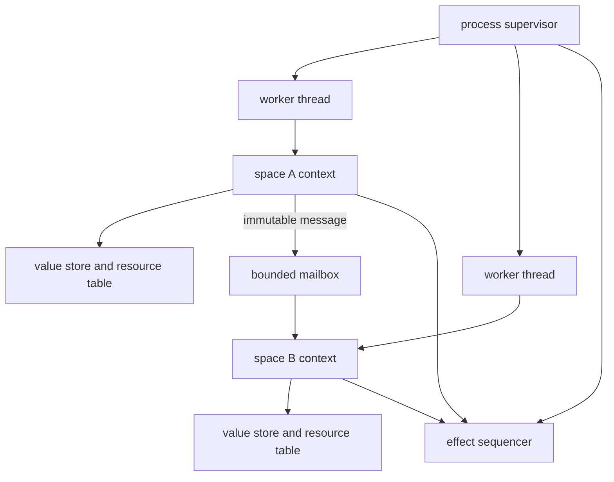

# Linux machine threading: implications for Ken

**Research status:** advisory, not an architecture ruling

**Grounding:** `origin/main` at
`fa33fa55d8d9c72c003afeb2d3badda6b0ee84a8`, plus the held PX7-R candidate
`edaead31e5844add0eca4efcce14a13e3c1e755a` and its subsequently amended frame

**Date:** 2026-07-16

## Executive assessment

Ken does not currently support multiple machine threads in one program. This
is not an accidental omission in the Linux-ABI campaign: the campaign
explicitly excludes a thread-safe runtime and exits with native programs that
are **single-threaded and event-driven**
([campaign §§3–4a](../docs/program/09-posix-linux-abi-campaign.md)). The current
interpreter and native host context are correspondingly single-writer.

The language design nevertheless has a strong starting point. A Ken `space` is
already specified as a shared-nothing actor: it owns non-aliased mutable state,
communicates only through immutable values, and may eventually map to a process,
machine thread, green thread, or distributed participant
([effects §4.4](../spec/30-surface/36-effects.md)). That means Ken need not add
shared mutable memory, public atomics, or a Rust-like memory model merely to use
several CPU cores.

The most compatible direction is:

1. Keep each `space` logically single-threaded.
2. Run different spaces in parallel on a native worker pool.
3. Give every space its own mutable runtime context: value store, resource and
   capability tables, mailbox, and local trace.
4. Pass messages by immutable value transfer and re-interning, as the capacity
   contract already anticipates
   ([capacity §3](../spec/40-runtime/44-capacity.md)).
5. Keep the reference interpreter physically single-threaded at first and make
   it simulate the same actor scheduler deterministically.

This preserves Ken's existing semantic model while allowing real parallel
execution in native binaries. The alternative—letting arbitrary Ken closures
share mutable runtime structures across OS threads—would require a much larger
language, runtime, and verification redesign.

The design should be settled soon, even if implementation remains a separate
post-PX campaign. PX7 resources, PX10 process creation, and PX12 signals/event
delivery each contain choices that are cheap to make thread-compatible now and
expensive to reverse later.

## 1. Four meanings of “thread support”

They should not be treated as one feature.

| Capability | Meaning | Current status |
|---|---|---|
| Thread-safe embedding | Independent host threads invoke separate Ken computations | Not specified |
| Parallel runtime | One Ken process evaluates independent spaces on several cores | Not implemented |
| Ken concurrency surface | Ken source can spawn, message, join, cancel, and observe tasks | Shared-nothing model specified; operations not realized |
| Raw Linux thread API | Ken code directly controls `clone3`, futexes, TLS, and scheduling | Out of scope and not recommended as the standard surface |

A “full Linux ABI” does not require making raw `clone3` an ordinary Ken
operation. Ken can use Linux threads as an implementation mechanism while
exposing the safer `space`/message abstraction. A restricted low-level thread
tier, if ever wanted, is a separate audited API.

## 2. What the current implementation assumes

### 2.1 Interpreter

`EvalVal` contains pervasive `Rc` ownership for constructor arguments, pairs,
closures, environments, and eliminator state
([`eval.rs:168–275`](../crates/ken-interp/src/eval.rs)). `Rc` is neither `Send`
nor `Sync`; Rust deliberately uses that fact to reject cross-thread movement of
these values. The evaluator also accepts one exclusive `&mut EvalStore`, and
`EvalStore` owns mutable hash maps and one mutable K3 `Store`
([`eval.rs:73–147`](../crates/ken-interp/src/eval.rs)).

This is not a correctness defect. It means the reference interpreter is a
single-threaded evaluator. Replacing every `Rc` with `Arc` would make some types
transferable, but would not by itself define scheduling, mutation ownership,
effect order, resource lifetime, or deterministic observation. The official
Rust model makes the distinction explicit: `Send` permits transfer and `Sync`
permits sharing; `Rc`, `Cell`, and `RefCell` intentionally provide neither
guarantee
([Rustonomicon: Send and Sync](https://doc.rust-lang.org/nomicon/send-and-sync.html)).

### 2.2 Value store

The K3 store is single-writer by construction:

- `Space::intern`, its arena append, and its open-addressing index all require
  `&mut self`;
- index resize is a single-writer rehash;
- arena pages are mutable `Vec<u8>` buffers; and
- the public `Store` wraps one `Space`
  ([`store.rs:43–381`](../crates/ken-runtime/src/store.rs)).

Only the process-wide slot-ID allocator is atomic, using relaxed ordering
([`store.rs:30–37`](../crates/ken-runtime/src/store.rs)). This is enough for
unique IDs, not a concurrent store. The specification says exactly that the
concurrent index and atomic bump allocator are future hardening, not shipped
([capacity §1a–1b](../spec/40-runtime/44-capacity.md)).

Crucially, the same specification already gives the better parallelization
boundary: each `space` owns a separate arena and index, and values crossing a
space boundary are re-interned into the recipient. Parallel spaces therefore do
not need a global concurrent interner.

### 2.3 Native host invocation

The native entry ABI is close to being reentrant because generated entrypoints
receive an explicit invocation pointer, and every host effect passes that
pointer to `ken_host_dispatch_v1`
([`cranelift_backend.rs:1292–1360`](../crates/ken-runtime/src/cranelift_backend.rs)).
However, one invocation is not concurrency-safe:

- `ProcessContext` owns mutable capability state, response storage, the effect
  trace, and—on PX7-R—the resource table;
- `ken_host_dispatch_v1` casts the opaque pointer directly to `&mut
  ProcessContext`; and
- its safety comment states that generated calls are sequential
  ([`abi_v1.rs:826–850`](../crates/ken-host/src/abi_v1.rs)).

Concurrent dispatch through the same invocation pointer would therefore violate
the Rust exclusive-reference contract and could be undefined behavior, not just
a logical race. Multiple threads become straightforward only if each executing
space has a distinct context or if dispatch is serialized through one owner.

### 2.4 Runtime IR and compiler

`RuntimeExpr` has values, control flow, closures, calls, effects, and traps, but
no task, mailbox, join, or scheduling node
([`ir.rs:335–393`](../crates/ken-runtime/src/ir.rs)). The compiler can lower a
host effect through the explicit invocation pointer, but it cannot yet express
parallel execution.

The emitted launcher also creates one invocation, calls one entrypoint, then
finishes and destroys that one context
([`object_linker_packaging.rs:1709–1739`](../crates/ken-runtime/src/object_linker_packaging.rs),
[`1850–1889`](../crates/ken-runtime/src/object_linker_packaging.rs)). Thread
support therefore requires a worker-entry ABI and per-space execution contexts,
not merely one new syscall wrapper.

## 3. Language implications

### 3.1 Preserve shared-nothing as the semantic contract

The existing `space` contract should be the language-level concurrency model.
Each space executes one operation at a time against encapsulated state. Machine
threads are an implementation mapping, not an observable identity.

This yields a small Ken memory model:

- pure values remain immutable;
- mutable cells remain local to one space;
- sending a message establishes a happens-before edge from send to receive;
- no Ken-level data race exists because there is no shared mutable Ken object;
  and
- FFI shared memory remains the explicitly unsafe exception already named by
  effects §4.4.

The machine thread ID, worker number, stack address, and scheduling order should
never enter value identity, capability identity, resource identity, or proof
meaning.

### 3.2 Surface operations that need specification

A practical first surface needs at least:

- create/start a space;
- bounded mailbox send and receive;
- completion/join;
- cancellation and timeout;
- failure/trap propagation; and
- orderly shutdown and cleanup.

These are effects and resource operations, not kernel typing rules. Creation
should be capability- and budget-governed because thread exhaustion is a real
runtime failure. Mailbox capacity and backpressure must be explicit; an
unbounded mailbox would merely move memory exhaustion into a hidden queue.

“Spawn an arbitrary closure” is deceptively large. Native closure transfer
requires stable code identity plus a transferable captured environment. A
smaller first contract is to spawn a named space entrypoint and send a closed,
canonical message value. Whether closures, capabilities, or opaque resource
tokens may be messages is a design decision, not something to inherit from the
phrase “immutable value.”

### 3.3 Resource ownership must stay with one space

The PX7-R candidate's strongest property is its unique, non-cloneable
`ResourceHandleV1` and generation-checked table. That shape is compatible with
threads if a resource table has exactly one logical owner. It becomes hazardous
if a token can be used concurrently from unrelated spaces.

For the first threaded runtime, the safest rule is:

- a resource belongs to its creating space;
- other spaces send requests to that owner rather than operating on the token;
- release is serialized with uses by the owner; and
- a space cannot terminate until its explicit finalizer has settled its live
  resources.

If cross-space resource transfer is later added, the runtime needs a true
ownership handoff protocol. Ken has deliberately rejected affine types, so a
cloneable-looking public token cannot honestly promise that handoff statically.

## 4. Interpreter implications

### 4.1 Do not make the oracle parallel first

The reference interpreter should initially implement a deterministic scheduler
on one OS thread. It can hold several space states and take one logical turn
from each without moving `Rc`-based values across machine threads. That is a
faithful implementation of actor concurrency and avoids turning evaluator
thread safety into a prerequisite for the language semantics.

This also keeps reproducibility. The current interpreter/native discipline
compares ordered effect traces. Real parallel execution introduces several
legal interleavings, so byte-identical global traces stop being an adequate
equivalence relation unless the runtime imposes a canonical order.

### 4.2 Choose an observation model explicitly

Two viable models exist:

1. **Canonical effect sequencer.** Parallelize pure computation, but submit all
   externally observable effects to one sequencer. It assigns the canonical
   event order. Existing ordered-trace comparison largely survives.
2. **Causal observation.** Record `(space identity, local sequence)` plus
   message/join edges and compare partial orders, admitting unrelated event
   reorderings.

The first is much cheaper and is the recommended V1. The second permits more
parallel host I/O but requires a new trace schema, causal equivalence checker,
and careful definition of which reorderings users can observe.

Whichever is chosen, scheduler decisions should be recordable and replayable.
A stress run can explore schedules; a failing schedule must reduce to a stable
replay artifact rather than a timing-dependent test.

## 5. Runtime implications

### 5.1 Preferred ownership shape

One space may migrate between workers, but two workers must never execute the
same space concurrently. The runtime should move an owned context, not share a
mutable context. This is a `Send` requirement, not a `Sync` requirement, and is
substantially easier to audit.

Per-space state should include:

- evaluation/native frame state;
- K3 `Space` store;
- capability and revocation view;
- PX7 resource table and explicit finalizer;
- mailbox and cancellation state; and
- local causal/trace sequence.

Process-global state should be minimal: immutable code and manifests, the
worker scheduler, bounded queues, and any canonical effect sequencer.

### 5.2 Deterministic identities

The PX7-R candidate mints resource trace identities from acquisition order in
one table. With several tables, a bare local counter collides; a process-wide
atomic counter avoids collisions but makes identities depend on thread timing.
Neither is a good long-term canonical identity.

Use a logical identity such as `(space creation identity, local acquisition
sequence)`, with space creation identity derived from the deterministic parent
and spawn sequence. The same rule should cover task IDs and trace IDs. No
identity should depend on a TID, worker, pointer, file descriptor, or the race
to an atomic increment.

### 5.3 In-flight operation versus close

Linux explicitly warns against closing a descriptor while another thread may
be using it. A blocked I/O operation holds the open-file description and may
complete successfully after another thread closes the descriptor; the numeric
descriptor can meanwhile be reused
([Linux `close(2)`](https://man7.org/linux/man-pages/man2/close.2.html)).

Generation invalidation prevents a *later* token lookup from reaching a reused
descriptor, but it does not settle an operation that resolved the handle before
release began. A threaded resource design therefore needs one of:

- owner-space serialization, recommended for V1;
- per-operation leases plus release waiting for the lease count to reach zero;
  or
- operation cancellation with an exact settlement rule.

PX7's invalidate-before-close and never-retry rules remain necessary, but are
not sufficient once uses can overlap release.

### 5.4 Faults, cancellation, and shutdown

Machine threads add failure boundaries absent from the current one-entrypoint
model. The runtime contract must state:

- whether one space trap cancels siblings or only its structured children;
- whether dropping a join handle detaches or cancels;
- when cancellation is observed;
- how blocked mailbox/effect waits wake;
- how cleanup failures combine with the primary failure; and
- when process exit waits for or terminates remaining spaces.

Detached, unobservable background work is a poor default for a verified
software-engineering language. A structured parent/child lifetime is easier to
reason about and pairs naturally with PX7's explicit finalization.

## 6. Linux ABI implications

### 6.1 Thread creation is an ABI family, not one syscall

A direct implementation over `clone3` must correctly provide:

- a separately allocated, guarded stack;
- the thread-group/share flags and their required combinations;
- TLS setup via `CLONE_SETTLS`;
- parent/child TID storage and exit clearing;
- join/wake behavior, normally involving a futex;
- per-thread signal masks and optional alternate signal stacks; and
- process-versus-thread exit behavior.

The Linux documentation cautions that `CLONE_SETTLS` is architecture-dependent
and intended for threading-library implementers. `CLONE_CHILD_CLEARTID` clears
the child TID and performs a futex wake on exit
([Linux `clone(2)`](https://man7.org/linux/man-pages/man2/clone.2.html)). Futexes
are shared-memory synchronization words whose uncontended protocol lives in
userspace and whose wait/wake path enters the kernel
([Linux `futex(2)`](https://man7.org/linux/man-pages/man2/futex.2.html)). This is
a threading runtime, not an ordinary host-operation wrapper.

There is consequently a real architecture fork:

- **Use Rust native threads and synchronization internally.** This is the small,
  mature path and matches Ken's current Rust-`std` runtime, but the thread
  substrate is then the Rust/platform runtime rather than a manifest-bound
  Ken-authored `clone3` implementation.
- **Build a direct Linux threading substrate.** This preserves a strict
  direct-kernel story but creates a new unsafe, architecture-sensitive TCB
  boundary for stacks, TLS, atomics, futexes, and teardown.

The present “linux_raw” commitment covers the audited host-operation seam; Ken
is not currently a `no_std` or libc-free executable. The generated launcher
itself uses the C runtime (`malloc`, `free`, `getcwd`, stdio)
([`object_linker_packaging.rs:1687–1744`](../crates/ken-runtime/src/object_linker_packaging.rs)).
The thread-substrate choice therefore needs an explicit Architect/operator
ruling instead of being inferred from the phrase “Linux ABI direct.”

### 6.2 Signals become process architecture

Signal dispositions are process-wide, while each thread has its own signal
mask; a process-directed signal may be delivered to any eligible thread
([Linux `signal(7)`](https://man7.org/linux/man-pages/man7/signal.7.html)). PX12's
planned `signalfd` design therefore needs all worker threads to inherit/block
the managed signals and one designated broker to consume them. Installing a
`signalfd` in one thread while another leaves the same signals unblocked is not
a reliable process-level design.

The current process-wide SIGPIPE-ignore posture remains sensible, but its
initialization must complete before workers start.

### 6.3 Processes become harder after threads

After `fork()` in a multithreaded process, only the calling thread survives in
the child while mutexes and other synchronization objects retain copied state;
the child may call only async-signal-safe functions until `execve()`
([Linux `fork(2)`](https://man7.org/linux/man-pages/man2/fork.2.html)). This makes
PX10's existing “raw fork is restricted” guidance load-bearing, not stylistic.

Every descriptor-producing operation must also set close-on-exec atomically at
creation time. Setting it later with `fcntl` races another thread performing
fork/exec; Linux documents `O_CLOEXEC` as essential for this reason
([Linux `open(2)`](https://man7.org/linux/man-pages/man2/open.2.html)). The same
rule applies to socket, pipe, eventfd, timerfd, signalfd, and accepted-connection
creation flags.

## 7. Compiler implications

The frontend compiler does not need to become parallel merely because emitted
programs are parallel. The code generator and artifact contract do need these
properties:

1. **Reentrant generated functions.** No mutable evaluation state in generated
   globals; pass the space/invocation context explicitly.
2. **Worker entry ABI.** A stable entry stub accepts a named code identity, a
   closed message/environment, and its owned space context.
3. **Transferable value representation.** Message values must have a native
   representation that can be copied/re-interned without pointer or slot
   identity leaking across stores.
4. **Explicit concurrency IR.** Spawn/send/receive/join/cancel must survive
   erasure as effects or closed runtime nodes with capability, failure, and
   observation metadata.
5. **Thread-safe code and immutable metadata.** Compiled code, manifest tables,
   and symbol tables may be shared read-only; response arenas, stacks, and
   mutable runtime state remain per space/invocation.
6. **Trap and unwind boundary.** A trap cannot unwind through an arbitrary
   foreign worker entry. It becomes a structured task outcome, triggers the
   required finalizer, and is joined/propagated by the runtime.
7. **Differential contract update.** Concurrency cases compare the canonical
   scheduler trace or causal graph, not raw allocation order, address, worker,
   or wall-clock timing.

This suggests a useful structural gate: generated code should be invocable
twice concurrently with two distinct contexts and produce independent results,
before any source-level thread API is added.

## 8. Decisions that need owners

These are genuine architecture choices rather than research conclusions:

1. **Thread substrate:** Rust native threads or a new direct `clone3`/futex/TLS
   boundary?
2. **Observation:** one canonical effect sequencer or causal partial-order
   traces?
3. **Message universe:** first-order canonical data only, or also closures,
   capabilities, and resource ownership transfer?
4. **Failure structure:** parent/child cancellation and join semantics?
5. **Scheduling policy:** one OS thread per space, fixed worker pool, or adaptive
   workers? Is the worker count a capability/budget?
6. **Foreign entry:** may arbitrary foreign threads attach to a Ken runtime, and
   what context/TLS initialization does attachment require?

The Architect owns the component-design answers; language/spec consequences
then belong to the Spec enclave. This report does not resolve them.

## 9. Suggested staging

The existing PX campaign should remain single-threaded as promised. A separate
threading campaign can be staged without discarding its work:

1. **Contract and compatibility pass now.** Resolve the six decisions above.
   Record thread-ready constraints for PX7, PX10, and PX12 without implementing
   threads.
2. **Isolation substrate.** Realize surface spaces as distinct runtime `Space`
   stores and per-space host/resource contexts. Add transfer/re-interning and
   bounded mailboxes, still on one OS thread.
3. **Deterministic interpreter concurrency.** Add spawn/message/join/cancel
   semantics and a replayable single-thread scheduler.
4. **Reentrant native gate.** Prove two independent native contexts can execute
   concurrently; add worker entry stubs and structured task outcomes.
5. **Native worker pool.** Map spaces to OS workers, one turn per space, with a
   canonical effect sequencer initially.
6. **Concurrency differential and stress net.** Schedule replay, resource
   close/use races, mailbox backpressure, cancellation cleanup, signal routing,
   fork/exec descriptor inheritance, and repeated high-contention runs.

The first pass is timely before PX7/PX10/PX12 contracts harden. The remaining
implementation can follow PX-E without falsely expanding the current campaign.

## 10. Bottom line

Multiple machine threads are compatible with Ken's design, and the pre-existing
shared-nothing `space` model is the reason. They are not compatible with simply
sharing today's evaluator, store, `ProcessContext`, or PX7 resource table behind
a mutex and calling the result thread-safe.

The clean design is **parallel spaces, sequential space ownership, immutable
messages, and explicit per-space contexts**. It lets the interpreter remain a
deterministic oracle, lets native execution use several cores, and keeps shared
memory and atomics inside a small audited Rust runtime rather than turning them
into general Ken language features.
