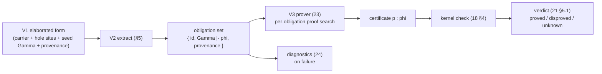

# Obligation generation

> Status: **V2 elaborated** (implementation-ready). Normative for what
> obligations are, how they arise, and the **extraction algorithm** that
> produces them. Contract for WS-V **V2** (the verification-condition extractor,
> second WP of the spine V1→V2→V3). **★★ (untrusted):** every obligation is
> discharged in V3 and the cert is **kernel-re-checked** (`../10-kernel/18
> §4`). A V2 bug never breaks **kernel** soundness — the kernel re-checks every
> *supplied* certificate, so a **spurious** or malformed obligation is at worst
> over-conservative (a false `unknown`). But a **missed** obligation (a burden
> the extractor never emits) is **not** caught downstream: it supplies no cert,
> so the honesty guard (`21 §5.4`) — which catches generated-but-undischarged
> holes — never sees an *un-generated* site; a false property reads `proved`.
> **Completeness of extraction is therefore the *verification*-soundness
> linchpin, backstopped by nothing but the absent-clause scan (§2.5)** — not by
> the kernel, which only ever sees what V2 chose to emit. Turns a V1-spec'd
> program into **proof obligations** — propositions in Ω, each in its local
> hypothesis context — that the prover (`23`) discharges and the kernel
> re-checks.

V2 is the bridge from V1's *syntax* (`requires`/`ensures`/refinements/goals,
`21`) to V3's proof search (`23`): it **consumes** V1's carrier-plus-obligation
elaboration (`21 §6`/§7) and **produces** the obligation set keyed for the
verdict projection (`21 §5`). The two load-bearing properties (§the frame) are
**completeness of extraction** — every spec clause that bears a proof burden
yields its obligation (the absent-clause scan, §2.5) — and **honest provenance**
— each obligation traces to its source clause for diagnostics and the four-way
status (`24`, `25`).

## 1. What an obligation is

An **obligation** is a triple

```
  ⟨ id , Γ ⊢ φ , provenance ⟩
```

- `id` — a **stable** identifier (for the protocol, `25`); stable across edits
  unrelated to the clause, so an agent can diff verification runs (`24 §6`).
- `Γ ⊢ φ` — a **goal proposition** `φ : Ω_ℓ` (`../10-kernel/12 §5`, `16 §1.1`)
  in a **local context** `Γ` of the hypotheses in scope at the point it arose.
- `provenance` — where it came from: the source span and the spec clause
  (`requires`/`ensures`/refinement/`prove`/`law`) responsible, used by
  diagnostics (`24`) and the verdict's epistemic projection (`21 §5`).

Discharging an obligation means producing a term `p` with `Γ ⊢ p : φ`, which the
kernel re-checks via `check(env, Γ, p, φ)` (`18 §4.5`). **An obligation is
exactly a typed hole** of type `φ` in context `Γ` (`24 §2`): obligation
generation *is* finding the holes V1's elaboration leaves where a proof is
required (`21 §6.5`), and proving = hole-filling. This unifies "obligation,"
"typed hole," and "visible postulate" — an open hole is admitted as a postulate
of `φ` and appears in `trusted_base()` (honesty guard, `21 §5.4`), so partial
verification (`21 §5`) is just leaving some holes unfilled.

Obligations are **independent**: each is a self-contained `Γ ⊢ φ`, provable in
any order / in parallel (the prover and the agent-team both exploit this, §6).

### 1.1 What V2 consumes from V1, and what it adds

V1 (`21 §7`) hands V2 a four-part interface: (1) the **kernel-checkable core
term** with V1's contract encodings — precondition Π proof-args, **carrier**
result and refined-parameter types, the bare body; (2) the **obligation-hole
set** — one hole `?id : φ` per `ensures`/refinement-introduction/`prove`/
`law`-field site, admitted as a postulate; (3) each hole's **at-introduction
`Γ`** — the preconditions and refined-parameter predicates in scope where the
obligation arose; (4) **provenance** per hole.

V2 reads this **bare-carrier-plus-obligation** form — never a proof-carrying
`Σ(B,ψ)` value (V1 does not emit one, `21 §2`/§6.3) — so V2 is **decoupled from
the `Σ`-sort erratum** (`13 §4`, on `wp/V1-sigma-sort`): it never forms
or depends on a core `Σ` over an Ω predicate. What V2 **adds** over V1's seed is
the **path-sensitive hypothesis accumulation** (§3) — the extraction algorithm's
context-building, layered onto each hole's seed `Γ` as it walks the elaborated
body — and the **body-as-motive induction plumbing** (§4). That context-building
is where V2 earns its ★★: V1 marks *where* the holes are; V2 computes *under
exactly what facts* each must be discharged.

## 2. Where obligations come from

Four sources, all arising during elaboration of the spec encoding (`21 §6`,
`../30-surface/39-elaboration.md`). Each is stated as the V1 clause-form it
consumes → the obligation(s) it emits.

### 2.1 Refinement introduction

Using `a : A` where `{ x : A | φ x }` is expected emits

```
  Γ ⊢ φ[a/x]                              (the value really satisfies the refinement)
```

This is the introduction direction `A ≤ {x:A|φ}` (`21 §2`). The **reverse**,
forgetful direction `{x:A|φ} ≤ A`, is **free** (it forgets the proof; in V1's
carrier encoding it is the identity on `A`) and emits **no** obligation (§2.5).

### 2.2 Postcondition

A postcondition `ensures ψ` makes the **refined result type** `{r : B | ψ}` the
body's expected type and **pushes it through the body's structure** (§3/§4) —
it is *not* a single obligation over a branchy body. The result type is the
**motive** (§4); extraction realizes it at the body's leaves:

- a **straight-line** body `b` emits the single obligation `Γ, Δ ⊢ ψ[b/result]`
  (the §2.1 refinement obligation on `b`, `result` replaced by the body,
  `21 §6.3`) — the degenerate, non-branchy case;
- a **branchy** body (an eliminator — `match`/`if`/recursion) **splits per
  branch** via the motive (§4, `39 §2.6`): each branch leaf `bₖ` emits
  `Γ, Γₖ ⊢ ψ[bₖ/result]` under that branch's path hypotheses (§3: scrutinee/bool
  equation, plus the **induction hypothesis** for a recursive branch).

Splitting is **required**, not an optimization: a recursive function's
postcondition is only provable *by induction*, which is exactly the
per-constructor obligation-with-IH the motive yields (§4) — a single obligation
over the whole recursive body carries no induction hypothesis and cannot be
discharged. There is **no** separate over-the-whole-body postcondition
obligation; the postcondition is the result-type motive, realized per path.

### 2.3 Precondition discharge at call sites

Calling `f` whose parameter `requires φ` (or whose parameter type is a
refinement `{x:A|φ}`) emits, **at the call**,

```
  Γ_call ⊢ φ[ā/params]                    (the caller meets the precondition)
```

This is the **caller's** burden. Inside `f`'s own body, `φ` is **not** an
obligation — it is an **assumption** in `Γ` (§3, §2.5): the callee may assume
what the caller must establish. This asymmetry is the whole point of contracts
and is the most common source of a wrongly-placed obligation (§2.5).

### 2.4 Partial-primitive application

A bare fixed-width `+`/`-`/`*` or an unrefined `/` (or `%`) on `Int` emits a
no-overflow / non-zero side-condition obligation at the operation site
(`../30-surface/35-numbers.md §3`, `../40-runtime/43-termination.md §2`) per the
`OQ-1a` partial-primitive discipline.

Standalone `prove name : φ` (`21 §3`) is the **degenerate** case: one obligation
`Γ_binders ⊢ φ` with no body. A `law` (`21 §3`) emits one obligation per field.

### 2.5 The absent-clause scan (what yields *no* obligation — and why)

Completeness is two-sided: the extractor must emit an obligation at **every**
burden-bearing site (§2.1–§2.4), and must **not** emit one where there is no
burden — but each no-emit position is **explicitly guarded with its reason**, so
a *missing* guard (a silently-dropped clause) is detectable. The hazard is a
missed obligation reading as "verified"; the discipline is to enumerate the
no-emit positions and name the guard for each:

**The exhaustiveness property (normative).** The traversal is **exhaustive by
construction**: over the *fixed* core `Term` set (`11 §1`), **every** form is
one of an emit site (§2.1–§2.4), a Γ-extension (§3), or a **guarded**
no-emit (below) — there is **no catch-all silent skip**. An unrecognized or
future core form with no rule is an **emit-or-error** (a visible build failure),
never a silent recurse-past. This is what makes "a missing clause is a visible
gap, not a silent drop" concrete: because completeness is backstopped by nothing
but this scan (the intro), a *new* burden-bearing construct cannot be silently
no-emitted — it has no guarded-skip rule, so it fails loudly until one is added.

1. **A refined *parameter*** `(x : {y:A|φ})` is a **Γ-hypothesis, not a
   definition-site obligation.** It contributes `φ[x]` to `Γ` (§3); its proof is
   the **caller's** obligation at the call (§2.3). *Guard:* the position is a
   **binder**, not a use/introduction. (A bug treating it as an introduction
   would emit a spurious obligation the callee cannot discharge — it has no
   proof that its own argument satisfies `φ`.)
2. **A body `requires φ`** (a precondition, once inside the body) is **assumed,
   not re-obligated.** *Guard:* a precondition enters `Γ` at the top of the body
   (§3) and is never emitted as the function's own goal. (The caller already
   owes `φ`, §2.3.)
3. **A site whose discharging certificate is already present** — a `prove name :
   φ` given a term, or a refinement introduction at a value the elaborator
   already proved — yields **zero new** obligations: the certificate **is** the
   discharge (`check`ed, `18 §4.5`), so the hole is retired, not re-emitted.
   *Guard:* a discharged hole is not in the open set (`21 §5.4` — goal leaves
   `trusted_base()`).
4. **The forgetful coercion** `{x:A|φ} ≤ A` is **free** (§2.1). *Guard:* the
   `≤`-direction (carrier-forgetting, not refinement-introducing).

**The completeness counter-rule (do not over-skip).** A clause that is
*trivially* true still yields its obligation — **a provable one, not no
obligation.** The extractor MUST NOT skip an "obviously true" `ensures`/
refinement: it emits the obligation and lets V3 discharge it trivially. *Guard:*
emission is keyed on the *clause's presence*, never on a triviality heuristic.
(This is the absent-clause discriminating property, acceptance §1: a real-burden
clause and a trivial clause both **emit** distinct obligations; neither yields
*no* obligation. A "skip the trivial ones" optimization is exactly how a clause
that was not actually trivial gets silently dropped.)

## 3. Hypothesis accumulation (the context Γ)

The power of the obligations comes from what is *assumed* in `Γ` at each point —
**path-sensitive**, like a verification-condition / refinement-type system, but
with hypotheses being **kernel propositions** (`: Ω`), not an external logic.
This is V2's novel work (§1.1). The extractor extends `Γ` as it walks the
elaborated body, by these rules — each a precise `Γ`-extension, stated
defensively so a dropped hypothesis (a too-weak `Γ`, → a false `unknown`) is the
visible failure, never a too-strong `Γ` (which could mask a real burden):

- **Preconditions.** `requires φ` adds `(_ : φ)` to `Γ` at the top of the body
  (the assumption of §2.3/§2.5).
- **Refined parameters.** `(x : {y:A|φ})` adds `(_ : φ[x])` to `Γ` (§2.5.1).
- **`let x := e`** (with `e : A`) adds `(x : A)` and, where `A` is informative,
  the equation `(_ : Eq A x e)` — a propositional hypothesis in Ω — so later
  obligations may rewrite by the binding.
- **`match` / case split.** Elaborated to an eliminator (`elim_D`, `14 §3`,
  `../30-surface/39 §2.6`). In each constructor branch `cₖ`, `Γ` gains the
  constructor's **fields** as binders **and** the **scrutinee equation**
  `(_ : Eq A s (cₖ field̄))` (in Ω) — so in the `nil` branch you may assume
  `xs ≡ nil`. This is what makes case-analysis proofs go through.
- **Conditionals.** `if c then … else …` (elaborated `elim_Bool`) adds
  `(_ : Eq Bool c true)` in the `then` branch and `(_ : Eq Bool c false)` in the
  `else` branch.

Each obligation is therefore discharged under **exactly** the facts that hold on
its path. The `Γ` of an obligation emitted deep in a branch is V1's seed `Γ`
(§1.1) extended by every accumulation rule on the path from the body's root to
that site.

## 4. Body-as-motive (verifying recursive and dependent functions)

For a function whose correctness is *inductive* — a recursive `view`, or one
whose result type depends on a recursed argument — the obligation structure
follows the **body as the motive**, recovered from the elaborator's `match →
elim_D` compilation (`39 §2.6`); V2 does not synthesize an induction principle,
it **reads the eliminator the elaborator already built**:

- The function elaborates to an application of the relevant **eliminator**
  (`14 §3`) whose **motive** `M` is the (refined) result type as a function of
  the recursed argument — `M z = {r : B z | ψ}` for an `ensures ψ` over a
  scrutinee `z`.
- The kernel's **dependent** eliminator gives each constructor method the
  **induction hypothesis** as a parameter: in the `cₖ` method, every recursive
  field `zᵢ` carries `M zᵢ` (the motive already established for the
  sub-structure). V2 adds these `M zᵢ` to `Γ` (§3) — so the obligation for the
  `suc n` / `cons x xs` branch is discharged with "the postcondition holds for
  the recursive call" in scope. This is precisely structural induction, surfaced
  automatically.
- **Non-recursive** functions are the degenerate motive (no recursive fields ⇒
  no induction hypotheses); the same machinery covers both — the extractor does
  not special-case recursion.

So "prove this recursive function meets its spec" becomes "discharge the
per-constructor obligations, each with the recursive call's spec as a
hypothesis" — generated mechanically, no manual induction principle stated by
the user. (The eliminator's own totality is the kernel's concern — strict
positivity / W-style / SCT, `14 §8`/`17 §4`; V2 consumes a well-formed
eliminator, it does not re-check termination.)

## 5. The extraction algorithm

The extractor walks V1's elaborated core term, emitting obligations at the
burden sites (§2) while threading the path-sensitive `Γ` (§3) and the
body-as-motive structure (§4). The pseudocode is **defensive**: every
burden-bearing position has an emit clause; every `Γ`-extending construct has a
recurse-under-extended-`Γ` clause; and every **no-emit** position is an explicit
guarded skip (§2.5), so a missing clause is a visible gap, not a silent drop.

```
extract(Γ, term, expectedTy) → ObligationSet:        -- Γ: hypotheses; term: V1 core
  obls := ∅
  case term of

  -- (§2.1) refinement introduction: a value at a refined expected type
  _  when expectedTy = Refine(A, φ):
        obls ∪= ⟨fresh(), Γ ⊢ φ[term/x], prov(term)⟩            -- emit, even if trivial (§2.5)
        obls ∪= extract(Γ, term, A)                              -- recurse at the carrier

  -- (§2.2) a contracted function definition (V1's elabView output)
  ViewDef(Δ, requires φ̄, ensures ψ̄, body, B):
        Γ' := Γ ⊕ Δ ⊕ { (_ : φᵢ) | φᵢ ∈ φ̄ } ⊕ refinedParamHyps(Δ)  -- §3: precond + refined-param assumed
        resultTy := refine(B, ψ̄)                                  -- {r : B | ψ₁ ∧ … ∧ ψₙ}: the postcondition AS the result-type motive (§4)
        obls ∪= extract(Γ', body, resultTy)                       -- §2.2: push it through the body — straight-line ⇒ one ψ[b/result]; branchy ⇒ per-path/per-ctor (the Elim/If clauses below, §3/§4). NO separate over-the-body obligation.

  -- (§2.3) a call of a contracted function: the CALLER's burden
  App(f, ā)  when hasPreconds(f):
        for φᵢ ∈ preconds(f):
           obls ∪= ⟨fresh(), Γ ⊢ φᵢ[ā/params], prov(call)⟩      -- §2.3 at the call site
        obls ∪= extractArgs(Γ, ā)                                -- recurse into arguments

  -- (§2.4) a partial primitive
  Prim(op, ā)  when isPartial(op):
        obls ∪= ⟨fresh(), Γ ⊢ sideCond(op, ā), prov(op)⟩        -- no-overflow / non-zero
        obls ∪= extractArgs(Γ, ā)

  -- (§3) hypothesis-accumulating constructs: extend Γ, recurse
  Let(x, e, A, body):
        Γ' := Γ ⊕ (x : A) ⊕ infoEq(x, e, A)                      -- §3 let-equation (if informative)
        obls ∪= extract(Γ, e, A) ∪ extract(Γ', body, expectedTy)
  Elim(M, methods, scrut, A):                                    -- §4 match/case-split; M = the (refined) result-type motive (§2.2)
        for (cₖ, branchₖ) ∈ methods:
           Γₖ := Γ ⊕ fields(cₖ)
                   ⊕ (_ : Eq A scrut (cₖ fields(cₖ)))            -- §3 scrutinee equation
                   ⊕ { (_ : M zᵢ) | zᵢ ∈ recursiveFields(cₖ) }  -- §4 induction hypotheses
           obls ∪= extract(Γₖ, branchₖ, M (cₖ fields(cₖ)))      -- the refined motive carries the postcondition into each branch
  If(c, thn, els):                                               -- §3 conditional (elim_Bool)
        obls ∪= extract(Γ ⊕ (_ : Eq Bool c true),  thn, expectedTy)
        obls ∪= extract(Γ ⊕ (_ : Eq Bool c false), els, expectedTy)

  -- (§2.5) GUARDED no-emit positions — recurse structurally, emit nothing here
  RefinedParamBinder(x, A, φ):  skip            -- a binder ⇒ Γ-hypothesis (done above), not an obligation
  Forget(refined → carrier):    skip            -- {x:A|φ} ≤ A is free
  Var | Const | Lam | Pair | Proj | Type | …:   -- the known burden-free structural formers
        recurse into immediate subterms with the same Γ

  -- NO catch-all `_ => skip`. The dispatch is EXHAUSTIVE over the fixed core
  -- Term set (`11 §1`): every variant is an emit site, a Γ-extension, or an
  -- explicitly-guarded no-emit above. An unmatched form is a build **error**,
  -- never a silent recurse-past (§2.5: the exhaustiveness property).
  return obls
```

- **Untrusted — but completeness is the verification-soundness linchpin.** A
  **spurious** or malformed obligation is harmless: the *kernel* `check`s every
  *supplied* certificate against its goal (`18 §4`), so it is at worst
  over-conservative (a false `unknown`), never a false **kernel** acceptance. A
  **missed** obligation, however, is **not** caught downstream — it supplies no
  cert, so the honesty guard (`21 §5.4`) never sees an un-generated site, and a
  false property reads as `proved`. So extraction completeness rests on the
  **absent-clause scan (§2.5)** alone — the exhaustive, no-silent-skip traversal
  is what makes "all obligations discharged ⇒ correct" sound.
- **Completeness target.** Every refinement/contract/goal use generates the
  obligations whose discharge (plus kernel checking) suffices for the spec to
  hold (acceptance §1). The absent-clause scan (§2.5) is the audit that no
  burden-bearing position is silently skipped.
- **Decoupled from `Σ`-sort.** `extract` reads V1's carrier form and emits
  obligations over `Ω` propositions; it never forms a core `Σ` over an Ω
  predicate, so it is independent of the `sort_sigma` erratum (§1.1).

## 6. Output and the V2→V3 interface

Obligation generation produces, per definition, the **ordered obligation set**
with contexts and provenance. This is the V2→V3 interface — the input to the
**classifier/prover** (`23`) and the verdict projection (`21 §5`):



- Each obligation maps to **one** proof attempt → **one** verdict (`21 §5.1`):
  `proved` (a certificate that `check`s), `disproved` (a countermodel), or
  `unknown` (an unfilled hole = a visible postulate). The set is keyed so the
  per-claim **epistemic status** (`21 §5.2`/§5.3) projects from its obligations'
  verdicts.
- A definition with an **empty** obligation set (or all discharged) is fully
  verified; one with open obligations is **partially** verified (`21 §5`) and
  carries typed holes — its goals appear in `trusted_base()` (`21 §5.4`), the
  honest record of what is assumed.
- The set's **serialization** is part of the protocol (`25`); V2 fixes the set's
  *shape* (the triple + ordering + provenance), `25` fixes its wire form.

V2 does **not** discharge obligations (V3) or re-check certificates
(the kernel, `18 §4`); it produces the set and hands it on.

## 7. Level-discipline reconcile

Per the standing directive, the level computations here are made explicit and
reconciled against `12`/`16 §1.1`:

- **Every obligation goal is in Ω.** `φ : Ω_ℓ` for some `ℓ` — it is a V1 spec
  proposition (`requires`/`ensures`/refinement-predicate/`prove`/`law`-field),
  each of which V1 `check`s at Ω (`21 §4`/§6.3). V2 forms no new props; it
  *substitutes into* and *collects* V1's, so goals stay in Ω by construction.
- **Substitution preserves Ω.** The postcondition goal `ψ[b/result]` and the
  refinement goal `φ[a/x]` substitute a term for a variable in an Ω-proposition;
  substitution preserves typing (`11 §5`), so the result is at the **same**
  `Ω_ℓ` — no level change.
- **Hypotheses are at their natural levels.** A `Γ`-entry is either a **data**
  binder (`x : A : Type ℓ`), a **proof** assumption (`_ : φ : Ω_ℓ`), or a
  **path equation** (`_ : Eq A s t : Ω_ℓ`, `16 §2.1`: `Eq` over `A : Type ℓ`
  lands in `Ω_ℓ`). The induction hypotheses (§4) are motive instances `M zᵢ`,
  themselves refined types whose proposition component is in Ω. No `Γ`-entry
  introduces a new universe.
- **No new universes or formers.** V2 introduces none — it reuses Ω (`16 §1`),
  `Eq` (`16 §2`), and the kernel eliminator (`14 §3`). Consistent with `12`'s
  predicative, non-cumulative regime; nothing here can bump a level.

## 8. What WS-V must deliver here (V2)

The extractor: the obligation triple (§1) with stable ids + honest provenance;
emission at every burden site — refinement/postcondition/precondition/
partial-primitive (§2) — with the **absent-clause scan** (§2.5) auditing that no
burden is silently skipped and no trivial clause over-skipped; **path-sensitive
hypothesis accumulation** (§3); **body-as-motive** induction plumbing read from
the elaborator's `elim_D` (§4); the full **extraction algorithm** (§5); and the
**V2→V3 interface** (§6) keyed for the verdict projection — all decoupled from
the `Σ`-sort erratum (§1.1).

Acceptance ties to **G2**: for a recursive function with an inductive
postcondition, the obligations + supplied proofs `check` in the kernel,
and removing a needed proof leaves a **precisely-located open hole** (an
`unknown`, visible in `trusted_base()`); a trivially-true clause yields its
provable obligation, not *no* obligation (§2.5); a refined parameter yields a
`Γ`-hypothesis, not a spurious obligation (§2.5); and non-spec programs yield
the **empty** obligation set with V1/V0 elaboration unchanged. Conformance:
`../../conformance/verify/obligations/`.
