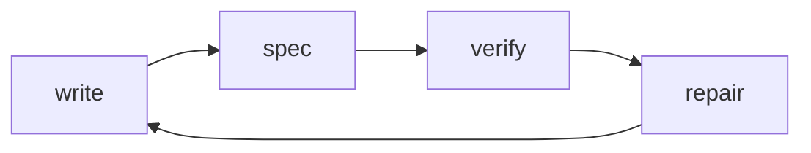
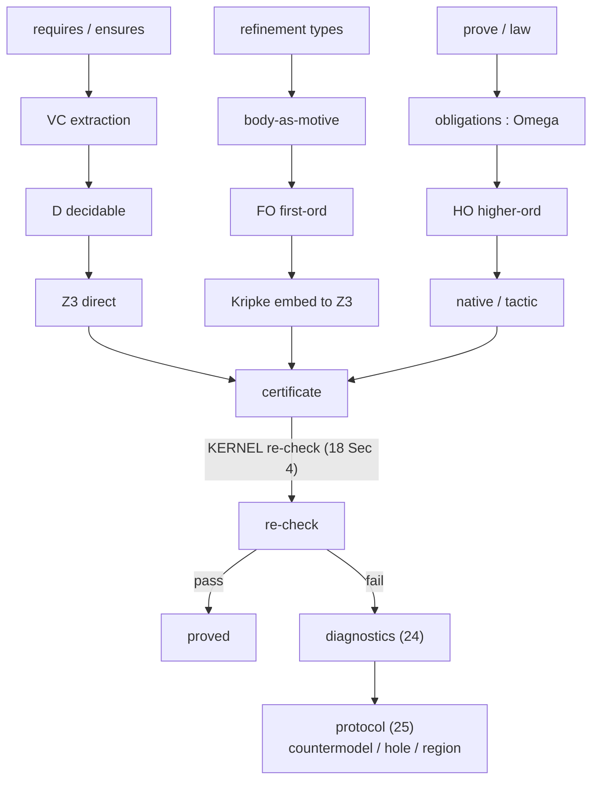

# The verification surface (the differentiator)

> Status: **DRAFT v0**. Normative for the interface and the soundness
> obligations; some prover internals are tagged for the Verify team to fix.
> Contract for WS-V (V1–V4, T1). Builds on `../10-kernel/` (Ω in `12 §5`,
> certificate checking in `18 §4`).

This is what makes Ken **Ken**: a programmer or agent states a correctness
property, and the toolchain returns a verdict it can act on — `proved`,
`disproved` with a countermodel, or `incomplete` with a typed hole — without
reading the kernel. Everything here is **untrusted** and re-checked by the
kernel (`../00-overview.md §3`); the verification layer's job is to *find*
proofs and to *explain* failures, never to be believed on its own authority.

## 1. The loop

A definition carries a **specification** (§`21`). The toolchain **generates
obligations** (§`22`), **classifies and discharges** them (§`23`), and on
failure emits a **structured diagnostic** (§`24`) over a **machine-readable
protocol** (§`25`) that an agent consumes to repair the code or the spec and try
again.

**Design assumption — the software proof profile.** Ken targets *software*
verification, not mathematics. The expected obligation profile is **many small,
propositionally-simple obligations**, with the real complexity living in the
**effect/flow codomain** (`../30-surface/36`, `../60-security/61`), not in deep
propositional/higher-order logic. So this layer optimises for **throughput and
automation over many small obligations** — fast routing, the
decidable/reflective fast path (`23 §3`), parallel discharge, stable diagnostics
— rather than for depth on a few hard theorems. (This also informs kernel
choices: e.g. `OQ-Prop` keeps proof comparison out of the hot concerns because
proofs are small and numerous, not large and few.)

## 2. Pipeline

## 3. Two non-negotiable principles

1. **Soundness rests on the kernel, not the solver.** Every discharged
   obligation yields a **certificate** the kernel re-checks (`18 §4`). A bug in
   the classifier, the embedding, or Z3 can only cause a *failure to prove* (or
   a rejected certificate), never a false `proved`. This is what lets Ken use a
   *classical* SMT solver under an *intuitionistic* logic (§4).
2. **Failure is structured, not opaque.** An obligation that does not discharge
   is never a bare "unprovable." It is a countermodel, a typed hole, or a
   three-region decomposition — machine-readable, with suggested next actions
   (§`24`, §`25`). This is the agentic differentiator.

## 4. Why the topos logic and the SMT solver fit (the key insight)

Ken's propositions live in Ω, a **Heyting** algebra (`16 §1`): intuitionistic,
where `φ ∨ ¬φ` and `¬¬φ ⇒ φ` are **not** free. A classical solver (Z3, cvc5)
will happily use those laws and "prove" things that are false in the topos — so
you **cannot** naively encode Ω into Z3 (F\*'s direct-classical approach is
unsound for a genuinely non-Boolean Ω).

Ken's resolution is its headline idea: **Ken's topos
semantics *are* Kripke semantics** — a context/world is a stage of knowledge,
the slice/accessibility relation is information growth. So instead of encoding
`φ` directly, the prover encodes **`φ`'s Kripke truth condition `φ#`** as a
*classical* first-order theory (a `World` sort, a monotone forcing relation).
Then:

> `φ` is intuitionistically valid **iff** `φ#` is classically valid,

and Z3 may solve `φ#` with full classical power *soundly*, because the
intuitionistic content is captured in the translation, not assumed away. The
embedding is Ken's **native meaning**, not an encoding trick — which is exactly
why it is sound. Details and the soundness obligation are in `23-prover.md
§Kripke`.

For the **decidable fragment** (`φ ∨ ¬φ` holds — equalities, arithmetic
comparisons, finite membership) classical and intuitionistic coincide, so the
prover uses **direct** Z3 with no embedding overhead. The **classifier** (§`23`)
routes each obligation to the cheapest sound method.

## 5. Chapter map

| File | Subject |
|---|---|
| `21-spec-syntax.md` | `requires`/`ensures`, refinement types `{x:A | φ}`, propositional goals — how a spec attaches to code |
| `22-obligations.md` | Verification-condition generation; body-as-motive; obligations as elements of Ω |
| `23-prover.md` | Fragment classifier (D/FO/HO); direct Z3; the Kripke embedding + its soundness obligation; certificate generation + kernel re-check; fallbacks |
| `24-diagnostics.md` | Kripke countermodels; typed holes + `unknown` propagation; the three-region Heyting decomposition; slice contextualization; suggested actions |
| `25-protocol.md` | The machine-readable diagnostic protocol — the agent-team contract (T1), a stable JSON schema |

## 6. What this layer must deliver (acceptance, ties to G2–G4)

- **G2:** a correct proof of a real function's postcondition is accepted; a
  wrong one is rejected (because the kernel re-checks the certificate).
- **G3:** the classifier routes obligations; decidable ones discharge directly,
  first-order-intuitionistic ones via the Kripke embedding with kernel-checked
  certificates; a documented test shows the classical solver cannot make a Ken
  proof unsound.
- **G4:** every failed obligation emits a schema-valid diagnostic with a
  countermodel or typed hole plus suggested actions; a partially-verified
  program still runs, propagating `unknown`.
