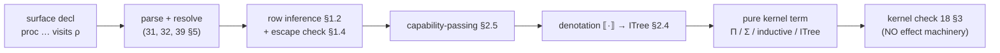

# Effects, capabilities, and state

> Status: **L5 elaborated** — implementation-ready for Team Language.
> **Normative for the model and the elaboration** (§1–§7); concrete surface
> *spelling* stays proposal-level (`OQ-syntax`). Effect tracking, capabilities,
> and the state/`space` escape hatch. Settled inputs (do **not** reopen):
> **`OQ-8` / `OQ-8a` DECIDED** (operator, 2026-06-27) — static,
> transitively-inferred effect **rows** (`visits`), pure by default; a **layered
> encoding** (authority/denotation/spec, §2) that keeps the kernel pure;
> capabilities as static value tokens (§3). **`OQ-9` DECIDED** — tail-resumptive
> handlers only (§5). **`OQ-Space` DECIDED** (§4) — bounded per-space Hoare,
> shared-nothing message-passing. **`OQ-C` DECIDED** (operator, 2026-07-03) — a
> **direct `[State s]` effect surface** (`get`/`put`/`runState`, §4.5) over the
> existing `State S`/`runState` machinery (C2); C1 state-threading is its floor,
> C3 mutable refs forbidden. The kernel gains **nothing**: every construct
> below denotes to ordinary Π/Σ/inductive terms (`../10-kernel/`) — no effect
> machinery enters the TCB. **L5's *implementation* was gated on `K1.5`, now
> merged (`f037451`)** — the `ITree` denotation's `Vis` constructor needs
> Π-bound (W-style) recursive-inductive admission + its eliminator; K1.5
> **lifted** the `check_no_pi_bound_recursive` gate and generates `elim_ITree`,
> so L5 is **unblocked** (the design adds no TCB primitive; §2.1, §7.0).

## 1. Effects as a static row

A definition is **pure** by default (a `const` or `fn`, §1.6); a `proc` that
performs an effect declares an **effect row**:

```
proc read_config (path : String) : Config  visits [FS] = …
proc now () : Instant                       visits [Clock] = …
proc greet (name : String) : Unit           visits [Console] = …
```

- An **effect** (`FS`, `Clock`, `Console`, `Net`, `Rand`, …) is a named
  capability a computation may use. The row `visits [E₁, …]` is part of the
  function's type.
- **Statically checked + transitively inferred:** calling an effectful function
  *requires* its effects to be in the caller's row; the checker **infers** a
  function's effects from its body (transitive closure of what it calls), and
  reports a mismatch where a declared row omits an effect actually used. So
  effects cannot be silently performed — a pure-typed function is pure (the
  verification layer relies on this: a `fn`/`const` with no row is a
  mathematical function and its `ensures` are about values, not world-state).
- **Purity is the default and the common case;** only boundary functions carry
  rows, which keeps the verification core (`../20-verification/`) reasoning over
  pure terms.

### 1.1 The row lattice and latent-effect arrows

Fix, per program, the finite set `𝓔` of effect labels — the declared effects
(`FS`, `Console`, …) plus one label per `space` (§4). A **row** `ρ ⊆ 𝓔` is a
finite set of labels, ordered by `⊆`, with join `∪`, meet `∩`, and bottom `∅`
(the **pure** row). Rows form a finite (bounded) lattice — the property that
makes inference a terminating fixpoint (§1.3).

Function types carry a **latent row**: the arrow is written

```
(x : A) →[ρ] B          -- ρ is released when the function is APPLIED
A → B   ≡   A →[∅] B     -- a pure arrow performs nothing on application
```

`ρ` is the effect a call to the function may perform — exactly what `visits ρ`
pins at a boundary. The latent row sits on the **arrow**, not merely on the
definition, because higher-order code demands it: `map`'s effects depend on its
function argument, and only a latent row on that argument's arrow lets `map`'s
own row be expressed —

```
map : (A →[ρ] B) → List A →[ρ] List B      -- map is row-polymorphic in ρ
```

This latent-effect arrow is the **cross-workstream interface** (§3.1) that Sec/B
read a function's effects and labels off of.

### 1.2 Transitive inference (the algorithm)

The checker infers each definition's row bottom-up over its body and the call
graph. `infer_row(Γ, e) : Row` computes the effects an expression performs
**when evaluated** (call-by-value, `../40-runtime/42-evaluation.md`):

```
infer_row(Γ, e) = match e:
  x | c            (variable / global constant)  → ∅
                     -- a value; naming or projecting it performs nothing
  perform_E op     (a primitive op of effect E)  → {E}
                     -- the ONE place a label is introduced
  λ (x:A). b       (abstraction)                 → ∅
                     -- building a closure performs nothing; infer_row(Γ,x:A ⊢ b)
                     -- becomes the latent row ρ on the arrow (x:A) →[ρ] B
  f a              (application)                  → infer_row(Γ,f)
                                                  ∪ infer_row(Γ,a)
                                                  ∪ latent(typeof(Γ,f))
                     -- evaluate operator, operand, THEN release the call's latent ρ
  let x = e1 in e2                                → infer_row(Γ,e1) ∪ infer_row(Γ,x:_ ⊢ e2)
  if c then t else u  /  match c { … }            → infer_row(Γ,c) ∪ ⋃ (branch rows)
  handle_E h c     (handler, §5)                  → (infer_row(Γ,c) \ {E}) ∪ rows(h)
                     -- handling E DISCHARGES it from the row
  g                (call to a top-level def)      → row(g)
                     -- g's inferred/declared latent row, via the call graph
```

- `latent(τ)` reads the latent row off an arrow type `A →[ρ] B` and is `∅` for a
  non-arrow type. Applying `f` *releases* `f`'s latent row; the operator and
  operand are evaluated first, so their own rows join in.
- `λ` has row `∅` and **defers** its body's row to the arrow as the latent `ρ` —
  this is what gives the latent-arrow its meaning and what makes higher-order
  functions row-polymorphic (the `ρ` instantiates per call site, below).

### 1.3 Recursion — least fixpoint over the call graph

Mutually recursive definitions cannot be inferred in one bottom-up pass. Build
the call graph; for each strongly-connected component assign a row variable
`ρ_d` per definition `d`, emit the constraint `ρ_d ⊇ infer_row(body_d)`
(monotone in the `ρ`s it mentions), and solve by **least fixpoint**:

```
solve(SCC):
  for d in SCC: ρ_d := ∅
  repeat:
    for d in SCC: ρ_d := ρ_d ∪ infer_row(body_d)   -- reading current ρ's for in-SCC calls
  until no ρ_d changed
```

- **Termination.** Each `ρ_d` ranges over the powerset of the finite `𝓔` (height
  `|𝓔|`); the update operator is monotone (`∪`-only); so the iteration reaches a
  fixpoint in at most `|𝓔|` rounds per SCC. This is the standard finite-lattice
  dataflow fixpoint — it does **not** rely on SCT (`../10-kernel/17 §4`); the
  row lattice is finite by construction.
- **Higher-order arguments.** A call to a *parameter* `f : A →[ρ_f] B`
  contributes the latent `ρ_f`, where at a concrete call site `ρ_f` is the
  latent row of the **actual** argument's arrow type — row polymorphism falls
  out of substituting the argument's type into the callee's signature; there is
  no surface row-variable binder.

### 1.4 Checking — declared rows and the escape error

A definition may carry a **declared** row `visits ρ_decl` — **mandatory** at a
boundary (`foreign`, `../30-surface/38-ffi-io.md`; a `space` op, §4), optional
elsewhere. Let `ρ_inf = infer_row(body)`. The check is:

```
ρ_inf ⊆ ρ_decl                 -- accept
ρ_inf ⊄ ρ_decl                 -- EFFECT-ESCAPE static error
```

- `⊆`, not `=`: a function may **declare more than it uses** (a stable interface
  that reserves headroom); declaring *less* than it uses is the error.
- On failure the checker names **each** escaping effect `E ∈ ρ_inf \ ρ_decl` and
  a **witness** — the `perform_E` or the call whose latent row first introduces
  `E` along the inferred path — so the diagnostic points at a source site, not
  just a set difference.
- **Pure by default = the headline case.** No `visits` ⇒ `ρ_decl = ∅` ⇒ any
  non-empty `ρ_inf` escapes ⇒ **performing an undeclared effect is a compile
  error** (acceptance criterion 1). This is the guarantee the verification core
  rests on: a row-`∅` `fn`/`const` is *provably* effect-free and treated as a
  mathematical function (`../20-verification/`).

The escape check is the **single soundness-relevant gate** of the row system, so
its conformance must *discriminate* (§7.5, COORDINATION §7): the same body
**accepts** under a correct `visits` and **rejects** when one effect is dropped
— a verdict flip, not a single happy path — exercised with **≥2 distinct
effects**.

## 1.5 Row variables — the surface for effect polymorphism (`OQ-8` child)

> Status: **normative extension of §1.2/§1.3** (Architect-grounded on the landed
> effect checker, D1). `OQ-8` DECIDED the model — interaction trees, latent
> arrows, capability-passing, Koka rows the cited precedent; the row variable is
> *implied by that denotation* and here made **surface-writable**. This is a
> pure spec addition (surface syntax + a bounded inference lift), **not** a new
> operator fork and **kernel-untouched**; recorded in the OQ register as an
> `OQ-8` child pin.

Row polymorphism is **already in the model** — §1.1's latent arrow makes `map`'s
row depend on its argument's row, and §1.3 solves higher-order calls by
*substituting the actual argument's latent row*. But that polymorphism is
**inferred-from-the-argument only**: §1.3 states plainly *"there is no surface
row-variable binder."* A higher-order function that is *declared* to be
effect-polymorphic — `traverse`, whose signature must **name** the effect its
callback may perform — has no way to write that variable. §1.5 adds it.

### 1.5.1 Syntax — a bare row variable and the open-row tail

A **row variable** is a lowercase identifier standing for an unknown row,
written in brackets exactly where a concrete row goes:

```
proc traverse (f : a →[e] b) (xs : List a) : List b  visits [e]
```

- **`[e]`** — a **fully polymorphic** row: the definition performs *exactly*
  whatever its higher-order argument performs, nothing more.
- **`[E | e]`** — an **open row**: a concrete head `E` the definition performs
  *itself*, joined with a polymorphic tail `e` it inherits from an argument
  (e.g. a `proc` that logs to `Console` **and** runs a caller-supplied callback
  is `visits [Console | e]`). This denotes to the row join `E ∪ e` (§1.1)
  and is the bullet the row lattice's `∪` already provides.

Both forms are accepted; a bare `[e]` is the `E = ∅` special case of `[E | e]`.
The `→[e]` latent-arrow spelling (§1.1) and the monadic `Eff [e] b` spelling
denote to the same latent row on the argument's arrow; surface *spelling* stays
`OQ-syntax`; the **construct** — a row variable in a declared row — normative.

### 1.5.2 Binding — an implicit parameter, one variable, two occurrences

A row variable **binds as an implicit parameter**, exactly like an implicit
type or level parameter (`39 §2.2`) — **not a new binder kind**. (Precedent:
`State s` already threads an implicit *type* parameter into an effect label,
§4.5.1; a row variable threads an implicit *row*.) It is **bound once**
and **referenced twice** — in the higher-order argument's latent row and in the
definition's own declared row — and the surface resolver maps **both occurrences
to the same variable**. So `traverse` above elaborates with a leading implicit
`{e}`; its escape obligation (§1.4) is the reflexive `e ⊆ e`, which holds by
construction.

**The surface variable is required, not optional (§3.1 guarantee 1).** A
function's effects must be recoverable from its **type**, never only from its
body (manifest-in-the-type). A purely-inferred, never-written row variable would
violate that for the polymorphic case, and the purity check (§1.6) must read the
polymorphic row **off the signature**. So a row-polymorphic definition **must**
write its variable in the declared row; an effect-polymorphic body with no
declared variable is a manifest-in-the-type violation, reported like an escape
(§1.4).

### 1.5.3 Static closure at every instantiation (AC3 — structural)

A row variable is eliminated in exactly one of two ways, and **neither discovers
an effect at runtime**:

- **Instantiation.** A call that supplies a *concrete* higher-order argument
  substitutes the variable with that argument's concrete latent row (§1.3's
  substitution, lifted to the named variable). The result row is concrete.
- **Deferral.** A caller that is *itself* row-polymorphic passes the variable
  through unchanged — nothing is performed *here*; the obligation rides onward
  on the caller's own declared variable.

At any **program boundary** — a handler (§5) or the runtime driver (§7.2) — the
row must be **concrete**: you cannot *run* a variable. Every `Vis` node is a
static `perform` or comes from a statically-typed higher-order closure. So every
concrete instantiation of a row-polymorphic definition has a **statically-closed
effect set** — AC3 is a **structural property of elaboration**, not a runtime
check.

### 1.5.4 Interaction with capabilities and handlers (no break)

- **No `Cap e` for the variable part — and that is correct (§2.5/§3).** A
  row-polymorphic `proc` performs its polymorphic effects **only through its
  higher-order argument** — a closure the *caller* built with its own
  capabilities in scope. `traverse` never `perform`s `e` itself; it splices the
  callback's sub-trees with `bind` (§2.4). So the capability-passing translation
  needs **no capability parameter for `e`**: the definition's own open row of
  *direct* performs is `∅` (consistent with §1.2's λ rule — building a closure
  performs nothing). Authority rides the function argument, exactly where the
  effect does.
- **Row-polymorphic handling (§5).** A handler `ITree (E ⊕ F) R → ITree F R'`
  discharges `E` and leaves `F`; if the residual `F` is a variable, the residual
  tree `ITree (Var e) R'` stays polymorphic — a handler may fold a *subset* of a
  polymorphic row and leave the rest polymorphic. Totality + single-consumption
  (§5.2) are properties of the **fold** (`elim_ITree`) and the handler clauses,
  **invariant** under whether the residual row is concrete or a variable (the
  variable is a type-level artifact; the tree the fold walks is unchanged). No
  break to the `OQ-9` totality story.

### 1.5.5 Recursion over a row variable — the fixpoint lift (build seam)

§1.3's least-fixpoint infers a **recursive** definition's row by iterating to a
fixed point over the call graph. Today it ranges over **concrete** rows. A
recursive *row-polymorphic* definition — and `traverse` is one the moment it is
written, since it folds a `List` recursively — needs that fixpoint **lifted
to range over row-variable rows**. The lift is mechanically stable: the
join over a variable is idempotent (`e ∪ e = e`), the update stays monotone, and
the iteration still terminates (a variable adds no new lattice height). This is
the row-polymorphism analog of CAT-1's bounded elaborator extension —
**outer-ring, kernel-untouched, no new `Term`/`Decl`** — flagged here so
the build does not meet it cold (the non-recursive symbolic path already exists;
only the recursive fixpoint needs the lift).

**Fail-closed completeness residual (a note for conformance, not a soundness
hole).** The subset test for an open row — is a concrete row `⊆ [E | e]`? —
is **conservative**: it may *under-accept* a concrete row straddling both the
concrete head and the polymorphic tail. That is a **completeness** gap (it
rejects a valid program), **never** an over-acceptance (no effect can silently
escape), so it is sound for the escape gate; the residual is a *rejected-valid*,
which conformance pins as a known-completeness marker (§7.5), never a verdict
flip on soundness.

## 1.6 Purity as a checked keyword — `const` / `fn` / `proc` (SURF-1)

> Status: **normative.** Operator ruling (Pat, 2026-07-04): the single
> definition keyword `view` is **retired** and split into three keywords that
> **agree, by a checked bidirectional rule, with a definition's static purity**.
> The keyword becomes a **reliable signal** — reading `fn` guarantees "an
> unconditionally pure function"; `proc` warns "at least potentially
> impure/imperative." Purity is **checked at the definition site**, not a
> convention. Grammar: `32 §1`, `33 §1`. Kernel-untouched (this is a
> surface keyword + an elaborator check over the §1.2–§1.5 row inference; no new
> kernel rule, `Term`, or `Decl`). Recorded in the OQ register as an `OQ-8`
> child pin. Spellings `const`/`fn`/`proc` are **fixed** (not `OQ-syntax`).

### 1.6.1 The classification — static purity, three keywords

Classify a definition by its **declared purity class** — a syntactic function of
its declared row `ρ_decl` (§1.4; `∅` when no `visits` is written), whether
it is a `space`/`becomes` operation (§4), and its count of **explicit value
parameters** `p`:

- **Impure** ⟺ `ρ_decl` is **non-empty**, **or** `ρ_decl` **contains a row
  variable** (§1.5), **or** the definition is a `space` operation. An impure
  definition is a **`proc`**, at **any** arity (including a nullary-effectful
  `proc now () : Instant visits [Clock]` and a row-polymorphic
  `proc traverse … visits [e]`).
- **Pure** ⟺ `ρ_decl = ∅` **and** not a `space` operation (whence the escape
  check, §1.4, forces the inferred row `ρ_inf = ∅` too — pure on *both* faces).
  A pure definition is:
  - a **`const`** if it has **zero explicit value parameters** — a pure value.
    By referential transparency a nullary pure "function" always yields the same
    value, so it *is* a constant (subsumes the pure top-level `let`/value, `33
    §1`).
  - an **`fn`** if it has **≥1 explicit value parameter** — a pure function the
    verification layer may treat as a mathematical function (§1, `../20-
    verification/`).

The split is **total**: every well-formed definition is exactly one of
`{const, fn, proc}`, because `{pure-nullary, pure-with-arguments, impure}`
partition every definition. And it is **decidable**: `ρ_decl` and the
`space`-op and arity facts are syntactic, and `ρ_inf` is the terminating
fixpoint of §1.3/§1.5.

**Effect-polymorphic ≠ pure (the crux that makes the split total).** A `proc`
whose row is a *variable* `[e]` is impure **even though** it type-checks + runs
**pure** when its callback is instantiated at the empty row: `traverse`
instantiated with a pure callback denotes to an effect-free tree, yet `traverse`
itself is a `proc`. It classifies the **abstraction's guarantee**, never
its best-case instantiation — `fn` promises purity *unconditionally*, which a
row-polymorphic definition cannot honour. This is why the polymorphic case lives
decisively on the `proc` side (§1.5, §2.2 crux).

### 1.6.2 The bidirectional check — the keyword cannot lie

The keyword is verified against **both** the signature and the body /
transitively-inferred effects; a disagreement in **either** direction is a
**hard error** (§1.6.3). Two directions, one already-landed gate underneath:

- **`fn`/`const` claims purity — the body must be pure.** Because `fn`/`const`
  carry **no `visits` clause** (`ρ_decl = ∅`), the existing escape check (§1.4)
  *is* this direction: any non-empty `ρ_inf` escapes `∅` and is rejected, naming
  the offending `perform`/call. So **"an `fn` that performs or transitively
  infers an effect is a compile error"** (AC1) is §1.4's pure-default gate — no
  new machinery; SURF-1 only *re-labels* it as the purity-signal guarantee.
- **`proc` claims impurity — the signature must earn it.** A `proc` whose
  declared row is empty and which is not a `space` op (so it is *provably pure*)
  is a **should-be-`fn`/`const`** mismatch. This is the genuinely new
  reverse-direction check: `proc` must carry a non-empty row, a row variable, or
  a `space` op. (A `proc` that declares `visits [FS]` yet whose body is now
  pure is **not** this — its declared row is non-empty, so `proc` is honest;
  declaring more than you use is the §1.4 headroom rule, a legitimate stable
  interface.)
- **Arity within the pure class.** A pure `fn` with **zero** explicit value
  parameters is a **should-be-`const`** mismatch; a `const` with **≥1** is a
  **should-be-`fn`** mismatch (`const` is the zero-parameter form).

The signal is reliable **only if it cannot lie** — so no direction is a silent
default; each mismatch is reported at the definition site.

**Instance-field witnesses — covariant subsumption, not exact match (DS-8b).**
The directions above govern a *definition's own* keyword; a class **instance**
supplying a witness for a field (`33 §5.2`) is checked by **subsumption**. A
**pure (`∅`-row) witness satisfies a `proc` field**: a `proc`'s contract is "may
be effectful," it may instantiate to `∅` (the §1.4 headroom — declaring more
than you use is legitimate), and a pure witness *is* that instantiation — a
more-precise inhabitant, `∅ ⊆ ρ_field`. Only the set of admissible witnesses
widens: the field's own classification is unchanged, and the Type/`Ω`
discriminant is untouched (`33 §5.2` AC4). The covariance is **one-way** — an
**effectful witness for a pure `fn`/`const` field still rejects** (a pure field
demands a pure witness), unchanged from the definition-site gate above.

### 1.6.3 Pinned sub-decisions (SURF-1 §5)

- **(a) Mismatch severity — HARD ERROR (pinned).** Every mismatch above — the
  `proc`-should-be-`fn`/`const` reverse direction and both arity mismatches — is
  a **compile error**, not a lint. Rationale, grounded in the reliable-signal
  requirement: a lint leaves the signal *advisory*, so a reader could not trust
  `fn`/`const`/`proc` to mean what it says without re-deriving the effect set —
  which defeats the entire point of moving purity from convention to a checked
  declaration. A reliable bidirectional signal requires the keyword and the
  static purity **cannot disagree in the accepted program**. (The `fn`-false-
  purity direction was already hard — the §1.4 escape error — so hard-error in
  both directions is the *consistent* choice, not a new severity.)
- **(b) "Zero parameter" counts explicit value parameters only (pinned).**
  `const` requires zero **explicit value** parameters; **implicit `{…}` binders
  do not count** — whether type (`{A : Type}`), level, instance (`{d : C A}`,
  `33 §5.4`), or row (`{e}`, §1.5). Grounded on `39 §2.2`: an implicit
  argument is **inserted and solved by the elaborator at each use site** (never
  written by the caller) and erased, so a definition whose only parameters are
  implicit is **used exactly as a constant** — `nil {A} : List A` is written
  `nil` at every occurrence, a polymorphic *constant family*, not a function one
  applies to a value. Forcing it to `fn` would misread "you apply this to an
  argument" onto something no caller ever applies. So `const nil {A : Type} :
  List A` is a `const`; `fn` begins at the first **explicit** value parameter.

### 1.6.4 `view` retired — role carry-over and kernel invariance

`view` and the top-level `let` value are **removed**; every role maps onto
the three keywords by the §1.6.1 rule:

| former `view`/`let` | becomes |
|---|---|
| pure value, 0 explicit value params (incl. top-level `let`) | `const` |
| pure function, ≥1 explicit value param | `fn` |
| concrete effect at any arity (incl. nullary, `space` op) | `proc` |
| effect-polymorphic (declares a row variable, §1.5) | `proc` |
| operator (symbolic name, `33 §6`) | `fn`/`proc` (or `const` if nullary-pure) |

The local `let … in …` **expression** (`32 §3`) is unchanged — only the
*definition* keyword splits.

**Kernel-untouched (AC5).** The classification is a surface keyword plus an
elaborator check layered over the existing row inference (§1.2–§1.5); it emits
the *same* core terms the kernel already checks (a pure definition still denotes
to a plain term via the §2.4 collapse; an effectful one to an `ITree`). No new
kernel rule, judgment, `Term`, or `Decl`; `trusted_base()` is byte-unchanged. A
misclassification is caught as a **surface error** — a rejected valid program or
a compile error — **never** an unsound acceptance (`39 §1`), the same
untrusted-elaborator posture as the rest of `36`.

## 2. The encoding — three layers, one pure kernel (`OQ-8` DECIDED)

An effect row is **not** a kernel primitive. The surface `Eff [E] A` monad
(`../50-stdlib/`) elaborates into a **pure** dependent term through three
layers, each answering a different question — and the *same denotation* powers
verification, capabilities, information flow, and Ward's behavioral export:

1. **Authority — "who may perform this effect?"** A **capability-passing**
   translation: performing an effect requires a **capability token** (a value)
   in scope; at the `../10-kernel/` level this is ordinary Π over capability
   tokens (§2.5, §3). Static and visible; no runtime gate.
2. **Denotation — "what does this computation *do*?"** The effectful computation
   denotes to an **interaction tree** (a free-monad-style *pure data structure*:
   `Ret a` | `perform e then continue with the response`). `Eff`'s bind is tree
   grafting. The kernel sees only this inductive datatype — it stays pure. One
   choice serves four masters: **handlers are folds** over the tree (§5);
   **Ward's event alphabet is the tree's `perform` nodes** (`../70-behavioral/
   §3`); **information-flow labels are labels on those nodes** (§3,
   `../60-security/61`); and **verification is predicates over the tree**.
3. **Specification — "what must it guarantee?"** `requires`/`ensures` on an
   effectful function are **WP/Hoare-style predicates over the denotation**. For
   *stateful* effects the pre/post relation is the genuinely hard part and is
   resolved by **`OQ-Space` DECIDED** (§4).

So effects are a **surface + elaborator + runtime** discipline; the kernel
reasons about a pure denotation and the runtime
(`../40-runtime/42-evaluation.md`) executes the real effects via the boundary.
The trusted base gains nothing — the same small-TCB invariant that governs the
rest of the kernel (ADR 0001/0004/0005). *(Precedents, one per layer: Koka rows
· Interaction Trees · F\* Dijkstra monads — read to understand, not copied.)*

### 2.1 The interaction tree (the pure kernel datatype)

An **effect signature** is a container: which operations exist and what response
each returns. It is an ordinary `record` (negative Σ with η, `../10-kernel/14
§4`, `13 §3`):

```
record Effect : Type (suc (max ℓ_op ℓ_resp)) where    -- level-poly in ℓ_op, ℓ_resp
  Op   : Type ℓ_op                  -- the operations of the effect
  Resp : Op → Type ℓ_resp           -- the response the runtime returns for each op
```

```
Console  :  Op = { Write String }              Resp (Write _) = Unit
State S  :  Op = { Get } ∪ { Put s | s : S }   Resp Get = S ;  Resp (Put _) = Unit
```

(`Op` is a small inductive of op-tags; `Write`/`Put` carry their argument as
constructor data.) The **interaction tree** over a signature `E` with result
`R`:

```
data ITree (E : Effect) (R : Type ℓ_R) : Type (max ℓ_R ℓ_op ℓ_resp) where
  Ret : R → ITree E R
  Vis : (e : E.Op) → (E.Resp e → ITree E R) → ITree E R
```

- `Ret r` — finished with value `r`.
- `Vis e k` — perform operation `e`, then **continue** with `k`, which maps the
  runtime's response `E.Resp e` to the rest of the tree. The continuation is a
  *function into the tree*, so the response is not yet known: this is the pure
  data for "perform `e`, then proceed."
- **It is a genuine strictly-positive inductive — sound, and adding no kernel
  primitive (no new TCB).** `Vis`'s recursive argument `E.Resp e → ITree E R` is
  strictly positive: the recursive occurrence is the *codomain* of a function
  type, the `W`-style branching shape (`14 §2`; the positivity algorithm `14
  §8.2` accepts it — `D` under a `+`-codomain).
- **Admitted as of K1.5 (`f037451`).** The `Vis` argument is a **Π-bound
  (W-style) recursive occurrence**; `K1.5` (`f037451`, merged) lifted the
  `check_no_pi_bound_recursive` gate and generates `elim_ITree` with a
  **Π-abstracted induction hypothesis** (`14 §3`, AC5 in
  `kernel/tests/k1p5_wstyle.rs`). `ITree`, `bind` (§2.2), the handlers (§5),
  the denotation (§2.4), and the §3.1 contract realization are now all
  **admitted and buildable**. This was a sequencing dependency, not a soundness
  gap: the positivity is genuine and `ITree` adds no trusted primitive.
- Ken is total, so the tree is a **finite inductive** value, not a coinductive
  one; genuinely nonterminating interaction is Ward's domain (§5,
  `../70-behavioral/`).

**Level reconciliation (`12 §2`, `14 §1`) — the level is *forced*, not chosen:**

- `Ret`'s argument `R : Type ℓ_R` ⇒ `ℓ_R ≤ ℓ_ITree`.
- `Vis`'s second argument is a Π from `E.Resp e : Type ℓ_resp` into `ITree E R :
  Type ℓ_ITree`; by Π-Form (`13 §1`) it lives at `Type (max ℓ_resp ℓ_ITree)`,
  which (a constructor argument must sit at the family level or below, `14 §1`)
  forces `ℓ_resp ≤ ℓ_ITree`. `E.Op : Type ℓ_op` forces `ℓ_op ≤ ℓ_ITree`.
- The least such level is `ℓ_ITree = max ℓ_R ℓ_op ℓ_resp` — the formation level
  above. **Predicative** (no universe is dropped, `12 §2`), **non-cumulative**
  (no implicit lift, `12 §3`): the elaborator emits the explicit level and the
  kernel re-checks it (`12 §4`). **Common case:** first-order effects with `Op`,
  `Resp` at level 0 and `R : Type 0` give `ITree E R : Type 0` — a small type in
  the same universe as the values it sequences.

### 2.2 ret, bind, perform

The `Eff` monad's operations are kernel terms over `ITree`:

```
ret : R → ITree E R
ret = Ret

perform : (e : E.Op) → ITree E (E.Resp e)            -- the one-operation tree
perform e = Vis e (λ r. Ret r)

bind : ITree E A → (A → ITree E B) → ITree E B        -- graft k onto every Ret leaf
bind (Ret a)   k = k a
bind (Vis e f) k = Vis e (λ r. bind (f r) k)
```

`bind` **grafts** `k` onto every leaf; it is defined by `elim_ITree` on its
first argument (the recursion is on the structural sub-tree `f r`), so it is
**total** (`14 §3`: ι-reduction terminates by structural decrease) and needs
**no SCT**. Explicitly, with motive `M _ = (A → ITree E B) → ITree E B`:

```
bind t k = elim_ITree M
             (λ a.       λ k. k a)                       -- Ret method
             (λ e f ih.  λ k. Vis e (λ r. ih r k))       -- Vis method;  ih r ≡ bind (f r)
             t k
```

The monad laws (left/right unit, associativity) hold **propositionally** by
`elim_ITree` (and definitionally where ι fires); they are *stated as
obligations*, not assumed (`14 §5`; the proof rides V1).

### 2.3 A row is one signature (`⊕`)

A row `ρ = {E₁,…,Eₙ}` is interpreted by **one** combined signature `ρ = E₁ ⊕ …
⊕ Eₙ`, the disjoint union of containers:

```
(E ⊕ F) : Effect
  Op = E.Op + F.Op                                  -- binary coproduct (14)
  Resp (inl o) = E.Resp o ;  Resp (inr o) = F.Resp o
```

`⊕` is associative, commutative, and unital up to `Eq` with the **empty effect**
`𝟘` (`Op = Empty`, `14 §3`) as unit — the row's *set* structure (§1.1) denotes
to this signature algebra. Performing `Eᵢ` inside a ρ-computation is `perform`
after injecting `Eᵢ.Op ↪ ρ.Op`. So a function of row `ρ` denotes into a
**single** pure tree `ITree ρ R` carrying every effect it may perform.

### 2.4 The denotation `·` (surface → pure tree)

An effectful surface expression `e` of type `B` and row `ρ` elaborates to a
kernel term `e : ITree ρ B`:

```
 v                  = Ret v                       -- a pure value / sub-expression
 perform_E op       = Vis (inj_E op) (λ r. Ret r)   -- = perform (inj_E op)
 let x = e1 in e2   = bind e1 (λ x. e2)          -- monadic sequencing
 g a1 … an          = bind a1 (λ x1. … bind an (λ xn.
                          incl_{ρ_g ↪ ρ} (g↓ caps x1 … xn)))   -- splice the callee's tree
 if c then t else u  = bind c (λ b. elim_Bool _ t u b)
```

- `incl_{ρ_g ↪ ρ} : ITree ρ_g X → ITree ρ X` re-tags a callee's tree along
  the signature inclusion `ρ_g ↪ ρ` (well-defined because the escape check
  guarantees `ρ_g ⊆ ρ`, §1.4). It is itself an `elim_ITree` map over the `Vis`
  tags — pure. `g↓ caps …` is the callee's elaborated kernel term, taking its
  capability parameters (§2.5).
- A **pure** `fn`/`const` (`ρ = ∅`) denotes to `ITree 𝟘 B`. No `Vis` node is
  constructible (`𝟘.Op = Empty` is uninhabited), so `ITree 𝟘 B ≅ B` and the
  elaborator **collapses** it to the plain term `B`: pure code pays nothing
  for the encoding and the kernel sees an ordinary term. This is the formal
  content of "purity is the default and free."

### 2.5 Capability-passing (the authority layer)

The denotation says *what* a computation does; the capability layer says *who
may make it do that*. Performing an effect requires a **capability token** in
scope:

```
Cap : Effect → Type ℓ_op           -- the authority to perform E's operations
```

`Cap E` is an authority value — minted by a handler (§5) and threaded by
ordinary Π/λ; its internals (attenuation, revocation) live in
`../60-security/62`. The elaboration is a **capability-passing translation**: a
function of row `ρ` takes one capability per **un-handled** effect of `ρ` as an
extra leading parameter —

```
proc f (x:A) : B visits ρ
  ⤳  f↓ : (caps : Π_{E ∈ ρ_open} Cap E) → A → ITree ρ B
```

where `ρ_open` are the effects **not** provided by an enclosing handler (§5). A
`perform_E op` is well-formed only if `Cap E` is in scope; otherwise it is a
**missing-capability** error (§7.3). At the kernel level this is **ordinary Π/λ
over the `Cap E` values** — no new construct, exactly the small-TCB invariant
(`12`, ADR 0001/0004). The surface `using c : Cap E` (§3) names a capability
parameter explicitly; the row machinery threads the rest.

This is where the layers meet: the **row** is the static type-level manifest
(§1), the **capability** is the value-level authority (§2.5/§3), the **tree** is
the pure denotation the kernel checks (§2.1–2.4) — three layers, one pure
kernel.

## 3. Capabilities (`requires`-as-capability)

Distinct from logical preconditions (`../20-verification/21 §1`), a
**capability** is an authority token a computation must be *given* to act (open
a file, hit the network). Ken keeps the two readings of `requires` distinct:

- **Logical `requires φ`** — a proposition, discharged by proof
  (`../20-verification/21 §1`).
- **Capability `using c : Cap`** — a value-level authority, passed explicitly or
  via the effect row, enabling the corresponding effect. Capabilities make the
  *principle of least authority* expressible: a function gets exactly the
  capabilities it needs, visible in its type.

**`OQ-8a` DECIDED (operator, 2026-06-27): capabilities are first-class value
tokens, not a separate effect kind and not a runtime gate.** A capability is a
*value* (`c : Cap E`, §2.5) threaded explicitly or supplied by an enclosing
handler (a handler is a capability provider, §5); authority is **static and
visible** in the type, **attenuable** and **revocable** with use audited
(`../60-security/62`). It is kept distinct from the logical `requires φ` (a
proposition); a capability is an authority, a precondition is a proof
obligation, and Ken never conflates them.

### 3.1 The effect-row / capability interface (cross-workstream contract)

Sec1/Sec1ct/Sec2 (`../60-security/`) and B1 (`../70-behavioral/`) build **on top
of** this interface, so its shape is a **fixed contract**, not an implementation
detail. The contract surface:

| Surface form | Kernel denotation | Read by |
|---|---|---|
| latent row `A →[ρ] B` | the `Vis`-tags reachable in `ITree ρ B` | escape check §1; B1 alphabet |
| effect label `E` | a summand `E.Op ↪ ρ.Op` (§2.3) | IFC label site §3; Ward node |
| capability `Cap E` | a value parameter (Π, §2.5) | Sec2 authority; attenuation `62` |
| IFC label `@ℓ` on a channel | a label index on the `Vis` op/resp | Sec1 flow check `61` |
| `@ct` taint | a label whose sink is a distinguished `Vis` op | Sec1ct `61 §5a` |

The three load-bearing guarantees the consumers may rely on:

1. **Manifest-in-the-type.** A function's effects, labels, and capabilities are
   recoverable from its *type* — the latent row plus capability parameters —
   never only from its body.
2. **Every authority-relevant act is a `Vis` node.** Ward's event alphabet and
   the IFC/`@ct` sinks are *exactly* the tree's `perform` sites — nothing
   effectful hides between nodes.
3. **Discharge is visible.** A handler (§5) is the **only** way to remove an
   effect/label/authority from a row, and it shows in the row (`ρ \ {E}`, §1.2).

Consumers may **index** a `Vis` node (labels, clearance, ct-taint) but must
**not** add a kernel primitive — labels ride the existing container. *(This
interface is raised to the Architect as the L5 cross-workstream contract before
the Sec/B WPs build on it.)*

### 3.2 Security extension (tier-1, `../60-security/`)

The effect/capability discipline is the host for two security mechanisms (ADR
0004):

- **Information-flow labels.** Effect channels (`Net`, `FS`, a log, a `space`
  cell) carry a **clearance label**, and data carries a security label; writing
  data `@ ℓ` to a sink of clearance `κ` type-checks only when `ℓ ⊑ κ`. The same
  indexed-effect machinery that indexes capabilities here indexes **labels** —
  this is how Ken gets **intrinsic information-flow control** without a new
  kernel primitive (`../60-security/61-information-flow.md`).
- **Attenuation + revocation.** Capabilities are **attenuable** (derive a
  strictly weaker token for a child) and **revocable** at a boundary, with use
  audited — the principle-of-least-authority story
  (`../60-security/62-authority.md`).
- **Constant-time (`@ct`) — leakage-relevant operations as an effect sink.** A
  distinct, **opt-in** timing-sensitive label `@ct` (separate from `Secret`
  confidentiality) marks data whose *influence* must not reach a **leakage-
  relevant operation** — a secret-dependent **branch guard**, **memory index**,
  or **variable-time primitive**. Those operations are a distinguished **effect
  sink**, and the rule is the IFC rule reused: a `@ct` value reaching such a
  sink is a **type error** (you cannot leak by accident; no per-operation
  annotation). This **unary taint discipline soundly enforces the source-level
  constant-time (2-safety) property** — no relational/product-program machinery.
  The sensitive *range* is the `@ct` label's live span (intro → `declassify`),
  so there is **no `constant_time { … }` region**; a function carries a
  **signature-level CT promise** (constant-time in a parameter) for boundary
  checking and export. The *timing guarantee itself* is
  codegen/hardware-relative and **delegated to `Ward`** under a stated leakage
  model (`../60-security/61 §5a`, `64 §4.2`, `63 §5a`); a **policy** may require
  `@ct` for a data class (`../60-security/65`).

So a function's effect-and-capability type is simultaneously its **capability
manifest** and its **flow manifest**. Details, the label lattice,
declassification, and the constant-time discipline are in `../60-security/`.

## 4. State — the `space` model

Pure code cannot mutate. Genuine mutable state and process isolation live in a
**`space`** — a unit of encapsulated mutable state and isolation defined by its
*semantics* (cells, ordered effectful operations), not by any particular
OS-level implementation:

```
space Counter {
  mut n : Int = 0
  proc inc () : Unit  visits [Counter] = n becomes n + 1
  proc get () : Int   visits [Counter] = n
}
```

- A `space` encapsulates **cells** (`mut`) with identity; operations on it carry
  the space as an effect. Mutation is `becomes` (cell update). Reads/writes are
  ordered by the effect discipline. Semantically, `becomes` denotes to a
  **state-passing fold** of the interaction tree (§4.2), imperative surface,
  functional denotation.
- A `space` is the **only** place identity-bearing mutable state exists; pure
  values are immutable and content-addressed (`../40-runtime/41-values.md`).

State has **two surfaces over one denotation**: the imperative `space` block
(§4.1–§4.4) and the direct monadic `[State s]` effect — `get`/`put`/`runState`
(§4.5). Both desugar to the same `State S` signature (§2.1) and are discharged
by the same `runState` fold (§4.2); the second is what a stateful computation
writes when there is no `space` to hang cells on (`OQ-C`·C2, §4.5).

### 4.1 A space desugars to a `State` effect

A `space` with cells `(c₁ : T₁) … (c_m : T_m)` desugars to:

- a **state type** `S = T₁ × … × T_m` (right-nested Σ / record, `13 §3`, with η
  so cell update reconstructs definitionally);
- a **state effect** `State S` (§2.1): `Op = Get | Put S`, `Resp Get = S`, `Resp
  (Put _) = Unit`;
- **one effect label** for the space; every operation `visits [<space>]` uses
  `State S`.

Cell access elaborates (cell `cᵢ` is component `i` of `S`):

```
cᵢ            (read cell i)    ⤳  bind (perform Get) (λ s. Ret (s.i))
cᵢ becomes e  (write cell i)   ⤳  bind (perform Get) (λ s. perform (Put (s with .i := e)))
```

`s with .i := v` is the record/Σ update reusing every other component (`13 §3`
η). So `becomes` is **not** a kernel mutation — it is a `Get`-then-`Put` on the
pure tree.

### 4.2 The state-passing fold (`runState`)

A space's effect is discharged by **running the tree against an initial state**
— the canonical tail-resumptive handler (§5), a fold that threads `s` as its
accumulator:

```
runState : S → ITree (State S ⊕ F) R → ITree F (R × S)
runState s (Ret r)                = Ret (r, s)
runState s (Vis (inl Get)      k) = runState s  (k s)            -- answer with current state
runState s (Vis (inl (Put s')) k) = runState s' (k tt)          -- adopt new state
runState s (Vis (inr o)        k) = Vis o (λ r. runState s (k r))  -- other effects pass through
```

- It is `elim_ITree` with the **state carried in the motive** `M _ = S → ITree F
  (R × S)` — a structural fold, **total** (`14 §3`). The continuation `k` is
  invoked **exactly once, in tail position** in every clause, so it is
  tail-resumptive (§5) and no continuation is reified.
- `runState s₀ body : ITree F (R × S)` returns the result paired with the
  **final** state; when `F = 𝟘` it collapses (§2.4) to the pure value `(R × S)`.
  So a space operation's denotation is a **state transformer** `S → R × S`. The
  kernel checks this pure term; **no mutable cell exists in the TCB**.

### 4.3 Bounded Hoare and `old`

`requires`/`ensures` on a space operation are **predicates over its
state-transformer denotation** `S → R × S` (`../20-verification/21 §1`, §2 layer
3):

- `requires φ` constrains the **pre-state** `s_pre : S` (and parameters);
- `ensures ψ` relates `s_pre`, the `result`, and the **post-state** `s_post`;
- **`old(e)`** denotes `e` evaluated in `s_pre` (`21 §4`) — well-defined because
  the denotation *names* the pre-state. A bare cell `cᵢ` in `ensures` is the
  post-state value; `old(cᵢ)` is the pre-state value.

Because each space's `S` is **encapsulated and non-aliased** (shared-nothing,
§4.4), the obligation is **local, bounded, per-space Hoare** over `S` — **no
separation logic, no frame rule, no global `\old`** (`21 §4`, `OQ-Space`).
Worked example: `inc`'s `ensures n == old(n) + 1` denotes to the transformer `λ
s. (tt, s with .n := s.n + 1)` and the obligation `(s with .n := s.n + 1).n ==
s.n + 1`, which computes (record-β / η, `13 §3`) to `s.n + 1 == s.n + 1` —
discharged by `refl` (`16 §2`).

### 4.4 Concurrency & isolation — shared-nothing (`OQ-Space` DECIDED)

For *in-Ken* communication, spaces are **shared-nothing**: they share no mutable
memory and communicate only by **passing immutable, content-addressed values**
(actor-style). Isolation is therefore a **guarantee**, not a discipline — no
shared mutable state ⇒ no data races — on which capability revocation and
confinement rest (`../60-security/62 §4`, ADR 0004). This pairs with the rest of
the model: a space handle is a **capability** (§3), send/receive are **effects**
(§2), messages carry **IFC labels** (§3), and message events are **Ward's
behavioral alphabet** (`../70-behavioral/`). The **runtime realization** —
process, thread, green-thread, or distributed — is deferred to `../40-runtime/`
(the *model* is shared-nothing; the *mapping* is an implementation choice,
distribution-ready). *(FFI is the exception: a `foreign` boundary may use shared
memory, but it is already an explicitly unsafe/untrusted boundary, `38-ffi-io.md
§3`, so it does not weaken the in-Ken isolation property.)*

### 4.5 The direct `[State s]` effect surface (`get`/`put`/`runState`)

Sections §4.1–§4.2 give the **imperative** door to state — a `space` block whose
`mut`/`becomes` desugar to `State S` and discharge by `runState`. This section
adds the **monadic** door: writing `get`/`put`/`runState` **directly** as a
first-class effect — the shape a stateful computation like `accumulator-factory`
(VAL2 #10) needs when there is no `space` to hang cells on. It introduces **no
new denotation**: both surfaces desugar to the *same* `State S` signature (§2.1)
and are discharged by the *same* `runState` fold (§4.2); §4.5 only **exposes**
that machinery as named operations. **`OQ-C` DECIDED (operator, 2026-07-03):**
this is **C2** — an effect over the existing `ITree`/handler machinery; **C1**
(explicit state-threading) is the floor it desugars to (§4.5.6); **C3** (real
mutable refs/cells/regions) is **forbidden** — no memory is mutated.

#### 4.5.1 The state type parameterizes the row

The row lattice (§1.1) is a finite set of atomic effect **labels**. `State s` is
a **type-indexed** label: `State Int` and `State Bool` are *distinct* labels. A
program instantiates `State` at **finitely many** concrete state types, so the
label set `𝓔` stays finite and §1.3's terminating least-fixpoint inference is
preserved unchanged — the type index rides the label; it does not make the
lattice infinite.

This mirrors §4.1 exactly: a `space` already contributes **one label per
space**, bound to that space's state type `S`. The direct surface simply lets a
program **name** `State s` in a `visits` row without introducing a `space`. A
single `[State s]` is the common case; two *independent* states in one
computation are two *distinct* labels (as two spaces are), peeled by nested
`runState` calls (§4.5.4).

#### 4.5.2 `get` and `put`

The two operations of `State s` (§2.1: `Op = Get | Put s`, `Resp Get = s`,
`Resp (Put _) = Unit`), surfaced as first-class effectful producers — each a
`perform` (§2.2) on the row signature:

```
get : Unit →[{State s}] s     get ()  ⤳  perform (inj Get)      = Vis (inj Get)      (λ r. Ret r)
put : s   →[{State s}] Unit    put s'  ⤳  perform (inj (Put s'))  = Vis (inj (Put s')) (λ _. Ret tt)
```

- `s` is an ordinary (implicit) type parameter of each operation, fixed at a use
  site by the enclosing `runState`'s initial state `s₀ : s` (§4.5.3) or by
  annotation.
- `Resp Get = s` is a **non-`Unit`, `s`-typed** response — `State s` is the
  first effect whose response *depends on* a type parameter (Console's is always
  `Unit`). This dependence is already §2.1/§7.4 normative; §4.5.6 notes it is
  the forcing function for the landed code.
- `inj : (State s).Op ↪ ρ.Op` is the row-signature injection (§2.3); in a
  single-`State s` row `{State s} = State s` and `inj` is the identity.
- Surface *spelling* (`[State s]`, `get`, `put`) is proposal-level
  (`OQ-syntax`); the **operations and their denotations are normative** — they
  are §2.1's `Get`/`Put` under §2.2's `perform`. An effectful producer
  `Unit →[ρ] a` denotes to `ITree ρ a` (§1.1, §2.4), the form §4.2/§4.5.3
  use.

#### 4.5.3 `runState` is §4.2's fold at `F = 𝟘` — not re-specified

`runState` is **exactly** the state-passing `elim_ITree` fold of §4.2; §4.5 does
**not** restate its equations. The direct surface exposes it as the
program-callable handler that discharges `State s`:

```
runState : s → ITree (State s ⊕ F) a → ITree F (a × s)      -- §4.2, verbatim
runState s₀ m  :  a × s        when F = ∅   -- pure collapse: ITree 𝟘 (a × s) ≅ a × s (§2.4)
```

- The result pair `a × s` is `(result, final-state)` — the **Σ-pair** `R × S`
  that §4.2 returns (`(r, s)`, a right-nested Σ / record with η, `13 §3`),
  realized at runtime by the interpreter's `EvalVal::Pair` (`ken-interp`). The
  frame's illustrative `Pair a s` is this Σ-pair. (A named inductive
  `data Prod a b = MkProd a b` is also landed in the prelude, but the denotation
  uses the Σ-pair, not that inductive.)
- **`runState` is an ordinary *total Ken definition*** — the §4.2 fold,
  structural on the sub-tree via `elim_ITree`, kernel-re-checked — **not** a
  trusted Rust primitive. This is what makes `[State s]`
  **zero-`trusted_base` delta** (AC1): the handler is *derived*, never
  *postulated*. The runtime merely *evaluates* it (call-by-need over the pure
  tree, `../40-runtime/42`); it is **not** an I/O driver like Console's `run_io`
  (§7.2), because pure state threading performs no I/O.
- Worked `accumulator-factory` (VAL2 #10) — a post-increment `next` that returns
  the current value and bumps the state:
  `next () = bind (get ()) (λ n. bind (put (n + 1)) (λ _. Ret n))`.

  ```
  runState 0  next  =  (0, 1)     -- result = old value 0 ; final state 1 ; pair = (result, state)
  runState 41 next  =  (41, 42)
  ```

  The result is a **function of `s₀` and the pure tree alone** — re-running the
  same tree under a fresh `s₀` re-threads from scratch (§4.5.5); result `0` ≠
  state `1` pins the pair *order* `(result, state)` (§4.2).

#### 4.5.4 Composition with other effects

`[State s]` composes with any other row `F` by the row signature `⊕` (§2.3): a
program that is both `[State s]` and `[Console]` denotes to
`ITree (State s ⊕ Console) a`. `runState s₀` discharges the `State s` summand by
its **`inl`** clauses (§4.2) and **passes every other op through** by the
**`Vis (inr o)`** clause (§4.2's fourth line), leaving `ITree Console (a × s)`;
a Console handler — the runtime `run_io` driver (§7.2, `../40-runtime/42`) —
then discharges the rest.

- **Handler nesting = discharge order.** `runState s₀ (handleConsole m)` and
  `handleConsole (runState s₀ m)` differ only in *which effect is peeled first*;
  both type-check, and the threaded state is **identical** because `runState`
  passes Console ops through untouched and `handleConsole` never reads `State`
  ops. `State s` and `Console` **commute** (neither handler inspects the other's
  `Vis` tags) — a discriminating conformance check (§7.5.6).
- **Independent multiple states.** Two independent states in one computation are
  two *distinct* labels `State s`, `State t` (§4.5.1); nest `runState` calls,
  the inner binding the inner state — nested total folds, no new mechanism.

#### 4.5.5 Purity and totality (frame AC3)

The purity/totality argument is §4.2's, applied to the direct surface:

- **Total.** `runState` is a structural `elim_ITree` fold with the state carried
  in the motive `M _ = S → ITree F (R × S)` (§4.2), and each clause invokes the
  continuation **once, in tail position** (tail-resumptive, §5.2) — so it stays
  inside the total eliminator and reifies no continuation. `get`/`put` build
  finite pure `Vis` nodes (§2.1).
- **No mutable cell exists.** The state is `runState`'s **parameter**, threaded
  functionally; the effect **erases** to its `ITree` description (§2.4). Nowhere
  on the value path is a cell, ref, or region introduced — the C2/C3 boundary
  the WP must preserve (frame AC3; grep: no `RefCell`/`Cell`/`unsafe`/interior
  mutability on the value path).
- **The discriminating face** (state-threaded-in-parameter vs mutated-in-place):
  a `[State s]` program's result is determined **entirely by `runState`'s `s₀`
  and the pure tree**. Running the *same tree* under two initial states yields
  two independent results with **no shared mutable state** between the runs, so
  `runState s₀ m` is **re-runnable and idempotent in `m`**. In-place mutation
  would let one run's writes leak into the next; the pure fold cannot (§7.5.6
  pins this as the C3-forbidden guard).

#### 4.5.6 Relation to C1 (the floor) and the outer-ring code lift

- **C1-desugaring (the locked floor).** `[State s]` is **sugar over explicit
  state-threading** (C1): `runState`'s fold *is* the mechanical "thread `s` as
  an extra argument and result" that C1 writes by hand, and `get`/`put` are its
  packaged read/write. So every `[State s]` program **desugars to** a C1
  program — the operator's "C1 is the floor" lock (`OQ-C`). No mutation is
  introduced (C3 forbidden): the entire surface is
  `perform`/`bind`/`elim_ITree` over the pure tree.
- **Build note — the outer-ring lift `[State s]` forces (no kernel change).**
  The landed *runnable* `ITree` (`prelude.rs`) is **Console-hardwired** —
  `data ITree r = Ret r | Vis ConsoleOp (Unit → ITree r)`, a fixed `Unit`
  response and no effect parameter. `[State s]` is the **forcing function** to
  lift three simplifications already flagged in-code as downstream work, up to
  the §2/§4 model: **(a)** the **dependent response** `E.Resp e` (`State s`
  needs `Resp Get = s`, non-`Unit`); **(b)** the container coproduct **`⊕`** for
  `State s ⊕ F` (composition, §4.5.4); **(c)** **named-effect dispatch** so
  `runState` peels `State` and passes other ops through. All three are
  §36-normative and admitted by K1.5's generic `elim_ITree`
  (`kernel/tests/k1p5_wstyle.rs`) — **the kernel is untouched** (AC1). The work
  is entirely outer-ring: `ken-elaborator/src/effects/*` + `ken-interp` + a
  **derived** stdlib `runState`; no new `Term`/`Decl` variant, no
  `trusted_base()` delta.

#### 4.5.7 Injection into a coproduct — the surface morphism (`incl`, named)

§4.5.4 discharges a composed tree by **peeling** one summand (`runState`) and
passing the rest through; it presumes a tree *already* over `State s ⊕ F`. The
dual — **getting a single-effect computation's ops *into* the coproduct** — is
§2.3's `inj` / §2.4's `incl` (`ITree ρ_g X → ITree ρ X`, an `elim_ITree`
map over the `Vis` tags), which the **direct surface exposes as named
injection operations** for the binary signature `Coproduct g h`, exactly as §4.5.2
exposes `get`/`put` and §4.5.3 exposes `runState`:

```
injectL : ITree g rg a -> ITree (Coproduct g h) (resp_coproduct g h rg rh) a   -- re-tag via InL
injectR : ITree h rh a -> ITree (Coproduct g h) (resp_coproduct g h rg rh) a   -- re-tag via InR
```

- **Denotation (normative):** the `elim_ITree` fold sending `Ret x ↦ Ret x` and
  `Vis op k ↦ Vis (InL op) (injectL ∘ k)` (resp. `InR`), structural on the
  sub-tree — total (`14 §3`), no SCT, adds no kernel primitive. It is `§2.4`'s
  `incl` specialized to the two inclusions `g ↪ Coproduct g h`, `h ↪ Coproduct g h`.
- **Well-typed iff** the response family reduces per-tag: `resp_coproduct g h rg rh
  (InL o) ≡ rg o`, `(InR o) ≡ rh o` (§2.3 `Resp (inl o) = E.Resp o`) — so the
  re-tagged continuation keeps its response type.
- **Surface *spelling* (`injectL`/`injectR`) is proposal-level (`OQ-syntax`);
  the operation and its denotation are normative.** A program composes two base
  effects by injecting each single-effect sub-computation, then sequencing with
  `bind` (`ITree (Coproduct g h) …` is homogeneous). This is the **direct/monadic
  door**; the eventual sugar is the row-directed elaboration inserting `incl`
  automatically from a `visits [E, F]` row (§2.4), of which this is the floor —
  as C1 threading (§4.5.6) is the floor under `[State s]`. Realization + the
  D1/D3 couplings: `docs/program/wp/effect-composition.md` (D2).

## 5. Handlers — tail-resumptive only (`OQ-8`/`OQ-9` DECIDED)

A **handler** interprets an effect — operationally, a **fold over the
interaction tree** (§2 layer 2). Handlers are how user-defined effects are given
meaning and how capabilities are provided (a handler is a capability provider,
§3).

### 5.1 A handler is a fold (`elim_ITree`)

A handler for effect `E` interprets each `E`-operation, turning a tree over `E ⊕
F` into a tree over `F` — **discharging `E`** from the row. It is exactly
`elim_ITree` with two methods:

```
handle : (ret : R → ITree F R')                                       -- Ret leaf ↦ result
         (ops : (e : E.Op) → (E.Resp e → ITree F R') → ITree F R')    -- Vis node ↦ interpretation
       → ITree (E ⊕ F) R → ITree F R'
handle ret ops (Ret r)         = ret r
handle ret ops (Vis (inl e) k) = ops e (λ r. handle ret ops (k r))    -- interpret E-op, recurse on resume
handle ret ops (Vis (inr o) k) = Vis o (λ r. handle ret ops (k r))    -- F-op passes through
```

- The recursion is structural on the sub-tree `k r` ⇒ `elim_ITree`, **total**
  (`14 §3`), no SCT.
- The handler **provides the capability**: the body that produced the `E`-node
  was elaborated with `Cap E` in scope, supplied by this handler (§2.5). Running
  the handler discharges `E` (§1.2, `handle_E`) — which is why the *only* way to
  shrink a row is to handle it. `runState` (§4.2) is the canonical instance (`R'
  = R × S`, `ops` threading Get/Put).

### 5.2 Tail-resumptive = the continuation is used once, in tail position

`OQ-9` restricts `ops` so that, in each clause, the resume function `λ r. handle
… (k r)` is invoked **at most once and in tail position**: a handler may
*resume* (pass a response and continue) or *stop* (return an `ITree F R'`
without resuming), but it cannot resume twice or capture the resumption as a
first-class value.

This is what keeps `handle` a **plain structural catamorphism** (`elim_ITree`):
with single tail resumption the fold never reifies or duplicates the
continuation, so it stays inside the total eliminator and **preserves totality**
(`../10-kernel/17 §4`, the SCT/termination story) — single-shot is a *proof
simplification*, not a hedge.

**Reified, multi-shot continuations** (`shift`/`reset`, `with multishot`) are
**excluded — a positive design choice, not a hedge** (`OQ-9` DECIDED): the
expressiveness they are reached for is **already subsumed** — generators via
`visits [Yield]` (`37 §3`), nondeterminism/backtracking as **search-as-data**
folded by total recursion, async/concurrency via the **seam** (`OQ-Space`,
§4.4), and delimited control captured *denotationally* by the interaction tree
itself (§2). What multishot uniquely adds — first-class dynamic `call/cc` — is
unpredictable, **complicates** proofs (it breaks the single-consumption WP
reasoning over the tree), and is costly to compile, cutting against every Ken
commitment; it returns only as a research footnote if a concrete unsubsumable
need appears. Genuinely reactive/nonterminating interaction is Ward's domain
(`../70-behavioral/`, `OQ-coinduction`).

## 6. What WS-L must deliver here (L5)

The deliverable is the elaboration above, made implementation-ready. Each item
is now a concrete, codeable section; an implementer builds from these and the
kernel re-checks the emitted core (the elaborator is **not** in the TCB, §7):

1. **Static effect row + inference** — the row lattice and latent-effect arrows
   (§1.1), transitive `infer_row` (§1.2), the call-graph least-fixpoint for
   recursion (§1.3), and the declared-row escape check (§1.4). *Acceptance 1.*
2. **Pure-kernel encoding** — the `ITree` datatype with its forced level (§2.1),
   `ret`/`bind`/`perform` (§2.2), the row signature `⊕` (§2.3), and the
   denotation `·` collapsing pure code (§2.4). The kernel checks the pure tree
   with no effect machinery. **Admitted as of K1.5 (`f037451`).**
   *Acceptance 2.*
3. **Capabilities** — `Cap E` and the capability-passing translation (§2.5), the
   `requires`-as-capability distinction (§3), and the pinned cross-workstream
   interface contract (§3.1). *Acceptance 3.*
4. **`space` state** — desugaring to a `State S` effect with `becomes` (§4.1),
   the `runState` state-passing fold (§4.2), bounded Hoare with `old` (§4.3),
   and shared-nothing message-passing (§4.4); the **direct `[State s]` surface**
   — `get`/`put`/`runState` as first-class operations over the same machinery
   (§4.5, `OQ-C`·C2). *Acceptance 4.*
5. **Tail-resumptive handlers** — handler-as-fold (§5.1) and the single-shot
   restriction with its totality argument (§5.2). *Acceptance 4.*
6. **The `pure`/`impure` boundary hook** for L7 to wire FFI into (§7.2).
   *Acceptance 5.*

Conformance: `../../conformance/surface/effects/` (§7.5).

## 7. Elaboration pipeline, boundary, and checks

### 7.0 Dependency — RESOLVED at K1.5 (`f037451`)

The denotation (§2) rests on the `ITree` inductive, whose `Vis` constructor is a
**Π-bound (W-style) recursive occurrence** (§2.1). **K1.5 merged at `f037451`**
and lifted the `check_no_pi_bound_recursive` gate; `elim_ITree` with a
Π-abstracted induction hypothesis is now generated (`14 §3`, AC5 in
`kernel/tests/k1p5_wstyle.rs`). All of §2 is now buildable:

- **Unblocked:** the `ITree` type, `bind`, `perform`, §5 (handlers/`runState`),
  the denotation `·`, and the §3.1 contract any Sec/B WP rides — all admitted
  and implemented in `ken-elaborator/src/effects/itree.rs` and `row_poly.rs`.
- **Always buildable (K1-only row machinery):** the finite-row lattice and latent
  arrows (§1.1), `infer_row` and the call-graph least-fixpoint (§1.2–1.3), the
  §1.4 escape check, and the `⊕` row algebra (§2.3) remain ordinary static
  analyses; they need no kernel feature (unchanged from L5-build).

This was a **sequencing dependency, not a soundness gap** — the encoding was
always sound; it simply required a kernel feature (`K1.5`) that is now in.

### 7.1 Pipeline (surface → pure kernel term)



The kernel step sees only Π/Σ/inductive/`ITree` — **no effect-specific rule**
(the "one pure kernel" invariant, acceptance criterion 2). Everything
effect-shaped is discharged before the kernel: rows by inference, authority by Π
over `Cap`, do-notation by `bind`, mutation by `runState`.

### 7.2 The pure/impure boundary (the L7 FFI hook)

- `pure` ≡ the **empty row**; `impure` ≡ a **non-empty row** (`38 §2`). A
  `foreign` declaration carries a mandatory effect row (`38`); its operations
  are the **`Vis` nodes at the world frontier**.
- **The hook L7 plugs into:** the runtime supplies a **real-world handler** for
  each I/O effect (`FS`, `Net`, `Clock`, …) — the same `handle` shape (§5.1),
  but its `ops` perform actual side effects in the evaluator
  (`../40-runtime/42-evaluation.md`) instead of returning a pure `ITree`. **L5
  fixes the interface** — the effect signatures (`Op`/`Resp`) and that every
  foreign op is a `perform` (a `Vis` node) — and exposes it; **L7 provides the
  interpreters**. So L5 ↔ L7 couple at exactly the `Effect`-signature +
  `Vis`-node contract, nothing else.
- **Two readings of `pure` on a `foreign`, kept distinct by `pure ≡ empty
  row`:** a **fully-opaque `pure` foreign** (declares *no* row) is the **trusted
  postulate** — an *unchecked claim* confined to that boundary (`38 §3`), listed
  in the trusted base and **allowed**. A `foreign` that declares a **non-empty**
  row yet is tagged `pure` is **self-contradictory** (`pure` *is* the empty row)
  and is **rejected** — the boundary case of the §1.4 escape error, pinned by
  §7.5 case 5 (`impure`-masquerading-as-`pure`). The `foreign`-specific
  trusted-postulate rule itself is `38`/L7's; L5 settles only this
  escape-at-the-boundary.

### 7.3 Error classes (caught at elaboration, before the kernel)

1. **Effect escape** — `ρ_inf ⊄ ρ_decl`; names each escaping `E` and a witness
   perform/call (§1.4). *(Undeclared effect = compile error — acceptance 1.)*
2. **Missing capability** — a `perform_E` with no `Cap E` in scope and no
   enclosing handler for `E` (§2.5). *(Acceptance 3 denial path.)*
3. **Non-tail-resumptive handler** — `ops` resumes more than once, or not in
   tail position, or captures the resumption (§5.2). *(`OQ-9`.)*
4. **Mutation outside a space** — `becomes` on a non-cell, or a `mut` outside a
   `space` (§4).
5. **Ill-typed op / response** — a `perform e` whose response use disagrees with
   `E.Resp e`, or a `space` op whose `ensures` is not `: Ω` (`21 §4`).

All are surface diagnostics; the emitted core is then re-checked by the kernel —
the elaborator is **not** trusted (same posture as V0, `39 §5`). A
mis-elaboration that stays well-typed but mis-resolves is the residual risk the
conformance corpus (§7.5) targets with discriminating cases.

### 7.4 Level reconciliation (the soundness check)

| Construct | Level | Rule |
|---|---|---|
| `Effect {ℓ_op, ℓ_resp}` | `Type (suc (max ℓ_op ℓ_resp))` | record / Σ-Form (`13 §2`) |
| `E ⊕ F` | same shape (`max` of parts) | coproduct of `Op`s (`14`) |
| `ITree E (R : Type ℓ_R)` | `Type (max ℓ_R ℓ_op ℓ_resp)` | inductive, predicative `max` (`12 §2`, `14 §1`; §2.1) |
| `Cap E` | `Type ℓ_op` | a value type |
| `State S` over `S : Type ℓ_S` | `ITree (State S) R : Type (max ℓ_R ℓ_S)` | `Op`,`Resp : Type ℓ_S` (§4.1) |
| pure `fn`/`const` (`ρ = ∅`) | `ITree 𝟘 R ≅ R : Type ℓ_R` | `𝟘.Op = Empty` collapses (§2.4) |

Every level is the **predicative `max`** of its parts: nothing drops a universe
(`12 §2`), nothing lifts implicitly (`12 §3`); the elaborator emits explicit
levels and the kernel re-checks them (`12 §4`). No effect construct is
impredicative or `Type : Type` — the row machinery adds **no new level rule**,
only instances of Π/Σ/inductive formation. *(This table is the level-discipline
reconcile pass the spec-author owes before the Architect handoff.)*

### 7.5 Conformance

`../../conformance/surface/effects/` — covering the five acceptance criteria
with **discriminating** cases (COORDINATION §7; every negative case must *flip*
on the bug it targets, not pass vacuously):

1. **Effect infer + escape** — a function calling two effectful helpers infers a
   2-effect row; `visits` with both **accepts**, `visits` dropping one
   **rejects**, naming the dropped effect (verdict flip; ≥2 distinct effects).
2. **Pure-kernel encoding** — an effectful program denotes to an `ITree` term
   the kernel checks; assert the **structure of the tree** (the `Vis`-tag
   sequence / the `Ret` leaf), not merely "elaborates."
3. **Capability gate** — the same `perform` **rejects** with no `Cap E` in scope
   and **accepts** under a handler that provides it (denial-path flip).
4. **`space` + handler** — `runState s₀` on an `inc`/`get` program resumes
   correctly; assert the **final state** value and that `inc`'s `old(n)`
   obligation discharges.
5. **`pure`/`impure` boundary** — a `foreign` with a non-empty row exposes its
   `Vis` op to a runtime handler; a `pure`-but-effectful `foreign` is rejected
   (`38 §3`).
6. **Direct `[State s]` surface** — drive the **real** producer, not a hand-fed
   harness (`conformance-hand-feeds-the-deliverable`): a `get`/`put` program run
   under `runState s₀` through the **actual interpreter** returns the correct
   `(result, final-state)` Σ-pair (`R × S`, §4.2) — the post-increment `next`
   (`runState 0 next = (0,1)`, `runState 41 next = (41,42)`, §4.5.3). Assert the
   **paired value**, plus (a) **composition** — a `[State s, Console]` program
   threads state identically whether `runState` or the Console handler is peeled
   first (commutation, §4.5.4); (b) **re-runnability** — the same tree under two
   `s₀` gives two independent results with no cross-run state (the C3-forbidden
   face, §4.5.5). `runState` is a derived total definition, so kernel-untouched
   (AC1) holds structurally.
