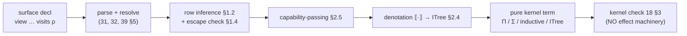

# Effects, capabilities, and state

> Status: **L5 elaborated** — implementation-ready for Team Language.
> **Normative for the model and the elaboration** (§1–§7); concrete surface
> *spelling* stays proposal-level (`OQ-syntax`). Effect tracking, capabilities,
> and the state/`space` escape hatch. Settled inputs (do **not** reopen):
> **`OQ-8` / `OQ-8a` DECIDED** (operator, 2026-06-27) — static,
> transitively-inferred effect **rows** (`visits`), pure by default; a **layered
> encoding** (authority/denotation/spec, §2) that keeps the kernel pure;
> capabilities as static value tokens (§3). **`OQ-9` DECIDED** — tail-resumptive
> handlers only (§5). **`OQ-Space` DECIDED** (§4) — bounded per-space Hoare,
> shared-nothing message-passing. The kernel gains **nothing**: every construct
> below denotes to ordinary Π/Σ/inductive terms (`../10-kernel/`) — no effect
> machinery enters the TCB.

## 1. Effects as a static row

A `view` is **pure** by default. A function that performs an effect declares an
**effect row**:

```
view read_config (path : String) : Config  visits [FS] = …
view now () : Instant                       visits [Clock] = …
view greet (name : String) : Unit           visits [Console] = …
```

- An **effect** (`FS`, `Clock`, `Console`, `Net`, `Rand`, …) is a named
  capability a computation may use. The row `visits [E₁, …]` is part of the
  function's type.
- **Statically checked + transitively inferred:** calling an effectful function
  *requires* its effects to be in the caller's row; the checker **infers** a
  function's effects from its body (transitive closure of what it calls), and
  reports a mismatch where a declared row omits an effect actually used. So
  effects cannot be silently performed — a pure-typed function is pure (the
  verification layer relies on this: a `view` with no row is a mathematical
  function and its `ensures` are about values, not world-state).
- **Purity is the default and the common case;** only boundary functions carry
  rows, which keeps the verification core (`../20-verification/`) reasoning over
  pure terms.

### 1.1 The row lattice and latent-effect arrows

Fix, per program, the finite set `𝓔` of effect labels — the declared effects
(`FS`, `Console`, …) plus one label per `space` (§4). A **row** `ρ ⊆ 𝓔` is a
finite set of labels, ordered by `⊆`, with join `∪`, meet `∩`, and bottom `∅`
(the **pure** row). Rows form a finite (bounded) lattice — the property that
makes inference a terminating fixpoint (§1.3).

Function types carry a **latent row**: the arrow is written

```
(x : A) →[ρ] B          -- ρ is released when the function is APPLIED
A → B   ≡   A →[∅] B     -- a pure arrow performs nothing on application
```

`ρ` is the effect a call to the function may perform — exactly what `visits ρ`
pins at a boundary. The latent row sits on the **arrow**, not merely on the
definition, because higher-order code demands it: `map`'s effects depend on its
function argument, and only a latent row on that argument's arrow lets `map`'s
own row be expressed —

```
map : (A →[ρ] B) → List A →[ρ] List B      -- map is row-polymorphic in ρ
```

This latent-effect arrow is the **cross-workstream interface** (§3.1) that Sec/B
read a function's effects and labels off of.

### 1.2 Transitive inference (the algorithm)

The checker infers each definition's row bottom-up over its body and the call
graph. `infer_row(Γ, e) : Row` computes the effects an expression performs
**when evaluated** (call-by-value, `../40-runtime/42-evaluation.md`):

```
infer_row(Γ, e) = match e:
  x | c            (variable / global constant)  → ∅
                     -- a value; naming or projecting it performs nothing
  perform_E op     (a primitive op of effect E)  → {E}
                     -- the ONE place a label is introduced
  λ (x:A). b       (abstraction)                 → ∅
                     -- building a closure performs nothing; infer_row(Γ,x:A ⊢ b)
                     -- becomes the latent row ρ on the arrow (x:A) →[ρ] B
  f a              (application)                  → infer_row(Γ,f)
                                                  ∪ infer_row(Γ,a)
                                                  ∪ latent(typeof(Γ,f))
                     -- evaluate operator, operand, THEN release the call's latent ρ
  let x = e1 in e2                                → infer_row(Γ,e1) ∪ infer_row(Γ,x:_ ⊢ e2)
  if c then t else u  /  match c { … }            → infer_row(Γ,c) ∪ ⋃ (branch rows)
  handle_E h c     (handler, §5)                  → (infer_row(Γ,c) \ {E}) ∪ rows(h)
                     -- handling E DISCHARGES it from the row
  g                (call to a top-level def)      → row(g)
                     -- g's inferred/declared latent row, via the call graph
```

- `latent(τ)` reads the latent row off an arrow type `A →[ρ] B` and is `∅` for a
  non-arrow type. Applying `f` *releases* `f`'s latent row; the operator and
  operand are evaluated first, so their own rows join in.
- `λ` has row `∅` and **defers** its body's row to the arrow as the latent `ρ` —
  this is what gives the latent-arrow its meaning and what makes higher-order
  functions row-polymorphic (the `ρ` instantiates per call site, below).

### 1.3 Recursion — least fixpoint over the call graph

Mutually recursive definitions cannot be inferred in one bottom-up pass. Build
the call graph; for each strongly-connected component assign a row variable
`ρ_d` per definition `d`, emit the constraint `ρ_d ⊇ infer_row(body_d)`
(monotone in the `ρ`s it mentions), and solve by **least fixpoint**:

```
solve(SCC):
  for d in SCC: ρ_d := ∅
  repeat:
    for d in SCC: ρ_d := ρ_d ∪ infer_row(body_d)   -- reading current ρ's for in-SCC calls
  until no ρ_d changed
```

- **Termination.** Each `ρ_d` ranges over the powerset of the finite `𝓔` (height
  `|𝓔|`); the update operator is monotone (`∪`-only); so the iteration reaches a
  fixpoint in at most `|𝓔|` rounds per SCC. This is the standard finite-lattice
  dataflow fixpoint — it does **not** rely on SCT (`../10-kernel/17 §4`); the
  row lattice is finite by construction.
- **Higher-order arguments.** A call to a *parameter* `f : A →[ρ_f] B`
  contributes the latent `ρ_f`, where at a concrete call site `ρ_f` is the
  latent row of the **actual** argument's arrow type — row polymorphism falls
  out of substituting the argument's type into the callee's signature; there is
  no surface row-variable binder.

### 1.4 Checking — declared rows and the escape error

A definition may carry a **declared** row `visits ρ_decl` — **mandatory** at a
boundary (`foreign`, `../30-surface/38-ffi-io.md`; a `space` op, §4), optional
elsewhere. Let `ρ_inf = infer_row(body)`. The check is:

```
ρ_inf ⊆ ρ_decl                 -- accept
ρ_inf ⊄ ρ_decl                 -- EFFECT-ESCAPE static error
```

- `⊆`, not `=`: a function may **declare more than it uses** (a stable interface
  that reserves headroom); declaring *less* than it uses is the error.
- On failure the checker names **each** escaping effect `E ∈ ρ_inf \ ρ_decl` and
  a **witness** — the `perform_E` or the call whose latent row first introduces
  `E` along the inferred path — so the diagnostic points at a source site, not
  just a set difference.
- **Pure by default = the headline case.** No `visits` ⇒ `ρ_decl = ∅` ⇒ any
  non-empty `ρ_inf` escapes ⇒ **performing an undeclared effect is a compile
  error** (acceptance criterion 1). This is the guarantee the verification core
  rests on: a row-`∅` `view` is *provably* effect-free and may be treated as a
  mathematical function (`../20-verification/`).

The escape check is the **single soundness-relevant gate** of the row system, so
its conformance must *discriminate* (§7.5, COORDINATION §7): the same body
**accepts** under a correct `visits` and **rejects** when one effect is dropped
— a verdict flip, not a single happy path — exercised with **≥2 distinct
effects**.

## 2. The encoding — three layers, one pure kernel (`OQ-8` DECIDED)

An effect row is **not** a kernel primitive. The surface `Eff [E] A` monad
(`../50-stdlib/`) elaborates into a **pure** dependent term through three
layers, each answering a different question — and the *same denotation* powers
verification, capabilities, information flow, and Ward's behavioral export:

1. **Authority — "who may perform this effect?"** A **capability-passing**
   translation: performing an effect requires a **capability token** (a value)
   in scope; at the `../10-kernel/` level this is ordinary Π over capability
   tokens (§2.5, §3). Static and visible; no runtime gate.
2. **Denotation — "what does this computation *do*?"** The effectful computation
   denotes to an **interaction tree** (a free-monad-style *pure data structure*:
   `Ret a` | `perform e then continue with the response`). `Eff`'s bind is tree
   grafting. The kernel sees only this inductive datatype — it stays pure. One
   choice serves four masters: **handlers are folds** over the tree (§5);
   **Ward's event alphabet is the tree's `perform` nodes** (`../70-behavioral/
   §3`); **information-flow labels are labels on those nodes** (§3,
   `../60-security/61`); and **verification is predicates over the tree**.
3. **Specification — "what must it guarantee?"** `requires`/`ensures` on an
   effectful function are **WP/Hoare-style predicates over the denotation**. For
   *stateful* effects the pre/post relation is the genuinely hard part and is
   resolved by **`OQ-Space` DECIDED** (§4).

So effects are a **surface + elaborator + runtime** discipline; the kernel
reasons about a pure denotation and the runtime
(`../40-runtime/42-evaluation.md`) executes the real effects via the boundary.
The trusted base gains nothing — the same small-TCB invariant that governs the
rest of the kernel (ADR 0001/0004/0005). *(Precedents, one per layer: Koka rows
· Interaction Trees · F\* Dijkstra monads — read to understand, not copied.)*

### 2.1 The interaction tree (the pure kernel datatype)

An **effect signature** is a container: which operations exist and what response
each returns. It is an ordinary `record` (negative Σ with η, `../10-kernel/14
§4`, `13 §3`):

```
record Effect : Type (suc (max ℓ_op ℓ_resp)) where    -- level-poly in ℓ_op, ℓ_resp
  Op   : Type ℓ_op                  -- the operations of the effect
  Resp : Op → Type ℓ_resp           -- the response the runtime returns for each op
```

```
Console  :  Op = { Write String }              Resp (Write _) = Unit
State S  :  Op = { Get } ∪ { Put s | s : S }   Resp Get = S ;  Resp (Put _) = Unit
```

(`Op` is a small inductive of op-tags; `Write`/`Put` carry their argument as
constructor data.) The **interaction tree** over a signature `E` with result
`R`:

```
data ITree (E : Effect) (R : Type ℓ_R) : Type (max ℓ_R ℓ_op ℓ_resp) where
  Ret : R → ITree E R
  Vis : (e : E.Op) → (E.Resp e → ITree E R) → ITree E R
```

- `Ret r` — finished with value `r`.
- `Vis e k` — perform operation `e`, then **continue** with `k`, which maps the
  runtime's response `E.Resp e` to the rest of the tree. The continuation is a
  *function into the tree*, so the response is not yet known: this is the pure
  data for "perform `e`, then proceed."
- **It is an ordinary inductive (`14`), hence already in the pure kernel** — no
  new TCB. `Vis`'s recursive argument `E.Resp e → ITree E R` is **strictly
  positive** (`14 §2`: the recursive occurrence is the *codomain* of a function
  type — the allowed `W`-style branching argument), so the declaration is
  admitted and the eliminator `elim_ITree` (§5) is generated. Ken is total, so
  the tree is a **finite inductive** value, not a coinductive one; genuinely
  nonterminating interaction is Ward's domain (§5, `../70-behavioral/`).

**Level reconciliation (`12 §2`, `14 §1`) — the level is *forced*, not chosen:**

- `Ret`'s argument `R : Type ℓ_R` ⇒ `ℓ_R ≤ ℓ_ITree`.
- `Vis`'s second argument is a Π from `E.Resp e : Type ℓ_resp` into `ITree E R :
  Type ℓ_ITree`; by Π-Form (`13 §1`) it lives at `Type (max ℓ_resp ℓ_ITree)`,
  which (a constructor argument must sit at the family level or below, `14 §1`)
  forces `ℓ_resp ≤ ℓ_ITree`. `E.Op : Type ℓ_op` forces `ℓ_op ≤ ℓ_ITree`.
- The least such level is `ℓ_ITree = max ℓ_R ℓ_op ℓ_resp` — the formation level
  above. **Predicative** (no universe is dropped, `12 §2`), **non-cumulative**
  (no implicit lift, `12 §3`): the elaborator emits the explicit level and the
  kernel re-checks it (`12 §4`). **Common case:** first-order effects with `Op`,
  `Resp` at level 0 and `R : Type 0` give `ITree E R : Type 0` — a small type in
  the same universe as the values it sequences.

### 2.2 ret, bind, perform

The `Eff` monad's operations are kernel terms over `ITree`:

```
ret : R → ITree E R
ret = Ret

perform : (e : E.Op) → ITree E (E.Resp e)            -- the one-operation tree
perform e = Vis e (λ r. Ret r)

bind : ITree E A → (A → ITree E B) → ITree E B        -- graft k onto every Ret leaf
bind (Ret a)   k = k a
bind (Vis e f) k = Vis e (λ r. bind (f r) k)
```

`bind` **grafts** `k` onto every leaf; it is defined by `elim_ITree` on its
first argument (the recursion is on the structural sub-tree `f r`), so it is
**total** (`14 §3`: ι-reduction terminates by structural decrease) and needs
**no SCT**. Explicitly, with motive `M _ = (A → ITree E B) → ITree E B`:

```
bind t k = elim_ITree M
             (λ a.       λ k. k a)                       -- Ret method
             (λ e f ih.  λ k. Vis e (λ r. ih r k))       -- Vis method;  ih r ≡ bind (f r)
             t k
```

The monad laws (left/right unit, associativity) hold **propositionally** by
`elim_ITree` (and definitionally where ι fires); they are *stated as
obligations*, not assumed (`14 §5`; the proof rides V1).

### 2.3 A row is one signature (`⊕`)

A row `ρ = {E₁,…,Eₙ}` is interpreted by **one** combined signature `ρ = E₁ ⊕ …
⊕ Eₙ`, the disjoint union of containers:

```
(E ⊕ F) : Effect
  Op = E.Op + F.Op                                  -- binary coproduct (14)
  Resp (inl o) = E.Resp o ;  Resp (inr o) = F.Resp o
```

`⊕` is associative, commutative, and unital up to `Eq` with the **empty effect**
`𝟘` (`Op = Empty`, `14 §3`) as unit — the row's *set* structure (§1.1) denotes
to this signature algebra. Performing `Eᵢ` inside a ρ-computation is `perform`
after injecting `Eᵢ.Op ↪ ρ.Op`. So a function of row `ρ` denotes into a
**single** pure tree `ITree ρ R` carrying every effect it may perform.

### 2.4 The denotation `·` (surface → pure tree)

An effectful surface expression `e` of type `B` and row `ρ` elaborates to a
kernel term `e : ITree ρ B`:

```
 v                  = Ret v                       -- a pure value / sub-expression
 perform_E op       = Vis (inj_E op) (λ r. Ret r)   -- = perform (inj_E op)
 let x = e1 in e2   = bind e1 (λ x. e2)          -- monadic sequencing
 g a1 … an          = bind a1 (λ x1. … bind an (λ xn.
                          incl_{ρ_g ↪ ρ} (g↓ caps x1 … xn)))   -- splice the callee's tree
 if c then t else u  = bind c (λ b. elim_Bool _ t u b)
```

- `incl_{ρ_g ↪ ρ} : ITree ρ_g X → ITree ρ X` re-tags a callee's tree along
  the signature inclusion `ρ_g ↪ ρ` (well-defined because the escape check
  guarantees `ρ_g ⊆ ρ`, §1.4). It is itself an `elim_ITree` map over the `Vis`
  tags — pure. `g↓ caps …` is the callee's elaborated kernel term, taking its
  capability parameters (§2.5).
- A **pure** `view` (`ρ = ∅`) denotes to `ITree 𝟘 B`. No `Vis` node is
  constructible (`𝟘.Op = Empty` is uninhabited), so `ITree 𝟘 B ≅ B` and the
  elaborator **collapses** it to the plain term `B`: pure code pays nothing
  for the encoding and the kernel sees an ordinary term. This is the formal
  content of "purity is the default and free."

### 2.5 Capability-passing (the authority layer)

The denotation says *what* a computation does; the capability layer says *who
may make it do that*. Performing an effect requires a **capability token** in
scope:

```
Cap : Effect → Type ℓ_op           -- the authority to perform E's operations
```

`Cap E` is an authority value — minted by a handler (§5) and threaded by
ordinary Π/λ; its internals (attenuation, revocation) live in
`../60-security/62`. The elaboration is a **capability-passing translation**: a
function of row `ρ` takes one capability per **un-handled** effect of `ρ` as an
extra leading parameter —

```
view f (x:A) : B visits ρ
  ⤳  f↓ : (caps : Π_{E ∈ ρ_open} Cap E) → A → ITree ρ B
```

where `ρ_open` are the effects **not** provided by an enclosing handler (§5). A
`perform_E op` is well-formed only if `Cap E` is in scope; otherwise it is a
**missing-capability** error (§7.3). At the kernel level this is **ordinary Π/λ
over the `Cap E` values** — no new construct, exactly the small-TCB invariant
(`12`, ADR 0001/0004). The surface `using c : Cap E` (§3) names a capability
parameter explicitly; the row machinery threads the rest.

This is where the layers meet: the **row** is the static type-level manifest
(§1), the **capability** is the value-level authority (§2.5/§3), the **tree** is
the pure denotation the kernel checks (§2.1–2.4) — three layers, one pure
kernel.

## 3. Capabilities (`requires`-as-capability)

Distinct from logical preconditions (`../20-verification/21 §1`), a
**capability** is an authority token a computation must be *given* to act (open
a file, hit the network). Ken keeps the two readings of `requires` distinct:

- **Logical `requires φ`** — a proposition, discharged by proof
  (`../20-verification/21 §1`).
- **Capability `using c : Cap`** — a value-level authority, passed explicitly or
  via the effect row, enabling the corresponding effect. Capabilities make the
  *principle of least authority* expressible: a function gets exactly the
  capabilities it needs, visible in its type.

**`OQ-8a` DECIDED (operator, 2026-06-27): capabilities are first-class value
tokens, not a separate effect kind and not a runtime gate.** A capability is a
*value* (`c : Cap E`, §2.5) threaded explicitly or supplied by an enclosing
handler (a handler is a capability provider, §5); authority is **static and
visible** in the type, **attenuable** and **revocable** with use audited
(`../60-security/62`). It is kept distinct from the logical `requires φ` (a
proposition); a capability is an authority, a precondition is a proof
obligation, and Ken never conflates them.

### 3.1 The effect-row / capability interface (cross-workstream contract)

Sec1/Sec1ct/Sec2 (`../60-security/`) and B1 (`../70-behavioral/`) build **on top
of** this interface, so its shape is a **fixed contract**, not an implementation
detail. The contract surface:

| Surface form | Kernel denotation | Read by |
|---|---|---|
| latent row `A →[ρ] B` | the `Vis`-tags reachable in `ITree ρ B` | escape check §1; B1 alphabet |
| effect label `E` | a summand `E.Op ↪ ρ.Op` (§2.3) | IFC label site §3; Ward node |
| capability `Cap E` | a value parameter (Π, §2.5) | Sec2 authority; attenuation `62` |
| IFC label `@ℓ` on a channel | a label index on the `Vis` op/resp | Sec1 flow check `61` |
| `@ct` taint | a label whose sink is a distinguished `Vis` op | Sec1ct `61 §5a` |

The three load-bearing guarantees the consumers may rely on:

1. **Manifest-in-the-type.** A function's effects, labels, and capabilities are
   recoverable from its *type* — the latent row plus capability parameters —
   never only from its body.
2. **Every authority-relevant act is a `Vis` node.** Ward's event alphabet and
   the IFC/`@ct` sinks are *exactly* the tree's `perform` sites — nothing
   effectful hides between nodes.
3. **Discharge is visible.** A handler (§5) is the **only** way to remove an
   effect/label/authority from a row, and it shows in the row (`ρ \ {E}`, §1.2).

Consumers may **index** a `Vis` node (labels, clearance, ct-taint) but must
**not** add a kernel primitive — labels ride the existing container. *(This
interface is raised to the Architect as the L5 cross-workstream contract before
the Sec/B WPs build on it.)*

### 3.2 Security extension (tier-1, `../60-security/`)

The effect/capability discipline is the host for two security mechanisms (ADR
0004):

- **Information-flow labels.** Effect channels (`Net`, `FS`, a log, a `space`
  cell) carry a **clearance label**, and data carries a security label; writing
  data `@ ℓ` to a sink of clearance `κ` type-checks only when `ℓ ⊑ κ`. The same
  indexed-effect machinery that indexes capabilities here indexes **labels** —
  this is how Ken gets **intrinsic information-flow control** without a new
  kernel primitive (`../60-security/61-information-flow.md`).
- **Attenuation + revocation.** Capabilities are **attenuable** (derive a
  strictly weaker token for a child) and **revocable** at a boundary, with use
  audited — the principle-of-least-authority story
  (`../60-security/62-authority.md`).
- **Constant-time (`@ct`) — leakage-relevant operations as an effect sink.** A
  distinct, **opt-in** timing-sensitive label `@ct` (separate from `Secret`
  confidentiality) marks data whose *influence* must not reach a **leakage-
  relevant operation** — a secret-dependent **branch guard**, **memory index**,
  or **variable-time primitive**. Those operations are a distinguished **effect
  sink**, and the rule is the IFC rule reused: a `@ct` value reaching such a
  sink is a **type error** (you cannot leak by accident; no per-operation
  annotation). This **unary taint discipline soundly enforces the source-level
  constant-time (2-safety) property** — no relational/product-program machinery.
  The sensitive *range* is the `@ct` label's live span (intro → `declassify`),
  so there is **no `constant_time { … }` region**; a function carries a
  **signature-level CT promise** (constant-time in a parameter) for boundary
  checking and export. The *timing guarantee itself* is
  codegen/hardware-relative and **delegated to `Ward`** under a stated leakage
  model (`../60-security/61 §5a`, `64 §4.2`, `63 §5a`); a **policy** may require
  `@ct` for a data class (`../60-security/65`).

So a function's effect-and-capability type is simultaneously its **capability
manifest** and its **flow manifest**. Details, the label lattice,
declassification, and the constant-time discipline are in `../60-security/`.

## 4. State — the `space` model

Pure code cannot mutate. Genuine mutable state and process isolation live in a
**`space`** — a unit of encapsulated mutable state and isolation defined by its
*semantics* (cells, ordered effectful operations), not by any particular
OS-level implementation:

```
space Counter {
  mut n : Int = 0
  view inc () : Unit  visits [Counter] = n becomes n + 1
  view get () : Int   visits [Counter] = n
}
```

- A `space` encapsulates **cells** (`mut`) with identity; operations on it carry
  the space as an effect. Mutation is `becomes` (cell update). Reads/writes are
  ordered by the effect discipline. Semantically, `becomes` denotes to a
  **state-passing fold** of the interaction tree (§4.2), imperative surface,
  functional denotation.
- A `space` is the **only** place identity-bearing mutable state exists; pure
  values are immutable and content-addressed (`../40-runtime/41-values.md`).

### 4.1 A space desugars to a `State` effect

A `space` with cells `(c₁ : T₁) … (c_m : T_m)` desugars to:

- a **state type** `S = T₁ × … × T_m` (right-nested Σ / record, `13 §3`, with η
  so cell update reconstructs definitionally);
- a **state effect** `State S` (§2.1): `Op = Get | Put S`, `Resp Get = S`, `Resp
  (Put _) = Unit`;
- **one effect label** for the space; every operation `visits [<space>]` uses
  `State S`.

Cell access elaborates (cell `cᵢ` is component `i` of `S`):

```
cᵢ            (read cell i)    ⤳  bind (perform Get) (λ s. Ret (s.i))
cᵢ becomes e  (write cell i)   ⤳  bind (perform Get) (λ s. perform (Put (s with .i := e)))
```

`s with .i := v` is the record/Σ update reusing every other component (`13 §3`
η). So `becomes` is **not** a kernel mutation — it is a `Get`-then-`Put` on the
pure tree.

### 4.2 The state-passing fold (`runState`)

A space's effect is discharged by **running the tree against an initial state**
— the canonical tail-resumptive handler (§5), a fold that threads `s` as its
accumulator:

```
runState : S → ITree (State S ⊕ F) R → ITree F (R × S)
runState s (Ret r)                = Ret (r, s)
runState s (Vis (inl Get)      k) = runState s  (k s)            -- answer with current state
runState s (Vis (inl (Put s')) k) = runState s' (k tt)          -- adopt new state
runState s (Vis (inr o)        k) = Vis o (λ r. runState s (k r))  -- other effects pass through
```

- It is `elim_ITree` with the **state carried in the motive** `M _ = S → ITree F
  (R × S)` — a structural fold, **total** (`14 §3`). The continuation `k` is
  invoked **exactly once, in tail position** in every clause, so it is
  tail-resumptive (§5) and no continuation is reified.
- `runState s₀ body : ITree F (R × S)` returns the result paired with the
  **final** state; when `F = 𝟘` it collapses (§2.4) to the pure value `(R × S)`.
  So a space operation's denotation is a **state transformer** `S → R × S`. The
  kernel checks this pure term; **no mutable cell exists in the TCB**.

### 4.3 Bounded Hoare and `old`

`requires`/`ensures` on a space operation are **predicates over its
state-transformer denotation** `S → R × S` (`../20-verification/21 §1`, §2 layer
3):

- `requires φ` constrains the **pre-state** `s_pre : S` (and parameters);
- `ensures ψ` relates `s_pre`, the `result`, and the **post-state** `s_post`;
- **`old(e)`** denotes `e` evaluated in `s_pre` (`21 §4`) — well-defined because
  the denotation *names* the pre-state. A bare cell `cᵢ` in `ensures` is the
  post-state value; `old(cᵢ)` is the pre-state value.

Because each space's `S` is **encapsulated and non-aliased** (shared-nothing,
§4.4), the obligation is **local, bounded, per-space Hoare** over `S` — **no
separation logic, no frame rule, no global `\old`** (`21 §4`, `OQ-Space`).
Worked example: `inc`'s `ensures n == old(n) + 1` denotes to the transformer `λ
s. (tt, s with .n := s.n + 1)` and the obligation `(s with .n := s.n + 1).n ==
s.n + 1`, which computes (record-β / η, `13 §3`) to `s.n + 1 == s.n + 1` —
discharged by `refl` (`16 §2`).

### 4.4 Concurrency & isolation — shared-nothing (`OQ-Space` DECIDED)

For *in-Ken* communication, spaces are **shared-nothing**: they share no mutable
memory and communicate only by **passing immutable, content-addressed values**
(actor-style). Isolation is therefore a **guarantee**, not a discipline — no
shared mutable state ⇒ no data races — on which capability revocation and
confinement rest (`../60-security/62 §4`, ADR 0004). This pairs with the rest of
the model: a space handle is a **capability** (§3), send/receive are **effects**
(§2), messages carry **IFC labels** (§3), and message events are **Ward's
behavioral alphabet** (`../70-behavioral/`). The **runtime realization** —
process, thread, green-thread, or distributed — is deferred to `../40-runtime/`
(the *model* is shared-nothing; the *mapping* is an implementation choice,
distribution-ready). *(FFI is the exception: a `foreign` boundary may use shared
memory, but it is already an explicitly unsafe/untrusted boundary, `38-ffi-io.md
§3`, so it does not weaken the in-Ken isolation property.)*

## 5. Handlers — tail-resumptive only (`OQ-8`/`OQ-9` DECIDED)

A **handler** interprets an effect — operationally, a **fold over the
interaction tree** (§2 layer 2). Handlers are how user-defined effects are given
meaning and how capabilities are provided (a handler is a capability provider,
§3).

### 5.1 A handler is a fold (`elim_ITree`)

A handler for effect `E` interprets each `E`-operation, turning a tree over `E ⊕
F` into a tree over `F` — **discharging `E`** from the row. It is exactly
`elim_ITree` with two methods:

```
handle : (ret : R → ITree F R')                                       -- Ret leaf ↦ result
         (ops : (e : E.Op) → (E.Resp e → ITree F R') → ITree F R')    -- Vis node ↦ interpretation
       → ITree (E ⊕ F) R → ITree F R'
handle ret ops (Ret r)         = ret r
handle ret ops (Vis (inl e) k) = ops e (λ r. handle ret ops (k r))    -- interpret E-op, recurse on resume
handle ret ops (Vis (inr o) k) = Vis o (λ r. handle ret ops (k r))    -- F-op passes through
```

- The recursion is structural on the sub-tree `k r` ⇒ `elim_ITree`, **total**
  (`14 §3`), no SCT.
- The handler **provides the capability**: the body that produced the `E`-node
  was elaborated with `Cap E` in scope, supplied by this handler (§2.5). Running
  the handler discharges `E` (§1.2, `handle_E`) — which is why the *only* way to
  shrink a row is to handle it. `runState` (§4.2) is the canonical instance (`R'
  = R × S`, `ops` threading Get/Put).

### 5.2 Tail-resumptive = the continuation is used once, in tail position

`OQ-9` restricts `ops` so that, in each clause, the resume function `λ r. handle
… (k r)` is invoked **at most once and in tail position**: a handler may
*resume* (pass a response and continue) or *stop* (return an `ITree F R'`
without resuming), but it cannot resume twice or capture the resumption as a
first-class value.

This is what keeps `handle` a **plain structural catamorphism** (`elim_ITree`):
with single tail resumption the fold never reifies or duplicates the
continuation, so it stays inside the total eliminator and **preserves totality**
(`../10-kernel/17 §4`, the SCT/termination story) — single-shot is a *proof
simplification*, not a hedge.

**Reified, multi-shot continuations** (`shift`/`reset`, `with multishot`) are
**excluded — a positive design choice, not a hedge** (`OQ-9` DECIDED): the
expressiveness they are reached for is **already subsumed** — generators via
`visits [Yield]` (`37 §3`), nondeterminism/backtracking as **search-as-data**
folded by total recursion, async/concurrency via the **seam** (`OQ-Space`,
§4.4), and delimited control captured *denotationally* by the interaction tree
itself (§2). What multishot uniquely adds — first-class dynamic `call/cc` — is
unpredictable, **complicates** proofs (it breaks the single-consumption WP
reasoning over the tree), and is costly to compile, cutting against every Ken
commitment; it returns only as a research footnote if a concrete unsubsumable
need appears. Genuinely reactive/nonterminating interaction is Ward's domain
(`../70-behavioral/`, `OQ-coinduction`).

## 6. What WS-L must deliver here (L5)

The deliverable is the elaboration above, made implementation-ready. Each item
is now a concrete, codeable section; an implementer builds from these and the
kernel re-checks the emitted core (the elaborator is **not** in the TCB, §7):

1. **Static effect row + inference** — the row lattice and latent-effect arrows
   (§1.1), transitive `infer_row` (§1.2), the call-graph least-fixpoint for
   recursion (§1.3), and the declared-row escape check (§1.4). *Acceptance 1.*
2. **Pure-kernel encoding** — the `ITree` datatype with its forced level (§2.1),
   `ret`/`bind`/`perform` (§2.2), the row signature `⊕` (§2.3), and the
   denotation `·` collapsing pure code (§2.4). The kernel checks the pure tree
   with no effect machinery. *Acceptance 2.*
3. **Capabilities** — `Cap E` and the capability-passing translation (§2.5), the
   `requires`-as-capability distinction (§3), and the pinned cross-workstream
   interface contract (§3.4). *Acceptance 3.*
4. **`space` state** — desugaring to a `State S` effect with `becomes` (§4.1),
   the `runState` state-passing fold (§4.2), bounded Hoare with `old` (§4.3),
   and shared-nothing message-passing (§4.4). *Acceptance 4.*
5. **Tail-resumptive handlers** — handler-as-fold (§5.1) and the single-shot
   restriction with its totality argument (§5.2). *Acceptance 4.*
6. **The `pure`/`impure` boundary hook** for L7 to wire FFI into (§7.2).
   *Acceptance 5.*

Conformance: `../../conformance/surface/effects/` (§7.5).

## 7. Elaboration pipeline, boundary, and checks

### 7.1 Pipeline (surface → pure kernel term)



The kernel step sees only Π/Σ/inductive/`ITree` — **no effect-specific rule**
(the "one pure kernel" invariant, acceptance criterion 2). Everything
effect-shaped is discharged before the kernel: rows by inference, authority by Π
over `Cap`, do-notation by `bind`, mutation by `runState`.

### 7.2 The pure/impure boundary (the L7 FFI hook)

- `pure` ≡ the **empty row**; `impure` ≡ a **non-empty row** (`38 §2`). A
  `foreign` declaration carries a mandatory effect row (`38`); its operations
  are the **`Vis` nodes at the world frontier**.
- **The hook L7 plugs into:** the runtime supplies a **real-world handler** for
  each I/O effect (`FS`, `Net`, `Clock`, …) — the same `handle` shape (§5.1),
  but its `ops` perform actual side effects in the evaluator
  (`../40-runtime/42-evaluation.md`) instead of returning a pure `ITree`. **L5
  fixes the interface** — the effect signatures (`Op`/`Resp`) and that every
  foreign op is a `perform` (a `Vis` node) — and exposes it; **L7 provides the
  interpreters**. So L5 ↔ L7 couple at exactly the `Effect`-signature +
  `Vis`-node contract, nothing else. A `pure` foreign is an *unchecked claim*
  confined to that postulate (`38 §3`), listed in the trusted boundary.

### 7.3 Error classes (caught at elaboration, before the kernel)

1. **Effect escape** — `ρ_inf ⊄ ρ_decl`; names each escaping `E` and a witness
   perform/call (§1.4). *(Undeclared effect = compile error — acceptance 1.)*
2. **Missing capability** — a `perform_E` with no `Cap E` in scope and no
   enclosing handler for `E` (§2.5). *(Acceptance 3 denial path.)*
3. **Non-tail-resumptive handler** — `ops` resumes more than once, or not in
   tail position, or captures the resumption (§5.2). *(`OQ-9`.)*
4. **Mutation outside a space** — `becomes` on a non-cell, or a `mut` outside a
   `space` (§4).
5. **Ill-typed op / response** — a `perform e` whose response use disagrees with
   `E.Resp e`, or a `space` op whose `ensures` is not `: Ω` (`21 §4`).

All are surface diagnostics; the emitted core is then re-checked by the kernel —
the elaborator is **not** trusted (same posture as V0, `39 §5`). A
mis-elaboration that stays well-typed but mis-resolves is the residual risk the
conformance corpus (§7.5) targets with discriminating cases.

### 7.4 Level reconciliation (the soundness check)

| Construct | Level | Rule |
|---|---|---|
| `Effect {ℓ_op, ℓ_resp}` | `Type (suc (max ℓ_op ℓ_resp))` | record / Σ-Form (`13 §1`) |
| `E ⊕ F` | same shape (`max` of parts) | coproduct of `Op`s (`14`) |
| `ITree E (R : Type ℓ_R)` | `Type (max ℓ_R ℓ_op ℓ_resp)` | inductive, predicative `max` (`12 §2`, `14 §1`; §2.1) |
| `Cap E` | `Type ℓ_op` | a value type |
| `State S` over `S : Type ℓ_S` | `ITree (State S) R : Type (max ℓ_R ℓ_S)` | `Op`,`Resp : Type ℓ_S` (§4.1) |
| pure `view` (`ρ = ∅`) | `ITree 𝟘 R ≅ R : Type ℓ_R` | `𝟘.Op = Empty` collapses (§2.4) |

Every level is the **predicative `max`** of its parts: nothing drops a universe
(`12 §2`), nothing lifts implicitly (`12 §3`); the elaborator emits explicit
levels and the kernel re-checks them (`12 §4`). No effect construct is
impredicative or `Type : Type` — the row machinery adds **no new level rule**,
only instances of Π/Σ/inductive formation. *(This table is the level-discipline
reconcile pass the spec-author owes before the Architect handoff.)*

### 7.5 Conformance

`../../conformance/surface/effects/` — covering the five acceptance criteria
with **discriminating** cases (COORDINATION §7; every negative case must *flip*
on the bug it targets, not pass vacuously):

1. **Effect infer + escape** — a function calling two effectful helpers infers a
   2-effect row; `visits` with both **accepts**, `visits` dropping one
   **rejects**, naming the dropped effect (verdict flip; ≥2 distinct effects).
2. **Pure-kernel encoding** — an effectful program denotes to an `ITree` term
   the kernel checks; assert the **structure of the tree** (the `Vis`-tag
   sequence / the `Ret` leaf), not merely "elaborates."
3. **Capability gate** — the same `perform` **rejects** with no `Cap E` in scope
   and **accepts** under a handler that provides it (denial-path flip).
4. **`space` + handler** — `runState s₀` on an `inc`/`get` program resumes
   correctly; assert the **final state** value and that `inc`'s `old(n)`
   obligation discharges.
5. **`pure`/`impure` boundary** — a `foreign` with a non-empty row exposes its
   `Vis` op to a runtime handler; a `pure`-but-effectful `foreign` is rejected
   (`38 §3`).
