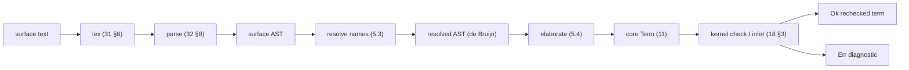

# Elaboration: surface → core

> Status: **DRAFT v0**; **§5 (V0) elaborated** to implementation rigor for the
> G1 minimal slice. Normative for *what elaboration must produce and guarantee*;
> the algorithm is specified to the level WS-L/WS-V need. Contract for **V0**
> (the minimal elaborator, `§5`) and the foundation the whole surface rests on.
> Elaboration turns the surface language (`31`–`38`) into fully-explicit **core
> terms** (`../10-kernel/`). It is **untrusted**: the kernel re-checks
> everything it emits. `§1`–`§4`, `§6` stay frame-level for the full (Phase-3)
> elaborator; `§5.1`–`§5.7` pin V0 to pseudocode.

## 1. Role and the trust split

The elaborator is the largest, cleverest part of the front end —
implicit-argument insertion, unification, type inference, instance resolution,
`match` compilation, sugar expansion — and **none of it is trusted**. Its output
is a core term the kernel `check`s (`../10-kernel/18 §4`). Consequences:

- A bug in the elaborator yields an **ill-typed core term** the kernel
  **rejects**, or a *well-typed but unintended* term (caught by tests/specs) —
  **never** an unsound acceptance. This is why the surface can be rich and
  evolve quickly while the trusted base stays tiny (`../00-overview.md §3`).
- The elaborator MAY use unification, metavariables, heuristics, and search; the
  kernel has none of these (`../10-kernel/18 §3`). The two are deliberately
  asymmetric: cleverness outside, certainty inside.

## 2. What elaboration does

1. **Scope & resolution** — resolve names against the module environment (`33`),
   reject unbound/ambiguous references.
2. **Implicit insertion** — insert implicit arguments `{x:A}` (`32`, `33 §1`) at
   uses, creating metavariables for them.
3. **Type inference & unification** — a bidirectional, **Hindley–Milner +
   dependent** elaboration: propagate expected types inward (checking) and
   synthesize where needed (inference), solving metavariables by **unification**
   up to definitional equality (`../10-kernel/17`). Higher-order cases use
   pattern unification; genuine ambiguity is a reported error, not a guess.
4. **Universe/level inference** — solve level metavariables (`../10-kernel/12
   §4`), emitting explicit levels to the kernel.
5. **Instance resolution** — discharge `where C A` constraints (`33 §5`) by
   instance search (the algorithm: **§6**), inserting the found class-record (a
   proof of subobject membership). **Canonical & coherent** (`OQ-classes`): for
   structure classes
   exactly one canonical instance per (class, head-type) is searchable (orphans
   are rejected at declaration, `33 §5`); search is deterministic and
   structurally bounded (`../10-kernel/17 §4`); two viable candidates is a
   surface error naming both, never a silent pick; overlap is not permitted.
   Property (Ω-valued) classes resolve to any instance — all are equal. A
   wanted-but-non-canonical dictionary is supplied by passing a named instance
   value explicitly (not via search).
6. **`match` compilation** — translate `match` (`34 §3`) into nested `elim_D`
   (`../10-kernel/14 §3`) with the recovered **dependent motive**, and run
   **exhaustiveness + reachability** checking (`34 §4`).
7. **Sugar expansion** — telescopes (`../10-kernel/13 §3`), records → Σ (`33
   §2`), `if` → `elim_Bool`, contracts/refinements → the obligation encoding
   (`../20-verification/21 §6`, `22`), `do`/comprehensions (if any) →
   combinators, numeric literals → `fromInteger`/… (`35 §4`), layout → braces
   (`31 §6`); `@ct`-annotated expressions → IFC taint label on the
   interaction-tree perform node (`36 §3`, `../60-security/61 §5a`);
   `temporal{}`/`Temporal` surface notation → `Temporal` inductive data
   (`../70-behavioral/72`); `Wrapping[T]` / `+%` → wrapping-arithmetic
   primitives (`35 §3`).
8. **Obligation emission** — where a refinement/contract is introduced, emit the
   proof obligation (`../20-verification/22`) and leave a hole/`prove` slot.

### 2.1 Proof-returning dependent `match` motives

When a surface `match` is checked against a known expected type, motive recovery
is part of elaboration. For a proof-returning dependent `match` (`34 §3.5`), the
expected type is itself a proposition, commonly `Equal A lhs rhs`, whose operands
mention the scrutinee directly or through a transparent/reducible expression. The
elaborator MUST treat this as an ordinary dependent eliminator into `Ω`, not as a
non-dependent match whose proof result is inferred from the first arm.

The required elaboration contract is:

1. Infer the scrutinee core term `s` and type `D p̄ ī`; reject non-inductive
   scrutinees with the ordinary `match` type error.
2. Infer/classify the expected target `E[s]`. If it classifies as `Ω_l`, this is
   a proof motive; if it classifies as `Type l`, this is ordinary large
   elimination. These two cases are both valid sorts for `Term::Elim`
   (`../10-kernel/14 §3`). The elaborator MUST NOT force an `Ω` target through
   `Type`, and MUST NOT coerce a `Type` target into `Ω`.
3. Recover the motive by generalizing the expected target over the scrutinee and
   indices: `M = λī x. E[x]`. Transparent aliases and reducible heads needed to
   expose the dependency, including `Equal` unfolding to kernel `Eq`
   (`../50-stdlib/53 §1`), are handled by the same WHNF/transparent-unfolding
   discipline used elsewhere in elaboration. If multiple incomparable
   generalizations remain possible, report an ambiguity/unsupported-dependent-
   motive error; do not choose one silently.
4. For each constructor method, check the branch body against the specialized
   target `E[cₖ fields]` under the constructor telescope and branch refinement
   (`34 §3.3`). A branch proof for `E[cᵢ ...]` is not acceptable in the
   `cₖ` branch unless the two propositions are definitionally equal after the
   existing kernel reductions. `Ω` proof irrelevance applies only after this
   type check succeeds at the same proposition.
5. Emit `Term::Elim { motive = M, methods, indices = ī, scrut = s }` and run
   the ordinary kernel re-check. The emitted motive may be an ascribed lambda
   when needed so the kernel can infer its codomain sort.

**Audit boundary.** A build that touches this area must classify failures at the
following layers, using Ken-owned reproducers rather than CAT-4 proof-search
speculation:

- **Surface motive construction.** Wrong abstraction of `E[s]` over the
  scrutinee or indices is an elaborator bug. If the emitted core is ill-typed,
  the kernel rejects fail-closed; an elaborator-only fix remains outside the
  TCB so long as `crates/ken-kernel`, `Cargo.lock`, and `trusted_base()` are
  unchanged.
- **Proof-sort handling.** A Type-vs-Omega failure on an otherwise well-formed
  proof motive means some layer tried to classify `Ω_l` as `Type l` (or the
  reverse). If this is in motive recovery, route Language. If the kernel's
  `Term::Elim` checker rejects a motive whose codomain is `Ω_l`, route Kernel
  plus Architect because `14 §3` already admits `Ω`-codomain motives.
- **`Equal` lowering under branch refinement.** `Equal` is transparent to `Eq`;
  branch specialization substitutes the constructor form into the equality
  operands before `Refl`, `tt`, `J`, `absurd`, or library transport is checked.
  A wrong-specialized branch must still reject. An acceptance of such a branch
  is a soundness issue, not an ergonomic diagnostic bug.
- **Kernel `Term::Elim` checking.** The kernel checks the motive against
  `(Δ_i) → D p̄ Δ_i → sort`, each method against the constructor-specialized
  method type, the indices, and the scrutinee (`../10-kernel/14 §3`). If the
  kernel rejects a core term that satisfies those obligations, the finding is a
  kernel completeness bug. If it accepts a method that does not satisfy the
  specialized target, the finding is a TCB soundness bug and requires Architect
  plus Kernel review before build continues.
- **Fail-closed posture.** An implementation may reject a valid proof-returning
  dependent match while the mechanism is incomplete. It may not accept by
  dropping the dependency, replacing the proof target with a constant `Top`, or
  using proof irrelevance before branch methods have checked at their exact
  propositions.

**Expected green/red shape.** The minimized regression for this mechanism should
be smaller than the CAT-4 map proof but preserve the same load-bearing shape:
an option-like or two-constructor scrutinee, a target `P[s] : Ω` such as
`Equal R (f s) (g s)`, and branch bodies that close locally at `P[C0]` and
`P[C1 x]`. The positive case accepts. A sibling where one branch supplies a
proof for the other branch's specialized target rejects. A whole-body
`KernelRejected { TypeMismatch { expected: Type 0, found: Omega0 } }` on this
shape is not an acceptable final diagnostic; it must be classified to one of the
audit layers above.

**Mechanism split rule.** The semantic rule is one rule: dependent elimination
into a proof target. If the minimized reproducer shows separable implementation
work, split implementation only along these boundaries:

- **proof-motive sort recovery** — `Ω` vs `Type` motive classification and
  branch checking for a single-scrutinee proof target; this is required here;
- **generalized scrutinee dependency** — targets that mention a reducible term
  equal to a non-variable scrutinee, nested/multi-scrutinee matrix recovery, or
  other occurrence-selection ambiguity; split only if absent from the minimized
  required seed;
- **indexed-family dependent match** — non-empty index telescopes and
  index-impossible method synthesis remain the existing `34 §4.3`/L2-indexed
  surface unless the minimized proof-motive reproducer truly depends on them.

## 3. What elaboration must guarantee

- **Well-typed output.** Every emitted core term `check`s in the kernel; if it
  cannot produce one, it reports a precise surface error (not a kernel error).
- **No guessing past ambiguity.** Unsolved metavariables or ambiguous instances
  are surface errors with locations, never silently defaulted (except the
  *declared* defaults: numeric literals `35 §4`, level typical-ambiguity `12
  §4`).
- **Faithful sugar.** Desugaring preserves the surface's intended meaning; the
  round-trip (surface → core → behaviour) matches the surface semantics the
  chapters specify.
- **Totality routing.** Recursive definitions are emitted as eliminator
  applications where structural, else as δ-definitions gated by the kernel's SCT
  (`../10-kernel/17 §4`); a totality failure is surfaced from the kernel's
  verdict.
- **Determinism.** Same surface input → same core output (modulo metavariable
  names), so diagnostics and the protocol (`../20-verification/25`) are stable.

## 4. Errors and diagnostics

- **Surface type errors** (unification failure, unbound name, non-exhaustive
  `match`, ambiguous instance) are reported by the elaborator with source spans
  — these are *L1* errors, distinct from *L2* verification failures
  (`../20-verification/24`).
- The elaborator SHOULD recover and continue (report multiple errors, support
  the LSP), but its *accepted* output is always kernel-checked. Partial programs
  with verification holes still elaborate (the holes are obligations, `22`);
  programs with *type* errors do not (they have no well-typed core image).

## 5. V0 — the minimal elaborator (Phase 1)

For the G1 vertical slice, V0 is a **minimal** elaborator: enough surface to
`parse → elaborate → kernel-check` a trivial dependently-typed program — named
functions (`view`), λ, application, local `let`, type ascription, the dependent
function type `(x : A) → B`, the universe `Type`, and a base type or two
referenced by name. The full inference, instances, `match`, sugar, and literals
grow in Phase 3 (WS-L, `§6`). Keeping V0 minimal de-risks the slice: it proves
the *pipeline shape* — surface → core → kernel verdict — before the elaborator's
complexity lands. V0's output is **kernel-re-checked** (the de Bruijn criterion,
`docs/PRINCIPLES.md`), so V0 is **not in the TCB**: a V0 bug yields a rejected
valid program or a poor diagnostic, never an unsound acceptance (`§1`).

This section pins V0 to implementation resolution. The subsections fix the exact
surface subset (`§5.1`), its concrete syntax and AST (`§5.2`), the
correctness-critical name-resolution-to-de-Bruijn pass (`§5.3`), the
bidirectional surface→core elaboration (`§5.4`), the end-to-end pipeline
(`§5.5`), the error taxonomy (`§5.6`), and the level-discipline reconcile
(`§5.7`). Anything not listed here is **out of V0** and owned by a later WP.

### 5.1 The V0 surface subset

V0's parser and elaborator handle **exactly** these forms — and nothing else
from `31`–`38`:

- **Declarations**
  - `view f (x : A) … : B = expr` — a named (possibly dependent) function; the
    binders `(x : A)` are a telescope desugaring to nested λ and Π (`§5.4`).
  - `let x : A = expr` — a top-level value definition.
- **Types** (the type-position grammar)
  - `(x : A) → B` — the dependent function type (Π); the non-dependent arrow
    `A → B` is the special case where `x ∉ B`.
  - `Type` — the universe, with an optional explicit level (`Type`, `Type 0`,
    `Type 1`, …); a bare `Type` gets an inferred level (`§5.7`).
  - a bare `ConId` — a base type referenced by name (e.g. `Nat`, `Bool`).
- **Expressions**
  - `λ x . expr` (ASCII `\ x . expr`) — λ-abstraction; binders are explicit.
  - `expr expr` — application (left-associative).
  - `ident` — a variable reference (resolved in `§5.3`).
  - `( expr : type )` — type ascription (a checking hint, `11 §1`).
  - `let x : A = expr in expr` — a local binding.

**Explicitly out of V0** (each owned elsewhere, do not absorb): `data`/`match`
(`34`, Team Language), `record`/modules (`33`), effects (`36`), FFI (`38`),
numeric and other literals (`35`), implicit arguments `{x : A}` and the
unification that inserts them (`§2.2`–`§2.3`), instance resolution (`§2.5`),
and `match` compilation (`§2.6`). All V0 arguments are **explicit**; V0 performs
**no implicit insertion**.

**Base types.** V0 does not declare inductives. The base types it references
(`Nat`, `Bool`) are assumed **pre-declared** in the kernel environment `Σ` as
opaque constants at `Type 0` (`Nat : Type 0`, `Bool : Type 0`; `11 §4`,
`declare_postulate`, `18 §4`). V0 resolves a `ConId` by name against `Σ` and
emits the corresponding constant `c` (`11 §1`); it never synthesises a base
type's *values* (no literals in V0). The smallest end-to-end program needs no
base type at all:

```
view id (A : Type) (x : A) : A = x
```

parses (`§5.2`) → resolves names to de Bruijn indices (`§5.3`) → elaborates to a
core term (`§5.4`) → is accepted by the kernel's `check`/`infer` (`18 §3`).

### 5.2 The V0 parser (concrete syntax → surface AST)

V0 reads the **brace form** of the grammar; layout (`31 §6`) is OQ-syntax and
out of V0 scope. The token set is the minimal lexer of `31 §8`: the keywords
`view let in Type`, the punctuation `( ) : = .` and the arrow `->`/`→`, the λ
spelling `\`/`λ`, lowercase-initial `ident` (term variables) and
uppercase-initial `ConId` (base types). The concrete grammar is the minimal
EBNF of `32 §8`; reproduced here for the elaborator's view of it:

```
decl   ::= "view" ident binder+ (":" type)? "=" expr
         | "let"  ident (":" type)?         "=" expr
binder ::= "(" ident+ ":" type ")"
type   ::= "(" ident ":" type ")" "->" type    -- dependent Π
         | type "->" type                       -- non-dependent arrow
         | "Type" level?                         -- universe (level optional)
         | ConId                                 -- base type by name
expr   ::= ("\" | "λ") ident+ "." expr          -- lambda
         | expr expr                             -- application (left assoc)
         | "let" ident (":" type)? "=" expr "in" expr
         | "(" expr ":" type ")"                 -- ascription
         | ident                                 -- variable
         | ConId                                 -- base type used as a term
         | "Type" level?                         -- universe used as a term
level  ::= NAT                                   -- 0, 1, 2, …
```

The last two atoms reflect that **types are terms** (`../10-kernel/11 §1`): a
base type (`Nat : Type 0`) and a universe (`Type n : Type (suc n)`) are ordinary
terms and may appear in expression position — e.g. the body of `let x : Type =
Type in x`. `->`/Π appears only in *type* position (after `:` or in a binder),
so a bare function type is not a V0 expression.

`->` is right-associative; application binds tightest; ascription `:` is
loosest (`32 §6`). The parser emits a **surface AST** carrying source spans on
every node (for `§5.6` diagnostics):

```
Decl ::= ViewDecl name (binder list) (Type option) Expr   -- params, result, body
       | LetDecl  name (Type option) Expr

Expr ::= EVar  name span                  -- unresolved: still a name
       | EApp  Expr Expr span
       | ELam  name Expr span               -- single binder (see desugaring below)
       | ELet  name (Type option) Expr Expr span
       | EAsc  Expr Type span
       | ECon  name span                    -- base type used as a term
       | EUniv (level option) span          -- Type / Type n used as a term

Type ::= TPi   name Type Type span          -- (x : A) -> B   (x bound in B)
       | TArr  Type Type span               -- A -> B         (sugar: x ∉ B)
       | TUniv (level option) span          -- Type | Type n
       | TCon  name span                    -- base type ConId
       | TVar  name span                    -- a type-position variable (e.g. A)

binder ::= (name list) Type                 -- (x y z : A)
```

A type-position identifier may be a base type (`TCon`, uppercase) or a bound
type variable (`TVar`, lowercase, e.g. the `A` in `(A : Type) → A`); the case
distinction (`31 §2`) tells them apart at parse time. Names in `EVar`/`TVar`
are still surface names; `§5.3` replaces them with de Bruijn indices.

### 5.3 Name resolution → de Bruijn (the correctness-critical core)

This is the **one** pass where V0 can silently produce a *well-typed-looking but
wrong* core term: a capture or mis-scoping bug yields a term the kernel will
happily check — against the wrong binder. The kernel cannot catch it (it only
sees indices, which would resolve to *something*), so V0 must get it right. The
algorithm is the standard scope-stack walk:

```
resolve(scope, node):                  -- scope: name list, innermost first
  case node of
    EVar(name):
      i := indexOf(scope, name)         -- first (innermost) match, 0-based
      if i = none:  error Unbound(name, node.span)
      return RVar(i, name)              -- keep name for diagnostics only
    ELam(x, body):
      return RLam(x, resolve(push(x, scope), body))   -- single binder
    EApp(f, a):
      return RApp(resolve(scope, f), resolve(scope, a))
    EAsc(e, t):
      return RAsc(resolve(scope, e), resolveTy(scope, t))
    ECon(c):   return RCon(c)             -- base type as a term; resolved in Σ
    EUniv(l):  return RUniv(l)            -- Type / Type n as a term
    ELet(x, tyopt, rhs, body):
      rhs' := resolve(scope, rhs)                 -- x NOT in scope of its own rhs
      body' := resolve(push(x, scope), body)      -- x in scope of the body
      return RLet(x, mapTy(resolveTy(scope), tyopt), rhs', body')

resolveTy(scope, ty):
  case ty of
    TPi(x, A, B):
      A' := resolveTy(scope, A)
      B' := resolveTy(push(x, scope), B)          -- x bound in B (only)
      return RPi(x, A', B')
    TArr(A, B):
      return RArr(resolveTy(scope, A), resolveTy(scope, B))   -- no binder
    TUniv(lvl):  return RUniv(lvl)
    TCon(c):     return RCon(c)                    -- base type, resolved in Σ later
    TVar(name):
      i := indexOf(scope, name)
      if i = none:  error Unbound(name, ty.span)
      return RVarTy(i, name)

indexOf(scope, name):                  -- de Bruijn: distance to nearest binder
  scan scope from the front (innermost); return the 0-based position of the
  first entry equal to name, or none.
```

**Desugaring to single binders.** All multi-binder surface forms are flattened
to nested single-binder forms in a parse pre-pass, *before* resolution, so the
resolved AST (`RLam`, `RPi`) is uniformly single-binder:

- a λ over several names `\x y z . e` → `\x . \y . \z . e`;
- a binder group `(x y z : A)` → three Π/λ binders each of type `A`;
- a `view f (x : A) (y : B) : C = body` → nested λ over the parameter telescope
  with the declared type read as the matching nested Π `(x : A) → (y : B) → C`.

Parameter binders thus enter the scope stack left-to-right (outermost first),
exactly as λ/Π binders do (`§5.4`). The output is a **resolved AST** (`RVar` /
`RVarTy` carry an index; binder sites retain the source name for error messages
only — the index is what elaboration emits).

**Properties this pass must have:**

1. **Shadowing is by stack discipline.** An inner binder of the same name hides
   an outer one because `indexOf` returns the *first* (innermost) match. No
   special shadowing logic is needed or permitted — getting this from the stack
   is what makes it correct.
2. **A binder scopes only where the grammar says.** In `(x : A) → B`, `x` is in
   scope in `B` but **not** in `A`; in `let x : A = e in body`, `x` is in scope
   in `body` but **not** in `e` (no V0 recursion in `let`). The pseudocode
   pushes the binder on exactly the right recursive call.
3. **Unbound is a name-resolution error**, raised *here* with a source span
   (`§5.6`), never deferred to the kernel.

**Worked shadowing case** (the load-bearing guard — AC4). The guard must be
**discriminating**: correct resolution and a capture bug have to produce
*observably different* outcomes, or the test passes vacuously and catches
nothing (the discriminating-case discipline). A program whose body merely
*rejects* under both resolutions does **not** qualify — the verdict, or the
emitted index, has to differ. The right shape pairs a shadowing binder of a
**different type** than the intended one with a codomain the **intended**
binder satisfies:

```
view f (A : Type) (x : A) : Type -> A = \B . x
```

Its declared type is `(A : Type) → (x : A) → (Type → A)`, i.e.
`Pi(Univ 0, Pi(Var 0, Pi(Univ 0, Var 2)))`. Resolving the body `\B . x`, the
scope stack at the occurrence of `x` is (innermost first):

```
[ B ,  x ,  A ]      -- from \B , then the params (x : A)(A : Type)
  0    1    2
```

`indexOf(scope, "x")` skips `B` (name `B` ≠ `x`) and matches at **index 1** —
the outer `x` parameter (type `A`). The elaborated core is
`Lam(Univ 0, Lam(Var 0, Lam(Univ 0, Var 1)))`; checked against the declared
type, the body `x : A` meets the codomain `A` (`Var 2` under the three binders),
so it **kernel-accepts**. A capture bug that instead resolved `x` to the
innermost binder (**index 0** = `B : Type`) would emit `… Lam(Univ 0, Var 0)`,
whose body has type `Type ≢ A` — the kernel **rejects**. The two resolutions
give **opposite verdicts**, so the case genuinely exercises the resolver.

The discriminating signal is the **resolved index itself** (`Var 1`, not
`Var 0`); conformance asserts it **structurally** on the emitted core term —
verdict-independent, so the guard holds even where a kernel verdict alone would
be ambiguous (`§5.6`, AC4). (Contrast the tempting non-example
`… : (A : Type) → A = \A . x`: the inner λ shadows with the *same* name and
type-role as the codomain binder, so *both* the correct and the captured
resolution reject — the test would pass vacuously and guard nothing.) This case
is **required**, not optional: name resolution is the one V0 pass whose errors
the kernel cannot backstop — a mis-resolution that stayed well-typed would be a
silent, well-typed-but-wrong term (`§1`).

### 5.4 Elaboration — surface → core (the algorithm)

Elaboration is **bidirectional** (`§2.3`, `18 §3`): `check` pushes a known type
inward, `infer` synthesises one. It runs on the *resolved* AST (indices, not
names) and emits core terms (`11 §1`). V0's minimal forms keep it small: `infer`
for variables, applications, and ascriptions; `check` for λ and `let`; a single
`infer`-then-convert fallback everywhere else.

```
infer(Γ, e) → (Term, Type):
  case e of
    RVar(i):                                          -- 11 §1 variable
      A := lookup(Γ, i)                               -- type at de Bruijn index i
      return (Var(i), A)
    RApp(f, a):                                       -- 13 §1 Π-Elim
      (f', tf) := infer(Γ, f)
      Pi(x, A, B) := whnf(Γ, tf)  or error NotAFunction(f.span, tf)
      a' := check(Γ, a, A)
      return (App(f', a'), subst(B, a'))              -- B[a'/x]
    RAsc(e, t):                                       -- 11 §1 ascription
      A := elabType(Γ, t)
      e' := check(Γ, e, A)
      return (e', A)                                  -- ascription erased after check
    RUniv(Some n):  return (Univ(n), Univ(suc n))     -- 12 §1 U-Type
    RUniv(None):    u := freshLevelMeta()
                    return (Univ(u), Univ(suc u))     -- 12 §4 (solved in §5.7)
    RCon(c):        return (constOf(Σ, c), typeOf(Σ, c))  -- base type as a term
    RVarTy(i):      return (Var(i), lookup(Γ, i))     -- type-pos var, term pos

check(Γ, e, expected) → Term:
  case (e, whnf(Γ, expected)) of
    (RLam(x, body), Pi(y, A, B)):                     -- 13 §1 Π-Intro
      body' := check(extend(Γ, A), body, B)           -- under x : A; B already binds y≡x
      return Lam(A, body')                            -- core λ carries its domain A
    (RLam(_, _), notPi):
      error LambdaVsNonFunction(e.span, notPi)
    (RLet(x, tyopt, rhs, body), expected):            -- 11 §1 let
      (rhs', A) := case tyopt of
                     Some t -> let A = elabType(Γ, t) in (check(Γ, rhs, A), A)
                     None   -> infer(Γ, rhs)
      body' := check(extend(Γ, A), body, expected)
      return Let(A, rhs', body')                      -- let _ := rhs' : A in body'
    (e, expected):                                    -- 18 §3 mode switch (Conv)
      (e', inferred) := infer(Γ, e)
      if convert(Γ, Type ℓ, expected, inferred):  return e'      -- 17 §3.3
      else  error TypeMismatch(e.span, expected, inferred)
        -- convert compares the two *types* at their common universe Type ℓ,
        -- exactly as the kernel's (Conv) mode switch does (18 §3).

elabType(Γ, t) → Term:                                -- type-position elaboration
  case t of
    RPi(x, A, B):                                     -- 13 §1 Π-Form
      A' := elabType(Γ, A)
      B' := elabType(extend(Γ, A'), B)
      return Pi(A', B')                               -- (x : A') → B'
    RArr(A, B):
      A' := elabType(Γ, A)
      B' := elabType(Γ, B)                            -- same Γ: source has no binder
      return Pi(A', weaken(B'))                       -- lift past the unused Π binder
    RUniv(Some n):  return Univ(n)                    -- Type n      (12 §1)
    RUniv(None):    return Univ(freshLevelMeta())     -- bare Type   (12 §4, §5.7)
    RCon(c):        return constOf(Σ, c)              -- base type by name (11 §4)
    RVarTy(i):      return Var(i)                     -- a type-position bound variable
```

Notes tying each clause to the kernel:

- **`Lam` carries its domain.** The core λ is `λ (x : A). t` (`11 §1`,
  `13 §1` Π-Intro); V0 takes the domain `A` from the *expected* Π, so the
  emitted λ and the Π agree by construction — there is no separate annotation to
  drift. This is why λ is a **`check`** form, never `infer` (an unannotated λ
  has no inferable domain in V0).
- **Application is `infer`.** The head's type is whnf-reduced (`17 §3.2`) to
  expose a Π; the argument is `check`ed against the domain; the result type is
  the codomain with the argument substituted, `B[a'/x]` (`13 §1` Π-Elim). V0
  never guesses the head type.
- **The mode switch is the only conversion call.** Every non-canonical `check`
  falls to `infer`-then-`convert` (`18 §3`), the algorithmic (Conv) rule. V0
  surfaces a `convert = false` as a `TypeMismatch` with the *surface* span
  (`§5.6`); it does **not** insert a `cast` (V0 has no `Eq` proofs to cast
  along — casts are a Phase-3/observational concern, `16`). Because the K1
  kernel's `convert` is total and decidable (`18 §3`, `17 §5`), the switch
  always returns a definite yes/no.
- **No unification across terms.** V0's only metavariables are **level** metas
  (`§5.7`); term-level inference is the explicit bidirectional walk above. This
  keeps V0 far simpler than the full elaborator (`§2.3`), which is licensed
  because V0's surface is explicit-enough that nothing else needs solving.

The emitted core term is **fully explicit**: de Bruijn indices, explicit domains
on every λ and Π, and explicit levels on every `Univ` (`§5.7`). It contains no
metavariables — V0 solves all level metas before emission — so the kernel
receives exactly the language of `11 §1`.

### 5.5 The pipeline

V0 is a straight-line pipeline from source text to a kernel verdict; the kernel
is the sole judge and is never bypassed.



Each stage can fail and is the origin of one error class (`§5.6`): the lexer and
parser raise **parse errors**; resolution raises **unbound-name errors**;
elaboration raises **lambda-vs-non-function** and surfaces the kernel's
**type-mismatch**. The accepted output is **always** a core term that the
kernel's `infer`/`check` (`18 §3`) has re-derived a type for — V0 emits the
term and reports the kernel's verdict; it has no acceptance path of its own.

### 5.6 Errors

V0 produces three error classes, each tagged with a source span and attributed
to the stage that raised it (`§4` — these are L1 surface errors, distinct from
L2 verification failures):

- **Parse error** — from the lexer/parser (`31 §8`/`32 §8`), with the span of
  the offending token or region.
- **Unbound name** — from name resolution (`§5.3`), naming the unresolved
  identifier with its span. Raised *here*, never deferred to the kernel (an
  unbound name has no de Bruijn index to emit).
- **Type mismatch** — from the kernel's `convert`/`infer` failing on the emitted
  core term (`18 §3`, `17 §3.3`), re-surfaced at the originating *surface* span
  with the expected and inferred types. Includes `NotAFunction` (a non-Π head in
  application) and `LambdaVsNonFunction` (a λ checked against a non-Π), which V0
  detects structurally before the kernel call.

V0 SHOULD recover and report multiple errors where it can (parse and
name-resolution errors compose across independent declarations; the LSP wants
this, `§4`), but its **accepted** output is always kernel-checked — a program
with a type error has no well-typed core image and is rejected, never partially
admitted (`§3`).

### 5.7 Level-discipline reconcile

Per the standing directive, every formation rule in `§5.4` that produces or
manipulates a universe level is given its **explicit** level computation and
reconciled against `10-kernel/12-universes.md` — citing the section, not merely
deferring to it.

- **Universe (`elabType` `RUniv`).** `Type n` elaborates to `Univ(n)`, and the
  kernel types it by `Univ(n) : Univ(suc n)` — the **(U-Type)** rule, `12 §1`.
  There is **no** `Type n : Type n` and no `Type : Type` (Girard's paradox,
  `12 §1`); V0 emits a concrete `n`, so the kernel checks the literal rule. A
  **bare** `Type` elaborates to `Univ(?u)` for a fresh level metavariable `?u`
  (`§5.4`); `?u` is solved during elaboration (below) and the emitted core has
  an explicit level — the kernel **never** receives a level metavariable
  (`12 §4`).

- **Dependent function type (`elabType` `RPi`/`RArr`).** `(x : A) → B`
  elaborates to `Pi(A', B')`; the kernel types it by the predicative
  **(Π-Form)** rule, `13 §1` / `12 §2`:

  ```
    Γ ⊢ A' : Type ℓ₁     Γ, x : A' ⊢ B' : Type ℓ₂
    ──────────────────────────────────────────────
    Γ ⊢ (x : A') → B' : Type (max ℓ₁ ℓ₂)
  ```

  The function type takes the **`max`** of domain and codomain levels and does
  **not** drop to a lower universe (predicativity, `12 §2`) — V0 stores no level
  on the `Pi` node (it is derived by the kernel), so there is nothing for V0 to
  get wrong here *except* not inventing a level: V0 emits `Pi(A', B')` and lets
  (Π-Form) compute `max`. For the trivial `id`, `(A : Type 0) → (x : A) → A` has
  level `max(suc 0, max 0 0) = 1` by (Π-Form) over the two nested Πs — `Type`
  itself sits at `Type 1`, its element `A` at `Type 0`.

- **Non-cumulative (`OQ-2`, `12 §3`).** `A : Type ℓ` does **not** give
  `A : Type (suc ℓ)`; lifting is **explicit**. V0 inserts **no** implicit lifts
  and has no subtyping — a "universe too low" mismatch is surfaced as a
  `TypeMismatch` (`§5.6`), not silently coerced. (Cumulative ergonomics are a
  later untrusted-elaborator concern, `12 §3`; V0 does not pay that cost and the
  kernel never sees a subtyping query.)

- **Level metavariable solving.** V0's only metavariables are levels. Solving is
  a semilattice unification over `ℓ ::= 0 | suc ℓ | max ℓ ℓ | ?u` (`12 §1`):
  constraints arise where two universes must agree (e.g. an ascription forcing
  two `Type`s equal). An **unconstrained** `?u` is defaulted to `0` — *typical
  ambiguity*, the one declared level default (`12 §4`, `§3`). After solving, V0
  emits the explicit level; the kernel re-checks each level equality as an
  ordinary decidable level conversion (`12 §1`, `17 §3.6`) at every use, so a
  wrong solve is caught by the kernel, not trusted. Level abstraction is only at
  top-level declarations (`12 §4`); V0 emits explicit level arguments on any
  polymorphic-constant use and never makes a level a first-class term.

- **Decidable level equality.** Level comparison during the mode switch and at
  every `Univ` is the kernel's `convLevel` (`17 §3.6`) over the semilattice laws
  (`max` associative/commutative/idempotent, `max ℓ 0 = ℓ`, `suc (max ℓ₁ ℓ₂) =
  max (suc ℓ₁) (suc ℓ₂)`, `12 §1`). It is total and decidable, so the level
  side of conversion never stalls — consistent with the K1 kernel contract
  (`18 §3`).

This reconcile confirms V0's level computations are exactly those of `12`:
universes step by `suc`, function types take the predicative `max`, lifting is
never implicit, unconstrained levels default to `0`, and every level reaching
the kernel is explicit and decidably checked.

## 6. Instance resolution — the algorithm (Lc)

> **impl-ready (Lc).** The algorithm-level elaboration of the `where C A`
> discharge (step `§2.5`) and the coherence policy (`33 §5.5`, ADR 0008). The
> *shapes* (class→record, instance→value, constraint→implicit) are `33 §5`; this
> is the **resolution procedure**, its **termination metric**, and the
> **diagnostics**. **No new kernel feature** — the search is proof search over
> the landed record/Σ machinery, and its termination is the **landed SCT**
> (`../10-kernel/17 §4`) on the reified dictionary group (§6.4).

### 6.0 Class-field purity metadata (SURF-2)

Class-field purity is an additive surface/elaboration check over the `33 §5.2`
class-record shape. It is not a second class system and not a kernel feature.

**Parse/store.** The class field grammar is:

```
class_field ::= field_purity? field_name ":" type
field_purity ::= "const" | "fn" | "proc"
```

The parser stores the optional keyword with the field declaration, e.g.
`Decl::ClassDecl.fields` becomes declaration-order triples
`(Option<DefKeyword>, field_name, field_type)` or an equivalent field record.
`None` means the field is unmarked and keeps the pre-SURF-2 behaviour.

During `elab_class_decl`, the elaborator registers the keyword as class metadata
parallel to the existing field vectors:

```
ClassInfo {
  field_names    : Vec<String>,
  field_types    : Vec<Term>,
  field_purities : Vec<Option<DefKeyword>>,
  ...
}
```

`field_types` remains the only input to the emitted right-nested Σ telescope and
to the kernel-computed class sort (`33 §5.1`). `field_purities` is erased before
kernel emission: it must not affect the class type, the Σ chain, `sort_sigma`,
property-vs-structure classification, orphan/overlap policy, or
`trusted_base()`.

**Class-field marker validation.** A marked class field is validated at class
declaration time against the field's declared type/telescope, before any
instance exists. The classifier input is the field signature read from
`field_types[i]`, not an implementation expression and not a hidden field-binder
list. Thus `const seed : Int` and `fn unary : Int -> Int` are well-shaped pure
fields; `const bad : Int -> Int`, `fn bad : Int`, and `proc bad : A -> A`
reject unless the declared type itself carries the effect/row-polymorphic shape
that earns `proc`. The `proc traverse` field in `56 §5.1` is the intended
positive case: its declared telescope is row-polymorphic through the abstract
applicative argument, so the stored marker is earned by the field signature.

**Instance-field enforcement.** Instance elaboration still computes field values
in class-declaration order and checks each implementation against its
properly-substituted expected type (`compute_ordered_field_values`, `33 §5.3`).
For a marked field, the same step also checks that the field implementation is
compatible with the already-stored field classification, reusing the existing
SURF-1 static-purity classifier/check (`36 §1.6`):

- `None` — status quo: no purity check beyond the existing type check.
- `Some(Const)` / `Some(Fn)` — the implementation must classify as pure with
  the corresponding explicit-value-arity rule; false-purity/effect escape is a
  hard L1 error.
- `Some(Proc)` — the implementation must classify as `proc` by the existing
  SURF-1 criteria, including the row-variable/effect-polymorphic case. A
  best-case pure instantiation does not downgrade the field; the declared field
  signature is what is checked.

This check is a factorization/reuse of the definition-level
`check_surface_purity` path, not a parallel classifier. A mismatch is reported
at the instance field span with the declared class field and expected keyword in
the diagnostic; it is not deferred to the kernel.

**Projection classification.** `.field` projection continues to elaborate to
the same Σ projection term (`proj1(proj2^i(d))`) with the same substituted field
type. In addition, when the base is a known class dictionary, `infer_proj`
consults `ClassInfo::field_purities[i]` and attaches that static-purity
classification to the projected expression. Therefore, if
`Traversable.traverse` is declared `proc`, a use such as `d.traverse` classifies
as `proc` at the call site and routes through the ordinary effect/purity checks.
Unmarked projections remain unclassified.

**Build extension points.** The minimal implementation surface is exactly the
existing class path: the parser's class-field loop accepts an optional
`DefKeyword`; the class AST carries it; `ClassInfo` stores it parallel to
`field_names`; the instance Σ-Intro field check enforces it through the SURF-1
purity path; and `RExpr::RProj`/`infer_proj` returns the projection's stored
field purity to downstream classification. No `crates/ken-kernel` or
`Cargo.lock` change is in scope.

### 6.1 The instance environment (built from declarations)

Resolution reads an **instance environment** the elaborator accumulates as it
processes `instance` declarations (`33 §5.3`). Each accepted instance registers
one entry:

- **key** — `(class C, head-type h)`, where `h` is the **outermost type
  constructor** of the instance's head (`head(List a) = List`, `head(Int) =
  Int`); the arguments under `h` are matched at resolution.
- **value** — the instance record value (or, for a **parameterised** instance
  `instance C (F ā) where C Gᵢ ...`, the **dictionary-builder** — a function
  from the sub-constraint dictionaries to the `C (F ā)` record, §6.4).
- **registration is gated** by the **orphan check** (`33 §5.3`) and the
  **overlap check**: registering a second entry under an existing
  `(C, h)` key for a **structure** class is the overlap error (§6.7), caught at
  declaration. Property (Ω) classes are never keyed for canonicity — they need
  no registry beyond "an instance exists."

### 6.2 The search procedure

Discharging an inserted implicit `{d : C A}` (`33 §5.4`) runs `resolve`:

```
resolve(Γ, C, A) → Term:                       -- returns the dictionary for  C A
  s := sortOf(Γ, recordType(C, A))             -- the class record's KERNEL sort (33 §5.1)
  h := head(A)                                  -- outermost type constructor of A
  case s of
    Omega:                                       -- PROPERTY class — coherence is free
      d := anyRegisteredInstance(C)              -- all instances defeq (16 §1); first found
        or error NoInstance(C, A, span)
      return d                                    -- never ambiguous: any instance does
    Type:                                         -- STRUCTURE class — canonical convention
      case lookupAll(instanceEnv, C, h) of
        []        -> error NoInstance(C, A, span)             -- 33 §5.5 / §6.7
        [inst]    -> dischargeSubConstraints(Γ, inst, A)       -- recurse (§6.4), then build
        c₁,c₂,… -> error AmbiguousInstance(C, A, [span c₁, span c₂, …])
                    -- names ALL viable candidates; NEVER a silent pick (AC3)
```

- **The sort is the switch (`AC4`).** `resolve` consults the **kernel-computed
  sort** of the class record (`33 §5.1`), not a flag: `Ω` ⇒ property branch
  (any instance), `Type` ⇒ structure branch (canonical). A single procedure
  serves both kinds; the discriminant is structural.
- **Determinism + no guessing (`§3`).** For a structure class the `(C, h)` key
  admits **at most one** registered entry (overlap is rejected at declaration,
  §6.1); the lookup is therefore a function. Two viable candidates surfacing at
  search time (e.g. via a genuinely ambiguous head) is the **ambiguity error
  naming both** — never a default. `resolve` inserts a `d.opᵢ` **projection**
  (`13 §2`) for each class-operation use in the body.
- **Coherence (`AC1`).** Because the key is `(C, head(A))` and the registry has
  one canonical entry per key, the **same** `(class, head-type)` resolves to the
  **same** instance at every site — "the `Ord A`" is a function of `A`,
  program-wide, the property the law-carrying prover relies on (ADR 0008).

### 6.3 Sub-constraints and the built dictionary

A parameterised instance carries its own constraints:

```
instance Ord (List a) where Ord a { … }     -- needs an  Ord a  to build  Ord (List a)
```

`dischargeSubConstraints` resolves each sub-constraint (`Ord a`) **recursively**
via `resolve`, then applies the instance's builder to the found
sub-dictionaries, yielding the `Ord (List a)` record value. The recursion is
what §6.4 must bound.

### 6.4 Termination — the landed SCT on the reified dictionary group

Instance search terminates by the **existing** size-change checker
(`../10-kernel/17 §4`), **not** a second termination mechanism. A parameterised
instance's builder (`mkOrdList : {a} → Ord a → Ord (List a)`) is *itself*
non-recursive — it takes its sub-dictionary as a parameter — so the recursion
that must be bounded is the **resolution's**, and the reuse is literal via
reifying that resolution:

- **Reify the resolution as a dictionary-definition group.** Discharging a goal
  `C A` that needs sub-goals `C Gᵢ` emits one δ-definition per **distinct**
  `(class, type)` sub-goal reached — `dC A := mkInst (dC G₁) …` — admitted
  through the real `declare_def` / **`declare_recursive_group`**
  (`check.rs:983`, `sct_check` at `:1033`). The edges of this group are exactly
  the instance-dependency graph.
- **Bound by the landed `sct_check`.** `declare_recursive_group` runs
  **`sct_check`** on that group at **admission time**, under the **structural
  subterm order**
  (`17 §4.2`) keyed on each node's **head-type**: a sub-goal's head-type (`a`,
  `Gᵢ`) is a **strict structural subterm** of its parent's (`List a`, `F ā`). A
  **well-founded** instance chain (`Ord a ⇒ Ord (List a)`: `a ⊏ List a`) yields
  a group that either bottoms out or strictly descends — **`sct_check` accepts**
  (`AC6`-accept). A **cyclic / non-decreasing** set (`instance C A where C A`,
  or `C a ⇒ C (F a)` with `F` non-decreasing) yields a node that transitively
  **references itself with no head-type decrease** — a recursive group
  `sct_check` **rejects** (`AC6`-reject) — a **declaration/admission-time**
  error with a non-termination diagnostic, *never a search-time hang*.
- **Why this is not a second checker.** The reified resolution *is* a
  δ-recursive definition group; the kernel already bounds those. Termination is
  decided by
  the **real landed `sct_check`** — the producer-grep target for `AC6` is that
  path (`check.rs`), not a bespoke instance-graph traversal. The elaborator's
  search additionally maintains the goal stack and can short-circuit a
  non-decreasing step for a faster diagnostic (the same `17 §4.2` metric), but
  the **authoritative** bound is the kernel SCT on the reified group — the two
  agree by construction.
- **Reification faithfulness (NORMATIVE — the load-bearing requirement).** The
  SCT bound is sound **only if** the reified group's δ-recursion **mirrors the
  actual resolution recursion** — one node per distinct sub-goal, one edge per
  `dischargeSubConstraints` call (§6.3), the head-type carried per node. A
  reified group that dropped an edge (or keyed a node on anything but the
  resolution sub-goal) would make `sct_check` bound the **wrong** recursion, so
  a non-terminating search could slip an accepting SCT verdict. The build MUST
  emit the group as the exact image of the resolution graph; **`AC6` is
  discriminating on this** — the non-terminating case must reach reject **via
  `sct_check` on the real reified group** (grep the producer), not via an
  elaborator-side proxy that could diverge from what the kernel checks.

### 6.5 Named-instance explicit passing (bypasses search)

A named instance value `byLength : Ord String` (an ordinary `let`/`view` of
record type, `33 §5.5`) is passed by **making the implicit explicit** at the
call site — the surface `f {d = byLength} x` / positional dictionary application
(grammar `32`, the implicit-as-explicit form). Elaboration binds `d := byLength`
**directly**, so `resolve` is **not called** for that argument. Explicit passing
therefore **cannot perturb** implicit canonicity (§6.2): at the same type, an
*implicit* `where Ord String` still runs `resolve` and selects the **canonical**
`Ord String` (`AC5`). Explicit and implicit are distinct code paths — one is
value application, the other is search.

### 6.6 `derive` — generate a candidate, let the kernel re-check

`derive (DecEq, Show)` (`33 §5.6`) runs a **generator** per derivable class:

```
deriveInstance(C, dataDecl D) → instance candidate:
  build the operation bodies by structural recursion over D's constructors
    (e.g. DecEq: eq (Cᵢ x̄) (Cⱼ ȳ) = i==j && ⋀ eq xₖ yₖ ; Show similarly)
  build the law proofs (e.g. DecEq.ok) by the same structural recursion
  assemble the record value  (op̄ , law̄) : C D
  emit it through declare_def  ── the KERNEL re-checks ops AND proofs
```

Generation is **untrusted**: the candidate is admitted by the **real
`declare_def`** (§6.4's path), so a malformed generated instance — a wrong
op body, an unprovable law — **fails the kernel check**, not a soft elaborator
gate (`AC7`, soundness). **Producer-grep:** the derive path MUST emit its
candidate through `declare_def`/kernel-check; a test that *inserts a ready-made
dictionary* and re-checks a downstream consumer is green-vs-green (it re-tests
the consumer, not derivation). Derivable classes are a fixed structural list;
a non-structural class is not derivable (`33 §5.6`).

### 6.7 Diagnostics (T1-protocol, with spans)

Each resolution failure is an **L1 surface error** (`§4`) carried on the
**T1 agent protocol** (`../20-verification/25`) with source spans:

| Diagnostic | Raised when | Carries |
|---|---|---|
| **`OrphanInstance`** | an `instance C T` names neither `C` nor `T` in its module (`33 §5.3`) | the instance decl span; the class + head-type |
| **`OverlappingInstances`** | a second instance registers under an existing `(C, h)` structure key (§6.1) | **both** instance decl spans |
| **`AmbiguousInstance`** | search finds ≥2 viable candidates for a structure goal (§6.2) | the use-site span; **all** candidate spans |
| **`NoInstance`** | no registered instance for `(C, head(A))` | the use-site span; the wanted `C A` |
| **`NonTerminatingInstances`** | the reified dictionary group fails `sct_check` (§6.4) | the offending instance span; the non-decreasing cycle |

Never a silent pick and never a hang: ambiguity and non-termination are
**reported**, per `§3` (no guessing past ambiguity) and ADR 0008.

### 6.8 Landed vs. net-new (producer-grep honesty)

All of `class`/`instance`/`where`/`derive` — surface, AST, parser, the instance
environment, and the search — is **net-new** (no landed producer today; the
conformance suite drives the code the Lc build creates, grepping it is the real
elaborator path, not a synthetic "class" literal). The **soundness-critical**
ACs bottom out in **landed** producers: `AC7` (`derive`) and every instance
ride the real **`declare_def`** re-check (`check.rs`); `AC6` (termination) is
the real
**`sct_check`** on the reified dictionary group (§6.4); the record/Σ
encoding targets the landed **`Term::Sigma`/`Pair`/`Proj`** (`13 §2`); and
property-class coherence is the landed **Ω-PI** (`16 §1`). The net-new logic is
the *desugaring, the orphan/overlap check, and the search*; the *trust root it
rests on is landed and unchanged* — subsume-don't-proliferate.

## 7. What WS-L/WS-V must deliver here (V0, then L-stream)

The elaborator: scope resolution, implicit insertion, bidirectional HM+dependent
inference with unification up to conversion, level inference, instance
resolution, `match`→`elim_D` with exhaustiveness, full sugar expansion, and
obligation emission — all producing kernel-checked core, with stable surface
diagnostics. Proof-returning dependent `match` motives add the focused
`34 §3.5`/`§2.1` seed: a positive `Ω`-target case and a wrong-specialized-branch
negative that classify any Type-vs-Omega whole-body rejection to a named layer.
**V0** delivers the minimal slice (G1); the rest grows with the
surface. **Instance resolution (§6)** is the **Lc** slice — the search
algorithm, its landed-SCT termination, and the T1 diagnostics. Conformance:
`../../conformance/surface/elaboration/` — well-typed-output invariant (every
accepted program's core image checks), ambiguity-is-an-error cases, and
`match`-exhaustiveness compilation; `../../conformance/surface/classes/` — the
Lc suite (`33 §5` + §6): coherence, orphan/overlap, property-vs-structure by
sort, named-explicit escape, SCT termination, `derive`-kernel-checked, and the
prover-citable law field.
