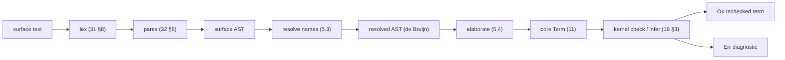

# Elaboration: surface → core

> Status: **DRAFT v0**; **§5 (V0) elaborated** to implementation rigor for the
> G1 minimal slice. Normative for *what elaboration must produce and guarantee*;
> the algorithm is specified to the level WS-L/WS-V need. Contract for **V0**
> (the minimal elaborator, `§5`) and the foundation the whole surface rests on.
> Elaboration turns the surface language (`31`–`38`) into fully-explicit **core
> terms** (`../10-kernel/`). It is **untrusted**: the kernel re-checks
> everything it emits. `§1`–`§4`, `§6` stay frame-level for the full (Phase-3)
> elaborator; `§5.1`–`§5.7` pin V0 to pseudocode.

## 1. Role and the trust split

The elaborator is the largest, cleverest part of the front end —
implicit-argument insertion, unification, type inference, instance resolution,
`match` compilation, sugar expansion — and **none of it is trusted**. Its output
is a core term the kernel `check`s (`../10-kernel/18 §4`). Consequences:

- A bug in the elaborator yields an **ill-typed core term** the kernel
  **rejects**, or a *well-typed but unintended* term (caught by tests/specs) —
  **never** an unsound acceptance. This is why the surface can be rich and
  evolve quickly while the trusted base stays tiny (`../00-overview.md §3`).
- The elaborator MAY use unification, metavariables, heuristics, and search; the
  kernel has none of these (`../10-kernel/18 §3`). The two are deliberately
  asymmetric: cleverness outside, certainty inside.

## 2. What elaboration does

1. **Scope & resolution** — resolve names against the module environment (`33`),
   reject unbound/ambiguous references.
2. **Implicit insertion** — insert implicit arguments `{x:A}` (`32`, `33 §1`) at
   uses, creating metavariables for them.
3. **Type inference & unification** — a bidirectional, **Hindley–Milner +
   dependent** elaboration: propagate expected types inward (checking) and
   synthesize where needed (inference), solving metavariables by **unification**
   up to definitional equality (`../10-kernel/17`). Higher-order cases use
   pattern unification; genuine ambiguity is a reported error, not a guess.
4. **Universe/level inference** — solve level metavariables (`../10-kernel/12
   §4`), emitting explicit levels to the kernel.
5. **Instance resolution** — discharge `where C A` constraints (`33 §5`) by
   instance search, inserting the found class-record (a proof of subobject
   membership). **Canonical & coherent** (`OQ-classes`): for structure classes
   exactly one canonical instance per (class, head-type) is searchable (orphans
   are rejected at declaration, `33 §5`); search is deterministic and
   structurally bounded (`../10-kernel/17 §4`); two viable candidates is a
   surface error naming both, never a silent pick; overlap is not permitted.
   Property (Ω-valued) classes resolve to any instance — all are equal. A
   wanted-but-non-canonical dictionary is supplied by passing a named instance
   value explicitly (not via search).
6. **`match` compilation** — translate `match` (`34 §3`) into nested `elim_D`
   (`../10-kernel/14 §3`) with the recovered **dependent motive**, and run
   **exhaustiveness + reachability** checking (`34 §4`).
7. **Sugar expansion** — telescopes (`../10-kernel/13 §3`), records → Σ (`33
   §2`), `if` → `elim_Bool`, contracts/refinements → the obligation encoding
   (`../20-verification/21 §6`, `22`), `do`/comprehensions (if any) →
   combinators, numeric literals → `fromInteger`/… (`35 §4`), layout → braces
   (`31 §6`); `@ct`-annotated expressions → IFC taint label on the
   interaction-tree perform node (`36 §3`, `../60-security/61 §5a`);
   `temporal{}`/`Temporal` surface notation → `Temporal` inductive data
   (`../70-behavioral/72`); `Wrapping[T]` / `+%` → wrapping-arithmetic
   primitives (`35 §3`).
8. **Obligation emission** — where a refinement/contract is introduced, emit the
   proof obligation (`../20-verification/22`) and leave a hole/`prove` slot.

## 3. What elaboration must guarantee

- **Well-typed output.** Every emitted core term `check`s in the kernel; if it
  cannot produce one, it reports a precise surface error (not a kernel error).
- **No guessing past ambiguity.** Unsolved metavariables or ambiguous instances
  are surface errors with locations, never silently defaulted (except the
  *declared* defaults: numeric literals `35 §4`, level typical-ambiguity `12
  §4`).
- **Faithful sugar.** Desugaring preserves the surface's intended meaning; the
  round-trip (surface → core → behaviour) matches the surface semantics the
  chapters specify.
- **Totality routing.** Recursive definitions are emitted as eliminator
  applications where structural, else as δ-definitions gated by the kernel's SCT
  (`../10-kernel/17 §4`); a totality failure is surfaced from the kernel's
  verdict.
- **Determinism.** Same surface input → same core output (modulo metavariable
  names), so diagnostics and the protocol (`../20-verification/25`) are stable.

## 4. Errors and diagnostics

- **Surface type errors** (unification failure, unbound name, non-exhaustive
  `match`, ambiguous instance) are reported by the elaborator with source spans
  — these are *L1* errors, distinct from *L2* verification failures
  (`../20-verification/24`).
- The elaborator SHOULD recover and continue (report multiple errors, support
  the LSP), but its *accepted* output is always kernel-checked. Partial programs
  with verification holes still elaborate (the holes are obligations, `22`);
  programs with *type* errors do not (they have no well-typed core image).

## 5. V0 — the minimal elaborator (Phase 1)

For the G1 vertical slice, V0 is a **minimal** elaborator: enough surface to
`parse → elaborate → kernel-check` a trivial dependently-typed program — named
functions (`view`), λ, application, local `let`, type ascription, the dependent
function type `(x : A) → B`, the universe `Type`, and a base type or two
referenced by name. The full inference, instances, `match`, sugar, and literals
grow in Phase 3 (WS-L, `§6`). Keeping V0 minimal de-risks the slice: it proves
the *pipeline shape* — surface → core → kernel verdict — before the elaborator's
complexity lands. V0's output is **kernel-re-checked** (the de Bruijn criterion,
`docs/PRINCIPLES.md`), so V0 is **not in the TCB**: a V0 bug yields a rejected
valid program or a poor diagnostic, never an unsound acceptance (`§1`).

This section pins V0 to implementation resolution. The subsections fix the exact
surface subset (`§5.1`), its concrete syntax and AST (`§5.2`), the
correctness-critical name-resolution-to-de-Bruijn pass (`§5.3`), the
bidirectional surface→core elaboration (`§5.4`), the end-to-end pipeline
(`§5.5`), the error taxonomy (`§5.6`), and the level-discipline reconcile
(`§5.7`). Anything not listed here is **out of V0** and owned by a later WP.

### 5.1 The V0 surface subset

V0's parser and elaborator handle **exactly** these forms — and nothing else
from `31`–`38`:

- **Declarations**
  - `view f (x : A) … : B = expr` — a named (possibly dependent) function; the
    binders `(x : A)` are a telescope desugaring to nested λ and Π (`§5.4`).
  - `let x : A = expr` — a top-level value definition.
- **Types** (the type-position grammar)
  - `(x : A) → B` — the dependent function type (Π); the non-dependent arrow
    `A → B` is the special case where `x ∉ B`.
  - `Type` — the universe, with an optional explicit level (`Type`, `Type 0`,
    `Type 1`, …); a bare `Type` gets an inferred level (`§5.7`).
  - a bare `ConId` — a base type referenced by name (e.g. `Nat`, `Bool`).
- **Expressions**
  - `λ x . expr` (ASCII `\ x . expr`) — λ-abstraction; binders are explicit.
  - `expr expr` — application (left-associative).
  - `ident` — a variable reference (resolved in `§5.3`).
  - `( expr : type )` — type ascription (a checking hint, `11 §1`).
  - `let x : A = expr in expr` — a local binding.

**Explicitly out of V0** (each owned elsewhere, do not absorb): `data`/`match`
(`34`, Team Language), `record`/modules (`33`), effects (`36`), FFI (`38`),
numeric and other literals (`35`), implicit arguments `{x : A}` and the
unification that inserts them (`§2.2`–`§2.3`), instance resolution (`§2.5`),
and `match` compilation (`§2.6`). All V0 arguments are **explicit**; V0 performs
**no implicit insertion**.

**Base types.** V0 does not declare inductives. The base types it references
(`Nat`, `Bool`) are assumed **pre-declared** in the kernel environment `Σ` as
opaque constants at `Type 0` (`Nat : Type 0`, `Bool : Type 0`; `11 §4`,
`declare_postulate`, `18 §4`). V0 resolves a `ConId` by name against `Σ` and
emits the corresponding constant `c` (`11 §1`); it never synthesises a base
type's *values* (no literals in V0). The smallest end-to-end program needs no
base type at all:

```
view id (A : Type) (x : A) : A = x
```

parses (`§5.2`) → resolves names to de Bruijn indices (`§5.3`) → elaborates to a
core term (`§5.4`) → is accepted by the kernel's `check`/`infer` (`18 §3`).

### 5.2 The V0 parser (concrete syntax → surface AST)

V0 reads the **brace form** of the grammar; layout (`31 §6`) is OQ-syntax and
out of V0 scope. The token set is the minimal lexer of `31 §8`: the keywords
`view let in Type`, the punctuation `( ) : = .` and the arrow `->`/`→`, the λ
spelling `\`/`λ`, lowercase-initial `ident` (term variables) and
uppercase-initial `ConId` (base types). The concrete grammar is the minimal
EBNF of `32 §8`; reproduced here for the elaborator's view of it:

```
decl   ::= "view" ident binder+ (":" type)? "=" expr
         | "let"  ident (":" type)?         "=" expr
binder ::= "(" ident+ ":" type ")"
type   ::= "(" ident ":" type ")" "->" type    -- dependent Π
         | type "->" type                       -- non-dependent arrow
         | "Type" level?                         -- universe (level optional)
         | ConId                                 -- base type by name
expr   ::= ("\" | "λ") ident+ "." expr          -- lambda
         | expr expr                             -- application (left assoc)
         | "let" ident (":" type)? "=" expr "in" expr
         | "(" expr ":" type ")"                 -- ascription
         | ident                                 -- variable
         | ConId                                 -- base type used as a term
         | "Type" level?                         -- universe used as a term
level  ::= NAT                                   -- 0, 1, 2, …
```

The last two atoms reflect that **types are terms** (`../10-kernel/11 §1`): a
base type (`Nat : Type 0`) and a universe (`Type n : Type (suc n)`) are ordinary
terms and may appear in expression position — e.g. the body of `let x : Type =
Type in x`. `->`/Π appears only in *type* position (after `:` or in a binder),
so a bare function type is not a V0 expression.

`->` is right-associative; application binds tightest; ascription `:` is
loosest (`32 §6`). The parser emits a **surface AST** carrying source spans on
every node (for `§5.6` diagnostics):

```
Decl ::= ViewDecl name (binder list) (Type option) Expr   -- params, result, body
       | LetDecl  name (Type option) Expr

Expr ::= EVar  name span                  -- unresolved: still a name
       | EApp  Expr Expr span
       | ELam  name Expr span               -- single binder (see desugaring below)
       | ELet  name (Type option) Expr Expr span
       | EAsc  Expr Type span
       | ECon  name span                    -- base type used as a term
       | EUniv (level option) span          -- Type / Type n used as a term

Type ::= TPi   name Type Type span          -- (x : A) -> B   (x bound in B)
       | TArr  Type Type span               -- A -> B         (sugar: x ∉ B)
       | TUniv (level option) span          -- Type | Type n
       | TCon  name span                    -- base type ConId
       | TVar  name span                    -- a type-position variable (e.g. A)

binder ::= (name list) Type                 -- (x y z : A)
```

A type-position identifier may be a base type (`TCon`, uppercase) or a bound
type variable (`TVar`, lowercase, e.g. the `A` in `(A : Type) → A`); the case
distinction (`31 §2`) tells them apart at parse time. Names in `EVar`/`TVar`
are still surface names; `§5.3` replaces them with de Bruijn indices.

### 5.3 Name resolution → de Bruijn (the correctness-critical core)

This is the **one** pass where V0 can silently produce a *well-typed-looking but
wrong* core term: a capture or mis-scoping bug yields a term the kernel will
happily check — against the wrong binder. The kernel cannot catch it (it only
sees indices, which would resolve to *something*), so V0 must get it right. The
algorithm is the standard scope-stack walk:

```
resolve(scope, node):                  -- scope: name list, innermost first
  case node of
    EVar(name):
      i := indexOf(scope, name)         -- first (innermost) match, 0-based
      if i = none:  error Unbound(name, node.span)
      return RVar(i, name)              -- keep name for diagnostics only
    ELam(x, body):
      return RLam(x, resolve(push(x, scope), body))   -- single binder
    EApp(f, a):
      return RApp(resolve(scope, f), resolve(scope, a))
    EAsc(e, t):
      return RAsc(resolve(scope, e), resolveTy(scope, t))
    ECon(c):   return RCon(c)             -- base type as a term; resolved in Σ
    EUniv(l):  return RUniv(l)            -- Type / Type n as a term
    ELet(x, tyopt, rhs, body):
      rhs' := resolve(scope, rhs)                 -- x NOT in scope of its own rhs
      body' := resolve(push(x, scope), body)      -- x in scope of the body
      return RLet(x, mapTy(resolveTy(scope), tyopt), rhs', body')

resolveTy(scope, ty):
  case ty of
    TPi(x, A, B):
      A' := resolveTy(scope, A)
      B' := resolveTy(push(x, scope), B)          -- x bound in B (only)
      return RPi(x, A', B')
    TArr(A, B):
      return RArr(resolveTy(scope, A), resolveTy(scope, B))   -- no binder
    TUniv(lvl):  return RUniv(lvl)
    TCon(c):     return RCon(c)                    -- base type, resolved in Σ later
    TVar(name):
      i := indexOf(scope, name)
      if i = none:  error Unbound(name, ty.span)
      return RVarTy(i, name)

indexOf(scope, name):                  -- de Bruijn: distance to nearest binder
  scan scope from the front (innermost); return the 0-based position of the
  first entry equal to name, or none.
```

**Desugaring to single binders.** All multi-binder surface forms are flattened
to nested single-binder forms in a parse pre-pass, *before* resolution, so the
resolved AST (`RLam`, `RPi`) is uniformly single-binder:

- a λ over several names `\x y z . e` → `\x . \y . \z . e`;
- a binder group `(x y z : A)` → three Π/λ binders each of type `A`;
- a `view f (x : A) (y : B) : C = body` → nested λ over the parameter telescope
  with the declared type read as the matching nested Π `(x : A) → (y : B) → C`.

Parameter binders thus enter the scope stack left-to-right (outermost first),
exactly as λ/Π binders do (`§5.4`). The output is a **resolved AST** (`RVar` /
`RVarTy` carry an index; binder sites retain the source name for error messages
only — the index is what elaboration emits).

**Properties this pass must have:**

1. **Shadowing is by stack discipline.** An inner binder of the same name hides
   an outer one because `indexOf` returns the *first* (innermost) match. No
   special shadowing logic is needed or permitted — getting this from the stack
   is what makes it correct.
2. **A binder scopes only where the grammar says.** In `(x : A) → B`, `x` is in
   scope in `B` but **not** in `A`; in `let x : A = e in body`, `x` is in scope
   in `body` but **not** in `e` (no V0 recursion in `let`). The pseudocode
   pushes the binder on exactly the right recursive call.
3. **Unbound is a name-resolution error**, raised *here* with a source span
   (`§5.6`), never deferred to the kernel.

**Worked shadowing case** (the load-bearing guard — AC4 `shadow`):

```
view shadow (A : Type) (x : A) : (A : Type) -> A = \A . x
```

Desugar the params and result; resolving the body `\A . x`, the scope stack at
the occurrence of `x` is (innermost first):

```
[ A_inner ,  x ,  A_outer ]      -- from \A , then the params (x : A)(A : Type)
    0          1        2
```

`indexOf(scope, "x")` skips `A_inner` (name `A` ≠ `x`) and matches at **index
1** — the outer `x` parameter, whose type is the outer `A`. It does **not**
resolve to `A_inner` (the shadowing λ-bound `A : Type`). A bug that resolved `x`
to the inner binder would yield a term that still *type-checks* (with `x : Type`
under the inner `A`), which is exactly the silent corruption the kernel cannot
catch — so this case is a required conformance guard (`§5.6`, AC4), not an
optional one.

### 5.4 Elaboration — surface → core (the algorithm)

Elaboration is **bidirectional** (`§2.3`, `18 §3`): `check` pushes a known type
inward, `infer` synthesises one. It runs on the *resolved* AST (indices, not
names) and emits core terms (`11 §1`). V0's minimal forms keep it small: `infer`
for variables, applications, and ascriptions; `check` for λ and `let`; a single
`infer`-then-convert fallback everywhere else.

```
infer(Γ, e) → (Term, Type):
  case e of
    RVar(i):                                          -- 11 §1 variable
      A := lookup(Γ, i)                               -- type at de Bruijn index i
      return (Var(i), A)
    RApp(f, a):                                       -- 13 §1 Π-Elim
      (f', tf) := infer(Γ, f)
      Pi(x, A, B) := whnf(Γ, tf)  or error NotAFunction(f.span, tf)
      a' := check(Γ, a, A)
      return (App(f', a'), subst(B, a'))              -- B[a'/x]
    RAsc(e, t):                                       -- 11 §1 ascription
      A := elabType(Γ, t)
      e' := check(Γ, e, A)
      return (e', A)                                  -- ascription erased after check
    RUniv(Some n):  return (Univ(n), Univ(suc n))     -- 12 §1 U-Type
    RUniv(None):    u := freshLevelMeta()
                    return (Univ(u), Univ(suc u))     -- 12 §4 (solved in §5.7)
    RCon(c):        return (constOf(Σ, c), typeOf(Σ, c))  -- base type as a term
    RVarTy(i):      return (Var(i), lookup(Γ, i))     -- type-pos var, term pos

check(Γ, e, expected) → Term:
  case (e, whnf(Γ, expected)) of
    (RLam(x, body), Pi(y, A, B)):                     -- 13 §1 Π-Intro
      body' := check(extend(Γ, A), body, B)           -- under x : A; B already binds y≡x
      return Lam(A, body')                            -- core λ carries its domain A
    (RLam(_, _), notPi):
      error LambdaVsNonFunction(e.span, notPi)
    (RLet(x, tyopt, rhs, body), expected):            -- 11 §1 let
      (rhs', A) := case tyopt of
                     Some t -> let A = elabType(Γ, t) in (check(Γ, rhs, A), A)
                     None   -> infer(Γ, rhs)
      body' := check(extend(Γ, A), body, expected)
      return Let(A, rhs', body')                      -- let _ := rhs' : A in body'
    (e, expected):                                    -- 18 §3 mode switch (Conv)
      (e', inferred) := infer(Γ, e)
      if convert(Γ, Type ℓ, expected, inferred):  return e'      -- 17 §3.3
      else  error TypeMismatch(e.span, expected, inferred)
        -- convert compares the two *types* at their common universe Type ℓ,
        -- exactly as the kernel's (Conv) mode switch does (18 §3).

elabType(Γ, t) → Term:                                -- type-position elaboration
  case t of
    RPi(x, A, B):                                     -- 13 §1 Π-Form
      A' := elabType(Γ, A)
      B' := elabType(extend(Γ, A'), B)
      return Pi(A', B')                               -- (x : A') → B'
    RArr(A, B):
      A' := elabType(Γ, A)
      B' := elabType(Γ, B)                            -- same Γ: source has no binder
      return Pi(A', weaken(B'))                       -- lift past the unused Π binder
    RUniv(Some n):  return Univ(n)                    -- Type n      (12 §1)
    RUniv(None):    return Univ(freshLevelMeta())     -- bare Type   (12 §4, §5.7)
    RCon(c):        return constOf(Σ, c)              -- base type by name (11 §4)
    RVarTy(i):      return Var(i)                     -- a type-position bound variable
```

Notes tying each clause to the kernel:

- **`Lam` carries its domain.** The core λ is `λ (x : A). t` (`11 §1`,
  `13 §1` Π-Intro); V0 takes the domain `A` from the *expected* Π, so the
  emitted λ and the Π agree by construction — there is no separate annotation to
  drift. This is why λ is a **`check`** form, never `infer` (an unannotated λ
  has no inferable domain in V0).
- **Application is `infer`.** The head's type is whnf-reduced (`17 §3.2`) to
  expose a Π; the argument is `check`ed against the domain; the result type is
  the codomain with the argument substituted, `B[a'/x]` (`13 §1` Π-Elim). V0
  never guesses the head type.
- **The mode switch is the only conversion call.** Every non-canonical `check`
  falls to `infer`-then-`convert` (`18 §3`), the algorithmic (Conv) rule. V0
  surfaces a `convert = false` as a `TypeMismatch` with the *surface* span
  (`§5.6`); it does **not** insert a `cast` (V0 has no `Eq` proofs to cast
  along — casts are a Phase-3/observational concern, `16`). Because the K1
  kernel's `convert` is total and decidable (`18 §3`, `17 §5`), the switch
  always returns a definite yes/no.
- **No unification across terms.** V0's only metavariables are **level** metas
  (`§5.7`); term-level inference is the explicit bidirectional walk above. This
  keeps V0 far simpler than the full elaborator (`§2.3`), which is licensed
  because V0's surface is explicit-enough that nothing else needs solving.

The emitted core term is **fully explicit**: de Bruijn indices, explicit domains
on every λ and Π, and explicit levels on every `Univ` (`§5.7`). It contains no
metavariables — V0 solves all level metas before emission — so the kernel
receives exactly the language of `11 §1`.

### 5.5 The pipeline

V0 is a straight-line pipeline from source text to a kernel verdict; the kernel
is the sole judge and is never bypassed.



Each stage can fail and is the origin of one error class (`§5.6`): the lexer and
parser raise **parse errors**; resolution raises **unbound-name errors**;
elaboration raises **lambda-vs-non-function** and surfaces the kernel's
**type-mismatch**. The accepted output is **always** a core term that the
kernel's `infer`/`check` (`18 §3`) has re-derived a type for — V0 emits the
term and reports the kernel's verdict; it has no acceptance path of its own.

### 5.6 Errors

V0 produces three error classes, each tagged with a source span and attributed
to the stage that raised it (`§4` — these are L1 surface errors, distinct from
L2 verification failures):

- **Parse error** — from the lexer/parser (`31 §8`/`32 §8`), with the span of
  the offending token or region.
- **Unbound name** — from name resolution (`§5.3`), naming the unresolved
  identifier with its span. Raised *here*, never deferred to the kernel (an
  unbound name has no de Bruijn index to emit).
- **Type mismatch** — from the kernel's `convert`/`infer` failing on the emitted
  core term (`18 §3`, `17 §3.3`), re-surfaced at the originating *surface* span
  with the expected and inferred types. Includes `NotAFunction` (a non-Π head in
  application) and `LambdaVsNonFunction` (a λ checked against a non-Π), which V0
  detects structurally before the kernel call.

V0 SHOULD recover and report multiple errors where it can (parse and
name-resolution errors compose across independent declarations; the LSP wants
this, `§4`), but its **accepted** output is always kernel-checked — a program
with a type error has no well-typed core image and is rejected, never partially
admitted (`§3`).

### 5.7 Level-discipline reconcile

Per the standing directive, every formation rule in `§5.4` that produces or
manipulates a universe level is given its **explicit** level computation and
reconciled against `10-kernel/12-universes.md` — citing the section, not merely
deferring to it.

- **Universe (`elabType` `RUniv`).** `Type n` elaborates to `Univ(n)`, and the
  kernel types it by `Univ(n) : Univ(suc n)` — the **(U-Type)** rule, `12 §1`.
  There is **no** `Type n : Type n` and no `Type : Type` (Girard's paradox,
  `12 §1`); V0 emits a concrete `n`, so the kernel checks the literal rule. A
  **bare** `Type` elaborates to `Univ(?u)` for a fresh level metavariable `?u`
  (`§5.4`); `?u` is solved during elaboration (below) and the emitted core has
  an explicit level — the kernel **never** receives a level metavariable
  (`12 §4`).

- **Dependent function type (`elabType` `RPi`/`RArr`).** `(x : A) → B`
  elaborates to `Pi(A', B')`; the kernel types it by the predicative
  **(Π-Form)** rule, `13 §1` / `12 §2`:

  ```
    Γ ⊢ A' : Type ℓ₁     Γ, x : A' ⊢ B' : Type ℓ₂
    ──────────────────────────────────────────────
    Γ ⊢ (x : A') → B' : Type (max ℓ₁ ℓ₂)
  ```

  The function type takes the **`max`** of domain and codomain levels and does
  **not** drop to a lower universe (predicativity, `12 §2`) — V0 stores no level
  on the `Pi` node (it is derived by the kernel), so there is nothing for V0 to
  get wrong here *except* not inventing a level: V0 emits `Pi(A', B')` and lets
  (Π-Form) compute `max`. For the trivial `id`, `(A : Type 0) → (x : A) → A` has
  level `max(suc 0, max 0 0) = 1` by (Π-Form) over the two nested Πs — `Type`
  itself sits at `Type 1`, its element `A` at `Type 0`.

- **Non-cumulative (`OQ-2`, `12 §3`).** `A : Type ℓ` does **not** give
  `A : Type (suc ℓ)`; lifting is **explicit**. V0 inserts **no** implicit lifts
  and has no subtyping — a "universe too low" mismatch is surfaced as a
  `TypeMismatch` (`§5.6`), not silently coerced. (Cumulative ergonomics are a
  later untrusted-elaborator concern, `12 §3`; V0 does not pay that cost and the
  kernel never sees a subtyping query.)

- **Level metavariable solving.** V0's only metavariables are levels. Solving is
  a semilattice unification over `ℓ ::= 0 | suc ℓ | max ℓ ℓ | ?u` (`12 §1`):
  constraints arise where two universes must agree (e.g. an ascription forcing
  two `Type`s equal). An **unconstrained** `?u` is defaulted to `0` — *typical
  ambiguity*, the one declared level default (`12 §4`, `§3`). After solving, V0
  emits the explicit level; the kernel re-checks each level equality as an
  ordinary decidable level conversion (`12 §1`, `17 §3.6`) at every use, so a
  wrong solve is caught by the kernel, not trusted. Level abstraction is only at
  top-level declarations (`12 §4`); V0 emits explicit level arguments on any
  polymorphic-constant use and never makes a level a first-class term.

- **Decidable level equality.** Level comparison during the mode switch and at
  every `Univ` is the kernel's `convLevel` (`17 §3.6`) over the semilattice laws
  (`max` associative/commutative/idempotent, `max ℓ 0 = ℓ`, `suc (max ℓ₁ ℓ₂) =
  max (suc ℓ₁) (suc ℓ₂)`, `12 §1`). It is total and decidable, so the level
  side of conversion never stalls — consistent with the K1 kernel contract
  (`18 §3`).

This reconcile confirms V0's level computations are exactly those of `12`:
universes step by `suc`, function types take the predicative `max`, lifting is
never implicit, unconstrained levels default to `0`, and every level reaching
the kernel is explicit and decidably checked.

## 6. What WS-L/WS-V must deliver here (V0, then L-stream)

The elaborator: scope resolution, implicit insertion, bidirectional HM+dependent
inference with unification up to conversion, level inference, instance
resolution, `match`→`elim_D` with exhaustiveness, full sugar expansion, and
obligation emission — all producing kernel-checked core, with stable surface
diagnostics. **V0** delivers the minimal slice (G1); the rest grows with the
surface. Conformance: `../../conformance/surface/elaboration/` —
well-typed-output invariant (every accepted program's core image checks),
ambiguity-is-an-error cases, and `match`-exhaustiveness compilation.
