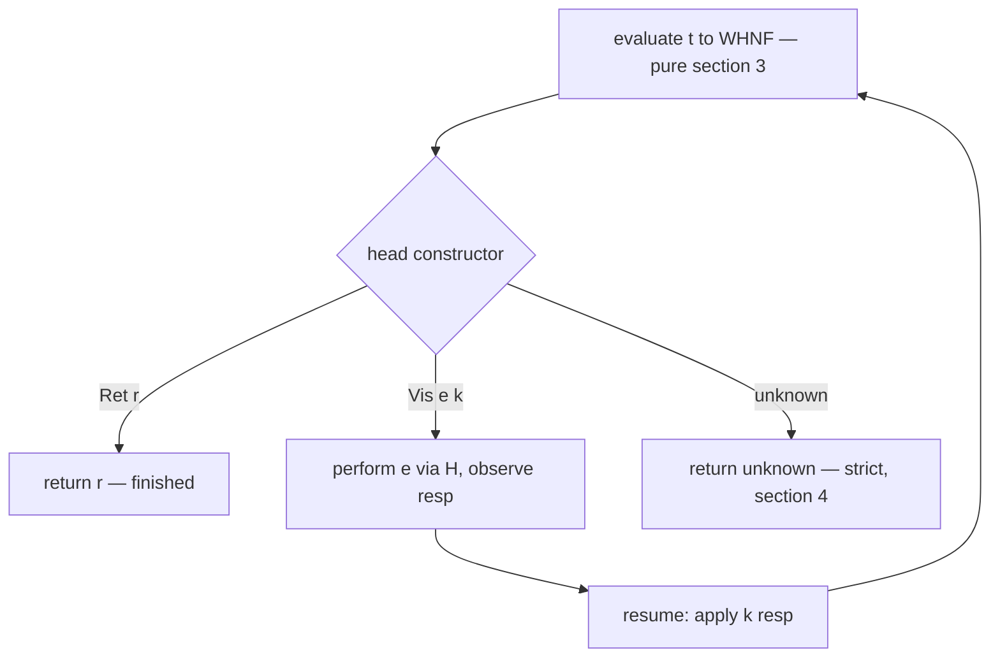

# Operational semantics (the reference interpreter)

> Status: **X1 elaborated** — implementation-ready for Team Runtime, **pure-core
> G1 scope**. Normative for *what evaluation computes* and its role as the
> reference; the interpreter's internal strategy is implementation latitude so
> long as it realizes these results. Contract for WS-X **X1**: the **pure core**
> (§1–§5, §7) plus **effect evaluation** (§6): the interaction-tree driver that
> runs an effectful program's denotation, now that L5's `ITree` is admitted at
> **K1.5** (`f037451`, `36 §7.0`). The pure fragment and the effect driver
> together are the reference semantics; effects ride `36`'s `ITree`, the kernel
> stays effect-free.

The interpreter defines **the meaning of a Ken program**. It evaluates **core
terms** (`../10-kernel/11`) — the elaborator's output — to **values** (`41`).
Everything downstream (a native backend, X3) is judged correct by agreement with
it (`../00-overview.md §3`).

## 1. Relationship to the kernel's reduction

Evaluation realizes the **same reductions** the kernel uses for conversion
(`../10-kernel/17 §1`). The interpreter and the kernel are the same reduction
system run for two different purposes — the kernel reduces lazily to *weak-head*
normal form to *decide conversion* (NbE, `17 §3`); the interpreter reduces to
**full values** to *run the program*. They **MUST agree on results**: the
interpreter is "the kernel's evaluator, run to completion, to full values, with
sharing."

The reduction set realized (`17 §1`, the normative source — verify each against
the *landed* kernel, not a paraphrase):

| Rule | Redex → reduct | Source |
|---|---|---|
| **β** | `(λ(x:A).t) u → t[u/x]` | `13 §1` |
| **Σ-β** | `(a,b).1 → a`, `(a,b).2 → b` | `13 §2` |
| **ι** | `elim_D M m̄ ī (cₖ ā) → mₖ ā [IH…]` (structural) | `14 §3`, `14 §7.3` |
| **δ** | `c → t` for `(c : A := t) ∈ Σ` | `11 §4` |
| **prim** | `op lit̄ → lit` (audited primitive reduction) | `14 §5` |
| **obs** | `cast A A refl a → a`; `cast`/`Eq`-by-type; quotient/trunc elim | `16 §2.2`, `16 §3.2`, `16 §5`, `16 §6` |

A term with **no applicable head reduction** is **neutral** (a variable, an
opaque constant, a primitive on non-literals, an `elim`/`cast`/quotient-elim on
a neutral target — `17 §1`). For the **closed, ground** programs X1 runs,
canonicity (§3.6) guarantees evaluation does not get stuck on a neutral: the
only non-value residues are **`unknown`** (an open hole, §4) and, for an opt-in
opaque non-total definition, **divergence** (§3.3, `43 §2, case 4`). The
interpreter computes values; the kernel's **η** (`17 §2`, type-directed) and **Ω
proof-irrelevance** are *conversion-time* equalities, not evaluation steps
(§3.5) — agreement on functions is therefore "up to the kernel's η at compare
time" (§3.5).

## 2. Evaluation order (`OQ-eval-order` DECIDED)

**Totality makes evaluation order meaning-preserving.** Because every Ken
program terminates (SCT, `../10-kernel/17 §4`), there is no ⊥/divergence to
distinguish strict from lazy in the total core — both compute the *same value*.
So evaluation order is a purely **operational** choice (space, time,
legibility), **not** semantics — unlike a partial language, where laziness is
observable. That frees the choice to favor predictability.

**Decision (operator, 2026-06-27): call-by-value (strict) with sharing, strict
by default, lazy only where required or annotated.**

- **Strict CBV is the default** — application arguments, `let` bindings,
  constructor arguments, and pair components are evaluated **eagerly,
  left-to-right**; results are shared via the content-addressed heap (`41`), so
  equal subcomputations are deduplicated (CBV's predictability + the store's
  space efficiency, no recomputation). Chosen because, the choice being
  meaning-preserving, strict is the most **legible and predictable**: a cost
  model you can reason about, an order that matches how the code reads, and no
  thunk/space-leak footguns. **Predictability is also a precondition for the
  time/space reasoning security depends on** — the `@ct` timing discipline
  (`../60-security/61 §5a`) and worst-case bounds need a non-data-dependent
  "when"; lazy-by-default would undermine them.
- **Laziness where semantically required — the eliminator's branches.** The
  **one** non-strict position is an **eliminator's methods**: `elim_D M m̄ ī s`
  forces the **scrutinee** `s` (CBV), then evaluates **only** the method `mₖ`
  selected by `s`'s head constructor (§3.3); the other methods are **never
  evaluated**. Since `if`/`match`/`&&`/`||` all elaborate to `elim_D` (`14 §3`,
  `../30-surface/34-data-match.md`), this is exactly "evaluate only the taken
  arm" and short-circuit — it falls out of ι firing a single method, not a
  special rule. (An `elim` whose methods were evaluated strictly *before*
  selection would force every branch — the interpreter MUST hold methods
  unevaluated and force the selected one. This is the AC3 property, §3.6.)
- **Laziness by explicit annotation** — an opt-in **`Lazy a`** (thunk) type
  defers an expensive, possibly-unused computation, **forced** on demand and
  memoized (call-by-need *locally*). Laziness is **visible in the type**, never
  a pervasive default. Wire the force/memo primitive only if `41`/this chapter
  pins it; for G1 the force/memo primitive may be deferred (`X1-interpreter`
  frame), tracked separately from effect evaluation (§6).
- **Distinct from the kernel's conversion (`OQ-eval-strategy`).** The kernel
  decides definitional equality by **lazy WHNF** (`§1`, `17`); the *runtime*
  executes **CBV-with-sharing**. Different layers, allowed to differ — as Lean's
  kernel reduces lazily for defeq while compiled code runs strictly. The two
  need only agree on final values (`§1`).

## 3. The evaluation algorithm

The interpreter is **environment-based**: a closure captures an environment
rather than textually substituting (the declarative β of `§1` is `t[u/x]`; the
implementation realizes it by binding `x` in the environment — equivalent by the
standard environment/substitution correspondence, and the binding is what makes
the argument **shared**, evaluated once). The strategy below is normative for
*results*; an implementation may use any internal representation that realizes
them (`§5`).

### 3.1 Values and environments

A **value** `v` (the inhabitants of `41`'s model):

```
v ::= n                          -- scalar immediate: Int word, Bool, Char, Float, Decimal (41 §1)
    | cₖ v̄                        -- constructor application, saturated (data) — interned (41 §2)
    | (v₁ , v₂)                   -- pair (Σ); a record is a right-nested pair (13 §3) — interned
    | ⟨ λ(x:A).t ; ρ ⟩            -- closure: code + captured env — interned by (code_id, ρ) (41 §3a)
    | Type ℓ | (x:A)→B | (x:A)×B  -- type values (types ARE values; canonical type formers)
    | str | bytes | array | map | set   -- collection values (heap, 41 §2)
    | unknown                     -- the open-hole residue (41 §6, §4)
    | ⟨neutral⟩                   -- a stuck head + value spine; closed ground pure terms never reach this (§3.6)
```

An **environment** `ρ` maps de Bruijn indices to values (`ρ(i)`), a persistent
vector extended on each binder. `eval : Env → Term → Value`, `apply : Value →
Value → Value`. Every **compound** value (`cₖ v̄`, pair, closure, collection,
bignum) is **interned** on construction via the `41 §3b` algorithm, yielding a
slot id; equal content ⇒ same slot ⇒ dedup (§3.4).

### 3.2 `eval` / `apply`

```
eval ρ (Var i)          = ρ(i)                                      -- lookup (already a value)
eval ρ (Const c)        = eval ρ∅ (body c)            -- δ: c has a body (transparent OR opaque); bodyless c → prim/postulate (§3.3)
eval ρ (λ(x:A).t)       = ⟨ λ(x:A).t ; ρ ⟩            -- closure; NO reduction under the binder (WHNF, §3.5)
eval ρ (App f u)        = apply (eval ρ f) (eval ρ u)              -- CBV: force operator, then argument
eval ρ (cₖ ā)           = intern (cₖ (map (eval ρ) ā))            -- strict constructor args
eval ρ (a , b)          = intern (eval ρ a , eval ρ b)            -- strict pair
eval ρ (p.1)            = fst (eval ρ p)             ;   eval ρ (p.2) = snd (eval ρ p)   -- Σ-β
eval ρ (let x = e₁ in e₂) = eval (ρ , eval ρ e₁) e₂              -- strict let; e₁ forced once, shared
eval ρ (Type ℓ)         = Type ℓ                                   -- type value, level carried verbatim (12 §4)
eval ρ ((x:A)→B)        = (x : eval ρ A) → ⟨B ; ρ⟩  ;  eval ρ ((x:A)×B) = (x : eval ρ A) × ⟨B ; ρ⟩
eval ρ (prim op ā)      = primReduce op (map (eval ρ) ā)          -- prim on values (14 §5)
eval ρ (cast A B e a)   = castReduce (eval ρ A)(eval ρ B)(eval ρ e)(eval ρ a)   -- §3.3 obs
eval ρ (Eq A a b)       = eqReduce (eval ρ A)(eval ρ a)(eval ρ b)               -- §3.3 obs
eval ρ (elim_D M m̄ ī s) = elimReduce ρ D M m̄ ī (eval ρ s)        -- ι; methods m̄ held UNEVALUATED (§2)
eval ρ (hole h)         = unknown                                  -- open verification hole (§4)

apply ⟨ λ(x:A).t ; ρ' ⟩ u = eval (ρ' , u) t                       -- β by env extension (= t[u/x])
apply ⟨neutral n⟩       u = ⟨neutral (n · u)⟩                      -- stuck (open terms only)
apply unknown           u = unknown                                -- strict (§4)
```

### 3.3 Per-form reduction (reconciled with `17 §1`)

- **β (`apply`).** A closure applied to a (forced) argument extends the captured
  env and evaluates the body — `eval (ρ',u) t`, equal to `t[u/x]`. The argument
  `u` is evaluated **once** (CBV) and bound, so all uses of `x` share it.
- **ι (`elimReduce`).** Force the scrutinee `s` to a value, then dispatch on its
  head:
  - `s = cₖ ā` → fire ι: evaluate **only** method `mₖ`, applied to the
    constructor arguments `ā` and, for each **recursive** argument `a_j`, the
    induction hypothesis `elimReduce ρ D M m̄ idx(a_j) a_j` (`14 §7.3`).
    Recursion is on the structurally smaller `a_j`, so it terminates (`14 §3`).
    The other methods `m_{j≠k}` are **discarded unevaluated** — this is branch
    laziness (§2).
  - `s = unknown` → `unknown` (§4). `s = ⟨neutral⟩` (open only) → a neutral
    `elim`.
- **δ.** A constant unfolds to its body (`Const c → body c`, evaluated in the
  empty env — top-level definitions are closed). **Opacity is a conversion-time
  property, not a runtime one:** an opaque (SCT-rejected) definition never
  δ-reduces *in the kernel's conversion* (`17 §4`), but the interpreter unfolds
  it to **run** the program; an opaque **non-total** definition is therefore the
  one place a pure program may **diverge** at runtime (`43 §2, case 4`) — a
  marked, listed escape hatch, not a default. Every transparent (total)
  definition runs to a value. A **bodyless** constant does **not** δ: a
  **primitive** reduces by **prim** (below), an unproven **postulate/hole**
  yields **`unknown`** (§4, `18 §5`), and a `foreign` is performed at the effect
  boundary (§6).
- **prim.** `primReduce op v̄`: on literal values, the audited reduction yields a
  literal (`add 2 3 → 5`, `14 §5`); on an `unknown` operand, `unknown` (strict,
  §4); on a neutral operand (open), neutral. A **partial** primitive (division
  by zero, non-wrapping overflow, out-of-bounds index, `43 §2, case 2`) at an
  unguarded use faults or yields `unknown` — the *obligation* to avoid it is
  generated statically (`../20-verification/22`), so it is a visible concern,
  never a silent trap.
- **obs (observational, `16`).** Realize the kernel's observational computation:
  - `castReduce A A refl a → a` — **regularity** (`16 §3.2`, C5).
  - `castReduce A B e a` with `A`, `B` canonical of the **same head** → the
    structural `cast`-by-type push (`16 §3.2`, C6): closed canonical type
    equalities **compute**. Heads differ or either neutral → neutral (open).
  - `eqReduce` realizes `Eq`-by-type (`16 §2.2`): at Π → pointwise (funext, C2);
    at Ω → mutual implication (propext, C3); at an inductive → same constructor:
    conjunction of field equalities, different constructors: `Bottom` (C4). `Eq`
    lands in **Ω** (a proposition); its proofs are **proof-irrelevant** (`16
    §1.2`), so the value layer does not compute proof *terms* — it reduces `Eq`
    **as a type** where a type value is demanded.
  - **quotient elim** `elim_/ M f r [a] → f a` (`16 §5`, C9); **truncation
    elim** `elim_trunc P f |a| → f a` (`16 §6`, C10).
  - **`(oracle)`** — the `cast Type Type` reduction on non-`refl` equalities and
    certain quotient-transport edge cases are tagged `(oracle)` in `16 §9.1`
    (validated against observed behaviour at build time). The interpreter
    realizes whatever `16` settles; X1 inherits the tag and does **not** lock an
    unground value here. *(The AGPLv3 prototype is not mounted; ground these
    from `16` + the conformance oracle at build time, never from prototype
    source.)*

### 3.4 Sharing and dedup (where the heap is consulted)

Two distinct sharings, both via the content-addressed heap (`41`):

- **Evaluation sharing** — a `let`/argument value is computed **once** and bound
  in the env (§3.2); every use reads the bound value. No recomputation (CBV +
  binding).
- **Representation sharing (dedup)** — every compound value is **interned** at
  construction (`41 §3b`): equal canonical content ⇒ the **same slot id** ⇒
  stored once. Two subcomputations that produce structurally-equal results
  resolve to the **same heap entry**.

Consequently **structural equality is O(1)** — a slot-id comparison (`41 §4`),
not a deep traversal (the traversal happened once, at intern time). The
conformance corpus asserts **dedup** (equal subcomputations share a slot), not
merely value-equality (§3.7, AC2) — a recompute-without-dedup bug yields an
equal value at a *different* slot, which the slot assertion catches.

### 3.5 WHNF vs full value (the boundary)

The interpreter forces every step to weak-head form and, by CBV, forces
arguments fully — so the **boundary** is:

- **Data → full normal form.** A closed, ground value of an inductive/record
  type is a constructor (or pair) applied to **fully-evaluated** argument
  values, recursively all the way down. This is the "run to completion, to full
  values" of `§1`.
- **Functions → WHNF (a closure).** Evaluation does **not** reduce under a λ — a
  function value is `⟨λ(x:A).t ; ρ⟩`, its body unevaluated until applied. The
  interpreter does **not** η-expand or normalize function bodies.

**Agreement with the kernel (`§1`).** On closed ground **data** the
interpreter's full value and the kernel's WHNF-plus-congruence coincide (same
constructor normal form). On **functions** the interpreter stops at a closure
while the kernel applies **η** (`17 §2`) and **Ω proof-irrelevance** at
*conversion* time; so "the interpreter's value equals the kernel's reduct" holds
**up to the kernel's η / proof-irrelevance** — the interpreter need not
implement η (it produces values; the kernel compares them). The level discipline
is likewise **carried, not recomputed**: `Type ℓ` and the type formers evaluate
to themselves with the kernel's **explicit** level `ℓ` unchanged (`12 §4`);
evaluation forms no new types and so introduces **no** new level computation to
reconcile against `12`.

### 3.6 Canonicity (testable)

**Canonicity.** A **closed, well-typed, ground** term evaluates to a **value**,
never a stuck neutral:

- of an **inductive** type → a **constructor form** `cₖ v̄`;
- `cast A A refl a` → `a` (C5); a closed canonical type equality → `cast`
  **computes** (C6);
- a **quotient** `elim_/ M f r [a]` → `f a` (C9); truncation likewise (C10);
- `Eq`-by-type on closed canonical types → its computed proposition (C2–C4),
  proof-irrelevant at the value layer.

The kernel's **confluence** (`17 §1`) + **totality** (`43 §1`) make this value
**unique**. The **only** marked non-value outcomes are `unknown` (an open hole,
§4) and the divergence of an opt-in **opaque non-total** definition (§3.3, `43
§2.4`) — both *listed*, never silent. **Branch laziness (AC3)** is the
structural face of canonicity here: an untaken eliminator method is never
evaluated, so a branch that *would* produce `unknown` or diverge does **not**
contaminate a result selected away from it (§2) — asserted structurally, since
the pure fragment is otherwise total.

### 3.7 Determinism (testable)

**Determinism.** Evaluation of a closed term is a **function** — same term →
**same value**, and (for compounds) the **same slot id**. It holds because
reduction is confluent (`17 §1`) and CBV fixes the order; totality makes any
order yield the same value (§2), and interning makes the representative
canonical (§3.4). Determinism is what makes the interpreter a usable **oracle**
(§5). The discriminating conformance case (AC2) must **flip**: a correct
**shared** evaluation (equal subterms → one slot) versus a recompute-divergence
(equal value at two slots) — assert the slot identity, not just value equality,
or the case passes vacuously.

## 4. `unknown` propagation

Evaluating a term that depends on an **open verification hole** (`41 §6`,
`../20-verification/24 §2`) yields **`unknown`** — the operational face of
partial verification: the program runs, and `unknown` marks exactly where an
unproven property bears on a result. A **hole-free** program **never** yields
`unknown` (it has no holes — `43 §2, case 1`).

**Propagation (the Kleene/Heyting rules, `41 §6`).** `unknown` is the third
truth value and the "result not determined" marker:

```
strict elimination on unknown → unknown:
  apply unknown u        = unknown
  elimReduce … unknown   = unknown        -- a scrutinee that is unknown
  primReduce op (… unknown …) = unknown   -- any strict primitive with an unknown operand
  cast/Eq on unknown     = unknown
  (a , unknown).2        = unknown ;  fst/snd of unknown = unknown

absorbing connectives (do NOT force the other operand past the absorber):
  unknown ∧ false = false        false ∧ unknown = false
  unknown ∨ true  = true         true  ∨ unknown = true
  unknown ∧ true  = unknown      unknown ∨ false = unknown      ¬ unknown = unknown
```

The connectives are the eliminator-branch rule (§2) in disguise: `∧`/`∨` are
`if` on `Bool`, so an `unknown` **scrutinee** propagates, but an `unknown` in an
**untaken** arm is discarded (the absorbing cases `∧false`/`∨true` are decided
by the *other*, known operand without forcing the `unknown` one). The
discriminating test (AC4) flips on **hole-present → `unknown`** vs **hole-absent
→ a definite value**.

## 5. The interpreter as oracle (and the REPL)

- **Differential oracle.** The native backend (X3) is validated by running a
  differential corpus through both and requiring **identical values** (`44`/X4).
  The interpreter is the reference; on any disagreement, the interpreter is
  **right by definition** — so a bug here is a wrong *answer* silently
  propagated to every backend, which is why X1 is ★★ (correctness by **agreement
  with the kernel's reductions**, §1, and the canonicity/determinism corpus, not
  a separate trust argument; X1 is **not** in the TCB for type soundness — it
  runs already-kernel-checked terms).
- **REPL.** The interpreter makes an interactive **REPL** natural (strategy T2):
  evaluate expressions, run `prove`/`assume` (`../20-verification/21 §3`),
  inspect values — the "Little Prover" loop. Incremental re-checking is the only
  non-trivial REPL piece (`../30-surface/39`).

## 6. Effect evaluation (running the interaction tree)

Effectful evaluation is **two pieces, one of them already built.** (1) The
denotation `e : ITree ρ R` (`../30-surface/36 §2.4`) is an ordinary **pure**
core term, so §3 **already evaluates it** — `Ret`/`Vis` are constructors (§3.1)
and `bind`/`handle`/`runState` are `elim_ITree` folds that ι-reduce (§3.3). (2)
The **effect driver** forces the resulting `Vis`-tree against the runtime's
real-world handlers, performing each world-interaction and resuming with the
response. The agreement with L5 is therefore **definitional, not parallel**: X1
runs the *very term* L5 denotes — there is no second effect semantics to
reconcile, only the pure tree, evaluated, with the world's responses substituted
at the `Vis` nodes. (L5's `ITree` is admitted as of **K1.5**, `f037451`, `36
§7.0` — the dependency that gated this section is in.)

### 6.1 The denotation evaluates to a tree (pure, §3 unchanged)

`e` is closed and well-typed of type `ITree ρ R`, so by **canonicity**
(§3.6) §3 evaluates it to a head constructor (§3.5):

- `Ret r` — the computation finished purely; `r` is the result value.
- `Vis e k` — the next operation `e : ρ.Op` is forced to a value (CBV
  constructor argument, §3.2); the continuation `k : ρ.Resp e → ITree ρ R`
  is a **closure** (a function value at WHNF — not reduced under its binder,
  §3.5). The response is **not yet known**, which is exactly why `k` is a
  function *into* the tree (`36 §2.1`).

Two classes of effect are discharged **here, purely**, with no world
interaction, because their handler is itself an `elim_ITree` fold (`36 §5`):

- a **`space`** operation: `runState s₀ body` (`36 §4.2`) threads the state
  through the tree and reduces to `(r, s_final) : R × S` (§3.3 ι). A program
  whose only effect is its `space` runs **entirely in pure §3** — no driver. The
  runtime *may* realize the fold with a real identity-bearing mutable cell (not
  content-addressed, `41 §2`) as an operational strategy (the §3 latitude),
  provided the result agrees with `runState`.
- any **user handler** `handle ret ops` (`36 §5.1`) that discharges an effect
  `E` into another tree.

So the **open row** `ρ_open` (`36 §2.5`) — the I/O effects with no enclosing
pure handler (`FS`/`Net`/`Clock`/`Console`/`Rand`) — survives as `Vis` nodes the
driver must perform. A fully pure program (`ρ = ∅`) denotes to `ITree 𝟘 R ≅ R`
(`36 §2.4`) and never reaches the driver at all — purity stays free (§3).

### 6.2 The effect driver (the real-world handler, `36 §7.2`)

The driver is the **real-world handler** the `36 §7.2` hook names: the same
`Vis`-forcing shape as a pure handler, but its action **performs an actual world
interaction** in the evaluator instead of returning a pure tree. X1 is
**parametric** in this handler `H` — L7 supplies the production `H` (real
syscalls, `../30-surface/38-ffi-io.md`); the conformance corpus supplies a
**deterministic** `H` (a mock world) so a trace is reproducible. `H` is the
**only** place X1 leaves the pure fragment.

```
-- H performs one open-row operation and observes its response (the world step).
-- Supplied by L7 (production) or conformance (deterministic mock); the §7.2 hook.
H : (e : ρ_open.Op) → ρ_open.Resp e        -- the IMPURE world boundary

-- The driver: evaluate to a Vis, perform it, resume with the response, loop.
drive_H : ITree ρ_open R → R
drive_H t = case whnf t of                 -- whnf = pure §3 eval to head ctor (§3.5)
  Ret r    → r                             -- finished
  Vis e k  → drive_H (apply k (H e))       -- perform+observe (H e), resume (apply, §3.2), loop
  unknown  → unknown                       -- §4: an open hole in the tree is strict
```

- **perform → observe → resume.** `H e` performs `e`'s world-interaction and
  observes the response `resp : ρ_open.Resp e`; `apply k resp` (β, §3.2)
  **resumes** the computation with that response, producing the next sub-tree;
  the loop re-evaluates it. This interleaving of **pure reduction** (`whnf`) and
  **world interaction** (`H`) is the whole of effect evaluation.
- **Tail-recursive *because* tail-resumptive.** `OQ-9`'s single-shot,
  tail-position resumption (`36 §5.2`) is exactly what lets `drive_H` be a
  **loop**: `k` is applied **once**, in tail position, so no continuation is
  reified and no stack of suspended resumptions is needed. A multi-shot handler
  would break the loop — excluded by `36 §5.2`, and this is the operational
  reason it is.



### 6.3 Per-effect operational rules

The **rule** is uniform — `drive_H` forces a `Vis`, `H` performs the op and
observes its response, `apply` resumes — and **per effect class the only
difference is which world-interaction `H` performs and the response it
observes** (`36 §2.1`'s `Op`/`Resp`). Schematically:

| Effect | Operation (`Op`) | Performs / observes | Response (`Resp`) |
|---|---|---|---|
| `Console` | `Write s` | write `s` to the console | `Unit` |
| `Clock` | read-clock | read the wall clock | `Instant` |
| `FS` | read / write `p` | read / write file `p` | `Bytes` / `Unit` |
| `Net` | send / recv | send / receive on a socket | `Unit` / `Bytes` |
| `Rand` | draw | draw from the entropy source | the drawn value |

The op-tag column is **illustrative**: the `Op`/`Resp` signatures per class are
`38`/stdlib's to fix, and are tagged `(oracle)` here — §6 fixes the
**operational contract** (perform→observe→resume, uniform), the binding to
concrete syscalls + signatures is L7's (`36 §7.2`). The dispatch is **exhaustive
over `ρ_open`** — a rule for **every** op-tag the open row admits (§6.5), with
**no** catch-all `_ → skip` (the two-soundnesses point, §6.5).

### 6.4 Effect sequencing and ordering

Effects are performed in **exactly the order their `Vis` nodes appear along the
tree's spine**, and that spine is fixed by `bind`'s grafting (`36 §2.2`): `bind
(Vis e f) k = Vis e (λ r. bind (f r) k)` puts the left computation's first
effect at the head and its continuation (then `k`'s effects) underneath. So:

- **CBV fixes the build order.** `let x = e1 in e2 = bind e1 (λx. e2)`
  (`36 §2.4`); evaluating it (§3, strict left-to-right) puts every `Vis` of `e1`
  ahead of every `Vis` of `e2` on the spine. The driver consumes the spine
  **linearly**, so `e1`'s effects are performed, in order, before `e2`'s.
- **Single tail resumption fixes run order.** Because `k` is resumed once, in
  tail position (§6.2), the driver never interleaves or reorders — the performed
  order **is** the spine order. This realizes `36`'s sequencing discipline.
- **Discriminating (the trace).** The observable result of an effectful program
  is its **interaction trace** — the sequence of `Vis` op-tags performed and the
  `Ret` leaf. A **reordered**/**dropped** interaction is a **different trace**
  (a different tree), so the case **flips**: the correct order is one trace, any
  reordering or omission is a distinct, detectable one.

### 6.5 Row-bounding at evaluation (normative property)

**Every `Vis` op-tag the driver can encounter lies in the declared row.** The
escape check (`36 §1.4`) rejects, *at elaboration*, any function whose inferred
row exceeds its declaration; so the denotation `e : ITree ρ R` is built over
**exactly** the signature `ρ` (`36 §2.3`) — an op outside `ρ` is **not
constructible** in the term that reaches X1. Therefore:

- **An out-of-row effect is a type-level impossibility, not a runtime one.** The
  driver performs **no** runtime row-membership check — there is nothing to
  check; the kernel-checked type `ITree ρ R` already witnesses it.
- **`H` is total over `ρ_open` — and that totality is load-bearing.** The driver
  must have a rule for **every** op-tag in `ρ_open`, and needs **none** outside
  it. This is §6.3's exhaustiveness made precise — the **two-soundnesses
  split**: a *wrong* response is detectable against L5 (§6.6), but a *missing*
  effect rule supplies no world step **and** no error — the kernel re-checks
  *types*, not *traces*, so nothing downstream catches a silently-dropped
  interaction. Completeness of `H`'s dispatch over the open row is the **sole**
  backstop. Build it **exhaustive-by-construction** (dispatch on the finite
  `ρ_open.Op`, no catch-all), so an unhandled op is a **build error**, never a
  silent skip.

### 6.6 Reconciliation with L5 — X1 realizes the ITree L5 denotes

The reconciliation obligation (the ★★ load-bearing property) holds
**definitionally**: X1 evaluates the *same kernel term* `e` that `36 §2.4`
produces, by the *same reductions* the kernel uses for conversion (§1). So:

- The value `whnf` reaches at each step **is** the head of L5's denotation — the
  `Vis` op-tag X1 performs is the one `36 §2.4` placed there, and the `Ret` leaf
  is the one it denotes. The two semantics are **one denotation**: L5 says *what
  tree the program is*; X1 *runs* that tree, substituting the world's responses
  at the `Vis` nodes via `H`.
- **The agreement is the trace.** For a **fixed** handler `H` (the same
  responses), X1's performed sequence of `Vis` op-tags and its `Ret` result are
  exactly the spine and leaf of L5's `e`. This is what conformance asserts: on
  a corpus, **X1's trace == L5's ITree** (same `Vis`-tag sequence, same `Ret`
  leaf) — not "it elaborates," but the structural identity of the *run* with the
  *denotation*.

### 6.7 `unknown` through effects

`unknown` (§4) propagates through effect evaluation by the **same strict rule**,
since the driver's scrutinee is the tree:

- `drive_H unknown = unknown` — a tree position that is an open hole (§4) is
  strict; the driver yields `unknown` rather than performing anything.
- a `Vis e k` whose **op** `e` is `unknown` (the operation depends on an open
  hole) gives `unknown` — there is no determinate interaction to perform; the op
  is the driver's scrutinee for dispatch (strict, §4).
- a response fed to `k` that produces `unknown` downstream propagates by §4.

A **hole-free** effectful program never produces an `unknown` *tree* (§4,
`43 §2, case 1`): its `Vis`/`Ret` structure is fully determinate and every
operation performs — the world's responses are real values, not holes. The
discriminating
case (per §4) flips on hole-present → `unknown` vs hole-free → a real trace.

### 6.8 Determinism and the oracle role (effects)

Pure evaluation is a function (§3.7); **effectful** runs are a function **of its
world responses** — given the same `H`, X1 produces the same trace and result.
So X1 is the **oracle for effectful programs relative to a fixed handler**: a
native backend (X3) is judged by running the same corpus with the same mock `H`
and requiring the **identical trace** (`44`/X4, §5). The pure fragment's
determinism + canonicity (§3.6–3.7) are **unchanged** — effect evaluation wraps
the driver *around* the pure core; it does not alter pure reduction (no
regression, acceptance 5).

**Level discipline:** §6 forms **no new types** — the `ITree`/`Effect`/`State`
types are `36 §2.1`/`§7.4`'s, already level-reconciled; evaluation carries their
explicit levels verbatim (§3.5) and introduces **no** new level computation to
reconcile against `12`.

### 6.9 What WS-X / Runtime must deliver here (effect evaluation)

The **effect driver** `drive_H` (§6.2) parametric in the real-world handler `H`
(the `36 §7.2` hook); the **per-effect operational contract** (§6.3) realized
**exhaustively over `ρ_open`** (no catch-all on open-row dispatch, §6.5); the
**sequencing** as linear consumption of the `bind`-built `Vis` spine (§6.4);
**row-bounding** as a type fact, not runtime (§6.5); **`unknown`** strict
through the driver (§6.7); and the **X1 == L5 trace agreement** (§6.6) as the
reference-correctness property — the ★★ load-bearing obligation. Built in
`ken-interp`, **wrapping** the unchanged pure core (§7). Pure handlers (`space`
via `runState`, user `handle`) discharge in §3; only the open row reaches the
driver.

Conformance: `../../conformance/runtime/effects/` — per-effect perform+resume;
the trace order (a reorder/drop **flips**); row-bounding (an out-of-row op is
uninstantiable, caught at elaboration); handled-vs-unhandled (a pure handler
discharges in §3, the open row hits the driver); **X1-trace == L5-ITree** on a
shared corpus; exhaustive-traversal (no catch-all on the open-row dispatch); and
`unknown` strict through `perform`. Each case **flips** on its targeted bug or
asserts a structural output (the `Vis`-tag sequence, the `Ret` leaf), per
COORDINATION §7.

## 7. What WS-X must deliver here (X1, pure-core)

A reference interpreter that evaluates **closed core terms to values** realizing
the kernel's reductions (`§1`, `§3.3`) + audited primitives,
**deterministically** (§3.7) and with **canonicity** for closed ground programs
(§3.6); **CBV with sharing** via the content-addressed heap (§2, §3.4) with
**branch-lazy** eliminators (§2); **`unknown` propagation** (§4); and the
**oracle** role for later backends (§5). It runs the **G1** vertical slice
end-to-end (V0 elaborates surface → core, X1 runs the core); effect evaluation —
the interaction-tree driver — is in §6. The interpreter is the semantic
reference — **not** in the TCB for soundness, but a wrong value here propagates
to every backend, so correctness is **agreement with the kernel's own
reductions** plus the conformance corpus.

Conformance: `../../conformance/runtime/evaluation/` — canonicity of closed
inductive/observational computations (constructor form; `cast`-refl → `a`;
`Eq`-by-type; quotient elim), determinism + **dedup** (same term → same value at
the same slot), short-circuit / branch laziness (untaken arm not forced), and
`unknown` propagation (hole-present flips to `unknown`, hole-free never does).
Each discriminating case **flips** on its targeted bug or asserts a structural
output (slot identity, constructor head), per COORDINATION §7.
