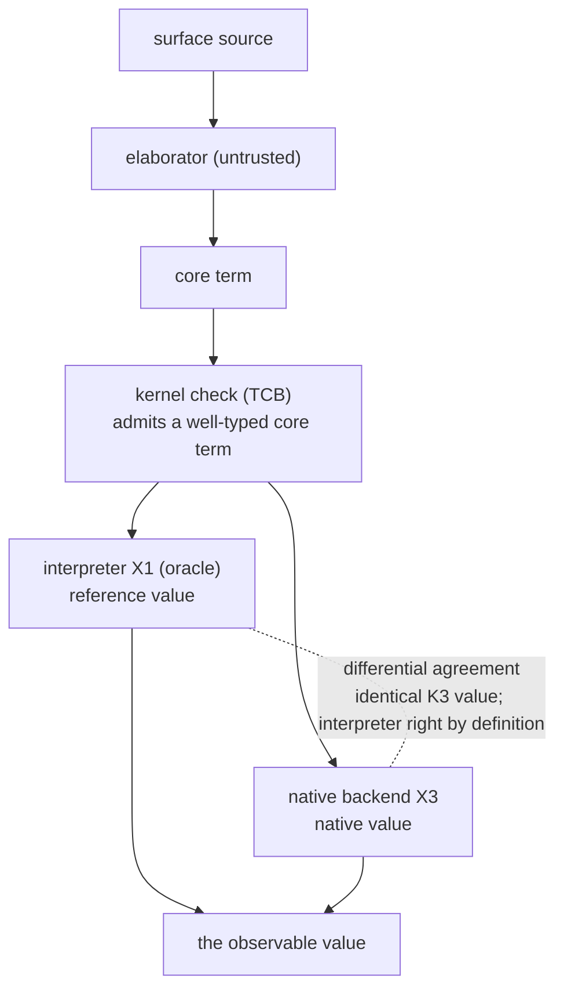

# The native backend: codegen model, target, and TCB posture

> Status: **DRAFT v0** (spec-design). This chapter designs the native code
> backend (`X3`) Team Runtime will build against: the **codegen model** (how
> kernel-checked core terms lower to native code), the **trust posture** (the
> backend is **not** in the type-soundness TCB), the
> **differential-equivalence** correctness discipline (the interpreter is the
> oracle), and the **target** decision (`OQ-backend-target`, **open** —
> operator-ratifiable). It **reflects, does not extend**: no new kernel, no new
> metatheory. It cross-references the evaluation semantics (`42`) and the
> capacity model (`44`); it does **not** re-pin either. Conformance:
> `../../conformance/runtime/backend/`.

## 1. Why a native backend, and where it sits

Ken has one **reference interpreter** (`X1`, landed, `42`): a tree-walker over
kernel-checked core that defines the observable value of every closed
computation. A **native backend** compiles that same core to machine code for
performance — it is a **second execution path**, not a second semantics.

The load-bearing fact, from which everything else in this chapter follows: the
backend consumes **already-kernel-checked core terms**. Elaboration has run, the
kernel has admitted the term, its type is fixed. The backend does not type, does
not elaborate, does not decide anything about soundness — it **evaluates**. It
stands in **exactly** the position the interpreter stands in (`42 §5`):
downstream of the kernel, running terms the kernel already vouched for.

Adding the backend grows the system's **tested** surface (a new evaluator and
its differential net); it does **not** grow the permanent trusted core. That is
the whole design intent (reflect-don't-extend, `docs/PRINCIPLES.md`): a new
execution path with **zero** new trust.

## 2. The trust posture — the backend is not in the TCB

This is the soundness anchor of the chapter (`AC1`), and it must be stated
plainly and defended, because "we added a native code generator" is exactly the
kind of change a reviewer expects to enlarge the trusted base — and here it does
not.

**The TCB is unchanged.** Proof soundness rests on the kernel, trusted primitive
declarations/signatures, and visible postulates (`64 §1`, `../10-kernel/18
§5`). Landed `PrimReduction::Op` execution itself lives in the
tested-not-trusted interpreter ring and never feeds conversion. The native
backend is likewise an **outer-ring** component: it produces a value downstream
of the kernel and earns confidence by a re-checkable differential discipline,
not by becoming proof-producing trust.

> **Contract BE-NotInTCB (`AC1`).** The native backend runs **already-
> kernel-checked** core terms and **decides no typing**. A backend bug is a
> **wrong value**, never a false `proved`: it cannot manufacture a soundness
> violation, because the term it evaluates was admitted by the kernel *before*
> the backend ran, and the backend's output is a value, not a proof the kernel
> re-admits. The backend is therefore **not in the type-soundness TCB** — its
> correctness is **`tested`** (differential agreement with the interpreter
> oracle, §4), never kernel-certified.

**The trust chain, precisely.** Three layers, and where each sits:

- **Kernel** — decides well-typedness. In the TCB. Kernel-certified (`Q`).
- **Interpreter (`X1`)** — the **oracle**: it defines the reference value of a
  closed computation, by agreement with the kernel on shared reductions and
  with independent value oracles for registered operations
  (`42 §5`, `§1`). It is **not** in the
  type-soundness TCB (it runs kernel-checked terms), but it **is** the
  correctness *reference* for every other evaluator. Its own trust level is
  `tested` (a correctness-critical evaluator, `X1` ★★).
- **Native backend (`X3`)** — must **agree** with the interpreter. Not in the
  TCB. `tested` by the differential corpus.

Neither the interpreter nor the backend is in the **type-soundness** TCB; the
kernel already settled type soundness. What is at stake for both is **value
correctness**, and the discipline that nets it is differential agreement, not a
trust claim (§4). Stating this keeps the honesty the security spine holds
elsewhere: a component's guarantee is labeled at its real level — here `tested`,
not kernel-backed — so no reader mistakes "we compile to native code" for "the
kernel checks the native code." It does not; nothing does. The differential
corpus does.

## 3. The codegen model — core → native lowering

The backend lowers the **computational** core to native code. This section pins
the **model** — what must be lowered and how values are represented — at the
**target-agnostic** level; the concrete ISA / IR is `OQ-backend-target`-deferred
(§5). A build team can implement this model against any of the candidate targets
without the model changing.

> **Contract BE-Model (`AC3`).** Lowering is defined over the core term syntax
> (`../10-kernel/13`, `14`) and preserves the interpreter's **observable value**
> (`42 §2`). The pieces:
>
> - **Value representation follows the K3 model** (`41`, `OQ-7`): scalars
>   (`Int`/`Bool`/`Float`) are **unboxed typed immediates**; compound /
>   identity-bearing values are **content-addressed heap slots** (interned, so
>   structural equality is O(1) slot-id comparison). The backend shares the
>   interpreter's value model; it does not invent a second representation.
> - **Functions lower to closures with sharing** — application is
>   **call-by-value, strict, left-to-right** (`42 §2`, `OQ-eval-order`), results
>   shared via the content-addressed heap (equal subcomputations deduplicated).
> - **Primitives lower to the audited runtime semantics** (`14 §5`, `18a`):
>   each `Decl::Primitive` operation computes the value its registered
>   interpreter dispatch defines — the backend must compute the **same** partial
>   function, not a platform-native approximation (e.g. `Int` is the
>   arbitrary-precision /
>   fixed-width semantics `35 §3` fixes, never silent machine-word wraparound
>   unless `Wrapping[T]` was written).
> - **Eliminators lower to constructor dispatch** (`14 §3`): `elim_D` forces the
>   **scrutinee**, then evaluates **only** the method the head constructor
>   selects — the **one** non-strict position (`42 §2`). `if`/`match`/`&&`/`||`
>   all elaborate to `elim_D`, so branch-laziness and short-circuit fall out of
>   this rule; the untaken method is **never** evaluated (a structural property
>   the differential corpus can pin).
> - **Proof-irrelevant subterms carry no observable value.** `Omega`-typed
>   (propositional) subterms are proof-irrelevant (`16 §8.2`); they compute
>   nothing a closed value observes and may be **erased** in lowering. Erasure
>   is safe **because** the kernel already checked them — the backend inherits,
>   it does not re-derive, their irrelevance.

The model deliberately stops at value representation + the evaluation rules; it
does **not** fix register allocation, calling convention, or instruction
selection — those are the target's, and pinning them here would over-constrain
`OQ-backend-target`.

## 4. The differential-equivalence discipline — the interpreter is the oracle

The backend's correctness is **not** argued by inspecting its code; it is
**netted by agreement** with the interpreter over a differential corpus. This is
the primary correctness discipline (`AC2`), and it is what makes BE-NotInTCB
(§2) safe: the backend does not have to be *trusted* to be correct, because
every divergence from the oracle is a **loud, catchable** failure.

> **Contract BE-Differential (`AC2`).** For any **closed, ground** core term
> `t`, evaluating `t` through the interpreter and through the native backend
> must produce **identical K3 values** (content-addressed model, `41 §4`: same
> slot / same immediate). On any disagreement, **the interpreter is right by
> definition** (`42 §5`); the backend is the defect. The backend earns trust by
> agreement over the corpus, not by inspection.

**The layers-may-differ boundary (the discriminating line).** The backend is
**allowed** to differ from the interpreter in **internal strategy** — a
different evaluation order among independent subterms, a different instruction
schedule, its own register/stack discipline — because totality makes evaluation
order **meaning-preserving** (`42 §2`: every program terminates, so strict and
lazy compute the same value; "different layers, allowed to differ" bounds this
to the **unobservable**). It is **not** allowed to differ in **observable
value**. So the corpus discriminates on exactly this line:

- A backend divergence that changes an **observable value** — a different
  result, a different constructor, a wrong `Int`, an
  evaluated-that-should-not-have-been effect — **must be rejected** by the
  differential corpus.
- An **unobservable-internal** difference — a different internal evaluation
  order that reaches the **same** K3 value — is **admitted** (it is not a bug;
  forbidding it would over-constrain the backend).

This pair is the seed of the `conformance/runtime/backend/` corpus: it is not
"does the backend compile," it is "does the backend's *value* agree with the
oracle's, while its *internals* are free." **Determinism and canonicity carry**
(`42 §2`): the backend must be deterministic (same term → same value) and
canonical for closed ground computations, exactly as the interpreter is.

The corpus is only as strong as the terms it runs; the **producer** side (the
real differential harness against the landed interpreter, `crates/ken-interp`)
is `X3-build`'s obligation (§7) — a green corpus that hand-feeds an expected
value instead of running the real interpreter nets nothing.

## 5. The backend target — `OQ-backend-target` (open, operator-ratifiable)

The concrete native-code target/toolchain is the **one irreversible
architectural decision** in the backend (a long-term dependency, a TCB-surface
and toolchain commitment). It is **`OQ-backend-target`**, and this chapter
**frames** it — it does **not** lock it. No target is written into normative
prose as decided; `X3-build` does **not** start until the operator ratifies.

> **Contract BE-Target (`AC4`).** The backend target is **open** — see the
> tradeoff analysis below and `../90-open-decisions.md` (`OQ-backend-target`).
> The design ring recommends **on merits**; the choice is an **operator-
> ratifiable Decision**. Because the backend is **not** in the soundness TCB
> (§2), target codegen maturity is a **quality/performance** concern, not a
> **trust** concern — which shifts the weighting toward the small-auditable-TCB
> principle rather than raw codegen power.

| Target | For | Against |
|---|---|---|
| **Cranelift** | Rust-native (in-tree, no external toolchain); smaller surface; aligns with small-auditable-TCB; fast compile | younger optimizer/codegen; fewer targets than LLVM |
| **LLVM** | mature; best codegen; many targets | large C++ toolchain dependency; big surface — tension with small-TCB |
| **C source** | maximally portable (any C compiler) | needs a C toolchain at build; UB surface; weaker debug story |
| **WASM** | sandboxed; portable; capability-story synergy | different execution model; host-embedding overhead; not "native" per se |

**On-principle lean (a recommendation, not a lock): Cranelift.** Rust-native
keeps the toolchain **in-tree** and the auditable surface **small**
(`docs/PRINCIPLES.md`, small-auditable-TCB); and since the backend is not in the
soundness TCB, codegen maturity is a quality/perf concern the differential
corpus (§4) will catch regressions in — not a trust concern. The design ring
should weigh this against the operator's performance/target-breadth priorities
and **propose a Decision** citing the tradeoffs. The operator ratifies on
return; the build gate below stands until then.

> **Build gate.** `ken-codegen` (`X3-build`) is **blocked on `OQ-backend-target`
> ratification.** The model (§3) and the differential discipline (§4) are
> target-agnostic and buildable-shovel-ready the moment a target is chosen;
> nothing downstream should commit the operator to a toolchain before ratifying.

## 6. Capacity and limits — cross-reference, not re-specified

Native execution runs against the **same content store** the interpreter does
(`41`, `44`): the content-addressed append-mostly heap, the
capacity-is-an-engineering-choice posture with **loud refusal** at the ceiling
(`44 §2`, `OQ-5`), and the reclamation model (`44 §3`). The backend **inherits**
these bounds; it does not define its own.

> **Contract BE-Capacity (`AC5`).** The backend's resource story is `44`'s
> capacity model and `X4`'s scale/limits validation (`44 §5`) —
> cross-referenced, **not** re-pinned here. Backend-specific limits (native
> stack depth, codegen memory, any target-imposed bound) are **`X4`'s lane**,
> validated by the scale corpus; this chapter only records that native execution
> is bound by `44` and defers the numbers.

## 7. What WS-X must deliver here (`X3-build`, after ratification)

Once `OQ-backend-target` is ratified, `X3-build` (Team Runtime) delivers:

- **`ken-codegen`** — the backend lowering the model of §3 to the **ratified**
  target: value representation (K3 immediates + interned slots),
  CBV-with-sharing closures, the audited primitives, constructor-dispatch
  eliminators, proof erasure.
- **The differential harness** — the real validator running the codegen output
  **against the landed interpreter** (`crates/ken-interp`), enforcing
  BE-Differential (§4) over the corpus. **Producer-grep gate (forward):** the
  harness must run the **real** interpreter as oracle — **not** a hand-fed
  expected-value table; a codegen case that compares against a baked-in value
  instead of the live interpreter is green-vs-green and nets nothing. This gate
  is `X3-build`'s, flagged here, not exercised in this design WP.
- **The codegen conformance corpus** — `conformance/runtime/backend/`, the
  differential-equivalence discipline (§4) plus the observable-vs-internal
  discriminating pair, extended with target-specific value cases.

The audited boundary at the end of `X3` has the **same three categories** it had
before, and the proof-soundness TCB is unchanged: the backend is a `tested`
execution path netted by the interpreter oracle. The kernel-soundness story
(`64`, `docs/program/g5-soundness-story.md`) is unchanged by its addition.
