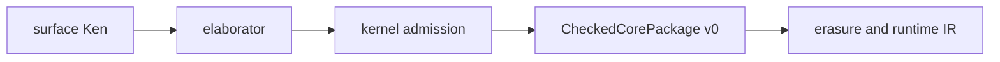

# CheckedCorePackage v0

> Status: **DRAFT v0** (NC1). Normative for the stable
> post-elaboration, kernel-admitted compiler input consumed by the Rust
> bootstrap compiler. It defines the semantic artifact boundary before
> erasure/runtime IR. It does not define native backend lowering, runtime IR,
> ABI, layout, or compiler verification.

## 1. Boundary

`CheckedCorePackage v0` is the package-shaped image of checked core and its
compiler-relevant metadata after elaboration and kernel admission:

The compiler's semantic input is the package, not raw surface Ken. Source text,
source hashes, spans, and module paths may travel for diagnostics and
provenance, but the compiler must not need raw source bytes to determine the
meaning of any declaration, metadata entry, obligation, assumption, or trust
delta.

"Checked" means every semantic declaration has already passed the existing
kernel admission path, or is re-checkable by the existing kernel when loaded
from a serialized package. The package emitter and validator add no kernel rule,
prove no new theorem, and do not expand the type-soundness TCB. A bad package
reader may reject or miscompile; it cannot make an unchecked term into a Ken
proof unless the kernel itself admits that term.

This chapter defines the semantic contents of the artifact. The exact canonical
byte encoding and stable-symbol spelling are follow-on compiler-package work;
they must preserve the value sets, coverage rules, and compatibility semantics
defined here.

## 2. Relation to Existing Specs

NC1 reuses the existing contracts below and defines only the checked-core
compiler artifact that sits between them:

- `../30-surface/39-elaboration.md` defines how surface Ken becomes checked
  kernel core. NC1 records the result; it does not add a raw-source consume
  path.
- `../10-kernel/18-judgments.md` defines kernel admission, declaration kinds,
  and `trusted_base()` accounting. NC1 serializes the admitted declarations and
  their trust view; it does not add kernel authority.
- `../20-verification/25-protocol.md` defines obligation status and
  `trusted_base_delta` reporting. NC1 carries stable obligation/trust entries
  so the compiler package remains honest about assumptions.
- `../60-security/63-supply-chain.md` defines package/provenance roles and the
  "consume = re-check" posture. NC1 participates in that package world instead
  of redefining signing, policy, or provenance governance.
- `../70-behavioral/71-assumption-boundary.md` defines behavioral projection,
  status-to-field mapping, content-hash discipline, and the no-promotion gate.
  NC1 carries the relevant export reference/hash; it does not duplicate the
  `Q`/`P`/`Sigma`/`T`/`G` schema.

## 3. Header and Identities

A v0 package has a required header. A consumer must validate the header before
loading declarations, building dependency closures, or starting erasure.

- `package_kind` is the semantic value `CheckedCorePackage`.
- `version` is the integer `0`.
- `producer` identifies the emitting toolchain and checked-core package
  emitter.
- `kernel_ref`, `spec_ref`, and `primitive_registry_ref` identify the kernel
  contract, spec contract, and primitive registry that the checked declarations
  were admitted against.
- `package_identity` identifies the package/module set independently of source
  spelling.
- `dependency_semantic_hashes` lists every imported checked-core dependency by
  semantic hash.
- `source_identity` and source content hashes are provenance and diagnostic
  data only.
- `core_semantic_hash` and `artifact_hash` are distinct identities, defined
  below.

Unsupported `package_kind`, unsupported `version`, missing version, or a
malformed header is a loud reject before semantic use. There is no downgrade,
best-effort reader mode, inferred translation, or raw-source fallback.

### 3.1 Hash Boundary

`core_semantic_hash` is the canonical hash of checked-core meaning. It includes
the package kind and version, stable symbols, checked declarations, semantic
metadata, obligations, assumptions, `trusted_base_delta`, unsupported semantic
entries, and dependency semantic hashes. It excludes raw source bytes,
diagnostic-only source display data, and non-semantic annotations.

`artifact_hash` is the hash of the serialized package artifact/provenance
envelope. It may include source identity, source hashes, signatures, and
non-semantic annotations as required by `63`.

Two packages with the same checked core and semantic metadata but different
comments, spans, formatting, or source spelling have the same
`core_semantic_hash`. Changing a checked term, stable-symbol binding, semantic
metadata entry, obligation, assumption, trust delta, unsupported semantic entry,
or dependency semantic hash changes `core_semantic_hash`.

### 3.2 Stable Symbols and Canonical Inputs

`GlobalId` is a producer-local index only. A package emitter may use it to find
the already-admitted kernel declaration while constructing a package, but no
exported identity, canonical reference, semantic hash input, dependency edge,
obligation id, assumption entry, or primitive reference may depend on the
numeric `GlobalId` allocation order.

Every serialized reference resolves through an artifact-level stable symbol
whose namespace identifies the semantic role:

- top-level declarations use a canonical package and module-qualified
  declaration symbol;
- constructors use the parent family stable symbol plus the constructor name;
- primitives use the primitive-registry symbol string, not the primitive
  declaration's local `GlobalId`;
- modules use package-qualified module path symbols for export bookkeeping
  only; module paths are not kernel primitives;
- metadata entries key by the stable symbol or stable obligation id they
  describe;
- obligations use their stable clause ids, such as `f.ensures.0`,
  `Monoid.law.assoc`, or `f.temporal.0`;
- assumptions and trust entries key by the stable symbol or stable obligation
  id they attach to, never by a raw postulate id alone.

Canonical checked-core encoding is over semantic value sets, not producer append
order. Kernel `Level` values encode from semilattice normal form. Kernel `Term`
values encode their binder and argument order structurally, but every global,
inductive former, constructor, eliminator family, or primitive reference inside
the term encodes through the stable-symbol layer. Declaration, metadata,
recursive-group, dependency, obligation, assumption, unsupported, and annotation
tables that are semantically sets or maps sort by their stable key before
hashing.

`core_semantic_hash` is computed from the canonical semantic inputs only:
stable-symbol bindings, checked declarations, primitive references, inductive
metadata, class/instance metadata, recursion metadata, effects/foreign
metadata, obligations, assumptions, `trusted_base_delta`, unsupported semantic
entries, behavioral export references/hashes, and dependency semantic hashes.
`artifact_hash` may additionally include source identity, source hashes,
signatures, provenance, and non-semantic annotations. Changing comments, spans,
formatting, source spelling, producer-local allocation order, or non-semantic
annotations must not change `core_semantic_hash`; changing any semantic or
trust input must change `core_semantic_hash` or a referenced dependency/export
hash.

## 4. Required Sections

Every required section below must be present. An explicitly empty section means
"none"; an omitted section means "invalid package". The optional `annotations`
lane is defined in section 8 and is not a required section. A package may not
use an unsupported entry or annotation to stand in for a missing required
section.

| Section | Payload | Reject |
|---|---|---|
| `header` | kind, version, refs | bad kind/version |
| `symbols` | stable names | missing/duplicate/orphan |
| `declarations` | checked graph | missing or bad reference |
| `primitive_refs` | primitive metadata | primitive use gap |
| `inductives` | family/constructor metadata | inductive use gap |
| `classes_instances` | lookup/dictionary metadata | lookup metadata gap |
| `recursion` | groups, SCT, SCCs | recursive metadata gap |
| `effects_foreign` | rows, caps, FFI | effect/foreign gap |
| `obligations` | ids, goals, status | obligation gap/mismatch |
| `assumptions_trust` | assumes and trust delta | reachable trust omission |
| `behavioral_export` | `71` reference/hash | temporal/export gap |
| `hashes_provenance` | semantic/artifact hashes | hash mismatch |
| `unsupported` | explicit unsupported entries | malformed/reachable block |

Unknown top-level semantic sections or unknown required features reject unless a
selected, versioned translator explicitly handles them. Unknown entries inside
the namespaced `annotations` lane may be ignored because they are not semantic.
If no non-semantic annotations are present, the lane may be omitted; omission of
`annotations` is equivalent to an empty non-semantic annotation set.

## 5. Declaration and Metadata Coverage

The symbol table is the semantic name surface of the package. Every top-level
declaration, constructor, class, instance, and obligation has exactly one stable
symbol. Every semantic reference inside a package resolves through a stable
symbol or a canonical reference defined from stable symbols. A local `GlobalId`
may travel as producer-side evidence for re-checking, but it is not the durable
identity across packages.

The declaration graph is total and closed:

- every declaration listed in `declarations` has a stable symbol;
- every metadata entry targets an existing stable symbol;
- every semantic use of a primitive, inductive, class, instance, recursive
  group, effect, foreign boundary, obligation, or trust entry has matching
  metadata;
- every dependency edge names an earlier declaration in the package or an
  imported package by semantic hash and stable symbol;
- a metadata entry for an absent symbol is invalid, even if the metadata is
  otherwise well-formed.

Declaration kinds follow the kernel API surface in `18`:

- A transparent definition records level parameters, checked type, checked
  body, dependency set, and source-span reference as provenance only.
- An opaque declaration records level parameters, checked type, opacity reason,
  and whether it contributes to the reachable trust delta.
- A primitive records level parameters, checked type, primitive reduction class,
  primitive symbol, partiality face, and primitive-registry reference.
- An inductive records family metadata, generated former type, constructor
  symbols, constructor argument telescopes, target indices, generated
  constructor types, recursive positions, and eliminator/admission status.
- A recursive group records the group id, member symbols, checked types and
  bodies, SCT/admission status, dependency/SCC relation, and whether the group
  is lowerable by the current compiler stage.

Class and instance metadata is required because dictionary lookup and lowering
must be surface-independent. A class entry records `Property` versus
`Structure`, parameter kind, field names/types/order, field purity/effect
metadata, class record symbol, and module/orphan-relevant data. An instance
entry records the dictionary symbol, canonical `(class, head)` key, field
effect rows, module/coherence data, and dependencies. The dictionary value is
still ordinary checked core; the metadata makes lookup and later lowering
reproducible without the surface declaration.

Effects, capabilities, and foreign declarations are coverage metadata in NC1.
Their enforcement semantics stay in `../30-surface/36-effects.md`,
`../60-security/61-information-flow.md`, `../60-security/62-authority.md`, and
`../30-surface/38-ffi-io.md`. NC1 requires declared and inferred rows, row
variables, performed effects, capability parameters/authority references,
boundary labels, foreign binding/marshalling facts, runtime-check obligations,
and declassify/audit references to be represented whenever they affect the
checked declaration graph.

### 5.1 NC3 Compiler-Metadata Coverage

NC3 makes the compiler-relevant coverage set explicit so native lowering never
has to recover checked meaning from raw source, naming convention, append order,
or absence. The metadata below is still checked-core package metadata. It does
not define native layout, runtime IR, ABI, backend lowering, Cranelift rules, or
compiler verification.

Every entry that affects runtime meaning participates in
`core_semantic_hash`. Non-semantic annotations may aid diagnostics, but a
consumer must not use them to decide whether a declaration is lowerable or what
runtime construct it denotes.

Required coverage areas:

- **Primitive registry entries.** Record primitive-registry symbol, checked
  type, reduction class (`opaque-type`, `literal`, or operation), partiality
  face, assumptions or obligations needed by that primitive, and lowerability
  status.
- **Data and constructors.** Record family parameters, indices, constructor
  symbols, argument telescopes, target indices, recursive positions, generated
  types, eliminator/admission status, and lowerability status for the family
  and each constructor.
- **Records and Sigma.** Record field names, field order, checked field types,
  runtime-field versus erasable law/proof-field status, projection metadata,
  and lowerability status. This distinguishes runtime data from evidence
  without committing to a native layout.
- **Classes, instances, and dictionaries.** Record class kind, parameter kind,
  canonical instance key, dictionary symbol, field order, field types, field
  effect rows, law/proof fields, coherence/orphan data, dependencies, and
  lowerability status. Dictionary values remain ordinary checked core.
- **Recursion.** Record recursive-group id, member symbols, SCC relation,
  structural or size-change admission result, checked bodies/types, diagnostics
  needed to explain rejection, and lowerability status.
- **Effects, capabilities, and foreigns.** Record declared and inferred rows,
  row variables, performed effects, capability parameters, authority
  references, boundary labels, foreign binding symbol, marshalling facts,
  runtime-check obligations, declassify/audit references, and lowerability
  status.
- **Obligations.** Record stable obligation id, goal-core reference, status,
  origin declaration, delegated export reference when present, and whether the
  obligation affects runtime meaning.
- **Assumptions and trust delta.** Record explicit assumes, holes, foreign
  postulates, declassify authorities, primitive assumptions, reachable
  `trusted_base_delta` entries, and whether each entry affects runtime meaning.

Lowerability status is explicit and semantic:

- `supported` means the checked metadata is sufficient for the selected
  compiler stage to continue.
- `unsupported` means the package is valid checked core, but target lowering of
  any closure reaching the entry must fail loudly before erasure/runtime IR.
- `deferred` means a named later stage owns the decision; a consumer that is not
  that stage must treat the entry as not lowerable for its target.
- `requires-feature` means the entry lowers only when a named, versioned
  compiler feature is enabled; otherwise it fails like `unsupported`.
- `explicit:<state>` is reserved for versioned, named states with specified
  fail/continue behavior. Unknown explicit states reject for the current
  consumer rather than defaulting to support.

Omitting required metadata that affects runtime meaning is invalid package
data, not `deferred`. An unsupported or deferred entry is honest only when the
checked meaning is otherwise fully represented and the entry names the stable
symbol, section or field, reason, responsible later stage if any, and whether
it blocks target lowering.

## 6. Assumptions, Obligations, and Trust

NC1 packages must preserve the assumption boundary explicitly. For every target
closure the package exposes, `trusted_base_delta` is the reachable subset of
kernel `trusted_base()` plus explicit assumes, foreign postulates,
declassify-authority assumptions, and primitive assumptions that the closure
uses. The delta being non-empty does not make a package invalid by itself; `63`
and policy decide acceptability. Omitting a reachable assumption is invalid.

Obligations carry stable ids, checked goal-core references, status, originating
declaration, and provenance. A temporal delegated obligation carries the
delegation reference that projects through `71`; it is never promoted to a Ken
proof by being present in the package or by a later discharge attestation.

The package may include behavioral-export identity and hashes, but the
projection and no-promotion rules are those of `71`. The NC1 invariant is only
linkage: if checked-core metadata mentions behavioral or temporal obligations,
the package has enough stable references and hashes for a consumer to locate the
corresponding export, and none of those references can alter checked-core
meaning outside `core_semantic_hash`.

## 7. Compatibility

The compatibility rule is: preserve, bump, or translate explicitly.

**Preserve v0** when all v0 consumers assign the same checked-core meaning to
the same semantic payload. Surface syntax changes, elaborator refactors,
canonical field reordering, producer-local `GlobalId` allocation changes, or
new non-semantic annotations may preserve v0 if every required v0 field keeps
the same value set and interpretation.

**Bump** when a required semantic field is added or removed, `empty`/missing
semantics change, a default or value set changes, stable-symbol identity
changes, hash participation changes, a core term/declaration encoding changes
meaning, trust/obligation projection changes, unsupported/lowerability
semantics change, or a consumer would otherwise need to consult raw source to
recover meaning.

**Translate explicitly** only through a named translator. The translator names
source and target versions, maps every required field, recomputes semantic and
artifact hashes, preserves or conservatively widens assumption/trust data, and
fails loudly if any field cannot be translated. Translation produces a new
artifact identity and is never implicit at a consume boundary.

## 8. Unsupported and Extension Semantics

There are three separate cases:

1. **Invalid package data.** Unsupported package kind/version, missing required
   section, malformed required value, hash mismatch, unknown semantic field, or
   omitted reachable trust metadata rejects the package before semantic use.
2. **Explicit unsupported semantic entry.** A valid package may say a stable
   symbol or feature is checked but not lowerable by the current compiler stage.
   The entry names the symbol, field or section, status (`supported`,
   `unsupported`, `deferred`, `requires-feature`, or a versioned
   `explicit:<state>`), reason, responsible later stage, and whether it blocks
   package validation or only target lowering. Compiling a target whose
   dependency closure reaches a lowering-blocking entry rejects before
   erasure/runtime IR, naming the stable symbol and reason. No consumer may
   reinterpret an absent entry as `supported`.
3. **Non-semantic annotation.** `annotations` is an optional namespaced lane for
   diagnostics, display, profiling notes, or provenance decoration. Unknown
   annotations may be ignored, are excluded from `core_semantic_hash`, and are
   included only in `artifact_hash` if serialized. A consumer must not branch on
   an annotation to determine checked-core meaning. A missing `annotations`
   lane is valid and means there are no non-semantic annotations.

A producer that cannot represent the checked meaning of a declaration in v0 must
not emit a v0 package for that declaration. The unsupported lane is for honest
compiler-stage lowerability gaps, not for hiding semantic omissions.

## 9. Examples

- `Bool` records zero parameters, zero indices, constructors `False` and
  `True`, zero recursive positions, supported eliminator metadata, and
  supported family/constructor lowerability.
- `Nat` records constructors `Zero` and `Succ`, with `Succ`'s recursive
  position explicit and structural-recursion metadata available to accepted
  recursive groups over `Nat`.
- `Option A` records one parameter, zero indices, constructors `None` and
  `Some`, constructor argument metadata, and supported eliminator/lowerability
  status.
- `List A` records one parameter, constructors `Nil` and `Cons`, the recursive
  tail position in `Cons`, and recursion metadata for accepted definitions such
  as append or map.
- `fn idNat (x : Nat) : Nat = x` becomes a transparent checked declaration with
  stable symbol, checked type, checked body, dependency set, and no need for the
  original surface text.
- `Option`, `List`, and an indexed `Vec`-style family demonstrate inductive
  metadata: parameters, indices, constructor target indices, generated
  constructor types, and recursive positions must be represented explicitly.
- `packages/transport/transport.ken` is a zero-delta equality/J baseline:
  checked proof combinators such as `subst`, `cong`, `cast`, `sym`, and `trans`
  stress proof terms and equality references without new assumptions.
- `packages/lawful-classes/lawful_classes.ken` demonstrates class and instance
  metadata. Inductive carriers such as `Bool` can carry zero-delta law proofs;
  primitive-carrier laws such as audited `Int` laws remain visible in the trust
  delta instead of being silently treated as proved.
- A class dictionary such as an `Eq Bool` dictionary records the class symbol,
  head key, dictionary symbol, runtime method fields, erasable law/proof fields,
  field order, dependencies, and supported dictionary lowerability.
- A primitive operation such as `nat_add` records the primitive-registry symbol,
  checked type, operation reduction class, total/partial face, any associated
  obligation or primitive assumption, and supported or explicit unsupported
  lowerability.
- `packages/collections/collections.ken` demonstrates recursive groups,
  inductive metadata, proof-returning declarations, and proof terms such as
  `sortBool` and `take_drop_decomposition`.
- An accepted recursive group records its group id, member symbols, checked
  bodies/types, SCC relation, structural or size-change admission, and
  lowerability status. A rejected or stage-deferred group remains explicit and
  fails loudly if a target closure reaches it.
- `packages/lawful-functors/lawful_functors.ken` demonstrates higher-kinded
  class parameters, parametric instance heads, dictionary symbols, and package
  dependency closure.
- `read_bytes`/`send` rows and a `foreign os_write ... visits [FS]` binding
  demonstrate effect rows, capability/foreign metadata, runtime-check
  obligations, and FFI entries in `trusted_base_delta`.
- A `temporal{}` declaration demonstrates delegated behavioral data: NC1
  records stable obligation references and export hashes, while `71` defines
  the behavioral schema and no-promotion rule.
- `packages/parsing/parsing.ken` can demonstrate source identity, spans, bytes,
  and parser-result data. Its source fields are provenance/diagnostic facts, not
  a raw-source consume path.

## 10. Non-Goals

NC1 does not specify surface parsing, surface elaboration algorithms, raw-source
compilation, erasure syntax, runtime IR syntax, Cranelift lowering, register or
stack layout, calling convention, final ABI, object format, optimization
correctness, compiler verification, or any new kernel admission gate.

NC1 also does not promise that every checked Ken package is lowerable by the
first v0 compiler. A package may be checked, inspectable, and honest while a
target closure still rejects because it reaches an explicit unsupported
lowering entry. Loud refusal is the required behavior; silent source fallback is
not allowed.

## 11. Conformance Hooks

The conformance corpus for this chapter should use real emitted positive
artifacts once the emitter exists, then mutate one dimension at a time:

- valid v0 accepts after required-section and re-check coverage;
- missing `package_kind`, missing `version`, or unsupported `version` rejects;
- required section omitted rejects, while an explicit empty section can accept;
- omitted `annotations` accepts and means no non-semantic annotations;
- unknown semantic field rejects unless it is in `annotations`;
- dropped metadata, orphan metadata, or primitive/class/inductive/effect use
  without metadata rejects;
- changing primitive partiality, data constructor recursion positions,
  record/Sigma runtime-field status, class dictionary fields, accepted
  recursion admission, effect/foreign boundary metadata, or obligation/trust
  runtime-meaning flags changes `core_semantic_hash`;
- a target closure reaching an `unsupported`, `deferred`, unmet
  `requires-feature`, or unknown `explicit:<state>` lowerability entry rejects
  before erasure/runtime IR and names the stable symbol;
- a target closure reaching a missing lowerability entry rejects before
  erasure/runtime IR and names the stable symbol;
- reachable `trusted_base_delta` omission rejects;
- semantic hash mismatch rejects;
- equal checked-core meaning with different source spelling keeps
  `core_semantic_hash`;
- any consumer path that requires raw source for meaning violates this chapter.
