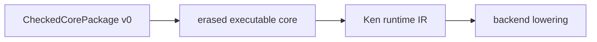

# Erasure Boundary and Runtime IR

> Status: **DRAFT v0** (NC5). Normative for the first executable compiler
> artifact below `CheckedCorePackage v0`. It defines proof erasure, runtime IR,
> loud unsupported-erasure failures, and the comparison relation to the
> reference interpreter. It does not define Cranelift lowering, ABI, object
> format, native pointer identity, backend layout, or compiler verification.

## 1. Boundary

The compiler consumes only `CheckedCorePackage v0`:

Raw surface source bytes are never semantic input to erasure or runtime IR.
Source identity, spans, and source hashes may remain available for diagnostics
and provenance through the package envelope, but runtime meaning is determined
by the checked declarations, stable symbols, semantic metadata, obligations,
assumptions, `trusted_base_delta`, behavioral/export references, dependency
semantic hashes, and lowerability status carried by the package.

`erased executable core` is an intermediate semantic artifact. It removes only
proof-irrelevant `Omega` payload that cannot affect control, representation,
trap behavior, effects, data/control shape, or the observable returned ground
value. Obligations, assumptions, trust metadata, runtime checks, capabilities,
effects, and lowerability blockers remain attached as auditable metadata and
hash inputs.

`Ken runtime IR` is the first operational artifact. It makes data, control,
effects, traps, primitives, closures, ADTs, records, and calls explicit enough
for execution and later backend lowering, while keeping backend layout and
Cranelift semantics non-authoritative.

## 2. Metadata Survival

Erasure must preserve, per lowered package or symbol:

- stable symbols and the package `core_semantic_hash`;
- package `artifact_hash` as provenance for the exact artifact consumed;
- obligations and obligation metadata;
- assumptions and assumption/trust metadata;
- `trusted_base_delta`;
- dependency semantic hashes;
- behavioral/export references and hashes when present in the package;
- effect rows, capabilities, foreign-boundary facts, runtime-check
  obligations, declassify/audit references, and lowerability status.

These are not executable values by default. They are runtime artifact metadata
that remains inspectable and participates in the package semantic identity
defined by `46`.

## 3. Runtime IR

Runtime IR is backend-neutral. It may contain:

- immediate values: `Bool`, `Int`, `Bytes`, `String`, and other already
  specified runtime values from `41`;
- constructor construction and constructor match;
- record construction and projection;
- closure construction, capture lists, and calls;
- primitive calls with explicit total or trap-producing partiality;
- effect operations with explicit effect/capability facts;
- `let`, `if`, and explicit traps.

Runtime IR must not contain:

- Cranelift instructions or Cranelift-specific undefined behavior;
- native ABI or object-format commitments;
- register, stack, heap-object, or pointer-identity semantics;
- backend poison values;
- raw-source fallback hooks;
- new kernel authority or proof claims.

## 4. Loud-Fail Cases

A consumer must reject before backend work for any reachable target whose
checked-core closure includes:

- an unsupported package entry, missing lowerability metadata, or a lowerability
  status other than `supported`;
- an erasure case where proof removal could change branch choice,
  representation, trap/effect behavior, data/control shape, or observable
  result;
- a primitive or partial operation whose result/trap behavior is not explicit in
  runtime IR;
- an effect, foreign, capability, trust, or runtime-check path that is not
  represented in the IR metadata/model;
- a case that needs backend layout, native pointer identity, ABI, object format,
  or Cranelift semantics to define meaning.

Loud refusal is part of the boundary. A rejected target is not a backend hole,
and a missing case must never silently lower to an arbitrary runtime operation.

## 5. Observation Relation

NC5 compares only the supported subset against the reference interpreter:

- successful returned ground values;
- explicit trap outcomes.

The relation does not compare backend traces, native addresses, object layout,
allocation order, timing, optimization behavior, or proof objects. The reference
interpreter remains the oracle for program meaning (`42`), and runtime IR is
accepted only where the supported subset can be related to interpreter returned
ground values or explicit traps.

## 6. Seed Examples

The first runtime IR examples are deliberately small:

- closed scalar primitive computation;
- ADT constructor plus eliminator or match;
- closure capture and application;
- record construction and projection;
- one explicit trap or unsupported partial-primitive case.

These examples exercise the comparison relation without claiming whole-program
compiler verification.

## 7. Non-Goals

NC5 does not implement a backend, Cranelift lowering, ABI selection, native
layout, object emission, compiler certificates, or any new kernel rule. It does
not promote tested execution to proved compiler correctness, and it does not
consume raw surface source for meaning.
