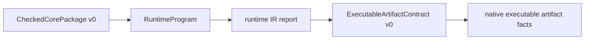

# ExecutableArtifactContract v0

> Status: **DRAFT v0** (NC19). Normative for the first native
> executable-artifact contract above `CheckedCorePackage v0` and
> `RuntimeProgram`. It defines identity binding, evidence lanes, unavailable
> native claims, compatibility, and loud rejection rules for closed Ken-only
> executable attempts. It does not define object emission, linker behavior,
> ABI, interop, cross-package native linking, kernel rules, trusted
> primitives, runtime IR semantics, or compiler verification.

## 1. Boundary

`ExecutableArtifactContract v0` is the report-shaped identity envelope for a
closed Ken-only executable attempt whose meaning is already represented by a
checked-core package and a runtime program:

The semantic authorities are exactly:

- `CheckedCorePackage v0`, for post-elaboration checked-core meaning; and
- `RuntimeProgram`, for the backend-neutral operational artifact below checked
  core.

The executable-artifact contract is not a third semantic authority. It records
which native bytes, backend facts, toolchain facts, and report hashes belong to
that exact checked-core/runtime-IR pair, or records why the native lane is
unavailable or unsupported. Native bytes, object files, report prose, backend
metadata, toolchain metadata, and provenance data must not change checked-core
or runtime-IR meaning and must not serve as Ken proof evidence.

Raw source bytes are never semantic input to this contract. Source identity may
appear only through the already-bound package/runtime/provenance artifacts. A
consumer that needs raw source to decide executable meaning violates this
chapter.

## 2. Relation to Existing Specs

This chapter composes existing boundaries rather than widening them:

- `46-checked-core-package.md` defines package kind, version,
  `core_semantic_hash`, package `artifact_hash`, metadata coverage,
  unsupported entries, and the no raw-source fallback rule. NC19 imports those
  identities; it does not reinterpret them.
- `47-erasure-runtime-ir.md` defines proof erasure, runtime IR, runtime
  metadata survival, loud unsupported-erasure rejection, and the observation
  relation to the reference interpreter. NC19 binds to the exact
  `RuntimeProgram` artifact and reports over it.
- `45-native-backend.md` defines the native backend posture: the backend is an
  outer-ring tested execution path, not a type-soundness TCB item. NC19 may
  record backend/toolchain facts but must not promote them to proof.
- `../60-security/63-supply-chain.md` separates artifact identity and
  provenance/build-origin attestations from proof re-checking. NC19 may point
  at such attestations but does not make them semantic authority.
- `../60-security/64-trust-model.md` fixes the TCB and honest limits. NC19
  adds no kernel, primitive, or postulate trust.
- `../70-behavioral/71-assumption-boundary.md` fixes no-promotion and
  status-lane discipline. NC19 preserves that discipline for native reports:
  unavailable, unsupported, tested, validated, delegated, and proved lanes stay
  distinct.

## 3. NC19 Opening Gate

NC19 is open only because the NC18 closeout recorded that the starter Ken-only
executable subset is clear for native-codegen work. The required general gate
is:

- the selected target is closed and Ken-only;
- the exact runtime artifact has a `RuntimeIrProgramReport`;
- the report's artifact identity matches the runtime artifact identity;
- the selected target is in `supported_runtime_targets`;
- the report's `native_phase_gate` is
  `ReadyForStarterKenOnlyExecutableSubset`; and
- effects, foreign boundaries, malformed authority lanes, unsupported runtime
  expressions, and comparison-unavailable targets remain outside the starter
  native-executable set.

For the NC19 work package, the opening record is the landed NC18 base
`origin/main @ 23b078e62741463d37b4eac070a8ee6b82ec94ed`. That record is a
program-phase precondition, not a new semantic input. A later contract instance
must still bind to its own exact checked-core, runtime, report, native, and
toolchain artifacts.

## 4. Contract Kind, Version, and Closed Schema

A v0 contract has a required header:

- `contract_kind` is the semantic value `KenExecutableArtifactContract`.
- `version` is the integer `0`.
- `producer` identifies the tool that produced the contract.
- `spec_ref` identifies this contract specification.
- `target` identifies the selected closed target by stable package-bound
  symbol or closure identity.
- `contract_hash` is the canonical hash of the full contract fields defined by
  this chapter.

The v0 schema is closed. Unsupported `contract_kind`, unsupported `version`,
missing kind/version, malformed header, missing required field, unknown
semantic field, or unknown evidence status rejects before executable-artifact
use. There is no downgrade, inferred translation, best-effort consume mode, or
source reconstruction fallback.

Every required field must be present. When a fact is unavailable in NC19, the
field carries an explicit `unavailable` marker with a reason and evidence lane.
Omission is invalid and is not equivalent to unavailable.

## 5. Required Identity Bindings

An executable-artifact contract cannot describe native executable facts unless
it binds all semantic authorities first.

### 5.1 Checked-Core Binding

The checked-core binding records:

- `package_kind = CheckedCorePackage`;
- checked-core package version, currently `0`;
- checked-core `package_identity`;
- checked-core `core_semantic_hash`;
- checked-core package `artifact_hash`; and
- dependency semantic hashes, either embedded or referenced by exact digest.

These values are imported from the checked-core package. The executable
contract does not recompute checked-core meaning from native bytes, reports,
source paths, or toolchain facts.

### 5.2 Runtime Binding

The runtime binding records the exact `RuntimeProgram` identity:

- runtime package identity;
- runtime `core_semantic_hash`;
- runtime artifact hash;
- selected target identity; and
- runtime artifact evidence source.

The runtime package identity and `core_semantic_hash` must equal the
checked-core binding. A mismatch rejects before native-artifact use. The runtime
artifact hash identifies the backend-neutral operational artifact; it is not a
native artifact hash.

### 5.3 Report Binding

The report binding records the exact runtime-IR report used to open the native
lane:

- report kind, currently `RuntimeIrProgramReport`;
- report hash or equivalent exact identity;
- report artifact identity;
- selected target verdict;
- `native_phase_gate`; and
- evidence source for the report.

The report artifact identity must match the runtime binding. A stale report
hash, stale artifact identity, blocked native phase gate, or selected target
absent from `supported_runtime_targets` rejects any claim that a starter native
executable is available.

### 5.4 Native Artifact Binding

The native-artifact binding is required even when no native bytes exist. It has
exactly one status:

- `available`, with native artifact kind, native artifact hash, backend name,
  platform target, evidence source, and the checked-core/runtime/report
  identities it was produced from;
- `unavailable`, with a stable lane and reason; or
- `unsupported`, with a stable lane, target symbol, construct, and reason.

An `available` native artifact binding must not exist without exact matching
checked-core, runtime, and report bindings. A native artifact hash by itself is
not enough to identify an executable Ken artifact. An `unavailable` or
`unsupported` marker is part of the contract hash.

### 5.5 Toolchain and Backend Facts

The toolchain binding records exact-run facts or explicit unavailable markers
for:

- Ken runtime/compiler component identity;
- native backend identity;
- backend verifier identity, when applicable;
- host platform target, when known;
- object emission lane;
- linker or finalizer lane; and
- provenance or build attestation identity, when present.

Every available toolchain fact names its evidence source. A missing toolchain
fact is invalid unless the field carries an explicit unavailable marker. A
toolchain fact is evidence about how the executable artifact was produced or
observed; it is never semantic authority and never Ken proof evidence.

## 6. Evidence Lanes

Each claim in the contract declares its evidence lane. NC19 recognizes:

- `semantic-authority`, reserved only for the checked-core package and runtime
  program bindings;
- `tested`, for exact-run native/backend/runtime observations;
- `validated`, for a named validator over an exact artifact, when such a
  validator exists;
- `unavailable`, for claims this phase cannot evidence; and
- `unsupported`, for targets or constructs that must fail before native
  execution.

The lane is normative. A consumer must not reinterpret an unavailable claim as
tested, an unsupported target as comparison-unavailable, a tested native run as
proved semantics, or a report gate as proof of compiler correctness.

The required unavailable lanes for NC19 are:

- object emission;
- linker or finalizer behavior;
- library ABI;
- C ABI;
- Rust interop;
- cross-package native linking;
- stable foreign ABI;
- host-effect or FFI execution; and
- whole-compiler proof.

If a future work package supplies exact evidence for any of these lanes, it
does so by a versioned extension, bump, or explicit translation. NC19 v0 cannot
make the lane available by prose.

## 7. Hash Boundary

`contract_hash` is the canonical hash of the v0 executable-artifact contract.
It includes:

- contract kind and version;
- target identity;
- checked-core binding;
- runtime binding;
- report binding;
- native-artifact binding, including unavailable or unsupported markers;
- toolchain/backend facts or explicit unavailable markers;
- evidence lanes and evidence sources;
- required NC19 unavailable lanes; and
- compatibility/version metadata.

`contract_hash` imports checked-core and runtime hashes as fields; it does not
derive them from native bytes. Changing field order alone must not change the
meaning when the canonical value set is identical. Changing any required value,
evidence lane, unavailable marker, unsupported reason, target identity,
artifact hash, or compatibility rule changes `contract_hash`.

Native artifact hashes, object hashes, toolchain versions, provenance
attestations, and report hashes are implementation/evidence identities. They
may participate in `contract_hash`, but they do not participate in
`core_semantic_hash` and cannot change runtime-IR meaning.

## 8. Compatibility

The compatibility rule is: preserve, bump, or translate explicitly.

**Preserve v0** only when every v0 consumer assigns the same identity/report
meaning, the same authority boundary, and the same
available/unavailable/unsupported verdicts to the same contract payload.

**Bump** when a required field is added or removed, a value set changes, an
unknown field becomes meaningful, hash participation changes, missing versus
unavailable semantics change, authority boundaries change, or any consumer
would need source text, native bytes, or report prose to recover semantic
meaning.

**Translate explicitly** only through a named translator. The translator names
source and target versions, maps every required field, recomputes
`contract_hash`, preserves checked-core/runtime identities, conservatively
preserves or widens unavailable and unsupported lanes, and fails loudly if any
field cannot be mapped. Translation is never implicit at a consume boundary.

## 9. Unsupported and Unavailable Semantics

There are three separate failure classes:

1. **Invalid contract data.** Unsupported kind/version, malformed required
   fields, missing required fields, unknown semantic fields, hash mismatch,
   stale checked-core/runtime/report/native identity, or inconsistent
   authority bindings reject the contract before executable-artifact use.
2. **Unavailable evidence.** A valid contract may record that NC19 lacks
   evidence for object, linker, ABI, interop, host-effect, FFI, or
   whole-compiler-proof claims. The marker is explicit, hashed, and cannot be
   promoted by consumer intent.
3. **Unsupported native target or construct.** A valid contract may record that
   a target or construct is outside the starter native executable subset. A
   consumer must reject before native execution and report the stable lane and
   reason.

Unavailable means "not evidenced by this phase." Unsupported means "must not
continue for this target or construct." The two states are not interchangeable.

## 10. Examples

### 10.1 Pure Supported Target

A closed pure target `main : Int` has:

- a checked-core package binding with `core_semantic_hash = Hc`;
- a runtime binding with the same package identity and `core_semantic_hash =
  Hc`, plus runtime artifact hash `Hr`;
- a runtime-IR report whose artifact identity matches `Hr`, whose selected
  target is in `supported_runtime_targets`, and whose native phase gate is
  ready;
- a native-artifact binding that is either `available` with hash `Hn`, or
  explicitly `unavailable` until emission exists; and
- explicit unavailable lanes for object/linker/library/interop claims.

The contract may report tested native facts when exact-run evidence exists.
Those facts do not prove the checked-core term correct; the package/runtime
bindings remain the semantic authorities.

### 10.2 Stale Runtime Hash

If the checked-core binding names `core_semantic_hash = Hc` but the runtime
binding names a runtime artifact produced from another package or another
`core_semantic_hash`, the contract is invalid. A matching native hash cannot
repair the mismatch.

### 10.3 Effect or Foreign Target

A target whose runtime report places effect or foreign-boundary facts outside
the starter set must not be described as starter-native-ready. The contract
records the target under an explicit unavailable or unsupported lane, depending
on the report verdict, and rejects before native execution.

### 10.4 Library or Interop Request

A request to describe a library artifact, C ABI, Rust interop surface, stable
foreign ABI, or cross-package native link as available is invalid for v0. NC19
can only record those lanes as unavailable.

## 11. Non-Goals

NC19 does not specify object emission, linker behavior, executable packaging
layout, library ABI, C ABI, Rust interop, cross-package native linking, stable
foreign ABI, host-effect execution, FFI execution, new kernel rules, trusted
primitive changes, runtime-IR semantics, backend lowering semantics, native
optimization correctness, translation validation, or whole-compiler proof.

NC19 also does not promise that every `RuntimeProgram` is native-executable. A
runtime program may be valid and still fail the executable-artifact contract
because its selected target is unsupported, comparison-unavailable, outside the
starter Ken-only subset, or missing exact evidence. Loud refusal is required.

## 12. Conformance Hooks

The conformance corpus for this chapter should mutate one dimension at a time:

- valid v0 with matching checked-core, runtime, report, and explicit native
  unavailable lanes accepts;
- valid v0 with matching checked-core, runtime, report, and exact native
  artifact identity accepts when native evidence exists;
- missing `contract_kind`, missing `version`, or unsupported `version` rejects;
- missing checked-core binding, runtime binding, report binding, or
  native-artifact binding rejects;
- checked-core/runtime package identity mismatch rejects;
- checked-core/runtime `core_semantic_hash` mismatch rejects;
- stale runtime artifact hash rejects;
- stale report identity or report artifact identity mismatch rejects;
- blocked `native_phase_gate` rejects any `available` native-artifact claim;
- selected target absent from `supported_runtime_targets` rejects any starter
  executable claim;
- missing native artifact hash rejects when native artifact status is
  `available`;
- missing explicit unavailable marker rejects when native artifact status is not
  `available`;
- unknown semantic field rejects;
- native artifact/toolchain/report facts without exact checked-core and runtime
  binding reject;
- object, linker, library ABI, C ABI, Rust interop, stable foreign ABI,
  cross-package native linking, host-effect execution, FFI execution, and
  whole-compiler proof marked `available` reject in v0;
- effect/foreign/capability/runtime-check targets cannot enter the starter
  supported native set;
- unsupported lowerability, reachable unsupported metadata, stale
  effect/foreign authority, or a transparent `RuntimeExpr::Effect` body cannot
  be reported as supported/native-ready; and
- wording or metadata that promotes tested native execution to Ken proof or
  semantic authority rejects.
