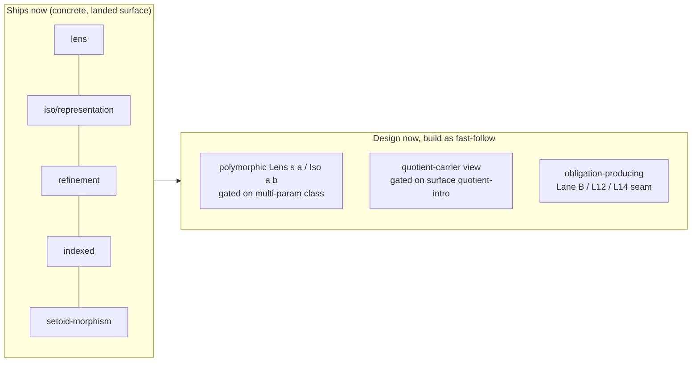

# Collection laws and the view abstraction (CAT-3, Layer 1)

> Status: **DRAFT v0** (CAT-3). This chapter is the **contract** for Layer-1
> collections' laws-as-propositions and the agent-facing **view** abstraction
> (the catalog's "view" unit). It **inherits `55`'s lawful-class template
> unchanged** (`55 §3.1`/`§3.2`/`§4`/`§5.2`): laws are `Ω` propositions **proved
> over inductive carriers, zero `Axiom`, zero `trusted_base()` delta**, by the
> two-line induction+`cong` grammar with **per-branch `tt`-vs-`Refl`** endpoint
> discrimination. **CAT-2-independent** — collection laws are value-level, no
> `Monad` needed. **Kernel-untouched, outer-ring.** Three design forks are
> resolved here (Architect, `main@9fe9617`): **A** `Perm` = count/multiset-
> equality (`Ω`-native), **B** the view is a plain `Σ`-record for the concrete
> flavors that ship now, **C** the family is named `view` (flagship `lens`),
> the operator's call. The `.ken` proofs + any polymorphic-view
> elaborator support are the **Language build**, held for the GPT window; this
> chapter is the elaboration.

## 1. What CAT-3 inherits from CAT-1 (`55`)

Every law below is authored to the same four points CAT-1 pinned, so nothing is
re-litigated:

1. **`Ω` law fields, no truncation for value/predicate equations** (`55 §4`). A
   length-preservation, decomposition, or count equation is `Equal T u v : Ω` —
   a direct value equation, not a bare `∨`/`∃` whose proof-relevant content
   would need `‖·‖` (`16 §6`). The single exception the frame flagged — `Perm`,
   which is *proof-relevant as a relation* — is handled in `§3.1` by the same
   move the landed `Ord.total` law already uses, **not** by truncation.
2. **Proved by induction + `cong`** (`55 §3.1`): a law over an inductive carrier
   is a recursive `view : Equal …` that `match`es the carrier, closes the base
   directly, and lifts the self-call **IH** under the constructor with `cong`
   (`packages/transport`, `53 §2`).
3. **Per-branch `tt`-vs-`Refl`**, never uniform (`55 §3.2`): a branch closes
   with `tt` when both endpoints reduce to the **same fully-collapsing
   constructor head** — a **nullary** ctor, or one whose components all collapse
   — which goes to `Top` (K7), so the goal is no longer `Eq`-shaped; and with
   `Refl` when they reduce to a **neutral**, *including a non-nullary head with
   a neutral component* (it stays `Eq`-shaped, and `tt : Top` would be ill-typed
   there). The three
   landed list proofs exhibit all three cases and are the working template:
   `list_left_unit → Refl` (definitional, neutral `x`), `list_assoc`'s `Nil`
   base `→ Refl` (neutral `list_append a ys zs`), `list_right_unit`'s `Nil` base
   `→ tt` (constructor `Nil a`).
4. **Reuse, don't re-derive, the append monoid** (`§2.4`): CAT-1's proved
   `list_assoc`/`list_left_unit`/`list_right_unit` are generic in the element
   type and cited, not re-proved.

Surface spelling: SURF-1's `view → const`/`fn`/`proc` migration is a **deferred
build** — on `main` today the lexer recognizes only `view`, and both
`packages/collections/` and `packages/lawful-functors/` are 100% `view`-spelled.
**New CAT-3 ops are written `view`**, matching every landed sibling; the keyword
migration re-spells them uniformly when SURF-1's build lands.

## 2. D1 — Structural collection laws

### 2.1 The landed ops, and the two that are not

Landed in `packages/collections/collections.ken` (exact signatures, all `view`):

```
list_append (a : Type) (xs : List a) (ys : List a) : List a
take        (a : Type) (n : Nat) (xs : List a) : List a
drop        (a : Type) (n : Nat) (xs : List a) : List a
nth         (a : Type) (n : Nat) (xs : List a) : Option a
```

**Not yet landed anywhere in `packages/`:** `map`, `filter`, `mem`, `length`,
`min`. Laws that name them are **red-until-built** (the CAT-1 `Functor` posture
— the law is authored now, the proof lands with the op).

### 2.2 The laws, pointwise, `Ω`

Each law is stated character-for-character (as `55 §5.2` pinned) and carried by
`List` at minimum:

```
-- map length-preservation (RED: map, length unlanded)
(a b : Type) → (f : a → b) → (xs : List a) →
  Equal Nat (length b (map a b f xs)) (length a xs)

-- filter membership characterization (RED: filter, mem unlanded)
(a : Type) → (p : a → Bool) → (x : a) → (xs : List a) →
  Iff (mem a x (filter a p xs))
      (And (mem a x xs) (IsTrue (p x)))

-- take/drop decomposition #1 (GREEN: only landed ops)
(a : Type) → (n : Nat) → (xs : List a) →
  Equal (List a) (list_append a (take a n xs) (drop a n xs)) xs

-- take/drop decomposition #2 (RED: length, min unlanded)
(a : Type) → (n : Nat) → (xs : List a) →
  Equal Nat (length a (take a n xs)) (min n (length a xs))
```

`Iff` / `And` are the `Ω` connectives of `16 §1.3` (`⇔` as mutual `→`; `∧` as
the `Σ`-form); `IsTrue b := Equal Bool b True` is the landed Bool-to-`Ω` bridge
(`51`, `lawful_classes.ken:8`). All four are `Ω`-clean value/predicate
equations, so the truncation catch does not fire (`§1` pt 1).

### 2.3 The provable-now / red-until-built split (sharper than the frame)

The frame names `map`/`filter` as the red ops; grounding sharpens it: **only
decomposition #1 is provable now** — it uses only landed `take`/`drop`/
`list_append`. Decomposition #2 needs **both** `length` **and** `min` (only
`natSub`, saturating monus, is landed — neither `length` nor `min`), so it joins
`map`/`filter`/`mem` in red-until-built. Decomposition #1's proof is a standard
induction on `n`/`xs` closing by the `§1 pt 3` grammar; the red laws are
authored here and discharged when their ops land.

### 2.4 Append monoid — reuse, not re-proof

`Monoid (List a)`'s associativity + unit laws **are** CAT-1's proved
`list_assoc`/`list_left_unit`/`list_right_unit` (`lawful_functors.ken`, generic
`(a : Type) → …`), cited verbatim — no new proof (subsume-don't-proliferate,
frame §2 pin 2). The **parametric instance head** `instance Monoid (List a)`
still does not elaborate on the landed elaborator (free `a` in the head →
`UnresolvedCon`, the `55 §6.1` gap); the landed instance bundles monomorphically
(`Monoid (List Nat)`). So the **generic proofs are reusable today**; the
**parametric `Monoid (List a)` instance form** stays gated on CAT-1-build's
parametric-instance-head piece (`wp/CAT-1-build` D2). This is a
citation-and-gate, not new work.

## 3. D2 — Verified `sort` (the capstone)

### 3.1 Fork A — `Perm` is count-equality (`Ω`-native, not `‖Perm_rel‖`)

A permutation relation is **proof-relevant** — distinct re-orderings are
distinct derivations — so a raw multi-constructor `data Perm … : Ω` is
**inadmissible**: `Ω` proof-irrelevance (`16 §1.2`) collapses the distinct
derivations, and an unrestricted `Type → Ω` admission of a proof-relevant
inductive is exactly what would let `Bool` enter `Ω` and make `true ≡ false`,
breaking consistency (`16 §1.4` + `§1.1`; `§1.3` is the adjacent
*derived-connectives*/truncation home, not this pin). `Perm` is therefore
defined **natively in `Ω` as a count/multiset-equality**:

```
count (a : Type) (eqf : a → a → Bool) (x : a) (xs : List a) : Nat =
  match xs {
    Nil      => Zero ;
    Cons h t => match eqf x h {
                  True  => Suc (count a eqf x t) ;
                  False => count a eqf x t
                }
  }

Perm (a : Type) (eqf : a → a → Bool) (xs : List a) (ys : List a) : Prop =
  (x : a) → Equal Nat (count a eqf x xs) (count a eqf x ys)
```

`count` takes an explicit comparator `eqf : a → a → Bool`, mirroring the landed
`list_eq`/`list_compare` idiom (a comparator argument, not a projected dict).
`Perm` is a `Π` into `Ω` of `Nat`-value-equations, so it lands in `Ω` by the
predicative `max` (`16 §1.1`: `(x : A) → P` with `P : Ω_l` is itself `Ω_l`) —
**zero truncation machinery**, provable by the `§1 pt 2/3` grammar.
(`‖Perm_rel‖` would additionally need relation derivations + truncation
intro/elim, `16 §6` — strictly more machinery for the same `Ω` proposition. It
remains the fallback only for carriers with no decidable element-equality; it is
**not** the pin.)

### 3.2 The `Ord.total` precedent — a soundness move the stdlib already made

Count-equality is not a new trick: it is the **identical move the landed
`Ord.total` law uses**. `lawful_classes.ken` states totality as
`total : (x y : a) → IsTrue (bool_or (leq x y) (leq y x))` — a **decidable
`Bool`-equation** wrapped through `IsTrue`, and its own comment records why: a
*bare* propositional `x ≤ y ∨ y ≤ x` "would be proof-relevant (which side holds
is content) and need `‖·‖` to reach `Ω`," so the decidable `Bool` `bool_or`
sidesteps it. Count-equality does exactly this for permutation: push the
proof-relevant "which reordering" content into a decidable `Nat` count, and keep
the law a value-equation. Same pattern, same soundness argument, already
ratified on `main` — subsume, don't proliferate.

### 3.3 `isSorted`

`isSorted` is a structural recursion into `Ω`, the `∧` of pairwise `le`
(`16 §1.3`, no truncation):

```
isSorted (a : Type) (le : a → a → Bool) (xs : List a) : Prop =
  match xs {
    Nil      => Top ;
    Cons h t => match t {
                  Nil       => Top ;
                  Cons g _  => And (IsTrue (le h g)) (isSorted a le t)
                }
  }
```

### 3.4 The two correctness laws, and the carrier (`List Bool`)

```
sort (a : Type) (le : a → a → Bool) (xs : List a) : List a   -- total, SCT-terminating

-- ordering
(a : Type) → (le : a → a → Bool) → (xs : List a) →
  isSorted a le (sort a le xs)

-- permutation
(a : Type) → (le : a → a → Bool) → (xs : List a) →
  Perm a (eqFromOrd a le) xs (sort a le xs)
```

**Proved carrier is `List Bool`, not `List Int`.** `DecEq Int`/`Ord Int` are
`Axiom`-holed (the `Int` primitive's laws are honest visible postulates), and
`Ord Char` transports those same `Axiom`s — **only `Bool` has a real, `Axiom`-
free `DecEq`+`Ord`** on `main` (K7 wired `Ord Bool`/`DecEq Bool` as
kernel-checked zero-delta proofs). On `List Int` the honest-sort proof cannot be
discharged `Axiom`-free, and the verdict-flip would degenerate to
reject-vs-reject (green-vs-green vacuity). So **D2's proof obligations and D4's
ACCEPT arm carry on `List Bool`**; `List Int`/generic appear only where a law is
comparator-parametric and needs no concrete lawful instance.

### 3.5 `eqFromOrd` — the capstone needs no separate `DecEq`

`count`'s comparator for the `Perm` law is derived from the **same `le` the sort
uses** — no extra dictionary:

```
eqFromOrd (a : Type) (le : a → a → Bool) (x : a) (y : a) : Bool =
  bool_and (le x y) (le y x)
```

For a lawful order this decides `Equal a`: `antisym` gives `eqFromOrd le x y =
True → Equal a x y`, and `refl` gives the converse. `DecEq`'s `sound`/`complete`
fields (`lawful_classes.ken:25`) tie `eq` to kernel `Equal`, so `count` counts
up to *the same* equality the law is about — no equality-mismatch hole (Fork A
pt 3). A standalone generic `Perm` (not via a sort) instead takes a `DecEq a`
parameter directly (landed `51`).

### 3.6 Sort algorithm and termination

**Insertion sort** is the shipped algorithm: `insert le x` walks the list
placing `x` before the first element it is `le`, and `sort` folds `insert` over
the input. Both recursions are **structural** on the list argument
(SCT-terminating on the `Cons`-tail measure, no fuel), so the
`declare_recursive_group` termination gate admits them (the same posture as
landed `take`/`drop`/`nth`). Merge sort is a lawful alternative but its
termination rests on a size measure over the split, not plain structural descent
— deferred as a fast-follow if wanted; insertion sort is the minimal SCT-clean
choice for the capstone.

### 3.7 The verdict-flips (AC4)

Each correctness law flips at its **named field**, specific variant, on `List
Bool`:

- **Non-permuting "sort" (a dedup) fails `Perm`.** For `xs = [True, True,
  False]`, the honest `sort` preserves `count True = 2` and its `Perm` proof
  discharges by induction (the per-branch endpoints — base `count _ Nil = Zero`
  on both sides → `tt`, inductive steps → `Refl`/`cong` — are pinned at build
  with CV, `§1 pt 3`, since `sort`/`count` are red-until-built); a dedup drops
  the count to `1`, so the goal is `Equal Nat 2 1`, uninhabited → **rejected at
  `perm`**.
- **Non-ordering "sort" (identity on a descending list) fails `isSorted`.** A
  descending pair leaves `IsTrue (le h g)` at `IsTrue False`, which is
  uninhabited → **rejected at `isSorted`**; the honest sort reorders so the pair
  reduces to `IsTrue True = Top`, closed by `tt` (constructor-headed, `§1 pt
  3`).

A masked postulate (closing a sort law with `Axiom`) is a non-empty
`trusted_base_delta` (AC2), rejected by the delta gate — the CAT-1/CAT-2 two-arm
net (honest → conversion / masked-`Axiom` → delta-gate → `Bottom`).

## 4. D3 — The view abstraction

### 4.1 Fork C — the name: family `view`, flagship `lens`

The six flavors are the **view** family; the projection flavor is a classic
**lens**. The family name is **`view`** — the operator's veto-window call
(`§90`). It is **not** a collision: SURF-1 **retires the `view` *keyword***
(definitions become `const`/`fn`/`proc`), which **frees the word `view`**, and
`view` is the software-industry-standard term for a read projection — so it is
the best umbrella for the family. Flagship flavor `lens` and the six-flavor
structure (`§4.2`) are unchanged. (This was operator-facing ergonomics — the
same axis SURF-1 routed to the operator — so the enclave pinned the structure
and law forms and the operator picked the token.)

**Build-order note (keyword still lexed on `main`).** The `view` keyword is
**spec-retired** but still recognized by the lexer today (`KwView`; SURF-1's
`.ken` migration is a deferred GPT-window build). So a **capitalized**
family/record type (`View`, like `Functor`/`Lens`) is collision-free and builds
independently; only a **lowercase** `view` identifier would require CAT-3-build
to **sequence after** SURF-1's keyword-retirement build. The concrete records
here take **capitalized type names** (`View`/`Lens`/…) and **no lowercase `view`
field** — the setoid-morphism form's projection field is named `project`, not
`view` (`§4.2`) — so the chapter introduces no `view` identifier at all and is
**build-order-independent**; the Steward tracks the dependency regardless. (The
ops in `§2` are written with the still-live `view` *keyword*, `§1` — that is the
intended use of the keyword on `main`, not a colliding identifier.)

### 4.2 Fork B — the mechanism, per-flavor

The view is **ordinary Ken** — a `Σ`-record bundling operations with their
coherence proofs (the lawful-class *shape*, but a first-class *value*: a type
has many views, so a view is not a resolved instance). Grounded per-flavor
against landed machinery, not hand-waved:

| Flavor | Mechanism (grounded on `main`) | Ships |
|---|---|---|
| **projection (lens)** | `Σ`-record `{ get; set; get_set; set_get; set_set }` over a concrete carrier (`class` landed) | now (D3 mandate) |
| **representation (iso)** | `Σ`-record `{ to; from; to_from; from_to }`, concrete | now (fast-follow) |
| **refinement** | rides landed refinement types `{x:A|φ}` (`ast.rs TRefine`, parser `parse_refinement_type`, `21 §6.1`; lowers to carrier + kernel-re-checked obligation, `21 §6.3`/`22`). A refinement view is a projection whose focus is `{x:A|P x}` | now |
| **indexed** | a key/position view `Key → Option A` / a lens family; plain Ken (full maps are CAT-4) | now |
| **quotient-respecting** | **setoid-morphism form** `{ project : A→B; respects : (x y : A) → R x y → Equal B (project x) (project y) }` — a plain `Σ`-record, **no quotient type needed** (the field is `project`, not a lowercase `view`, so it never collides with the live `KwView` keyword — `§4.1`); **quotient-carrier form** (a view *out of* `A/R`) needs a surface path the parser lacks (`§4.3`) | setoid now; carrier later |
| **obligation-producing** | the Ward / L12 / L14 seam — rides landed refinement-obligation machinery (`capabilities.rs attenuate` already emits a kernel-re-checked refinement obligation). **Boundary only** per frame — state the seam, coordinate Lane B / L12 / L14, do not fully specify | seam stated, deferred |

### 4.3 Concrete now, polymorphic later — the one shared surface wall

The **polymorphic** forms — `Lens s a`, `Iso a b`, `Repr a b` — need a
**two-parameter dependent record** (law fields depending on `get`/`set`), which
landed **surface** Ken cannot express: `class` takes a **single** type parameter
(`parser.rs parse_class_decl`); `data` is multi-parameter but its constructor
arguments are **non-dependent atoms** (`parse_ctor_decl`, no named telescope),
so a law field cannot depend on an operation field; there is no surface `Σ`. One
**bounded outer-ring extension** — a parameter telescope on `class` (a cousin of
CAT-1 `§6`'s higher-kinded piece) — unlocks the entire polymorphic family at
once, **kernel-untouched, no new `Term`/`Decl`** (the kernel already admits
dependent `Σ`).

The frame mandates only the **concrete** lens, so the resolution is:



Both walls — **multi-parameter `class`** and **surface quotient-intro** (the
kernel has `Term::Quot`/`QuotClass`/`QuotElim`, `16 §5`, but the parser has only
refinement, not quotient-intro) — are **design-now, build-later**: they re-fork
to the Steward **when their general forms are built** (AC1), not now. This
chapter ships every flavor **concrete** and states the polymorphic law form.

### 4.4 The lens coherence laws (proved over a concrete carrier)

The shipped projection flavor is a lens onto the first component of a concrete
product `Pair Bool Bool` — `get := pairFst Bool Bool` and `set s b := mkPair
Bool Bool b (pairSnd Bool Bool s)`, over the landed prelude Σ-pair
(`Pair`/`mkPair`/`pairFst`/`pairSnd`, `prelude.rs`; the negative Σ, `13 §6`) —
with the three classic coherence laws, `Ω`-valued and proved by the `§1 pt 3`
grammar:

```
-- get-set: reading back what you set
(s : Pair Bool Bool) → (b : Bool) → Equal Bool (get (set s b)) b
-- set-get: setting what you read changes nothing
(s : Pair Bool Bool) → Equal (Pair Bool Bool) (set s (get s)) s
-- set-set: the last set wins
(s : Pair Bool Bool) → (b c : Bool) →
  Equal (Pair Bool Bool) (set (set s b) c) (set s c)
```

All three close **definitionally** — and all three are `Refl`, **none `tt`**,
precisely because the `Pair` head is **non-nullary with a neutral component**
(`§1 pt 3`): `get-set` computes by Σ-β (`pairFst (mkPair b _) ⇝ b`) to the
neutral `b` on both sides → `Refl`; `set-set` computes by Σ-β to the *identical*
term `mkPair c (pairSnd s)` on both sides → `Refl` (the `mkPair` head does
**not** collapse to `Top` — its component `pairSnd s` is neutral — so `tt : Top`
would be ill-typed); `set-get` holds by **definitional Σ-η** (`mkPair (pairFst
s) (pairSnd s) ≡ s`, `13 §6`), so the goal reduces to `Equal _ s s` → `Refl` —
no `match` on the Σ-pair. No `DecEq`/`Ord` instance is needed (the lens laws are
structural over
`Pair`), so the `§3.4` carrier caveat does not bind here. The polymorphic
`Lens s a` states the same three laws with `s`/`a` abstract, gated on `§4.3`'s
multi-param `class`.

### 4.5 The obligation-producing seam

The obligation-producing flavor — a view whose *use* emits a proof obligation —
is the **Ward / L12 / L14 boundary**. It rides the landed refinement-obligation
machinery (`capabilities.rs attenuate` already emits a kernel-re-checked
refinement obligation at attenuation), so the mechanism exists; but its full
specification belongs to Lane B / L12 / L14, not here. This chapter **states the
seam and stops** (frame §6): an obligation-producing view is a projection whose
`set`/`view` carries a refinement precondition discharged at the use site.

## 5. Derivation paths and `trusted_base()` delta (AC1/AC2)

Every CAT-3 unit is **ordinary Ken over the built-ins**, with its derivation
path stated (the catalog discipline, `README §intro`):

- **D1/D2** — `map`/`filter`/`length`/`min`/`sort`/`insert`/`count`/`isSorted`
  are Ken `view`s over `List`/`Nat`/`Bool` and the landed `collections` ops; the
  laws are Ken proofs over the kernel's `Eq`/`cong`/`match`. Append monoid
  **reuses** CAT-1's proofs. **Zero `trusted_base()` delta; zero `Axiom`** in
  any shipped law (the `List Bool` carrier is what makes this achievable —
  `§3.4`).
- **D3** — the view records and their coherence proofs are Ken `Σ`-records +
  Ken proofs; refinement rides landed `{x:A|φ}`. **Zero kernel diff, no new
  `Term`/`Decl`.** The two design-now/build-later extensions (multi-param
  `class`, surface quotient-intro) are outer-ring (`ken-elaborator`-only) and
  re-fork to the Steward when built.

## 6. Acceptance (mapping to the frame's AC1–AC7)

- **AC1 — kernel-untouched.** No `ken-kernel` diff, no `trusted_base()` delta,
  no new `Term`/`Decl`. The two surfaced elaborator walls are design-now,
  build-later Steward re-forks (`§4.3`), not taken here.
- **AC2 — proved, zero `Axiom`.** Every shipped law is a real kernel proof;
  append monoid reuses CAT-1's proofs; the `List Bool` carrier keeps the sort
  laws `Axiom`-free (`§3.4`).
- **AC3 — `Perm` is `Ω`-sound.** Count/multiset-equality, `Ω`-native, no raw
  multi-ctor `Ω` inductive, no truncation (`§3.1`, grounded on `16
  §1.4`/`§1.1`).
- **AC4 — sort correctness flips.** Non-permuting → fails `Perm`; non-ordering →
  fails `isSorted`; each at the named field, specific variant (`§3.7`).
- **AC5 — laws `Ω`, pointwise, one field.** All laws are `Ω`, stated pointwise,
  one canonical field (`§2.2`, `§3.4`, `§4.4`; `55 §4`/`§5.2`).
- **AC6 — view mechanism grounded.** Enumerated per-flavor against landed
  machinery (`§4.2`); the shipped lens has its coherence laws proved (`§4.4`);
  the name does not collide with the retired `view` keyword (`§4.1`, token to
  Steward).
- **AC7 — green.** `cargo test --workspace` + rosetta corpus green at build; the
  new package(s) under `packages/` carry a MANIFEST + derivation path.
  (Build-time AC, held for the GPT window; the red-until-built D1 laws flip
  green there.)
