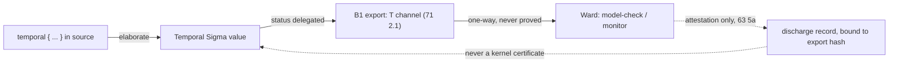

# Temporal obligations as data

> Status: **impl-ready (B2).** Normative for the **discipline** (temporal logic
> is deeply-embedded *data*, not kernel structure), the **about-vs-with**
> boundary, the **`Temporal Σ` datatype** (concept + LTL/μ core + the
> inert-data/strict-positivity property), the **`delegated` export flow** (the
> `T` channel, never `Q`/`P`), and the **reason-about metatheory** (at least one
> verified `Temporal`-level operation). The **exact constructor spelling**, the
> **`Pred Σ` atom language**, the **fixpoint-variable representation**, and the
> **ITF-facing serialization** are an encoding pass with the sibling (`Ward`)
> and are `(oracle)`-tagged. **`OQ-temporal` DECIDED** (operator, 2026-06-27):
> **data-only — no temporal modalities in the kernel.** ADR 0006 (the seam); a
> durable application of Ken's reflect-don't-extend principle, not a v1 hedge.
>
> **B2 scope.** B2 delivers the `Temporal Σ` **datatype** (§3) as ordinary L2
> `data`, the surface `temporal{}` notation → `delegated` (§4), the export flow
> into the **landed B1 `T` channel** (§5, `71 §2.1`), and the reason-*about*
> metatheory (§6) — in `crates/ken-elaborator`/kernel. The `compile`
> faithfulness lemma's **target spelling** (`WardFormula`) and the full
> semantics-preservation proof are the **joint Ward encoding pass** (§6.3); B2
> pins their *shape*. **No kernel enlargement**: `Temporal` is an ordinary
> strictly-positive inductive admitted by K1 — nothing touches conversion or
> the judgmental structure (§7).

## 1. The decision: state temporal properties, do not modalize the kernel

Ken **states** a temporal/behavioral property — "eventually settled", "never two
leaders", "every request is eventually answered" — as an ordinary
**deeply-embedded inductive value**: a `Temporal` datatype (LTL / μ-calculus,
§3) with surface notation (§4) elaborating to it. The value is then **exported**
(`71`) and discharged by `Ward` (model-checking + monitoring), **not** in Ken.

Ken does **not** gain a guarded/`▷`-modal layer in its trusted core — no "later"
modality, tick variables, Löb rule, or clock structure. That would add new
judgmental structure and new metatheory (guarded recursion's normalization,
productivity) to the kernel — precisely the kind of TCB growth and adversarial
surface that ADR 0005 rejected cubical to avoid. Temporal modalities are the
*other fragment* (`README §1`).

This is **durable, not a v1 expedient.** It is:

- **The consistent application of Ken's deepest principle** — *deep-embed and
  reason reflectively rather than grow the trusted core*: OTT's `Eq`-as-data
  over cubical primitives (ADR 0005); reflective `decide`/certificate-checking
  over trusting Z3 (`OQ-12`); `Temporal`-as-data here. Same move, three times.
- **The semantic decomposition that justifies the seam** — behaviors-over-time
  form a topos (Temporal Type Theory); Ken occupies the **static,
  propositional** fragment and `Ward` the **temporal/modal** fragment of *the
  same* logic (`README §1`). A temporal modality in Ken's kernel is Ken reaching
  into `Ward`'s fragment, collapsing the decomposition that keeps Ken small.
- **The right division of labor** — liveness/fairness/eventual-consistency over
  infinite behaviors and interleavings is automata-theoretic / model-checking
  territory (Apalache/TLA decide what is brutal-to-impossible in interactive
  proof). Internal temporal proof would re-implement, worse, what `Ward` does
  well.

## 2. The boundary: reason *about* formulas, not *with* modalities

Data-only does **not** make Ken helpless about temporal logic. Because
`Temporal` is ordinary inductive data, Ken's existing static logic can prove
properties **about** temporal formulas. The line is precise:

> Ken reasons **about** temporal formulas (they are data); Ken does **not**
> reason **with** temporal modalities (no `▷` in the judgment).

| Ken **may** (static propositions over the `Temporal` datatype) | Ken **may not** (needs the temporal model — `Ward`) |
|---|---|
| Prove a formula transformation preserves semantics (e.g. an LTL→NNF rewrite) | Discharge `□(req → ◇resp)` against a system's behaviors |
| Prove a normalization/`simplify` is sound and terminating | Decide liveness/fairness, or find a fair-interleaving counterexample |
| Prove an exported obligation is well-formed / closed | Establish refinement (does the implementation refine the model) |
| Derive one obligation from others by sound `Temporal`-level lemmas | Anything quantifying over infinite traces of a *concrete system* |

So a Ken library can carry verified *operations* on temporal formulas (the
metatheory of the embedding, §6), while the obligations those formulas denote
are delegated. The proofs Ken does here are unremarkable static proofs about an
inductive type — no new kernel power.

**The line, stated mechanically (for §6 and §7).** What separates "about" from
"with" is **not** whether a proof mentions traces — a semantics-preservation
lemma quantifies over traces and is still *about*. The discriminator is:

- **Reason-*about*** is metatheory of the *embedding* — a property of the
  `Temporal` **syntax** (well-formedness, a transformation's soundness, an
  equivalence of two formulas) proved by **ordinary `elim`** over the inductive
  type. Even when it ranges over a deep-embedded satisfaction relation, that
  relation is itself ordinary data (§6.2 / §8, the contained reflective model) —
  defining it adds **no** judgmental modality.
- **Reason-*with*** is what Ken refuses: a **judgmental** `▷`/later modality in
  the kernel, **or** *discharging* a stated obligation against the behaviors of
  a concrete system (deciding `□(req → ◇resp)` of *this program*, liveness,
  fairness over its infinite traces). That is `Ward`'s, by classical
  model-checking (`71 §5`).

## 3. The `Temporal Σ` datatype

`Temporal` is a deeply-embedded logic over the **effect/event alphabet** `Σ`
(the interaction-tree perform-node signatures — the `Effect` container's
`Op`/`Resp`, `36 §2`; the same `Σ` the B1 export's `alphabet` field carries, `71
§2`). Its atoms are exactly the events `Ward` monitors. It is declared as
**ordinary L2 `data`** (`14 §1`), parameterized by the alphabet:

```
data Temporal (Σ : Alphabet) : Type ℓ where
  atom   (p : Pred Σ)              -- a state/event predicate over the alphabet
  not    (φ : Temporal Σ)
  and    (φ ψ : Temporal Σ)
  or     (φ ψ : Temporal Σ)
  next   (φ : Temporal Σ)          -- ◯ / X
  until  (φ ψ : Temporal Σ)        -- φ U ψ
  -- μ-calculus extension (properties beyond LTL):
  mu     (X : Var) (φ : Temporal Σ) -- least fixpoint    (X guarded in φ)
  nu     (X : Var) (φ : Temporal Σ) -- greatest fixpoint
  var    (X : Var)
```

The **derived operators** elaborate to this core (they are not constructors —
AC2 asserts the elaborated term is built from `until`/`not`):

```
◇φ  := until (atom ⊤) φ                 -- eventually  (true U φ)
□φ  := not (until (atom ⊤) (not φ))     -- always      (¬◇¬φ)
p ~> q := □ (not p `or` ◇q)              -- leadsto     (always (p → eventually q))
```

### 3.1 What is pinned vs. deferred (defer-spelling-not-concept)

**Pinned (normative, conformance-checkable):**

- **The LTL/μ core's value-set and meaning** — a propositional/temporal logic
  closed under boolean connectives, `next`, `until`, and least/greatest
  fixpoints, with `◇`/`□`/`leadsto` derived from `until` (above). A conforming
  encoding must denote *these* operators with *these* meanings.
- **It is a normal inductive type, inert to the kernel** — `Temporal Σ` is
  declared by the **landed L2 `data` machinery** (`14`), elimination is the
  ordinary generated `elim_Temporal`, and **nothing about it touches conversion
  or judgmental structure** (§7).
- **It is plainly strictly-positive — admitted by K1, no extension needed.**
  Every recursive occurrence above is **direct** (`Temporal Σ` in a
  strictly-positive position; `Pred Σ` and `Var` are non-recursive parameters).
  There is **no Π-bound/branching recursive occurrence**, so admission does
  **not** rely on the K1.5 W-style extension (`14 §2.1`) — `Temporal` is the
  most basic inductive shape, admitted by K1's strict-positivity check (`14
  §2`).
- **Fixpoint variables are first-order, not HOAS** — `mu`/`nu` bind a `Var` (a
  name or de Bruijn index) and `var X` refers to it; the body is a plain
  `Temporal Σ`. This is **load-bearing**, not incidental: a HOAS encoding (`mu :
  (Temporal Σ → Temporal Σ) → …`) would put `Temporal Σ` in a **negative**
  position and **break strict positivity** — the kernel would reject it (`14
  §2`). The deferred encoding pass **must** preserve first-order binding; the
  exact `Var` representation is its choice.

**Deferred (`(oracle)`-tagged — the Ward encoding pass, §6.3):**

- The **exact constructor set and spelling** — whether duals are primitive
  (`release` for `¬(φ U ψ)`, a `weak-until`) or derived; the surface keyword for
  each constructor.
- The **`Pred Σ` atom language** — how a state/event predicate over the `Σ`
  alphabet (`36 §2`: the `Op`/`Resp` perform-node signatures) is written and
  what it ranges over (events only, or events + observable state). Pinned: atoms
  are predicates over the **B1 `Σ`** (`71 §2`), no second alphabet.
- The **fixpoint-variable discipline's exact form** — named vs de Bruijn, and
  the *guardedness* well-formedness condition on `mu`/`nu` (X occurs under a
  `next`), beyond "first-order" above.
- The **ITF-facing serialization** of a `Temporal` value (the wire form `Ward`
  parses; couples to `71 §3`'s contract layer).

The deferral follows *contract-spec: defer spelling, not concept* — lock the
value-set, the inert-data property, the strict-positivity constraint, and the
first-order-binding constraint; oracle-tag the literal spelling. A rename after
the spelling binds is a breaking change to the export contract (`71 §3.3`).

## 4. Surface `temporal{}` notation → `delegated`

A `temporal { … }` block (or a `delegated`/`assume` clause carrying a temporal
formula, `../20-verification/21 §5`) provides readable notation elaborating to
the `Temporal` constructors (§3):

| Surface (sketch — keywords `(oracle)`, `OQ-syntax`) | Elaborates to |
|---|---|
| `always φ` | `□ φ` ⇒ `not (until (atom ⊤) (not φ))` |
| `eventually φ` | `◇ φ` ⇒ `until (atom ⊤) φ` |
| `next φ` | `next φ` |
| `φ until ψ` | `until φ ψ` |
| `p ~> q` (`leadsto`) | `□ (not p or ◇ q)` |

Such a claim is:

- **tagged `delegated`** in the four-way epistemic status (`21 §5.2`:
  `proved`/`tested`/`delegated`/`unknown`) — `delegated` is the status for a
  temporal/behavioral property Ken **states but does not discharge** (`21
  §5.2`). It adds **nothing** to Ken's trusted base — it is exported, not
  assumed (it is **not** `tested`/`P`) and not closed (it is **not**
  `proved`/`Q`);
- **human-visible** in source (it appears verbatim, not erased — a reader sees
  exactly which behavioral properties were stated and delegated); and
- **flows into the export** (§5) as the `T` channel.

The concrete keywords/layout settle with the surface-syntax pass (`OQ-syntax`);
pinned here is the *elaboration target* (the §3 constructors) and the *status*
(`delegated`), not the spelling.

## 5. Export flow — the `T` channel (`delegated`, never `Q`/`P`)

A `Temporal` value stated in source flows into the **landed B1 export** (`71`)
as the **`T` (obligations)** field — the channel B1 fixed for exactly this
purpose (`71 §2.1`, §5.2). The classification is **pinned at the source** (no
verdict-mapping silence for the conformance author to fill — promoted V3):

> A `Temporal` obligation's export status is **`delegated`**, and its field is
> **`T`** — **always, and only**. It is **never** `proved`/`Q` (Ken did not
> discharge it), **never** `tested`/`P` (it is a stated property, not an
> `assume` or a typed hole), and **never** `unknown` (it is a deliberate
> delegation, not an open goal). The mapping is total and constant:
> `Temporal`-in-source ↦ `delegated` ↦ `T`.

This is the **one-way gate** (`71 §5.1`, invariant **I4 — delegated never
proved**): even after `Ward` discharges the obligation (a depth-`k` model-check,
a green monitor run), the result **never re-enters Ken as a proof** and the
entry **stays `delegated`** — a green check is *evidence for* a `delegated` `T`,
never a *promotion* of it (`71 §3`, `§5`). The discharge is recorded out-of-band
as a lower-trust attestation bound to the export hash (`63 §5a`), not as a
kernel certificate.

The exact field token is `(oracle)`-tagged by B1 (`71 §3.1`: `T` /
`obligations`); B2 emits the **values** (the `Temporal` data + their `delegated`
status, ranging over the shared `Σ`). The wiring target is the **real** B1
emitter (`crates/ken-elaborator`, `export.rs`) — AC4 routes a real `temporal{}`
claim through it and observes a `delegated`/`T` entry, never a synthetic export
literal.



## 6. Reason-*about* operations — the metatheory of the embedding

Because `Temporal` is ordinary data, a Ken library carries **verified operations
on temporal formulas** — the about-the-formulas power of §2. B2 delivers at
least one such operation, proved sound by **ordinary static proof over the
inductive type**, demonstrating reason-*about* without reason-*with*. Two faces
of correctness, of different buildability, plus the seam-level lemma:

### 6.1 Buildable-now deliverable — a structural metatheorem (no trace model)

The mandated verified operation needs **only the pinned §3 core** and **no
satisfaction/trace semantics** — it is unambiguously reason-*about* and lands
without waiting on the Ward encoding. The canonical choice is a
**closedness/well-formedness** metatheorem (the "prove an exported obligation is
well-formed/closed" row of §2):

- `closed : Temporal Σ → Bool` — `true` iff every `var X` occurs under a binding
  `mu`/`nu X` (a structural recursion with a binder environment, ordinary
  `elim_Temporal`).
- **Metatheorem (proved by `elim`):** the elaboration of a `temporal{}` block
  (§4) yields a `closed` formula (every fixpoint variable is bound), and
  `closed` is **preserved** by the structural operations (`next`/`and`/`or`/…
  build `closed` from `closed`). No trace, no modality — a plain induction over
  the datatype.

Equivalently a normalization `simplify`/`nnf` rewrite may be delivered, with its
**structural** correctness pinned the same way (output in a normal form, by a
decidable structural predicate; idempotent) — buildable now on the pinned core.
(Its *semantic* correctness is §6.2.)

### 6.2 The semantics-preservation face — the contained reflective model

The deeper reason-*about* property — a transformation **preserves semantics**
(`φ = simplify φ`) — is sanctioned (§2 table) but rests on a **satisfaction
relation** `sat : Behavior Σ → Temporal Σ → Prop`. Crucially, `sat` is itself an
**ordinary deeply-embedded definition** — the *contained reflective model* of §8
(the `OQ-12` move): a recursive `Prop`-valued function over the deep-embedded
behavior type, **not** a judgmental modality. Defining `sat` and proving `∀ σ.
sat σ φ ↔ sat σ (simplify φ)` by induction on `φ` is reason-*about*; it gives
the kernel **no** new power and does **not** let Ken discharge `□(req → ◇resp)`
of a concrete program (that quantifies over a *system's* behaviors — §2,
reason-*with*, Ward's).

The exact shape of `sat` (finite vs ω-behaviors; the μ/ν fixpoint
interpretation) **couples to the Ward encoding** and is `(oracle)`-tagged with
§3's deferral. B2 **pins** that `sat`, when defined, is a deep-embedded function
(not kernel structure); it does **not** mandate the full semantics-preservation
proof as buildable-now (that waits on the encoding pass). The buildable-now
deliverable is §6.1.

### 6.3 The seam-level instance — the `compile` faithfulness lemma

The export's property translation `compile : Temporal Σ → WardFormula` (`71 §5`)
is the **seam-level** reason-*about* operation: a structural map whose
faithfulness `φ = compile φ` over `Σ`-behaviors is proved **once, at the
compiler level** (amortized to zero per obligation — every delegated property
reuses the one lemma), the exact analog of the prover's Kripke-adequacy lemma
(`../20-verification/23 §4`). It is **one of the two sibling `compile`
projections** — distinct from B3's `compile : Temporal Σ → Monitor` runtime
synthesis (`73 §2.4`); they share the `Temporal Σ` source and the `Σ` alphabet,
not a function. Per `71 §5.2` this lemma is **B2/B3-owned**: B2 supplies the
`Temporal` datatype it is stated over and **pins its shape** (above); the
**target spelling** `WardFormula` and the full proof are the **joint Ward
encoding pass**, `(oracle)`-tagged. B2 does not re-litigate the `T` channel or
the `Σ` alphabet (B1 fixed both, `71 §5.2`).

## 7. No kernel modality — the structural absence

The durable core decision (§1) is realized as an **absence in the kernel**, and
B2 asserts it structurally rather than by prose:

- **No modal construct exists in the kernel.** There is **no** `▷`/later
  modality, **no** tick variable, **no** Löb rule, **no** clock structure, and
  **no** temporal judgment form — the conformance net is a **grep-for-forbidden-
  construct** over the kernel (`crates/ken-kernel`): the named constructs are
  **absent**, a guard-gated absence (AC1), not "the happy path avoids them".
- **`Temporal` is inert to conversion.** `Temporal Σ` is consumed only by the
  ordinary generated `elim_Temporal` (`14 §3`); it introduces **no** new
  conversion/η rule, **no** reduction outside ordinary ι, and **nothing** in the
  judgmental structure changes. Adding `Temporal` to a program leaves the
  kernel's conversion algorithm and typing judgments byte-for-byte the rules
  they were without it.
- **The two faces of AC5.** A static proof **about** a `Temporal` formula (§6)
  type-checks (ordinary data); and there is **no way** to discharge the temporal
  obligation *itself* inside Ken (no modality, no internal model-check) — both
  faces are asserted, so "reason-about works" and "reason-with is impossible"
  are each pinned.

## 8. The revisit-trigger (and the principled response)

The one thing data-only gives up: **unbounded** liveness — "no deadlock for
**all** `N`", where model-checking covers only `N ≤ k`. If that becomes
load-bearing, the response is **not** kernel modalities. It is a **contained
reflective model**: define the temporal semantics in the deep embedding (the
`sat` of §6.2) and prove the property *in that model* with Ken's existing logic
(the same reflection-over-extension move as `OQ-12`), weighed explicitly against
TCB cost. The exception is handled by the existing principle, not by abandoning
it (`../90-open-decisions.md`, `OQ-temporal`).

## 9. What this area delivers, and its acceptance

The `Temporal Σ` datatype (§3) as an ordinary L2 inductive; the surface notation
(§4) + its elaboration to the constructors with the `delegated` tag; the export
flow into the B1 `T` channel (§5); at least one verified reason-*about*
operation (§6.1); and the structural no-kernel-modality assertion (§7). A stdlib
home for *verified* `Temporal` operations (the about-the-formulas metatheory) is
the natural follow-on. Conformance: `../../conformance/behavioral/temporal/`.

**Acceptance criteria** (names align with the frame's AC1–AC5):

- **AC1 (`Temporal` is ordinary inert data — the durable headline,
  structural).** `Temporal Σ` is a normal inductive with ordinary
  `elim_Temporal`; the kernel gains **no** modal judgment — the
  grep-for-forbidden-construct net asserts the **absence** of any
  `▷`/later/tick/Löb/clock construct, and conversion/judgmental structure is
  unchanged (§7).
- **AC2 (derived operators).** `◇`/`□`/`leadsto` elaborate to the `until`/`not`
  core (a **structural** assertion on the elaborated term, §3).
- **AC3 (surface → `delegated`).** A `temporal{}` claim elaborates to the §3
  constructors and is tagged **`delegated`** (`21 §5.2`), human-visible (§4).
- **AC4 (export flow, never `Q` — discriminating).** A `Temporal` value flows
  into the **real** B1 export (`71`) as the **`T`/`delegated`** channel and is
  **never** projected to `Q` or `P`; routed through the actual emitter, the
  status is `delegated`, **never** `proved` — the same obligation stays
  `delegated` even after a green `Ward` result (the one-way gate, `71 §5.1`/I4).
- **AC5 (reason-*about*, not *with*).** A static proof **about** a `Temporal`
  formula (§6.1 — the closedness/well-formedness metatheorem) type-checks as
  ordinary `elim` over the inductive type; and there is **no** way to discharge
  the temporal obligation itself inside Ken (no modality) — **both** faces
  asserted (§7).

**Conformance / QA gate.** The datatype routes through the **real**
`elim_Temporal` (no synthetic `Temporal` literal where a real elaboration is
asserted); the export flow through the **real** B1 emitter; the no-modality net
is the absence-grep over the kernel; and the cross-case sweep asserts the
constant verdict mapping (every `Temporal` obligation ↦ `delegated`/`T`, never
`Q`/`P`).
