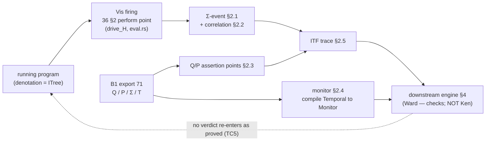

# Trace conformance — Ken's observability contract

> Status: **impl-ready (B3)**. Normative for **Ken's half** of the Ward runtime
> seam — what Ken emits so a downstream engine can check that a *running* system
> refines the model. The conformance engine, its mode (gate / monitor / both),
> and its failure response are **out of scope** (a downstream consumer's policy,
> §4). **`OQ-conformance` DECIDED** (operator, 2026-06-27): Ken provides
> **observability in the model's vocabulary** — a trace/instrumentation contract
> — and nothing about the checking mechanism. ADR 0006.
>
> **B3 scope.** B3 fixes the **trace/instrumentation contract** that completes
> the seam with B1: the concrete **`Σ`-event schema** at the effect boundary
> (§2.1), the **correlation keys** for multi-`space` traces (§2.2), the runtime
> **`Q`/`P` assertion points** (§2.3), the **monitor projection** from `T`
> (§2.4), and **ITF serialization** (§2.5), with the **cross-field invariants
> TC1–TC5 locked** (§2.6) and the literal wire **spellings `(oracle)`-tagged**
> (Ward finalizes the token; Ken locks the concept + the content-hash discipline
> it inherits from `71 §3.3`). **No new kernel rule** — the contract is an
> **untrusted projection** of already-verified content plus runtime
> instrumentation, exactly like the B1 emitter (`71 §6`); it adds nothing to the
> TCB, and the `Σ` it concretizes inherits the `ITree` level forced at
> `36 §2.1` (predicative `max`, non-cumulative — reconciled, not re-derived).
> **B2 dependency (`72-temporal.md` is DRAFT v0):** B3 pins the monitor
> projection over the **`T` channel B1 fixed** (`71 §5.2`) and `(oracle)`-tags
> the `Temporal` **surface** (constructors, the concrete `compile` signature);
> the full `compile` faithfulness lemma is **deferred to B2** (§2.4).
> Perishable: project from the **landed** B1 export (`71` /
> `ken-elaborator/src/export.rs`) and instrument the **landed** `36 §2` perform
> points — pin against the code, not this prose (reconcile-against-landed-code).

## 1. The question Ken answers

Translation faithfulness (`71 §5`) reduces "the model means the code" to two
parts: the model has **no authoring drift** (it is *generated*, `71 §1`), and
the running code **stays within it** (trace conformance — do the program's
actual behaviors refine the model's allowed ones?). This chapter is the second
part, but only **Ken's contribution** to it:

> Ken's responsibility is to make the running system **observable in the model's
> own vocabulary** (`Σ`). It does **not** check conformance, choose where the
> check runs, or decide what happens on a violation — those belong to a
> downstream consumer (§4).

Almost everything a conformance engine needs is **already in the `71` export**
(it is consumer-agnostic): `Σ` is the event alphabet, `T` synthesizes the
monitors, `Q`/`P` are the invariants/assumptions to watch. The one thing runtime
conformance needs that the offline consumers did not is a **concretization of
`Σ` for a live system** — the contract below. The B1 export's `Σ` is the
**static alphabet** (which perform-nodes a program *can* perform — landed at
effect-label granularity, `71 §2.1`, `export.rs`); B3 adds the **per-firing
event record** (what a perform-node *emits when it fires at runtime*). That
event record is the new artifact (§2.1); everything else in the contract is a
**projection** of the existing export.

## 2. The trace/instrumentation contract

A companion to the `71` export, **generated** from the program (same
no-overclaim property — it projects already-verified content and cannot assert
more than Ken established). It carries five parts, each pinned below: the
`Σ`-event schema (§2.1), correlation keys (§2.2), runtime `Q`/`P` assertion
points (§2.3), the monitor projected from `T` (§2.4), and ITF serialization
(§2.5). The cross-field invariants any conforming contract must satisfy are
locked in §2.6.

The instrumentation sits at the **effect boundary** and nowhere else: the
interaction-tree **perform points** (`OQ-8`, `36 §2`) — concretely, the single
`Vis e k` site in the runtime's handler-driving loop
(`drive_H`, `crates/ken-interp/src/eval.rs`: *perform `e`, observe, resume with
`k`*). That set is already-existing, small, and well-defined, which is why
runtime overhead is **instrumentation-dominated and bounded**, not pervasive
code rewriting (TC2). A trace **event** is emitted **exactly once per `Vis`
firing**; pure reduction steps (`Ret`, β, ι) emit nothing.

### 2.1 The `Σ`-event schema — the field-level record per perform-node

The new artifact. When a perform-node `Vis e k` fires, the instrumentation emits
**one event** — the runtime concretization of the `Σ` member that node belongs
to. The B1 export's `Σ` names *which* effects/ops can fire (the static
alphabet); the event record carries *what happened* on a given firing. The
**locked** field-set (concept + value-set; literal keys `(oracle)`-tagged,
defer-spelling-not-concept):

| Field (concept) | Carries | Source / value-set |
|---|---|---|
| **effect symbol** `E` | which `Σ` member fired | a member of B1's `Σ` (`71 §2.1`); **TC1** alphabet closure |
| **operation** `op` | which `Op` of `E` (`Console.Write`, `State.Get`) | the perform-node's `Op` tag (`36 §2.1`) — the signature B1's label abstracts |
| **op argument** | the constructor data the op carries (the `String` of `Write`, the `S` of `Put`) | an ITF **witness** value (`71 §3.2`) — no epistemic status |
| **response** | the runtime's `E.Resp op` returned to `k` | an ITF **witness** value — no epistemic status |
| **correlation keys** | space identity + message provenance | §2.2 |
| **sequence position** | per-space emission order | a monotone index within a space, so the monitor can order a per-space trace |

- **The op/response carry *values*, so they are witnesses, not claims** (ITF
  layer, `71 §3.2`): an event has **no** epistemic status — it is never tagged
  `proved`/`tested`/`delegated`. A green trace is *evidence for* a `delegated`
  `T`, **never a promotion** of it (the one-way gate, §3, TC5). This is the
  load-bearing seam-soundness property of the trace layer, stated at the source.
- **One concretization, no second alphabet (TC1).** The event's `effect`/`op`
  fields are the runtime image of a B1 `Σ` member's perform-node signature — the
  monitored vocabulary **is** the interaction tree's `perform` nodes
  (`36 §3.1` guarantee 2). The event schema does not introduce an event the
  static `Σ` cannot name, and every `Σ` member is a perform point that *can*
  emit (no orphan event symbol; no unreachable `Σ` member). This is the runtime
  mirror of B1's alphabet-closure invariant I3.
- **Reconcile note (landed granularity).** B1's `Σ` lands at **effect-label**
  granularity (`BTreeSet<String>` over `EffectName`, `export.rs`); the per-op
  `Op`/`Resp` *signature* detail the spec narrative ascribes to `Σ` (`71 §2`) is
  concretized **here**, in the event `op`/`response` fields. Team Kernel builds
  the event schema as the place that detail lands — it is **not** already
  emitted by the B1 alphabet. (A build that assumes B1's `Σ` already carries
  `Op`/`Resp` fields would mis-scope the work; pin against `export.rs`.)

### 2.2 Correlation / identity keys

In a multi-`space`, message-passing system (`OQ-Space`, `36 §4`), events from
different spaces must **correlate** so a monitor can reconstruct a coherent
global (or per-space) trace. Offline model-checking glossed this; a live monitor
cannot. The **locked** correlation-key set:

- **Space identity** — the `space` the event fired in. Each `space` desugars to
  **one** effect label (`36 §4.1`), so a space identity is well-defined for
  every perform-node and present on **every** event. Events sharing a space
  identity, ordered by their sequence position (§2.1), form that space's
  **per-space trace**.
- **Message provenance** — on a cross-space **send**/**receive** event. Spaces
  are **shared-nothing**, communicating only by passing immutable,
  content-addressed values (`36 §4.4`); the message value's **content address**
  (`41 §3`) is the natural provenance token, linking the sender's send event to
  the receiver's receive event. A monitor stitches per-space traces into a
  **global trace** along these matched provenance tokens.

The keys are **complete by construction (TC3):** space identity rides every
event; message provenance rides every cross-space message event — enough to
place each event in its per-space trace and to stitch the global trace. A
monitor that loses a key cannot reconstruct the trace — the discriminating
content of AC3 (correlated events link; uncorrelated ones do not).

### 2.3 Runtime forms of `Q`/`P` — assertion points

The proved invariants `Q` and boundary assumptions `P` of the B1 export are
**projected** to runtime-checkable **assertion points** at the sites they apply
— Ken **emits** the points; the engine **runs** them (Ken does not check, §4):

- A **`Q`** (a proved postcondition or per-`space` invariant) projects to a
  **watched-invariant** assertion at its point (a space invariant is watched at
  each operation on that space; a postcondition at the function boundary). The
  proposition asserted **is** the `Q` entry's goal from the B1 export — not a
  re-authored predicate.
- A **`P`** (a boundary assumption: a `trusted_base_delta` postulate, an
  explicit `assume`, a boundary label) projects to a **confirm-held** assertion
  at the boundary it guards — the monitor confirms the assumption held on this
  run.

**Projected, never re-authored (TC4).** The assertion set is the image of the B1
export's `Q`/`P`; it **changes when the export's `Q`/`P` change** (a re-authored
assertion list would not). A `Q` the monitor finds **violated** at runtime is a
**conformance violation** surfaced to the consumer (the code diverged from the
proved model, or a `P` it relied on was breached) — it is **not** a
re-verdict of Ken's `Q`: Ken proved "**given** `P`, **then** `Q`" and a runtime
violation means an assumption failed, never that the kernel certificate was
wrong (§3). Pinning what a monitor outcome maps to — evidence for a `delegated`
obligation on accept; a consumer-side violation signal on reject; **never** a
change to Ken's epistemic status either way — is settled here so no consumer (or
conformance author) fills it differently.

### 2.4 The monitor projected from `T` (`compile : Temporal Σ → Monitor`)

The delegated temporal obligations `T` (`72`) synthesize to **monitors**
(LTL → Büchi, `README` L3) — **projected** from the export's `T`, never
re-authored. This is B3's home for the **monitor-synthesis sibling** `compile :
Temporal Σ → Monitor` — distinct from `71`'s `→ WardFormula` property
translation (`72 §3`), **not** a second "direction" of one function — whose
faithfulness lemma B1 deferred to B2/B3 (`71 §5.2`):

```
compile : Temporal Σ → Monitor       -- the monitor projection (B3's home)
```

- **Same alphabet.** The monitor reads exactly the §2.1 trace events — its atoms
  are predicates over `Σ` (`72 §3`: `Temporal` ranges over the perform-node
  alphabet), so monitor and trace are two projections of **one** export, with no
  separate model to keep in sync (AC1, AC5).
- **Projection, not authoring (TC4).** The monitor **is** the image of `T`; it
  **changes when `T` changes** (AC5) — a hand-written monitor would not. No
  separately-authored behavioral model exists.
- **B2-gated, partitioned (the staging discipline).** What is **buildable now**
  on the **landed** B1 `T` channel: the projection *as a projection* — the
  monitor derives structurally from the export's `T` entries (`71 §5.2`: the
  `delegated` values + status + the `Σ` they range over). What is **deferred to
  B2**: the concrete `Temporal` **datatype** (constructors, the `Pred Σ` atom
  language — `72 §3`, an encoding pass) and the **full `compile` faithfulness
  lemma** (the structural induction `φ = compile φ` over `Σ`-traces,
  `71 §5`, the analog of the prover's Kripke-adequacy lemma). The `Temporal`
  surface and the concrete `compile` signature are **`(oracle)`-tagged** here;
  Team Kernel builds the projection plumbing against the landed `T` channel and
  stubs the `Temporal` body to B2, exactly as the B1 `TEntry` does
  (`export.rs`: the channel is fixed, the `Temporal` value body is a B2/B3
  placeholder). This partition — buildable-now vs B2-gated — is declared so the
  build is not blocked on B2 for the contract, only for the lemma.

### 2.5 ITF-compatible serialization

The trace serialization is **ITF-compatible** (`71 §3.2`, Apalache/Quint's
*Informal Trace Format*) so the **same format spans B1's counterexamples and
B3's live traces** — one wire form, read by Ward's downstream tools
(Quint/Apalache/MOP) with no bespoke format to maintain. Reuse B1's trace layer;
do **not** invent a second. The live-trace form is **content-hashed** under the
same canonical-form discipline as the B1 contract (`71 §3.3`): deterministic
field/entry order, no timestamps in the hashed form — so a rename of a literal
key after the spelling binds is a **breaking change** (a new hash). Literal
field spellings are **`(oracle)`-tagged** — Ward finalizes the wire token; Ken
fixes the concept, the value-set, and the stability discipline.

### 2.6 Locked vs deferred, and the cross-field invariants

**Locked (normative, checkable):** the five-part contract (§2.1–§2.5)
and each part's **value-set**; the **correlation-key set** (§2.2); that runtime
`Q`/`P` assertions and the monitor are **projections** of the B1 export (§2.3,
§2.4); the **cross-field invariants TC1–TC5** below; the **content-hash
stability discipline** inherited from `71 §3.3`.

**Deferred (`(oracle)`-tagged):** the **literal serialized keys** for the event
fields and the contract parts; the concrete `Temporal` **surface** + the
`compile` signature (§2.4, B2). Conformance pins the value-set + invariants and
`(oracle)`-tags the literal key (`conformance-assert-at-locked-granularity`).

**Cross-field invariants (the consistency net — conformance asserts each):**

- **TC1 — alphabet closure (events ⊆ `Σ`).** Every emitted event's `effect`/`op`
  symbol is a member of B1's `Σ`; and every `Σ` member is a perform point that
  *can* emit — no orphan event symbol, no unreachable `Σ` member. The event
  schema is a 1:1 image of `Σ`, no second alphabet. (AC1; runtime mirror
  of B1 I3.)
- **TC2 — effect-boundary containment.** A trace event is emitted **only** at a
  perform point (the `Vis` firing); **no** event comes from a pure reduction
  step. Bounded overhead is a **structural absence-assertion** — instrumentation
  lives at the one boundary site, nowhere else. (AC2.)
- **TC3 — correlation completeness.** Every event carries space identity; every
  cross-space message event carries message provenance — sufficient to place the
  event in its per-space trace and to stitch the global trace. Removing or
  corrupting a key breaks reconstruction. (AC3.)
- **TC4 — projection, not authoring.** The runtime `Q`/`P` assertion points and
  the monitor are images of the B1 export's `Q`/`P`/`T`; they **change when the
  export changes**. No separately-authored model. (AC4, AC5.)
- **TC5 — one-way / emit-only.** The contract is **emit-only**: there is **no
  ingest path** by which a monitor/engine verdict re-enters Ken as a `proved`
  status. A `delegated` `T` stays `delegated` regardless of monitor acceptance;
  a trace event (a witness) is never a claim. (AC6; reuses B1's §5.1 gate, I4.)

## 3. The refinement relation and seam soundness

"The implementation refines the model" means: every emitted trace is **accepted
by the model** — it stays within the behaviors `Q`/`Σ`/`T` permit. For safety
and the temporal obligations this is exactly **monitor acceptance** (the
Büchi/MOP monitor synthesized in §2.4 does not reject). Ken's contribution is to
make this relation *checkable* — emit traces in `Σ` (§2.1) and supply the
accepting monitor (§2.4); the *act* of checking is the engine's (§4).

**One-way flow, strictly (the G-Ward-seam, TC5).** The trace contract is
**emit-only**, realized — like the B1 export's one-way gate (`71 §5.1`) — as the
**absence of a code path**, not a runtime check that could be bypassed:

- A trace **event** is an ITF **witness** (`71 §3.2`), carrying values, **no
  epistemic status**. It is never a claim and never tagged `proved`.
- A monitor that **accepts** every observed trace is **monitoring evidence** for
  a `delegated` obligation — which stays **`delegated`**. A depth-bounded check
  or a finite run of green traces is not a proof for **all** behaviors
  (`71 §5`), so it is **never promoted to `proved`**: no function maps a
  monitor verdict to a `proved` status, and no ingest path back into the kernel.
- A monitor that **rejects** a live trace signals a **conformance violation** to
  the consumer (§4) — the running code left the model's allowed behaviors, or a
  boundary `P` it relied on was breached. It does **not** disprove Ken's `Q`:
  Ken's theorem is conditional ("given `P`, then `Q`", kernel-checked), so a
  runtime violation is an assumption-side failure, **not** a re-verdict of the
  certificate. Both monitor outcomes are pinned to their epistemic meaning here,
  at the source (§2.3), so the seam stays one-directional and legible.

This is the same assume-guarantee construction that makes the B1 seam sound
(`71 §5`): Ken exports obligations and assumptions; Ward discharges them by
classical means; **results never re-enter Ken as proof terms**. B3 adds the
runtime channel and inherits the gate unchanged.

## 4. Out of scope — the consumer (a downstream engine + its policy)

Explicitly **not** Ken's, recorded here to fix the boundary:

- **Where the check runs** — CI **gate** (offline, on generated/sampled traces,
  validating the *assumed* distribution), production **monitor** (online, on
  real traces, validating the *actual* distribution), or **both**. The two catch
  divergence on disjoint input sets (sampled vs. real) and differ on prevent-vs-
  detect; choosing among them is a **per-deployment policy**, not a language
  decision.
- **The engine.** Likely a **distinct engine** from the offline model-checker —
  online, low-latency, colocated with the workload (e.g. a **k8s sidecar**),
  with a different failure model. The `71` export is a **broadcast contract** to
  a *family* of consumers (static verifier, test generator, runtime monitor),
  each applying its own policy to many of the same outputs; the runtime monitor
  consumes the trace contract (§2) with a **conformance policy** (refine-or-
  signal) rather than a **discharge policy**. This sharpens ADR 0006: "two
  engines" is really **Ken + a family of behavioral engines sharing one export
  and one logic.**
- **The failure response** — halt / alert / degrade / roll back — is operational
  policy on the consumer side, per environment.
- **Attestation.** Which conformance was performed (gate-only / gate+monitor,
  coverage) is recorded in the **discharge attestation** (`../60-security/63
  §5a`); a deployment gate may *require* live monitoring for an external
  endpoint while accepting gate-only internally — the same per-deployment
  machinery as the sampling policy (`OQ-sampling-policy`).

## 5. What this area must deliver

Deliver the trace contract emitter (`ken-elaborator`, alongside the B1 export) +
the `ken-interp` instrumentation + spec `73`. Each item ends in an implementable
choice:

1. **The `Σ`-event schema (§2.1)** — the field-level record per perform-node,
   emitted at the single `Vis` site in `drive_H` (`eval.rs`); the `effect`/`op`
   fields a 1:1 concretization of a B1 `Σ` member (TC1), the op-arg/response ITF
   witnesses with no status.
2. **Correlation keys (§2.2)** — space identity on every event; message
   provenance (the content address, `41 §3`) on every cross-space message event
   (TC3).
3. **Runtime `Q`/`P` assertion points (§2.3)** — `Q` → watched-invariant, `P` →
   confirm-held, the proposition projected from the B1 export's `Q`/`P` (TC4).
4. **The monitor projection (§2.4)** — `compile : Temporal Σ → Monitor` over the
   landed `T` channel (TC4); the `Temporal` surface + `compile` signature
   `(oracle)`-tagged, the full faithfulness lemma deferred to B2.
5. **ITF serialization (§2.5)** — the live-trace wire form = B1's ITF layer,
   content-hashed under `71 §3.3` discipline; literal keys `(oracle)`-tagged.



**Acceptance criteria.** *Names align with the frame's AC1–AC6.*

- **AC1 (generated, checkable end-to-end).** A running program emits a trace in
  `Σ` that a monitor **synthesized from the *same* export** accepts — **no
  separately-authored model**. **Structural** (buildable now): the monitor
  derives from the export's `T`, the trace from the export's `Σ` (TC1, TC4). The
  **semantic** acceptance of a concrete Büchi monitor over a concrete trace is
  **B2-gated** (needs the `Temporal` datatype + the `compile` lemma, §2.4).
- **AC2 (effect-boundary only — bounded).** Instrumentation touches **only** the
  perform points — assert **no** trace event outside the `36 §2` effect boundary
  (a structural absence-assertion; TC2).
- **AC3 (multi-space correlation).** Events from two distinct `space`s carry
  correlation keys that let a monitor reconstruct a coherent trace — a
  discriminating case: correlated events link, uncorrelated don't (TC3).
- **AC4 (runtime `Q`/`P`).** A proved `Q` emits a watched-invariant assertion at
  its point; a boundary `P` emits a confirm-held assertion — projected from the
  export, **flips** when the export's `Q`/`P` change (TC4).
- **AC5 (monitor projected, not authored).** The monitor is the projection of
  the export's `T` — assert it **changes when `T` changes** (a re-authored
  monitor wouldn't); never a hand-written model (TC4).
- **AC6 (one-way / G-Ward-seam).** **No monitor/engine verdict re-enters Ken as
  `proved`** — there is **no ingest path**; the contract is emit-only, and a
  `delegated` `T` stays `delegated` under monitor acceptance (a guard-gated
  absence, named: no `proved`-writing edge from a monitor verdict exists; TC5).

**Conformance (`../../conformance/behavioral/trace/`).** AC1–AC6 as
discriminating cases, each **routing a real program through the actual
instrumentation + emitter** and observing the real `Σ`-events / correlation keys
/ assertion points / monitor projection — **never** a synthetic trace literal (a
test that builds a trace and checks a field guards nothing; the QA gate is
*real run → real instrumentation*). Each case **flips** on its bug (per-case
verdict/structural-flip); the **cross-case sweep** groups by projection source —
{events ↔ `Σ`} (TC1), {`Q`/`P` assertions ↔ export `Q`/`P`} (TC4), {monitor ↔
`T`} (TC4) — with the two **boundary invariants** pinned: **no event outside the
effect boundary** (TC2) and **no monitor verdict ever re-enters as `proved`**
(the one-way direction, TC5). The B3 contribution is validated here; the
consuming engine and its policy are validated in the sibling's project (Ward),
not in this corpus.
